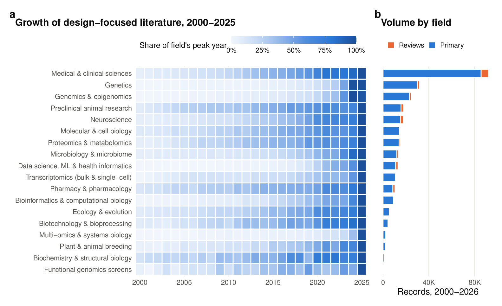

# Designing Experiments in Biology — From Question to Protocol

> A question-first course in experimental design for the life sciences: from the
> bench to the field, the sequencer, the clinic and the computer. Written for
> students who want their experiments to answer the question they were meant to
> answer — and to explain and defend their design choices.

---

## Why this course exists

Statistics can rescue a noisy experiment. It cannot rescue a badly designed one.
If every treated sample was sequenced on Monday and every control on Friday, no
software on earth can tell you whether the difference is biology or Monday.
Most of the failures that make papers irreproducible — fake sample sizes,
confounded batches, underpowered studies, leaky machine-learning splits — are
locked in **before the first measurement is taken**.

Most courses teach design discipline by discipline: agronomists learn blocks and
plots, clinicians learn allocation concealment, genomicists learn batches and
sequencing depth, data scientists learn train/test splits. This course starts
from a different observation:

> **The research question — not the discipline — determines the design.**
> A plant breeder ranking 500 lines and a scientist running a genome-wide CRISPR
> screen are solving the *same* design problem. Learn the problem once, and you
> can design in any field.

So the course first teaches a small toolkit that works everywhere, then a map of
**eight kinds of research question**, then shows how each field applies the map.

## Who it is for

- **Senior undergraduate and graduate students** in molecular biology, biotechnology,
  microbiology, biochemistry, pharmacy, plant and animal science, genetics,
  genomics, bioinformatics, data science, medicine and neuroscience.
- **Early-career researchers** planning their first independent experiments, grant
  proposals or theses.
- **Reviewers and supervisors** who want a shared vocabulary for critiquing designs.

**Prerequisites:** basic statistics (means, variability, *p*-values). If those are
shaky, the companion course
[📘 *Statistics for Biologists — Thinking Like a Scientific Reviewer*](https://github.com/MdRasheduz-zaman/biostatistics)
covers them; this course links to its chapters wherever a statistical idea is
needed rather than re-teaching it.

---

## How each chapter works

Most teaching chapters follow the same rhythm; the capstone and appendices adapt it
to their purpose:

| Section | What it does |
|---|---|
| 🧭 **Learning Objectives** | What you will be able to *do* after the chapter |
| 🎯 **The Big Picture** | Why the topic exists and what problem it solves |
| 🧠 **Core Intuition** | The idea in plain language, through stories and analogies |
| 👁️ **Visual Intuition** | Diagrams, tables and Mermaid figures |
| 🔬 **Worked Example** | A concrete design worked step by step, with real numbers |
| ⚠️ **Common Misconceptions** | A two-column table: each trap on the left, what is actually true (and what to do) on the right |
| 🧪 **Spot the Flaw** | A short, flawed study for you to diagnose (diagnosis hidden) |
| 🔎 **The Reviewer's Perspective** | The questions an expert asks of a design |
| 🛠️ **Design Challenges** | Three realistic scenarios from different fields, graded ⭐–⭐⭐⭐, for you to design; each hidden model design includes a diagram of the layout |
| ✅ **Check Your Understanding** | Questions in three levels: ⭐ recall · ⭐⭐ apply · ⭐⭐⭐ design |
| 📝 **Sample Answers & Assessment** | Illustrative first-attempt answers, with feedback and indicative scores |
| 🧾 **Chapter Summary** | Key ideas and traps on one screen, plus a 📇 **Design Card** |
| 🔗 **Go Deeper** | Links into the biostatistics course and DOI-linked references |

### How to study with this course

1. **Read the objectives first.** They tell you what to look for.
2. **Try before you peek.** Spot-the-Flaw diagnoses, model designs and sample
   answers are inside collapsible ▶ blocks. Commit to an answer — in writing — before
   opening them. Retrieval and commitment are what make ideas stick.
3. **Grade yourself with the rubric**, not just the answer. The sample answers are
   *illustrative first attempts*, not collected student responses. Their scores are
   feedback examples, not a validated grading scale. Some are fully right and some subtly
   wrong, to show where reasoning usually slips. Being marked 7/10 and learning why teaches more
   than reading a perfect solution.
4. **Fill in the 📇 Design Card** for a project of your own at the end of each
   chapter. By the capstone you will have a complete design for it.

---

## From reading to a defensible project

Use one project throughout the course. Select a pathway below; the field playbooks
are choices, so you do not need to read all nine to complete a first design.

| Stage | Read | Produce before moving on |
|---|---|---|
| Frame | 1–2 | One precise question: population, contrast, outcome, time and quantity to estimate |
| Map | 3–5 | A hierarchy of units and a group × batch table; distinguish assignment from biological/run replication |
| Design | 6–8 | Controls tied to alternatives, treatment layout, and a size justification with sensitivity checks |
| Specialize | Relevant chapters in 9–15 and one playbook in 16–24 | Revise the plan for its sampling, causal, prediction, screening or measurement assumptions |
| Commit | 25 and Appendix B | Analysis plan with missing-data, multiplicity and stopping rules; completed Design Card |
| Defend and revise | 26 | A 3–5 page dossier, peer review and a written response showing revisions |

**For independent study:** at each stage, explain the plan aloud without the chapter
open, then solve one challenge from a different field. Return to an earlier question
at the next study session. If you can repeat the slogan but cannot draw the layout,
revisit the worked example.

**For teaching:** use class time to compare two plausible designs under the same budget.
Ask students to state their trade-off and what evidence would change their choice.
Assess the artifacts above and the capstone reasoning, rather than the Q-number alone.

**Depth options:** all readers should understand the question, units and safeguards.
R calculations, model formulas and specialist references are a second pass for readers
who need to implement an analysis. Basic means, variability and confidence intervals
are useful prerequisites; R experience is optional for the main course and needed for
the hands-on sub-courses. Biology primers introduce unfamiliar terminology.

## Table of Contents

### Part I — Thinking Before Doing
- [Chapter 1 — Why Design Comes First](chapters/01-why-design-comes-first.md)
- [Chapter 2 — Start With the Question: Eight Kinds of Research Question](chapters/02-start-with-the-question.md)

### Part II — The Core Toolkit
- [Chapter 3 — The Experimental Unit and Replication](chapters/03-experimental-unit-and-replication.md)
- [Chapter 4 — Randomization, Blinding and Allocation Concealment](chapters/04-randomization-and-blinding.md)
- [Chapter 5 — Blocking, Batches and Nuisance Variables](chapters/05-blocking-and-batches.md)
- [Chapter 6 — Controls and Comparators](chapters/06-controls-and-comparators.md)
- [Chapter 7 — Treatment Structures: Factorial, Dose–Response, Time-Course, Split-Plot](chapters/07-treatment-structures.md)
- [Chapter 8 — Sample Size, Power and Precision](chapters/08-sample-size-and-power.md)

### Part III — Designs by Question Type
- [Chapter 9 — Descriptive and Exploratory Studies (Q1)](chapters/09-descriptive-studies.md)
- [Chapter 10 — Comparative and Mechanistic Experiments (Q2, Q3)](chapters/10-comparative-and-mechanistic.md)
- [Chapter 11 — Observational and Causal Designs (Q4)](chapters/11-observational-and-causal.md)
- [Chapter 12 — Predictive Studies and Data Splits (Q5)](chapters/12-predictive-studies.md)
- [Chapter 13 — Optimization: Design of Experiments and Response Surfaces (Q6)](chapters/13-optimization-doe.md)
- [Chapter 14 — Screening Designs (Q7)](chapters/14-screening-designs.md)
- [Chapter 15 — Measurement, Validation and Benchmarking (Q8)](chapters/15-measurement-and-benchmarking.md)

### Part IV — Field Playbooks
- [Chapter 16 — Molecular and Cell Biology, Biochemistry](chapters/16-molecular-cell-biochemistry.md)
- [Chapter 17 — Microbiology and the Microbiome](chapters/17-microbiology-microbiome.md)
- [Chapter 18 — Biotechnology, Bioprocess and Pharmacy](chapters/18-biotech-bioprocess-pharmacy.md)
- [Chapter 19 — Plant and Animal Breeding, Field Trials](chapters/19-breeding-and-field-trials.md)
- [Chapter 20 — Genetics, Genomics and Transcriptomics](chapters/20-genetics-genomics-transcriptomics.md)
- [Chapter 21 — Proteomics, Metabolomics and Multi-Omics](chapters/21-proteomics-metabolomics-multiomics.md)
- [Chapter 22 — Bioinformatics, Computational Biology and Data Science](chapters/22-computational-and-data-science.md)
- [Chapter 23 — Clinical and Preclinical (Animal) Research](chapters/23-clinical-and-preclinical.md)
- [Chapter 24 — Neuroscience](chapters/24-neuroscience.md)

### Part V — From Plan to Paper
- [Chapter 25 — Pre-registration, Analysis Plans and Reporting Guidelines](chapters/25-preregistration-and-reporting.md)
- [Chapter 26 — Capstone: The Design Clinic](chapters/26-capstone-design-clinic.md)

### Hands-on sub-courses
- 🌾 [**Field Experiments in Agriculture & Plant Breeding**](subcourses/field-trials/README.md) — 10 modules: uniformity trials, RCBD, Latin squares, split-plots, α-designs, augmented/p-rep, spatial analysis, multi-environment trials, planning, capstone. Real `agridat` data, `desplot` field maps, `FielDHub`/`agricolae` designs, mixed models.
- 📄 [**Design in the Literature: Reading Published Studies Backwards**](subcourses/design-in-the-literature/README.md) — **80 real open-access papers, ten per field**, dissected from their methods sections: what was the unit, what was randomized, does the analysis mirror the layout, and what does the design actually support. The eight modules are breeding and agronomy (now half animal breeding), molecular and cell biology, clinical and preclinical, omics and bioinformatics, ecology and the microbiome, neuroscience, biotechnology and bioprocess, and pharmacy. Between them they cover factorial and α-lattice field layouts, pedigrees and simulated breeding programmes, reagent and biobank validation, pooled screens, concealment and blinding, cluster and stepped-wedge trials, target trial emulation, pseudobulk and ground-truth construction, batch design with bridge channels, split-plots, BACI and space-for-time designs, imperfect detection, screening and response-surface optimization, scale-up, bioequivalence crossovers and stability studies.
- 🩺 [**Clinical-Study Biostatistics: From the Question to a Defensible Report**](subcourses/clinical-trials/README.md) — 8 modules following one intervention study end to end: where statistics enters the trial lifecycle, bias mechanisms and their safeguards, estimands and intention-to-treat, protocol → statistical analysis plan, data quality and provenance, sample size versus noncompliance versus missingness, multiple imputation, repeated-measures models, interim analysis and adaptation, GCP and reporting guidance, preclinical evidence through Phases I–IV, trial layouts (parallel, crossover, cluster, factorial) and the superiority / non-inferiority / equivalence claims, three questions worked from question to discussion in R, and an integrated design clinic.
- *Planned:* bench & cell biology · preclinical animal studies · omics & sequencing · bioprocess & pharmaceutical DoE · data science & ML studies.

### Appendices
- [Appendix A — Glossary](chapters/A1-glossary.md)
- [Appendix B — The Design Card and a One-Page Checklist](chapters/A2-design-card-and-checklist.md)
- [Appendix C — Reporting Guidelines by Study Type](chapters/A3-reporting-guidelines.md)
- [📚 Full reference list](REFERENCES.md)

---

## Suggested paths

Everyone should read **Parts I and II** (Chapters 1–8). Then:

| If you work in… | Read in Part III | Then your playbook |
|---|---|---|
| Wet-lab molecular/cell biology, biochemistry | 10, 15 | 16 |
| Microbiology, microbiome | 9, 10, 11 | 17 |
| Biotechnology, bioprocess, pharmacy | 13, 14, 10 | 18 |
| Plant or animal breeding, agronomy | 14, 12, 10 | 19 |
| Genetics, genomics, transcriptomics | 11, 9, 14 | 20 |
| Proteomics, metabolomics, systems biology | 9, 12 | 21 |
| Bioinformatics, data science, health informatics | 12, 15, 11 | 22 |
| Medicine, pharmacology, animal research | 10, 11, 12 | 23 |
| Neuroscience | 10, 11, 12 | 24 |

Finish with **Part V** and design your own study in the capstone.

## How this course renders

Everything is plain Markdown with ordinary PNG images; readers need no build step.
GitHub supports the collapsible answers and math. Other viewers may display math as
source or handle HTML details differently, while ordinary text and images remain readable.

- **Figures** (`assets/course/`) are generated by `scripts/course/figures.R`; every number they
  show is computed there.
- **Diagrams** are written as Mermaid in `course_src/` and rendered to PNG at build time, so
  viewers that don't support Mermaid still show them. Each page keeps its own copies under
  `figures/diagrams/`; `assets/diagrams/` is only the shared render cache and is not versioned.
- **Math** uses GitHub's LaTeX syntax (e.g. $n_{\text{eff}} = \frac{n}{1+(m-1)\rho}$); viewers
  without math support show the readable source.

## The evidence behind the course

The course is built on a structured review of the experimental-design literature
across the life sciences — 375 primary and secondary sources, each resolved and
checked by DOI, of which 362 are cited in the chapters and sub-courses — and on
simulations whose code is included. The search strategy, the Europe PMC survey,
the screening records and the DOI verification report are all in
[`literature/`](literature/), and every figure and worked number is produced by the
scripts in [`scripts/`](scripts/).

| Path | Content |
|---|---|
| `chapters/` | **the course you read.** Generated — never edit; citations resolved, diagrams rendered |
| `subcourses/` | hands-on sub-courses. Generated. R-based sources are in `subcourses/<name>/rmd/*.Rmd`; Markdown-only sources are in `course_src/subcourses/<name>/` |
| `course_src/` | **the chapter sources you edit.** Citations stay as `[@key]` or `[@key1; @key2]` here; the build resolves them into `chapters/` |
| `assets/` | course figures (`course/`) and the survey figures. `assets/diagrams/` is the local render cache, rebuilt on demand and not in the repository |
| `literature/` | reference list, Crossref verification, BibTeX export (`core_references.bib`), Europe PMC survey and the screening record |
| `data/` | survey counts, screening flow, simulation outputs |
| `scripts/` | everything that produces the above; `scripts/course/` holds the worked-example code |

**Rebuild:** `./run_all.sh` regenerates the literature data, the figures and the
course. To rebuild only the course after editing a chapter: `python3 scripts/07_build_course.py`.

Rendering diagrams needs a one-time `cd tools && npm install`. Because the render cache
(`assets/diagrams/`) is not in the repository, the first build after a fresh clone re-renders every
diagram, which takes several minutes; later builds only render what changed, since each PNG is named
after the hash of its Mermaid source. Edited pages leave their previous renders behind, so
`python3 scripts/07_build_course.py --prune` deletes the ones the current build no longer references.

## Contributing & corrections

Experimental design is unforgiving, and this course aims to be *correct*, not just
readable. If you spot an error — a misleading example, a claim that would not
survive review, a broken link — please open an issue or a pull request, with a
source where possible. New references must be added by DOI to
`literature/core_references.tsv` and verified with `scripts/01_verify_references.py`.

## License

Prose and figures: [CC BY 4.0](https://creativecommons.org/licenses/by/4.0/).
Code: MIT. Share and adapt with attribution.
