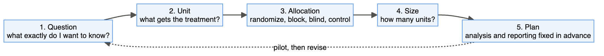
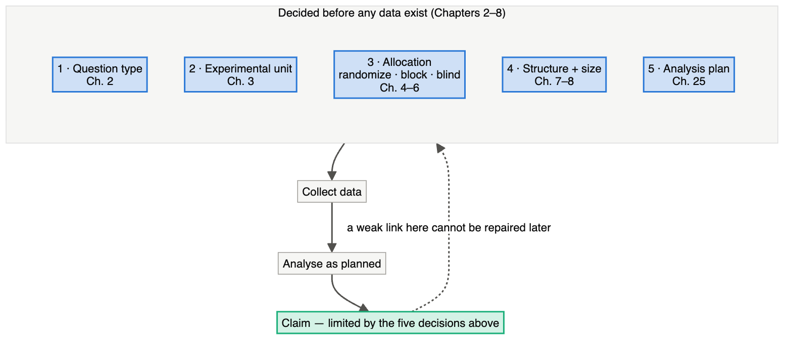
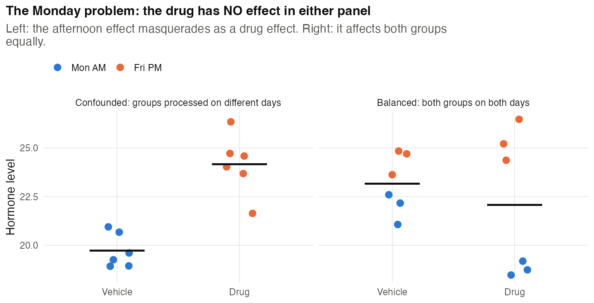
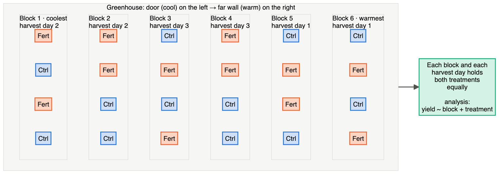
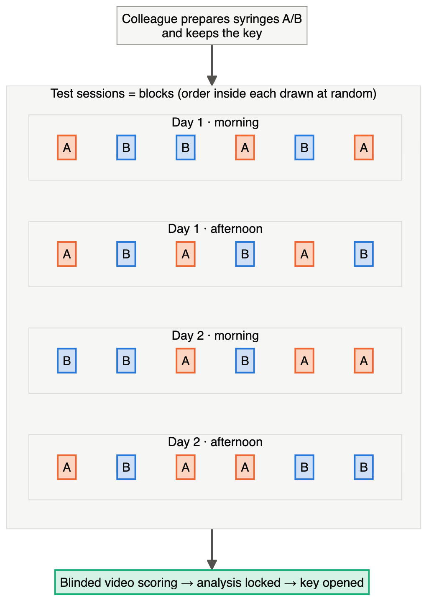
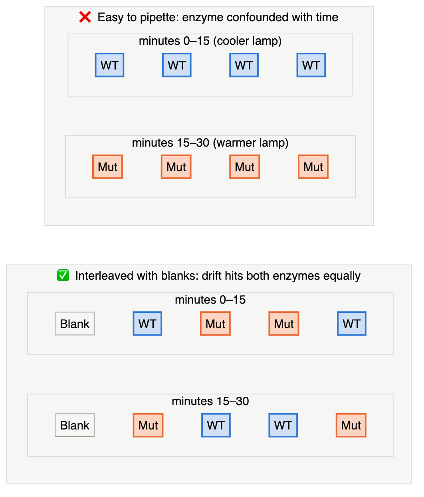
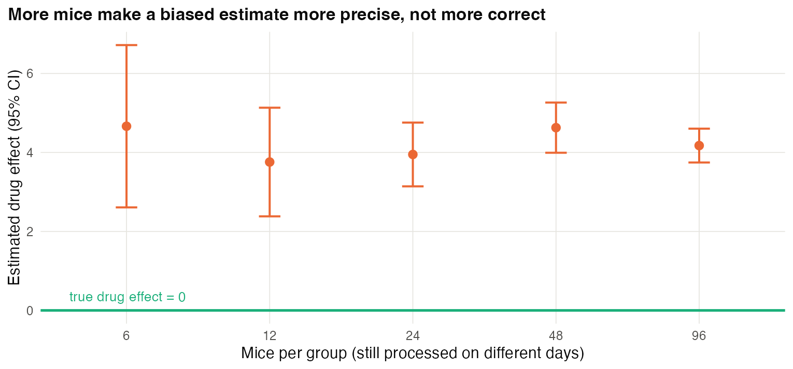

# Chapter 1 — Why Design Comes First

> **Part I — Thinking Before Doing**
> [Table of Contents](../README.md) · [Next: Chapter 2 — Start With the Question →](02-start-with-the-question.md)

---

## 🧭 Learning Objectives

After this chapter you will be able to:

1. Explain why a flawed design cannot be repaired by better statistics.
2. Name the two goals every design decision serves: **unbiased** comparisons and **precise** comparisons.
3. Summarize the evidence that poor design contributes to irreproducible biology.
4. Describe the five-step workflow this course uses: *question → unit → allocation → size → analysis plan*.

---

## 🎯 The Big Picture

An experiment is a machine for answering one question. **Design** is the set of
decisions you make *before* any data exist: what to compare, on what material,
how many times, in what order, measured how, and analysed how. Statistics comes
afterwards and can only work with what the design gives it.

A useful way to say it:

> **Analysis can recover information that the design captured. It cannot create
> information that the design never captured.**

If every treated sample was processed on Monday and every control on Friday, the
treatment effect and the Monday effect are welded together. No test, model or AI
tool can separate them, because the data contain no comparison of Monday-treated
with Monday-control samples. The only cure is to redo the experiment.

---

## 🧠 Core Intuition

### Two goals behind every decision

Every design decision in this course serves one of two goals:

| Goal | Plain meaning | Main tools |
|---|---|---|
| **Unbiased** (validity) | The difference you see is caused by the factor you study, not by something travelling with it | randomization, blinding, blocking, controls |
| **Precise** (efficiency) | The difference is estimated tightly enough to be useful | replication, blocking, good measurement, efficient treatment structures |

A biased experiment is *confidently wrong*. An imprecise experiment is *vaguely
right*. Good design aims for neither.

### Why it matters: the reproducibility evidence

These are not hypothetical worries. When industry scientists tried to confirm
published preclinical findings, published data were fully in line with in-house
results in only about 20–25% of projects at Bayer ([Prinz et al., 2011](https://doi.org/10.1038/nrd3439-c1)), and Amgen confirmed
only 6 of 53 "landmark" cancer studies ([Begley & Ellis, 2012](https://doi.org/10.1038/483531a)). A systematic replication of
cancer-biology experiments found replication effect sizes that were, on median,
85% smaller than the originals ([Errington et al., 2021](https://doi.org/10.7554/elife.71601)). Most surveyed researchers report
having failed to reproduce someone else's experiment ([Baker, 2016](https://doi.org/10.1038/533452a)), and the cost of
irreproducible preclinical research in the USA alone was estimated at about
US\$28 billion per year ([Freedman et al., 2015](https://doi.org/10.1371/journal.pbio.1002165)).

The causes are many, but the same few design problems recur:

- **Too few independent replicates** → low power and inflated effects ([Button et al., 2013](https://doi.org/10.1038/nrn3475)).
- **No randomization or blinding** → systematically larger reported effects ([Crossley et al., 2008](https://doi.org/10.1161/strokeaha.107.498725); [Landis et al., 2012](https://doi.org/10.1038/nature11556)).
- **Treatment confounded with processing batch** ([Leek et al., 2010](https://doi.org/10.1038/nrg2825)).
- **Flexible analysis decided after seeing the data** ([Simmons et al., 2011](https://doi.org/10.1177/0956797611417632)).
- **Misidentified materials** such as cross-contaminated cell lines ([Horbach & Halffman, 2017](https://doi.org/10.1371/journal.pone.0186281)).

Every one of these is fixed — or locked in — at the design stage.

### The workflow of this course



Chapters 2–8 take these steps one at a time. Chapters 9–15 show how the steps
change with the *type* of question. Chapters 16–24 show how each field applies them.

---



## 👁️ Visual Intuition

Two ways to process 12 samples in two sequencing runs:

```
CONFOUNDED                          BALANCED (blocked + randomized)
Run 1: C C C C C C                  Run 1: C T T C T C
Run 2: T T T T T T                  Run 2: T C C T C T
→ "treatment" = "run 2"             → every run contains both groups;
→ unanswerable                        run effect can be estimated and removed
```

Same samples, same cost, same sequencer. One design answers the question; the
other cannot.

---

## 🔬 Worked Example — the Monday problem, in numbers

A lab measures a stress-hormone level in 12 mice: 6 given a drug, 6 given vehicle.
To save time, all vehicle mice are dissected on Monday morning and all drug mice
on Friday afternoon.

Suppose the hormone has a daily rhythm, and afternoon levels are on average
**4 units higher** than morning levels — a fact unknown to the lab. Suppose also
that the drug truly has **no effect**.

| | Monday morning | Friday afternoon |
|---|---|---|
| Vehicle mice | mean ≈ 20 | — |
| Drug mice | — | mean ≈ 24 |

The analysis reports "drug raises hormone by 4 units, *p* < 0.01". The statistics
are correct; the conclusion is false. The data contain **no information** that
could separate drug from time of day, because those two factors never vary
independently.

**The fix costs nothing.** Dissect three vehicle and three drug mice on each day,
in random order within each session. Time-of-day now affects both groups equally,
and it can be estimated as a block effect (Chapter 5).



*Simulated data, no true drug effect. Code: scripts/course/figures.R.*


---

## ⚠️ Common Misconceptions

| ❌ The misconception | ✅ What is actually true — and what to do |
|---|---|
| **"We'll fix it in the analysis."** | You can adjust for a nuisance factor only if it varies *independently* of the treatment. Perfect confounding cannot be adjusted away. |
| **"Design is only for clinical trials."** | The same principles govern a qPCR plate, a field trial, a sequencing run and a train/test split. |
| **"A small *p*-value means a good experiment."** | A *p*-value measures surprise under a model. A biased design produces small *p*-values for the wrong reason. |
| **"More data always helps."** | More *measurements* of the same units add little (Chapter 3). More data from a confounded design just makes you more confident in the wrong answer. |

---

## 🧪 Spot the Flaw

> A student compares gene expression in tumours versus normal tissue. Tumour samples
> come from a hospital biobank, frozen for 5–10 years; normal samples were collected
> last month from healthy volunteers. RNA from all 40 samples is sequenced in one
> run. 2,300 genes differ (FDR < 5%). The student concludes these genes drive cancer.

<details>
<summary>▶ Diagnosis (try first)</summary>

Three problems, in order of severity:

1. **Tissue status is confounded with storage time and collection source.** RNA
   degrades with long storage; biobank and volunteer samples differ in handling,
   ischaemia time and donor characteristics. Many of the 2,300 genes may reflect
   degradation or handling, not cancer.
2. **"Drive cancer" is a causal, mechanistic claim** from a descriptive comparison
   (Chapter 2). Expression differences can be consequences of cancer, not causes.
3. Sequencing everything in one run was good — but it does not remove confounding
   that happened *before* the sequencer.

**Better design:** matched tumour and adjacent normal tissue from the *same*
patients, collected and stored identically (pairing removes donor effects), plus a
claim limited to "associated with" until perturbation experiments test causality.
</details>

---

## 🔎 The Reviewer's Perspective

A reviewer reading any Methods section asks five questions, mirroring the workflow:

1. **What exactly is the question** — and does the design answer *that* question?
2. **What is the experimental unit**, and is *n* counted in those units?
3. **How were units allocated** to groups — randomly? blinded? blocked?
4. **Why this sample size?** Is there a justification, or is it habit?
5. **Was the analysis planned in advance**, and does it match the design?

If you can answer all five in one sentence each, your design is probably sound.

---

## 🛠️ Design Challenges

Three scenarios from different fields. Sketch your design on paper first, then open the
model answer — each one includes a diagram of the layout.

### Challenge 1 · Plant science · ⭐ — fertilizer in a greenhouse

You want to test whether a new fertilizer increases tomato yield. You have one
greenhouse with 24 benches. The benches near the door are cooler. You can harvest
only 8 benches per day.

Sketch a design: which benches get fertilizer, and in what order do you harvest?

<details>
<summary>▶ A model design</summary>

- **Unit:** the bench (fertilizer is applied per bench).
- **Blocking:** group benches into 6 blocks of 4 by distance from the door, so each
  block is roughly uniform in temperature. In each block, randomly assign 2 benches
  to fertilizer and 2 to control.
- **Harvest order:** harvest 2 complete blocks per day (so each day has 4 + 4), in
  random order within the day. Harvest day is then balanced across treatments.
- **Blinding:** the person weighing fruit should not know the treatment.
- **Analysis:** compare treatments within blocks (block as a factor in the model).



The positions inside each block and the order of harvest days were drawn at random
(seeded); a "tidy" alternating pattern would be easier to remember but could line up
with a draught or an irrigation line.
</details>

### Challenge 2 · Behavioural pharmacology · ⭐⭐ — anxiety test over two days

You will test whether a drug reduces anxiety-like behaviour in mice (time spent in the
open arms of an elevated plus maze). You have 24 mice. One experimenter can test
12 mice per day, 6 in the morning and 6 in the afternoon, and mouse behaviour differs
between morning and afternoon. Design the allocation, the testing order and the blinding.

<details>
<summary>▶ A model design</summary>

- **Unit:** the mouse (each is injected and tested individually; house mice so that each
  cage contains both treatments, or treat cage as a block — Chapter 3).
- **Blocks:** the four test sessions (day 1 AM, day 1 PM, day 2 AM, day 2 PM). Each
  session gets **3 drug + 3 vehicle** in random order, so time of day and day are
  balanced across treatments instead of confounded with them.
- **Blinding and concealment:** a colleague prepares identical syringes labelled **A** and
  **B** and keeps the key; the experimenter and the video scorer see only the codes.
- **Pre-specify** the primary outcome (% time in open arms, automated tracking), the
  exclusion rule (e.g. mouse falls off the maze) and the analysis
  `open_time ~ session + treatment`.


</details>

### Challenge 3 · Biochemistry · ⭐⭐ — a drifting plate reader

You want to know whether a point mutation lowers an enzyme's activity. You have purified
**3 independent preparations** of the wild-type (WT) enzyme and 3 of the mutant, and you
will measure each preparation in 4 wells. The plate reader's lamp warms up, so readings
drift upward over the 30 minutes it takes to read the plate. Your colleague suggests
"WT in the first half, mutant in the second half — it's easier to pipette".

<details>
<summary>▶ A model design</summary>

- **Unit:** the **protein preparation** (n = 3 per enzyme). The 4 wells per prep are
  technical replicates — average them.
- **The colleague's layout confounds enzyme with time:** any drift adds to the mutant only,
  biasing the comparison in one direction. More wells would not fix it — they would make a
  *biased* answer look *precise* (Chapter 1's two goals).
- **Fix:** interleave — read the 24 wells in a randomized order, or in balanced pairs
  (WT, mutant, mutant, WT, …), and include **blank wells** at the start, middle and end to
  measure the drift.
- **Better still:** start the reaction with a multichannel pipette in a randomized column
  order and read kinetically (rates rather than single endpoints), which is less sensitive
  to a slow baseline drift.


</details>

---

## ✅ Check Your Understanding

**⭐ Q1.** What are the two goals every design decision serves?

**⭐ Q2.** Why can't statistical adjustment fix a perfectly confounded design?

**⭐⭐ Q3.** In the Monday problem, would doubling the number of mice to 24 (12 per
group, still processed by group on different days) fix the problem? Why or why not?

**⭐⭐ Q4.** Give one example of a design decision that improves *validity* and one
that improves *precision*.

**⭐⭐⭐ Q5.** Your PI says, "Just run the controls first so we can check the assay
works, then run the treated samples." How do you respond, and what would you propose?

---

## 📝 Sample Answers & Assessment

<details>
<summary>▶ Show sample answers (attempt the questions first)</summary>

> **Q1 — Sample answer:** *"Accuracy and precision."* — **✔ 8/10.** Right idea, but be
precise: "unbiasedness (validity)" and "precision (efficiency)". "Accuracy" is often
used to mean both, which is exactly the confusion we want to avoid.

> **Q2 — Sample answer:** *"Because the confounder and the treatment change together,
so there is no data where one changes without the other."* — **✔ 10/10.** This is the
heart of it: adjustment needs variation in the treatment *within* levels of the
confounder.

> **Q3 — Sample answer:** *"Yes, more mice gives more power."* — **✘ 2/10.** More mice
make the estimate more *precise*, but it stays *biased*: you get a tighter
confidence interval around the wrong answer. Bias is not reduced by sample size.




> **Q4 — Sample answer:** *"Validity: randomizing which mice get the drug. Precision:
using more biological replicates."* — **✔ 10/10.** Bonus: blocking serves both.

> **Q5 — Sample answer:** *"Run them all together."* — **◑ 5/10.** Correct direction,
but incomplete. A strong answer: running groups in sequence confounds treatment
with time (reagent ageing, instrument drift, operator fatigue). Instead, run a
**small pilot** (a few controls plus a positive control) to check the assay; then run
the main experiment with treated and control samples **interleaved in random
order** within each session.

**Rubric:** full marks require naming *the mechanism* (confounding, bias versus
precision), not just the right action.
</details>

---

## 🧾 Chapter Summary

| Concept | One-line takeaway |
|---|---|
| **Design vs analysis** | Analysis recovers information; only design creates it. |
| **Two goals** | Unbiased (validity) and precise (efficiency). |
| **Confounding** | Two factors that always change together cannot be separated afterwards. |
| **The evidence** | Low replication, missing randomization/blinding and batch confounding recur in irreproducible work. |
| **Workflow** | Question → unit → allocation → size → plan. |

**Traps to remember:** "we'll fix it later" · more samples don't cure bias · design
applies to every field, not just trials.

### 📇 Your Design Card (start it now)

Pick a real or planned experiment of your own and write one line for each:

| Field | Your answer |
|---|---|
| Question (one sentence) | |
| What would change your mind? | |
| Known nuisance factors (day, batch, operator, position…) | |

You will add to this card in every chapter. The full template is in
[Appendix B](A2-design-card-and-checklist.md).

---

## 🔗 Go Deeper

- 📘 Biostat course: [Ch. 30 — Principles of Experimental Design & Power](https://github.com/MdRasheduz-zaman/biostatistics/blob/main/chapters/30-experimental-design.md) · [Ch. 37 — Evidence Hierarchies](https://github.com/MdRasheduz-zaman/biostatistics/blob/main/chapters/37-evidence-hierarchies.md) · [Ch. 38 — Scientific Reasoning Failure Modes](https://github.com/MdRasheduz-zaman/biostatistics/blob/main/chapters/38-failure-modes.md)
- Textbooks for the whole course: ([Lazic, 2016](https://doi.org/10.1017/9781139696647); [Ruxton & Colegrave, 2016](https://doi.org/10.1093/hesc/9780198717355.001.0001); [Mead et al., 2012](https://doi.org/10.1017/cbo9781139020879))

## 📚 References cited in this chapter

- Baker M (2016). 1,500 scientists lift the lid on reproducibility. *Nature* 533:452-454. [doi:10.1038/533452a](https://doi.org/10.1038/533452a)
- Begley CG, Ellis LM (2012). Raise standards for preclinical cancer research. *Nature* 483:531-533. [doi:10.1038/483531a](https://doi.org/10.1038/483531a)
- Button KS, Ioannidis JPA, Mokrysz C, Nosek BA, Flint J, Robinson ESJ, et al. (2013). Power failure: why small sample size undermines the reliability of neuroscience. *Nature Reviews Neuroscience* 14:365-376. [doi:10.1038/nrn3475](https://doi.org/10.1038/nrn3475)
- Crossley NA, Sena E, Goehler J, Horn J, van der Worp B, Bath PMW, et al. (2008). Empirical Evidence of Bias in the Design of Experimental Stroke Studies. *Stroke* 39:929-934. [doi:10.1161/strokeaha.107.498725](https://doi.org/10.1161/strokeaha.107.498725)
- Errington TM, Mathur M, Soderberg CK, Denis A, Perfito N, Iorns E, et al. (2021). Investigating the replicability of preclinical cancer biology. *eLife* 10:e71601. [doi:10.7554/elife.71601](https://doi.org/10.7554/elife.71601)
- Freedman LP, Cockburn IM, Simcoe TS (2015). The Economics of Reproducibility in Preclinical Research. *PLOS Biology* 13:e1002165. [doi:10.1371/journal.pbio.1002165](https://doi.org/10.1371/journal.pbio.1002165)
- Horbach SPJM, Halffman W (2017). The ghosts of HeLa: How cell line misidentification contaminates the scientific literature. *PLOS ONE* 12:e0186281. [doi:10.1371/journal.pone.0186281](https://doi.org/10.1371/journal.pone.0186281)
- Landis SC, Amara SG, Asadullah K, Austin CP, Blumenstein R, Bradley EW, et al. (2012). A call for transparent reporting to optimize the predictive value of preclinical research. *Nature* 490:187-191. [doi:10.1038/nature11556](https://doi.org/10.1038/nature11556)
- Lazic SE (2016). Experimental Design for Laboratory Biologists. *Cambridge University Press*. [doi:10.1017/9781139696647](https://doi.org/10.1017/9781139696647)
- Leek JT, Scharpf RB, Bravo HC, Simcha D, Langmead B, Johnson WE, et al. (2010). Tackling the widespread and critical impact of batch effects in high-throughput data. *Nature Reviews Genetics* 11:733-739. [doi:10.1038/nrg2825](https://doi.org/10.1038/nrg2825)
- Mead R, Gilmour SG, Mead A (2012). Statistical Principles for the Design of Experiments. *Cambridge University Press*. [doi:10.1017/cbo9781139020879](https://doi.org/10.1017/cbo9781139020879)
- Prinz F, Schlange T, Asadullah K (2011). Believe it or not: how much can we rely on published data on potential drug targets?. *Nature Reviews Drug Discovery* 10:712-712. [doi:10.1038/nrd3439-c1](https://doi.org/10.1038/nrd3439-c1)
- Ruxton GD, Colegrave N (2016). Experimental Design for the Life Sciences. *Oxford University Press*. [doi:10.1093/hesc/9780198717355.001.0001](https://doi.org/10.1093/hesc/9780198717355.001.0001)
- Simmons JP, Nelson LD, Simonsohn U (2011). False-Positive Psychology. *Psychological Science* 22:1359-1366. [doi:10.1177/0956797611417632](https://doi.org/10.1177/0956797611417632)


---

[Table of Contents](../README.md) · [Next: Chapter 2 — Start With the Question →](02-start-with-the-question.md)
