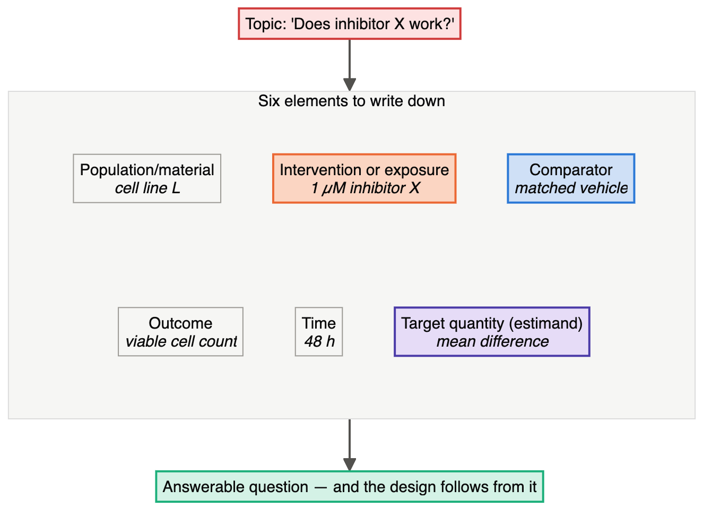
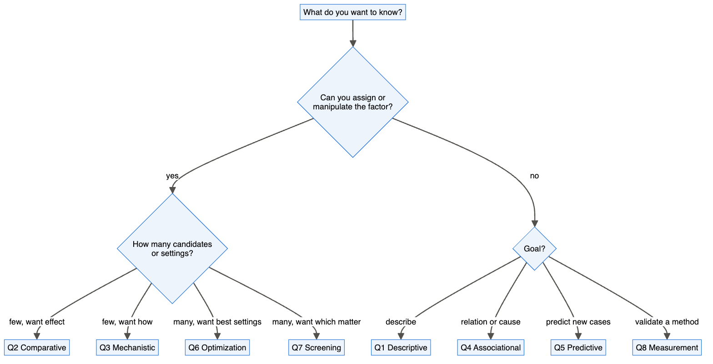
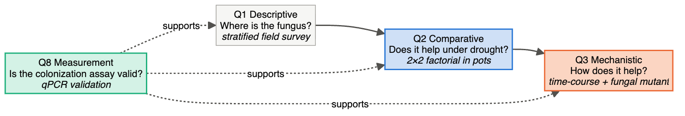
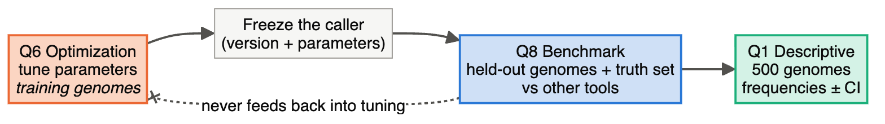

# Chapter 2 — Start With the Question: Eight Kinds of Research Question

> **Part I — Thinking Before Doing**
> [← Chapter 1](01-why-design-comes-first.md) · [Table of Contents](../README.md) · [Next: Chapter 3 — The Experimental Unit →](03-experimental-unit-and-replication.md)

---

## 🧭 Learning Objectives

After this chapter you will be able to:

1. Use **eight question types** to identify the main aim and overlapping aims of a biological study.
2. Name the design family, the main threat to validity and the key safeguard for each type.
3. Recognize **question–design mismatches**, such as causal claims from a predictive model.
4. Break a multi-stage project into a chain of question types.

---

## 🎯 The Big Picture

Disciplines differ in organisms, instruments and jargon. The *logical forms* of
their questions are surprisingly few. A plant breeder ranking 500 wheat lines and a
cell biologist running a genome-wide CRISPR screen are both asking **"which of many
candidates matter?"** A pharmacist tuning a tablet formulation and an engineer
tuning a fermentation medium are both asking **"which settings work best?"**

Naming the *type* narrows the design choices. You still need a target population,
a precise outcome and contrast, feasible units, and assumptions suited to the claim.
The eight types are a planning map, not an exhaustive or mutually exclusive taxonomy.

> **Rule of thumb:** If you cannot say which question type you are asking, you are
> not ready to design the experiment.

---

## 🧠 Core Intuition — the eight question types

| # | Type | The question | Typical designs | Biggest threat → safeguard |
|---|---|---|---|---|
| **Q1** | **Descriptive** | *What is there, and how does it vary?* | atlases, surveys, cohorts, phenotyping | unrepresentative sampling → define the target population, stratify |
| **Q2** | **Comparative** | *Does changing X change Y?* | randomized experiments, RCTs, factorial designs | confounding, pseudoreplication → randomize, block, count the right unit |
| **Q3** | **Mechanistic** | *How does X produce Y?* | dose–response, time-course, rescue, epistasis | alternative explanations → orthogonal perturbations, rescue controls |
| **Q4** | **Associational/causal from observation** | *Is X related to Y in a population — causally?* | cohort, case–control, GWAS, Mendelian randomization, target-trial emulation | confounding, selection → explicit causal model, instruments, replication cohort |
| **Q5** | **Predictive** | *Can we predict Y for new cases?* | train/validation/test, external validation | leakage, overfitting → split by independent unit, lock the test set |
| **Q6** | **Optimization** | *Which settings maximize Y?* | factorial screening → response surface; Bayesian optimization | local optima, aliasing → sequential designs, confirmation runs |
| **Q7** | **Screening** | *Which of many candidates matter?* | compound/CRISPR screens, variety trials, fractional factorials | false discoveries, plate effects → controls on every plate, FDR, staged confirmation |
| **Q8** | **Measurement** | *Is the assay or method valid?* | ring trials, agreement studies, benchmarks | optimistic self-assessment → ground truth, neutrality, many datasets |

### Turn a topic into an answerable contrast

“Does inhibitor X work?” is a topic. “In cell line L, does 48 h of 1 µM inhibitor X,
compared with matched vehicle, reduce viable cell count?” is an answerable question.

Before choosing a design, write **population/material + intervention or exposure +
comparator + outcome + time + target quantity**. The target quantity (an *estimand*)
might be a mean difference, risk difference or prediction error in a specified setting.
For this example it is the mean difference in viable cell count at 48 h. ATP signal,
cell count and tumour survival are different outcomes and support different claims.

> **Your turn:** rewrite one aim of your own using these six elements. Underline what
> you would actually measure and circle the comparison you want to estimate.

### Projects are chains of questions

Real projects rarely ask a single question. They move from one type to the next, and
**every move changes the design you need**. Let us walk through one project together, from
the first pipette to the last figure. Treat it as a map of this course: nearly every chapter
you will read later is one stage of this story.

> **Your project.** You have joined a cancer-pharmacology lab. A targeted drug — call it
> **inhibitor X** — shrinks tumours at first, but cells eventually grow back. Your
> supervisor asks: *"Which genes let the cells survive inhibitor X, and can we do anything
> about it?"*

That one sentence hides eight different questions. Below, each stage says what you actually
*do* (the bench work and the technology), what you *analyse*, and the design decision that
makes or breaks it.

#### Stage 0 · Q8 Measurement — can you even tell dead cells from live ones?

Before any screening, you need a readout you trust. You measure cell viability (say, an
ATP-based luminescence assay) on plates containing untreated cells and cells killed by a
reference compound, then compute the **Z′ factor** — a number that tells you whether the
signal window is big enough to call hits (Chapter 14). You check the dose–response of
inhibitor X on your cells and pick the concentration that kills most but not all of them,
because a dose that kills everything leaves no survivors to study.

*You decide:* assay, concentration, incubation time, plate layout. *Analysis:* 4-parameter
logistic curve → IC₅₀; Z′ per plate. *Trap:* a noisy assay makes every later stage
meaningless — see [Ch. 15](15-measurement-and-benchmarking.md) and [Ch. 16](16-molecular-cell-biochemistry.md).

#### Stage 1 · Q7 Screening — which of 19,000 genes matter?

Now you look genome-wide. You infect your cells with a pooled CRISPR knockout library so
that each cell loses one gene, keep the population large enough that every guide is carried
by hundreds of cells, and split it into a drug arm and a vehicle arm. After a few weeks you
sequence the guides remaining in each arm: guides that become **enriched** under the drug
mark genes whose loss helps cells survive.

*You decide:* library, coverage, number of independent transductions, length of treatment.
*Analysis:* guide counts → gene-level enrichment statistics → FDR. *Trap:* a hit list is a
**list of candidates, not a list of findings** — [Ch. 14](14-screening-designs.md).

#### Stage 2 · Q2 Comparative — do the top hits survive a fair test?

Some hits will fail confirmation; the proportion depends on assay quality, effect
sizes and selection thresholds. You take the top candidates — let us follow one, **gene G** —
and test them one at a time: knock out gene G with **two independent guide RNAs** (plus a
non-targeting guide), confirm the protein is gone by western blot, and compare growth under
inhibitor X with growth under vehicle. Each experiment is repeated on separate days from
fresh thaws.

*You decide:* guides, controls, how many independent experiments, who is blinded.
*Analysis:* viability per well → one value per experiment → treatment × genotype
interaction. *Trap:* counting wells instead of experiments — [Ch. 3](03-experimental-unit-and-replication.md),
[Ch. 6](06-controls-and-comparators.md).

#### Stage 3 · Q3 Mechanistic — *how* does losing gene G help the cells?

Confirming that something happens is not explaining it. You run a time-course of signalling
after adding the drug (western blots or phospho-proteomics), compare transcriptomes of
knockout and control cells by RNA-seq, and do the decisive control: **put gene G back**
(a guide-resistant copy) and show the resistance disappears.

*You decide:* time points, which pathway readouts, the rescue construct. *Analysis:* paired
RNA-seq with the experiment as a block; pathway enrichment; dose–response shifts.
*Trap:* a single perturbation never pins down a mechanism — [Ch. 10](10-comparative-and-mechanistic.md),
[Ch. 20](20-genetics-genomics-transcriptomics.md).

#### Stage 4 · Q6 Optimization — what is the best drug combination?

If losing gene G causes resistance, perhaps a second drug that blocks the same pathway
restores sensitivity. Now the question is about *settings*: which pair of concentrations,
in which ratio, for how long. You lay out a concentration grid of the two drugs
(a factorial), fit a response surface and ask whether the combination does better than
either drug alone.

*You decide:* concentration ranges, grid, replicates, run order. *Analysis:* response-surface
model; synergy metrics; confirmation runs at the predicted optimum. *Trap:* changing one
factor at a time misses the interaction you are looking for — [Ch. 7](07-treatment-structures.md),
[Ch. 13](13-optimization-doe.md).

#### Stage 5 · Q2 again, in animals — does it hold outside the dish?

Cells in plastic are not tumours. You move to a mouse model: animals are randomized to
vehicle, inhibitor X, the second drug, or the combination, with cage and sex as blocks, the
person measuring tumours blinded, and a sample size calculated in advance.

*You decide:* model, group sizes, randomization, blinding, humane endpoints.
*Analysis:* tumour growth over time with mouse as the unit. *Trap:* unblinded measurement
and underpowered groups — [Ch. 8](08-sample-size-and-power.md), [Ch. 23](23-clinical-and-preclinical.md).

#### Stage 6 · Q4 Associational — does gene G matter in people?

You turn to public patient data: do tumours that lost gene G relapse sooner? This is
**observational**. People differ in stage, age, treatment history and much else, so you draw
the causal diagram first, decide what to adjust for, and accept that the answer is an
association, not proof.

*You decide:* cohort, eligibility, confounders, time zero. *Analysis:* survival models with
pre-specified covariates; replication in a second cohort. *Trap:* confounding and
adjusting for things on the causal path — [Ch. 11](11-observational-and-causal.md).

#### Stage 7 · Q5 Predictive — can we tell in advance who will respond?

A clinical question: given a tumour's molecular profile, can we predict response? Here you
are not explaining anything, only predicting. You build a model, but you **split patients —
not samples — into training and test sets**, and keep every preprocessing step inside the
cross-validation folds.

*You decide:* features, splitting unit, what is locked away. *Analysis:* nested
cross-validation; external cohort; calibration as well as discrimination.
*Trap:* leakage, which produces beautiful accuracy that vanishes in the clinic —
[Ch. 12](12-predictive-studies.md), [Ch. 22](22-computational-and-data-science.md).

#### The chain, in one picture

Notice what changes along the chain. The **organism or material** changes (plate → dish →
mouse → patient). The **technology** changes (luminescence → sequencing → blots → imaging →
registry data). And the **unit** changes with them: a well, then an independent experiment,
then a mouse, then a person. Chapter 3 is about that last shift, and it is where most
pseudoreplication is born.

Each arrow is a **change of question**, so each stage needs its own design. The
most common errors come from carrying the logic of one stage into the next:

- reading a **screen's hit list** (Q7) as confirmed effects (Q2);
- reading a **predictive model's important features** (Q5) as causes (Q4/Q3);
- reading an **atlas** (Q1) as evidence about mechanism (Q3).

> **Try it on your own project.** Write your aim in one sentence, then split it the way we
> just did: which stage are you actually in right now, and which question type is it? If two
> stages have collapsed into one experiment, you have found your design problem.

### Causal versus non-causal questions

Classify the **claim**, not just its Q-number. Q2 and Q3 usually concern interventions;
Q4 can ask for an association or a causal effect. Q6 can optimize a process by intervention,
or optimize predictions. A randomized Q7 perturbation screen can estimate causal effects
in its tested system, while still requiring confirmation and mechanistic follow-up.
Q1, Q5 and Q8 usually describe, predict or validate measurements. Causal questions need
either randomization or a defensible substitute for it. See
[📘 Biostat Ch. 34 — Causation vs. Prediction](https://github.com/MdRasheduz-zaman/biostatistics/blob/main/chapters/34-causation-vs-prediction.md).

---

## 👁️ Visual Intuition — a decision tree

---

## 🔬 Worked Example — classifying real questions

| Question as stated | Type | Why |
|---|---|---|
| "Which soil bacteria live in organic vs conventional farms?" | Q1 (with a Q4 flavour) | describing communities; farms cannot be randomized to a history |
| "Does knocking out *GENE1* reduce tumour growth in mice?" | Q2 | we assign genotype/treatment |
| "Does GENE1 act through the MAPK pathway?" | Q3 | asks *how*; needs rescue and pathway perturbations |
| "Is coffee intake associated with Parkinson's disease?" | Q4 | cannot randomize lifelong coffee drinking |
| "Can blood proteins predict sepsis 24 h early?" | Q5 | prediction for new patients; causality not required |
| "Which pH, temperature and feed rate maximize antibody titre?" | Q6 | best settings |
| "Which of 1,200 rice lines tolerate drought?" | Q7 | many candidates; most will be discarded |
| "Is the new rapid test as good as PCR?" | Q8 | method agreement/accuracy |

Notice how the **same organism or technology** can appear under different types. The
type depends on what you want to *conclude*, not on what you *measure*.

---

## ⚠️ Common Misconceptions

| ❌ The misconception | ✅ What is actually true — and what to do |
|---|---|
| **"My field determines my design."** | Your *question* does. A genomicist can run a Q2, Q4, Q5 or Q7 study, each with different rules. |
| **"Important features in my classifier are the biological drivers."** | Predictive importance (Q5) is not causal effect (Q2–Q4). |
| **"A screen hit is a finding."** | It is a candidate requiring confirmation. FDR control concerns the expected false fraction in a selected set under assumptions; it is not a known error probability for each hit (Chapter 14). |
| **"Observational data can't say anything causal."** | They can, under explicit assumptions, some of which cannot be fully tested from the data (Chapter 11) — but the design must be built for it. |

---

## 🧪 Spot the Flaw

> A team trains a random-forest model on gut-microbiome profiles to predict obesity
> (AUC = 0.85). The species with the highest importance score is *Bacterium X*. The
> paper's title: "*Bacterium X* causes obesity."

▶ Diagnosis

A **question–design mismatch**: a Q5 (predictive) design used to support a Q2/Q3
(causal) claim. Importance scores show that *Bacterium X* carries predictive
information. It could be a consequence of obesity, of diet, or of medication, or a
marker of something else. A causal claim needs a different design: for example,
colonizing germ-free mice with *Bacterium X* versus a control community (Q2), with
dose and mechanism experiments (Q3), or human evidence with an explicit causal model
(Q4).

---

## 🔎 The Reviewer's Perspective

1. **What is the claim in the title and abstract** — descriptive, causal, predictive?
2. **What question type does the design actually support?**
3. If these differ, the paper over-claims. The fix is usually *rewording the claim* or
   *adding the missing stage*.

---

## 🛠️ Design Challenges

Three projects from different fields. For each, break the aim into a chain of questions,
label each with its type (Q1–Q8), and name a design — then compare with the model answer
and its diagram.

### Challenge 1 · Plant–microbe biology · ⭐ — a fungus and drought

Your thesis project: "Find out whether a soil fungus helps maize tolerate drought,
and how." Break it into a chain of at least three question types, naming one design
for each stage.

▶ A model answer

1. **Q1 Descriptive:** survey fungal abundance in maize roots across fields with
   different drought histories (stratified sampling of fields).
2. **Q2 Comparative:** greenhouse pots: inoculated vs sterile-mock inoculum, crossed
   with watered vs drought (2×2 factorial; pot is the unit; blocks by bench).
3. **Q3 Mechanistic:** time-course of root hydraulic and hormone responses; use a
   fungal mutant lacking a candidate gene as a "rescue-style" comparison.
4. **Q8 Measurement (supporting):** validate the qPCR assay used to quantify fungal
   colonization (efficiency, specificity).

### Challenge 2 · Medical microbiology · ⭐⭐ — "the microbiome causes depression"

A student writes: "I will show that the gut microbiome causes depression." They have access
to stool and questionnaires from a large population cohort, a psychiatry clinic, and a
germ-free mouse facility. Turn this into a chain of answerable questions, and say which
**claim** each stage is allowed to make.

▶ A model answer

1. **Q4 Associational:** in the cohort, is microbiome composition associated with depression
   scores after adjusting for diet, BMI, antidepressants and other medication? (Draw the
   DAG first, Chapter 11.) *Claim allowed:* association — not cause; depression can also
   change diet and medication, so causation may run backwards.
2. **Q2 Comparative (experimental):** transfer stool from patients and matched controls into
   germ-free mice (several donors per group; **donor**, not mouse, is the unit for the
   donor effect; cages balanced). *Claim allowed:* the microbiota of patients is sufficient
   to change behaviour in mice.
3. **Q3 Mechanistic:** test a candidate taxon or metabolite (necessity and sufficiency,
   Chapter 10).
4. **Q5 Predictive (a separate aim):** can microbiome profiles *predict* depression? A good
   classifier says nothing about cause — keep this question apart from the causal ones.

### Challenge 3 · Bioinformatics · ⭐⭐ — a new variant caller

A bioinformatics group writes: "We will develop a better structural-variant caller for
long-read sequencing and use it to describe structural variation in 500 genomes." Split
this into question types and name the design for each stage.

▶ A model answer

1. **Q6 Optimization:** tune the caller's parameters — on **training** genomes only.
2. **Q8 Measurement/benchmarking:** compare the caller with existing tools against a
   curated truth set on **held-out** genomes that were not used for tuning, with
   pre-specified metrics (precision, recall, F1 by variant type and size), the same
   compute budget for each tool, and authors of each tool not tuning only their own
   (Chapter 15).
3. **Q1 Descriptive:** apply the frozen caller to the 500 genomes, sampled to represent the
   population of interest, and report frequencies with confidence intervals.

The order matters: the descriptive claims are only as good as the benchmark, and the
benchmark is only honest if tuning never saw the test genomes.

---

## ✅ Check Your Understanding

**⭐ Q1.** List the eight question types.

**⭐ Q2.** Which question types are causal?

**⭐⭐ Q3.** Classify: "Do patients with high CRP at admission have longer hospital
stays?" Then rephrase it as a Q5 question and as a Q2 question.

**⭐⭐ Q4.** Why is a CRISPR screen hit list not a set of confirmed findings?

**⭐⭐⭐ Q5.** A colleague wants to use 20 years of greenhouse records to "find the best
growing conditions" for a crop. Which question type is this, what is the central
threat, and what would you suggest instead?

---

## 📝 Sample Answers & Assessment

▶ Show sample answers

> **Q1 — Sample answer:** *"Descriptive, comparative, mechanistic, associational,
predictive, optimization, screening, measurement."* — **✔ 10/10.**

> **Q2 — Sample answer:** *"Comparative and mechanistic."* — **◑ 6/10.** Also Q4
(when the aim is causal inference from observation) and Q6 (optimization asks what
*would* happen if settings changed).

> **Q3 — Sample answer:** *"Associational. Q5: can CRP predict long stay? Q2: does
lowering CRP shorten stay?"* — **✔ 10/10.** Excellent — and note the Q2 version needs a
randomized intervention that lowers CRP, which would also test whether CRP is causal or
merely a marker.

> **Q4 — Sample answer:** *"Because some are false positives."* — **◑ 6/10.** True but
shallow. A strong answer adds: screens test thousands of candidates with little
replication, so a known fraction of hits are false discoveries. Off-target effects
and plate artefacts add more. Hits must be confirmed with independent reagents in a
properly powered comparative experiment.

> **Q5 — Sample answer:** *"Optimization, but the threat is that conditions were not
randomized."* — **✔ 9/10.** Exactly: the records are observational, so "good"
conditions may coincide with better seed lots, seasons or staff. Suggest using the
records to *generate hypotheses* and then running a designed response-surface
experiment (Chapter 13).

**Rubric:** full credit for naming both the type *and* the specific threat it brings.

---

## 🧾 Chapter Summary

| Concept | One-line takeaway |
|---|---|
| **Question first** | The question type, not the field, determines the design. |
| **Eight types** | Descriptive, comparative, mechanistic, associational, predictive, optimization, screening, measurement. |
| **Chains** | Projects move between types; each stage needs its own design. |
| **Mismatch** | The most common over-claim: using one type's design for another type's conclusion. |

### 📇 Design Card — add these rows

| Field | Your answer |
|---|---|
| Question type(s) (Q1–Q8) | |
| The claim I want to be able to make | |
| The claim my design does *not* support | |

---

## 🔗 Go Deeper

- 📘 Biostat course: [Ch. 34 — Causation vs. Prediction](https://github.com/MdRasheduz-zaman/biostatistics/blob/main/chapters/34-causation-vs-prediction.md) · [Ch. 15 — Correlation, Causation, and Confounding](https://github.com/MdRasheduz-zaman/biostatistics/blob/main/chapters/15-correlation-causation.md)
- Causal language and frameworks: ([Rubin, 1974](https://doi.org/10.1037/h0037350); [Pearl, 2009](https://doi.org/10.1214/09-ss057); [Hernán & Robins, 2016](https://doi.org/10.1093/aje/kwv254))

## 📚 References cited in this chapter

- Hernán MA, Robins JM (2016). Using Big Data to Emulate a Target Trial When a Randomized Trial Is Not Available: Table 1.. *American Journal of Epidemiology* 183:758-764. [doi:10.1093/aje/kwv254](https://doi.org/10.1093/aje/kwv254)
- Pearl J (2009). Causal inference in statistics: An overview. *Statistics Surveys* 3. [doi:10.1214/09-ss057](https://doi.org/10.1214/09-ss057)
- Rubin DB (1974). Estimating causal effects of treatments in randomized and nonrandomized studies.. *Journal of Educational Psychology* 66:688-701. [doi:10.1037/h0037350](https://doi.org/10.1037/h0037350)

---

[← Chapter 1](01-why-design-comes-first.md) · [Table of Contents](../README.md) · [Next: Chapter 3 — The Experimental Unit →](03-experimental-unit-and-replication.md)
