# Chapter 7 — Treatment Structures: Factorial, Dose–Response, Time-Course, Split-Plot

> **Part II — The Core Toolkit**
> [← Chapter 6](06-controls-and-comparators.md) · [Table of Contents](../README.md) · [Next: Chapter 8 — Sample Size and Power →](08-sample-size-and-power.md)

---

## 🧭 Learning Objectives

After this chapter you will be able to:

1. Explain why **factorial designs** beat one-factor-at-a-time experiments.
2. Compute main effects and an **interaction** from a 2×2 table of means.
3. Avoid the "difference in significance" fallacy.
4. Plan dose–response and time-course experiments (number and spacing of points).
5. Recognize when a **split-plot** or **crossover** structure is needed.

---

## 🎯 The Big Picture

Chapters 3–6 were about *who* gets a treatment and *how*. This chapter is about
*what* the treatments are — the **treatment structure**. The same number of mice,
plates or plots can answer one narrow question or several linked questions, depending
on how the treatments are arranged.

---

## 🧠 Core Intuition

### One factor at a time (OFAT) is wasteful and blind

Testing temperature at fixed pH, then pH at the "best" temperature, needs many runs and
**cannot detect interactions** — situations where the effect of one factor depends on
the level of another. Biology is full of interactions: a drug that works only in one
genotype, a fertilizer that helps only when water is available.

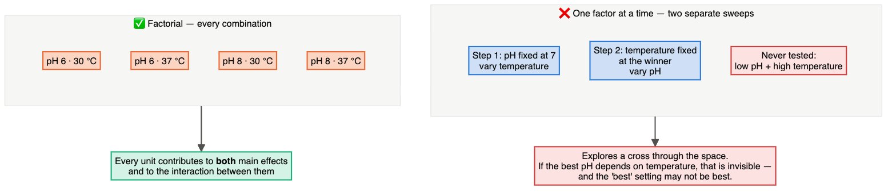

### Factorial designs

In a **factorial design**, every level of each factor is combined with every level of
the others. A 2×2 factorial (genotype × treatment) uses each unit to estimate
*both* main effects *and* their interaction ([Smucker et al., 2019](https://doi.org/10.1038/s41592-019-0335-9)).

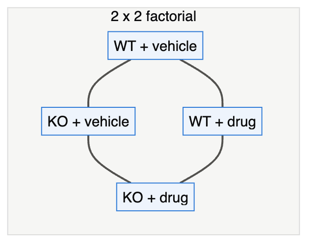

### The interaction is a difference of differences

$$\text{Interaction} = (\bar y_{\text{KO,drug}} - \bar y_{\text{KO,veh}}) - (\bar y_{\text{WT,drug}} - \bar y_{\text{WT,veh}})$$

### The difference-in-significance fallacy

"The drug had a significant effect in knockouts (*p* = 0.01) but not in wild-types
(*p* = 0.20), so the drug acts through the knocked-out gene." **Wrong.** "Significant
vs not significant" is not itself a significant difference. You must test the
**interaction** directly. About half of the neuroscience papers where this error was
possible made it ([Nieuwenhuis et al., 2011](https://doi.org/10.1038/nn.2886)).

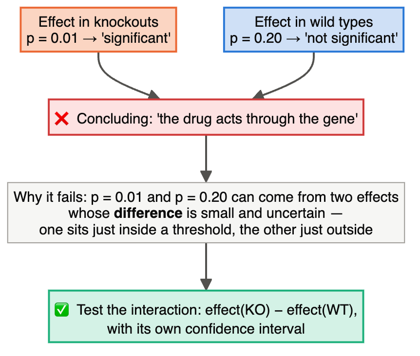

### Dose–response: shape, not a single point

A single concentration tells you almost nothing about potency or mechanism. Use
**5–8 concentrations spaced evenly on a log scale**, spanning no effect to maximal
effect, so the curve's bottom, top, slope and EC₅₀ can be estimated. Include a vehicle
control and replicate units at each dose.

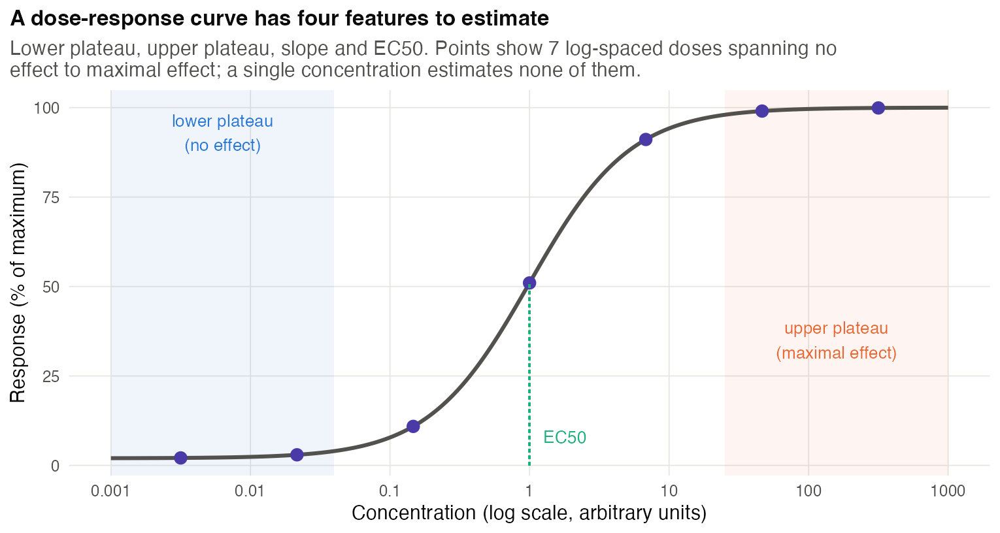

### Time-course: when, not just whether

Sampling density, synchronization and replication per time point are all design
choices. Early dense sampling helps separate direct from secondary effects ([Bar-Joseph et al., 2012](https://doi.org/10.1038/nrg3244)).
For a **destructive assay** (e.g. harvesting tissue), use different units at each time.
For a **non-destructive assay** (e.g. body weight), measure the same replicated units
repeatedly and model within-unit correlation. More time points do not create more
animals. Include concurrent controls at the relevant times.

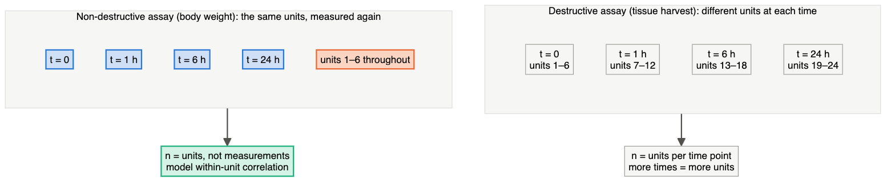

Either way, **each time point carries its own control**: a change seen only in treated
units at 24 h means little if no control was measured at 24 h. The numbers above are an
illustration of the structure, not a recommended sample size.

### Split-plot: when one factor is hard to change

If temperature is set per **incubator** but media can vary per **flask** inside it,
temperature is applied to large units (*whole plots*) and media to small units
(*sub-plots*). The analysis must use the right error term for each factor: whole plots
for temperature, sub-plots for media. Treating it as a simple factorial overstates the
precision of the temperature effect ([Altman & Krzywinski, 2015](https://doi.org/10.1038/nmeth.3293)).

The asymmetry is the point: the factor that is **hard to change** is estimated less
precisely, because its replication is the number of incubators — not the number of flasks.
With only one incubator per temperature, temperature is confounded with incubator.

### Crossover: each unit gets several treatments

Patients (or animals) receive treatments in random order with **washout** periods.
Each unit serves as its own control, which is efficient for stable, reversible
conditions, but carry-over must be ruled out ([Senn, 2004](https://doi.org/10.1002/sim.2074)).

---

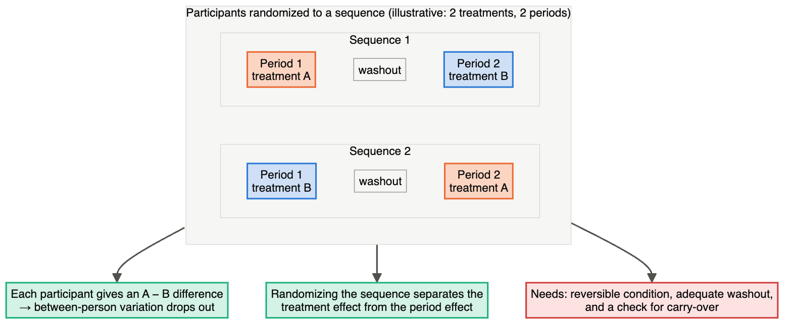

## 👁️ Visual Intuition — which structure?

| Your question | Structure |
|---|---|
| Does A matter? Does B? Do they interact? | full factorial |
| Which of 7 factors matter at all? | fractional factorial/Plackett–Burman (Chapter 13) |
| How does response change with amount? | dose–response, log-spaced |
| How does response unfold over time? | time-course with replicates at each time |
| One factor applied to large units, another to small units | split-plot |
| Few subjects, reversible effects | crossover |

---

## 🔬 Worked Example — reading a 2×2 factorial

Mean tumour growth (mm³/day) in a genotype × treatment experiment:

| | Vehicle | Drug |
|---|---|---|
| **Wild-type (WT)** | 10 | 12 |
| **Knockout (KO)** | 14 | 24 |

1. **Drug effect in WT:** 12 − 10 = **2**.
2. **Drug effect in KO:** 24 − 14 = **10**.
3. **Interaction:** 10 − 2 = **8** — the drug's effect is much larger in KO.
4. **Main effect of drug** (averaged over genotypes): (2 + 10)/2 = 6 — but with a strong
   interaction, this average describes neither genotype well. Report the simple effects.

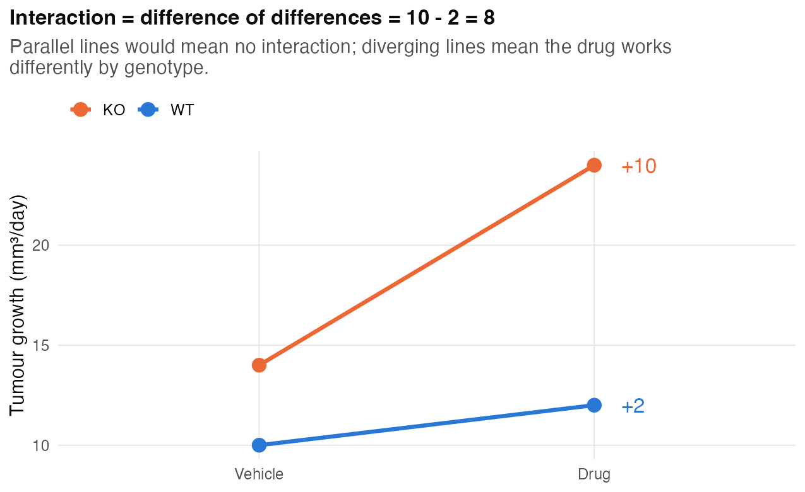

5. **Analysis:** `lm(growth ~ genotype * treatment)`. The `genotype:treatment` term
   tests whether 8 is distinguishable from 0 — the *correct* test for "the drug works
   differently in KO".

**What the table cannot tell you:** these are means, not a test result. You need
replicate-level data and uncertainty to decide whether the interaction differs from zero.
The drug main effect uses all four groups; each simple effect uses its two relevant groups.

Separate genotype experiments can estimate a difference of effects, but if genotype
also determines day or batch, genotype × drug cannot be separated from batch × drug.
Crossing both genotypes and treatments within shared blocks strengthens that comparison.
Specify the response scale: additivity on raw growth and additivity on log growth
are different hypotheses. A statistical interaction alone does not prove a mechanism.

---

## ⚠️ Common Misconceptions

| ❌ The misconception | ✅ What is actually true — and what to do |
|---|---|
| **"OFAT is simpler, so safer."** | It is less efficient and blind to interactions. |
| **"Significant in one group, not in the other = different effects."** | Test the interaction. |
| **"More doses means fewer replicates per dose, so worse."** | For curve-fitting, many doses with modest replication usually estimate EC₅₀ better than few doses with heavy replication. |
| **"Time points from the same animal are independent."** | Repeated measures on one unit are correlated; model them as such (mixed models), or use separate animals per time point and treat the time point as a factor. |
| **"Every factorial factor can be randomized to the smallest unit."** | Hard-to-change factors create split-plots whether you admit it or not. |

---

## 🧪 Spot the Flaw

> "Two incubators were set to 30 °C and 37 °C. In each, 12 flasks received one of three
> media (4 flasks each). Growth was analysed by two-way ANOVA with temperature, medium
> and their interaction, *n* = 4 per cell. Temperature had a highly significant effect
> (*p* < 0.001)."

▶ Diagnosis

Temperature was applied to **incubators**, and there is only **one incubator per
temperature**. The temperature effect is completely confounded with incubator identity
(position, humidity, door openings). Flasks are sub-plots for medium but **not
replicates of temperature**: for temperature, *n* = 1 per level. **Fix:** at least 2–3
incubator *runs* per temperature (re-randomizing temperature to incubators over time),
analysed as a split-plot with incubator run as the whole-plot unit.

---

## 🔎 The Reviewer's Perspective

- **"Is the claim about an interaction, and was the interaction tested?"**
- **"Are there enough dose levels to support claims about potency or shape?"**
- **"Which factors were applied to which units?"** — reveals hidden split-plots.
- **"Are repeated measurements modelled as repeated?"**

---

## 🛠️ Design Challenges

Three scenarios, three treatment structures: a factorial with a hard-to-change factor, a
dose–response, and a time-course. Sketch the structure first, then open the model answer.

### Challenge 1 · Plant genetics · ⭐⭐ — a gene that matters under drought?

You want to know whether a heat-tolerance gene (*HT1*) matters more under drought.
You have WT and *ht1* mutant seeds, a greenhouse with 4 benches, and room for 48 pots.

▶ A model design

- **Treatment structure:** 2 genotypes × 2 water regimes (watered, drought) = 4 combinations.
- **Units:** pots. If watering is done per bench, water regime is a whole-plot factor
  → split-plot: assign water regime to benches (2 benches each, randomly), genotype to
  pots within benches (6 pots per genotype per bench). Better, if feasible, water each
  pot individually so both factors are randomized to pots within benches (RCBD with
  bench as block, 12 pots per bench = 3 per combination).
- **Key test:** genotype × water interaction.
- **Measurements:** biomass at harvest, scored blind; optionally a time-course of leaf
  water content with repeated-measures analysis.

The diagram shows why the split-plot is the weaker option here: with only 2 benches per
regime, the water effect itself is estimated very imprecisely. The interaction compares genotype contrasts between water regimes. Under a classical
split-plot model with common genotype effects across benches apart from water regime,
it uses the subplot error. If genotype responses vary by bench, include bench × genotype
variation; extra pots cannot replace more benches for generalizing that interaction.

### Challenge 2 · Pharmacology · ⭐⭐ — choosing the concentrations

You want the IC₅₀ of a new kinase inhibitor in a cell-viability assay. From related
compounds you expect it somewhere between 10 nM and 1 µM. Your colleague plans three
concentrations: 0.1, 1 and 10 µM, in 6 wells each. Design a better dose–response.

▶ A model design

- **Shape, not points (Chapter 7):** an IC₅₀ comes from fitting a sigmoidal (4-parameter
  logistic) curve, which needs points on both plateaus and several on the slope.
- **Spacing:** log-spaced, half-log steps from 1 nM to 10 µM gives **9 concentrations**
  (1, 3.16, 10, 31.6, 100, 316, 1,000, 3,160 and 10,000 nM) — one log either side of the
  expected range.
- **Controls:** vehicle (0, with the same DMSO percentage in every well) defines 100%;
  a cytotoxic reference (e.g. staurosporine) defines the bottom plateau.
- **Replication:** 2–3 wells per concentration is enough for the curve; spend the effort on
  **3 independent experiments** (different days and cell passages), and report the IC₅₀
  with its confidence interval across experiments.
- **Layout:** randomize or alternate the dilution series across the plate (edge effects,
  Chapter 4).

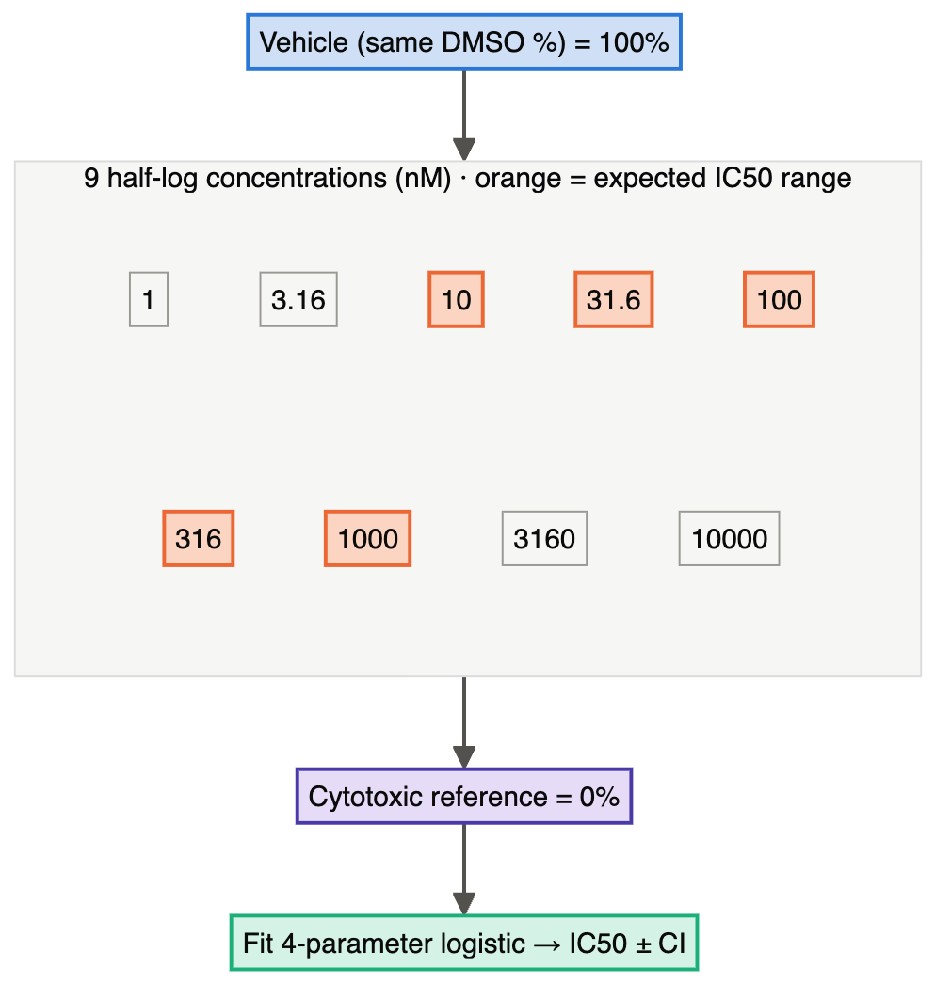

### Challenge 3 · Plant immunity · ⭐⭐ — when does the defence gene switch on?

You will measure a defence gene by qPCR after inoculating *Arabidopsis* leaves with a
bacterial pathogen. RNA extraction destroys the plant, so each plant gives one time point.
Your draft: infected plants at 1, 3, 6 and 24 h, compared with uninoculated plants
harvested at time 0. What is missing?

▶ A model design

- **A mock control at every time point.** Inoculation itself (wounding, buffer, handling)
  and the time of day both change gene expression. Comparing 24 h infected plants with
  0 h plants mixes the infection effect with handling and with the daily rhythm.
- **Structure:** 2 treatments (mock, pathogen) × 5 times (0, 1, 3, 6, 24 h) = 10 groups;
  separate plants for every group (destructive sampling); e.g. 4 plants per group.
- **Inoculate at staggered times** if you want all harvests at the same clock time; otherwise
  harvest mock and infected plants **together** at each time, in random order.
- **Analysis:** expression ~ treatment × time; the question is the **treatment × time
  interaction** — when infected plants diverge from mock.

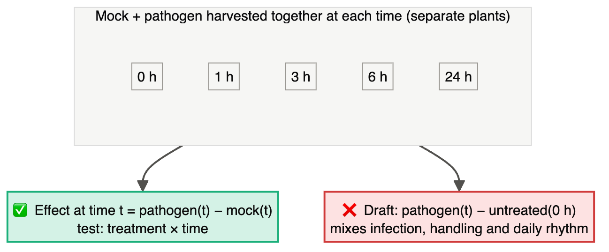

---

## ✅ Check Your Understanding

**⭐ Q1.** What is an interaction?

**⭐ Q2.** Why can't OFAT detect interactions?

**⭐⭐ Q3.** In a 2×2 table, means are WT-vehicle 5, WT-drug 9, KO-vehicle 5, KO-drug 6.
Compute the interaction and interpret it.

**⭐⭐ Q4.** How would you space concentrations to estimate an EC₅₀ expected near 1 µM?

**⭐⭐⭐ Q5.** A paper reports that a drug improved memory in young mice (*p* = 0.03)
but not in old mice (*p* = 0.30) and concludes that ageing blocks the drug's action.
Critique and propose the correct analysis.

---

## 📝 Sample Answers & Assessment

▶ Show sample answers

> **Q1 — Sample answer:** *"When two factors together have a bigger effect."* —
**◑ 6/10.** More precisely: when the effect of one factor **depends on the level** of
the other. The combined effect can be bigger, smaller, or even reversed.

> **Q2 — Sample answer:** *"Because you never vary both at once."* — **✔ 10/10.**

> **Q3 — Sample answer:** *"WT effect 4, KO effect 1, interaction = 1 − 4 = −3; the drug
works less in KO."* — **✔ 10/10.** This is evidence of effect modification; specificity and rescue controls are
still needed to argue that the gene mediates the drug's action.

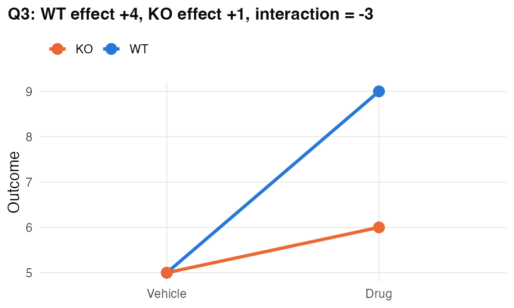

> **Q4 — Sample answer:** *"0.5, 1, 1.5, 2 µM."* — **✘ 3/10.** Linear spacing around
the EC₅₀ cannot define the plateaus. Use log spacing over ~3–4 orders of magnitude,
e.g. 0.01, 0.03, 0.1, 0.3, 1, 3, 10, 30 µM, plus vehicle.

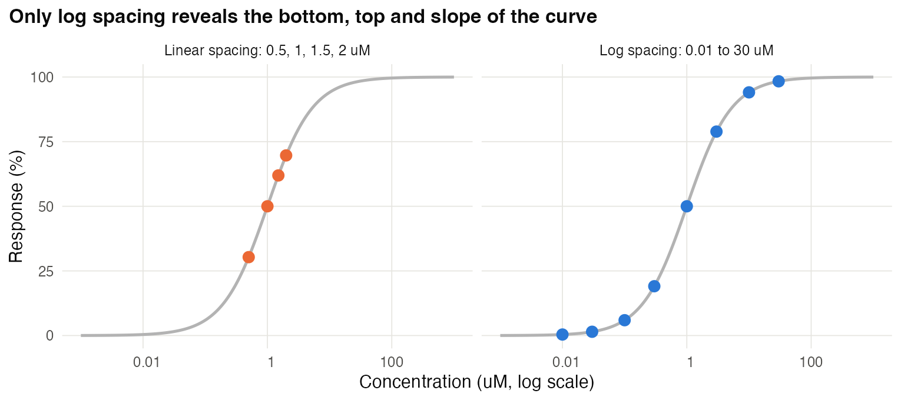

> **Q5 — Sample answer:** *"They should test the interaction age × drug."* — **✔ 9/10.**
Add why: *p* = 0.03 vs *p* = 0.30 can arise from nearly identical effects with
different variances or sample sizes. Fit `memory ~ age * drug` and report the
interaction estimate with its confidence interval ([Nieuwenhuis et al., 2011](https://doi.org/10.1038/nn.2886)).

**Rubric:** for interaction questions, full credit requires a *difference of
differences* and the explicit interaction test.

---

## 🧾 Chapter Summary

| Concept | One-line takeaway |
|---|---|
| **Factorial** | All combinations; estimates main effects and interactions efficiently. |
| **Interaction** | Difference of differences; must be tested directly. |
| **Dose–response** | 5–8 log-spaced doses spanning the full curve. |
| **Time-course** | Replicate each time point; model repeated measures properly. |
| **Split-plot/crossover** | Match the analysis to which units received which factor. |

**Traps to remember:** OFAT · significant vs non-significant ≠ different · one
incubator per temperature · single-dose "mechanism".

### 📇 Design Card — add these rows

| Field | Your answer |
|---|---|
| Factors and levels | |
| Which unit receives which factor (whole plot/sub-plot)? | |
| Key effect or interaction to test | |

---

## 🔗 Go Deeper

- 📘 Biostat course: [Ch. 13 — ANOVA](https://github.com/MdRasheduz-zaman/biostatistics/blob/main/chapters/13-anova.md) · [Ch. 16 — Linear Regression](https://github.com/MdRasheduz-zaman/biostatistics/blob/main/chapters/16-linear-regression.md)
- Optimal and efficient designs: ([Smucker et al., 2018](https://doi.org/10.1038/s41592-018-0083-2))

## 📚 References cited in this chapter

- Altman N, Krzywinski M (2015). Split plot design. *Nature Methods* 12:165-166. [doi:10.1038/nmeth.3293](https://doi.org/10.1038/nmeth.3293)
- Bar-Joseph Z, Gitter A, Simon I (2012). Studying and modelling dynamic biological processes using time-series gene expression data. *Nature Reviews Genetics* 13:552-564. [doi:10.1038/nrg3244](https://doi.org/10.1038/nrg3244)
- Nieuwenhuis S, Forstmann BU, Wagenmakers EJ (2011). Erroneous analyses of interactions in neuroscience: a problem of significance. *Nature Neuroscience* 14:1105-1107. [doi:10.1038/nn.2886](https://doi.org/10.1038/nn.2886)
- Senn S (2004). Controversies concerning randomization and additivity in clinical trials. *Statistics in Medicine* 23:3729-3753. [doi:10.1002/sim.2074](https://doi.org/10.1002/sim.2074)
- Smucker B, Krzywinski M, Altman N (2018). Optimal experimental design. *Nature Methods* 15:559-560. [doi:10.1038/s41592-018-0083-2](https://doi.org/10.1038/s41592-018-0083-2)
- Smucker B, Krzywinski M, Altman N (2019). Two-level factorial experiments. *Nature Methods* 16:211-212. [doi:10.1038/s41592-019-0335-9](https://doi.org/10.1038/s41592-019-0335-9)

---

[← Chapter 6](06-controls-and-comparators.md) · [Table of Contents](../README.md) · [Next: Chapter 8 — Sample Size and Power →](08-sample-size-and-power.md)
