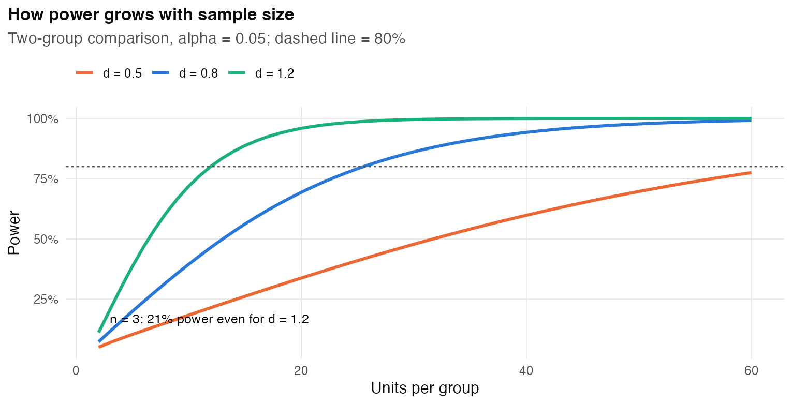
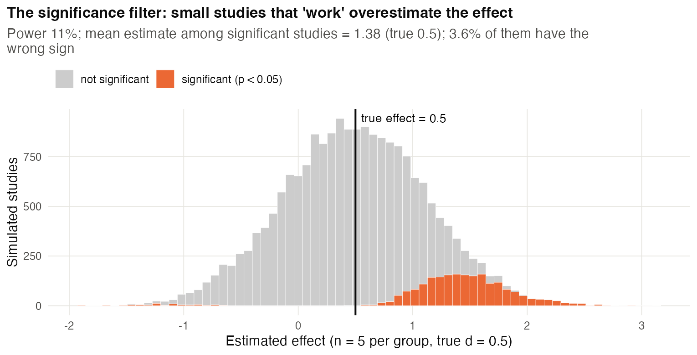
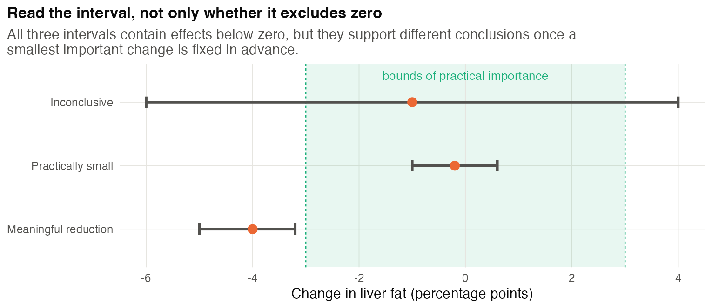
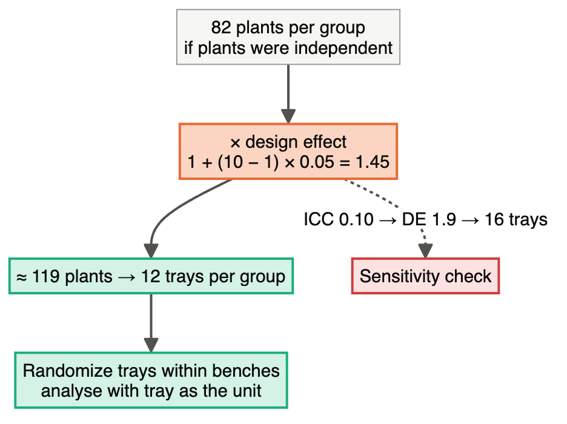
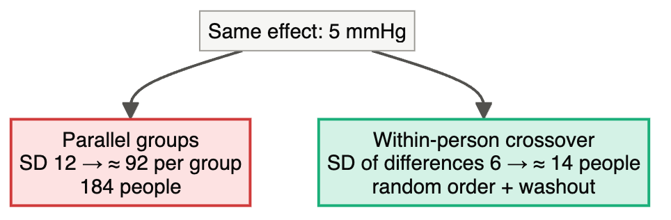

# Chapter 8 — Sample Size, Power and Precision

> **Part II — The Core Toolkit**
> [← Chapter 7](07-treatment-structures.md) · [Table of Contents](../README.md) · [Next: Chapter 9 — Descriptive Studies →](09-descriptive-studies.md)

---

## 🧭 Learning Objectives

After this chapter you will be able to:

1. Name the four ingredients of a power calculation and how each affects *n*.
2. Choose a defensible **smallest effect size of interest** instead of a guessed one.
3. Compute sample sizes in R for means, proportions, paired and clustered designs.
4. Explain why underpowered studies **exaggerate** effects, not just miss them.
5. Justify a sample size when a formal power calculation is impossible.

---

## 🎯 The Big Picture

"How many do I need?" is the most frequent design question, and "*n* = 3 because
that's what everyone uses" is the most frequent wrong answer. The median statistical
power in neuroscience was estimated at about **21%** ([Button et al., 2013](https://doi.org/10.1038/nrn3475)): most studies had
little chance of detecting the effects they were looking for.

Low power does more than miss true effects. When an underpowered study *does* reach
significance, it overestimates the effect (a **type M** error, for "magnitude") and can
even get its sign wrong (a **type S** error) ([Gelman & Carlin, 2014](https://doi.org/10.1177/1745691614551642)). That is one reason
replications so often find smaller effects than the originals (Chapter 1).

The statistical foundations — type I/II errors, power — are in
[📘 Biostat Ch. 9](https://github.com/MdRasheduz-zaman/biostatistics/blob/main/chapters/09-errors-and-power.md).
This chapter is about using them to **plan**.

---

## 🧠 Core Intuition

### Four ingredients

| Ingredient | Symbol | Larger value → *n*… |
|---|---|---|
| Smallest effect you care about | Δ | **decreases** (big effects are easy to see) |
| Variability between units | σ | **increases** |
| Significance level | α | decreases (looser threshold) |
| Desired power | 1 − β | increases |

For a two-group comparison of means, the standardized effect is $d = \Delta/\sigma$, and
roughly

$$n \text{ per group} \approx \frac{2\,(z_{1-\alpha/2} + z_{1-\beta})^2}{d^2}$$

so **halving the effect quadruples the sample size**.

### Where does Δ come from? Not from your pilot.

Choose Δ as the **smallest effect that would matter** (clinically, biologically,
economically) — the *smallest effect size of interest*. Effect sizes from small pilots
or from the literature are usually inflated, so powering on them leads to underpowered
studies ([Julious, 2005](https://doi.org/10.1002/pst.185); [Whitehead et al., 2016](https://doi.org/10.1177/0962280215588241)). Pilots *are* useful for checking feasibility and informing σ, but small-pilot SDs
are uncertain too. Calculate a range of sample sizes under plausible SDs/ICCs rather
than treating one noisy estimate as known.

### Ways to justify *n* ([Lakens, 2022](https://doi.org/10.1525/collabra.33267))

1. **Power** for a smallest effect of interest (most common).
2. **Precision**: *n* that gives a confidence interval narrow enough to be useful.
3. **Resource constraints** — honest statement: "with the 8 animals per group available
   we can detect effects of d ≥ 1.6 with 80% power". Then interpret null results accordingly.
4. **Heuristics** only when nothing else is possible, labelled as such.

### Design is part of power

Before buying more animals, use design to reduce σ: **blocking or pairing** (Chapter 5),
better measurement, covariates measured before treatment, and the right unit (Chapter 3).
For cluster-randomized designs, multiplying the individual-level size by the design
effect is a first approximation. Round up to whole clusters and check the number of
clusters, unequal cluster sizes and the planned analysis. For interactions, power the
interaction contrast itself; power for a main effect does not establish adequate power
for an interaction.

---

## 👁️ Visual Intuition


*Panel c: per-group n for 80% power in a two-sample comparison. At α = 0.05:
d = 1.2 → 12, d = 0.8 → 26, d = 0.5 → 64 per group. A stricter α (0.005) shifts the
curve up.*





*The significance filter in action. Code: scripts/course/figures.R.*


---

## 🔬 Worked Example — power calculations in base R

All numbers below are produced by `scripts/course/worked_examples.R`.

**1. Two groups, continuous outcome.** Fasting glucose; SD between mice ≈ 15 mg/dL;
smallest important difference = 20 mg/dL (d = 1.33):

```r
power.t.test(delta = 20, sd = 15, power = 0.8)   # n = 9.9 -> 10 mice per group
```

**2. How weak is n = 3?** For a large effect (d = 1):

```r
power.t.test(n = 3, delta = 1, sd = 1)$power    # 0.157  (16%)
power.t.test(n = 5, delta = 1, sd = 1)$power    # 0.286  (29%)
```

With 3 per group you would miss a *large* real effect five times out of six.

**3. Proportions.** Response rate 15% on standard care; worth detecting 30% on the new
treatment:

```r
power.prop.test(p1 = 0.30, p2 = 0.15, power = 0.8)   # n = 121 per group
```

**4. Paired/blocked design.** If within-pair differences have SD 0.6 and Δ = 1.0:

```r
power.t.test(delta = 1.0, sd = 0.6, power = 0.8, type = "paired")   # 6 pairs
```

Pairing reduced the relevant SD, so far fewer units are needed than in an unpaired design
with the same between-unit SD.

**5. Clusters.** Clinics are randomized, with 20 patients each and ICC = 0.05:
design effect = 1 + 19 × 0.05 = **1.95**. Multiply the individually randomized size
by 1.95, then round up to whole clinics. This is an approximation, especially with
few clinics. Recruiting through clinics alone does not make allocation cluster-randomized.

**6. Complex designs → simulate.** For mixed models, counts or omics, write a simulation
that generates data under your design and assumptions, analyses each dataset as planned,
and counts how often the effect is detected ([Morris et al., 2019](https://doi.org/10.1002/sim.8086)). Tools such as G*Power cover
standard tests ([Faul et al., 2007](https://doi.org/10.3758/bf03193146)).

---

### Three conclusions from a confidence interval

Suppose a change smaller than **±3 percentage points** in liver fat is biologically
unimportant, and these bounds were justified before data collection.

| Estimated effect and 95% CI (percentage points) | What the data support |
|---|---|
| −1, CI −6 to +4 | Inconclusive: important benefit and harm remain compatible |
| −0.2, CI −1 to +0.6 | Compatible with practically small effects; the whole CI is inside the bounds |
| −4, CI −5 to −3.2 | Evidence of a reduction exceeding the meaningful threshold |

All three ask about **magnitude**, not just whether zero is inside the interval.
For a formal equivalence test, pre-specify the margins and size the study for that
purpose. The usual two one-sided tests at α = 0.05 use a **90% CI** entirely inside
the margins; a 95% CI inside them is a more conservative criterion.
See the equivalence-testing primer ([Lakens, 2017](https://doi.org/10.1177/1948550617697177)).



## ⚠️ Common Misconceptions

| ❌ The misconception | ✅ What is actually true — and what to do |
|---|---|
| **"n = 3 is standard."** | Standard is not the same as adequate. Compute the power you actually have. |
| **"Use the pilot's effect size."** | Pilot effect sizes are noisy and usually inflated. Use a smallest effect of interest. |
| **"A non-significant result means no effect."** | Even a well-powered study can miss an effect. Inspect the estimate and CI; to support practical equivalence, pre-specify meaningful bounds and plan an equivalence analysis ([Altman & Bland, 1995](https://doi.org/10.1136/bmj.311.7003.485)). |
| **"Post-hoc power explains my null result."** | Power computed from the observed effect is a restatement of the *p*-value and adds nothing. Report the CI instead. |
| **"More sequencing depth/more cells = more power."** | Power comes mostly from independent units (Chapters 3 and 20). |
| **"Big *n* is always good."** | Overly large animal studies are an ethical problem too. The aim is *adequate* precision. |

---

## 🧪 Spot the Flaw

> "Based on our pilot study (n = 4 per group, Cohen's d = 2.1), a power analysis showed
> that n = 6 per group provides 90% power."

<details>
<summary>▶ Diagnosis</summary>

The effect size came from a tiny pilot. Pilots that look promising are exactly the ones
with *overestimated* effects (they were selected for looking good). If the true d is 0.8,
6 per group gives only about 24% power. **Fix:** power on a smallest effect of interest
justified biologically, use the pilot only for SD, or plan a larger confirmatory study.
</details>

---

## 🔎 The Reviewer's Perspective

- **"Is there a sample-size justification, with all ingredients stated?"** (Δ, σ, α, power, test)
- **"Where did Δ and σ come from?"**
- **"Is *n* counted in experimental units, and is clustering accounted for?"**
- **"For null results: what effects can be excluded?"** (look at the CI)

---

## 🛠️ Design Challenges

Three sample-size problems from different fields: a continuous outcome with blocks, a
binary outcome with clustering, and a paired design. Write down the four ingredients
before calculating, then open the model answer.

### Challenge 1 · Metabolism · ⭐ — liver fat in mice

You plan a mouse study of a diet's effect on liver fat (% by MRI). The literature
gives a between-mouse SD of about 4 percentage points. Your supervisor says that a
reduction of less than 3 points would not be interesting. Animals come from 4 litters,
which differ a lot. Plan the sample size and allocation.

<details>
<summary>▶ A model design</summary>

- **Allocation first:** the calculation below assumes diets can be assigned and
  delivered independently to mice. If diet is delivered to a whole cage, randomize
  cages and size the cage design instead (see Chapter 25).
- d = 3/4 = 0.75 → `power.t.test(delta = 3, sd = 4, power = 0.8)` gives ≈ 29 per group
  if unpaired.
- **Use the litters as blocks**: split each litter evenly between diets. If a substantial
  part of the variance is between litters, the within-litter SD is smaller, and
  the required *n* falls. Estimate the within-litter SD from previous data and
  recompute.
- Account for expected 10% attrition by dividing by 0.90 and rounding up:
  `ceiling(29 / 0.90)` = **33 allocated per group**. Adding 10% is not the same
  calculation. Attrition can also bias results; specify how missing outcomes are handled.
- State the justification in the protocol: Δ = 3 (smallest effect of interest), SD
  source, α = 0.05, power 80%, analysis with litter as block.


</details>

### Challenge 2 · Plant pathology · ⭐⭐ — infection rates in trays

A biocontrol bacterium should reduce the proportion of seedlings infected by a fungus from
about **40% to 20%**. Seedlings grow in trays of 10, and the treatment is applied by
drenching **whole trays**. Plants in the same tray are correlated (intracluster correlation
ICC ≈ 0.05). How many trays do you need?

<details>
<summary>▶ A model design</summary>

- **Individual-level size:** `power.prop.test(p1 = 0.4, p2 = 0.2, power = 0.8)` gives
  **82 plants per group** — *if* plants were independent.
- **Design effect** for clusters of *m* = 10 (Chapter 3): DE = 1 + (*m* − 1) × ICC =
  1 + 9 × 0.05 = **1.45** → 82 × 1.45 ≈ 119 plants → **12 trays per group** (120 plants).
- **The unit is the tray:** randomize trays to treatment (blocked by bench), analyse tray-level
  proportions or a mixed (GLMM) model with tray as random effect.
- **Sensitivity:** if the ICC were 0.10 instead, DE = 1.9 → 156 plants → 16 trays. Get an ICC
  estimate from previous trays before committing.


</details>

### Challenge 3 · Human physiology · ⭐⭐ — pairing changes everything

A breathing exercise should lower systolic blood pressure by **5 mmHg**. Between people,
systolic pressure has an SD of about **12 mmHg**; but repeated measurements in the same
person are highly correlated (*r* ≈ 0.875), so the SD of a person's before–after
**difference** is about **6 mmHg**. Compare a parallel-group design with a within-person
(crossover or before–after with control) design.

<details>
<summary>▶ A model design</summary>

```r
power.t.test(delta = 5, sd = 12, power = 0.8)                    # parallel groups: n ≈ 92 per group
power.t.test(delta = 5, sd = 6,  power = 0.8, type = "paired")   # within-person:  n ≈ 14 people
```

- **Parallel groups:** about **92 per group** (184 people).
- **Within-person crossover:** about **14 people**, each doing both the exercise and a
  control (sham) session in random order with a washout — the between-person variation is
  removed by design.
- **Caveats:** a crossover needs a reversible effect, a washout and checks for period and
  carry-over effects (Chapter 7); a plain before–after design **without** a control condition
  would confound the exercise with time, habituation to the measurement and regression to
  the mean.


</details>

---

## ✅ Check Your Understanding

**⭐ Q1.** Name the four ingredients of a power calculation.

**⭐ Q2.** If the smallest effect of interest is halved, what happens to *n*?

**⭐⭐ Q3.** Explain a type M error in your own words and why small studies make it likely.

**⭐⭐ Q4.** Your study (n = 5 per group) found no significant difference. Your PI wants
to conclude "the treatment has no effect". What do you report instead?

**⭐⭐⭐ Q5.** You can afford 24 animals and nothing more. How do you justify the design
honestly, and what design choices maximize what 24 animals can tell you?

---

## 📝 Sample Answers & Assessment

<details>
<summary>▶ Show sample answers</summary>

> **Q1 — Sample answer:** *"Effect size, standard deviation, alpha, power."* — **✔ 10/10.**

> **Q2 — Sample answer:** *"n doubles."* — **✘ 3/10.** *n* scales with 1/Δ², so it roughly
**quadruples**.

> **Q3 — Sample answer:** *"When the study exaggerates the effect, because only big
estimates reach significance when n is small."* — **✔ 10/10.** Exactly: significance
acts as a filter that lets through only the lucky overestimates ([Gelman & Carlin, 2014](https://doi.org/10.1177/1745691614551642)).

> **Q4 — Sample answer:** *"That the result was not significant."* — **◑ 5/10.** Go
further: report the estimated difference with its 95% CI and state which effects remain
compatible with the data (e.g. "from a 10% decrease to a 25% increase"). Note that the
study had low power for effects smaller than X.

> **Q5 — Sample answer:** *"State what effect size 24 animals can detect, block on
litter/sex, use a precise outcome, and avoid splitting into too many groups."* —
**✔ 10/10.** Also consider a within-animal (crossover/repeated) design if the outcome is
reversible, and pre-register the analysis so that limited power is not compounded by
flexibility.

**Rubric:** full credit requires linking *n* to an effect size that is justified, and
using design (not just more animals) to improve precision.
</details>

---

## 🧾 Chapter Summary

| Concept | One-line takeaway |
|---|---|
| **Ingredients** | Δ, σ, α, power — and the design determines σ. |
| **Δ** | Smallest effect of interest, not a pilot estimate. |
| **Scaling** | *n* ∝ 1/Δ²: half the effect, four times the units. |
| **Low power** | Misses effects *and* exaggerates the ones it finds. |
| **Complex designs** | Simulate the planned analysis. |

**Traps to remember:** n = 3 by habit · pilot effect sizes · post-hoc power · "not
significant = no effect".

### 📇 Design Card — add these rows

| Field | Your answer |
|---|---|
| Smallest effect of interest (and why) | |
| Variability estimate (and source) | |
| α, power, test → *n* per group (in units) | |
| Adjustments (clusters, attrition) | |

---

## 🔗 Go Deeper

- 📘 Biostat course: [Ch. 9 — Errors and Power](https://github.com/MdRasheduz-zaman/biostatistics/blob/main/chapters/09-errors-and-power.md) · [Ch. 10 — Confidence Intervals](https://github.com/MdRasheduz-zaman/biostatistics/blob/main/chapters/10-confidence-intervals.md) · [Ch. 11 — Effect Size](https://github.com/MdRasheduz-zaman/biostatistics/blob/main/chapters/11-effect-size.md)
- Further reading: ([Krzywinski & Altman, 2013](https://doi.org/10.1038/nmeth.2738); [Halsey et al., 2015](https://doi.org/10.1038/nmeth.3288))

## 📚 References cited in this chapter

- Altman DG, Bland JM (1995). Statistics notes: Absence of evidence is not evidence of absence. *BMJ* 311:485. [doi:10.1136/bmj.311.7003.485](https://doi.org/10.1136/bmj.311.7003.485)
- Button KS, Ioannidis JPA, Mokrysz C, Nosek BA, Flint J, Robinson ESJ, et al. (2013). Power failure: why small sample size undermines the reliability of neuroscience. *Nature Reviews Neuroscience* 14:365-376. [doi:10.1038/nrn3475](https://doi.org/10.1038/nrn3475)
- Faul F, Erdfelder E, Lang AG, Buchner A (2007). G*Power 3: A flexible statistical power analysis program for the social, behavioral, and biomedical sciences. *Behavior Research Methods* 39:175-191. [doi:10.3758/bf03193146](https://doi.org/10.3758/bf03193146)
- Gelman A, Carlin J (2014). Beyond Power Calculations. *Perspectives on Psychological Science* 9:641-651. [doi:10.1177/1745691614551642](https://doi.org/10.1177/1745691614551642)
- Halsey LG, Curran-Everett D, Vowler SL, Drummond GB (2015). The fickle P value generates irreproducible results. *Nature Methods* 12:179-185. [doi:10.1038/nmeth.3288](https://doi.org/10.1038/nmeth.3288)
- Julious SA (2005). Sample size of 12 per group rule of thumb for a pilot study. *Pharmaceutical Statistics* 4:287-291. [doi:10.1002/pst.185](https://doi.org/10.1002/pst.185)
- Krzywinski M, Altman N (2013). Power and sample size. *Nature Methods* 10:1139-1140. [doi:10.1038/nmeth.2738](https://doi.org/10.1038/nmeth.2738)
- Lakens D (2017). Equivalence Tests. *Social Psychological and Personality Science* 8:355-362. [doi:10.1177/1948550617697177](https://doi.org/10.1177/1948550617697177)
- Lakens D (2022). Sample Size Justification. *Collabra: Psychology* 8:33267. [doi:10.1525/collabra.33267](https://doi.org/10.1525/collabra.33267)
- Morris TP, White IR, Crowther MJ (2019). Using simulation studies to evaluate statistical methods. *Statistics in Medicine* 38:2074-2102. [doi:10.1002/sim.8086](https://doi.org/10.1002/sim.8086)
- Whitehead AL, Julious SA, Cooper CL, Campbell MJ (2016). Estimating the sample size for a pilot randomised trial to minimise the overall trial sample size for the external pilot and main trial for a continuous outcome variable. *Statistical Methods in Medical Research* 25:1057-1073. [doi:10.1177/0962280215588241](https://doi.org/10.1177/0962280215588241)


---

[← Chapter 7](07-treatment-structures.md) · [Table of Contents](../README.md) · [Next: Chapter 9 — Descriptive Studies →](09-descriptive-studies.md)
