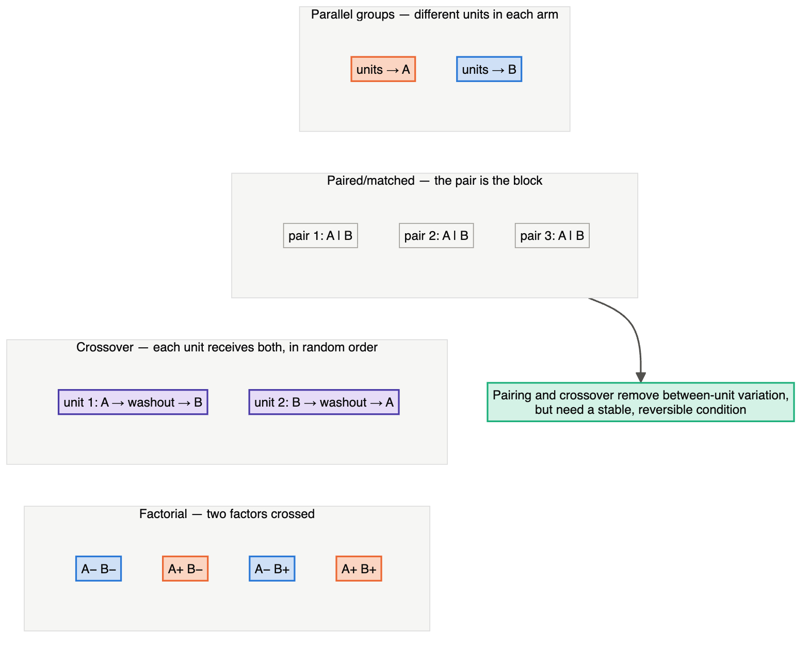
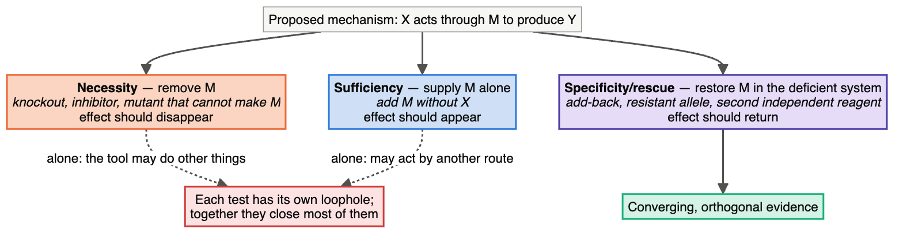
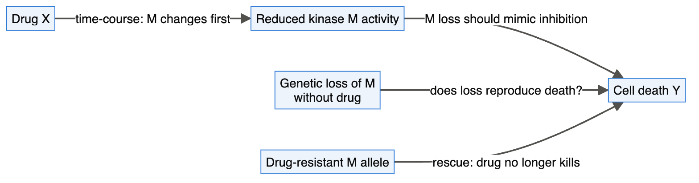
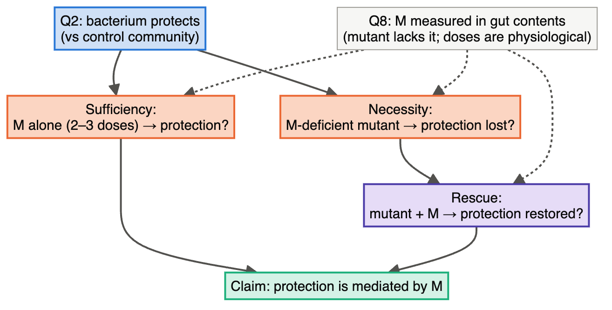

# Chapter 10 — Comparative and Mechanistic Experiments (Q2, Q3)

> **Part III — Designs by Question Type**
> [← Chapter 9](09-descriptive-studies.md) · [Table of Contents](../README.md) · [Next: Chapter 11 — Observational and Causal Designs →](11-observational-and-causal.md)

---

## 🧭 Learning Objectives

After this chapter you will be able to:

1. Choose among completely randomized, randomized block, factorial and crossover designs for a comparative question.
2. Write the **analysis model** that matches each design.
3. Build a **mechanistic argument** from necessity, sufficiency, specificity, dose, timing and rescue.
4. Recognize when a mechanistic claim rests on a single reagent or a single time point.

---

## 🎯 The Big Picture

Comparative (Q2) and mechanistic (Q3) questions are the core of experimental biology:
*does* X change Y, and *how*? They are where you have the most control — you assign
the treatments — and therefore where design errors are least forgivable.

- **Q2** needs an unbiased, precise **comparison**: Chapters 3–8 in action.
- **Q3** needs a **chain of comparisons** that together exclude alternative mechanisms.
  No single experiment proves a mechanism.

---

## 🧠 Core Intuition

### The four classic comparative designs

| Design | When | Analysis model (R) |
|---|---|---|
| **Completely randomized (CRD)** | units homogeneous | `y ~ treatment` |
| **Randomized complete block (RCBD)** | known nuisance groups (litter, day, batch) | `y ~ block + treatment` |
| **Factorial** | ≥ 2 factors, interactions of interest | `y ~ A * B` (+ block) |
| **Crossover/within-subject** | reversible effects, few subjects | `y ~ period + treatment + (1 \| subject)` |

Nested sub-units add random effects: `(1 | animal)` (Chapter 3).

### The logic of mechanism

A convincing mechanistic claim ("X causes Y *through* M") usually combines:

| Line of evidence | Question it answers | Typical experiment |
|---|---|---|
| **Necessity** | Is M required? | knockout/knockdown/inhibitor of M blocks the effect |
| **Sufficiency** | Is M enough? | activating M reproduces the effect without X |
| **Specificity** | Is it really M, not an off-target? | two independent reagents; rescue with a resistant allele |
| **Dose–response** | Does more M → more Y? | graded perturbation |
| **Temporal order** | Does M change before Y? | time-course |
| **Convergence** | Do different methods agree? | genetic + pharmacological + biochemical |

Each line is itself a comparative experiment with its own unit, controls and replication.

### Orthogonal evidence beats repetition

Repeating the same siRNA experiment five times gives five estimates of the same
possibly off-target effect. One experiment with a different siRNA, one with CRISPR
knockout and one with a pharmacological inhibitor give three *independent* routes to the
same conclusion ([Doench, 2018](https://doi.org/10.1038/nrg.2017.97)).

---

## 👁️ Visual Intuition — a mechanistic argument as a graph

Each arrow is a separate, designed experiment.

---

## 🔬 Worked Example — from observation to mechanism

**Observation:** a drug kills cancer cells (Q2 established: 4 independent experiments,
drug vs vehicle, cell viability, blinded counting).

**Hypothesis:** the drug kills by inhibiting kinase M.

| Step | Design | Unit & replication | Key controls |
|---|---|---|---|
| 1. Dose–response | 8 log-spaced doses; measure M activity and viability | independent experiments (≥ 3) | vehicle; reference M inhibitor |
| 2. Timing | M activity and death markers at 0.5, 1, 2, 4, 8, 24 h | independent cultures per time point | vehicle at each time |
| 3. Phenocopy/occlusion | M knockout (2 independent guides) ± drug, 2×2 factorial | independent clones/pools | non-targeting guide |
| 4. Necessity/specificity | drug-resistant active M expressed ± drug | independent experiments | empty vector |
| 5. In vivo | xenograft: drug vs vehicle, randomized, blinded tumour measurement | mouse (cage-balanced) | vehicle; power calculation |

**A key comparison** in step 3 is the **interaction**. For an on-target
inhibitor, loss of M may already reproduce the drug phenotype,
leaving little additional drug effect. Test the interaction directly (Chapter 7), but
check baseline viability and floor effects: non-additivity alone is not proof of mediation.
If M knockout is lethal, use a titrated knockdown or conditional perturbation. A
**drug-resistant, active M allele that preserves viability under drug** tests whether
M inhibition is required. This differs from a pathway where *activating* M causes death;
in that pathway, M loss would be expected to block death rather than mimic it.

---

## ⚠️ Common Misconceptions

| ❌ The misconception | ✅ What is actually true — and what to do |
|---|---|
| **"A significant knockdown phenotype proves the gene is involved."** | Not without specificity controls (second reagent, rescue). |
| **"Inhibitors are specific."** | Most small molecules hit several targets, especially at high concentrations. Use dose–response and a structurally different inhibitor. |
| **"One time point shows the pathway."** | Without timing, direct and indirect effects are indistinguishable. |
| **"Mechanism = a cartoon in the last figure."** | The cartoon is a hypothesis unless each arrow was tested by a designed experiment. |

---

## 🧪 Spot the Flaw

> "Treatment with compound C (10 µM, 24 h) reduced phosphorylation of protein P and
> reduced migration. A single shRNA against P also reduced migration. We conclude that
> C inhibits migration via P."

▶ Diagnosis

- One concentration and one time point: cannot show that P changes *before* migration,
  or at concentrations relevant to the effect.
- One shRNA: off-target effects are possible; no rescue.
- No test of whether C still reduces migration **when P is already knocked down** (the
  factorial interaction). If C works equally well without P, the "via P" claim fails.
- Fix: dose–response and time-course; two independent knockdowns plus rescue; a 2×2
  factorial (P knockdown × C) with the interaction test.

---

## 🔎 The Reviewer's Perspective

- **"Which lines of mechanistic evidence are present — and which are missing?"**
- **"Is there an independent reagent or rescue for every genetic perturbation?"**
- **"Is the key claim an interaction, and was it tested?"**
- **"Were concentrations and time points chosen with justification?"**

---

## 🛠️ Design Challenges

Three mechanistic (Q3) claims from different fields. For each, design the **necessity**,
**sufficiency** and **specificity** evidence — then open the model answer and its diagram.

### Challenge 1 · Microbiome · ⭐⭐ — a protective metabolite

Hypothesis: a gut bacterium protects mice from colitis by producing a metabolite (M).
Design the minimal set of experiments to support "protection is mediated by M".

▶ A model design

1. **Comparative (Q2):** germ-free mice colonized with the bacterium vs a control
   community; colitis induced; *n* in **cages/isolators** with mice housed accordingly;
   blinded histology.
2. **Necessity:** a bacterial mutant unable to produce M (two independent mutants if
   possible) vs wild-type bacterium. Protection should be lost.
3. **Sufficiency:** M given orally to germ-free or control mice, without the bacterium,
   at 2–3 doses. Protection should appear.
4. **Specificity/rescue:** mutant + M supplementation restores protection.
5. **Measurement (Q8):** validated M quantification in gut contents to show the mutant
   lacks M and supplementation reaches physiological levels.

### Challenge 2 · Plant physiology · ⭐⭐ — a zinc transporter

A root membrane protein (ZT1) is suspected to import zinc. A mutant line grows poorly on
low-zinc soil. Design the experiments that would support "ZT1 is a zinc transporter needed
for zinc uptake in roots".

▶ A model design

- **Necessity (genetic):** **two independent mutant alleles** (e.g. two T-DNA insertions or
  two CRISPR lines) — both should show reduced zinc uptake. One allele could carry a
  second, unrelated mutation.
- **Specificity (complementation):** the mutant transformed with the *ZT1* gene under its
  own promoter should recover wild-type uptake. Use **several independent transgenic lines**,
  and include an empty-vector control.
- **Direct function (orthogonal evidence):** express ZT1 in a zinc-uptake-deficient yeast
  strain (growth on low zinc) or in *Xenopus* oocytes (radioactive or stable-isotope zinc
  uptake), with empty vector as control.
- **Physiology:** short-term isotope uptake by roots (wild type, mutants, complemented
  lines) at low and normal zinc, blinded ICP-MS of tissue zinc; plants randomized across the
  growth chamber.
- **Location:** a fluorescent-protein fusion showing ZT1 in the root plasma membrane.

### Challenge 3 · Neuroscience · ⭐⭐⭐ — do these neurons drive the behaviour?

Neurons in a small brain region (call it R) are active when mice approach a novel object.
You want to claim "activity of R neurons drives novelty approach". You have optogenetic
tools for activating (channelrhodopsin) and inhibiting (an inhibitory opsin) neurons.

▶ A model design

- **Necessity:** inhibit R during novel-object sessions → less approach?
- **Sufficiency:** activate R in the absence of a novel object → approach-like behaviour?
- **Controls for the method:** mice expressing a **fluorophore only** (no opsin) receive the
  same light, surgery and handling — light and heat alone can change behaviour.
  Within mice, **light-on and light-off epochs in random order**.
- **Verification:** histology confirming expression in R and fibre placement, with
  pre-specified exclusion of mice with misplaced fibres — decided **blind** to behaviour.
- **Units and blinding:** mouse is the unit; animals randomized to opsin vs fluorophore
  groups; automated tracking; experimenter blind to virus.
- **Specificity:** inhibiting a neighbouring region should *not* reproduce the effect.

---

## ✅ Check Your Understanding

**⭐ Q1.** Write the R model formula for an RCBD with litter as block.

**⭐ Q2.** Name four lines of evidence for a mechanistic claim.

**⭐⭐ Q3.** Why is a rescue experiment so persuasive?

**⭐⭐ Q4.** You can run either 6 repeats of one siRNA, or 2 repeats each of two
siRNAs plus a CRISPR knockout. Which gives stronger evidence of on-target action, and
why?

**⭐⭐⭐ Q5.** Design the analysis that tests "drug D acts through receptor R", given
WT and R-knockout cells, each treated with vehicle or D, in 4 independent experiments.

---

## 📝 Sample Answers & Assessment

▶ Show sample answers

> **Q1 — Sample answer:** `y ~ litter + treatment` — **✔ 10/10.**

> **Q2 — Sample answer:** *"Necessity, sufficiency, dose-response, time."* — **✔ 9/10.**
Add specificity (independent reagents/rescue) as the most often missing one.

> **Q3 — Sample answer:** *"Because it brings the phenotype back."* — **◑ 6/10.** The
reason it is persuasive: an off-target effect of the knockdown reagent would **not** be
reversed by restoring the intended gene, so reversal points to the on-target effect.

> **Q4 — Sample answer:** *"Two siRNAs plus CRISPR — independent methods with different
off-targets."* — **✔ 10/10.**

> **Q5 — Sample answer:** *"Two-way ANOVA genotype × drug."* — **✔ 8/10.** Add the block:
`y ~ experiment + genotype * drug` (experiment = independent repeat as block). The
evidence is the **genotype:drug interaction** — the drug effect should be much
smaller in knockout cells.

**Rubric:** mechanistic answers earn full credit when they name the *comparison that
would falsify* the mechanism.

---

## 🧾 Chapter Summary

| Concept | One-line takeaway |
|---|---|
| **Comparative designs** | CRD, RCBD, factorial, crossover; analysis must mirror design. |
| **Mechanism** | A chain of experiments: necessity, sufficiency, specificity, dose, timing. |
| **Orthogonality** | Independent methods beat repeated identical ones. |
| **Interactions** | "Acts through" claims are interaction claims. |

**Traps to remember:** one reagent · one dose · one time point · untested cartoon arrows.

### 📇 Design Card — add these rows (Q2/Q3)

| Field | Your answer |
|---|---|
| Design (CRD/RCBD/factorial/crossover) and model formula | |
| Mechanistic lines of evidence planned | |
| Experiment that could falsify the mechanism | |

---

## 🔗 Go Deeper

- 📘 Biostat course: [Ch. 12 — *t*-tests](https://github.com/MdRasheduz-zaman/biostatistics/blob/main/chapters/12-t-tests.md) · [Ch. 13 — ANOVA](https://github.com/MdRasheduz-zaman/biostatistics/blob/main/chapters/13-anova.md)
- Reading: ([Krzywinski & Altman, 2014](https://doi.org/10.1038/nmeth.2974); [Smucker et al., 2019](https://doi.org/10.1038/s41592-019-0335-9); [Bar-Joseph et al., 2012](https://doi.org/10.1038/nrg3244))

## 📚 References cited in this chapter

- Bar-Joseph Z, Gitter A, Simon I (2012). Studying and modelling dynamic biological processes using time-series gene expression data. *Nature Reviews Genetics* 13:552-564. [doi:10.1038/nrg3244](https://doi.org/10.1038/nrg3244)
- Doench JG (2018). Am I ready for CRISPR? A user's guide to genetic screens. *Nature Reviews Genetics* 19:67-80. [doi:10.1038/nrg.2017.97](https://doi.org/10.1038/nrg.2017.97)
- Krzywinski M, Altman N (2014). Designing comparative experiments. *Nature Methods* 11:597-598. [doi:10.1038/nmeth.2974](https://doi.org/10.1038/nmeth.2974)
- Smucker B, Krzywinski M, Altman N (2019). Two-level factorial experiments. *Nature Methods* 16:211-212. [doi:10.1038/s41592-019-0335-9](https://doi.org/10.1038/s41592-019-0335-9)

---

[← Chapter 9](09-descriptive-studies.md) · [Table of Contents](../README.md) · [Next: Chapter 11 — Observational and Causal Designs →](11-observational-and-causal.md)
