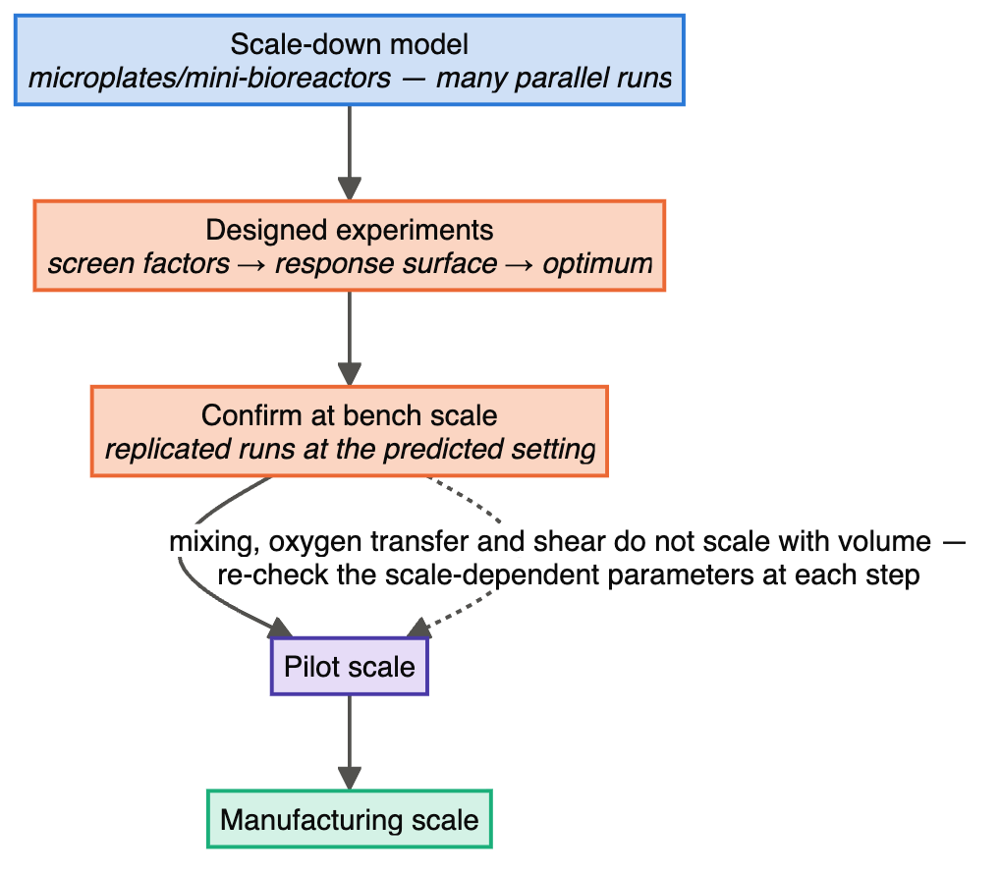
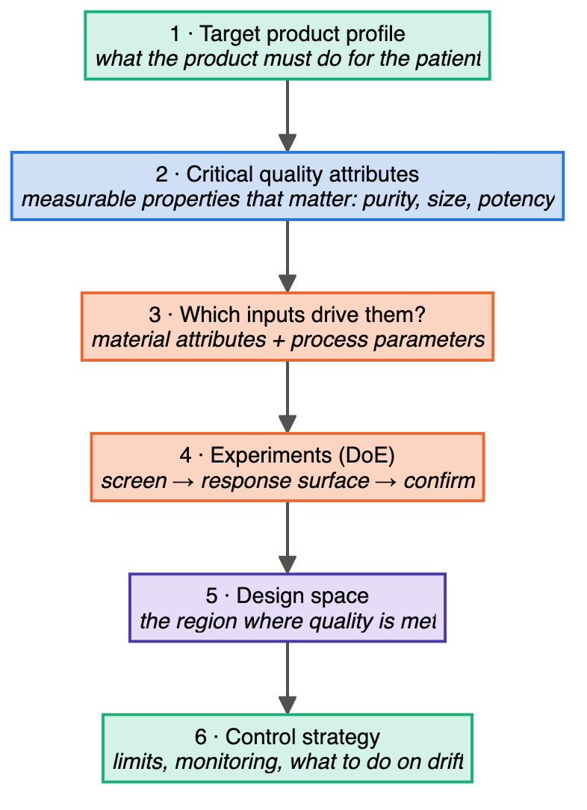
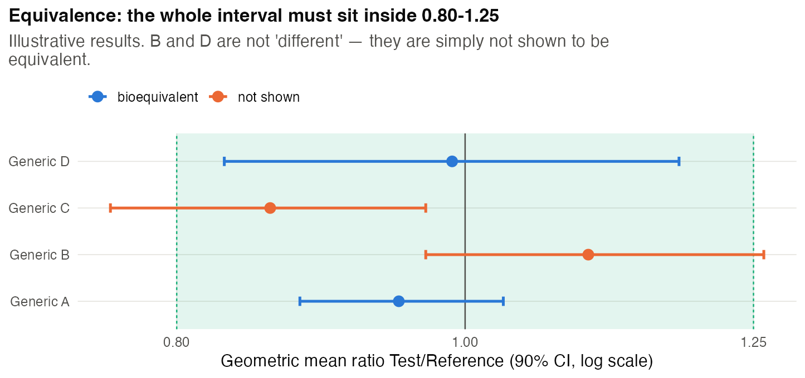
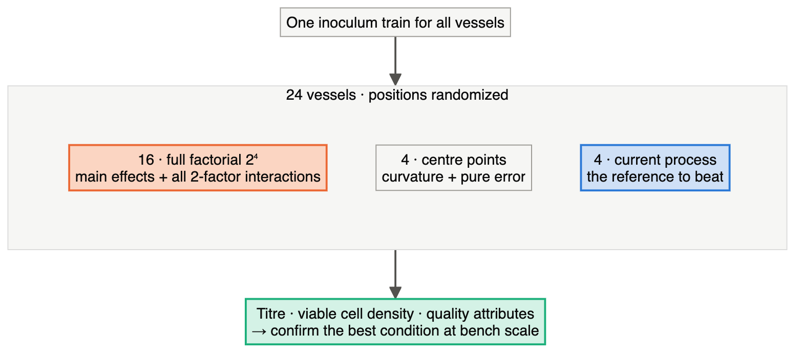

# Chapter 18 — Biotechnology, Bioprocess and Pharmacy

> **Part IV — Field Playbooks**
> [← Chapter 17](17-microbiology-microbiome.md) · [Table of Contents](../README.md) · [Next: Chapter 19 — Plant and Animal Breeding, Field Trials →](19-breeding-and-field-trials.md)

---

## 🧭 Learning Objectives

After this chapter you will be able to:

1. Apply sequential DoE to bioprocess and formulation development, including blocking by raw-material lot or reactor.
2. Explain **Quality by Design (QbD)** and the idea of a design space.
3. Recognize mixture designs and when they are needed.
4. Plan concentration–response, crossover and drug–drug-interaction studies in pharmacology.
5. Describe design–build–test–learn (DBTL) cycles as sequential experimental design.

**Dominant question types:** optimization (Q6), screening (Q7), comparative (Q2), predictive (Q5).

---

## 🎯 The Big Picture

Biotechnology and pharmacy are where biology meets manufacturing. The questions are
often *"which settings give the best, most robust product?"* — optimization — and the
answers must hold up at scale and under regulatory scrutiny. Statistical DoE (Chapter 13)
is therefore not optional here but embedded in regulatory practice ([Yu et al., 2014](https://doi.org/10.1208/s12248-014-9598-3); [N. Politis et al., 2017](https://doi.org/10.1080/03639045.2017.1291672)).

---

## 🧠 Core Intuition — the biotech & pharmacy playbook

### 1. Bioprocess development with DoE

- **Screen** many medium components or process parameters with Plackett–Burman or
  fractional factorials ([PLACKETT & BURMAN, 1946](https://doi.org/10.1093/biomet/33.4.305)); **optimize** the important few with response
  surfaces ([Box & Wilson, 1951](https://doi.org/10.1111/j.2517-6161.1951.tb00067.x)); **confirm** with replicated runs. This beats OFAT for media
  and process optimization ([Weuster-Botz, 2000](https://doi.org/10.1016/s1389-1723%2801%2980027-x); [Mandenius & Brundin, 2008](https://doi.org/10.1002/btpr.67); [Kumar et al., 2014](https://doi.org/10.1002/btpr.1821); [Keskin Gündoğdu et al., 2016](https://doi.org/10.3109/07388551.2014.973014)).
- **Blocks:** raw-material lot, inoculum batch, bioreactor, day. **Randomize run order**
  against drift.
- **Multiple responses** (titre, quality attributes, cost): desirability functions
  ([Vera Candioti et al., 2014](https://doi.org/10.1016/j.talanta.2014.01.034)).
- **Scale:** small-scale models must be qualified against large-scale runs before their
  optima are trusted.



### 2. Quality by Design (QbD)

Critical quality attributes (CQAs) of the product are linked, through designed
experiments, to critical material attributes and process parameters. The resulting
**design space** is the region of settings within which quality is assured
([Yu et al., 2014](https://doi.org/10.1208/s12248-014-9598-3); [N. Politis et al., 2017](https://doi.org/10.1080/03639045.2017.1291672); [Weissman & Anderson, 2015](https://doi.org/10.1021/op500169m)).




### 3. Formulation: mixture designs

When components must sum to 100% (excipients in a tablet, lipids in a nanoparticle), the
factors are not independent. **Mixture designs** (simplex lattice, simplex centroid,
constrained mixtures) are needed ([Singh et al., 2005](https://doi.org/10.1615/critrevtherdrugcarriersyst.v22.i1.20)).

### 4. Strain, enzyme and metabolic engineering

- **DBTL cycles** are sequential experimental design: each round's results train a model
  that proposes the next designs (ML-guided directed evolution) ([Yang et al., 2019](https://doi.org/10.1038/s41592-019-0496-6)).
- **Isotope-labelling experiments**: tracer choice and sampling times determine which
  fluxes are identifiable. Optimize the design before the experiment ([Nöh & Wiechert, 2006](https://doi.org/10.1002/bit.20803)).
- **Biocatalysis reporting** guidelines define what must be recorded ([Gardossi et al., 2010](https://doi.org/10.1016/j.tibtech.2010.01.001)).

### 5. Experimental pharmacology

Guidance from the *British Journal of Pharmacology* requires randomization, blinding,
pre-specified group sizes, and **at least five independent experimental units per group**
for statistical analysis. It cautions against normalizations that remove control-group
variance ([Curtis et al., 2018](https://doi.org/10.1111/bph.14153); [Curtis et al., 2022](https://doi.org/10.1111/bph.15868)). This is a journal-specific threshold, not a
power justification: five units can still be inadequate for your target effect.

- **Concentration–response:** span the full curve (log spacing), vehicle and time-matched
  controls, enough points to estimate potency and efficacy.
- **Clinical pharmacology:** **crossover** designs for bioequivalence and drug–drug
  interaction studies, with washout periods ([Huang et al., 2007](https://doi.org/10.1038/sj.clpt.6100054); [Senn, 2004](https://doi.org/10.1002/sim.2074)).
- **PBPK models** used for regulatory decisions need explicit qualification and reporting
  ([Shebley et al., 2018](https://doi.org/10.1002/cpt.1013)).

---

## 👁️ Visual Intuition — a 2×2 crossover

```
                Period 1        washout        Period 2
Sequence AB:    Test (A)          ───          Reference (B)
Sequence BA:    Reference (B)     ───          Test (A)
Each subject is randomized to a sequence → each serves as own control;
period and sequence effects are estimable.
```

---

## 🔬 Worked Example — a bioequivalence crossover

A generic tablet (test, T) is compared with the reference product (R) in 24 healthy
volunteers, randomized to sequence TR or RT, with a washout of more than five elimination
half-lives.

1. **Outcome:** AUC and C_max on the log scale (pharmacokinetic parameters are roughly
   log-normal).
2. **Model:** `log(AUC) ~ sequence + period + formulation + (1 | subject)`.
3. **Result (illustrative):** geometric mean ratio T/R = 0.95, **90% CI 0.88 to 1.03**.
4. **Decision rule** (standard regulatory criterion): bioequivalent if the 90% CI of the
   ratio lies within **0.80–1.25**. Here it does.
5. **Design features doing the work:** within-subject comparison (removes the large
   between-person variability), randomized sequence (balances period effects), washout
   (prevents carry-over), and a pre-specified equivalence margin.

Note the logic: this is an **equivalence** question, so the design is powered to show the
difference is *small*, not to show it is non-zero.




---

## ⚠️ Common Misconceptions

| ❌ The misconception | ✅ What is actually true — and what to do |
|---|---|
| **"We optimized at bench scale, so we're done."** | Optima can shift with scale; verify in a qualified scale-down model and at scale. |
| **"Mixture components can be varied independently."** | Not when they sum to a fixed total. |
| **"Normalize each experiment to its control = 100%."** | This removes control variance and can distort tests; analyse raw or log data with experiment as a block ([Curtis et al., 2018](https://doi.org/10.1111/bph.14153)). |
| **"Non-significant difference = equivalent."** | Equivalence needs a pre-specified margin and a CI inside it. |
| **"Run order doesn't matter in bioreactors."** | Drift in probes, media lots and inocula makes order a confounder. |

---

## 🧪 Spot the Flaw

> "Antibody titre was optimized in shake flasks. Runs 1–8 used medium lot A (low glucose
> conditions) and runs 9–16 used lot B (high glucose conditions). High glucose increased
> titre by 30%."

<details>
<summary>▶ Diagnosis</summary>

The glucose factor is **confounded with medium lot**, and probably with run time. The 30%
could be a lot effect. **Fix:** treat lot as a **block** that contains both glucose levels
(or all factorial runs), randomize run order within each block, and include replicated
centre points in each block.
</details>

---

## 🔎 The Reviewer's Perspective

- **"Which DoE was used, with what blocks and run order?"**
- **"Were the optimum and the design space confirmed?"**
- **"Is *n* the number of independent experiments (≥ 5 for BJP), and were data normalized
  appropriately?"**
- **"For equivalence: was the margin pre-specified and the CI reported?"**

---

## 🛠️ Design Challenges

Three development problems from biotechnology and pharmaceutics: a formulation, a
stability programme and a bioprocess. For each, identify the factors, their type
(mixture, process, time) and the decision the data must support — then open the model
answer and its diagram.

### Challenge 1 · Nanomedicine · ⭐⭐⭐ — a lipid nanoparticle

You develop a lipid nanoparticle for mRNA delivery with four lipid components (molar
fractions summing to 1) and one process parameter (mixing flow rate). Responses:
encapsulation efficiency, particle size, and transfection in cells. Outline the design.

<details>
<summary>▶ A model design</summary>

- **Mixture part:** a constrained mixture design over the four lipids, within feasible
  ranges for each (e.g. an extreme-vertices or D-optimal mixture design).
- **Process part:** flow rate at 2–3 levels crossed with the mixture design
  (a mixture–process design), or fixed after a preliminary screen.
- **Replication:** centre-blend replicates for pure error; batches prepared on different
  days as blocks; randomized preparation order.
- **Responses:** fit models for each, then combine them with desirability. Confirm the
  optimum with replicated batches, and transfection in independent cell experiments.


</details>

### Challenge 2 · Pharmaceutics · ⭐⭐ — how long will the tablets keep?

A new tablet formulation needs a shelf-life claim for a climate with moderate temperature
and humidity. Following the ICH Q1A(R2) stability guideline, plan the formal stability study:
batches, storage conditions, time points and analysis.

<details>
<summary>▶ A model design</summary>

- **Batches:** at least **3 primary batches** (pilot or production scale, made by the final
  process and packaged in the final container) — batches are the replicates for the shelf
  life, because batch-to-batch variation is what patients will meet.
- **Conditions:** **long-term 25 °C/60% RH**, tested at **0, 3, 6, 9, 12, 18 and 24 months**
  (then annually); **accelerated 40 °C/75% RH** at **0, 3 and 6 months**; an intermediate
  condition (30 °C/65% RH) if the accelerated data show significant change.
- **Attributes:** assay (content), degradation products, dissolution, appearance and
  water content — with validated, stability-indicating methods.
- **Analysis:** regression of each attribute on time **per batch**; test whether batches can be
  pooled (similar slopes and intercepts); the shelf life is where the **95% confidence bound**
  of the mean crosses the specification limit — not where the mean line crosses it.


</details>

### Challenge 3 · Bioprocess development · ⭐⭐ — 24 mini-bioreactors

You must improve the titre of an antibody-producing CHO cell fed-batch process. Four
factors are candidates: temperature shift (yes/no), feed rate, dissolved oxygen setpoint and
pH setpoint. You have one run of a **24-vessel** automated mini-bioreactor system. The
current process should also be included.

<details>
<summary>▶ A model design</summary>

- **Full factorial 2⁴ = 16 runs** fits: all main effects and all two-factor interactions are
  estimable without aliasing.
- **+ 4 centre points** for the three numeric factors (one set at each level of the
  temperature-shift factor, or all with the current choice) — curvature check and pure error.
- **+ 4 replicate vessels of the current process** — the reference you must beat, and an
  estimate of vessel-to-vessel variation.
- **= 24 vessels.** Randomize the vessel positions (the system's stations can differ) and
  use one inoculum train for all vessels.
- **Responses:** titre, viable cell density, product quality attributes (e.g. glycosylation)
  — a higher titre with worse quality is not an improvement.
- **Next:** confirm the best condition at bench scale (larger bioreactors) before scale-up.


</details>

---

## ✅ Check Your Understanding

**⭐ Q1.** What is a design space in QbD?

**⭐ Q2.** Why do formulations sometimes need mixture designs?

**⭐⭐ Q3.** Explain why crossover designs are efficient for bioequivalence studies.

**⭐⭐ Q4.** What is wrong with normalizing every experiment's treated values to its own
control set at 100% and then running a *t*-test against 100?

**⭐⭐⭐ Q5.** Design the first two DBTL rounds for improving an enzyme's thermostability
using an ML model, including controls and replication.

---

## 📝 Sample Answers & Assessment

<details>
<summary>▶ Show sample answers</summary>

> **Q1 — Sample answer:** *"The range of settings where quality is guaranteed."* —
**✔ 9/10.** Add that it is established *experimentally* (DoE) and linked to CQAs.

> **Q2 — Sample answer:** *"Because the components add up to 100%."* — **✔ 10/10.**

> **Q3 — Sample answer:** *"Each subject gets both products, so between-subject
variability is removed."* — **✔ 10/10.**

> **Q4 — Sample answer:** *"The control has no variance."* — **✔ 9/10.** Right: the control
group's variability is hidden (every control = 100%), so the test ignores a real source
of variation and overstates precision. Analyse raw (often log) values with experiment as
a block.

> **Q5 — Sample answer:** *"Round 1: random mutants; train model; round 2: model
picks."* — **◑ 6/10.** Add: round 1 should be a *diverse, designed* library (e.g. site
saturation at chosen positions or a space-filling sample); measure wild-type and a
known stabilized variant on **every plate** as controls; replicate measurements of
selected variants; keep a held-out set to check the model's predictions; round 2 balances
exploitation (top predictions) and exploration (uncertain regions).

**Rubric:** full credit needs blocks/controls and the sequential logic.
</details>

---

## 🧾 Chapter Summary

| Concept | One-line takeaway |
|---|---|
| **Bioprocess DoE** | Screen → optimize → confirm; block by lot/reactor; randomize order. |
| **QbD** | Link inputs to CQAs experimentally; define a design space. |
| **Mixtures** | Components summing to 100% need mixture designs. |
| **Pharmacology** | ≥ 5 independent units, full concentration–response, no variance-removing normalization. |
| **Crossover** | Within-subject comparisons for bioequivalence and DDI. |
| **DBTL** | Sequential, model-guided design with controls every round. |

**Traps to remember:** lot = factor · normalized-to-100% tests · equivalence by
non-significance · unverified scale-up.

### 📇 Design Card — field checklist

| Item | Done? |
|---|---|
| Factors, ranges and DoE type per stage | |
| Blocks (lot, reactor, day) and randomized run order | |
| Responses and desirability weights | |
| Confirmation/scale-up verification | |
| Regulatory or reporting standard identified | |

---

## 🔗 Go Deeper

- 📘 Biostat course: [Ch. 16 — Linear Regression](https://github.com/MdRasheduz-zaman/biostatistics/blob/main/chapters/16-linear-regression.md) · [Ch. 33 — Mixed Models](https://github.com/MdRasheduz-zaman/biostatistics/blob/main/chapters/33-hierarchical-mixed-models.md)
- Chapter 13 of this course (optimization designs).

## 📚 References cited in this chapter

- Box GEP, Wilson KB (1951). On the Experimental Attainment of Optimum Conditions. *Journal of the Royal Statistical Society Series B: Statistical Methodology* 13:1-38. [doi:10.1111/j.2517-6161.1951.tb00067.x](https://doi.org/10.1111/j.2517-6161.1951.tb00067.x)
- Curtis MJ, Alexander S, Cirino G, Docherty JR, George CH, Giembycz MA, et al. (2018). Experimental design and analysis and their reporting II: updated and simplified guidance for authors and peer reviewers. *British Journal of Pharmacology* 175:987-993. [doi:10.1111/bph.14153](https://doi.org/10.1111/bph.14153)
- Curtis MJ, Alexander SPH, Cirino G, George CH, Kendall DA, Insel PA, et al. (2022). Planning experiments: Updated guidance on experimental design and analysis and their reporting III. *British Journal of Pharmacology* 179:3907-3913. [doi:10.1111/bph.15868](https://doi.org/10.1111/bph.15868)
- Gardossi L, Poulsen PB, Ballesteros A, Hult K, Švedas VK, Vasić-Rački Đ, et al. (2010). Guidelines for reporting of biocatalytic reactions. *Trends in Biotechnology* 28:171-180. [doi:10.1016/j.tibtech.2010.01.001](https://doi.org/10.1016/j.tibtech.2010.01.001)
- Huang SM, Temple R, Throckmorton DC, Lesko LJ (2007). Drug Interaction Studies: Study Design, Data Analysis, and Implications for Dosing and Labeling. *Clinical Pharmacology &amp; Therapeutics* 81:298-304. [doi:10.1038/sj.clpt.6100054](https://doi.org/10.1038/sj.clpt.6100054)
- Keskin Gündoğdu T, Deniz İ, Çalışkan G, Şahin ES, Azbar N (2016). Experimental design methods for bioengineering applications. *Critical Reviews in Biotechnology* 36:368-388. [doi:10.3109/07388551.2014.973014](https://doi.org/10.3109/07388551.2014.973014)
- Kumar V, Bhalla A, Rathore AS (2014). Design of experiments applications in bioprocessing: Concepts and approach. *Biotechnology Progress* 30:86-99. [doi:10.1002/btpr.1821](https://doi.org/10.1002/btpr.1821)
- Mandenius C, Brundin A (2008). Bioprocess optimization using design‐of‐experiments methodology. *Biotechnology Progress* 24:1191-1203. [doi:10.1002/btpr.67](https://doi.org/10.1002/btpr.67)
- N. Politis S, Colombo P, Colombo G, M. Rekkas D (2017). Design of experiments (DoE) in pharmaceutical development. *Drug Development and Industrial Pharmacy* 43:889-901. [doi:10.1080/03639045.2017.1291672](https://doi.org/10.1080/03639045.2017.1291672)
- Nöh K, Wiechert W (2006). Experimental design principles for isotopically instationary 13C labeling experiments. *Biotechnology and Bioengineering* 94:234-251. [doi:10.1002/bit.20803](https://doi.org/10.1002/bit.20803)
- PLACKETT RL, BURMAN JP (1946). THE DESIGN OF OPTIMUM MULTIFACTORIAL EXPERIMENTS. *Biometrika* 33:305-325. [doi:10.1093/biomet/33.4.305](https://doi.org/10.1093/biomet/33.4.305)
- Senn S (2004). Controversies concerning randomization and additivity in clinical trials. *Statistics in Medicine* 23:3729-3753. [doi:10.1002/sim.2074](https://doi.org/10.1002/sim.2074)
- Shebley M, Sandhu P, Emami Riedmaier A, Jamei M, Narayanan R, Patel A, et al. (2018). Physiologically Based Pharmacokinetic Model Qualification and Reporting Procedures for Regulatory Submissions: A Consortium Perspective. *Clinical Pharmacology &amp; Therapeutics* 104:88-110. [doi:10.1002/cpt.1013](https://doi.org/10.1002/cpt.1013)
- Singh B, Kumar R, Ahuja N (2005). Optimizing Drug Delivery Systems Using Systematic "Design of Experiments." Part I: Fundamental Aspects. *Critical Reviews in Therapeutic Drug Carrier Systems* 22:27-105. [doi:10.1615/critrevtherdrugcarriersyst.v22.i1.20](https://doi.org/10.1615/critrevtherdrugcarriersyst.v22.i1.20)
- Vera Candioti L, De Zan MM, Cámara MS, Goicoechea HC (2014). Experimental design and multiple response optimization. Using the desirability function in analytical methods development. *Talanta* 124:123-138. [doi:10.1016/j.talanta.2014.01.034](https://doi.org/10.1016/j.talanta.2014.01.034)
- Weissman SA, Anderson NG (2015). Design of Experiments (DoE) and Process Optimization. A Review of Recent Publications. *Organic Process Research &amp; Development* 19:1605-1633. [doi:10.1021/op500169m](https://doi.org/10.1021/op500169m)
- Weuster-Botz D (2000). Experimental design for fermentation media development: Statistical design or global random search?. *Journal of Bioscience and Bioengineering* 90:473-483. [doi:10.1016/s1389-1723(01)80027-x](https://doi.org/10.1016/s1389-1723%2801%2980027-x)
- Yang KK, Wu Z, Arnold FH (2019). Machine-learning-guided directed evolution for protein engineering. *Nature Methods* 16:687-694. [doi:10.1038/s41592-019-0496-6](https://doi.org/10.1038/s41592-019-0496-6)
- Yu LX, Amidon G, Khan MA, Hoag SW, Polli J, Raju GK, et al. (2014). Understanding Pharmaceutical Quality by Design. *The AAPS Journal* 16:771-783. [doi:10.1208/s12248-014-9598-3](https://doi.org/10.1208/s12248-014-9598-3)


---

[← Chapter 17](17-microbiology-microbiome.md) · [Table of Contents](../README.md) · [Next: Chapter 19 — Plant and Animal Breeding, Field Trials →](19-breeding-and-field-trials.md)
