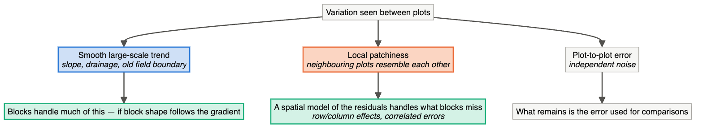
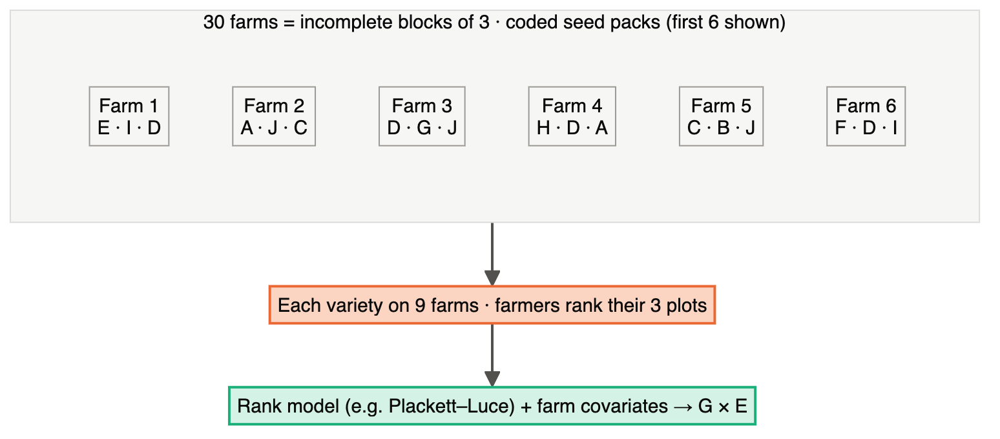

# Chapter 19 — Plant and Animal Breeding, Field Trials

> **Part IV — Field Playbooks**
> [← Chapter 18](18-biotech-bioprocess-pharmacy.md) · [Table of Contents](../README.md) · [Next: Chapter 20 — Genetics, Genomics and Transcriptomics →](20-genetics-genomics-transcriptomics.md)

---

<details>
<summary>🧬 <b>Biology primer</b> — breeding terms (expand if new)</summary>

- **Entry/line/genotype:** a variety or breeding line being tested.
- **Check:** an established variety included for comparison and to measure field variation.
- **Environment:** a location × year (× management) combination.
- **G × E:** genotype-by-environment interaction — lines rank differently in different environments.
- **BLUP:** best linear unbiased prediction of genetic values from a mixed model.
- **Genomic selection:** predicting breeding values from genome-wide markers.

</details>

---

## 🧭 Learning Objectives

After this chapter you will be able to:

1. Choose among RCBD, incomplete-block (α-lattice), row–column, augmented and p-rep designs for a field trial.
2. Explain why **blocking plus spatial analysis** is essential in heterogeneous fields.
3. Design multi-environment trials around G × E.
4. Design the **training population** and validation scheme for genomic selection.
5. Recognize the pen/herd as the experimental unit in livestock trials.

**Dominant question types:** screening (Q7), predictive (Q5), comparative (Q2).

---

## 🎯 The Big Picture

Randomization, replication and blocking were invented for agricultural field trials, and
breeding still faces them in their hardest form: hundreds or thousands of genotypes, too
little seed to replicate early generations, fields with fertility and moisture gradients,
and conclusions that must hold in environments that have not happened yet.

---

## 🧠 Core Intuition — the breeding playbook

### 1. Field designs by number of entries and seed

| Situation | Design |
|---|---|
| Few entries (≤ ~15), plenty of seed | randomized complete block (RCBD) |
| Many entries, plenty of seed | incomplete blocks: lattice, **α-designs** ([Piepho et al., 2006](https://doi.org/10.1111/j.1439-0523.2006.01267.x)); row–column designs |
| Many entries, seed for one plot each | **augmented design** (replicated checks in every block) |
| Many entries, seed for ~1.2 plots each | **partially replicated (p-rep)** designs with spatial analysis ([Cullis et al., 2006](https://doi.org/10.1198/108571106x154443)) |


### 2. Spatial analysis

Blocks capture large-scale gradients. Smooth trends and local patchiness remain. Modelling
correlation between neighbouring plots (e.g. separable autoregressive structures) removes
much of this variation ([Gilmour et al., 1997](https://doi.org/10.2307/1400446)). Design and spatial analysis work together: record
row and column for every plot.



### 3. Environments are the replicates that matter

Because of **G × E**, the environment (location × year) is the unit for generalization.
For a recommendation across a region, more environments usually beat more replicates
within one site.


### 4. Mixed models and BLUP

Genetic values are estimated with mixed models (BLUP) ([Henderson, 1975](https://doi.org/10.2307/2529430)), which combine the
design (blocks, rows, columns), relationships between lines and environments.

### 5. Genomic selection: a predictive (Q5) design problem

Genomic selection ([Meuwissen et al., 2001](https://doi.org/10.1093/genetics/157.4.1819)) is now routine in dairy cattle ([Hayes et al., 2009](https://doi.org/10.3168/jds.2008-1646)) and many crops
([Crossa et al., 2017](https://doi.org/10.1016/j.tplants.2017.08.011)). Accuracy depends on the **training population**: its size, phenotyping
quality, and **relatedness to the selection candidates**. Validation must mimic use —
predicting new families or new environments — or it will overestimate accuracy
([Daetwyler et al., 2013](https://doi.org/10.1534/genetics.112.147983); [Runcie & Cheng, 2019](https://doi.org/10.1534/g3.119.400598)).

### 6. Mapping populations are designed experiments

Nested association mapping ([Yu et al., 2008](https://doi.org/10.1534/genetics.107.074245)) and MAGIC populations ([Cavanagh et al., 2008](https://doi.org/10.1016/j.pbi.2008.01.002)) are built to
balance allelic diversity, recombination and power. Genotyping platform and marker QC are
design decisions ([Pavan et al., 2020](https://doi.org/10.3389/fgene.2020.00447)). High-throughput phenotyping must itself be validated
([Araus & Cairns, 2014](https://doi.org/10.1016/j.tplants.2013.09.008)).

### 7. Livestock

Animals in a pen or herd share feed, water and pathogens, so the **pen or herd** is often
the experimental unit. Livestock trials are reported with REFLECT ([Sargeant et al., 2010](https://doi.org/10.4315/0362-028x-73.3.579)).

---

## 👁️ Visual Intuition — an augmented design block

```
Block 7 (field row 7, columns 1–24)
| L161 | C2 | L162 | L163 | C4 | L164 | ... | C1 | L178 | C3 | L179 | L180 |
  L = new line (1 plot each, randomized)   C1–C4 = checks (in every block, randomized)
Check plots estimate block effects and error; new lines are adjusted using them.
```

---

## 🔬 Worked Example — what blocking buys in a field with a gradient

Simulation: **10 genotypes × 4 blocks** along a strong fertility gradient (block effects
−3, −1, +1, +3), genotype effects with SD 1, plot error SD 1. The same data analysed two
ways:

| Analysis | Residual mean square | *p* for genotype |
|---|---|---|
| Ignoring blocks (`y ~ genotype`) | 7.63 | 0.98 |
| With blocks (`y ~ block + genotype`) | 0.86 | 0.035 |

The gradient inflated the error **about ninefold** when ignored, hiding real genotype
differences. Blocking removed it — but only because the **design** put every genotype in
every block, so block and genotype effects were separable. (Code:
`scripts/course/worked_examples.R`.)

---

## ⚠️ Common Misconceptions

| ❌ The misconception | ✅ What is actually true — and what to do |
|---|---|
| **"Big blocks are fine."** | Large blocks are heterogeneous. With many entries, use incomplete blocks and spatial models. |
| **"Unreplicated lines can't be analysed."** | Augmented and p-rep designs, plus spatial models, make it possible. |
| **"One great site is enough."** | G × E means rankings can change; test in multiple environments. |
| **"Random cross-validation shows genomic prediction accuracy."** | Not if relatives sit in both sets and the use case is new families. |
| **"Each animal is a replicate."** | Not when treatments are applied per pen. |

---

## 🧪 Spot the Flaw

> "Twenty wheat varieties were planted in a single replicate, sorted alphabetically from
> west to east across one field. The top five yielding varieties are recommended for the
> region."

<details>
<summary>▶ Diagnosis</summary>

**No replication** (no error estimate), **no randomization** (alphabetical order aligns
varieties with an east–west gradient), **no blocking**, **one environment** (G × E
ignored). The ranking may reflect position in the field. **Fix:** an RCBD or α-design with
≥ 2–3 replicates per site, randomized positions, checks, row/column recorded for spatial
analysis, and several locations and years.
</details>

---

## 🔎 The Reviewer's Perspective

- **"What design, how many replicates, and how many environments?"**
- **"Were row/column positions recorded and spatial variation modelled?"**
- **"Are checks included, and how often?"**
- **"For genomic prediction: does validation mimic the intended use?"**
- **"For livestock: what is the unit — animal, pen or herd?"**

---

## 🛠️ Design Challenges

Three designs from breeding and animal science: a multi-location variety trial, a
livestock feeding trial and an on-farm trial with farmers. For each, decide what the
block is and what the replicates that matter are — then open the model answer and its
diagram. (For many more, see the [field-trials sub-course](../subcourses/field-trials/README.md).)

### Challenge 1 · Plant breeding · ⭐⭐ — 150 maize hybrids at 4 locations

You must evaluate 150 advanced maize hybrids at 4 locations, with seed for 2 replicates
per location. Fields are 10 rows × 30 columns of plots per location.

<details>
<summary>▶ A model design</summary>

- **Per location:** a resolvable **α-design** with 2 replicates of 150 plots; each
  replicate split into 15 incomplete blocks of 10 plots; 300 plots fit the 10 × 30 grid.
  Better still, a **row–column** α-design so both directions are blocked.
- **Checks:** include 2–3 commercial hybrids as entries (they are part of the 150, or add
  them).
- **Randomize** independently at each location.
- **Record** row and column; analyse with a mixed model including replicate, incomplete
  block, spatial residual structure, and genotype; combine locations in a
  multi-environment model with G × E.


</details>

### Challenge 2 · Animal nutrition · ⭐⭐ — four diets for dairy cows

You want to compare 4 diets for milk yield. Cows differ enormously in yield, and you have
12 cows in mid-lactation. Each diet needs 2 weeks of adaptation before 1 week of
measurement. Design the trial.

<details>
<summary>▶ A model design</summary>

- **Within-cow comparison:** each cow receives all 4 diets in 4 periods — a **crossover**
  (Chapter 7) that removes the large between-cow variation.
- **Latin squares:** 3 squares of 4 cows × 4 periods; within a square each diet appears once
  per cow and once per period, so cow and period are both blocked.
- **Carry-over:** use a **Williams square**, in which each diet follows every other diet
  exactly once, so first-order carry-over effects are balanced and can be estimated; the
  2-week adaptation acts as a washout, and only week 3 of each period is analysed.
- **Lactation stage changes yield over time** — the period effect in the model absorbs it.
- **Analysis:** `yield ~ square + cow(square) + period(square) + diet` (± carry-over term);
  **cow-period** is the unit for diet comparisons.


</details>

### Challenge 3 · Participatory breeding · ⭐⭐ — 10 varieties, 30 farmers

A programme wants farmers' own evaluation of 10 bean varieties under real farm conditions.
Each of 30 farmers can grow only **3 small plots**. Farmers' fields, soils and management
differ a lot. Design the trial.

<details>
<summary>▶ A model design</summary>

- **Each farm is an incomplete block** of size 3: within-farm comparisons remove the large
  differences between farms.
- **Allocation:** 30 farms × 3 plots = 90 plots → each variety appears **9 times**; assign
  sets of 3 at random under the constraint that every variety appears equally often (and,
  ideally, each pair of varieties meets on a similar number of farms). This is the logic of
  the "tricot" (triadic comparison of technologies) approach.
- **Data:** farmers **rank** the 3 varieties (best/worst) for yield, taste, cooking time etc.,
  plus a simple yield measurement where possible; codes, not variety names, on the seed packs
  (blinding).
- **Analysis:** rank-based models (e.g. Plackett–Luce) that combine incomplete rankings; add
  farm covariates (soil, altitude, rainfall) to study G × E.



The variety sets were drawn at random (seeded) with the constraint that each of the 10
varieties appears exactly 9 times.
</details>

---

## ✅ Check Your Understanding

**⭐ Q1.** When would you use an augmented design?

**⭐ Q2.** Why record row and column for every plot?

**⭐⭐ Q3.** In the worked example, why did *p* change from 0.98 to 0.035?

**⭐⭐ Q4.** How should you validate a genomic prediction model meant to select among new
crosses next year?

**⭐⭐⭐ Q5.** A feed additive is tested on 400 pigs housed in 20 pens of 20. Design the
allocation and analysis.

---

## 📝 Sample Answers & Assessment

<details>
<summary>▶ Show sample answers</summary>

> **Q1 — Sample answer:** *"When there's only seed for one plot per line."* — **✔ 10/10.**
Add: replicated checks in every block provide the error estimate and adjustment.

> **Q2 — Sample answer:** *"For spatial analysis."* — **✔ 9/10.** And to diagnose field
trends after the fact; without coordinates you cannot model them.

> **Q3 — Sample answer:** *"Blocking removed the gradient from the error."* — **✔ 10/10.**

> **Q4 — Sample answer:** *"Cross-validation."* — **◑ 4/10.** Which kind matters: hold out
whole **families/crosses** (and ideally a future year), because random line splits put
relatives in both sets and overstate accuracy ([Runcie & Cheng, 2019](https://doi.org/10.1534/g3.119.400598)).

> **Q5 — Sample answer:** *"Randomize pens to additive or control, 10 each; analyse pen
means."* — **✔ 9/10.** Improve with blocking: pair pens by barn location or starting
weight and randomize within pairs; record individual weights but analyse with pen as the
unit or random effect; blinded feed codes.

**Rubric:** breeding answers need the unit, the block/spatial structure and the
environments.
</details>

---

## 🧾 Chapter Summary

| Concept | One-line takeaway |
|---|---|
| **Field designs** | RCBD → α/row–column → augmented → p-rep as entries grow and seed shrinks. |
| **Spatial analysis** | Record coordinates; model neighbour correlation. |
| **Environments** | The unit for generalization under G × E. |
| **Genomic selection** | Training-set design and use-matched validation. |
| **Livestock** | Pen/herd as unit; REFLECT. |

**Traps to remember:** alphabetical plots · single site · random-split GS validation ·
animals as *n* in pen trials.

### 📇 Design Card — field checklist

| Item | Done? |
|---|---|
| Field design matched to entries and seed | |
| Checks and their frequency | |
| Coordinates recorded; spatial model planned | |
| Environments (locations × years) | |
| Validation mimics intended selection | |

---

## 🔗 Go Deeper

- 🌾 **Hands-on sub-course:** [Field Experiments in Agriculture & Plant Breeding](../subcourses/field-trials/README.md) — real field maps, design generation and mixed-model analysis in R.
- 📘 Biostat course: [Ch. 13 — ANOVA](https://github.com/MdRasheduz-zaman/biostatistics/blob/main/chapters/13-anova.md) · [Ch. 33 — Mixed Models](https://github.com/MdRasheduz-zaman/biostatistics/blob/main/chapters/33-hierarchical-mixed-models.md) · [Ch. 22 — Cross-Validation](https://github.com/MdRasheduz-zaman/biostatistics/blob/main/chapters/22-cross-validation.md)
- Field and breeding design classics: ([Mead et al., 2012](https://doi.org/10.1017/cbo9781139020879))

## 📚 References cited in this chapter

- Araus JL, Cairns JE (2014). Field high-throughput phenotyping: the new crop breeding frontier. *Trends in Plant Science* 19:52-61. [doi:10.1016/j.tplants.2013.09.008](https://doi.org/10.1016/j.tplants.2013.09.008)
- Cavanagh C, Morell M, Mackay I, Powell W (2008). From mutations to MAGIC: resources for gene discovery, validation and delivery in crop plants. *Current Opinion in Plant Biology* 11:215-221. [doi:10.1016/j.pbi.2008.01.002](https://doi.org/10.1016/j.pbi.2008.01.002)
- Crossa J, Pérez-Rodríguez P, Cuevas J, Montesinos-López O, Jarquín D, de los Campos G, et al. (2017). Genomic Selection in Plant Breeding: Methods, Models, and Perspectives. *Trends in Plant Science* 22:961-975. [doi:10.1016/j.tplants.2017.08.011](https://doi.org/10.1016/j.tplants.2017.08.011)
- Cullis BR, Smith AB, Coombes NE (2006). On the design of early generation variety trials with correlated data. *Journal of Agricultural, Biological, and Environmental Statistics* 11:381-393. [doi:10.1198/108571106x154443](https://doi.org/10.1198/108571106x154443)
- Daetwyler HD, Calus MPL, Pong-Wong R, de los Campos G, Hickey JM (2013). Genomic Prediction in Animals and Plants: Simulation of Data, Validation, Reporting, and Benchmarking. *Genetics* 193:347-365. [doi:10.1534/genetics.112.147983](https://doi.org/10.1534/genetics.112.147983)
- Gilmour AR, Cullis BR, Verbyla AP, Verbyla AP (1997). Accounting for Natural and Extraneous Variation in the Analysis of Field Experiments. *Journal of Agricultural, Biological, and Environmental Statistics* 2:269. [doi:10.2307/1400446](https://doi.org/10.2307/1400446)
- Hayes BJ, Bowman PJ, Chamberlain AJ, Goddard ME (2009). Invited review: Genomic selection in dairy cattle: Progress and challenges. *Journal of Dairy Science* 92:433-443. [doi:10.3168/jds.2008-1646](https://doi.org/10.3168/jds.2008-1646)
- Henderson CR (1975). Best Linear Unbiased Estimation and Prediction under a Selection Model. *Biometrics* 31:423. [doi:10.2307/2529430](https://doi.org/10.2307/2529430)
- Mead R, Gilmour SG, Mead A (2012). Statistical Principles for the Design of Experiments. *Cambridge University Press*. [doi:10.1017/cbo9781139020879](https://doi.org/10.1017/cbo9781139020879)
- Meuwissen THE, Hayes BJ, Goddard ME (2001). Prediction of Total Genetic Value Using Genome-Wide Dense Marker Maps. *Genetics* 157:1819-1829. [doi:10.1093/genetics/157.4.1819](https://doi.org/10.1093/genetics/157.4.1819)
- Pavan S, Delvento C, Ricciardi L, Lotti C, Ciani E, D’Agostino N (2020). Recommendations for Choosing the Genotyping Method and Best Practices for Quality Control in Crop Genome-Wide Association Studies. *Frontiers in Genetics* 11:447. [doi:10.3389/fgene.2020.00447](https://doi.org/10.3389/fgene.2020.00447)
- Piepho HP, Büchse A, Truberg B (2006). On the use of multiple lattice designs and α‐designs in plant breeding trials. *Plant Breeding* 125:523-528. [doi:10.1111/j.1439-0523.2006.01267.x](https://doi.org/10.1111/j.1439-0523.2006.01267.x)
- Runcie D, Cheng H (2019). Pitfalls and Remedies for Cross Validation with Multi-trait Genomic Prediction Methods. *G3 Genes|Genomes|Genetics* 9:3727-3741. [doi:10.1534/g3.119.400598](https://doi.org/10.1534/g3.119.400598)
- Sargeant JM, O’connor AM, Gardner IA, Dickson JS, Torrence ME, Dohoo CMPIR, et al. (2010). The REFLECT Statement: Reporting Guidelines for Randomized Controlled Trials in Livestock and Food Safety: Explanation and Elaboration. *Journal of Food Protection* 73:579-603. [doi:10.4315/0362-028x-73.3.579](https://doi.org/10.4315/0362-028x-73.3.579)
- Yu J, Holland JB, McMullen MD, Buckler ES (2008). Genetic Design and Statistical Power of Nested Association Mapping in Maize. *Genetics* 178:539-551. [doi:10.1534/genetics.107.074245](https://doi.org/10.1534/genetics.107.074245)


---

[← Chapter 18](18-biotech-bioprocess-pharmacy.md) · [Table of Contents](../README.md) · [Next: Chapter 20 — Genetics, Genomics and Transcriptomics →](20-genetics-genomics-transcriptomics.md)
