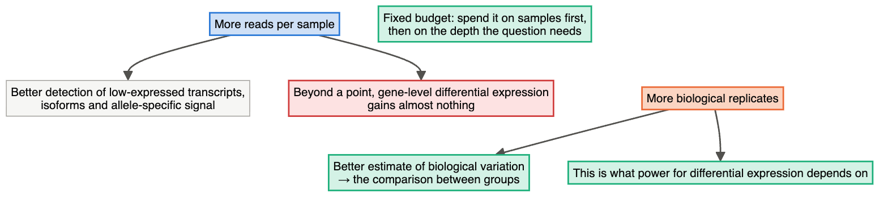
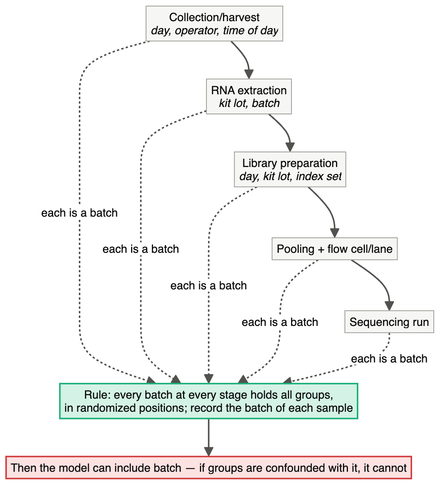
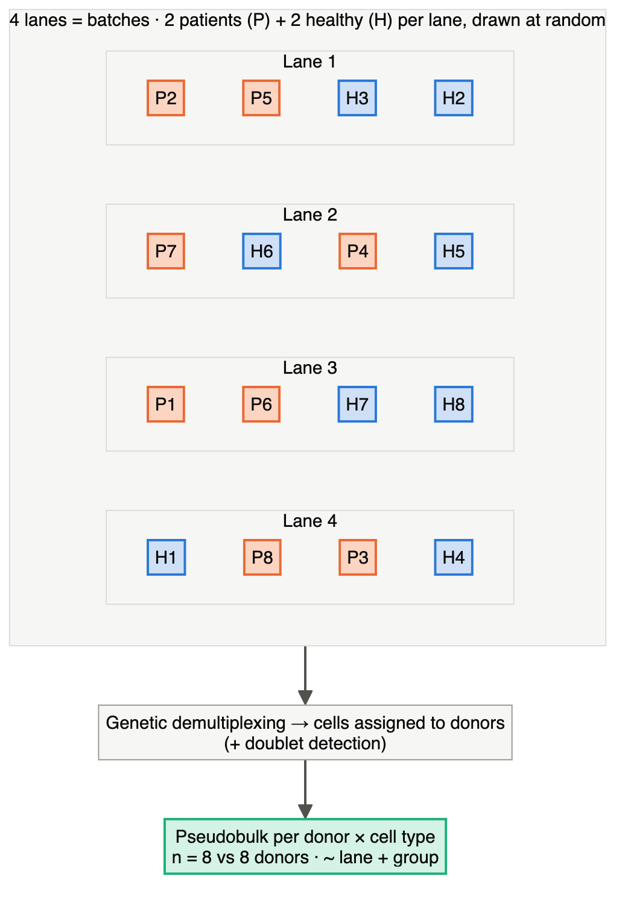

# Chapter 20 — Genetics, Genomics and Transcriptomics

> **Part IV — Field Playbooks**
> [← Chapter 19](19-breeding-and-field-trials.md) · [Table of Contents](../README.md) · [Next: Chapter 21 — Proteomics, Metabolomics and Multi-Omics →](21-proteomics-metabolomics-multiomics.md)

---

🧬 <b>Biology primer</b> — sequencing terms (expand if new)

- **Library:** DNA/cDNA fragments prepared for sequencing from one sample.
- **Depth:** number of reads per sample (e.g. 20 million).
- **Multiplexing:** pooling barcoded libraries so many samples share a sequencing run.
- **Pseudobulk:** summing single-cell counts per donor (and cell type) to get one profile per biological unit.
- **Input/control library (ChIP-seq):** chromatin not enriched by the antibody, used as background.

---

## 🧭 Learning Objectives

After this chapter you will be able to:

1. Summarize the design logic of QTL mapping, GWAS and functional genomics assays.
2. Decide between **more biological replicates** and **more sequencing depth** for RNA-seq.
3. Lay out libraries and runs so that batches never align with conditions.
4. Design single-cell studies around **donors**, with multiplexing and pseudobulk analysis.
5. Specify the controls and replication required for ChIP-seq and similar assays.

**Dominant question types:** comparative (Q2), descriptive (Q1), associational (Q4), screening (Q7).

---

## 🎯 The Big Picture

High-throughput sequencing changes the scale, not the principles. Three features reshape
design: **thousands of features per sample** (multiplicity sets the threshold), **many
processing steps** (each a potential batch), and **high per-sample cost** (constant
pressure to cut replicates). The principles of Part II still decide whether an omics
experiment can answer its question.

---

## 🧠 Core Intuition — the genomics playbook

### 1. Genetics

- **QTL mapping** in experimental crosses: cross type, population size, marker density and
  phenotyping replication set power and resolution ([Lander & Botstein, 1989](https://doi.org/10.1093/genetics/121.1.185); [Mackay et al., 2009](https://doi.org/10.1038/nrg2612)).
- **GWAS** (Chapter 11): large samples, 5 × 10⁻⁸ threshold, stratification control,
  replication cohorts, ancestral diversity ([Visscher et al., 2017](https://doi.org/10.1016/j.ajhg.2017.06.005); [Price et al., 2006](https://doi.org/10.1038/ng1847); [Peterson et al., 2019](https://doi.org/10.1016/j.cell.2019.08.051)).
- **Clinical variant interpretation** combines structured evidence rather than single
  tests ([Richards et al., 2015](https://doi.org/10.1038/gim.2015.30)).

### 2. Depth and coverage depend on the question

Variant calling, assembly, peak calling and expression counting have different depth
needs ([Sims et al., 2014](https://doi.org/10.1038/nrg3642)). For chromatin profiling, ENCODE guidelines require biological replicates,
matched input/control libraries and depth thresholds depending on whether marks are
punctate or broad ([Landt et al., 2012](https://doi.org/10.1101/gr.136184.111)). Methylation studies need methods that handle general
designs with replicates ([Park & Wu, 2016](https://doi.org/10.1093/bioinformatics/btw026)).

### 3. RNA-seq: replicates beat depth

Deeper sequencing reduces *sampling* noise, but **biological variability is not removed by
depth** ([Hansen et al., 2011](https://doi.org/10.1038/nbt.1910)). Once a gene has a moderate number of reads, extra depth adds little,
whereas extra replicates keep helping ([Liu et al., 2014](https://doi.org/10.1093/bioinformatics/btt688)). With 48 replicates per condition in yeast,
at least six biological replicates were needed for robust detection of differential
expression, and twelve to find most changes ([Schurch et al., 2016](https://doi.org/10.1261/rna.053959.115); [Conesa et al., 2016](https://doi.org/10.1186/s13059-016-0881-8)). Plan with power
tools that use realistic dispersions ([Hart et al., 2013](https://doi.org/10.1089/cmb.2012.0283); [Ching et al., 2014](https://doi.org/10.1261/rna.046011.114)). Count models with shared
dispersion estimation accommodate blocking terms ([Love et al., 2014](https://doi.org/10.1186/s13059-014-0550-8); [Robinson et al., 2010](https://doi.org/10.1093/bioinformatics/btp616); [Ritchie et al., 2015](https://doi.org/10.1093/nar/gkv007); [Auer & Doerge, 2010](https://doi.org/10.1534/genetics.110.114983)).

### 4. Batch layout

Balance conditions across RNA extraction days, library-prep batches and sequencing
runs/lanes (Chapter 5). Correction methods (ComBat, ComBat-seq) need group and batch effects to be
separable; perfect balance helps but is not required in every identifiable design ([Johnson et al., 2007](https://doi.org/10.1093/biostatistics/kxj037); [Zhang et al., 2020](https://doi.org/10.1093/nargab/lqaa078); [Nygaard et al., 2016](https://doi.org/10.1093/biostatistics/kxv027)). Microarray-era work established both the
efficiency of balanced designs ([Kerr, 2001](https://doi.org/10.1093/biostatistics/2.2.183); [Churchill, 2002](https://doi.org/10.1038/ng1031)) and the reproducibility achievable
with standardization ([Shi et al., 2006](https://doi.org/10.1038/nbt1239); [SEQC/MAQC-III Consortium, 2014](https://doi.org/10.1038/nbt.2957)).

### 5. Single-cell and spatial

- **Donors are the unit.** Tests treating cells as replicates produce floods of false
  positives; **pseudobulk** or mixed models restore error control ([Squair et al., 2021](https://doi.org/10.1038/s41467-021-25960-2); [Zimmerman et al., 2021](https://doi.org/10.1038/s41467-021-21038-1)).
- **Multiplex** samples from different conditions into the same capture (genetic or
  hashtag demultiplexing) so batch and condition are separable ([Tung et al., 2017](https://doi.org/10.1038/srep39921); [Baran-Gale et al., 2018](https://doi.org/10.1093/bfgp/elx035)).
- Integration methods are benchmarked ([Luecken et al., 2022](https://doi.org/10.1038/s41592-021-01336-8); [Tran et al., 2020](https://doi.org/10.1186/s13059-019-1850-9); [Haghverdi et al., 2018](https://doi.org/10.1038/nbt.4091)) but cannot
  fix confounding. Best-practice workflows: ([Luecken & Theis, 2019](https://doi.org/10.15252/msb.20188746); [Heumos et al., 2023](https://doi.org/10.1038/s41576-023-00586-w)).
- Protocol choice affects sensitivity ([Svensson et al., 2017](https://doi.org/10.1038/nmeth.4220)).
- **Spatial transcriptomics** adds sections and regions as further nesting levels
  ([Moses & Pachter, 2022](https://doi.org/10.1038/s41592-022-01409-2)).

### 6. Time-courses

Sampling density, synchronization and replication at each time point are design choices
([Bar-Joseph et al., 2012](https://doi.org/10.1038/nrg3244)).

---

## 👁️ Visual Intuition

*Panel b: power to detect a 1.5-fold change for a gene with biological dispersion 0.1.
Going from a mean of 100 to 1,000 reads changes power very little at any replicate
number; going from 2 to 12 replicates raises power from about 25% to over 85%.*

---

## 🔬 Worked Example — spend the budget on replicates or depth?

Using the simulation behind panel b (negative-binomial counts, dispersion 0.1, true
1.5-fold change, α = 0.05; code: `scripts/05_figures.R`):

| Design per group | Mean reads for the gene | Power |
|---|---|---|
| 3 replicates, deep | 1,000 | 0.34 |
| 3 replicates, moderate | 100 | 0.34 |
| 6 replicates, moderate | 100 | 0.57 |
| 12 replicates, moderate | 100 | 0.85 |
| 12 replicates, shallow | 10 | 0.65 |

- **3 deep samples** (3,000 reads per group for this gene) have *lower* power than
  **12 moderate samples** (1,200 reads per group).
- Very shallow sequencing does hurt (mean 10), so depth must be *adequate*, not maximal.
- **Lesson:** after adequate depth, put money into biological replicates — library prep is
  usually cheaper than an underpowered study. Multiplex more samples per run at lower
  depth.

---

## ⚠️ Common Misconceptions

| ❌ The misconception | ✅ What is actually true — and what to do |
|---|---|
| **"Deeper sequencing = more power."** | Only up to adequate depth. Replicates dominate. |
| **"Thousands of cells = large *n*."** | Donors are the unit. |
| **"Batch correction will fix it."** | Only if group and batch can be separated; a balanced layout is preferable. |
| **"Two replicates per condition are standard."** | They are common, and badly underpowered for modest fold changes. |
| **"A GWAS hit identifies the causal gene."** | It identifies an associated region. |

---

## 🧪 Spot the Flaw

> "We performed scRNA-seq on PBMCs from 2 patients and 2 healthy donors (one 10x lane
> per donor, processed on four different days). Differential expression in monocytes
> (Wilcoxon test on 8,000 cells) found 1,450 significant genes."

▶ Diagnosis

- **n = 2 vs 2 donors**; cells are pseudoreplicates → the 1,450 genes are mostly
  donor-level noise treated as signal ([Squair et al., 2021](https://doi.org/10.1038/s41467-021-25960-2)).
- **Donor = lane = day**: donor and processing effects cannot be separated.
  With one donor per batch and two batches per condition, this is not the same as
  all cases sharing one batch and all controls another; both designs still benefit
  from multiplexing and more donors.
- **Fix:** more donors (e.g. 6+ per group), multiplex donors from both groups in each lane
  with genetic demultiplexing, pseudobulk per donor × cell type, and a model including
  batch.

---

## 🔎 The Reviewer's Perspective

- **"How many biological replicates per condition, and how was that justified?"**
- **"Group × batch table for extraction, library prep and sequencing?"**
- **"For single-cell: donors per group, multiplexing, pseudobulk or mixed model?"**
- **"Controls and replicate concordance for ChIP-seq/ATAC-seq?"**

---

## 🛠️ Design Challenges

Three genomics designs: a bulk RNA-seq budget, a multiplexed single-cell study and an
evolution experiment read out by sequencing. For each, decide how many **independent
units** you need before deciding how deeply to sequence them — then open the model answer
and its diagram.

### Challenge 1 · Transcriptomics · ⭐⭐ — replicates or depth?

Budget: €12,000 for bulk RNA-seq of liver from mice on two diets × two sexes. Library prep
costs €100 per sample. Sequencing costs €300 per 100 million reads, in multiples of 100 M.
Design the study.

▶ A model design

- **Allocation:** prioritize replicates: e.g. 10 mice per diet × sex = 40 samples → €4,000
  library prep.
- **Depth:** €8,000 buys 2.6 billion reads → about 65 M reads per sample. That is more than
  needed for standard gene-level differential expression. Consider 48 samples (12 per group
  → €4,800 prep) at ~25–30 M reads each (12 × 100 M = 1.2 B for €3,600), leaving a reserve.
- **Batches:** each extraction/library batch contains all four diet × sex groups;
  all libraries multiplexed across all lanes.
- **Analysis:** `~ batch + sex * diet`, with the interaction if sex-specific effects are of
  interest (and power for it checked by simulation).

### Challenge 2 · Single-cell genomics · ⭐⭐⭐ — patients and controls on four lanes

You will compare blood immune cells of 8 patients and 8 healthy donors by single-cell
RNA-seq. Each microfluidic lane (one "run" of the instrument) can take cells from 4 people
at once, and you can afford 4 lanes. Design the layout and the analysis.

▶ A model design

- **Pool donors per lane:** **2 patients + 2 healthy donors in every lane**, assigned at
  random; cells are later assigned to their donor by **genetic demultiplexing** (natural
  SNP differences between people) ([Tung et al., 2017](https://doi.org/10.1038/srep39921)). Lane (a batch) is then balanced across groups
  instead of confounded with them, and doublets between people can be detected.
- **Same day, same protocol** for sample thawing and processing where possible; if samples
  are processed on 2 days, each day also gets both groups.
- **The donor is the unit:** thousands of cells per donor are sub-units (Chapter 3). Compare
  groups with **pseudobulk** (sum counts per donor and cell type) and a model
  `~ lane + group`, or a mixed model with donor as random effect — **not** a test treating
  cells as replicates.
- **Cell-type proportions** are compared per donor too (16 values, not thousands of cells).

### Challenge 3 · Experimental evolution · ⭐⭐ — how do bacteria adapt to an antibiotic?

You will evolve *E. coli* under a sub-lethal antibiotic concentration for 500 generations
and identify the mutations responsible for adaptation by whole-genome sequencing. You can
maintain 24 populations in a 96-well plate with daily transfers.

▶ A model design

- **One ancestor:** start all populations from a single sequenced clone, so every mutation
  found later arose during the experiment.
- **Replicate populations are the units:** **12 with antibiotic, 12 without** (controls
  adapting to the medium and the lab). Adaptation specific to the antibiotic shows up as
  genes mutated repeatedly in the antibiotic populations but not in the controls
  (**parallel evolution** is the evidence).
- **Plate layout:** alternate or randomize treatment positions; leave empty wells between
  populations to detect cross-contamination; use a genetic marker (e.g. two neutral marker
  variants in alternating populations) to catch contamination.
- **Frozen record:** freeze every population regularly (e.g. every 50 generations) so
  mutations can be dated and fitness measured later against the ancestor.
- **Sequencing:** whole-population sequencing at ≥ 100× depth finds mutations at ≥ ~10%
  frequency; sequence the ancestor too; follow up with clones and reconstruct key mutations
  in the ancestor to test their effect (Q3).

---

## ✅ Check Your Understanding

**⭐ Q1.** Why doesn't deeper sequencing remove biological variability?

**⭐ Q2.** What is pseudobulk, and why is it used?

**⭐⭐ Q3.** Using the table above, which design would you choose for a 1.5-fold change: 6
replicates at mean 100 reads, or 3 replicates at mean 1,000? Why?

**⭐⭐ Q4.** List the controls and replication ENCODE requires for ChIP-seq.

**⭐⭐⭐ Q5.** Design a single-cell study comparing tumour-infiltrating T cells between
responders and non-responders to immunotherapy.

---

## 📝 Sample Answers & Assessment

▶ Show sample answers

> **Q1 — Sample answer:** *"Because the variability is between animals, not between
reads."* — **✔ 10/10.**

> **Q2 — Sample answer:** *"Adding up cells per donor so the donor is the unit."* —
**✔ 10/10.** It turns a pseudoreplicated cell-level test into a properly replicated
donor-level test.

> **Q3 — Sample answer:** *"6 at 100 — power 0.57 vs 0.34, and fewer total reads."* —
**✔ 10/10.**

> **Q4 — Sample answer:** *"Input control and two replicates."* — **✔ 8/10.** Plus depth
thresholds by mark type and replicate-concordance metrics ([Landt et al., 2012](https://doi.org/10.1101/gr.136184.111)).

> **Q5 — Sample answer:** *"Sequence T cells from responders and non-responders."* —
**◑ 4/10.** Needs: patients as units (enough per group, justified by simulation);
standardized biopsy timing and handling; multiplexing samples across responder status in
each capture; hashtags/genotypes to demultiplex; pseudobulk by patient × cell state;
adjustment for tumour type and prior treatment; a validation cohort.

**Rubric:** omics answers need units, batch layout, and depth *only as much as needed*.

---

## 🧾 Chapter Summary

| Concept | One-line takeaway |
|---|---|
| **Genetics** | Crosses and GWAS are designed by size, structure and replication. |
| **Depth** | Adequate for the assay; beyond that, replicates win. |
| **Batches** | Balance groups across every processing step. |
| **Single-cell** | Donors are the unit; multiplex; pseudobulk. |
| **Controls** | Inputs, replicates and concordance for chromatin assays. |

**Traps to remember:** 2 vs 2 · cells as *n* · lane = condition · depth over replicates.

### 📇 Design Card — field checklist

| Item | Done? |
|---|---|
| Biological replicates per group (justified) | |
| Depth matched to assay | |
| Group × batch table for every processing step | |
| Single-cell: donors, multiplexing, pseudobulk plan | |
| Assay controls (input, spike-ins) | |

---

## 🔗 Go Deeper

- 📘 Biostat course: [Ch. 20 — Count Data Models](https://github.com/MdRasheduz-zaman/biostatistics/blob/main/chapters/20-count-data.md) · [Ch. 28 — FDR](https://github.com/MdRasheduz-zaman/biostatistics/blob/main/chapters/28-fdr.md) · [Ch. 29 — Batch Effects](https://github.com/MdRasheduz-zaman/biostatistics/blob/main/chapters/29-batch-effects.md) · [Ch. 36 — Population Structure](https://github.com/MdRasheduz-zaman/biostatistics/blob/main/chapters/36-causal-tools.md)

## 📚 References cited in this chapter

- Auer PL, Doerge RW (2010). Statistical Design and Analysis of RNA Sequencing Data. *Genetics* 185:405-416. [doi:10.1534/genetics.110.114983](https://doi.org/10.1534/genetics.110.114983)
- Bar-Joseph Z, Gitter A, Simon I (2012). Studying and modelling dynamic biological processes using time-series gene expression data. *Nature Reviews Genetics* 13:552-564. [doi:10.1038/nrg3244](https://doi.org/10.1038/nrg3244)
- Baran-Gale J, Chandra T, Kirschner K (2018). Experimental design for single-cell RNA sequencing. *Briefings in Functional Genomics* 17:233-239. [doi:10.1093/bfgp/elx035](https://doi.org/10.1093/bfgp/elx035)
- Ching T, Huang S, Garmire LX (2014). Power analysis and sample size estimation for RNA-Seq differential expression. *RNA* 20:1684-1696. [doi:10.1261/rna.046011.114](https://doi.org/10.1261/rna.046011.114)
- Churchill GA (2002). Fundamentals of experimental design for cDNA microarrays. *Nature Genetics* 32:490-495. [doi:10.1038/ng1031](https://doi.org/10.1038/ng1031)
- Conesa A, Madrigal P, Tarazona S, Gomez-Cabrero D, Cervera A, McPherson A, et al. (2016). A survey of best practices for RNA-seq data analysis. *Genome Biology* 17:13. [doi:10.1186/s13059-016-0881-8](https://doi.org/10.1186/s13059-016-0881-8)
- Haghverdi L, Lun ATL, Morgan MD, Marioni JC (2018). Batch effects in single-cell RNA-sequencing data are corrected by matching mutual nearest neighbors. *Nature Biotechnology* 36:421-427. [doi:10.1038/nbt.4091](https://doi.org/10.1038/nbt.4091)
- Hansen KD, Wu Z, Irizarry RA, Leek JT (2011). Sequencing technology does not eliminate biological variability. *Nature Biotechnology* 29:572-573. [doi:10.1038/nbt.1910](https://doi.org/10.1038/nbt.1910)
- Hart SN, Therneau TM, Zhang Y, Poland GA, Kocher JP (2013). Calculating Sample Size Estimates for RNA Sequencing Data. *Journal of Computational Biology* 20:970-978. [doi:10.1089/cmb.2012.0283](https://doi.org/10.1089/cmb.2012.0283)
- Heumos L, Schaar AC, Lance C, Litinetskaya A, Drost F, Zappia L, et al. (2023). Best practices for single-cell analysis across modalities. *Nature Reviews Genetics* 24:550-572. [doi:10.1038/s41576-023-00586-w](https://doi.org/10.1038/s41576-023-00586-w)
- Johnson WE, Li C, Rabinovic A (2007). Adjusting batch effects in microarray expression data using empirical Bayes methods. *Biostatistics* 8:118-127. [doi:10.1093/biostatistics/kxj037](https://doi.org/10.1093/biostatistics/kxj037)
- Kerr MK (2001). Experimental design for gene expression microarrays. *Biostatistics* 2:183-201. [doi:10.1093/biostatistics/2.2.183](https://doi.org/10.1093/biostatistics/2.2.183)
- Lander ES, Botstein D (1989). Mapping mendelian factors underlying quantitative traits using RFLP linkage maps.. *Genetics* 121:185-199. [doi:10.1093/genetics/121.1.185](https://doi.org/10.1093/genetics/121.1.185)
- Landt SG, Marinov GK, Kundaje A, Kheradpour P, Pauli F, Batzoglou S, et al. (2012). ChIP-seq guidelines and practices of the ENCODE and modENCODE consortia. *Genome Research* 22:1813-1831. [doi:10.1101/gr.136184.111](https://doi.org/10.1101/gr.136184.111)
- Liu Y, Zhou J, White KP (2014). RNA-seq differential expression studies: more sequence or more replication?. *Bioinformatics* 30:301-304. [doi:10.1093/bioinformatics/btt688](https://doi.org/10.1093/bioinformatics/btt688)
- Love MI, Huber W, Anders S (2014). Moderated estimation of fold change and dispersion for RNA-seq data with DESeq2. *Genome Biology* 15:550. [doi:10.1186/s13059-014-0550-8](https://doi.org/10.1186/s13059-014-0550-8)
- Luecken MD, Theis FJ (2019). Current best practices in single‐cell RNA‐seq analysis: a tutorial. *Molecular Systems Biology* 15:MSB188746. [doi:10.15252/msb.20188746](https://doi.org/10.15252/msb.20188746)
- Luecken MD, Büttner M, Chaichoompu K, Danese A, Interlandi M, Mueller MF, et al. (2022). Benchmarking atlas-level data integration in single-cell genomics. *Nature Methods* 19:41-50. [doi:10.1038/s41592-021-01336-8](https://doi.org/10.1038/s41592-021-01336-8)
- Mackay TFC, Stone EA, Ayroles JF (2009). The genetics of quantitative traits: challenges and prospects. *Nature Reviews Genetics* 10:565-577. [doi:10.1038/nrg2612](https://doi.org/10.1038/nrg2612)
- Moses L, Pachter L (2022). Museum of spatial transcriptomics. *Nature Methods* 19:534-546. [doi:10.1038/s41592-022-01409-2](https://doi.org/10.1038/s41592-022-01409-2)
- Nygaard V, Rødland EA, Hovig E (2016). Methods that remove batch effects while retaining group differences may lead to exaggerated confidence in downstream analyses. *Biostatistics* 17:29-39. [doi:10.1093/biostatistics/kxv027](https://doi.org/10.1093/biostatistics/kxv027)
- Park Y, Wu H (2016). Differential methylation analysis for BS-seq data under general experimental design. *Bioinformatics* 32:1446-1453. [doi:10.1093/bioinformatics/btw026](https://doi.org/10.1093/bioinformatics/btw026)
- Peterson RE, Kuchenbaecker K, Walters RK, Chen CY, Popejoy AB, Periyasamy S, et al. (2019). Genome-wide Association Studies in Ancestrally Diverse Populations: Opportunities, Methods, Pitfalls, and Recommendations. *Cell* 179:589-603. [doi:10.1016/j.cell.2019.08.051](https://doi.org/10.1016/j.cell.2019.08.051)
- Price AL, Patterson NJ, Plenge RM, Weinblatt ME, Shadick NA, Reich D (2006). Principal components analysis corrects for stratification in genome-wide association studies. *Nature Genetics* 38:904-909. [doi:10.1038/ng1847](https://doi.org/10.1038/ng1847)
- Richards S, Aziz N, Bale S, Bick D, Das S, Gastier-Foster J, et al. (2015). Standards and guidelines for the interpretation of sequence variants: a joint consensus recommendation of the American College of Medical Genetics and Genomics and the Association for Molecular Pathology. *Genetics in Medicine* 17:405-424. [doi:10.1038/gim.2015.30](https://doi.org/10.1038/gim.2015.30)
- Ritchie ME, Phipson B, Wu D, Hu Y, Law CW, Shi W, et al. (2015). limma powers differential expression analyses for RNA-sequencing and microarray studies. *Nucleic Acids Research* 43:e47-e47. [doi:10.1093/nar/gkv007](https://doi.org/10.1093/nar/gkv007)
- Robinson MD, McCarthy DJ, Smyth GK (2010). edgeR : a Bioconductor package for differential expression analysis of digital gene expression data. *Bioinformatics* 26:139-140. [doi:10.1093/bioinformatics/btp616](https://doi.org/10.1093/bioinformatics/btp616)
- Schurch NJ, Schofield P, Gierliński M, Cole C, Sherstnev A, Singh V, et al. (2016). How many biological replicates are needed in an RNA-seq experiment and which differential expression tool should you use?. *RNA* 22:839-851. [doi:10.1261/rna.053959.115](https://doi.org/10.1261/rna.053959.115)
- SEQC/MAQC-III Consortium (2014). A comprehensive assessment of RNA-seq accuracy, reproducibility and information content by the Sequencing Quality Control Consortium. *Nature Biotechnology* 32:903-914. [doi:10.1038/nbt.2957](https://doi.org/10.1038/nbt.2957)
- Shi L, Shi L, Reid LH, Jones WD, Shippy R, Warrington JA, et al. (2006). The MicroArray Quality Control (MAQC) project shows inter- and intraplatform reproducibility of gene expression measurements. *Nature Biotechnology* 24:1151-1161. [doi:10.1038/nbt1239](https://doi.org/10.1038/nbt1239)
- Sims D, Sudbery I, Ilott NE, Heger A, Ponting CP (2014). Sequencing depth and coverage: key considerations in genomic analyses. *Nature Reviews Genetics* 15:121-132. [doi:10.1038/nrg3642](https://doi.org/10.1038/nrg3642)
- Squair JW, Gautier M, Kathe C, Anderson MA, James ND, Hutson TH, et al. (2021). Confronting false discoveries in single-cell differential expression. *Nature Communications* 12:5692. [doi:10.1038/s41467-021-25960-2](https://doi.org/10.1038/s41467-021-25960-2)
- Svensson V, Natarajan KN, Ly LH, Miragaia RJ, Labalette C, Macaulay IC, et al. (2017). Power analysis of single-cell RNA-sequencing experiments. *Nature Methods* 14:381-387. [doi:10.1038/nmeth.4220](https://doi.org/10.1038/nmeth.4220)
- Tran HTN, Ang KS, Chevrier M, Zhang X, Lee NYS, Goh M, et al. (2020). A benchmark of batch-effect correction methods for single-cell RNA sequencing data. *Genome Biology* 21:12. [doi:10.1186/s13059-019-1850-9](https://doi.org/10.1186/s13059-019-1850-9)
- Tung PY, Blischak JD, Hsiao CJ, Knowles DA, Burnett JE, Pritchard JK, et al. (2017). Batch effects and the effective design of single-cell gene expression studies. *Scientific Reports* 7:39921. [doi:10.1038/srep39921](https://doi.org/10.1038/srep39921)
- Visscher PM, Wray NR, Zhang Q, Sklar P, McCarthy MI, Brown MA, et al. (2017). 10 Years of GWAS Discovery: Biology, Function, and Translation. *The American Journal of Human Genetics* 101:5-22. [doi:10.1016/j.ajhg.2017.06.005](https://doi.org/10.1016/j.ajhg.2017.06.005)
- Zhang Y, Parmigiani G, Johnson WE (2020). ComBat-seq: batch effect adjustment for RNA-seq count data. *NAR Genomics and Bioinformatics* 2:lqaa078. [doi:10.1093/nargab/lqaa078](https://doi.org/10.1093/nargab/lqaa078)
- Zimmerman KD, Espeland MA, Langefeld CD (2021). A practical solution to pseudoreplication bias in single-cell studies. *Nature Communications* 12:738. [doi:10.1038/s41467-021-21038-1](https://doi.org/10.1038/s41467-021-21038-1)

---

[← Chapter 19](19-breeding-and-field-trials.md) · [Table of Contents](../README.md) · [Next: Chapter 21 — Proteomics, Metabolomics and Multi-Omics →](21-proteomics-metabolomics-multiomics.md)
