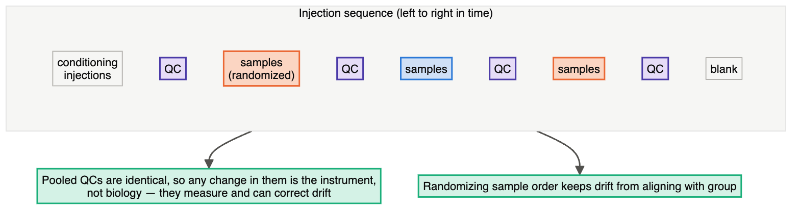
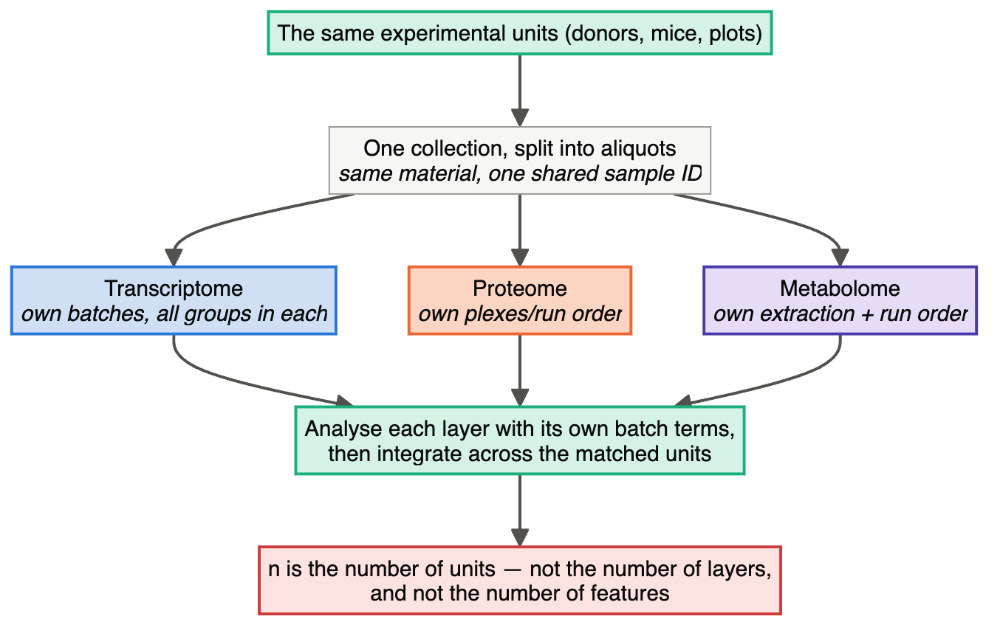
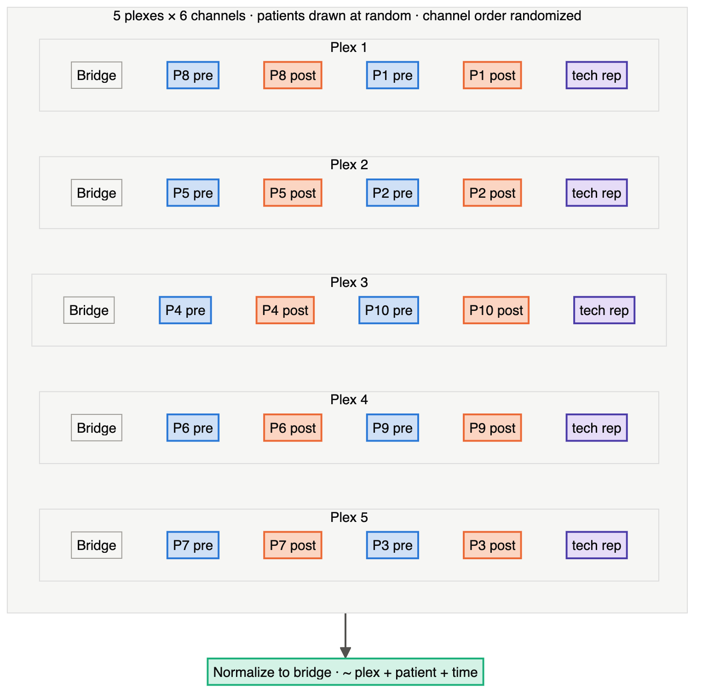

# Chapter 21 — Proteomics, Metabolomics and Multi-Omics

> **Part IV — Field Playbooks**
> [← Chapter 20](20-genetics-genomics-transcriptomics.md) · [Table of Contents](../README.md) · [Next: Chapter 22 — Bioinformatics, Computational Biology and Data Science →](22-computational-and-data-science.md)

---

🧬 <b>Biology primer</b> — mass-spectrometry terms (expand if new)

- **LC-MS run/injection:** one sample analysed by liquid chromatography–mass spectrometry; runs are sequential, often over days.
- **Drift:** gradual change in instrument sensitivity or retention time across a run sequence.
- **Pooled QC sample:** a mixture of small aliquots of all study samples, injected repeatedly to monitor and correct drift.
- **Isobaric labelling (TMT):** several samples labelled and measured together in one "plex"; each plex is a batch.

---

## 🧭 Learning Objectives

After this chapter you will be able to:

1. Treat **run order** as a design variable and block-randomize samples across the acquisition sequence.
2. Plan pooled QC, blanks, system-suitability and reference samples.
3. Design multiplexed (TMT) experiments with bridge channels.
4. Control **pre-analytical** variation in biomarker studies.
5. Design multi-omics studies with matched samples and reference materials, and recognize
   optimal design for dynamic models.

**Dominant question types:** descriptive (Q1), comparative (Q2), predictive biomarker discovery (Q5), mechanistic (Q3).

---

## 🎯 The Big Picture

Mass-spectrometry platforms are exquisitely sensitive — to analytes and to everything
else: column ageing, source contamination, temperature, sample handling. A sample's
**position in the run sequence** can change its measured profile more than the biology
does. Proteomics and metabolomics design is therefore largely about **time and handling**:
when samples were collected, how they were stored, and in what order they were run
([Oberg & Vitek, 2009](https://doi.org/10.1021/pr8010099); [Broadhurst et al., 2018](https://doi.org/10.1007/s11306-018-1367-3)).

---

## 🧠 Core Intuition — the MS-omics playbook

### 1. Run order is a factor

Never run all cases, then all controls. **Block-randomize**: divide the sequence into
blocks, each holding a balanced set of groups in random order ([Oberg & Vitek, 2009](https://doi.org/10.1021/pr8010099)).

### 2. QC samples throughout

| Sample | Purpose |
|---|---|
| **Pooled QC** (every ~5–10 injections) | monitor and correct drift; filter unreliable features |
| **Blanks** | carry-over and background |
| **System-suitability samples** | check the instrument is fit before the run |
| **Long-term reference** | link batches and studies |

([Broadhurst et al., 2018](https://doi.org/10.1007/s11306-018-1367-3); [Dunn et al., 2011](https://doi.org/10.1038/nprot.2011.335); [Dunn et al., 2012](https://doi.org/10.4155/bio.12.204); [Kirwan et al., 2022](https://doi.org/10.1007/s11306-022-01926-3))

### 3. Multiplexes are blocks

In TMT/isobaric designs each plex is a batch. Spread groups evenly across plexes, and use a
common **bridge/reference channel** in every plex to link them. Batch diagnostics and
correction are part of the workflow ([Čuklina et al., 2021](https://doi.org/10.15252/msb.202110240)).

### 4. Pre-analytical variation

Quenching, extraction, freezing delays, haemolysis and storage time alter metabolites and
proteins ([Lu et al., 2017](https://doi.org/10.1146/annurev-biochem-061516-044952)). Biomarker studies have failed repeatedly because **disease status was
confounded with collection site, time or handling**. Match cases and controls on
pre-analytical variables and **reserve an independent validation cohort** ([Nakayasu et al., 2021](https://doi.org/10.1038/s41596-021-00566-6); [Aebersold & Mann, 2016](https://doi.org/10.1038/nature19949)).

### 5. Identification and reporting

Report identification confidence and follow community standards ([Sumner et al., 2007](https://doi.org/10.1007/s11306-007-0082-2); [Alseekh et al., 2021](https://doi.org/10.1038/s41592-021-01197-1)).
Multi-lab studies show what reproducibility is achievable with standardized workflows
([Addona et al., 2009](https://doi.org/10.1038/nbt.1546); [Collins et al., 2017](https://doi.org/10.1038/s41467-017-00249-5)). Single-cell proteomics has its own recommendations ([Gatto et al., 2023](https://doi.org/10.1038/s41592-023-01785-3)).

### 6. Multi-omics

- **Same samples, same handling** for all layers; batch structures must not line up with
  omics layer or condition ([Hasin et al., 2017](https://doi.org/10.1186/s13059-017-1215-1); [Graw et al., 2020](https://doi.org/10.1039/d0mo00041h); [Chicco et al., 2023](https://doi.org/10.1371/journal.pcbi.1011224)).
- **Reference materials** measured alongside study samples enable ratio-based scaling across
  batches and platforms ([Yu et al., 2023](https://doi.org/10.1186/s13059-023-03047-z)).
- Factor models (e.g. MOFA) separate shared and layer-specific variation — only if design
  variation is not aliased with biology ([Argelaguet et al., 2018](https://doi.org/10.15252/msb.20178124)). Microbial community multi-omics:
  ([Mallick et al., 2017](https://doi.org/10.1186/s13059-017-1359-z)).

### 7. Systems biology: design for identifiability

For mechanistic dynamic models, ask: which perturbations, observables and time points make
the parameters **identifiable**? Optimal experimental design selects experiments that
maximize information or discriminate between models ([Kreutz & Timmer, 2009](https://doi.org/10.1111/j.1742-4658.2008.06843.x); [Raue et al., 2010](https://doi.org/10.1063/1.3528102); [Steiert et al., 2012](https://doi.org/10.1371/journal.pone.0040052); [Silk et al., 2014](https://doi.org/10.1371/journal.pcbi.1003650); [Tiwari et al., 2021](https://doi.org/10.15252/msb.20209982)).

---

## 👁️ Visual Intuition — a block-randomized LC-MS sequence

---

## 🔬 Worked Example — planning a 60-sample plasma metabolomics study

30 cases and 30 controls, plasma, LC-MS over 3 days.

1. **Collection:** same site, same tube type, same time-to-freezer (e.g. < 30 min), recorded
   for every sample. Cases and controls collected in the same period.
2. **Blocking:** 3 days × 2 blocks of 10 samples (5 cases + 5 controls), order randomized
   within each block.
3. **QCs:** a pooled QC at the start and after every block (plus every 5 injections if drift
   is strong); blanks at start and end; system-suitability check each morning.
4. **Sample prep:** extraction batches mirror the run blocks (each balanced).
5. **Analysis plan:** drift correction from QCs; remove features with high QC variability;
   model `~ day + group (+ covariates)`.
6. **Validation:** an independent cohort, collected separately, for any biomarker claims.

---

## ⚠️ Common Misconceptions

| ❌ The misconception | ✅ What is actually true — and what to do |
|---|---|
| **"Run order doesn't matter on a good instrument."** | All instruments drift. |
| **"Pooled QCs are just for quality reports."** | They are the basis for drift correction and feature filtering. |
| **"Plasma is plasma."** | Handling time, tube type and haemolysis change profiles. |
| **"Multi-omics integration will reveal the biology."** | Only if layers are matched and batches balanced. |
| **"Discovery performance = biomarker performance."** | It must be confirmed in an independent cohort. |

---

## 🧪 Spot the Flaw

> "Serum from 40 Alzheimer's patients (memory clinic, 2015–2018) and 40 controls (blood
> donors, 2022) was analysed by proteomics. Patients were run in week 1, controls in week 2.
> A 12-protein panel distinguished the groups with AUC = 0.97."

▶ Diagnosis

Disease is confounded with **collection source, era/storage time and run week**. The panel
may detect storage degradation or instrument drift. AUC 0.97 in the discovery set is also
optimistic (Chapter 12). **Fix:** cases and controls from the same cohort and period,
matched storage time, block-randomized run order with QCs, and validation in an
independent cohort.

---

## 🔎 The Reviewer's Perspective

- **"Run order: randomized and balanced? QC frequency?"**
- **"Group × collection site × storage time × batch table?"**
- **"How were features filtered (QC variability) and drift corrected?"**
- **"Is there an independent validation cohort?"**
- **"For multi-omics: matched samples, reference materials, batch alignment?"**

---

## 🛠️ Design Challenges

Three mass-spectrometry and multi-omics designs. For each, list every step where samples
are processed in groups (harvest, extraction, plex, run order) — each one is a potential
batch — then open the model answer and its diagram.

### Challenge 1 · Clinical proteomics · ⭐⭐ — a TMT layout for paired samples

A 6-plex TMT proteomics study (each plex holds 6 channels) will compare tumour tissue from
10 patients before and after treatment (20 samples). Design the plex layout.

▶ A model design

- Reserve **1 channel per plex for a bridge** (a pooled reference of all samples), leaving
  5 sample channels.
- **Keep each patient's pre and post samples in the same plex**, so the key within-patient
  comparison is not affected by plex effects. Two pairs fit per plex (4 channels), so the
  10 patients need **5 plexes**; the fifth sample channel in each plex can hold a
  technical replicate of one sample (to estimate within-plex precision) or stay empty.
- Assign patients to plexes at random (or balanced by any important covariate, e.g. tumour
  type).
- **Randomize** channel assignment within plexes (labels can have small biases).
- **Analysis:** normalize to the bridge; model `~ plex + patient + time`.

The channel *order* inside each plex is shown tidy for readability; in the real layout it is
randomized.

### Challenge 2 · Plant metabolomics · ⭐⭐ — harvest time is a factor

You will compare leaf metabolites of 4 *Arabidopsis* genotypes, 6 plants each (24 plants).
Harvesting and freezing all 24 plants takes about 2 hours, and many metabolites (e.g. sugars,
amino acids) change over the day. Your draft: harvest genotype 1, then 2, then 3, then 4.

▶ A model design

- **The draft confounds genotype with time of day** — diurnal changes over 2 hours could
  look like genotype differences (pre-analytical variation, Chapter 21).
- **Blocked harvest order:** 6 harvest blocks of 4 plants, each block containing **one plant
  of every genotype in random order**; blocks in sequence from start to end. Time is then
  balanced across genotypes and can enter the model as a block.
- **Standardize:** start at a fixed time after lights-on; quench immediately in liquid
  nitrogen; record the exact harvest time of every plant.
- **Downstream:** the same blocked randomization for extraction and LC–MS run order, with
  pooled QC samples throughout (Chapter 21).

### Challenge 3 · Multi-omics · ⭐⭐⭐ — three platforms, one set of mice

You will measure the liver transcriptome, proteome and metabolome of 20 mice (10 on a
high-fat diet, 10 controls) and integrate the three layers. Each platform processes samples
in its own batches. Plan the sampling and the layouts.

▶ A model design

- **Same tissue, same sample ID:** collect a defined liver lobe, snap-freeze, **pulverize the
  frozen piece and split the powder into aliquots** for the three platforms — so all
  layers describe the same material, and integration is done on **matched samples**.
- **Each platform has its own batches:** RNA-seq library batches, proteomics plexes or run
  order, metabolomics extraction batches and run order — **every batch on every platform
  holds both diets**, randomized within (Chapters 5 and 21). Do not let the processing order of
  one platform copy the diet order of another.
- **QC per layer:** pooled QC/reference samples per platform; record all batch variables
  in one shared sample sheet.
- **Integration:** first analyse each layer with its own batch terms, then integrate on the
  20 matched mice (e.g. multi-omics factor analysis); 20 mice is the *n* for every layer.

---

## ✅ Check Your Understanding

**⭐ Q1.** What is a pooled QC sample, and how is it used?

**⭐ Q2.** Why is run order a design variable in LC-MS?

**⭐⭐ Q3.** Why should paired samples (pre/post) be placed in the same TMT plex?

**⭐⭐ Q4.** Name three pre-analytical factors to standardize in plasma metabolomics.

**⭐⭐⭐ Q5.** Plan a multi-omics (RNA-seq + proteomics + metabolomics) study of a drug
response in a cell line, emphasizing sample matching and batch design.

---

## 📝 Sample Answers & Assessment

▶ Show sample answers

> **Q1 — Sample answer:** *"A mixture of all samples run repeatedly to correct drift."* —
**✔ 10/10.** Also used to filter features with poor repeatability.

> **Q2 — Sample answer:** *"The instrument drifts over time."* — **✔ 10/10.**

> **Q3 — Sample answer:** *"So plex effects cancel in the comparison."* — **✔ 10/10.** The
plex acts as a block for the within-patient difference.

> **Q4 — Sample answer:** *"Time to freezer, tube type, haemolysis."* — **✔ 10/10.** Also
fasting status, freeze–thaw cycles and storage time.

> **Q5 — Sample answer:** *"Treat cells and measure all three omics."* — **◑ 5/10.** Needs:
the **same culture** split for all three layers at harvest (matched samples); independent
experiments (≥ 4) as blocks; processing batches for each platform balanced over
treatment; reference/QC samples for each platform; a time-course if mechanism is the goal;
pre-specified integration analysis.

**Rubric:** MS-omics answers need run order, QCs and pre-analytical control.

---

## 🧾 Chapter Summary

| Concept | One-line takeaway |
|---|---|
| **Run order** | Block-randomize; never run groups in sequence. |
| **QCs** | Pooled QC, blanks, SST, long-term reference. |
| **Plexes** | Each plex is a block; bridge channels; keep pairs together. |
| **Pre-analytics** | Standardize and record; match cases and controls. |
| **Multi-omics** | Matched samples, reference materials, non-aligned batches. |
| **Dynamic models** | Design experiments for identifiability. |

**Traps to remember:** cases week 1, controls week 2 · biobank vs fresh controls ·
discovery AUC as the result.

### 📇 Design Card — field checklist

| Item | Done? |
|---|---|
| Block-randomized run order | |
| QC/blank/SST schedule | |
| Plex/batch layout with bridges | |
| Pre-analytical SOP and records | |
| Independent validation cohort | |

---

## 🔗 Go Deeper

- 📘 Biostat course: [Ch. 29 — Batch Effects](https://github.com/MdRasheduz-zaman/biostatistics/blob/main/chapters/29-batch-effects.md) · [Ch. 28 — FDR](https://github.com/MdRasheduz-zaman/biostatistics/blob/main/chapters/28-fdr.md)

## 📚 References cited in this chapter

- Addona TA, Abbatiello SE, Schilling B, Skates SJ, Mani DR, Bunk DM, et al. (2009). Multi-site assessment of the precision and reproducibility of multiple reaction monitoring–based measurements of proteins in plasma. *Nature Biotechnology* 27:633-641. [doi:10.1038/nbt.1546](https://doi.org/10.1038/nbt.1546)
- Aebersold R, Mann M (2016). Mass-spectrometric exploration of proteome structure and function. *Nature* 537:347-355. [doi:10.1038/nature19949](https://doi.org/10.1038/nature19949)
- Alseekh S, Aharoni A, Brotman Y, Contrepois K, D’Auria J, Ewald J, et al. (2021). Mass spectrometry-based metabolomics: a guide for annotation, quantification and best reporting practices. *Nature Methods* 18:747-756. [doi:10.1038/s41592-021-01197-1](https://doi.org/10.1038/s41592-021-01197-1)
- Argelaguet R, Velten B, Arnol D, Dietrich S, Zenz T, Marioni JC, et al. (2018). Multi‐Omics Factor Analysis—a framework for unsupervised integration of multi‐omics data sets. *Molecular Systems Biology* 14:MSB178124. [doi:10.15252/msb.20178124](https://doi.org/10.15252/msb.20178124)
- Broadhurst D, Goodacre R, Reinke SN, Kuligowski J, Wilson ID, Lewis MR, et al. (2018). Guidelines and considerations for the use of system suitability and quality control samples in mass spectrometry assays applied in untargeted clinical metabolomic studies. *Metabolomics* 14:72. [doi:10.1007/s11306-018-1367-3](https://doi.org/10.1007/s11306-018-1367-3)
- Chicco D, Cumbo F, Angione C (2023). Ten quick tips for avoiding pitfalls in multi-omics data integration analyses. *PLOS Computational Biology* 19:e1011224. [doi:10.1371/journal.pcbi.1011224](https://doi.org/10.1371/journal.pcbi.1011224)
- Collins BC, Hunter CL, Liu Y, Schilling B, Rosenberger G, Bader SL, et al. (2017). Multi-laboratory assessment of reproducibility, qualitative and quantitative performance of SWATH-mass spectrometry. *Nature Communications* 8:291. [doi:10.1038/s41467-017-00249-5](https://doi.org/10.1038/s41467-017-00249-5)
- Dunn WB, Broadhurst D, Begley P, Zelena E, Francis-McIntyre S, Anderson N, et al. (2011). Procedures for large-scale metabolic profiling of serum and plasma using gas chromatography and liquid chromatography coupled to mass spectrometry. *Nature Protocols* 6:1060-1083. [doi:10.1038/nprot.2011.335](https://doi.org/10.1038/nprot.2011.335)
- Dunn WB, Wilson ID, Nicholls AW, Broadhurst D (2012). The Importance of Experimental Design And Qc Samples in Large-Scale And Ms-Driven Untargeted Metabolomic Studies of Humans. *Bioanalysis* 4:2249-2264. [doi:10.4155/bio.12.204](https://doi.org/10.4155/bio.12.204)
- Gatto L, Aebersold R, Cox J, Demichev V, Derks J, Emmott E, et al. (2023). Initial recommendations for performing, benchmarking and reporting single-cell proteomics experiments. *Nature Methods* 20:375-386. [doi:10.1038/s41592-023-01785-3](https://doi.org/10.1038/s41592-023-01785-3)
- Graw S, Chappell K, Washam CL, Gies A, Bird J, Robeson MS, et al. (2020). Multi-omics data integration considerations and study design for biological systems and disease. *Molecular Omics* 17:170-185. [doi:10.1039/d0mo00041h](https://doi.org/10.1039/d0mo00041h)
- Hasin Y, Seldin M, Lusis A (2017). Multi-omics approaches to disease. *Genome Biology* 18:83. [doi:10.1186/s13059-017-1215-1](https://doi.org/10.1186/s13059-017-1215-1)
- Kirwan JA, Gika H, Beger RD, Bearden D, Dunn WB, Goodacre R, et al. (2022). Quality assurance and quality control reporting in untargeted metabolic phenotyping: mQACC recommendations for analytical quality management. *Metabolomics* 18:70. [doi:10.1007/s11306-022-01926-3](https://doi.org/10.1007/s11306-022-01926-3)
- Kreutz C, Timmer J (2009). Systems biology: experimental design. *The FEBS Journal* 276:923-942. [doi:10.1111/j.1742-4658.2008.06843.x](https://doi.org/10.1111/j.1742-4658.2008.06843.x)
- Lu W, Su X, Klein MS, Lewis IA, Fiehn O, Rabinowitz JD (2017). Metabolite Measurement: Pitfalls to Avoid and Practices to Follow. *Annual Review of Biochemistry* 86:277-304. [doi:10.1146/annurev-biochem-061516-044952](https://doi.org/10.1146/annurev-biochem-061516-044952)
- Mallick H, Ma S, Franzosa EA, Vatanen T, Morgan XC, Huttenhower C (2017). Experimental design and quantitative analysis of microbial community multiomics. *Genome Biology* 18:228. [doi:10.1186/s13059-017-1359-z](https://doi.org/10.1186/s13059-017-1359-z)
- Nakayasu ES, Gritsenko M, Piehowski PD, Gao Y, Orton DJ, Schepmoes AA, et al. (2021). Tutorial: best practices and considerations for mass-spectrometry-based protein biomarker discovery and validation. *Nature Protocols* 16:3737-3760. [doi:10.1038/s41596-021-00566-6](https://doi.org/10.1038/s41596-021-00566-6)
- Oberg AL, Vitek O (2009). Statistical Design of Quantitative Mass Spectrometry-Based Proteomic Experiments. *Journal of Proteome Research* 8:2144-2156. [doi:10.1021/pr8010099](https://doi.org/10.1021/pr8010099)
- Raue A, Becker V, Klingmüller U, Timmer J (2010). Identifiability and observability analysis for experimental design in nonlinear dynamical models. *Chaos: An Interdisciplinary Journal of Nonlinear Science* 20:045105. [doi:10.1063/1.3528102](https://doi.org/10.1063/1.3528102)
- Silk D, Kirk PDW, Barnes CP, Toni T, Stumpf MPH (2014). Model Selection in Systems Biology Depends on Experimental Design. *PLoS Computational Biology* 10:e1003650. [doi:10.1371/journal.pcbi.1003650](https://doi.org/10.1371/journal.pcbi.1003650)
- Steiert B, Raue A, Timmer J, Kreutz C (2012). Experimental Design for Parameter Estimation of Gene Regulatory Networks. *PLoS ONE* 7:e40052. [doi:10.1371/journal.pone.0040052](https://doi.org/10.1371/journal.pone.0040052)
- Sumner LW, Amberg A, Barrett D, Beale MH, Beger R, Daykin CA, et al. (2007). Proposed minimum reporting standards for chemical analysis. *Metabolomics* 3:211-221. [doi:10.1007/s11306-007-0082-2](https://doi.org/10.1007/s11306-007-0082-2)
- Tiwari K, Kananathan S, Roberts MG, Meyer JP, Sharif Shohan MU, Xavier A, et al. (2021). Reproducibility in systems biology modelling. *Molecular Systems Biology* 17:MSB20209982. [doi:10.15252/msb.20209982](https://doi.org/10.15252/msb.20209982)
- Yu Y, Zhang N, Mai Y, Ren L, Chen Q, Cao Z, et al. (2023). Correcting batch effects in large-scale multiomics studies using a reference-material-based ratio method. *Genome Biology* 24:201. [doi:10.1186/s13059-023-03047-z](https://doi.org/10.1186/s13059-023-03047-z)
- Čuklina J, Lee CH, Williams EG, Sajic T, Collins BC, Rodríguez Martínez M, et al. (2021). Diagnostics and correction of batch effects in large‐scale proteomic studies: a tutorial. *Molecular Systems Biology* 17:MSB202110240. [doi:10.15252/msb.202110240](https://doi.org/10.15252/msb.202110240)

---

[← Chapter 20](20-genetics-genomics-transcriptomics.md) · [Table of Contents](../README.md) · [Next: Chapter 22 — Bioinformatics, Computational Biology and Data Science →](22-computational-and-data-science.md)
