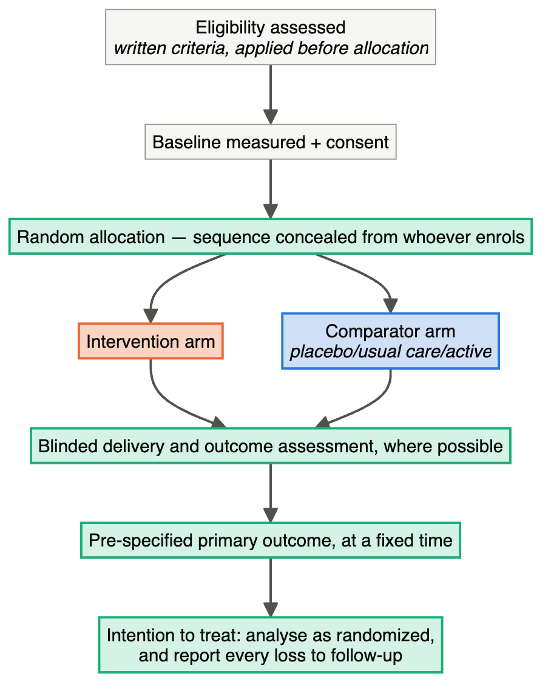
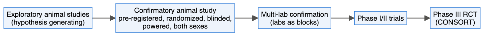

# Chapter 23 — Clinical and Preclinical (Animal) Research

> **Part IV — Field Playbooks**
> [← Chapter 22](22-computational-and-data-science.md) · [Table of Contents](../README.md) · [Next: Chapter 24 — Neuroscience →](24-neuroscience.md)

---

## 🧭 Learning Objectives

After this chapter you will be able to:

1. List the core elements of a randomized controlled trial and the documents that fix them (protocol, SAP).
2. Size a **cluster-randomized** trial using the design effect.
3. Describe adaptive designs and master protocols (umbrella, basket, platform).
4. Apply the ARRIVE "Essential 10" to an animal study, including cage, litter and sex.
5. Explain why **designed heterogeneity** can improve the reproducibility of preclinical results.
6. Distinguish an assignment comparison from missing-data assumptions and turn a protocol into an auditable analysis plan.

**Dominant question types:** comparative (Q2), associational (Q4), predictive (Q5), measurement (Q8).

---

## 🎯 The Big Picture

Clinical trials are the most codified experiments in biology, because their errors cost
lives. Preclinical animal studies sit between the bench and the clinic, and their design
quality strongly affects whether findings translate. Many failures of translation trace
back to small, unrandomized, unblinded animal studies and to publication bias
([Crossley et al., 2008](https://doi.org/10.1161/strokeaha.107.498725); [Sena et al., 2010](https://doi.org/10.1371/journal.pbio.1000344); [Begley & Ioannidis, 2015](https://doi.org/10.1161/circresaha.114.303819)).

---

## 🧠 Core Intuition — the clinical playbook

### 1. Core RCT elements

- **Unpredictable allocation sequence** and **allocation concealment** ([Schulz & Grimes, 2002](https://doi.org/10.1016/s0140-6736%2802%2907750-4)).
- **Blinding** of participants, care providers, outcome assessors and analysts where feasible.
- **Pre-specified primary outcome and analysis**, intention-to-treat principle.
- **Protocol (SPIRIT)** ([Chan et al., 2013](https://doi.org/10.1136/bmj.e7586)) and a **statistical analysis plan** fixed before
  unblinding ([Gamble et al., 2017](https://doi.org/10.1001/jama.2017.18556)); report with **CONSORT 2025** ([Hopewell et al., 2025](https://doi.org/10.1136/bmj-2024-081123); [Schulz et al., 2010](https://doi.org/10.1136/bmj.c332)).
- Covariate adjustment and subgroup analyses pre-specified; subgroup claims require
  interaction tests ([Pocock et al., 2002](https://doi.org/10.1002/sim.1296)).
- Before trial registration became routine, outcome switching was common ([Chan et al., 2004](https://doi.org/10.1001/jama.291.20.2457)).

### Before fitting: question, population, follow-up and contrast

An intention-to-treat assignment comparison preserves analysis by randomized group; it does not
recover missing outcomes or automatically specify every intercurrent-event strategy. A participant
who stops treatment can still contribute a later outcome. For a treatment-policy question, plan to
collect relevant measurements after discontinuation and rescue.

Read the protocol and SAP together. Check the endpoint/time/units, analysis population, missingness
assumptions, model and intended contrast, multiplicity/interim rules, and versioned deviations.
A model can run successfully while estimating the wrong quantity. In a treatment-by-visit model,
the main treatment coefficient alone need not estimate the final-visit contrast.

The [clinical-study biostatistics sub-course](../subcourses/clinical-trials/README.md) takes this
chapter further over eight modules: visual walkthroughs of the trial lifecycle, a SAP worksheet,
worked power calculations, missing-data exercises, repeated-measures models and an integrated
clinical audit. It also develops preclinical studies, Phases I–IV, trial layouts and the
superiority / non-inferiority / equivalence claims.

### 2. Design variants

| Design | Use | Key issue |
|---|---|---|
| **Parallel group** | standard | — |
| **Cluster-randomized** | intervention acts on wards, practices, villages | inflate *n* by design effect |
| **Crossover** | stable, reversible conditions | washout, carry-over ([Senn, 2004](https://doi.org/10.1002/sim.2074)) |
| **Adaptive** | pre-planned interim changes (sample size, arms, allocation) | error control, pre-specification ([Pallmann et al., 2018](https://doi.org/10.1186/s12916-018-1017-7); [Thorlund et al., 2018](https://doi.org/10.1136/bmj.k698)) |
| **Master protocols** | umbrella (one disease, many drugs), basket (one drug, many diseases), platform (arms added/dropped) | shared controls and infrastructure ([Woodcock & LaVange, 2017](https://doi.org/10.1056/nejmra1510062)) |
| **Pilot/feasibility** | before a main trial | sized for feasibility and variance, not effect ([Julious, 2005](https://doi.org/10.1002/pst.185); [Whitehead et al., 2016](https://doi.org/10.1177/0962280215588241)) |

Other designs: observational studies (STROBE) ([von Elm et al., 2007](https://doi.org/10.1016/s0140-6736%2807%2961602-x)), diagnostic accuracy (STARD)
([Bossuyt et al., 2015](https://doi.org/10.1136/bmj.h5527)), AI interventions (CONSORT-AI) ([Liu et al., 2020](https://doi.org/10.1038/s41591-020-1034-x)).

## 🧠 Core Intuition — the preclinical playbook

### 3. ARRIVE Essential 10

Study design, sample size, inclusion/exclusion criteria, randomization, blinding,
outcome measures, statistical methods, experimental animals, experimental procedures,
results ([Percie du Sert et al., 2020](https://doi.org/10.1371/journal.pbio.3000410); [Kilkenny et al., 2010](https://doi.org/10.1371/journal.pbio.1000412)). Use them as a **design checklist**, not just a
reporting form. Core-set recommendations ([Landis et al., 2012](https://doi.org/10.1038/nature11556)) and design guidance
([Festing & Altman, 2002](https://doi.org/10.1093/ilar.43.4.244); [Lazic, 2016](https://doi.org/10.1017/9781139696647)) cover the same ground.

### 4. Units and nuisance factors specific to animals

- **Cage** is the assignment unit when treatment is delivered to the whole cage
  through food/water. For individual assignment, cage is a clustering factor;
  interaction or microbial spillover can also change the treatment effect being estimated.
- **Litter** is the unit for maternal/prenatal exposures ([Holson & Pearce, 1992](https://doi.org/10.1016/0892-0362%2892%2990020-b); [Lazic et al., 2018](https://doi.org/10.1371/journal.pbio.2005282)).
- **Sex as a biological variable** — include both sexes unless justified ([Clayton & Collins, 2014](https://doi.org/10.1038/509282a); [Beery & Zucker, 2011](https://doi.org/10.1016/j.neubiorev.2010.07.002)).
- Behavioural tests: order, time of day, experimenter, strain ([Crawley, 1999](https://doi.org/10.1016/s0006-8993%2898%2901258-x)).

### 5. Standardization versus heterogenization

Highly standardized conditions make results specific to one narrow situation — the
"standardization fallacy" ([Richter et al., 2009](https://doi.org/10.1038/nmeth.1312)). **Multi-laboratory or multi-batch designs**, where
labs/batches act as blocks, improve the reproducibility of results ([Voelkl et al., 2018](https://doi.org/10.1371/journal.pbio.2003693)). Field
guidelines exist, e.g. for cardioprotection ([Bøtker et al., 2018](https://doi.org/10.1007/s00395-018-0696-8)) and neuroscience ([Steward & Balice-Gordon, 2014](https://doi.org/10.1016/j.neuron.2014.10.042)).

---

## 👁️ Visual Intuition — from animal to patient

---

## 🔬 Worked Example — sizing a cluster-randomized trial

A clinic-level intervention aims to raise the proportion of patients reaching a blood
pressure target from **15% to 30%**.

1. **Individually randomized trial:** `power.prop.test(p1 = 0.30, p2 = 0.15, power = 0.8)`
   → **121 patients per arm**.
2. **Clusters:** about 20 patients per clinic, ICC = 0.05 → design effect = 1 + (20 − 1) × 0.05
   = **1.95**.
3. **Cluster trial:** 121 × 1.95 ≈ **236 patients per arm** → **12 clinics per arm**
   (24 clinics).
4. **Approximation:** the design-effect calculation is a starting point. Verify power
   for the planned analysis, clinic-size variation and plausible ICCs; round for attrition
   at both clinic and patient levels. More patients within a few clinics cannot replace
   more randomized clinics.
5. **Design choices:** stratify clinic randomization by size or region; analyse with
   clinic as a random effect (or cluster-level summaries); report with the CONSORT
   extension for cluster trials.

The cluster design needs nearly **twice** the patients — the clinical counterpart of
pseudoreplication (Chapter 3). (Code: `scripts/course/worked_examples.R`.)

---

## ⚠️ Common Misconceptions

| ❌ The misconception | ✅ What is actually true — and what to do |
|---|---|
| **"ITT solves missing outcomes."** | It preserves the assignment comparison; estimation still needs an appropriate observation/missingness strategy. |
| **"A mixed model makes missingness harmless."** | Likelihood inference depends on the model and observation assumptions; assess plausible departures. |
| **"Noncompliance has one universal sample-size inflation factor."** | A dilution formula requires assumptions about switching, effect, variance and the targeted comparison. |
| **"Randomization makes allocation concealment unnecessary."** | A predictable sequence can be subverted. Concealment protects randomization. |
| **"Subgroup with *p* < 0.05 = differential effect."** | Requires an interaction test and pre-specification. |
| **"Animal studies are exploratory, so rigour can wait."** | Confirmatory claims need confirmatory designs. |
| **"Using only males keeps things simple."** | It leaves half the population unstudied and limits generalizability; sex should be designed in as a variable ([Clayton & Collins, 2014](https://doi.org/10.1038/509282a); [Beery & Zucker, 2011](https://doi.org/10.1016/j.neubiorev.2010.07.002)). |
| **"Maximal standardization = maximal reproducibility."** | It can do the opposite ([Richter et al., 2009](https://doi.org/10.1038/nmeth.1312); [Voelkl et al., 2018](https://doi.org/10.1371/journal.pbio.2003693)). |

---

## 🧪 Spot the Flaw

> "Pregnant dams (n = 4 per group) received drug or vehicle. Offspring behaviour was tested
> at 8 weeks (n = 32 pups per group, males only). Testing was performed by the
> investigator who treated the dams. Drug-exposed pups showed reduced anxiety (*p* = 0.002)."

▶ Diagnosis

- The **dam (litter)** received the treatment → *n* = 4 per group, not 32 ([Holson & Pearce, 1992](https://doi.org/10.1016/0892-0362%2892%2990020-b)).
- **Males only** → limited generalization.
- **Unblinded tester** for a behavioural outcome.
- **Fix:** more litters (e.g. 10+ per group), litter as unit or random effect, both sexes,
  blinded testing in randomized order, pre-registered primary outcome.

---

## 🔎 The Reviewer's Perspective

- **Trials:** "Sequence generation? Concealment? Blinding? Registered primary outcome? SAP?"
- **Cluster trials:** "Design effect and ICC assumptions?"
- **Animals:** "ARRIVE Essential 10? Cage/litter? Both sexes? Blinded outcome assessment?"
- **Translation:** "Is the animal study confirmatory or exploratory — and labelled as such?"

---

## 🛠️ Design Challenges

Three translational designs: a confirmatory animal study, a pragmatic clinical trial and a
multi-centre preclinical study. For each, write down the primary outcome, the unit, the
randomization and who is blinded — then open the model answer and its diagram.

### Challenge 1 · Preclinical neurology · ⭐⭐ — a confirmatory stroke study

Plan a confirmatory mouse study of a neuroprotective drug after experimental stroke.

▶ A model design

- **Primary outcome:** infarct volume at 48 h (blinded image analysis); secondary:
  neurological score (blinded).
- **Sample size:** smallest effect of interest (e.g. 20% reduction), SD from prior data,
  α = 0.05, 80–90% power; inflate for expected mortality/exclusions with pre-specified
  exclusion criteria.
- **Randomization:** computer-generated, concealed (third party prepares coded syringes),
  stratified by sex; surgery order randomized.
- **Blocks:** surgery day/surgeon as blocks; both sexes; mice single-randomized but
  cage-balanced.
- **Pre-registration** of hypothesis, outcome and analysis; report with ARRIVE.
- **Next step:** a multi-centre confirmation (labs as blocks) before clinical translation.

### Challenge 2 · Rehabilitation medicine · ⭐⭐ — an app after knee surgery

A hospital network wants to know whether a home-exercise **app** improves function 3 months
after knee replacement, compared with the usual printed exercise sheet. Patients cannot be
blinded to which they use. There are 4 hospitals. Design the trial.

▶ A model design

- **Pragmatic RCT**, patient-level randomization (patients at the same hospital can use
  different tools without much contamination), **stratified by hospital** with permuted blocks
  of varying size, concealed via a central web system.
- **Primary outcome:** a validated patient-reported function score at 3 months, plus an
  **objective** secondary outcome (e.g. timed walking test) measured by **assessors blinded**
  to the allocation — important because patients and therapists cannot be blinded.
- **Comparator:** the printed sheet with the same exercises and the same number of contacts,
  so the comparison isolates the app's delivery and reminders.
- **Analysis:** intention-to-treat, `score_3m ~ hospital + baseline_score + group`; report
  adherence and app use separately.
- **Report** with CONSORT; pre-register.

### Challenge 3 · Preclinical pharmacology · ⭐⭐⭐ — does the effect survive other labs?

A drug reduced anxiety-like behaviour in one lab's mice. Before a costly next step, three labs
will repeat the experiment. Each lab can test 24 mice. Labs differ in housing, handling and
strain sources. Design the multi-centre study so it tells you whether the effect is
**robust**.

▶ A model design

- **Labs are blocks** (Chapter 23: heterogenization): each lab tests **12 drug + 12 vehicle**,
  randomized within lab, with the **same core protocol** (dose, timing, primary outcome,
  exclusion rules) — but deliberately **not** forced to identical housing, which is the
  variation the result must survive.
- **Both sexes** in every lab (6 + 6 per group), and, if useful, two strains across labs.
- **Central randomization lists**, coded drug supplied centrally; outcome scoring blinded;
  data analysed centrally.
- **Analysis:** a mixed model `outcome ~ treatment + sex + (1 + treatment | lab)` — the
  **treatment × lab** variance shows how much the effect varies between labs, and the
  confidence interval for the treatment effect includes that variation.
- **Pre-register** the hypothesis and analysis; report with ARRIVE.

---

## ✅ Check Your Understanding

**⭐ Q1.** List five core elements of an RCT.

**⭐ Q2.** What are umbrella, basket and platform trials?

**⭐⭐ Q3.** Clinics of 30 patients, ICC = 0.02. An individually randomized design needs
200 per arm. How many per arm in the cluster design?

**⭐⭐ Q4.** Why is the litter the unit for prenatal exposures?

**⭐⭐⭐ Q5.** Argue for or against running a confirmatory preclinical study in three
laboratories rather than one, with the same total number of animals.

---

## 📝 Sample Answers & Assessment

▶ Show sample answers

> **Q1 — Sample answer:** *"Randomization, concealment, blinding, pre-specified outcome,
ITT."* — **✔ 10/10.**

> **Q2 — Sample answer:** *"Umbrella: one disease, several drugs; basket: one drug,
several diseases; platform: arms added and dropped over time."* — **✔ 10/10.**

> **Q3 — Sample answer:** *"DE = 1 + 29 × 0.02 = 1.58 → 316 per arm."* — **✔ 10/10.**
(≈ 11 clinics per arm.)

> **Q4 — Sample answer:** *"Because the mother was treated."* — **✔ 9/10.** And pups share
genetics and maternal environment, so they are correlated sub-units.

> **Q5 — Sample answer:** *"For: results generalize better. Against: more variability."* —
**◑ 7/10.** Refine: with labs as **blocks**, between-lab variation is removed from the
treatment comparison, so precision need not suffer much, while the estimate now applies
across labs — evidence suggests this improves reproducibility ([Voelkl et al., 2018](https://doi.org/10.1371/journal.pbio.2003693)). Costs:
coordination and protocol harmonization.

**Rubric:** clinical/preclinical answers need the unit, concealment/blinding and
pre-specification.

---

## 🧾 Chapter Summary

| Concept | One-line takeaway |
|---|---|
| **RCT core** | Sequence, concealment, blinding, pre-specified outcome and SAP. |
| **Clusters** | Inflate by 1 + (m − 1)ρ. |
| **Modern designs** | Adaptive, umbrella, basket, platform — all pre-specified. |
| **ARRIVE 10** | Design checklist for animal studies. |
| **Animal units** | Cage, litter; both sexes. |
| **Heterogenization** | Multi-lab designs improve generalizability. |

**Traps to remember:** pups as *n* · unconcealed allocation · unregistered outcomes ·
males only · single-lab "confirmation".

### 📇 Design Card — field checklist

| Item | Done? |
|---|---|
| Protocol/SAP (SPIRIT) or ARRIVE plan | |
| Sequence generation and concealment | |
| Blinding at each stage | |
| Unit (patient/cluster/cage/litter) and design effect | |
| Registration/pre-registration | |

---

## 🔗 Go Deeper

- 📘 Biostat course: [Ch. 37 — Evidence Hierarchies](https://github.com/MdRasheduz-zaman/biostatistics/blob/main/chapters/37-evidence-hierarchies.md) · [Ch. 39 — Survival Analysis](https://github.com/MdRasheduz-zaman/biostatistics/blob/main/chapters/39-survival-analysis.md)
- More: ([Macleod et al., 2015](https://doi.org/10.1371/journal.pbio.1002273); [Kilkenny et al., 2009](https://doi.org/10.1371/journal.pone.0007824); [Page et al., 2021](https://doi.org/10.1136/bmj.n71))

## 📚 References cited in this chapter

- Beery AK, Zucker I (2011). Sex bias in neuroscience and biomedical research. *Neuroscience &amp; Biobehavioral Reviews* 35:565-572. [doi:10.1016/j.neubiorev.2010.07.002](https://doi.org/10.1016/j.neubiorev.2010.07.002)
- Begley CG, Ioannidis JPA (2015). Reproducibility in Science. *Circulation Research* 116:116-126. [doi:10.1161/circresaha.114.303819](https://doi.org/10.1161/circresaha.114.303819)
- Bossuyt PM, Reitsma JB, Bruns DE, Gatsonis CA, Glasziou PP, Irwig L, et al. (2015). STARD 2015: an updated list of essential items for reporting diagnostic accuracy studies. *BMJ*:h5527. [doi:10.1136/bmj.h5527](https://doi.org/10.1136/bmj.h5527)
- Bøtker HE, Hausenloy D, Andreadou I, Antonucci S, Boengler K, Davidson SM, et al. (2018). Practical guidelines for rigor and reproducibility in preclinical and clinical studies on cardioprotection. *Basic Research in Cardiology* 113:39. [doi:10.1007/s00395-018-0696-8](https://doi.org/10.1007/s00395-018-0696-8)
- Chan AW, Hróbjartsson A, Haahr MT, Gøtzsche PC, Altman DG (2004). Empirical Evidence for Selective Reporting of Outcomes in Randomized Trials. *JAMA* 291:2457. [doi:10.1001/jama.291.20.2457](https://doi.org/10.1001/jama.291.20.2457)
- Chan AW, Tetzlaff JM, Gotzsche PC, Altman DG, Mann H, Berlin JA, et al. (2013). SPIRIT 2013 explanation and elaboration: guidance for protocols of clinical trials. *BMJ* 346:e7586-e7586. [doi:10.1136/bmj.e7586](https://doi.org/10.1136/bmj.e7586)
- Clayton JA, Collins FS (2014). Policy: NIH to balance sex in cell and animal studies. *Nature* 509:282-283. [doi:10.1038/509282a](https://doi.org/10.1038/509282a)
- Crawley JN (1999). Behavioral phenotyping of transgenic and knockout mice: experimental design and evaluation of general health, sensory functions, motor abilities, and specific behavioral tests1Published on the World Wide Web on 2 December 1998.1. *Brain Research* 835:18-26. [doi:10.1016/s0006-8993(98)01258-x](https://doi.org/10.1016/s0006-8993%2898%2901258-x)
- Crossley NA, Sena E, Goehler J, Horn J, van der Worp B, Bath PMW, et al. (2008). Empirical Evidence of Bias in the Design of Experimental Stroke Studies. *Stroke* 39:929-934. [doi:10.1161/strokeaha.107.498725](https://doi.org/10.1161/strokeaha.107.498725)
- Festing MFW, Altman DG (2002). Guidelines for the Design and Statistical Analysis of Experiments Using Laboratory Animals. *ILAR Journal* 43:244-258. [doi:10.1093/ilar.43.4.244](https://doi.org/10.1093/ilar.43.4.244)
- Gamble C, Krishan A, Stocken D, Lewis S, Juszczak E, Doré C, et al. (2017). Guidelines for the Content of Statistical Analysis Plans in Clinical Trials. *JAMA* 318:2337. [doi:10.1001/jama.2017.18556](https://doi.org/10.1001/jama.2017.18556)
- Holson RR, Pearce B (1992). Principles and pitfalls in the analysis of prenatal treatment effects in multiparous species. *Neurotoxicology and Teratology* 14:221-228. [doi:10.1016/0892-0362(92)90020-b](https://doi.org/10.1016/0892-0362%2892%2990020-b)
- Hopewell S, Chan AW, Collins GS, Hróbjartsson A, Moher D, Schulz KF, et al. (2025). CONSORT 2025 statement: updated guideline for reporting randomised trials. *BMJ* 389:e081123. [doi:10.1136/bmj-2024-081123](https://doi.org/10.1136/bmj-2024-081123)
- Julious SA (2005). Sample size of 12 per group rule of thumb for a pilot study. *Pharmaceutical Statistics* 4:287-291. [doi:10.1002/pst.185](https://doi.org/10.1002/pst.185)
- Kilkenny C, Parsons N, Kadyszewski E, Festing MFW, Cuthill IC, Fry D, et al. (2009). Survey of the Quality of Experimental Design, Statistical Analysis and Reporting of Research Using Animals. *PLoS ONE* 4:e7824. [doi:10.1371/journal.pone.0007824](https://doi.org/10.1371/journal.pone.0007824)
- Kilkenny C, Browne WJ, Cuthill IC, Emerson M, Altman DG (2010). Improving Bioscience Research Reporting: The ARRIVE Guidelines for Reporting Animal Research. *PLoS Biology* 8:e1000412. [doi:10.1371/journal.pbio.1000412](https://doi.org/10.1371/journal.pbio.1000412)
- Landis SC, Amara SG, Asadullah K, Austin CP, Blumenstein R, Bradley EW, et al. (2012). A call for transparent reporting to optimize the predictive value of preclinical research. *Nature* 490:187-191. [doi:10.1038/nature11556](https://doi.org/10.1038/nature11556)
- Lazic SE, Clarke-Williams CJ, Munafò MR (2018). What exactly is ‘N’ in cell culture and animal experiments?. *PLOS Biology* 16:e2005282. [doi:10.1371/journal.pbio.2005282](https://doi.org/10.1371/journal.pbio.2005282)
- Lazic SE (2016). Experimental Design for Laboratory Biologists. *Cambridge University Press*. [doi:10.1017/9781139696647](https://doi.org/10.1017/9781139696647)
- Liu X, Cruz Rivera S, Moher D, Calvert MJ, Denniston AK, Chan AW, et al. (2020). Reporting guidelines for clinical trial reports for interventions involving artificial intelligence: the CONSORT-AI extension. *Nature Medicine* 26:1364-1374. [doi:10.1038/s41591-020-1034-x](https://doi.org/10.1038/s41591-020-1034-x)
- Macleod MR, Lawson McLean A, Kyriakopoulou A, Serghiou S, de Wilde A, Sherratt N, et al. (2015). Risk of Bias in Reports of In Vivo Research: A Focus for Improvement. *PLOS Biology* 13:e1002273. [doi:10.1371/journal.pbio.1002273](https://doi.org/10.1371/journal.pbio.1002273)
- Page MJ, McKenzie JE, Bossuyt PM, Boutron I, Hoffmann TC, Mulrow CD, et al. (2021). The PRISMA 2020 statement: an updated guideline for reporting systematic reviews. *BMJ*:n71. [doi:10.1136/bmj.n71](https://doi.org/10.1136/bmj.n71)
- Pallmann P, Bedding AW, Choodari-Oskooei B, Dimairo M, Flight L, Hampson LV, et al. (2018). Adaptive designs in clinical trials: why use them, and how to run and report them. *BMC Medicine* 16:29. [doi:10.1186/s12916-018-1017-7](https://doi.org/10.1186/s12916-018-1017-7)
- Percie du Sert N, Hurst V, Ahluwalia A, Alam S, Avey MT, Baker M, et al. (2020). The ARRIVE guidelines 2.0: Updated guidelines for reporting animal research. *PLOS Biology* 18:e3000410. [doi:10.1371/journal.pbio.3000410](https://doi.org/10.1371/journal.pbio.3000410)
- Pocock SJ, Assmann SE, Enos LE, Kasten LE (2002). Subgroup analysis, covariate adjustment and baseline comparisons in clinical trial reporting: current practiceand problems. *Statistics in Medicine* 21:2917-2930. [doi:10.1002/sim.1296](https://doi.org/10.1002/sim.1296)
- Richter SH, Garner JP, Würbel H (2009). Environmental standardization: cure or cause of poor reproducibility in animal experiments?. *Nature Methods* 6:257-261. [doi:10.1038/nmeth.1312](https://doi.org/10.1038/nmeth.1312)
- Schulz KF, Grimes DA (2002). Allocation concealment in randomised trials: defending against deciphering. *The Lancet* 359:614-618. [doi:10.1016/s0140-6736(02)07750-4](https://doi.org/10.1016/s0140-6736%2802%2907750-4)
- Schulz KF, Altman DG, Moher D (2010). CONSORT 2010 Statement: updated guidelines for reporting parallel group randomised trials. *BMJ* 340:c332-c332. [doi:10.1136/bmj.c332](https://doi.org/10.1136/bmj.c332)
- Sena ES, van der Worp HB, Bath PMW, Howells DW, Macleod MR (2010). Publication Bias in Reports of Animal Stroke Studies Leads to Major Overstatement of Efficacy. *PLoS Biology* 8:e1000344. [doi:10.1371/journal.pbio.1000344](https://doi.org/10.1371/journal.pbio.1000344)
- Senn S (2004). Controversies concerning randomization and additivity in clinical trials. *Statistics in Medicine* 23:3729-3753. [doi:10.1002/sim.2074](https://doi.org/10.1002/sim.2074)
- Steward O, Balice-Gordon R (2014). Rigor or Mortis: Best Practices for Preclinical Research in Neuroscience. *Neuron* 84:572-581. [doi:10.1016/j.neuron.2014.10.042](https://doi.org/10.1016/j.neuron.2014.10.042)
- Thorlund K, Haggstrom J, Park JJ, Mills EJ (2018). Key design considerations for adaptive clinical trials: a primer for clinicians. *BMJ*:k698. [doi:10.1136/bmj.k698](https://doi.org/10.1136/bmj.k698)
- Voelkl B, Vogt L, Sena ES, Würbel H (2018). Reproducibility of preclinical animal research improves with heterogeneity of study samples. *PLOS Biology* 16:e2003693. [doi:10.1371/journal.pbio.2003693](https://doi.org/10.1371/journal.pbio.2003693)
- von Elm E, Altman DG, Egger M, Pocock SJ, Gøtzsche PC, Vandenbroucke JP (2007). The Strengthening the Reporting of Observational Studies in Epidemiology (STROBE) statement: guidelines for reporting observational studies. *The Lancet* 370:1453-1457. [doi:10.1016/s0140-6736(07)61602-x](https://doi.org/10.1016/s0140-6736%2807%2961602-x)
- Whitehead AL, Julious SA, Cooper CL, Campbell MJ (2016). Estimating the sample size for a pilot randomised trial to minimise the overall trial sample size for the external pilot and main trial for a continuous outcome variable. *Statistical Methods in Medical Research* 25:1057-1073. [doi:10.1177/0962280215588241](https://doi.org/10.1177/0962280215588241)
- Woodcock J, LaVange LM (2017). Master Protocols to Study Multiple Therapies, Multiple Diseases, or Both. *New England Journal of Medicine* 377:62-70. [doi:10.1056/nejmra1510062](https://doi.org/10.1056/nejmra1510062)

---

[← Chapter 22](22-computational-and-data-science.md) · [Table of Contents](../README.md) · [Next: Chapter 24 — Neuroscience →](24-neuroscience.md)
