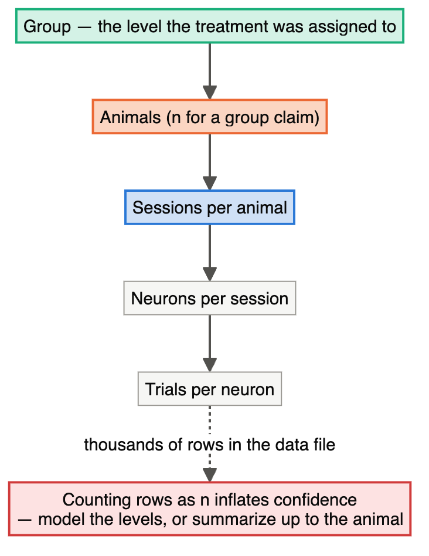
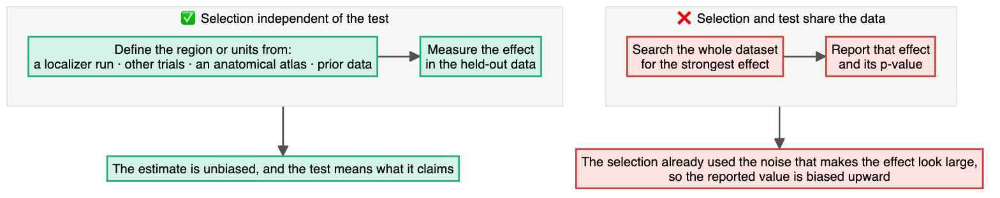
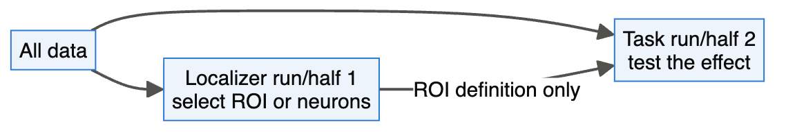

# Chapter 24 — Neuroscience

> **Part IV — Field Playbooks**
> [← Chapter 23](23-clinical-and-preclinical.md) · [Table of Contents](../README.md) · [Next: Chapter 25 — Pre-registration and Reporting →](25-preregistration-and-reporting.md)

---

## 🧭 Learning Objectives

After this chapter you will be able to:

1. Identify the nested structure of neuroscience data (trials, neurons, slices, animals, participants) and design around it.
2. Avoid **circular analysis** by separating selection data from test data.
3. Plan sample sizes for brain–behaviour correlations and explain the **winner's curse**.
4. Describe design efficiency in task fMRI and valid inference thresholds.
5. Design multi-site imaging studies with site as a block.

**Dominant question types:** comparative (Q2), mechanistic (Q3), associational (Q4), predictive (Q5).

---

## 🎯 The Big Picture

Neuroscience has produced some of the clearest diagnoses of design failure. The median
statistical power of neuroscience studies was estimated at about **21%** ([Button et al., 2013](https://doi.org/10.1038/nrn3475)).
Nested data invite pseudoreplication ([Lazic, 2010](https://doi.org/10.1186/1471-2202-11-5); [Aarts et al., 2014](https://doi.org/10.1038/nn.3648)); flexible voxel or neuron
selection invites circularity ([Kriegeskorte et al., 2009](https://doi.org/10.1038/nn.2303)); brain–behaviour correlations are small
and need very large samples ([Marek et al., 2022](https://doi.org/10.1038/s41586-022-04492-9)). Each has a design solution.

---

## 🧠 Core Intuition — the neuroscience playbook

### 1. Nested data

Trials within neurons, neurons within slices, slices within animals; scans within sessions
within participants. The **animal or participant** is usually the unit for group
comparisons. Model the hierarchy or aggregate (Chapter 3) ([Aarts et al., 2014](https://doi.org/10.1038/nn.3648)).

### 2. Circular analysis ("double dipping")

Selecting voxels, neurons or time windows because they show an effect, then testing that
effect in the same data, inflates it ([Kriegeskorte et al., 2009](https://doi.org/10.1038/nn.2303)). **Design fix:** independent
localizer runs, split-half designs, or pre-specified regions of interest.

### 3. Interactions

"Effect in condition A but not B" requires an interaction test ([Nieuwenhuis et al., 2011](https://doi.org/10.1038/nn.2886)) (Chapter 7).

### 4. Task fMRI design efficiency

Event timing and order determine how efficiently responses can be estimated. Jittered,
randomized designs can be optimized in advance ([Dale, 1999](https://doi.org/10.1002/%28sici%291097-0193%281999%298:2/3%3C109::aid-hbm7%3E3.0.co;2-w)). Sample sizes should be planned
with realistic variance components ([Desmond & Glover, 2002](https://doi.org/10.1016/s0165-0270%2802%2900121-8)).

### 5. Inference thresholds

Commonly used parametric cluster-wise inference produced familywise false-positive rates
far above nominal, up to 70% ([Eklund et al., 2016](https://doi.org/10.1073/pnas.1602413113); [Woo et al., 2014](https://doi.org/10.1016/j.neuroimage.2013.12.058)). Choose and pre-specify validated
thresholds.

### 6. Brain–behaviour associations need large *n*

Inter-individual brain–behaviour correlations are typically small. Reproducible
brain-wide association studies need **thousands** of participants ([Marek et al., 2022](https://doi.org/10.1038/s41586-022-04492-9)). Small
studies produce inflated correlations ([Yarkoni, 2009](https://doi.org/10.1111/j.1745-6924.2009.01127.x)). Sample sizes have grown, but often
not enough ([Szucs & Ioannidis, 2020](https://doi.org/10.1016/j.neuroimage.2020.117164); [Poldrack et al., 2017](https://doi.org/10.1038/nrn.2016.167)).

### 7. Multi-site studies

Scanner and site effects are batches: balance groups across sites, include site as a block,
harmonize acquisition, and validate across sites ([Hu et al., 2023](https://doi.org/10.1016/j.neuroimage.2023.120125)). Community best practices:
COBIDAS for MRI ([Nichols et al., 2017](https://doi.org/10.1038/nn.4500)), fMRI reporting ([Poldrack et al., 2008](https://doi.org/10.1016/j.neuroimage.2007.11.048)), MEG ([Gross et al., 2013](https://doi.org/10.1016/j.neuroimage.2012.10.001)), and
preclinical rigour ([Steward & Balice-Gordon, 2014](https://doi.org/10.1016/j.neuron.2014.10.042)).

---

## 👁️ Visual Intuition — avoiding double dipping

---

## 🔬 Worked Example — sample size and the winner's curse for correlations

**Required *n*.** For 80% power (α = 0.05, two-sided):

| True correlation r | *n* needed |
|---|---|
| 0.3 | 85 |
| 0.1 | 783 |

**What small studies report.** We simulated 20,000 studies of a true r = 0.1:

| *n* per study | Power | Mean r among significant positive results |
|---|---|---|
| 20 | 7% | **0.52** |
| 100 | 17% | **0.25** |
| 800 | 81% | **0.11** |

With *n* = 20, the rare "significant" studies report correlations about **five times** the
true value — the winner's curse (type M error, Chapter 8) ([Gelman & Carlin, 2014](https://doi.org/10.1177/1745691614551642); [Yarkoni, 2009](https://doi.org/10.1111/j.1745-6924.2009.01127.x)). A
literature built from such studies will look full of strong, irreproducible effects.
(Code: `scripts/course/worked_examples.R`.)

---

## ⚠️ Common Misconceptions

| ❌ The misconception | ✅ What is actually true — and what to do |
|---|---|
| **"Hundreds of neurons = large *n*."** | Animals are the unit for group claims. |
| **"I selected the ROI from my data, but the test is still valid."** | Validity depends on independence of selection and the tested statistic under the null. An independent ROI/localizer or held-out data is the simplest safeguard ([Kriegeskorte et al., 2009](https://doi.org/10.1038/nn.2303)). |
| **"r = 0.6 with *n* = 20 is a strong finding."** | It is a noisy estimate, likely inflated. |
| **"Default software thresholds are safe."** | Some common ones were shown to inflate false positives. Pre-specify validated inference. |
| **"Site effects average out."** | Only if groups are balanced across sites. |

---

## 🧪 Spot the Flaw

> "We recorded 412 neurons from 3 control and 3 knockout mice. Neurons responding to the
> stimulus (selected by a *t*-test on responses) were analysed further; knockout responsive
> neurons had 40% larger responses (*p* < 0.0001, *n* = 412)."

▶ Diagnosis

- **Pseudoreplication:** 3 vs 3 mice; neurons are sub-units.
- **Circularity:** neurons selected for responding, then their response size compared —
  selection inflates response estimates, possibly differently by genotype.
- **Fix:** more mice; selection on independent trials (e.g. odd trials select, even trials
  measure); mixed model with mouse as random effect; report per-mouse values.

---

## 🔎 The Reviewer's Perspective

- **"What is *n* for each claim — animals, participants, neurons?"**
- **"Were selection and testing done on independent data?"**
- **"Was the inference threshold validated and pre-specified?"**
- **"For correlations: is *n* adequate for plausible effect sizes?"**
- **"Were sites/scanners balanced and modelled?"**

---

## 🛠️ Design Challenges

Three neuroscience designs: a multi-site imaging trial, a cellular-imaging study and a task
fMRI experiment. For each, identify the nesting (sites, animals, neurons, trials) and any
risk of double dipping — then open the model answer and its diagram.

### Challenge 1 · Human neuroimaging · ⭐⭐ — training and hippocampal volume

You want to test whether a training programme changes hippocampal volume in older adults,
using MRI at two sites.

▶ A model design

- **RCT:** participants randomized to training or active control, **stratified by site**
  (site as block); allocation concealed; MRI analysts blinded.
- **Measurement:** same scanner protocol at both sites; phantom/traveling-subject scans to
  quantify site differences; automated segmentation with QC by blinded raters.
- **Design:** pre/post scans; primary outcome = change in volume; analysis
  `change ~ site + baseline + group`.
- **Sample size:** from a smallest meaningful change and realistic test–retest variability;
  inflate for dropout.
- **Pre-registration** of the ROI (hippocampus), pipeline and analysis.

### Challenge 2 · Systems neuroscience · ⭐⭐⭐ — "stimulus-responsive" neurons

Using two-photon calcium imaging, you record ~200 neurons per mouse in visual cortex of
6 knockout and 6 wild-type mice, presenting a stimulus on 40 trials. The draft analysis:
(1) select neurons that respond significantly to the stimulus; (2) compare the response
amplitude of **those** neurons between genotypes, treating each neuron as a data point.

▶ A model design

- **Two problems.** (1) **Double dipping:** neurons selected *because* they responded strongly
  on these trials will, on the same trials, show inflated responses (regression to the mean),
  and the inflation can differ between genotypes if their noise levels differ. (2)
  **Pseudoreplication:** neurons are nested in mice; genotype is assigned to mice, so *n* = 6
  vs 6.
- **Fix selection:** split trials — select responsive neurons on **odd trials**, measure
  amplitude on **even trials** (or use an independent localizer stimulus/session).
  Pre-specify the selection criterion.
- **Fix the unit:** summarize per mouse (or use a mixed model with mouse as random effect);
  report the number of neurons per mouse and the fraction responsive per mouse.
- **Blind** the analysis to genotype; image both genotypes interleaved across days.

### Challenge 3 · Cognitive neuroscience · ⭐⭐ — a task fMRI design

You will compare brain responses to **faces**, **houses** and **scrambled images** (3
conditions) in 24 participants, each doing 3 runs of about 6 minutes. You want to estimate
the response to each condition and the contrast faces − houses. Design the task.

▶ A model design

- **Event-related design** with **jittered** inter-stimulus intervals (e.g. 2–6 s): jitter
  lets the overlapping haemodynamic responses be separated, improving design efficiency
  (Chapter 24).
- **Trial order:** pseudo-randomized so that each condition follows every other condition
  about equally often (first-order counterbalancing), with a different order in each run.
- **Run order across participants:** counterbalance which sequence comes first (e.g. a Latin
  square of the 3 run orders over participants), so fatigue and learning are not confounded
  with any one sequence.
- **Check efficiency** of candidate sequences by simulation before scanning; include an
  attention task (e.g. press for a repeated image) to keep participants alert, identical for
  all conditions.
- **Analysis:** first level per run, then per participant; group level with participant as
  the unit; pre-specify the ROI (e.g. fusiform face area from an **independent** localizer run).

---

## ✅ Check Your Understanding

**⭐ Q1.** What is circular analysis?

**⭐ Q2.** Why did cluster-wise inference attract criticism?

**⭐⭐ Q3.** Approximately how many participants are needed to detect r = 0.3 with 80%
power? And r = 0.1?

**⭐⭐ Q4.** Explain the winner's curse using the simulation table.

**⭐⭐⭐ Q5.** Redesign the "412 neurons" study (Spot the Flaw) for a confirmatory claim.

---

## 📝 Sample Answers & Assessment

▶ Show sample answers

> **Q1 — Sample answer:** *"Using the same data to select and test."* — **✔ 10/10.**

> **Q2 — Sample answer:** *"It gave too many false positives."* — **✔ 9/10.** Specifically,
some parametric implementations produced familywise error rates far above the nominal 5%
([Eklund et al., 2016](https://doi.org/10.1073/pnas.1602413113)).

> **Q3 — Sample answer:** *"85 and 783."* — **✔ 10/10.**

> **Q4 — Sample answer:** *"Small studies only become significant when they overestimate."* —
**✔ 10/10.** With n = 20 the significant ones average r ≈ 0.52 for a true 0.1.

> **Q5 — Sample answer:** *"More mice and a mixed model."* — **◑ 7/10.** Add: power
calculation at the **mouse** level; pre-specified neuron-inclusion criteria applied on
independent trials; blinded recording/analysis; both sexes; report per-mouse summaries.

**Rubric:** neuroscience answers need the unit, independence of selection and test, and
realistic effect sizes.

---

## 🧾 Chapter Summary

| Concept | One-line takeaway |
|---|---|
| **Nesting** | Animals/participants are the unit for group claims. |
| **Circularity** | Select on independent data. |
| **fMRI design** | Optimize event timing; pre-specify validated thresholds. |
| **Correlations** | Small effects need hundreds to thousands; small studies inflate. |
| **Sites** | Balance and model scanners/sites. |

**Traps to remember:** neurons as *n* · double dipping · r from n = 20 · unvalidated
thresholds · unbalanced sites.

### 📇 Design Card — field checklist

| Item | Done? |
|---|---|
| Unit per claim (animal, participant) | |
| Independent selection/test data | |
| Pre-specified ROI, threshold and pipeline | |
| *n* justified for plausible effect sizes | |
| Site/scanner balance and harmonization | |

---

## 🔗 Go Deeper

- 📘 Biostat course: [Ch. 32 — Pseudoreplication](https://github.com/MdRasheduz-zaman/biostatistics/blob/main/chapters/32-pseudoreplication.md) · [Ch. 26 — Multiple Testing](https://github.com/MdRasheduz-zaman/biostatistics/blob/main/chapters/26-multiple-testing.md) · [Ch. 9 — Errors and Power](https://github.com/MdRasheduz-zaman/biostatistics/blob/main/chapters/09-errors-and-power.md)

## 📚 References cited in this chapter

- Aarts E, Verhage M, Veenvliet JV, Dolan CV, van der Sluis S (2014). A solution to dependency: using multilevel analysis to accommodate nested data. *Nature Neuroscience* 17:491-496. [doi:10.1038/nn.3648](https://doi.org/10.1038/nn.3648)
- Button KS, Ioannidis JPA, Mokrysz C, Nosek BA, Flint J, Robinson ESJ, et al. (2013). Power failure: why small sample size undermines the reliability of neuroscience. *Nature Reviews Neuroscience* 14:365-376. [doi:10.1038/nrn3475](https://doi.org/10.1038/nrn3475)
- Dale AM (1999). Optimal experimental design for event-related fMRI. *Human Brain Mapping* 8:109-114. [doi:10.1002/(sici)1097-0193(1999)8:2/3<109::aid-hbm7>3.0.co;2-w](https://doi.org/10.1002/%28sici%291097-0193%281999%298:2/3%3C109::aid-hbm7%3E3.0.co;2-w)
- Desmond JE, Glover GH (2002). Estimating sample size in functional MRI (fMRI) neuroimaging studies: Statistical power analyses. *Journal of Neuroscience Methods* 118:115-128. [doi:10.1016/s0165-0270(02)00121-8](https://doi.org/10.1016/s0165-0270%2802%2900121-8)
- Eklund A, Nichols TE, Knutsson H (2016). Cluster failure: Why fMRI inferences for spatial extent have inflated false-positive rates. *Proceedings of the National Academy of Sciences* 113:7900-7905. [doi:10.1073/pnas.1602413113](https://doi.org/10.1073/pnas.1602413113)
- Gelman A, Carlin J (2014). Beyond Power Calculations. *Perspectives on Psychological Science* 9:641-651. [doi:10.1177/1745691614551642](https://doi.org/10.1177/1745691614551642)
- Gross J, Baillet S, Barnes GR, Henson RN, Hillebrand A, Jensen O, et al. (2013). Good practice for conducting and reporting MEG research. *NeuroImage* 65:349-363. [doi:10.1016/j.neuroimage.2012.10.001](https://doi.org/10.1016/j.neuroimage.2012.10.001)
- Hu F, Chen AA, Horng H, Bashyam V, Davatzikos C, Alexander-Bloch A, et al. (2023). Image harmonization: A review of statistical and deep learning methods for removing batch effects and evaluation metrics for effective harmonization. *NeuroImage* 274:120125. [doi:10.1016/j.neuroimage.2023.120125](https://doi.org/10.1016/j.neuroimage.2023.120125)
- Kriegeskorte N, Simmons WK, Bellgowan PSF, Baker CI (2009). Circular analysis in systems neuroscience: the dangers of double dipping. *Nature Neuroscience* 12:535-540. [doi:10.1038/nn.2303](https://doi.org/10.1038/nn.2303)
- Lazic SE (2010). The problem of pseudoreplication in neuroscientific studies: is it affecting your analysis?. *BMC Neuroscience* 11:5. [doi:10.1186/1471-2202-11-5](https://doi.org/10.1186/1471-2202-11-5)
- Marek S, Tervo-Clemmens B, Calabro FJ, Montez DF, Kay BP, Hatoum AS, et al. (2022). Reproducible brain-wide association studies require thousands of individuals. *Nature* 603:654-660. [doi:10.1038/s41586-022-04492-9](https://doi.org/10.1038/s41586-022-04492-9)
- Nichols TE, Das S, Eickhoff SB, Evans AC, Glatard T, Hanke M, et al. (2017). Best practices in data analysis and sharing in neuroimaging using MRI. *Nature Neuroscience* 20:299-303. [doi:10.1038/nn.4500](https://doi.org/10.1038/nn.4500)
- Nieuwenhuis S, Forstmann BU, Wagenmakers EJ (2011). Erroneous analyses of interactions in neuroscience: a problem of significance. *Nature Neuroscience* 14:1105-1107. [doi:10.1038/nn.2886](https://doi.org/10.1038/nn.2886)
- Poldrack RA, Fletcher PC, Henson RN, Worsley KJ, Brett M, Nichols TE (2008). Guidelines for reporting an fMRI study. *NeuroImage* 40:409-414. [doi:10.1016/j.neuroimage.2007.11.048](https://doi.org/10.1016/j.neuroimage.2007.11.048)
- Poldrack RA, Baker CI, Durnez J, Gorgolewski KJ, Matthews PM, Munafò MR, et al. (2017). Scanning the horizon: towards transparent and reproducible neuroimaging research. *Nature Reviews Neuroscience* 18:115-126. [doi:10.1038/nrn.2016.167](https://doi.org/10.1038/nrn.2016.167)
- Steward O, Balice-Gordon R (2014). Rigor or Mortis: Best Practices for Preclinical Research in Neuroscience. *Neuron* 84:572-581. [doi:10.1016/j.neuron.2014.10.042](https://doi.org/10.1016/j.neuron.2014.10.042)
- Szucs D, Ioannidis JP (2020). Sample size evolution in neuroimaging research: An evaluation of highly-cited studies (1990–2012) and of latest practices (2017–2018) in high-impact journals. *NeuroImage* 221:117164. [doi:10.1016/j.neuroimage.2020.117164](https://doi.org/10.1016/j.neuroimage.2020.117164)
- Woo CW, Krishnan A, Wager TD (2014). Cluster-extent based thresholding in fMRI analyses: Pitfalls and recommendations. *NeuroImage* 91:412-419. [doi:10.1016/j.neuroimage.2013.12.058](https://doi.org/10.1016/j.neuroimage.2013.12.058)
- Yarkoni T (2009). Big Correlations in Little Studies: Inflated fMRI Correlations Reflect Low Statistical Power—Commentary on Vul et al. (2009). *Perspectives on Psychological Science* 4:294-298. [doi:10.1111/j.1745-6924.2009.01127.x](https://doi.org/10.1111/j.1745-6924.2009.01127.x)

---

[← Chapter 23](23-clinical-and-preclinical.md) · [Table of Contents](../README.md) · [Next: Chapter 25 — Pre-registration and Reporting →](25-preregistration-and-reporting.md)
