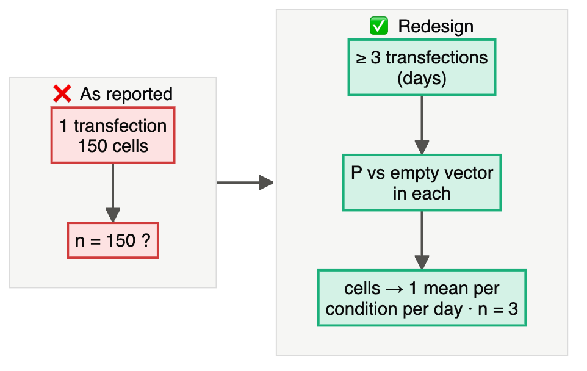
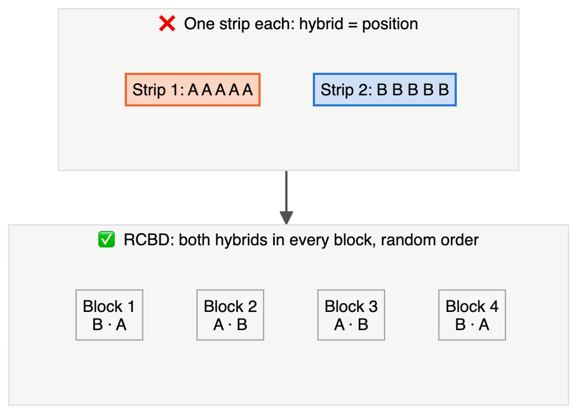
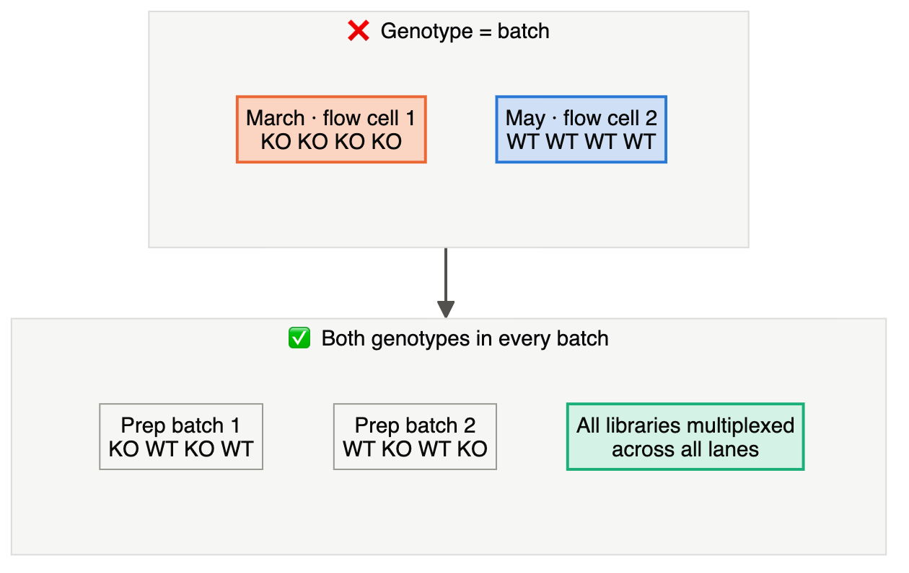
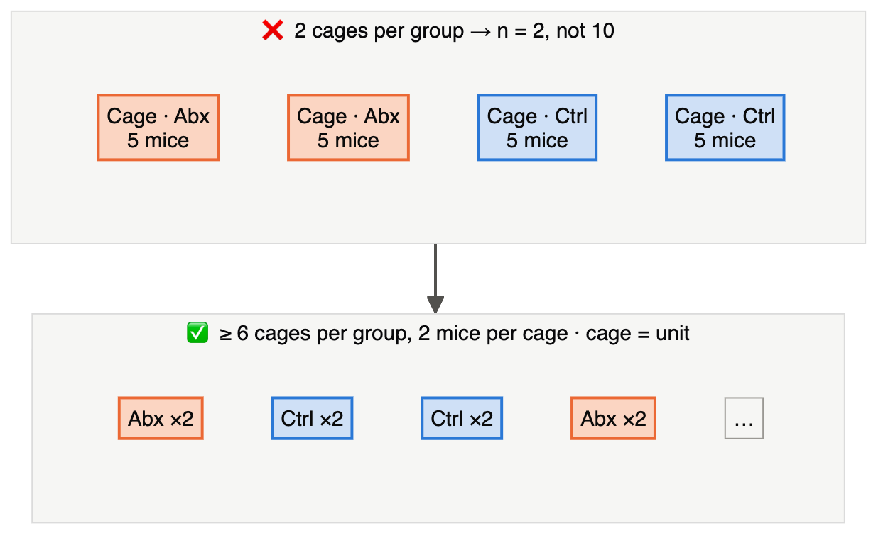
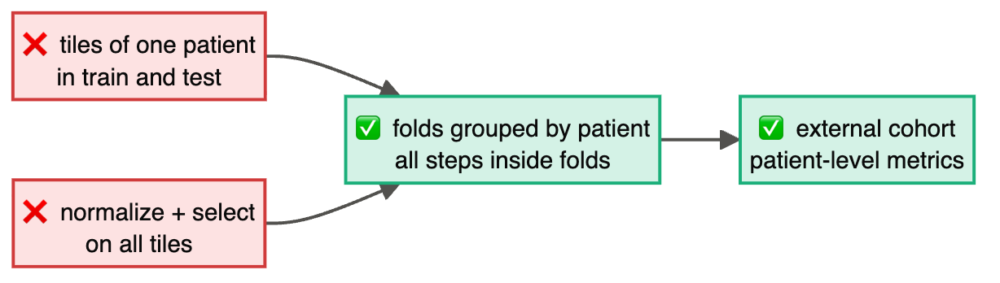
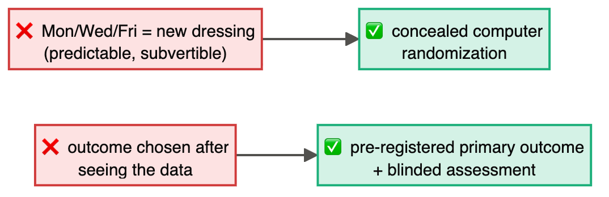
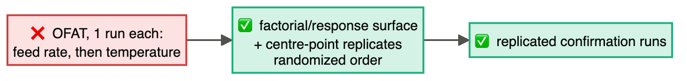
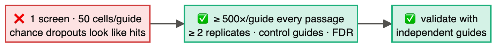
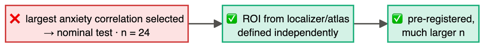
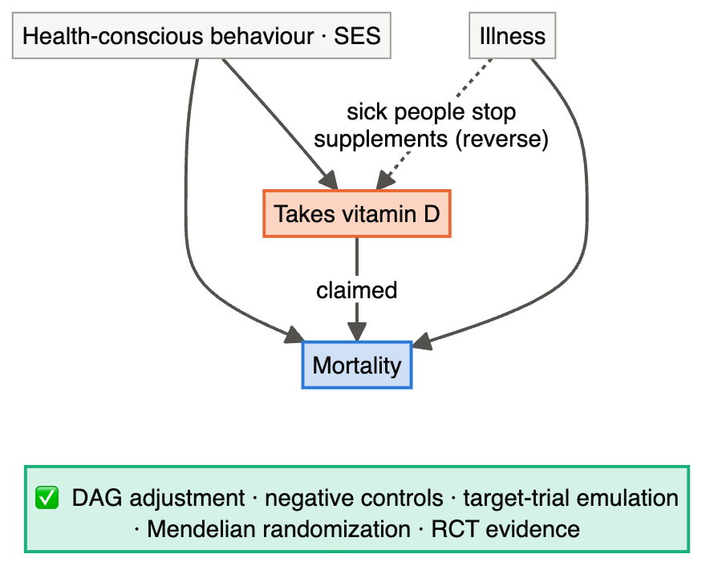

# Chapter 26 — Capstone: The Design Clinic

> **Part V — From Plan to Paper**
> [← Chapter 25](25-preregistration-and-reporting.md) · [Table of Contents](../README.md) · [Appendix A — Glossary →](A1-glossary.md)

---

## 🧭 Learning Objectives

After this chapter you will be able to:

1. Diagnose design flaws quickly across fields using the course's question-first workflow.
2. Write a complete, defensible design for your own project.
3. Review a peer's design constructively, using a structured rubric.

---

## 🎯 The Big Picture

This chapter has two parts. **Part A** is a clinic of ten short cases from different
fields — diagnose each one before opening the answer. **Part B** is your capstone: a full
design for a real or realistic project, assessed with a rubric and peer review.

### The five-question diagnostic (use it on every case)

1. **Question type?** (Q1–Q8) — and does the claim match it?
2. **Unit?** — and is *n* counted in units?
3. **Allocation?** — randomized, blocked, blinded, controlled?
4. **Size?** — justified for an effect that matters?
5. **Plan?** — analysis matches design; pre-specified; validated?

---

## Part A — Ten-case design clinic

Each case is tagged with its field and the chapters it draws on. Write your diagnosis
first, then open the answer.

### Case 1 · Cell biology · (Ch. 3, 16)

> "Overexpression of protein P increased cell size (*n* = 150 cells from one transfection,
> *p* < 10⁻⁸)."

▶ Diagnosis

Only one transfected preparation; 150 cells do not replicate transfections. Repeat
the P versus empty-vector comparison in independently prepared runs, blind measurement,
and analyse paired run-level contrasts or the hierarchy; show a SuperPlot. The diagram
illustrates three runs, but the required number needs an effect/precision justification.

### Case 2 · Field trial · (Ch. 5, 19)

> "Two maize hybrids were compared in two adjacent strips of one field (one strip each),
> each strip harvested in 10 sections. Hybrid A out-yielded B (*n* = 10, *p* = 0.01)."

▶ Diagnosis

Each hybrid occupies one strip: hybrid is confounded with strip position; the 10 sections
are sub-samples. Need randomized, replicated plots in blocks (RCBD), ideally at several
locations.

### Case 3 · RNA-seq · (Ch. 5, 20)

> "Knockout and wild-type livers (4 each) were sequenced: KO libraries in March, WT in May,
> on different flow cells. 3,200 genes were differentially expressed."

▶ Diagnosis

Genotype confounded with library-prep date and flow cell; correction impossible. Redo
library prep with both genotypes in every batch and multiplex across lanes; consider more
replicates.

### Case 4 · Microbiome · (Ch. 3, 17)

> "Antibiotic-treated and control mice (10 each) were housed 5 per cage; *n* = 10 per group
> was used for diversity comparisons."

▶ Diagnosis

First ask **how antibiotic was assigned and delivered**. Cage-level food/water delivery
makes cage the unit (2 per group). Individually randomized dosing makes mouse the
assignment unit, but cage dependence and microbial spillover still matter. For a
cage-randomized redesign, justify more cages, use cage-level summaries or a mixed model,
and include blanks and mock community per sequencing batch. The diagram illustrates
that redesign; its cage count is not a universal requirement.

### Case 5 · Machine learning · (Ch. 12, 22)

> "A classifier for tumour subtype reached 99% accuracy with 10-fold CV on 2,000 image
> tiles from 25 patients; normalization and feature selection were performed on all tiles
> first."

▶ Diagnosis

Two leakage routes: tiles from the same patient in train and test; preprocessing and
selection outside the folds. Need patient-level grouped CV, all steps inside folds, external
validation cohort, patient-level metrics.

### Case 6 · Clinical · (Ch. 4, 23, 25)

> "Patients attending on Mondays, Wednesdays and Fridays received the new dressing; others
> received standard care. The primary outcome was chosen after the trial as the one with the
> largest difference."

▶ Diagnosis

Allocation by day is predictable and can be subverted (no concealment); outcome switching.
Need concealed computer-generated randomization, pre-registered primary outcome, blinded
outcome assessment where possible.

### Case 7 · Bioprocess · (Ch. 13, 18)

> "Feed rate was optimized at fixed temperature; temperature was then optimized at the best
> feed rate. Each condition was run once."

▶ Diagnosis

OFAT (misses interactions), no replication (no error estimate). Use a factorial or
response-surface design with centre-point replicates, randomized run order, and replicated
confirmation.

### Case 8 · CRISPR screen · (Ch. 14)

> "A genome-wide knockout screen was run once at ~50 cells per guide; the top 20 depleted
> genes were reported as essential for drug resistance."

▶ Diagnosis

Coverage far too low (bottleneck dropouts mimic depletion), no biological replicate, no
confirmation. Need ~500× coverage at every passage, ≥ 2 replicates, control guides, FDR, and
validation with independent guides.

### Case 9 · Neuroscience · (Ch. 24)

> "Across 24 participants, activity in a cluster selected as the peak of the task contrast
> was searched voxel by voxel for association with trait anxiety. The voxel with the
> largest anxiety correlation was reported (r = 0.71, nominal *p* < 0.001), without
> accounting for that search."

▶ Diagnosis

Selecting the largest anxiety correlation and testing it as pre-specified is circular
selection; the voxel search also needs multiplicity control. Small *n* increases instability.
Define the ROI independently (localizer or prior atlas), pre-register, and use a much
larger sample for brain–behaviour correlations.

### Case 10 · Observational/genetics · (Ch. 11)

> "Using a biobank, people who take vitamin D supplements had 25% lower mortality, so
> vitamin D prevents death."

▶ Diagnosis

Confounding (health-conscious behaviour, socioeconomic status) and possibly reverse
causation (sick people stop supplements). Use a DAG-based adjustment, negative controls,
target-trial emulation, Mendelian randomization with valid instruments, and ultimately
RCT evidence.

---

## Part B — Your capstone design

### Brief

Choose a research question from your own field (or one of the prompts below). Produce a
**complete design dossier** of 3–5 pages:

1. **Question and type** — the claim you want to make; Q1–Q8; what the design will *not* support.
2. **Units and structure** — experimental and observational units; hierarchy diagram (Mermaid welcome).
3. **Treatments and comparators** — treatment structure; controls tied to alternative explanations.
4. **Allocation** — randomization method and seed policy; blocks/strata; concealment; blinding.
5. **Batch and processing plan** — group × batch table for every processing step.
6. **Sample size** — all ingredients, sources and the calculation (or simulation code).
7. **Analysis plan** — target contrast and model matching the design; multiplicity;
   exclusions; missing outcomes and sensitivity analyses; stopping/interim rules;
   exploratory analyses labelled.
8. **Validation** — confirmation, independent replication or external validation.
9. **Reporting** — guideline and pre-registration venue.
10. **Risk register** — the three ways the study is most likely to fail, and your mitigation.

**Prompts if you need one:**
- A probiotic and post-antibiotic gut recovery in mice.
- Drought tolerance of 300 sorghum lines across 3 sites.
- A blood-based protein panel for early pancreatic cancer.
- Optimizing recombinant enzyme expression in *E. coli*.
- A single-cell atlas of human lung fibroblasts in health and fibrosis.
- An ML model to predict ICU deterioration from vital signs.

### Match the dossier to the question

For descriptive, observational and predictive projects, replace treatment allocation
with the **sampling, exposure-assessment or data-split plan**. Justify size by precision
or predictive performance where appropriate. Mark an item “not applicable” only with
a reason and the relevant substitute; do not invent a vehicle control for an atlas.

### Assessment rubric (100 points)

| Criterion | Excellent (full) | Adequate (half) | Missing (0) | Points |
|---|---|---|---|---|
| Question & type, claim matches design | precise, typed, limits stated | typed but vague | absent/mismatched | 10 |
| Unit & hierarchy | correct unit; nesting modelled | unit right, nesting unclear | wrong unit | 15 |
| Controls & comparators | each tied to an alternative explanation | present but untied | absent | 10 |
| Allocation/sampling/splitting, bias safeguards | complete and specific for the question | partial | absent | 15 |
| Batch plan | balanced table for each step | mentioned | absent | 10 |
| Sample size | justified effect, precision or prediction target; assumptions and calculation/simulation | number without justification | absent | 15 |
| Analysis plan | contrast/model matches design; multiplicity; exclusions; missing data and stopping rules | generic | absent | 10 |
| Validation & reporting | confirmation/external + guideline + registration | one of these | absent | 10 |
| Risk register | realistic, with mitigations | generic | absent | 5 |

### Revise after review

Submit the dossier with your completed Design Card and a layout/allocation table.
After peer review, submit a revised version and a short response: **comment → change
made → reason**. A wrong unit, unidentifiable primary contrast, or test-set leakage
requires redesign even if the total rubric score is high. Do not average away a flaw
that prevents the central question from being answered.

### Peer review (use in pairs)

For a partner's dossier, answer in writing:

1. Restate their question and type in one sentence. Do they agree?
2. What is the unit? Is *n* counted correctly?
3. Name one confounder or batch problem they have not handled.
4. Is the sample-size justification convincing? What would change it most?
5. What is the single most important improvement?

> **Tip from the course:** be specific and kind. "Your plan randomizes allocation but not
> processing order; consider randomizing dissection order too" helps. "Design is weak"
> does not.

---

## 🧾 Course Summary

| Part | Big idea |
|---|---|
| I | Design determines what a study *can* show; start with the question type. |
| II | Unit, randomization, blocking, controls, treatment structure, sample size. |
| III | Each question type has its design family, threat and safeguard. |
| IV | Fields differ in vocabulary, not in principles. |
| V | Pre-specify, report transparently, and review designs like an expert. |

> **One sentence to remember:** *Know your question, count your units, randomize what you
> cannot control, block what you can, size for what matters, and fix the analysis before
> the data arrive.*

---

[← Chapter 25](25-preregistration-and-reporting.md) · [Table of Contents](../README.md) · [Appendix A — Glossary →](A1-glossary.md)
