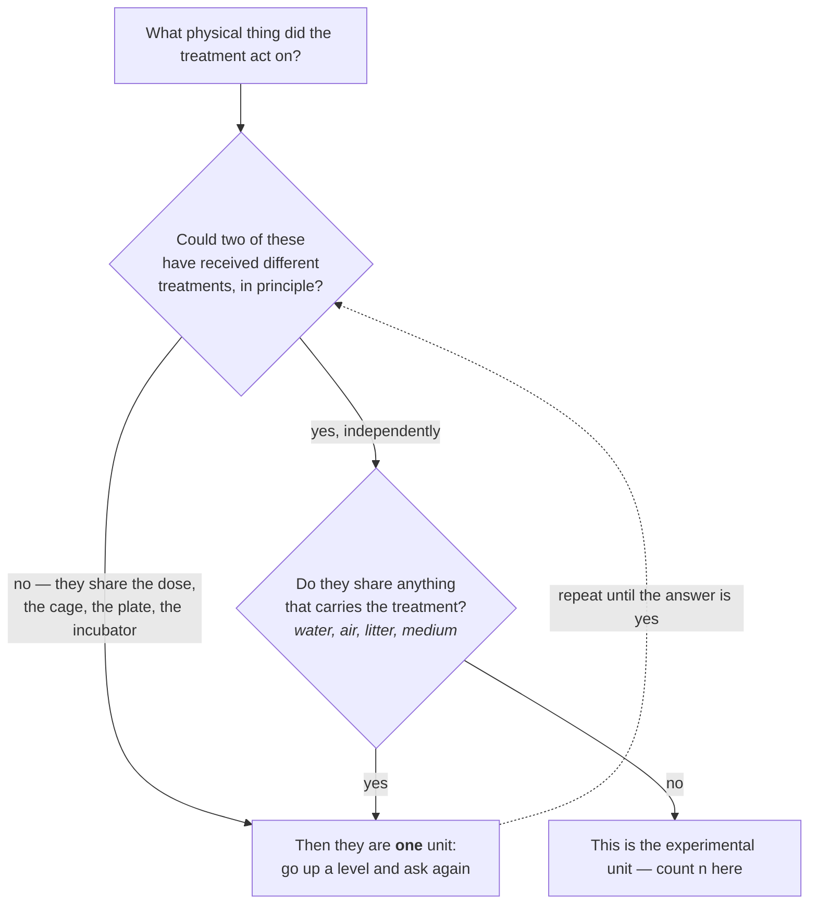
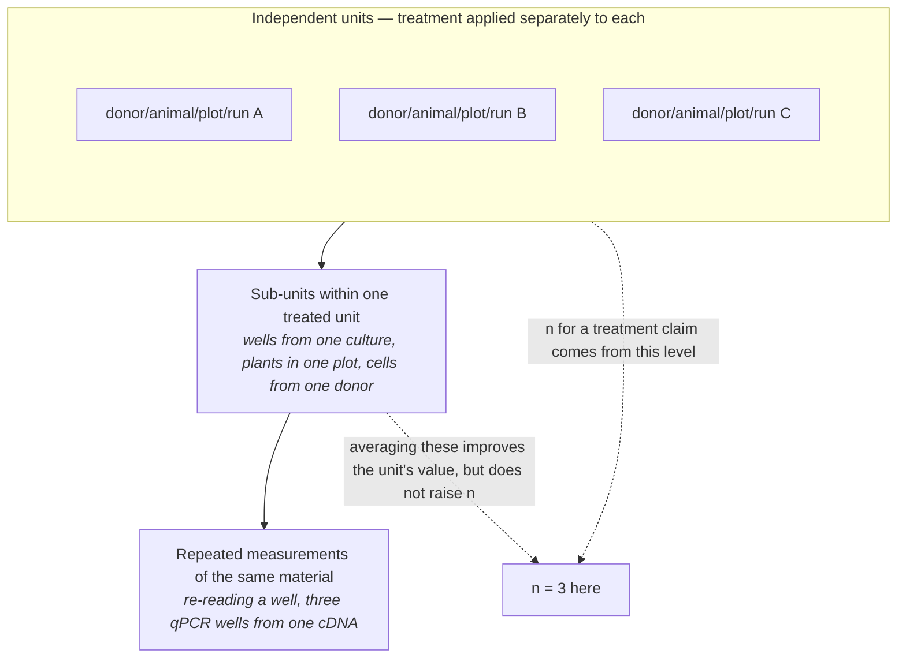
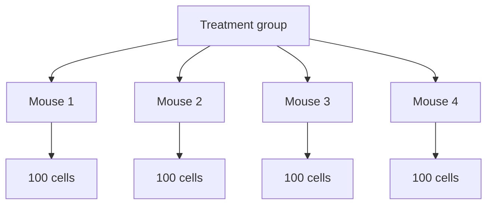
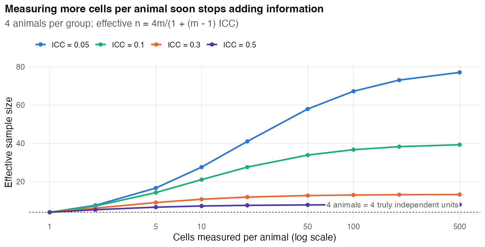
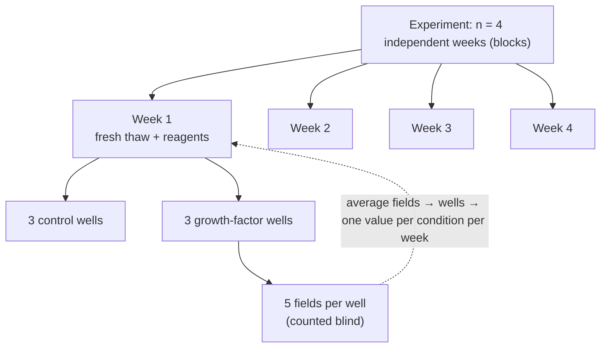
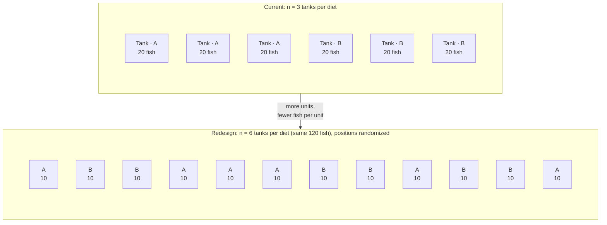
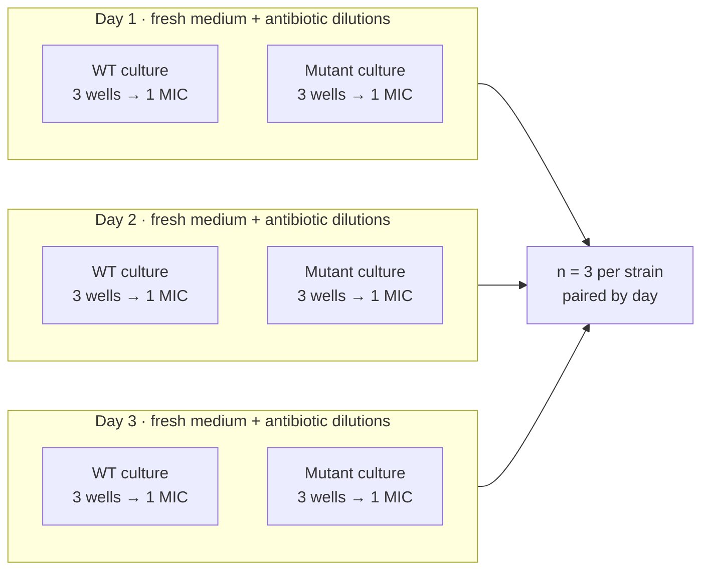

# Chapter 3 — The Experimental Unit and Replication

> **Part II — The Core Toolkit**
> [← Chapter 2](02-start-with-the-question.md) · [Table of Contents](../README.md) · [Next: Chapter 4 — Randomization and Blinding →](04-randomization-and-blinding.md)

---

<details>
<summary>🧬 <b>Biology primer</b> — units you will meet in this chapter (expand if new)</summary>

- **Passage/culture:** cells grown from a frozen stock; "independent cultures" are started separately, ideally on different days.
- **Litter:** pups born to the same mother at the same time; they share genetics and early environment.
- **Plot:** a patch of field planted with one variety or treatment.
- **Technical replicate:** a repeated *measurement* of the same biological material (e.g. the same RNA run twice).

</details>

---

## 🧭 Learning Objectives

After this chapter you will be able to:

1. Identify the **experimental unit** in any design: the entity independently assigned to a treatment.
2. Distinguish experimental units from **observational units** and technical replicates.
3. Compute the **design effect** and the effective sample size for clustered data.
4. Choose between aggregating to the unit and fitting a mixed model.
5. Explain why biological replication usually beats measurement depth.

---

## 🎯 The Big Picture

Your sample size *n* drives every standard error, confidence interval and *p*-value.
So the single most consequential design decision is **what you count as *n***.

> **Definition:** The **experimental unit** is the smallest entity that can be
> **independently assigned** to a treatment [@lazic2018; @festing2002]. *n* is the
> number of experimental units, not the number of measurements.

Count measurements instead of units and you get **pseudoreplication** [@hurlbert1984]:
a fake sample size that manufactures significance. This chapter builds directly on
[📘 Biostat Ch. 31](https://github.com/MdRasheduz-zaman/biostatistics/blob/main/chapters/31-replicates.md)
and [📘 Ch. 32](https://github.com/MdRasheduz-zaman/biostatistics/blob/main/chapters/32-pseudoreplication.md),
and focuses on how to get the unit right at the *design* stage.

---

## 🧠 Core Intuition

### The "independent assignment" test

Ask: **"Could two of these things have received different treatments?"**

- Drug added to the culture medium of a dish → all cells in that dish *must* get the
  same treatment → the **dish** is the unit.
- Drug in the drinking water of a cage → all mice in that cage share it → the
  **cage** is the unit.
- Mother injected during pregnancy → all pups share it → the **litter** (mother) is
  the unit.
- Fertilizer spread on a plot → the **plot** is the unit, not each plant.
- Each patient randomized individually → the **patient** is the unit. If whole
  hospitals are randomized → the **hospital** is the unit (a *cluster* design).



### Three kinds of "replicate"

| Kind | What varies | Licenses inference about… |
|---|---|---|
| **Technical replicate** | the measurement (pipetting, instrument) | measurement precision only |
| **Biological replicate** | the biological material (different animals, plants, patients, independent cultures) | the biological population |
| **Independent repeat** | the whole experiment (different day, cell stock, operator, lab) | robustness of the finding |


*With no true effect, testing cells as n produced a false positive in 38% of 2,000 simulated experiments; testing the 3 experiment means, in 6%. Code: scripts/course/figures.R.*



### Assignment, sampling and generalization are different levels

A well **can be an experimental unit** if treatment is assigned and applied separately
and wells do not interfere. Re-reading the same well is technical replication. Wells
from one stock still share a biological source: they do not replicate donors, cell
lines or experimental days. Calling every well “technical” hides this distinction.

For a claim that survives across runs, repeat the treatment comparison in independently
prepared cultures on several days. Day is then a **block**, with both conditions in
each day; analyse paired day-level contrasts or model the hierarchy. Report the number
of days, wells per condition and fields per well separately [@lazic2018; @lord2020].
A fresh thaw alone does not create a new cell line or donor.

For an observational study, no treatment is assigned: identify the **sampling unit**
(e.g. donor), the measured units and their dependence. In a split-plot, different
factors have different assignment units. Always ask: **what level supports this claim?**

### Why correlated measurements carry less information

Cells from the same animal resemble each other more than cells from different
animals. This resemblance is measured by the **intra-class correlation**, ρ (ICC):
the fraction of total variance that is *between* units. If you measure *m*
sub-units in each of *n* units, the information is reduced by the **design effect**:

$$\text{DE} = 1 + (m-1)\rho, \qquad n_{\text{eff}} = \frac{n \times m}{\text{DE}}$$

When ρ is large, adding sub-units barely helps. You need more **units**.

This formula assumes equal cluster sizes and a common within-cluster correlation.
Its effective sample size is a **variance comparison with independent measurements**,
not a count of randomized units or the degrees of freedom for a treatment test.
With four mice per group, n_eff ≈ 13 does not give you 13 mice per group. Unequal
cluster sizes, repeated measures and small numbers of clusters need more specific
calculations.

---

## 👁️ Visual Intuition



400 cells, but **4 experimental units**. The cells tell you about *each mouse*
precisely; only the mice tell you about *mice in general*.

What happens if you analyse the cells as if they were independent? Our simulation
(two groups, four animals each, **no true effect**):


*Panel a: with 100 cells per animal, treating cells as *n* gives false-positive rates
of 54% (ρ = 0.1) and 74% (ρ = 0.3) instead of 5%. Analysing one mean per animal stays at
about 5%. Panel b is used in Chapter 20, panel c in Chapter 8.* (Code:
`scripts/05_figures.R`.)

---

## 🔬 Worked Example — the design effect

You image neurons from **4 control and 4 treated mice**, measuring **100 neurons per
mouse**. A pilot suggests ρ = 0.3.

1. **Design effect:** DE = 1 + (100 − 1) × 0.3 = **30.7**.
2. **Effective sample size per group:** (4 × 100)/30.7 ≈ **13** — not 400.
3. **What if you measure 1,000 neurons per mouse?** DE = 1 + 999 × 0.3 = 300.7;
   n_eff = 4,000/300.7 ≈ 13.3. Ten times the imaging work for almost no gain.
4. **What if you use 8 mice per group with 100 neurons each?** n_eff = 800/30.7 ≈ 26 —
   double the information.

**Lesson:** when ρ is moderate or large, spend the budget on **more units**, not
more measurements per unit.




**Analysis that respects the design** — either:

- **aggregate**: compute one value per mouse (e.g. the mean) and compare 4 vs 4; or
- **model the hierarchy**: a mixed model with mouse as a random effect [@bates2015; @aarts2014]
  (see [📘 Biostat Ch. 33](https://github.com/MdRasheduz-zaman/biostatistics/blob/main/chapters/33-hierarchical-mixed-models.md)).

```r
# one row per neuron: value, group, mouse
library(lme4)
fit <- lmer(value ~ group + (1 | mouse), data = neurons)   # mouse = experimental unit
# equivalent simple route: aggregate, then a t-test on 4 vs 4 means
means <- aggregate(value ~ group + mouse, data = neurons, FUN = mean)
t.test(value ~ group, data = means)
```

---

## ⚠️ Common Misconceptions

| ❌ The misconception | ✅ What is actually true — and what to do |
|---|---|
| **"*n* = number of data points."** | *n* = number of independently treated units. |
| **"Technical replicates make my result more reliable."** | They make the *measurement* more reliable. They do not tell you whether the effect generalizes. |
| **"Three wells = biological triplicate."** | State how wells were prepared and assigned. Independently treated wells can replicate a within-run contrast; three wells from one stock do not replicate days, donors or cell lines. |
| **"Mixed models are only for fancy statistics."** | They are simply the analysis that matches a hierarchical design. Aggregating to unit means is a valid simple alternative when each unit has a similar number of measurements. |
| **"Single-cell data have huge *n*."** | Cells are sub-units of donors. Treating them as replicates produces floods of false positives; pseudobulk or mixed models fix this [@squair2021; @zimmerman2021]. |

---

## 🧪 Spot the Flaw

> "Mice were housed 5 per cage. Cages were randomly assigned to a high-fat or control
> diet (2 cages per diet). Gut microbiome was sequenced from all 20 mice; diets were
> compared with a Wilcoxon test (*n* = 10 per group, *p* = 0.003)."

<details>
<summary>▶ Diagnosis</summary>

Diet was assigned to **cages**, and co-housed mice share microbes (coprophagy), so
the **cage is the experimental unit**: *n* = 2 per group, not 10. With two cages per
diet, the effect is estimable but very imprecise — one unusual cage can
create the whole difference [@laukens2016]. **Fix:** justify more cages (6 per diet is
an illustrative layout, not an adequacy threshold),
fewer mice per cage, or single housing if welfare permits; use cage as the unit or a
random effect, and balancing of litter and vendor shipment across diets.
</details>

---

## 🔎 The Reviewer's Perspective

- **"What was randomized to what?"** The answer names the unit.
- **"Are the *n* in the figure legends experimental units?"** Ask for SuperPlots
  showing units and sub-units [@lord2020].
- **"Are technical replicates averaged before testing?"**
- **"Is there a hidden cluster** — cage, litter, plate, batch, field, hospital?"

---

## 🛠️ Design Challenges

Three scenarios from different fields. For each, name the experimental unit **before**
anything else — then open the model answer and its diagram.

### Challenge 1 · Cell biology · ⭐ — proliferation in a cell line

You will test whether a growth factor increases the proliferation of a human cell
line. You can run up to 24 wells per week for 4 weeks, and you will count Ki-67+
nuclei in 5 fields per well. Define the unit and allocate your effort.

<details>
<summary>▶ A model design</summary>

- **Assignment unit:** a **well**, if growth factor is applied separately to randomized
  wells. **Biological/run replication:** 4 independently prepared weeks, used as blocks.
  Fields are observational sub-units; wells within a week share culture history.
- **Structure:** 4 weeks (independent repeats) × (control, growth factor), with e.g.
  3 wells per condition per week, positions randomized on the plate. Count 5 fields
  per well blind to treatment.
- **Analysis:** average fields → wells → one value per condition per week; analyse
  the 4 paired weekly differences (week is a block) or fit a mixed model with
  week/well random effects.
- **Report:** 4 independent weekly blocks, 3 wells per condition per block, 5 fields
  per well; the paired analysis has 4 weekly contrasts. Show all wells as a SuperPlot.


</details>

### Challenge 2 · Aquaculture · ⭐ — fish in tanks

A feed trial compares two diets in juvenile trout. The facility has 6 tanks of 20 fish;
each tank gets one diet (3 tanks per diet), and every fish is weighed individually after
8 weeks. The draft report says "*n* = 60 fish per diet, *p* = 0.003". What is the unit,
what is *n*, and how would you redesign with the same 120 fish?

<details>
<summary>▶ A model design</summary>

- **Unit:** the **tank** — diet is assigned to tanks, and fish in a tank share water,
  temperature, feeding events and social hierarchy. *n* = **3 tanks per diet**, not 60 fish.
  The reported *p*-value treats 120 correlated fish as independent (pseudoreplication).
- **Analysis of the current data:** tank means (one value per tank, *n* = 3 vs 3) or a mixed
  model with tank as a random effect. Expect a much wider confidence interval.
- **Redesign:** with the same 120 fish, use **12 tanks of 10 fish** (6 per diet), assigned at
  random — and block by position in the room (e.g. near/far from the inflow) if tanks
  differ. Six independent units per diet buy far more information than extra fish per tank.


</details>

### Challenge 3 · Microbiology · ⭐⭐ — is the mutant more resistant?

A student compares the minimum inhibitory concentration (MIC) of an antibiotic for a
wild-type strain and a mutant. On one afternoon they pick 3 colonies of each strain from
one plate, grow them in the same batch of medium, and test each culture in 3 wells:
"*n* = 9 per strain". What is wrong, and what should they do?

<details>
<summary>▶ A model design</summary>

- **What varies between the 9 values?** Only the colony and the pipetting — not the day,
  the medium batch, the inoculum preparation or the antibiotic dilution series. The 3 wells
  per culture are **technical replicates**; the 3 colonies are a narrow form of biological
  replicate. A day-specific problem (a weak antibiotic stock, a warm incubator) affects all
  9 values together and cannot be detected.
- **Fix:** **3 independent days** (= blocks), each with a fresh colony of **both** strains, a
  fresh medium and a freshly prepared dilution series; both strains tested side by side on
  the same plate each day. Technical wells are averaged (or MIC read as the mode).
- ***n* = 3 independent experiments per strain**, analysed as paired by day. MICs are on a
  two-fold scale, so report the **modal MIC** and the range, and call a difference
  reproducible only after considering assay variability. A consistent difference of
  two dilution steps merits follow-up; clinical resistance requires the applicable
  species–drug breakpoint, not this difference alone.


</details>

---

## ✅ Check Your Understanding

**⭐ Q1.** Define the experimental unit in one sentence.

**⭐ Q2.** What is the difference between a technical and a biological replicate?

**⭐⭐ Q3.** 6 people total (3 disease cases, 3 healthy controls), 3 biopsies each,
each biopsy sequenced twice. How many independently sampled people support the
disease comparison?

**⭐⭐ Q4.** With ρ = 0.05 and 20 cells per animal, what is the design effect? Is
pseudoreplication a big problem here?

**⭐⭐⭐ Q5.** You can afford 120 single-cell libraries' worth of sequencing. Option A:
2 donors per group, deep sequencing. Option B: 6 donors per group, multiplexed with
fewer cells per donor. Which do you choose and why?

---

## 📝 Sample Answers & Assessment

<details>
<summary>▶ Show sample answers</summary>

> **Q1 — Sample answer:** *"The thing we measure."* — **✘ 2/10.** We often measure
sub-units (cells, fields). The unit is what is **independently assigned** to a
treatment.

> **Q2 — Sample answer:** *"Technical = same sample measured again; biological =
different organisms or independent cultures."* — **✔ 10/10.**

> **Q3 — Sample answer:** *"18 biopsies."* — **✘ 3/10.** The comparison is between
people, so the **person** is the sampling unit: 6 total, 3 per group.
Biopsies and sequencing runs are nested sub-units.

> **Q4 — Sample answer:** *"DE = 1 + 19 × 0.05 = 1.95, so the effective n is about
half the cell count. Still a problem if you use cells as n."* — **✔ 10/10.** Even a
small ρ nearly halves the information, and the *p*-value from a cell-level test
would still be too small.

> **Q5 — Sample answer:** *"B, because donors are the unit."* — **✔ 9/10.** Add the
design benefit: multiplexing donors from both groups into each capture makes batch
and condition separable [@tung2017], and pseudobulk analysis with 6 vs 6 donors is
far better powered than 2 vs 2.

**Rubric:** the key is always to name *what was independently assigned or sampled*.
</details>

---

## 🧾 Chapter Summary

| Concept | One-line takeaway |
|---|---|
| **Experimental unit** | The smallest entity independently assigned to a treatment; *n* counts these. |
| **Sub-units** | Cells, fields, reads, plants-in-plot improve measurement, not replication. |
| **Design effect** | DE = 1 + (m − 1)ρ; with clustering, more units beat more sub-units. |
| **Analysis** | Aggregate to units, or use mixed models that mirror the hierarchy. |
| **Hidden clusters** | Cage, litter, plate, batch, hospital, field. |

**Traps to remember:** cells ≠ animals · wells ≠ independent days · biopsies ≠ patients ·
reads ≠ samples.

### 📇 Design Card — add these rows

| Field | Your answer |
|---|---|
| Experimental unit | |
| Sub-units measured within each unit | |
| Hidden clusters (cage, litter, plate…) | |
| Planned *n* (in units) | |

---

## 🔗 Go Deeper

- 📘 Biostat course: [Ch. 31 — Biological vs. Technical Replicates](https://github.com/MdRasheduz-zaman/biostatistics/blob/main/chapters/31-replicates.md) · [Ch. 32 — Pseudoreplication](https://github.com/MdRasheduz-zaman/biostatistics/blob/main/chapters/32-pseudoreplication.md) · [Ch. 33 — Hierarchical & Nested Designs](https://github.com/MdRasheduz-zaman/biostatistics/blob/main/chapters/33-hierarchical-mixed-models.md)
- Key reading: [@lazic2010; @blainey2014]

<!-- REFS -->

---

[← Chapter 2](02-start-with-the-question.md) · [Table of Contents](../README.md) · [Next: Chapter 4 — Randomization and Blinding →](04-randomization-and-blinding.md)
