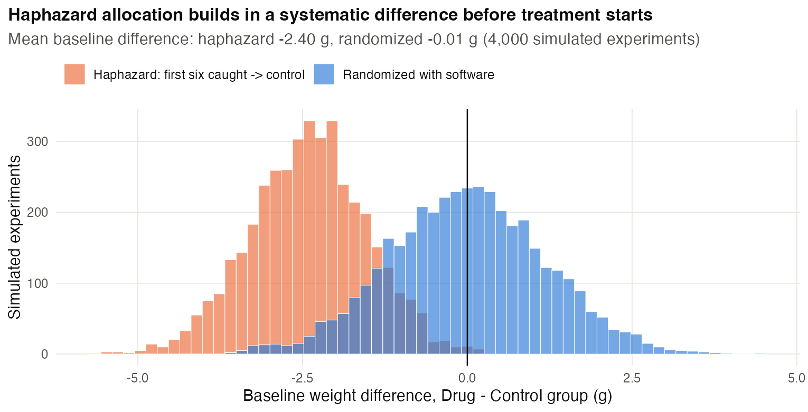
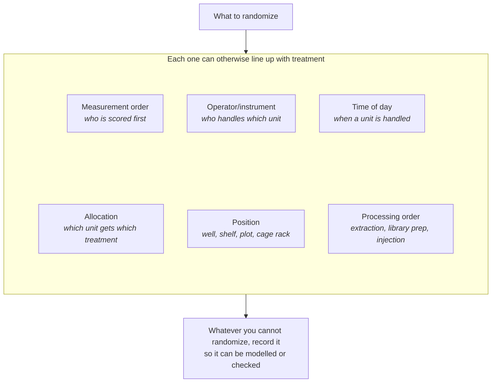
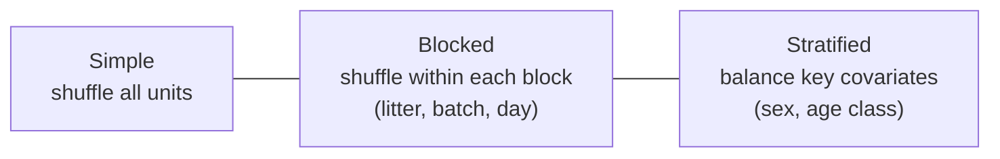
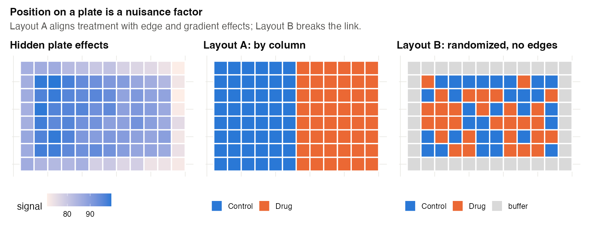
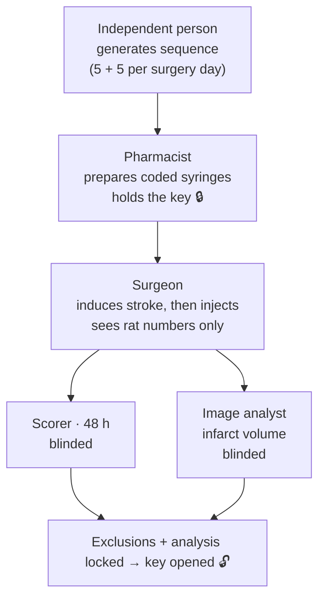
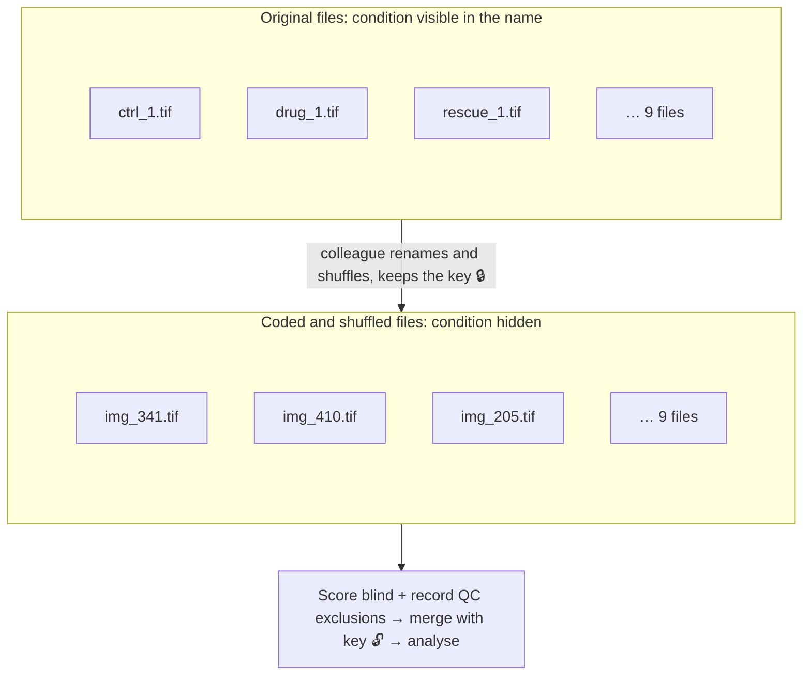

# Chapter 4 — Randomization, Blinding and Allocation Concealment

> **Part II — The Core Toolkit**
> [← Chapter 3](03-experimental-unit-and-replication.md) · [Table of Contents](../README.md) · [Next: Chapter 5 — Blocking and Batches →](05-blocking-and-batches.md)

---

## 🧭 Learning Objectives

After this chapter you will be able to:

1. Explain why randomization protects against **unknown** confounders, and why "haphazard" is not random.
2. Generate a reproducible randomization (simple, blocked, stratified) in R.
3. Randomize not only treatment allocation but also **processing order and position**.
4. Distinguish **allocation concealment** from **blinding**, and say who should be blinded to what.

---

## 🎯 The Big Picture

You can balance the factors you know about: sex, age, litter, batch. But what about
the ones you don't know about — which mouse is slightly stressed, which plant got a
little more light, which patient is more health-conscious? **Randomization is the
only device that balances unknown factors, on average** [@rubin1974; @senn2004]. It
also provides the probability model behind the *p*-value.

Randomization stops *chance-like* imbalances from becoming *systematic* ones.
Blinding stops *people* from creating systematic differences — in how they treat,
handle or score units.

---

## 🧠 Core Intuition

### Haphazard is not random

"I picked the mice from the cage without thinking" is **haphazard**. People reliably
pick the slowest, calmest or largest animals first, and the healthiest-looking
plants or the cleanest wells. Any such tendency becomes a confounder. True
randomization uses a random-number generator and a record of the seed.



*Simulation: heavier mice tend to be caught first. Code: scripts/course/figures.R.*


### What should be randomized?

| Element | Why |
|---|---|
| **Allocation**: which unit gets which treatment | balances unknown unit-level confounders |
| **Order**: dosing, dissection, measurement, injection, sequencing | balances drift, fatigue, time-of-day |
| **Position**: plate wells, cage racks, field plots, bench locations | balances edge effects and gradients |
| **Batch membership**: which samples go in which run | prevents treatment–batch confounding (Chapter 5) |

Randomizing allocation but processing groups in sequence reintroduces exactly the
bias randomization removed [@oberg2009].



### Concealment versus blinding

- **Allocation concealment:** the person *enrolling* or selecting a unit cannot
  know or predict which group it will go to. This protects the randomization from
  being subverted ("this one looks sick; I'll put it in the control group")
  [@schulz2002].
- **Blinding (masking):** people who *treat, care for, measure or analyse* the units
  do not know their group. This protects the conduct and the measurement.

You can almost always conceal allocation and blind the outcome assessor, even when
you cannot blind the person giving the treatment (e.g. surgery vs no surgery).

### The evidence

In animal research, safeguards such as randomization and blinding are rarely
reported [@kilkenny2009; @macleod2015], and studies without them report **larger
effects** [@crossley2008]. That is why ARRIVE and other guidelines require them to be
reported [@percie2020; @landis2012].

---

## 👁️ Visual Intuition — three randomization schemes



| Scheme | Use when | Risk if ignored |
|---|---|---|
| **Simple** | units are homogeneous, *n* is large | chance imbalance in small studies |
| **Blocked** | a known nuisance factor groups units | block differences inflate error or confound |
| **Stratified** | a strong prognostic covariate exists | imbalance on that covariate |

---

## 🔬 Worked Example — randomizing 12 mice in R

**Complete randomization of 12 mice with fixed group sizes (6 each):**

```r
set.seed(7)                           # record the seed in your lab book
ids <- sprintf("M%02d", 1:12)
data.frame(mouse = ids, group = sample(rep(c("Control", "Drug"), each = 6)))
```

Output (R 4.3):

| mouse | M01 | M02 | M03 | M04 | M05 | M06 | M07 | M08 | M09 | M10 | M11 | M12 |
|---|---|---|---|---|---|---|---|---|---|---|---|---|
| group | Drug | Control | Drug | Control | Drug | Drug | Control | Drug | Control | Drug | Control | Control |

**Block randomization** when the mice come from 4 litters with 2 pups each — one pup
per litter gets each treatment:

```r
set.seed(11)
t(sapply(1:4, function(litter) sample(c("Control", "Drug"))))
```

| Litter | Pup 1 | Pup 2 |
|---|---|---|
| 1 | Drug | Control |
| 2 | Drug | Control |
| 3 | Drug | Control |
| 4 | Control | Drug |

Notice that three litters in a row gave "Drug" to pup 1. That is what randomness looks
like. **Do not "fix" a random sequence that looks patterned**: the moment you choose
the sequence, it is no longer random.

**Then randomize the processing order** — e.g. all 12 mice in the first layout, or
all 8 mice in the four-litter layout —
with a second call to `sample(ids)`, and give the dissector a list of mouse IDs only.

**Concealment and blinding in practice:** a colleague not involved in the experiment
holds the key (ID → group), prepares coded syringes (A/B), and reveals the key only
after the data are locked.

---

## ⚠️ Common Misconceptions

| ❌ The misconception | ✅ What is actually true — and what to do |
|---|---|
| **"I'll balance the groups by eye."** | You can balance *known* factors (by blocking or stratifying). Eyeballing cannot balance unknown ones and invites bias. |
| **"Randomization guarantees balanced groups."** | It guarantees *no systematic* imbalance. In small studies chance imbalance can still occur; blocking and stratification reduce it. |
| **"Blinding is impossible in my experiment."** | Outcome assessment and analysis can almost always be blinded with coded samples. |
| **"Randomizing allocation is enough."** | Order, position and batch must be randomized or balanced too. |
| **"Re-randomize until it looks nice."** | Repeated re-drawing until a "good-looking" allocation appears is selection, not randomization (unless done under a pre-specified, formal rule). |

---

## 🧪 Spot the Flaw

> "Plants were assigned to treatments in alternating order as they were taken from
> the growth chamber (first plant: control, second: salt, third: control…). The
> technician who applied the salt also scored leaf damage on a 0–5 scale."

<details>
<summary>▶ Diagnosis</summary>

1. **Alternation is not randomization** — it is predictable, so whoever picks the
   plants can (consciously or not) influence which plant gets which treatment, and
   any periodicity in chamber position aligns with treatment.
2. **The outcome is subjective and the scorer was unblinded.** Expectations leak into
   0–5 scores. **Fix:** a computer-generated allocation held by a third person,
   coded plant labels, and blinded scoring (ideally by two independent scorers).
</details>

---

## 🔎 The Reviewer's Perspective

- **"How was the sequence generated?"** (Not "randomly" — *how*: software, seed, block size.)
- **"Who knew the allocation, and when?"**
- **"Were the people measuring outcomes blinded?"**
- **"Were processing order and position randomized or balanced?"**

---

## 🛠️ Design Challenges

Three scenarios from different fields: randomizing positions, concealing allocation, and
blinding a measurement. Sketch your plan first, then open the model answer and its diagram.

### Challenge 1 · Cell-based assay · ⭐ — a 96-well plate

A 96-well plate assay compares 3 compounds and a vehicle control, with 8 replicate
wells each (32 wells), plus positive-control wells. Edge wells evaporate faster.
Design the plate layout.

<details>
<summary>▶ A model design</summary>

- Leave the outer ring empty or fill it with buffer (edge effect).
- Treat each of the 4 inner rows used as a **block** containing every condition
  twice, with positions **randomized within the row** (seeded `sample()` per row).
- Distribute positive and negative controls across the plate, not in one column.
- Randomize the dispensing order or use a multichannel pattern that does not align
  with treatment.
- Repeat on an independent day (new plate), re-randomizing the layout: plates/days
  are the independent repeats (Chapter 3).



</details>

### Challenge 2 · Preclinical stroke · ⭐⭐ — who may know what?

Forty rats will receive a drug or vehicle after experimental stroke surgery. One surgeon
operates on 10 rats per day for 4 days; a second person scores neurological deficits at
48 h; a third measures infarct volume on brain sections. Design the randomization,
**allocation concealment** and **blinding** — who holds which information, and when?

<details>
<summary>▶ A model design</summary>

- **Sequence:** a person not involved in surgery or outcome assessment generates a
  computer-based sequence, **blocked by surgery day** (5 drug + 5 vehicle per day), so
  day-to-day changes in surgical skill or room conditions are balanced.
- **Concealment:** a pharmacist (or a colleague) prepares identical syringes labelled with
  the rat's number. The surgeon cannot predict the next allocation — important because
  knowing it could change how carefully the surgery is done or which rat is chosen next.
- **Inject after surgery:** allocate as late as possible (after the stroke is induced), so
  that surgical difficulty cannot depend on group.
- **Blinding:** the scorer and the image analyst see only rat numbers; exclusions (e.g. death
  before 48 h, no infarct) follow pre-specified rules and are decided **before** unblinding.


</details>

### Challenge 3 · Microscopy · ⭐⭐ — blinding image scoring

You will score neurite length in 3 conditions (control, drug, drug + rescue) from 9 image
files (3 per condition) per experiment. You acquired the images yourself, so you know the
conditions from the file names. How do you blind the scoring, and what else can bias it?

<details>
<summary>▶ A model design</summary>

- **Blind the files:** a colleague (or a short script run once) copies the images to new,
  random codes, shuffles their order and stores the key separately. You score files
  `img_341.tif`, `img_410.tif` … without knowing the condition.
- **Bias at acquisition too:** choosing "nice" fields is a selection bias. Pre-specify the
  field positions (e.g. a fixed grid of 5 fields per coverslip, chosen by the stage, not by
  eye) and identical acquisition settings for all conditions.
- **Prefer automation** (a fixed analysis pipeline applied to all files) and validate it
  on a subset against blinded manual scoring.
- **Unblind** only after all scores are entered and quality-control exclusions (e.g. out of
  focus) are recorded.


</details>

---

## ✅ Check Your Understanding

**⭐ Q1.** What can randomization do that matching or balancing by hand cannot?

**⭐ Q2.** Define allocation concealment and blinding, and give an example of each.

**⭐⭐ Q3.** A lab randomizes mice to diets but always weighs control mice first each
morning. What problem does this create?

**⭐⭐ Q4.** Why should you not discard a random allocation that "looks unbalanced"?
What should you do instead, at the design stage?

**⭐⭐⭐ Q5.** In a surgical study, surgeons cannot be blinded. List three things you
can still blind, and how.

---

## 📝 Sample Answers & Assessment

<details>
<summary>▶ Show sample answers</summary>

> **Q1 — Sample answer:** *"It balances unknown confounders on average."* —
**✔ 10/10.** Bonus: it also gives the statistical test its probabilistic basis.

> **Q2 — Sample answer:** *"Concealment: hiding the group. Blinding: hiding the
group."* — **◑ 4/10.** The *who* and *when* differ. Concealment hides the *upcoming*
assignment from those **enrolling** units (protects the randomization). Blinding hides
the assignment from those **treating, measuring or analysing** after allocation
(protects conduct and measurement). Example: sealed opaque envelopes/central
randomization (concealment); coded samples for the pathologist (blinding).

> **Q3 — Sample answer:** *"Weight changes during the morning, so control mice are
systematically lighter."* — **✔ 9/10.** Yes: order confounds time of day with diet.
Randomize or alternate weighing order by a pre-generated list.

> **Q4 — Sample answer:** *"Because then it isn't random."* — **◑ 7/10.** Correct, and
add the design-stage remedy: if a known factor matters enough to worry about, **block
or stratify on it in advance**, so the randomization balances it by construction.

> **Q5 — Sample answer:** *"The outcome assessor, the data analyst, and the
patients."* — **✔ 9/10.** And say how: coded imaging for assessors, group labels
replaced by letters for the analyst until the analysis is locked, identical dressings
or sham incisions where ethical for patients.

**Rubric:** full credit needs the *mechanism* of bias each step blocks.
</details>

---

## 🧾 Chapter Summary

| Concept | One-line takeaway |
|---|---|
| **Randomization** | Balances unknown factors on average; use software and record the seed. |
| **What to randomize** | Allocation, order, position and batch membership. |
| **Block/stratify** | Balance known factors by design, then randomize within. |
| **Concealment** | Those enrolling units cannot predict the next allocation. |
| **Blinding** | Those treating, measuring and analysing do not know the groups. |

**Traps to remember:** haphazard ≠ random · alternation ≠ random · groups processed in
sequence undo randomization · don't re-draw "ugly" allocations.

### 📇 Design Card — add these rows

| Field | Your answer |
|---|---|
| Randomization method (software, seed, block size) | |
| What else is randomized (order, position, batch)? | |
| Who holds the allocation key? | |
| Who is blinded (treatment, measurement, analysis)? | |

---

## 🔗 Go Deeper

- 📘 Biostat course: [Ch. 30 — Principles of Experimental Design](https://github.com/MdRasheduz-zaman/biostatistics/blob/main/chapters/30-experimental-design.md) (randomization and blinding)
- Practical guidance: [@festing2002; @krzywinski2014design]

<!-- REFS -->

---

[← Chapter 3](03-experimental-unit-and-replication.md) · [Table of Contents](../README.md) · [Next: Chapter 5 — Blocking and Batches →](05-blocking-and-batches.md)
