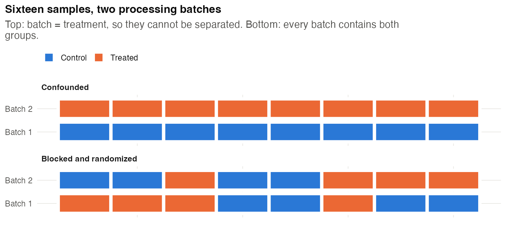
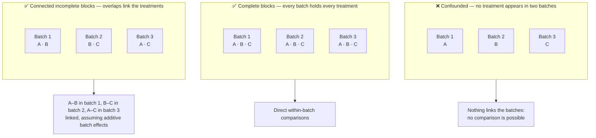
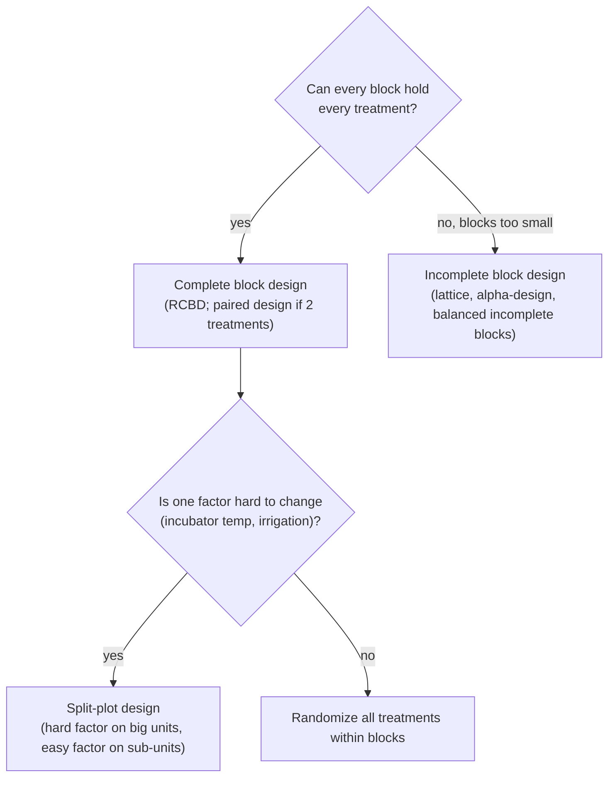
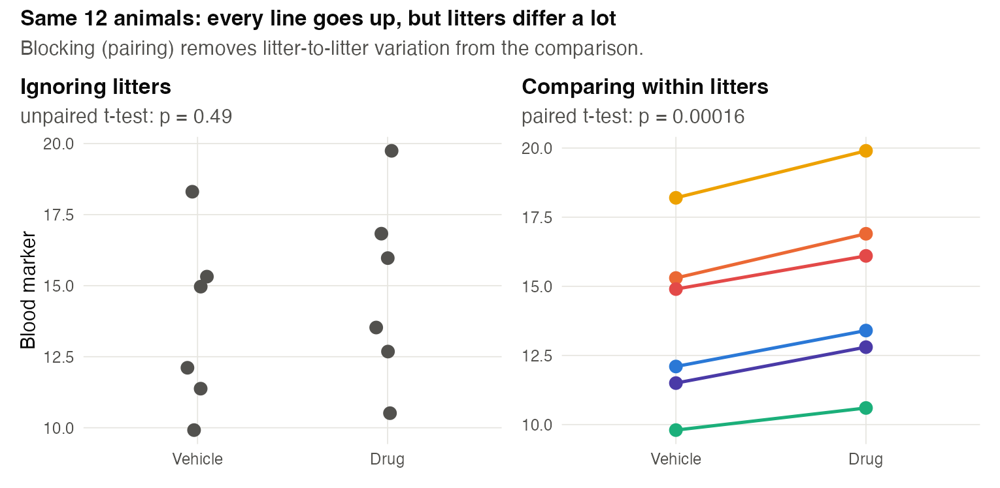
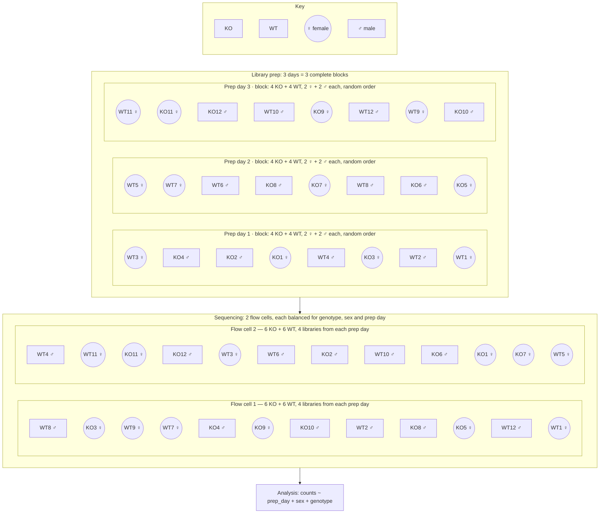
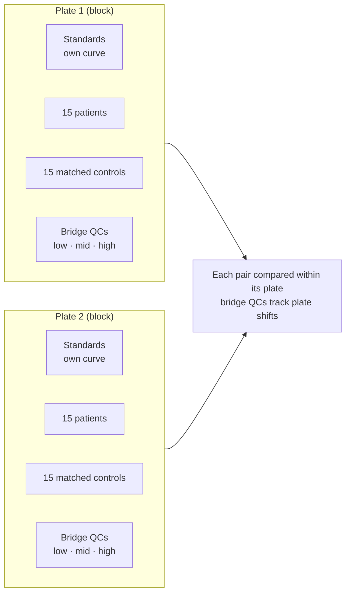
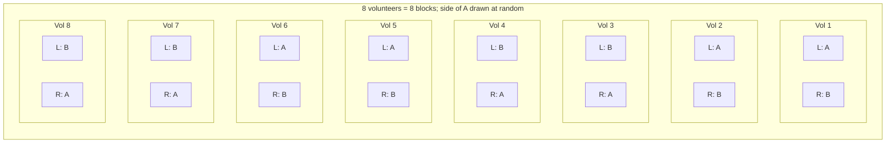

# Chapter 5 — Blocking, Batches and Nuisance Variables

> **Part II — The Core Toolkit**
> [← Chapter 4](04-randomization-and-blinding.md) · [Table of Contents](../README.md) · [Next: Chapter 6 — Controls and Comparators →](06-controls-and-comparators.md)

---

## 🧭 Learning Objectives

After this chapter you will be able to:

1. Recognize **nuisance factors** — sources of variation you don't care about but can't ignore.
2. Apply the rule **"block what you can, randomize what you cannot."**
3. Lay out samples across **batches** so that treatment and batch are never confounded.
4. Explain why batch correction cannot rescue a confounded design.
5. Choose among complete blocks, incomplete blocks and split-plots.

---

## 🎯 The Big Picture

Biology is full of variation you are not interested in: litters, days, operators,
reagent lots, sequencing runs, plate positions, field gradients, hospitals. These
**nuisance factors** do two kinds of damage:

- If they line up with your treatment, they **bias** the comparison (confounding).
- If they don't, they still add **noise** that hides real effects.

**Blocking** deals with both. Group units into blocks that are similar on the
nuisance factor, use **every treatment in each block when feasible** (complete blocks),
randomize within blocks, and compare treatments accounting for blocks [@krzywinski2014blocking; @mead2012].
The shared block effect is then separated from the treatment comparison. Small blocks
can instead contain subsets of treatments: an **incomplete-block** design needs overlap
that connects the comparisons across blocks.

> **Golden rule:** *Block what you can; randomize what you cannot.*

---

## 🧠 Core Intuition

### Same name, different fields

| Field | The "block" is called… |
|---|---|
| Agriculture | block, replicate, row/column |
| Animal research | litter, cage rack, cohort, day |
| Cell biology | experiment day, passage, plate |
| Omics | batch, run, lane, flow cell, TMT plex, injection day |
| Clinical trials | stratum, centre, site |
| Machine learning | site, scanner, hospital, acquisition date |

### Pairing is the simplest block

Comparing two treatments within the same litter, patient, leaf or day is a block of
size two. Each pair's *difference* cancels an additive effect the pair shares. Pairing does not
remove interference, carry-over or effects that differ between the paired units.

### Batches: the omics version of blocking

A **batch** is any group of samples processed together: RNA extracted on the same day,
libraries prepared with the same kit lot, sequenced in the same run. Batch effects
are ubiquitous and often larger than the biology [@leek2010]. The design solution is
to treat each batch as a **block**: put both (all) groups in every batch, in random
positions.

### Why correction can't save a confounded design

Correction methods such as ComBat [@johnson2007; @zhang2020] need information that
separates group from batch. **Perfect confounding** (all cases in one batch, all controls
in another) makes their separate effects unidentifiable. A missing group in *one* batch
is not automatically fatal: overlap elsewhere can connect the design under an additive
model. Balance remains preferable because it reduces reliance on modelling assumptions. Even with partial imbalance, removing batch
while "protecting" the group difference can exaggerate significance [@nygaard2016].
See [📘 Biostat Ch. 29 — Batch Effects](https://github.com/MdRasheduz-zaman/biostatistics/blob/main/chapters/29-batch-effects.md).

---

### A small overlap example

| Layout | Batch 1 | Batch 2 | Batch 3 | Can treatment be separated from batch? |
|---|---|---|---|---|
| Confounded | A only | B only | C only | No |
| Complete blocks | A, B, C | A, B, C | A, B, C | Yes, with direct within-batch comparisons |
| Connected incomplete blocks | A, B | B, C | A, C | Yes, assuming additive batch effects |

In the last row, A and B are compared in batch 1, B and C in batch 2, and A and C
in batch 3. The overlaps link the treatments. Replication is still needed for useful
precision; connectivity alone does not make a small design adequate.

> **Try before reading on:** if batch 3 contained only D, could you compare D with A
> independently of batch? Explain why. **Answer:** no; D has no overlap with the
> connected A–B–C set.

## 👁️ Visual Intuition — choosing a blocking structure

Two nuisance gradients at once (rows *and* columns of a field or plate) call for a
**row–column** or **Latin-square** design. Split-plots are covered in Chapter 7 and
[@altman2015split].

---

## 🔬 Worked Example — pairing within litters

Six litters; in each, one pup gets vehicle and a littermate gets a drug. Outcome: a
blood marker.

| Litter | 1 | 2 | 3 | 4 | 5 | 6 |
|---|---|---|---|---|---|---|
| Vehicle | 12.1 | 15.3 | 9.8 | 18.2 | 11.5 | 14.9 |
| Drug | 13.4 | 16.9 | 10.6 | 19.9 | 12.8 | 16.1 |
| Difference | 1.3 | 1.6 | 0.8 | 1.7 | 1.3 | 1.2 |

- **Unpaired analysis** (ignoring litters): the litters differ hugely (SD of vehicle
  values ≈ 3.1), so the 1.3-unit drug effect drowns: `t.test(drug, ctrl)` → **p = 0.49**.
- **Paired analysis** (block = litter): the differences are very consistent (SD ≈ 0.32):
  `t.test(drug, ctrl, paired = TRUE)` → **p = 0.00016**.

Same data, same animals. The design — one pup of each treatment per litter — made the
precise analysis possible, and the analysis had to **match** the design. (Code:
`scripts/course/worked_examples.R`.)

> Blocking only helps if the analysis includes the blocks. A blocked design analysed
> as if unblocked throws the benefit away.

---

## ⚠️ Common Misconceptions

| ❌ The misconception | ✅ What is actually true — and what to do |
|---|---|
| **"Batch correction will handle it."** | Only when batch and group are not confounded — that is, only when the *design* was right. |
| **"Blocks must be big."** | Pairs are blocks. Small blocks are often more homogeneous and therefore better. |
| **"Blocking costs degrees of freedom, so it's not worth it."** | You lose a few error degrees of freedom but usually remove far more variance. Block on factors you *expect* to matter. |
| **"Randomization and blocking are alternatives."** | They work together: block on known nuisance factors, then randomize within blocks. |

---

## 🧪 Spot the Flaw

> "Plasma samples from 60 patients with sepsis were collected in 2021 at Hospital A;
> 60 controls were collected in 2023 at Hospital B. Metabolomics was run in two
> batches: sepsis in batch 1, controls in batch 2. Batch effects were removed with
> ComBat before analysis."

▶ Diagnosis

Disease is **perfectly confounded** with hospital, collection year, storage time *and*
MS batch. ComBat cannot separate batch from disease when each batch contains only one
group — it either removes the disease signal or leaves the batch signal. **Fix at the
design stage:** collect cases and controls at the same sites and times (or match on
site and storage time), and run them **randomized across batches**, with pooled QC
samples in every batch (Chapter 21).

---

## 🔎 The Reviewer's Perspective

- **"List every batch-like factor and show how groups were distributed across it."**
  A table of group × batch counts is the quickest test.
- **"Was the analysis model consistent with the blocking** (block or batch as a term)?"
- **"Was batch correction applied to a balanced design?"**

---

## 🛠️ Design Challenges

Three scenarios from different fields — sequencing batches, assay plates, and the
simplest block of all: a pair. Draw your layout first, then open the model answer.

### Challenge 1 · Transcriptomics · ⭐⭐ — library prep and flow cells

You have RNA from 24 samples (12 knockout, 12 wild-type; 12 male, 12 female, balanced
across genotypes). Library prep kit capacity: 8 samples per day. Sequencing: two
flow cells of 12. Design the batch layout.

▶ A model design

- **Library prep (3 days × 8):** each day = 4 KO + 4 WT, with 2 of each sex per
  genotype → every day is a complete block over genotype × sex.
- **Sequencing (2 × 12):** each flow cell receives 6 KO + 6 WT, balanced by sex and
  drawing equally from each prep day. Multiplexing all 24 libraries across both flow
  cells is even better.
- **Randomize** sample order within each day and lane assignment within the
  constraints.
- **Analysis:** `~ prep_day + sex + genotype` (and the interaction if of interest).

Colour shows genotype, shape shows sex. The order inside each box and the split between
flow cells are one random draw (seeded) that satisfies the balance constraints:

Check the balance yourself: every row has as many orange as blue nodes and as many circles
as squares — so neither prep day nor flow cell can masquerade as a genotype or sex effect.

### Challenge 2 · Clinical biochemistry · ⭐⭐ — an ELISA on two plates

You will measure a cytokine in serum from 30 patients and 30 age- and sex-matched controls
(30 matched pairs) with a commercial ELISA. Each plate holds 30 samples in duplicate after
the standards and quality controls, so you need 2 plates. The technician suggests
"patients on plate 1, controls on plate 2". Design the layout.

▶ A model design

- **Never** put one group on one plate: plate-to-plate differences in the standard curve
  would be indistinguishable from disease.
- **Plates are blocks:** put **15 matched pairs on each plate** — each patient on the same
  plate as their control — and randomize well positions within the plate.
- **Bridge samples:** the same pooled-serum quality controls (low, medium, high) on both
  plates, to monitor and, if needed, adjust plate-to-plate shifts.
- **Same kit lot, same technician, same day if possible;** if plates are run on different
  days, day and plate coincide — still fine, because both groups are on both plates.
- **Analysis:** a separate standard curve per plate; compare patients and controls
  **within pairs** (paired analysis, or a model with plate and pair).

### Challenge 3 · Dermatology · ⭐ — pairing within a person

Two sunscreens (A and B) are compared for how well they prevent UV-induced redness. You
have 8 volunteers, whose skin sensitivity differs a lot. Each volunteer has two forearms.
Design the study.

▶ A model design

- **Each volunteer is a block (a pair):** both products on the same person, one per
  forearm, so between-person differences in skin type cancel out.
- **Randomize the side:** a coin flip (seeded) decides which forearm gets A. If A were
  always on the left, side (e.g. more sun exposure on the driving arm) would be confounded
  with product.
- **Blind the assessor:** identical, coded tubes; redness measured with a colorimeter by
  someone who does not know the coding.
- **Analysis:** paired — the difference A − B within each volunteer (paired *t*-test or a
  mixed model with volunteer as block).

---

## ✅ Check Your Understanding

**⭐ Q1.** State the golden rule of blocking.

**⭐ Q2.** What is a nuisance factor? Give three from your own field.

**⭐⭐ Q3.** Why does a paired *t*-test often give a far smaller *p*-value than an
unpaired one on the same data?

**⭐⭐ Q4.** You have 10 treatments but your incubator holds only 4 flasks. What kind of
design do you need?

**⭐⭐⭐ Q5.** A collaborator sends you 40 tumour and 40 normal samples already
sequenced in 8 runs, with each run holding only one tissue type. What can and can't
you conclude, and what would you propose?

---

## 📝 Sample Answers & Assessment

▶ Show sample answers

> **Q1 — Sample answer:** *"Block what you can, randomize what you can't."* — **✔ 10/10.**

> **Q2 — Sample answer:** *"Things like temperature that affect results."* — **◑ 5/10.**
A nuisance factor is a source of variation that affects the outcome but is **not of
interest**. Examples should be concrete for your field: extraction day, operator, lane,
cage rack, plot position.

> **Q3 — Sample answer:** *"Because pairing removes the variation between pairs."* —
**✔ 10/10.** The test uses the variance of the *differences*, which excludes everything
the pair shares.

> **Q4 — Sample answer:** *"Randomize them over several incubator runs."* — **◑ 6/10.**
Right instinct; name the design: an **incomplete block design** (e.g. a balanced
incomplete block design), so each pair of treatments appears together in a run equally
often and all comparisons are estimated with similar precision.

> **Q5 — Sample answer:** *"Nothing — tissue and run are confounded."* — **◑ 7/10.**
Almost: tissue and run are confounded, so differences cannot be attributed to tissue
with confidence. You can still check *within-tissue* run variation. Propose
re-sequencing a balanced subset (tumour and normal in every run), or validating key
genes with an independent assay on independently processed samples.

**Rubric:** full credit names both the confounding and a *design-based* remedy.

---

## 🧾 Chapter Summary

| Concept | One-line takeaway |
|---|---|
| **Nuisance factor** | Affects the outcome; not of interest; must be controlled. |
| **Blocking** | Every block contains every treatment; compare within blocks. |
| **Batches** | Treat batches as blocks; never process groups separately. |
| **Correction** | Needs separable group and batch effects; balance helps, perfect confounding cannot be repaired. |
| **Analysis** | Must include the blocks, or the benefit is lost. |

**Traps to remember:** one group per batch · "we'll ComBat it" · blocked design,
unblocked analysis.

### 📇 Design Card — add these rows

| Field | Your answer |
|---|---|
| Nuisance factors and how each is handled (block/randomize/measure) | |
| Batch layout (group × batch table) | |
| Analysis model terms for blocks | |

---

## 🔗 Go Deeper

- 📘 Biostat course: [Ch. 29 — Batch Effects & Signal vs. Noise](https://github.com/MdRasheduz-zaman/biostatistics/blob/main/chapters/29-batch-effects.md) · [Ch. 13 — ANOVA](https://github.com/MdRasheduz-zaman/biostatistics/blob/main/chapters/13-anova.md)
- Field designs with incomplete blocks: [@piepho2006]

<!-- REFS -->

---

[← Chapter 4](04-randomization-and-blinding.md) · [Table of Contents](../README.md) · [Next: Chapter 6 — Controls and Comparators →](06-controls-and-comparators.md)
