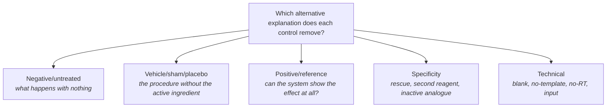
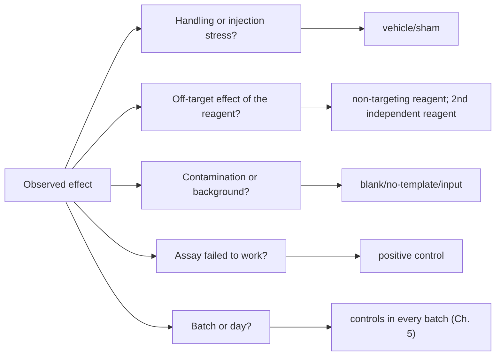
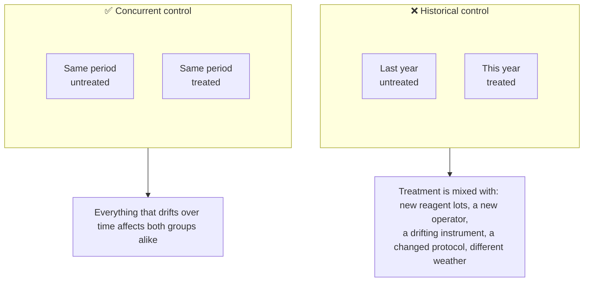
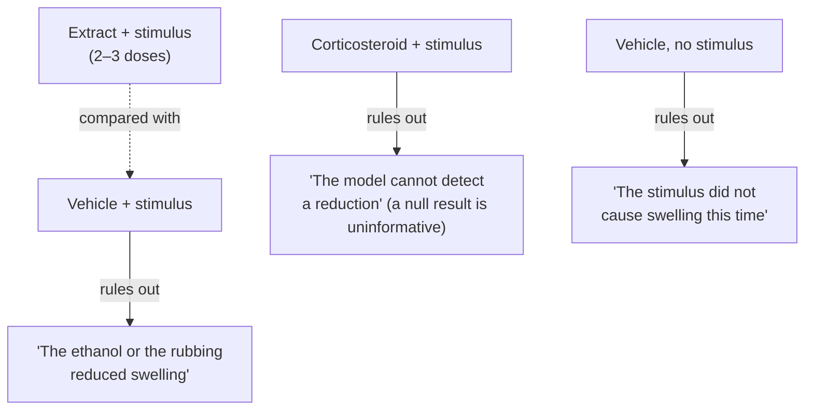
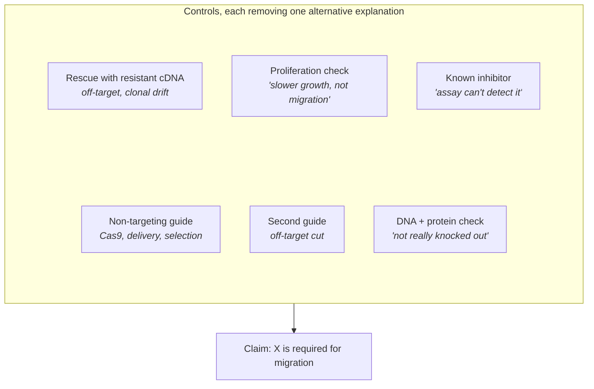
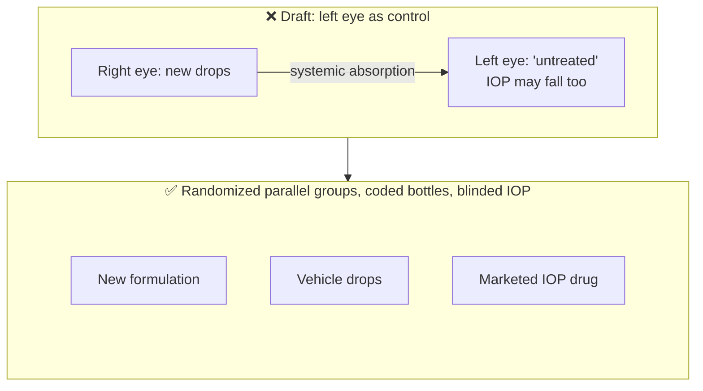

# Chapter 6 — Controls and Comparators

> **Part II — The Core Toolkit**
> [← Chapter 5](05-blocking-and-batches.md) · [Table of Contents](../README.md) · [Next: Chapter 7 — Treatment Structures →](07-treatment-structures.md)

---

## 🧭 Learning Objectives

After this chapter you will be able to:

1. Explain why every inference is a **contrast**, and why the comparator defines the question.
2. Choose among negative, vehicle/sham, positive, process (blank) and reference controls.
3. Build a control set by listing **alternative explanations** and the control that rules out each.
4. Recognize the dangers of historical and external controls.

---

## 🎯 The Big Picture

"The drug reduced tumour size" is meaningless without "compared with what?" The
**comparator** defines what you are actually measuring:

- Drug vs **untreated** → effect of drug + injection + handling + solvent.
- Drug vs **vehicle injection** → effect of the drug molecule itself.
- Drug vs **current standard drug** → *added* benefit over existing practice.

Each is a legitimate question. They are **different** questions. Controls are how you
turn a vague claim into a specific one.

---

## 🧠 Core Intuition

### A taxonomy of controls

| Control | Answers | Examples |
|---|---|---|
| **Negative/untreated** | What happens with no intervention? | untreated cells, wild-type |
| **Vehicle/sham/placebo** | What does the *procedure* do without the active ingredient? | DMSO, saline injection, sham surgery, placebo pill |
| **Specificity control** | Is the effect specific to the intended target? | non-targeting siRNA/guide, scrambled peptide, isotype antibody |
| **Positive control** | Can the system detect an effect when one exists? | known activator, reference drug, spike-in |
| **Process (blank) control** | Does the background or reagents create signal? | extraction blank, no-template PCR, input DNA in ChIP |
| **Reference material** | Are measurements comparable across batches and labs? | pooled QC sample, certified reference, mock microbial community |
| **Rescue/add-back** | Is the effect caused by losing *this* gene? | re-expressing a resistant cDNA after knockdown |

### Controls follow from alternative explanations

The best way to choose controls is to write down **every other reason** your result
could appear, then add one control per reason:

### Controls must be concurrent

Controls should be run **at the same time, in the same batches, randomized alongside
treated units**. *Historical controls* (data from last year's experiment) differ in
countless ways — animals, reagents, operators, season — and are a form of confounding.

---

## 👁️ Visual Intuition — a knockdown experiment

| Condition | Rules out |
|---|---|
| Untransfected cells | (baseline) |
| Transfection reagent only (mock) | toxicity of transfection |
| Non-targeting siRNA | generic RNAi/innate-immune response |
| siRNA #1 against gene X | — (the test) |
| siRNA #2 against gene X (different sequence) | off-target effect of siRNA #1 |
| siRNA #1 + siRNA-resistant gene X cDNA (rescue) | effect not caused by losing X |
| Positive-control siRNA (e.g. against an essential gene) | transfection failed |

Without the second independent siRNA and the rescue, the claim "gene X is required"
rests on a single reagent with possible off-target activity.

---

## 🔬 Worked Example — low-biomass microbiome controls

A team asks whether healthy placenta contains bacteria. Sequencing yields thousands of
reads assigned to bacteria. Are they real?

1. **Alternative explanation:** reagents and kits contain bacterial DNA ("kitome"),
   and contamination dominates when true biomass is tiny [@salter2014; @eisenhofer2019].
   → **Extraction blanks** and **no-template PCR controls** in every batch.
2. **Alternative explanation:** contamination during delivery or sampling.
   → **Sampling controls** (swabs of air, gloves, surgical field) and comparison of
   caesarean with vaginal deliveries.
3. **Alternative explanation:** the pipeline invents taxa.
   → **Mock community** of known composition (positive control) [@knight2018].
4. **Decision rule set in advance:** evaluate taxa against blank prevalence, absolute
   bacterial load/DNA concentration and batch patterns. A taxon appearing in a blank
   is not automatically contamination in every sample, and similar relative abundances
   can hide very different absolute amounts. Document the rule and check sensitivity
   to it. Sequencing detects DNA, which alone does not establish living resident bacteria.

The debate over a "fetal microbiome" shows what happens when such controls are missing
or under-used [@kennedy2023].

---

## ⚠️ Common Misconceptions

| ❌ The misconception | ✅ What is actually true — and what to do |
|---|---|
| **"Untreated is the right control."** | Usually you need a vehicle/sham control so that the only difference is the active ingredient. |
| **"One positive result plus one negative control is enough."** | Specificity needs independent reagents and, ideally, rescue. |
| **"Last month's controls are fine."** | Historical controls confound time, batch and biology. |
| **"Controls are a box to tick."** | Each control should rule out a *named* alternative explanation. If you cannot name it, you may not need it — or you may be missing a different one. |

---

## 🧪 Spot the Flaw

> "ChIP-seq for transcription factor TF1 identified 12,000 peaks. No input or IgG
> control was sequenced because the antibody is well established."

▶ Diagnosis

Without input (sonicated chromatin without immunoprecipitation) or IgG control,
open chromatin, copy-number differences and "hyper-ChIPable" regions appear as
peaks. ENCODE guidelines require matched controls and biological replicates
[@landt2012]. Antibody reputation does not substitute for a process control in *this*
cell type and batch.

---

## 🔎 The Reviewer's Perspective

- **"Is the comparator appropriate for the claim?"** (vehicle vs untreated vs standard of care)
- **"Which alternative explanations remain unaddressed?"**
- **"Were controls concurrent and in every batch?"**
- **"Is there a positive control showing the assay could detect an effect?"** —
  essential for interpreting a *null* result [@altman1995].

---

## 🛠️ Design Challenges

Three scenarios from different fields. For each, list the **alternative explanations**
first — every control should rule one out. Then open the model answer and its diagram.

### Challenge 1 · Pharmacology · ⭐ — a plant extract against inflammation

You will test whether a plant extract reduces inflammation in a mouse ear-swelling
model. The extract is dissolved in 10% ethanol and applied topically. Choose the
control groups and justify each.

▶ A model design

- **Vehicle (10% ethanol) + inflammatory stimulus:** isolates the extract's effect
  from the solvent and from the application procedure.
- **Extract + stimulus:** the test (ideally at 2–3 doses, Chapter 7).
- **Reference anti-inflammatory (e.g. a topical corticosteroid) + stimulus:**
  positive control showing the model can detect a reduction.
- **Vehicle without stimulus:** baseline ear thickness/verifies the stimulus works.
- All groups randomized within cage racks/days; swelling measured blinded.

### Challenge 2 · Cell biology · ⭐⭐ — a CRISPR knockout and cell migration

You knocked out gene *X* with CRISPR–Cas9 in a cancer cell line and see slower closure of
a scratch wound. You want to claim "*X* is required for migration". List the controls you
need and what each one excludes.

▶ A model design

| Control | Excludes |
|---|---|
| **Non-targeting guide**, same delivery and selection | effects of Cas9, transfection, antibiotic selection, single-cell cloning stress |
| **A second, independent guide** against *X* | an off-target cut of the first guide |
| **Verified knockout** (sequencing of the locus + loss of protein) | "the gene wasn't actually knocked out" |
| **Rescue:** re-express a guide-resistant *X* cDNA in the knockout | off-target effects and clonal drift — the strongest specificity control |
| **Proliferation assay** (or a proliferation inhibitor during the scratch assay) | "slower closure is due to slower growth, not migration" |
| **Positive control** for the assay (a known migration inhibitor) | "the assay cannot detect reduced migration" |

Use **several independent clones or a pool** per guide (a single clone can carry unrelated
mutations), and scratch-assay images analysed blind with a fixed pipeline.

### Challenge 3 · Pharmaceutics · ⭐⭐ — eye drops in rabbits

A new eye-drop formulation should lower intraocular pressure (IOP). The plan: 12 rabbits;
drops in the **right eye**, the **left eye** serves as the control; IOP measured at 0, 2, 4
and 8 h. What is wrong with the control, and what would you use instead?

▶ A model design

- **The contralateral eye is not a clean control:** drugs applied to one eye can reach the
  other through systemic absorption (via the nasolacrimal duct and blood), lowering its IOP
  as well and shrinking the apparent effect. "Right eye always treated" also confounds
  treatment with side.
- **Better:** a **vehicle-drop group** (identical drops without the drug, same volume and
  schedule) in **separate animals**, randomized; or, if using both eyes, apply vehicle to
  the other eye and measure the systemic effect explicitly.
- **Active comparator:** a marketed IOP-lowering drug, to show the model responds and to
  place the new formulation's effect in context.
- **Baseline and time:** IOP has a daily rhythm, so measure at the same clock times in
  all groups and analyse change from baseline with group × time.
- **Blinding:** coded bottles; the person measuring IOP does not know the group.

---

## ✅ Check Your Understanding

**⭐ Q1.** Why does the comparator define the question?

**⭐ Q2.** What is the purpose of a positive control?

**⭐⭐ Q3.** Why is a second, independent siRNA (or guide) more convincing than
repeating the first one three times?

**⭐⭐ Q4.** A null result is reported without a positive control. Why is it hard to
interpret?

**⭐⭐⭐ Q5.** You test a probiotic in a mouse colitis model. List four alternative
explanations for a "positive" result and the control that addresses each.

---

## 📝 Sample Answers & Assessment

▶ Show sample answers

> **Q1 — Sample answer:** *"Because the effect is always the difference from the
control."* — **✔ 10/10.** Changing the comparator changes what that difference means.

> **Q2 — Sample answer:** *"To show the experiment works."* — **✔ 9/10.** More precisely:
to show the assay *can detect an effect of known size* under today's conditions.

> **Q3 — Sample answer:** *"Repeating is just technical replication."* — **✔ 10/10.**
Repeats of the same reagent share its off-target effects. A different sequence has
different off-targets, so agreement points to the shared on-target effect.

> **Q4 — Sample answer:** *"Maybe there was no effect."* — **◑ 5/10.** The point is that
*you cannot distinguish* "no effect" from "the assay failed". Absence of evidence is not
evidence of absence [@altman1995].

> **Q5 — Sample answer:** *"Placebo gavage, heat-killed probiotic, a known protective
strain, and checking cage effects."* — **✔ 9/10.** Excellent set: vehicle gavage (handling
stress), heat-killed bacteria (live activity vs bacterial components), positive-control
strain or drug (model sensitivity), and multiple cages per group with cage as the unit
(microbiota sharing, Chapter 3). A blank extraction control for sequencing completes it.

**Rubric:** each control must be tied to a named alternative explanation.

---

## 🧾 Chapter Summary

| Concept | One-line takeaway |
|---|---|
| **Comparator** | Defines the question; choose it deliberately. |
| **Control types** | Negative, vehicle/sham, specificity, positive, blank, reference, rescue. |
| **Method** | List alternative explanations → one control per explanation. |
| **Concurrency** | Controls run alongside treatments, in every batch. |

**Traps to remember:** untreated ≠ vehicle · historical controls · no positive control
for a null result · one reagent = one hypothesis.

### 📇 Design Card — add these rows

| Field | Your answer |
|---|---|
| Comparator and what it isolates | |
| Alternative explanations → controls | |
| Positive control | |

---

## 🔗 Go Deeper

- 📘 Biostat course: [Ch. 37 — Evidence Hierarchies & Scientific Confidence](https://github.com/MdRasheduz-zaman/biostatistics/blob/main/chapters/37-evidence-hierarchies.md)
- Controls in CRISPR and screening work: [@doench2018]

<!-- REFS -->

---

[← Chapter 5](05-blocking-and-batches.md) · [Table of Contents](../README.md) · [Next: Chapter 7 — Treatment Structures →](07-treatment-structures.md)
