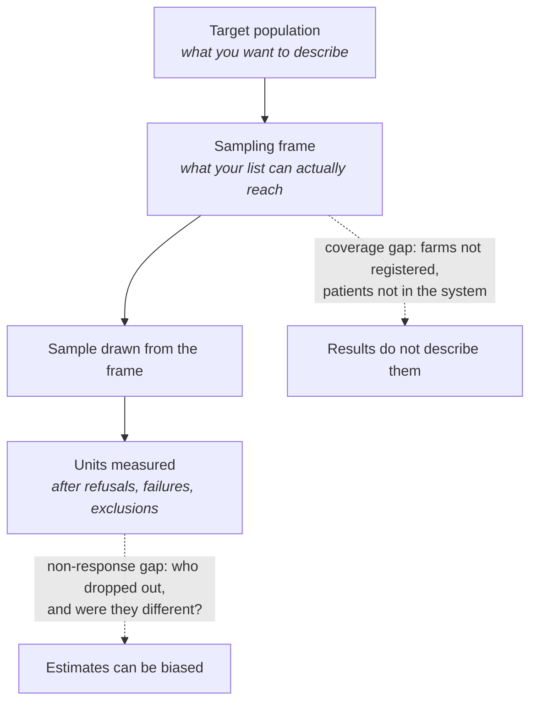
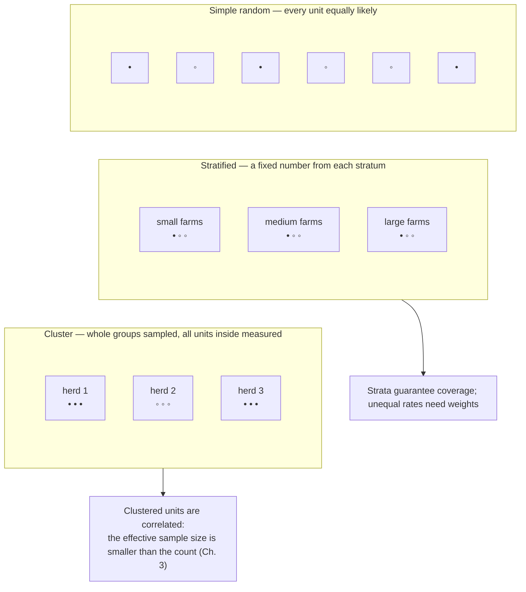
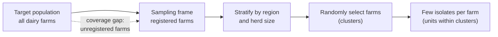
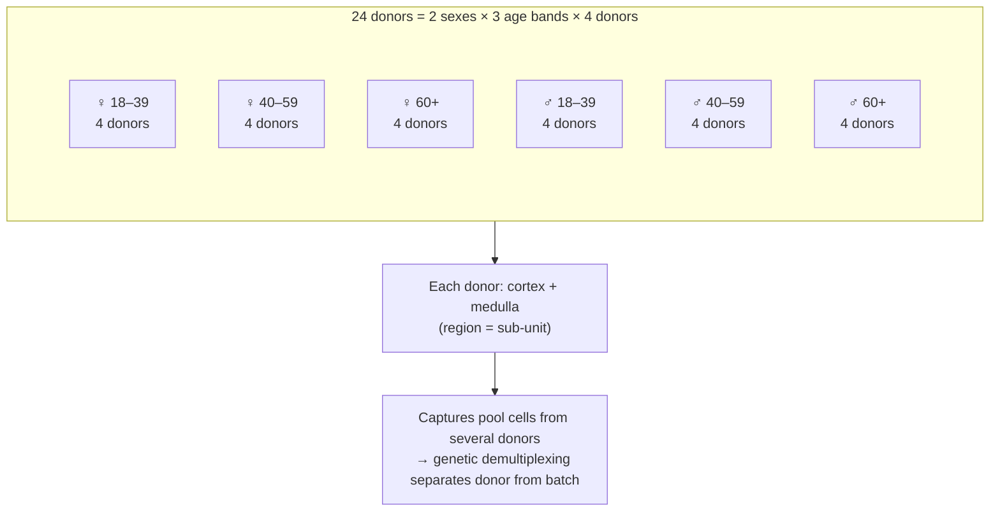
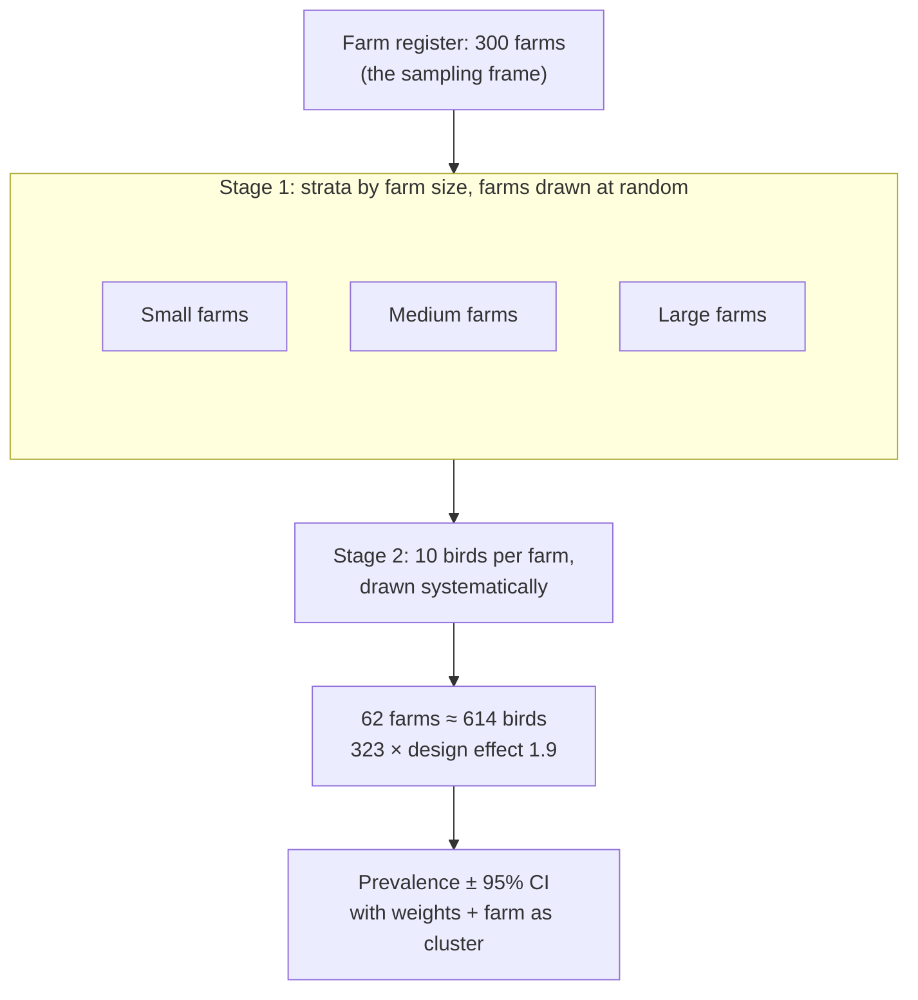
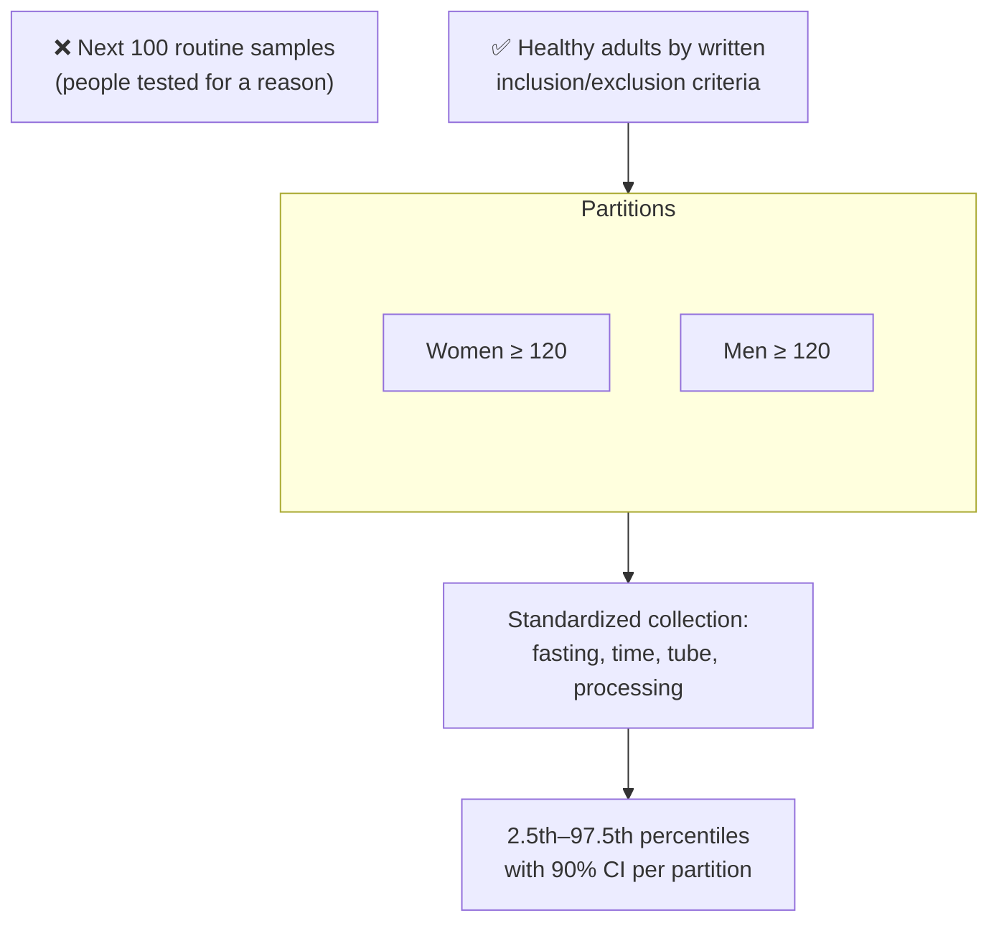
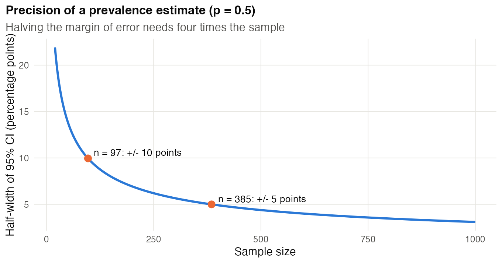

# Chapter 9 — Descriptive and Exploratory Studies (Q1)

> **Part III — Designs by Question Type**
> [← Chapter 8](08-sample-size-and-power.md) · [Table of Contents](../README.md) · [Next: Chapter 10 — Comparative and Mechanistic Experiments →](10-comparative-and-mechanistic.md)

---

## 🧭 Learning Objectives

After this chapter you will be able to:

1. Define the **target population** and **sampling frame** for a descriptive study.
2. Choose between simple, stratified and cluster sampling.
3. Size a descriptive study by the **precision** of its estimates.
4. Plan the metadata and quality control that make a descriptive dataset reusable.
5. Keep descriptive conclusions within what the design supports.

---

## 🎯 The Big Picture

Descriptive questions — *what is there, and how does it vary?* — underlie cell atlases,
reference genomes, microbiome surveys, natural-history cohorts, phenotyping campaigns
and prevalence studies. They have no "treatment", so it is tempting to think they need
no design. In fact their central design problem is harder to see:

> **A description is only as good as the match between the samples you have and the
> population you want to describe.**

An atlas built from tissue of a few young European men describes *those men*. It may or
may not describe women, older people or people of other ancestries — and you cannot tell
from the data [@peterson2019].

---

## 🧠 Core Intuition

### Population, frame, sample

| Term | Meaning | Example |
|---|---|---|
| **Target population** | what you want to describe | dairy farms in a region |
| **Sampling frame** | the list you can actually sample from | farms registered with the veterinary office |
| **Sample** | the units you measure | 70 farms, 10 isolates each |

Bias enters at each step: the frame may miss part of the population (unregistered
farms), and the sample may differ from the frame (only cooperative farmers respond).

### Sampling schemes

- **Simple random sampling:** every unit in the frame equally likely. Clean, but may
  miss small subgroups.
- **Stratified sampling:** sample separately within strata (region, sex, ancestry,
  tissue, disease stage). Guarantees coverage and improves precision. Over-sample small
  strata you need to describe. Use sampling weights for population estimates when
  sampling fractions differ; equal weighting would describe your chosen sample mixture.
  For example, if a region is 90% small farms and 10% large farms but you sample equal
  numbers of each, combine their prevalence estimates with weights 0.9 and 0.1.
  The estimand also matters: prevalence among **farms** is not prevalence among
  **isolates**, and large farms contribute differently to those targets.
- **Cluster sampling:** sample groups (farms, hospitals, ponds), then units within
  them. Cheaper, but units within a cluster are correlated, so you need more units
  (design effect, Chapter 3).
- **Convenience sampling:** whatever is available (biobank leftovers, volunteers).
  Sometimes unavoidable — then describe it honestly and limit the claims.

### Size by precision, not by power

There is usually no hypothesis test, so size the study by **how precisely** you want to
estimate a quantity, e.g. a prevalence with a 95% confidence interval of ±5 percentage
points.

### Description that others can reuse

Descriptive data are reused for years. Their value depends on **metadata** (who, where,
when, how collected and stored), **standard operating procedures** and **QC**. Reporting
standards — STORMS for microbiome studies [@mirzayi2021], metabolomics standards
[@sumner2007], FAIR principles for data [@wilkinson2016] — are checklists of what
future users will need.

---

## 👁️ Visual Intuition

---

## 🔬 Worked Example — how many isolates to estimate a prevalence?

You want the prevalence of an antibiotic-resistance gene in *E. coli* from dairy farms,
with a 95% CI of ±5 percentage points.

1. **Simple random sample of isolates.** For a proportion *p* with margin *E*:
   $n = z^2\,p(1-p)/E^2$, with z = 1.96.
   - No idea of *p* (use 0.5, the worst case): **n = 385**.
   - Earlier studies suggest *p* ≈ 0.2: **n = 246**.
   - Accepting ±10 points (p = 0.5): **n = 97**.
2. **But isolates come in farms (clusters).** Isolates from one farm share herd, feed
   and antibiotic use. With ICC = 0.2:
   - 10 isolates per farm: DE = 1 + 9 × 0.2 = 2.8 → n = 246 × 2.8 ≈ **689 isolates from 69 farms**.
   - 3 isolates per farm: DE = 1.4 → ≈ **345 isolates from 115 farms**.
3. **Decision.** Fewer isolates per farm and more farms give the same precision with
   half the lab work — if visiting more farms is affordable. Stratify farms by region
   and herd size so the estimate represents the whole population.

(Code: `scripts/course/worked_examples.R`.)

---

## ⚠️ Common Misconceptions

| ❌ The misconception | ✅ What is actually true — and what to do |
|---|---|
| **"Descriptive studies don't need design."** | They need *sampling* design, which decides what the description applies to. |
| **"More samples fix bias."** | More samples from a biased frame give a more precise biased estimate. |
| **"An atlas is representative because it is big."** | Big ≠ diverse. Coverage of sex, age, ancestry and environment must be designed in [@peterson2019; @clayton2014]. |
| **"Exploratory = anything goes."** | Exploration generates hypotheses; label it as such, and test what it suggests in a new, designed study. |
| **"Metadata can be added later."** | Usually it cannot. Record it at collection. |

---

## 🧪 Spot the Flaw

> "To characterize the healthy human skin microbiome, we sampled 200 volunteers from
> our university (students and staff) at a single time point. The resulting taxonomic
> profile defines a reference healthy skin microbiome."

▶ Diagnosis

The **frame** (one university) differs from the **target** ("healthy humans") in age,
geography, lifestyle, ancestry and climate. One time point ignores seasonal and
within-person variation. The study describes healthy skin microbiomes *in this
university community at this time*. A reference would need stratified sampling across
populations, plus repeated sampling of a subset to estimate within-person variation.
Contamination controls and mock communities are also needed for low-biomass skin
samples (Chapter 6).

---

## 🔎 The Reviewer's Perspective

- **"Who is the description about** — and who is missing from the frame and the sample?"
- **"How precise are the estimates?"** (CIs, not just point estimates)
- **"Were clustering and stratification accounted for in the estimates?"**
- **"Are SOPs, metadata and QC adequate for reuse?"**
- **"Do the conclusions stay descriptive?"**

---

## 🛠️ Design Challenges

Three descriptive (Q1) studies from different fields. For each, define the target
population and the sampling frame first, then the sampling scheme and the size —
then open the model answer and its diagram.

### Challenge 1 · Single-cell biology · ⭐⭐ — a kidney cell atlas

You will build a single-cell atlas of human kidney from donor tissue. Budget: 24 donors.
Design the sampling.

▶ A model design

- **Target:** adult human kidney, both sexes, a range of ages.
- **Stratify** donors by sex (12/12) and age band (e.g. 3 bands × 4 donors per sex);
  record ancestry, BMI, cause of death/surgery, and ischaemia time; aim for ancestry
  diversity where the frame allows.
- **Sampling within donor:** standardized regions (cortex, medulla), with sections from
  each — region is a sub-unit factor.
- **Processing:** pool/multiplex cells from several donors per capture, with
  genetic demultiplexing, so that donor and batch are separable [@tung2017].
- **QC and metadata:** SOP for time-to-processing, dissociation protocol, viability;
  standardized metadata fields; deposit with full metadata.
- **Claims:** describe cell types and their variation; treat donor-level differences
  (e.g. by sex) as exploratory unless powered.

The age bands are an example; choose them to match the questions the atlas should answer.

### Challenge 2 · Veterinary epidemiology · ⭐⭐ — resistant *E. coli* on poultry farms

You must estimate the **prevalence of antibiotic-resistant *E. coli*** in broiler chickens in
a region with 300 registered farms (small, medium and large). You expect a prevalence near
30% and want a 95% confidence interval of about ±5 percentage points. Birds on the same farm
are similar (ICC ≈ 0.1). You can sample 10 birds per farm visit.

▶ A model design

- **Frame:** the farm register (check it is complete — unregistered farms are outside the
  frame and the claim must say so).
- **Size by precision** (Chapter 9): with simple random sampling of birds,
  *n* = (1.96² × 0.3 × 0.7)/0.05² ≈ **323 birds**.
- **Clustering:** birds are sampled 10 per farm, so DE = 1 + 9 × 0.1 = **1.9** →
  323 × 1.9 ≈ **614 birds = 62 farms**. More farms with fewer birds each would be more
  efficient if travel allows.
- **Two-stage stratified sampling:** strata = farm size; farms drawn at random within strata
  (proportional to the number of birds, or with weights in the analysis); birds drawn at
  random within farms (e.g. every *k*-th bird along a transect of the house).
- **Standardize** the lab method (selective media, confirmation, resistance breakpoints),
  record sampling dates (season), and analyse with survey weights and farm as cluster.

### Challenge 3 · Clinical chemistry · ⭐⭐ — a reference interval

A lab introduces a new serum biomarker and needs a **reference interval** (the central 95%
of values in healthy adults). Values are known to differ between women and men. Your
colleague proposes using the next 100 routine samples that come through the lab.

▶ A model design

- **Wrong population:** routine samples come from people who were tested *because* something
  might be wrong. The target is **healthy adults**, defined by written inclusion and
  exclusion criteria (no relevant disease or medication, not pregnant, etc.).
- **Partition by sex** (and by age if needed): each partition needs its own interval.
- **Size:** the CLSI EP28 guideline recommends **at least 120 reference individuals per
  partition** for a nonparametric 95% interval — here ≥ 240.
- **Standardize pre-analytical factors:** fasting state, time of day, posture, tube type, time
  to centrifugation, storage — exactly as they will be for patients.
- **Analysis:** nonparametric 2.5th and 97.5th percentiles with 90% confidence intervals for
  each limit; check outliers with a pre-specified rule.

---

## ✅ Check Your Understanding

**⭐ Q1.** Define target population and sampling frame.

**⭐ Q2.** Why size a descriptive study by precision rather than power?

**⭐⭐ Q3.** For p ≈ 0.5, how many units give a ±10-point 95% CI? How many for ±5 points?

**⭐⭐ Q4.** When would you over-sample a stratum?

**⭐⭐⭐ Q5.** A hospital biobank offers 2,000 stored tumour samples for a "pan-cancer
reference". List three ways the biobank may not represent the target population and
how you would handle each.

---

## 📝 Sample Answers & Assessment

▶ Show sample answers

> **Q1 — Sample answer:** *"Population = everyone of interest; frame = list we can
sample from."* — **✔ 10/10.**

> **Q2 — Sample answer:** *"There's no hypothesis."* — **◑ 6/10.** Right reason, incomplete:
the goal is an *estimate*, so the design should guarantee that the estimate is precise
enough to be useful (a target CI width).

> **Q3 — Sample answer:** *"97 and 385."* — **✔ 10/10.** Note the ×4 again: halving the
margin quadruples *n*.

> **Q4 — Sample answer:** *"When the group is small but important."* — **✔ 9/10.** Yes,
for example a rare ancestry group or a rare cell state. Remember to weight back when
estimating whole-population quantities.

> **Q5 — Sample answer:** *"Referral bias, storage time differences, missing cancer
types."* — **✔ 9/10.** Good list. Handling: compare biobank case mix with registry data
(and weight or stratify accordingly); record and adjust for storage time and handling;
state explicitly which cancers and stages are under-represented, and limit claims.

**Rubric:** full credit requires naming the gap *and* a design or reporting response.

---

## 🧾 Chapter Summary

| Concept | One-line takeaway |
|---|---|
| **Population → frame → sample** | Bias can enter at each step. |
| **Sampling schemes** | Stratify for coverage and precision; cluster with care (design effect). |
| **Size** | By precision of estimates (target CI width). |
| **Metadata & QC** | Make the description reusable and interpretable. |
| **Claims** | Stay descriptive; exploratory findings need new tests. |

**Traps to remember:** big ≠ representative · convenience samples labelled "reference" ·
causal language in atlases · no metadata.

### 📇 Design Card — add these rows (for Q1 studies)

| Field | Your answer |
|---|---|
| Target population | |
| Sampling frame and known gaps | |
| Strata/clusters | |
| Target precision (CI width) → *n* | |

---

## 🔗 Go Deeper

- 📘 Biostat course: [Ch. 3 — Describing Data](https://github.com/MdRasheduz-zaman/biostatistics/blob/main/chapters/03-describing-data.md) · [Ch. 10 — Confidence Intervals](https://github.com/MdRasheduz-zaman/biostatistics/blob/main/chapters/10-confidence-intervals.md)
- Reporting observational descriptions: [@vonelm2007]

<!-- REFS -->

---

[← Chapter 8](08-sample-size-and-power.md) · [Table of Contents](../README.md) · [Next: Chapter 10 — Comparative and Mechanistic Experiments →](10-comparative-and-mechanistic.md)
