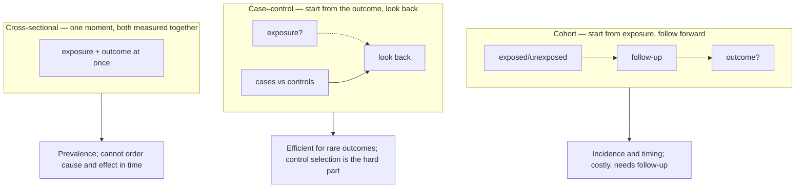
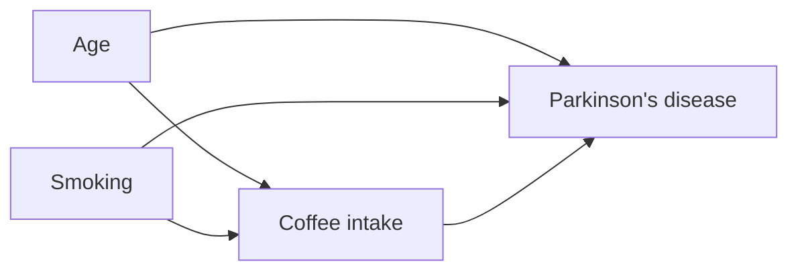
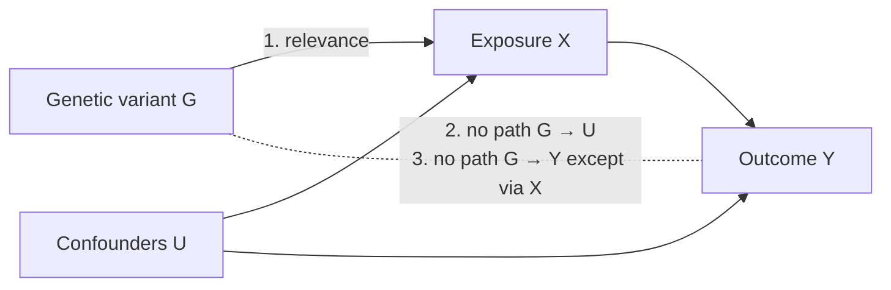
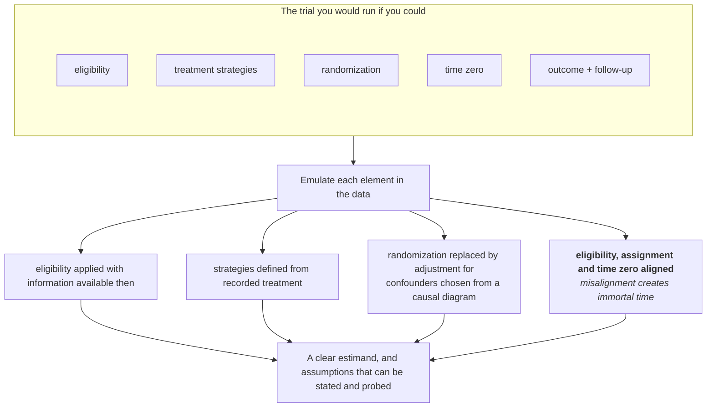
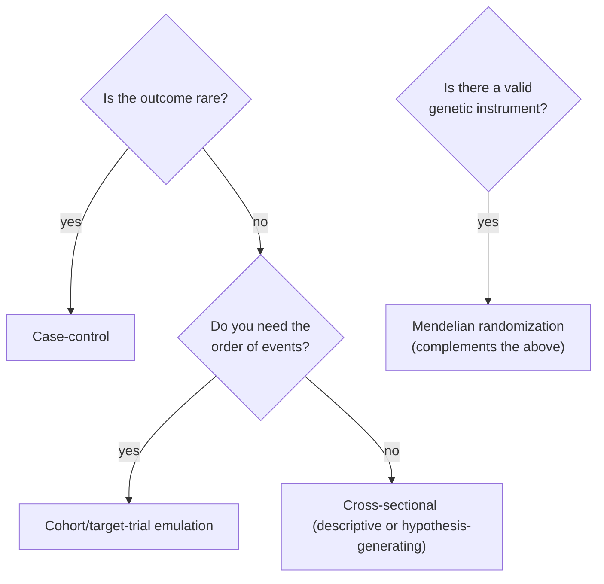
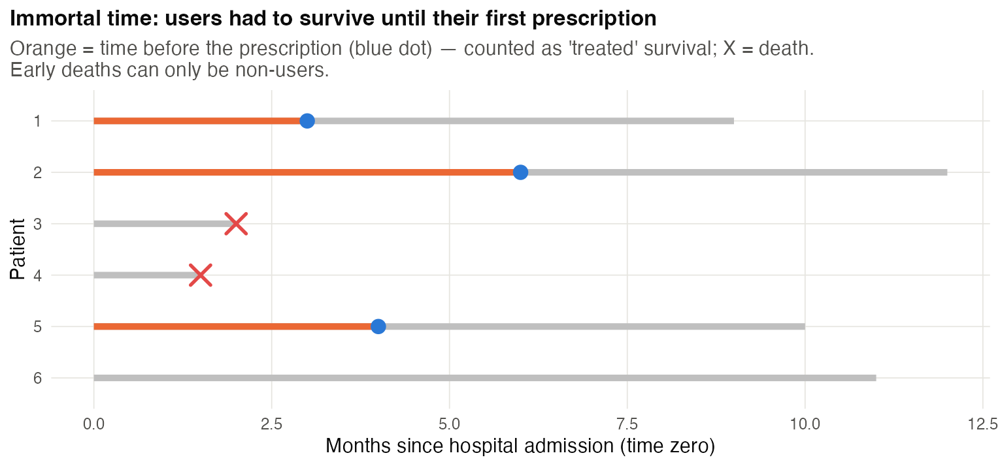
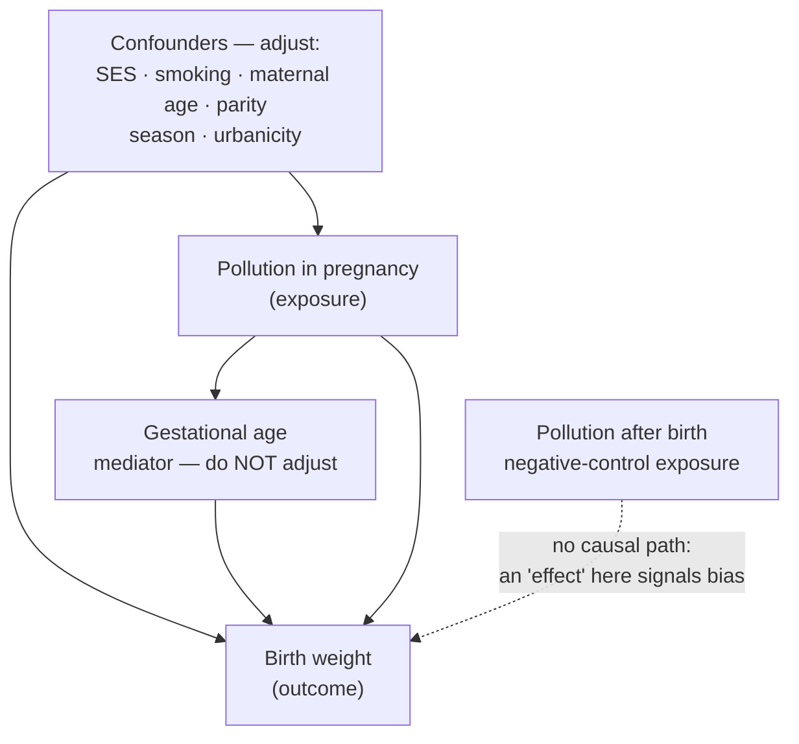
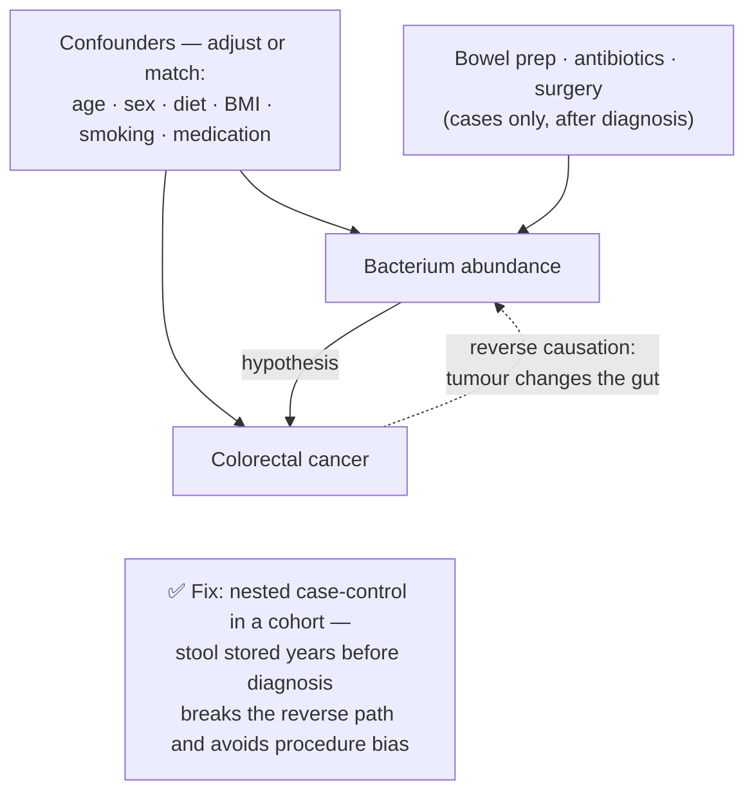
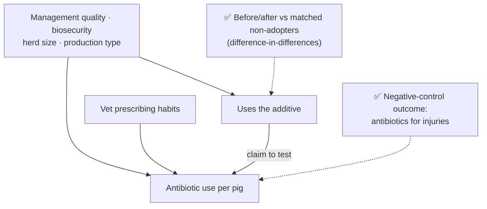
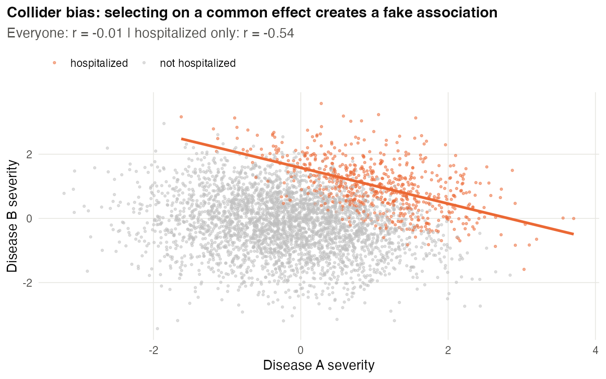

# Chapter 11 — Observational and Causal Designs (Q4)

> **Part III — Designs by Question Type**
> [← Chapter 10](10-comparative-and-mechanistic.md) · [Table of Contents](../README.md) · [Next: Chapter 12 — Predictive Studies →](12-predictive-studies.md)

---

🧬 <b>Biology primer</b> — GWAS and Mendelian randomization in one minute

- **GWAS (genome-wide association study):** test hundreds of thousands to millions of genetic variants (SNPs) for association with a trait across many individuals.
- **Population stratification:** groups with different ancestry differ in allele frequencies *and* (for non-genetic reasons) in trait values, creating false associations.
- **Mendelian randomization (MR):** uses genetic variants that influence an exposure (e.g. LDL cholesterol) as natural "instruments" to estimate the exposure's causal effect on an outcome (e.g. heart disease), because alleles are allocated at conception.

---

## 🧭 Learning Objectives

After this chapter you will be able to:

1. Choose among cross-sectional, cohort and case–control designs, and state each one's main bias.
2. Draw a simple causal diagram (DAG) and decide what to adjust for — and what not to.
3. Explain the design logic of GWAS: sample size, thresholds, stratification control and replication.
4. State the three core assumptions of Mendelian randomization and compute a Wald ratio.
5. Describe **target-trial emulation** as a design for causal questions in observational data.

---

## 🎯 The Big Picture

Many important questions cannot be answered by randomization: you cannot assign people
to smoke, assign genotypes, or assign twenty years of diet. Observational data can still
support causal conclusions — but only when the **design** substitutes for randomization
with explicit assumptions, including some that cannot be verified from the observed data [@hernan2016; @pearl2009].

> **The central threat:** *confounding* — a third factor causes both the exposure and the
> outcome. Others: selection bias (who ends up in the data), reverse causation, and
> measurement error.

See [📘 Biostat Ch. 35](https://github.com/MdRasheduz-zaman/biostatistics/blob/main/chapters/35-dags-simpsons.md)
and [📘 Ch. 36](https://github.com/MdRasheduz-zaman/biostatistics/blob/main/chapters/36-causal-tools.md)
for the statistical tools; here we focus on design choices.

---

## 🧠 Core Intuition

### Three classic observational designs

| Design | How it works | Strength | Main weakness |
|---|---|---|---|
| **Cross-sectional** | measure exposure and outcome at one time | fast, cheap | cannot order cause and effect |
| **Cohort** | follow exposed and unexposed forward in time | temporal order; several outcomes | slow, costly; loss to follow-up |
| **Case–control** | sample people with and without the outcome, look back at exposure | efficient for rare outcomes | recall bias; choosing comparable controls |

Report them with STROBE [@vonelm2007].

### Draw the DAG before collecting data

A **directed acyclic graph** lists your assumptions about what causes what. It tells you:

- which **confounders** to measure and adjust for (common causes);
- for a **total effect**, avoid adjusting for **mediators** (on the causal path),
  because that blocks part of the effect; estimating a direct effect needs a different
  target and extra assumptions;
- avoid conditioning on **colliders** (common effects), which can open a spurious path.

Age and smoking are confounders to measure. If you only collect data *after*
deciding, you may lack the variables you need.

### GWAS: design is mostly about size and structure

- Effects of common variants are small, and the genome-wide threshold is
  **5 × 10⁻⁸**, so well-powered studies of complex traits typically need tens to hundreds
  of thousands of people [@visscher2017; @sham2014; @spencer2009].
- **Population stratification** is controlled by design (matched ancestry) and by
  analysis (principal components, mixed models) [@price2006; @yang2014].
- Strict genotype and sample **QC** is part of the design [@marees2018].
- **Independent replication** cohorts are the primary safeguard.
- Ancestral **diversity** affects discovery and how well results transfer [@peterson2019].

### Mendelian randomization: a natural experiment

MR uses a genetic variant *G* as an instrument for exposure *X* [@daveysmith2003; @sanderson2022]:

1. **Relevance:** *G* is robustly associated with *X* (weak instruments bias the
   estimate; a common rule is F > 10) [@burgess2011].
2. **Independence:** *G* is not associated with confounders.
3. **Exclusion restriction:** *G* affects *Y* only through *X* (no horizontal pleiotropy).

Assumptions 2 and 3 cannot be fully tested, so MR studies use several instruments and
sensitivity analyses [@burgess2019] and report with STROBE-MR [@skrivankova2021].

### Target-trial emulation

To answer "does starting drug A versus drug B reduce mortality?" with health records:
write the **protocol of the trial you would run** (eligibility, treatment strategies,
assignment, *time zero*, follow-up, outcome, analysis), then emulate each element with
the data [@hernan2016]. Aligning time zero for both groups prevents **immortal-time
bias**, a common, design-induced error.

---

## 👁️ Visual Intuition — choosing a design

---

## 🔬 Worked Example — a Mendelian randomization (Wald) ratio

A variant raises LDL cholesterol by **0.10 mmol/L per allele** (SE 0.005) and raises the
log-odds of coronary heart disease by **0.05 per allele** (SE 0.012), in separate GWAS.

1. **Instrument strength:** F ≈ (0.10/0.005)² = **400** — a strong instrument.
2. **Wald ratio:** causal effect = 0.05/0.10 = **0.5 log-odds per 1 mmol/L LDL**.
3. **Odds ratio:** e^0.5 ≈ **1.65** per 1 mmol/L higher LDL.
4. **Uncertainty (first-order):** SE ≈ 0.012/0.10 = 0.12 → 95% CI for the OR ≈
   **1.30 to 2.09**.
5. **Design caveats:** valid only if the variant affects heart disease *only through*
   LDL. With many variants, use pleiotropy-robust methods and check consistency.

(Code: `scripts/course/worked_examples.R`. Numbers are illustrative.)

---

## ⚠️ Common Misconceptions

| ❌ The misconception | ✅ What is actually true — and what to do |
|---|---|
| **"Adjust for everything available."** | For a total effect, adjusting for mediators removes part of the effect; conditioning on colliders can create bias. Choose adjustments for the estimand with a DAG. |
| **"A huge biobank removes bias."** | Size reduces random error, not confounding or selection. |
| **"GWAS hits are causal genes."** | They are associated loci. The causal variant and gene need fine-mapping and functional work (Q3). |
| **"MR is as good as an RCT."** | Only if its assumptions hold, and pleiotropy is common. |
| **"Correlation in observational data is useless."** | It can generate and, with good design, test causal hypotheses. |

---

## 🧪 Spot the Flaw

> "Using hospital records, we compared patients who received statins during their
> hospital stay with those who did not. Statin users had 40% lower 1-year mortality.
> Exposure was defined as any statin prescription during follow-up."

▶ Diagnosis

**Immortal-time bias:** to be classified as a "statin user" a patient had to survive
long enough to receive a prescription. Early deaths fall automatically into the
non-user group. Also likely **confounding by indication and frailty** (very sick
patients are less likely to be started on preventive drugs). **Fix:** target-trial
emulation with a common time zero (e.g. admission), a defined grace period, and
adjustment for baseline confounders measured before time zero [@hernan2016].

---

## 🔎 The Reviewer's Perspective

- **"What is the causal question, and what trial would answer it?"**
- **"Is there a DAG, and do the adjustments follow from it?"**
- **"How were participants selected, and could selection depend on exposure and outcome?"**
- **"Is time zero aligned?"**
- **"For GWAS/MR: stratification control, instrument strength, pleiotropy analyses, replication?"**

---

## 🛠️ Design Challenges

Three causal questions that must be answered from observational data. For each, **draw
the DAG first** — then choose the design, the adjustment set and a bias check. The model
answers show the DAG.

### Challenge 1 · Environmental epidemiology · ⭐⭐ — pollution and birth weight

Question: does air pollution exposure during pregnancy reduce birth weight? Design an
observational study.

▶ A model design

- **Design:** prospective birth cohort (or registry-based cohort) with exposure
  estimated by residential address and pollution models per trimester.
- **DAG-based confounders:** socioeconomic status, maternal smoking, maternal age,
  parity, season of conception, urbanicity. Do **not** adjust for gestational age if it
  is a mediator of the effect on birth weight (or analyse it as a separate question).
- **Bias checks:** negative-control exposure (pollution *after* birth should not
  affect birth weight); sibling comparisons to control family-level confounding.
- **Size:** precision-based, enough to estimate a small effect (e.g. a few grams per
  10 µg/m³) with a narrow CI.
- **Report:** STROBE.

### Challenge 2 · Cancer microbiome · ⭐⭐ — a bacterium and colorectal cancer

A study wants to know whether a gut bacterium contributes to colorectal cancer. The draft
plan: collect stool from patients **after** diagnosis (many already had bowel preparation,
antibiotics or surgery) and from healthy blood donors as controls. Draw the DAG and
redesign.

▶ A model design

- **Reverse causation:** a tumour changes the gut environment (bleeding, mucus, obstruction),
  so the bacterium may be a *consequence* of cancer. Stool after diagnosis cannot tell the
  directions apart.
- **Procedure bias:** bowel preparation, antibiotics and surgery change the microbiome and
  are applied only to cases — sample **before** any procedure.
- **Wrong controls:** blood donors differ from patients in age, health and region.
- **Redesign:** a **case-control study nested in a prospective cohort** with stored stool:
  cases are those who later develop cancer, controls are cohort members matched on age,
  sex and sampling date; stool was collected years **before** diagnosis. Adjust for diet,
  BMI, smoking and medication; check whether the association holds when excluding cases
  diagnosed within 2 years of sampling (to reduce reverse causation).
- **Mechanism (Q3)** would still need experiments (Chapter 10).

### Challenge 3 · Animal health · ⭐⭐ — a feed additive and antibiotic use

Farm records show that pig farms using a commercial feed additive use **less antibiotic**
per pig. The supplier wants to claim that the additive reduces disease. No trial is
possible this year. Design the best observational analysis and say what it can claim.

▶ A model design

- **DAG:** farms that buy the additive may also be better managed (biosecurity, vaccination,
  vet advice, newer buildings) — **confounding by management**. Herd size and production
  type affect both. Prescribing habits of the farm vet affect antibiotic use directly.
- **Design:** cohort of farms with data from **before and after** adoption; compare change in
  antibiotic use in adopting farms with change in similar non-adopting farms (a
  difference-in-differences design), matched or weighted on pre-adoption use, herd size,
  production type, biosecurity score and vet practice.
- **Negative-control outcome:** an outcome the additive cannot plausibly affect (e.g.
  antibiotic use for lameness from injuries). If adopters also "improve" there, residual
  confounding is likely.
- **Claim:** at best "adoption was associated with a reduction of X, robust to measured
  confounding" — a randomized trial (farms or pens randomized, blinded feed) is the
  confirmation.

---

## ✅ Check Your Understanding

**⭐ Q1.** Name the three classic observational designs and one weakness of each.

**⭐ Q2.** What are the three core assumptions of Mendelian randomization?

**⭐⭐ Q3.** Why shouldn't you adjust for a collider? Give a biological example.

**⭐⭐ Q4.** A SNP raises BMI by 0.2 units per allele and raises the log-odds of type 2
diabetes by 0.06 per allele. Compute the Wald ratio and the OR per BMI unit.

**⭐⭐⭐ Q5.** Explain immortal-time bias and how target-trial emulation prevents it.

---

## 📝 Sample Answers & Assessment

▶ Show sample answers

> **Q1 — Sample answer:** *"Cross-sectional (no time order), cohort (slow), case–control
(recall bias)."* — **✔ 10/10.**

> **Q2 — Sample answer:** *"Relevance, independence, exclusion restriction."* —
**✔ 10/10.** Be ready to explain each in one sentence.

> **Q3 — Sample answer:** *"It creates a fake association."* — **◑ 6/10.** Explain the
mechanism and give an example: among hospitalized patients (hospitalization is caused
by both disease A and disease B), A and B can appear negatively associated even if
they are independent in the population. Conditioning on the common effect opens a
spurious path.

> **Q4 — Sample answer:** *"0.06/0.2 = 0.3, OR = e^0.3 ≈ 1.35 per BMI unit."* —
**✔ 10/10.** Mention the assumptions under which this is causal.

> **Q5 — Sample answer:** *"Patients must survive until treatment to be called treated.
Emulation fixes time zero."* — **✔ 9/10.** Add: emulation defines eligibility, treatment
assignment and follow-up start at the same moment for all groups, as in a real trial.

**Rubric:** causal-design answers need the *bias mechanism* and the *design* that
removes it.

---

## 🧾 Chapter Summary

| Concept | One-line takeaway |
|---|---|
| **Designs** | Cross-sectional, cohort, case–control — choose by rarity and need for time order. |
| **DAGs** | Decide adjustments before data collection; avoid mediators and colliders. |
| **GWAS** | Large *n*, strict threshold, stratification control, replication, diversity. |
| **MR** | Natural experiment with three assumptions; use sensitivity analyses. |
| **Target trial** | Specify the trial you'd run; align time zero. |

**Traps to remember:** adjust-for-everything · immortal time · size ≠ unbiasedness ·
GWAS hit ≠ causal gene.

### 📇 Design Card — add these rows (Q4)

| Field | Your answer |
|---|---|
| Causal question and target trial | |
| DAG: confounders to measure/variables not to adjust | |
| Selection and time-zero definition | |
| Replication or negative-control strategy | |

---

## 🔗 Go Deeper

- 📘 Biostat course: [Ch. 15 — Correlation, Causation, and Confounding](https://github.com/MdRasheduz-zaman/biostatistics/blob/main/chapters/15-correlation-causation.md) · [Ch. 35 — Confounding, DAGs & Simpson's Paradox](https://github.com/MdRasheduz-zaman/biostatistics/blob/main/chapters/35-dags-simpsons.md) · [Ch. 36 — Causal Inference Tools & Population Structure](https://github.com/MdRasheduz-zaman/biostatistics/blob/main/chapters/36-causal-tools.md)
- Further: [@uffelmann2021; @brion2013]

<!-- REFS -->

---

[← Chapter 10](10-comparative-and-mechanistic.md) · [Table of Contents](../README.md) · [Next: Chapter 12 — Predictive Studies →](12-predictive-studies.md)
