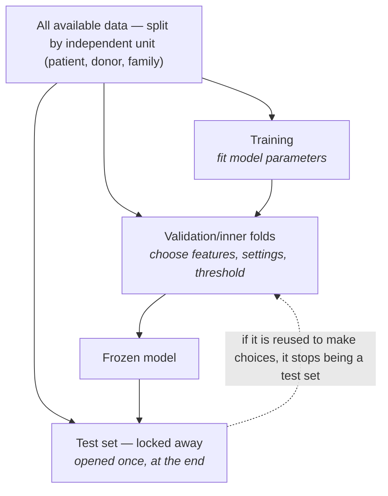
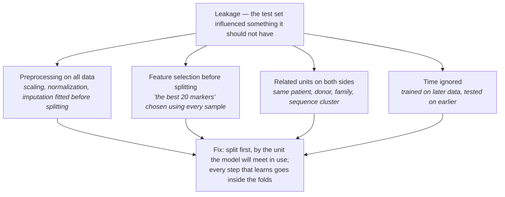
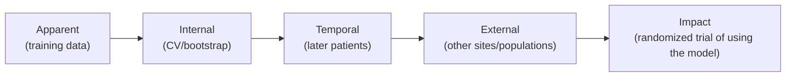
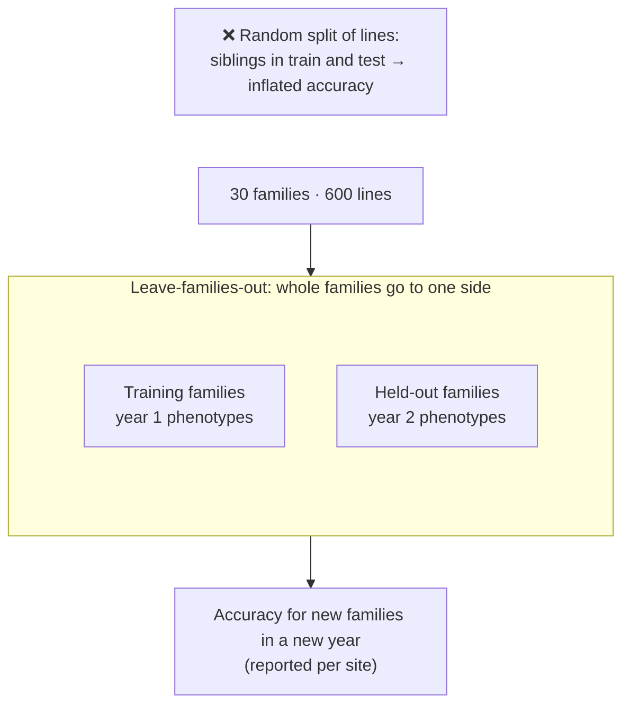
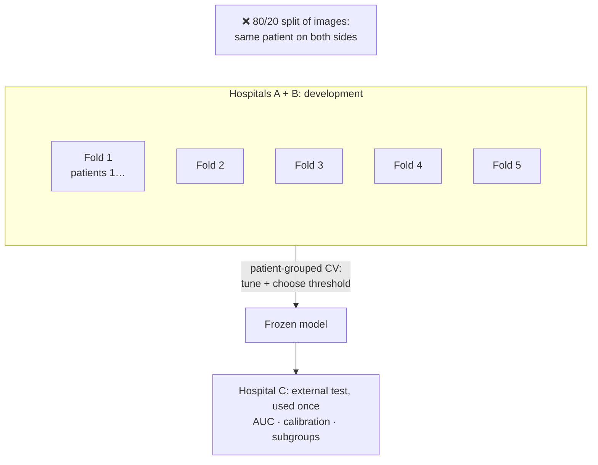
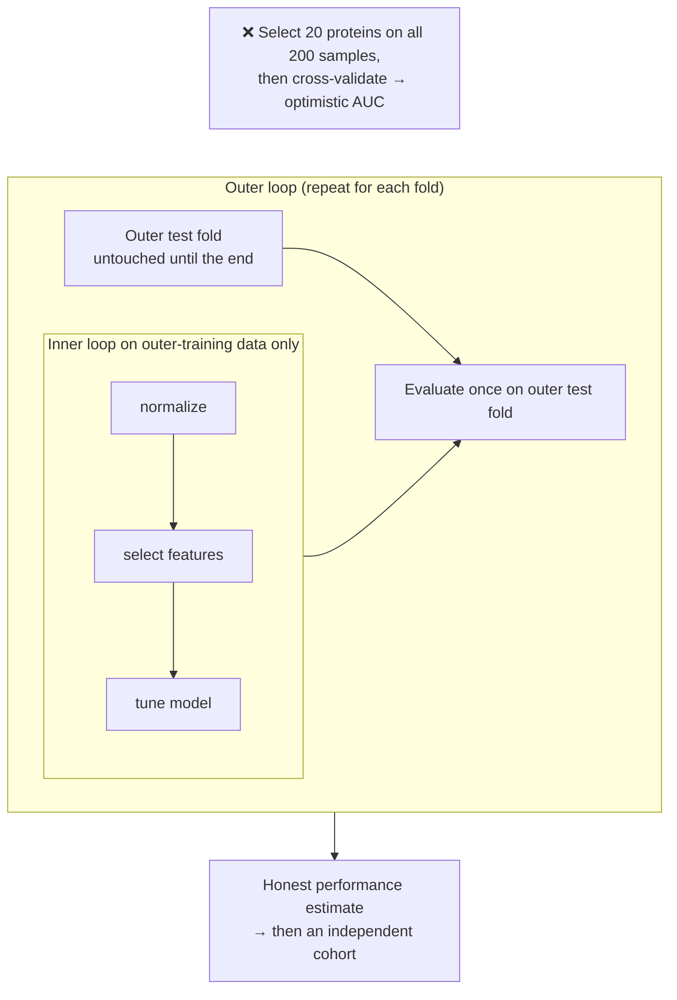

# Chapter 12 — Predictive Studies and Data Splits (Q5)

> **Part III — Designs by Question Type**
> [← Chapter 11](11-observational-and-causal.md) · [Table of Contents](../README.md) · [Next: Chapter 13 — Optimization →](13-optimization-doe.md)

---

## 🧭 Learning Objectives

After this chapter you will be able to:

1. Treat the **train/validation/test split** as an experimental design.
2. Identify four common forms of **data leakage** and prevent them by design.
3. Choose between random, grouped, temporal and external validation.
4. Plan the sample size of a prediction study.
5. Keep predictive claims separate from causal ones.

---

## 🎯 The Big Picture

Predictive questions — *can we predict Y for new cases?* — underlie diagnostic tests,
prognostic scores, genomic prediction of breeding values and machine-learning
classifiers. They don't need causality. They do need **generalization**: performance
must hold for cases the model has never seen, from the setting where it will be used.

In prediction, **the split is the design**. The way you divide data into training,
tuning and test sets plays the role that randomization and replication play in
experiments. Get it wrong and the reported accuracy measures memory, not prediction.
Leakage errors have affected hundreds of papers across many fields [@kapoor2023].

Statistical background: [📘 Biostat Ch. 21–25](https://github.com/MdRasheduz-zaman/biostatistics/blob/main/chapters/22-cross-validation.md)
(overfitting, cross-validation, leakage, evaluation, calibration).

---

## 🧠 Core Intuition

### Three roles for data

| Set | Used for | Rule |
|---|---|---|
| **Training** | fitting model parameters | — |
| **Validation (tuning)** | choosing features, hyperparameters, thresholds | must be separate from test |
| **Test** | estimating performance on new cases | **touched once**, at the end |

Cross-validation re-uses data for training and validation. **Every** data-dependent
step — normalization fitted on data, feature selection, imputation, tuning — must happen
**inside** each training fold. When tuning a model and estimating its performance
using CV, use **nested cross-validation**: inner folds select settings; outer held-out
folds evaluate the entire selected pipeline [@varma2006]. Nested CV does not repair
preprocessing that already used the outer test data.



### Four common leakage designs

1. **Preprocessing or feature selection on the full dataset** before splitting.
2. **Non-independent units split at random:** several samples per patient, related
   individuals, homologous proteins, adjacent genomic windows, image tiles from one
   slide [@whalen2022]. Split **by group**.
3. **Batch or site confounded with label:** the model learns the scanner, hospital or
   processing date (Chapter 5) [@hu2023].
4. **Temporal leakage:** training on the future to predict the past. Clinical models
   must be validated forward in time.



### Levels of validation



Each step to the right is a stronger claim and needs data the model has not seen.

### Prediction sample size

How many samples a model needs depends on the number of candidate predictors, the
outcome prevalence and the expected performance — not the old "10 events per
variable" rule [@vansmeden2019]. Small samples with many features invite overfitting,
and their cross-validated estimates are themselves unstable [@vabalas2019].

---

## 👁️ Visual Intuition — grouped splitting


---

## 🔬 Worked Example — leakage creates accuracy from pure noise

We simulated **40 samples (20 per class) with 2,000 features of pure random noise**:
there is nothing to predict, so honest accuracy should be about 50%.

- **Leaky design:** choose the 20 features most different between classes using **all
  40 samples**, *then* run 5-fold cross-validation of a nearest-centroid classifier.
- **Correct design:** repeat the feature selection **inside each training fold**.

| Design | Mean cross-validated accuracy (50 noise datasets) |
|---|---|
| Leaky (selection before CV) | **96.7%** |
| Correct (selection inside CV) | **46.9%** |

The leaky analysis "discovers" a near-perfect classifier in random numbers, because the
test samples helped choose the features. (Code: `scripts/course/worked_examples.R`.)


```r
for (fold in 1:5) {
  train <- folds != fold
  feats <- select_top_features(X[train, ], y[train])   # inside the fold
  model <- fit(X[train, feats], y[train])
  acc[fold] <- mean(predict(model, X[!train, feats]) == y[!train])
}
```

---

## ⚠️ Common Misconceptions

| ❌ The misconception | ✅ What is actually true — and what to do |
|---|---|
| **"Cross-validation protects against overfitting automatically."** | Only if *every* data-dependent step is inside the folds. |
| **"High accuracy on a held-out test set means it will work in the clinic."** | Only if the test set resembles the deployment setting (site, time, population). |
| **"Feature importance = biology."** | Predictive importance is not causal effect (Chapter 2). |
| **"Accuracy is enough."** | Report discrimination (AUC), calibration and clinically relevant thresholds [@collins2024]. |
| **"More features help."** | With small *n*, more features mostly add ways to overfit. |

---

## 🧪 Spot the Flaw

> "We collected 3 biopsies from each of 50 patients (150 images, 20,000 tiles). Tiles
> were randomly split 80/20 into training and test sets. A deep network achieved 98%
> tile-level accuracy for distinguishing cancer from benign tissue."

<details>
<summary>▶ Diagnosis</summary>

Tiles from the **same patient and same slide** appear in both training and test sets,
so the model can recognize patient- or slide-specific staining, scanner and tissue
features. The estimate measures recognition, not generalization. **Fix:** split by
patient (grouped CV), keep a test set from **different patients**, ideally from another
hospital/scanner; report patient-level performance with CIs; follow TRIPOD+AI.
</details>

---

## 🔎 The Reviewer's Perspective

- **"What is the unit of independence, and was the split made at that level?"**
- **"Were all preprocessing and selection steps inside the training folds?"**
- **"Was the test set locked before modelling began?"**
- **"Is there temporal or external validation?"**
- **"Are calibration and uncertainty reported?"** (DOME, TRIPOD+AI) [@walsh2021; @collins2024]

---

## 🛠️ Design Challenges

Three prediction (Q5) problems. For each, ask: **how will the model be used?** The
validation must mimic that use, and no information from the test data may leak into
training. The model answers show the split as a diagram.

### Challenge 1 · Plant breeding · ⭐⭐ — genomic prediction for new families

You want to predict drought tolerance of wheat lines from genotype (genomic prediction).
You have 600 lines from 30 families, phenotyped in 2 years at 3 sites. The model will be
used to select **new families** in **future years**. Design the validation.

<details>
<summary>▶ A model design</summary>

- **Split by family** (leave-families-out CV), because the use case is new families;
  random line splits overestimate accuracy when relatives sit in both sets
  [@daetwyler2013; @runcie2019].
- **Forward validation in time:** train on year 1, test on year 2 (and vice versa only
  as a secondary analysis).
- **Site:** report accuracy per site; consider leave-one-site-out if new environments
  are a target.
- **Phenotypes:** use BLUEs/BLUPs from the field design (Chapter 19) as training targets.
- Fix the model and hyperparameters on training folds only.


</details>

### Challenge 2 · Medical imaging · ⭐⭐ — pneumonia from chest X-rays

You have 20,000 chest X-rays from 8,000 patients at 3 hospitals (many patients have several
images). You want a model that detects pneumonia and will be **deployed at other
hospitals**. Your colleague plans an 80/20 random split of images. Redesign the validation.

<details>
<summary>▶ A model design</summary>

- **Split by patient, not by image:** images of the same patient are near-duplicates;
  if they fall on both sides, the model is rewarded for recognizing patients
  (patient-level leakage).
- **Hold out a whole hospital** as an **external test set** (leave-one-hospital-out):
  scanners, protocols, patient mix and even text markers on the image differ between
  hospitals, and the model must work at hospitals it has never seen.
- **Tune** (architecture, threshold, augmentation) only on the training hospitals, using
  patient-grouped cross-validation; touch the external test set **once**.
- **Report** discrimination (AUC) *and* calibration, sensitivity at a clinically chosen
  threshold, and performance in subgroups (age, sex, device); follow TRIPOD+AI.
- **Better still:** a prospective evaluation at a new hospital before clinical use.


</details>

### Challenge 3 · Proteomics · ⭐⭐⭐ — a biomarker classifier and batches

A plasma-proteomics study aims to build a classifier that separates early sepsis from
non-infectious inflammation (100 samples each). Samples were run in 4 MS batches, and
batches 1–2 contain mostly sepsis samples because those were collected first. The analyst
selected the 20 "best" proteins on **all 200 samples**, then cross-validated a classifier on
those 20 proteins: AUC = 0.97.

<details>
<summary>▶ A model design</summary>

- **Two leaks:** (1) **feature selection outside cross-validation** — the 20 proteins were
  chosen using the test folds too, so the AUC is optimistic even for pure noise (Chapter 12's
  worked example); (2) **batch–class confounding** — the classifier may be detecting the
  batch, not sepsis.
- **Fix the design:** re-run (or, for future studies, plan) the MS acquisition with **both
  classes balanced and randomized across batches** (Chapters 5 and 21).
- **Fix the analysis:** **nested cross-validation** — every step that learns from data
  (normalization parameters, feature selection, tuning) happens inside the inner loop on the
  training folds only; the outer loop estimates performance.
- **Check:** can the features predict *batch*? If batch is predictable and confounded with
  class, the result is uninterpretable.
- **Then:** validate the frozen panel in an independent cohort, measured later.


</details>

---

## ✅ Check Your Understanding

**⭐ Q1.** What are the roles of training, validation and test sets?

**⭐ Q2.** List four forms of leakage.

**⭐⭐ Q3.** Why does selecting features on the full dataset inflate cross-validated
accuracy even when the data are pure noise?

**⭐⭐ Q4.** You have repeated measurements from 80 patients. How should you split?

**⭐⭐⭐ Q5.** A sepsis model trained at Hospital A has AUC 0.92 internally and 0.71 at
Hospital B. Give three design-related explanations and what you would do next.

---

## 📝 Sample Answers & Assessment

<details>
<summary>▶ Show sample answers</summary>

> **Q1 — Sample answer:** *"Train to fit, validation to tune, test to evaluate once."* —
**✔ 10/10.**

> **Q2 — Sample answer:** *"Feature selection before split, duplicate patients, batch,
time."* — **✔ 10/10.**

> **Q3 — Sample answer:** *"Because the features were chosen with test samples."* —
**✔ 9/10.** Add: with 2,000 noise features, some will separate the classes by chance in
*these 40 samples*. Choosing them with all samples guarantees they also "work" on the
test folds — a chance pattern masquerading as signal.

> **Q4 — Sample answer:** *"80/20 split of measurements."* — **✘ 2/10.** Split by
**patient** (grouped CV), so no patient appears in both sets.

> **Q5 — Sample answer:** *"Different patients, different lab machines, different
coding of sepsis."* — **✔ 9/10.** Case-mix shift, measurement/assay differences, outcome
definition differences, and possible leakage or overfitting at A. Next: report the
external result honestly, recalibrate or retrain with multi-site data, and validate
prospectively.

**Rubric:** full credit names the *unit of independence* and the *deployment setting*.
</details>

---

## 🧾 Chapter Summary

| Concept | One-line takeaway |
|---|---|
| **Split = design** | Train/validate/test allocation determines what accuracy means. |
| **Leakage** | Any test information reaching training or selection. |
| **Grouped & temporal splits** | Split at the unit of independence; validate forward in time. |
| **External validation** | The test that matters for deployment. |
| **Sample size** | Plan for predictors, prevalence and expected performance. |

**Traps to remember:** selection before CV · tiles/reads/visits split randomly ·
site = label · accuracy without calibration.

### 📇 Design Card — add these rows (Q5)

| Field | Your answer |
|---|---|
| Deployment setting (who, where, when) | |
| Unit of independence and split strategy | |
| Steps inside training folds | |
| External/temporal validation data | |

---

## 🔗 Go Deeper

- 📘 Biostat course: [Ch. 21 — Bias–Variance](https://github.com/MdRasheduz-zaman/biostatistics/blob/main/chapters/21-bias-variance.md) · [Ch. 22 — Cross-Validation](https://github.com/MdRasheduz-zaman/biostatistics/blob/main/chapters/22-cross-validation.md) · [Ch. 23 — Data Leakage](https://github.com/MdRasheduz-zaman/biostatistics/blob/main/chapters/23-data-leakage.md) · [Ch. 24 — Evaluating Classifiers](https://github.com/MdRasheduz-zaman/biostatistics/blob/main/chapters/24-classifier-evaluation.md) · [Ch. 25 — Calibration](https://github.com/MdRasheduz-zaman/biostatistics/blob/main/chapters/25-calibration.md)
- Further: [@chicco2017; @heil2021; @simon2003]

<!-- REFS -->

---

[← Chapter 11](11-observational-and-causal.md) · [Table of Contents](../README.md) · [Next: Chapter 13 — Optimization →](13-optimization-doe.md)
