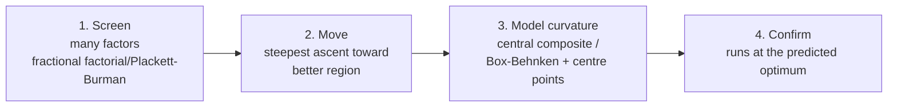
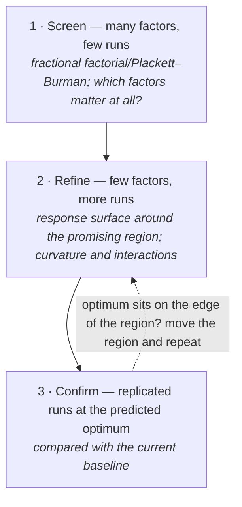
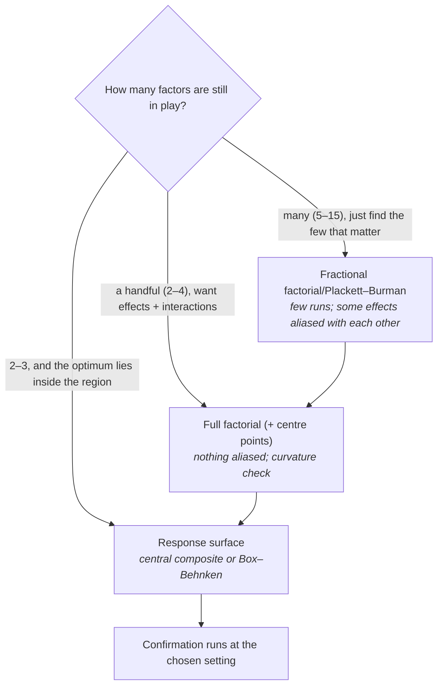
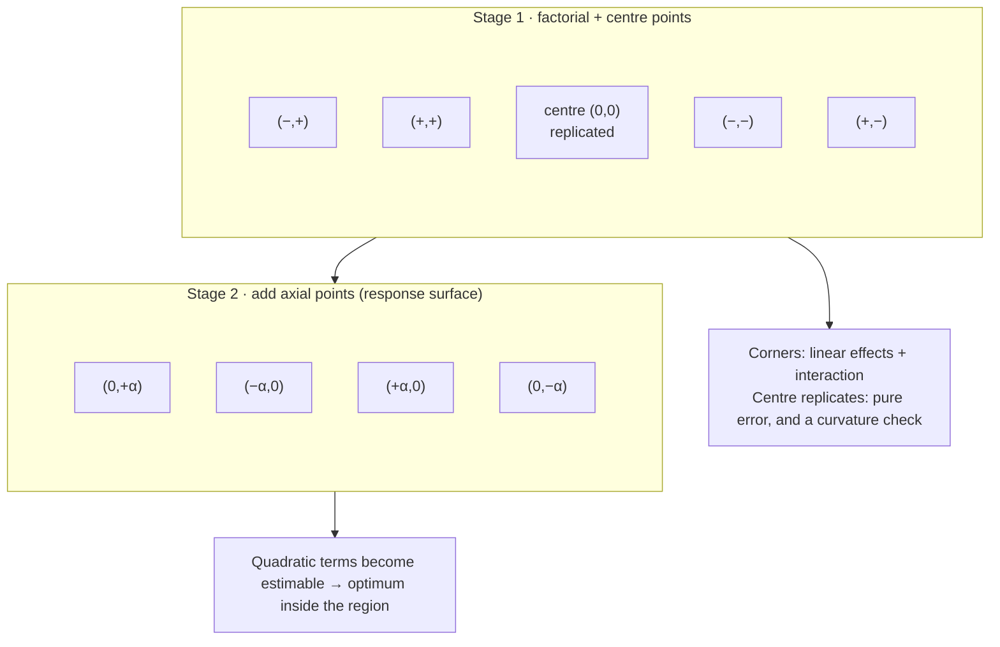
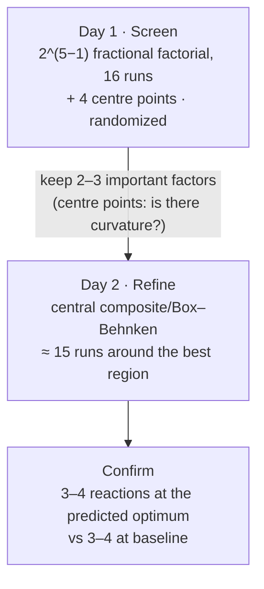
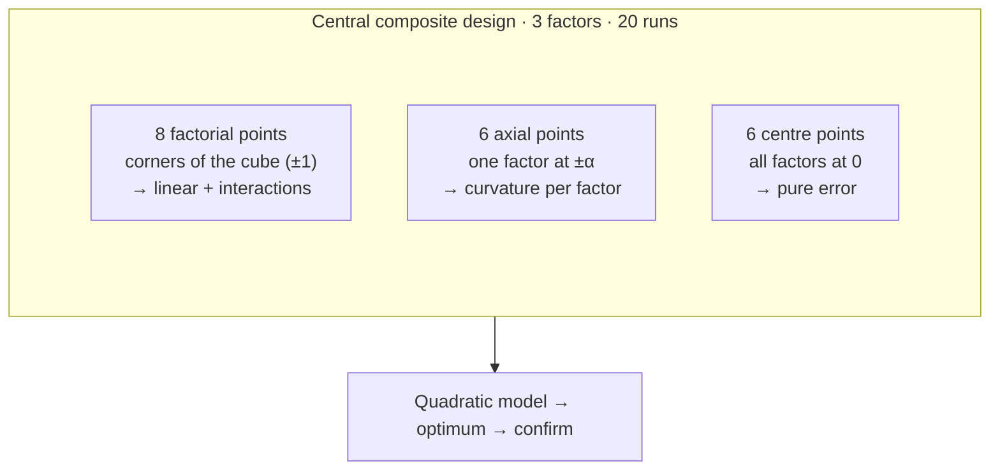
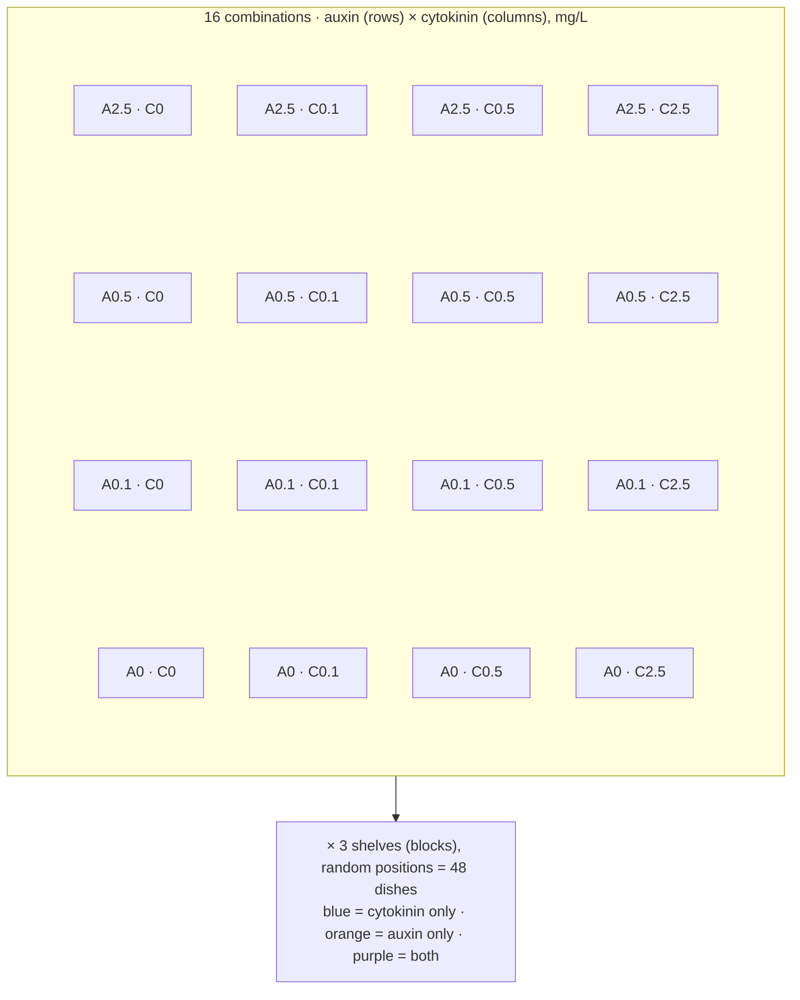

# Chapter 13 — Optimization: Design of Experiments and Response Surfaces (Q6)

> **Part III — Designs by Question Type**
> [← Chapter 12](12-predictive-studies.md) · [Table of Contents](../README.md) · [Next: Chapter 14 — Screening Designs →](14-screening-designs.md)

---

## 🧭 Learning Objectives

After this chapter you will be able to:

1. Explain the **sequential DoE strategy**: screen → move → model curvature → confirm.
2. Set up a **2^k factorial** in coded units and compute main effects and interactions.
3. Recognize when to use fractional factorial, Plackett–Burman, central composite and Box–Behnken designs.
4. Use centre points to estimate pure error and detect curvature.
5. Describe how model-guided (Bayesian) optimization extends classical DoE.

---

## 🎯 The Big Picture

Optimization questions — *which settings maximize yield, titre, purity, stability?* —
dominate biotechnology, bioprocess engineering, formulation science and assay
development. The naive approach is **one factor at a time** (OFAT): vary temperature,
fix it at the best value, then vary pH, and so on. OFAT needs many runs, misses
interactions, and can stop far from the true optimum when factors interact.

**Design of experiments (DoE)** varies several factors *together* in a planned pattern,
then fits a model of how the response depends on them [@boxwilson1951]. It consistently
outperforms OFAT in media and bioprocess optimization [@weusterbotz2000; @mandenius2008; @kumar2014].

---

## 🧠 Core Intuition

### Coded units

Each factor gets a low (−1) and high (+1) level, e.g. temperature 30 °C = −1 and
37 °C = +1. Coding puts all factors on the same scale, so effects are directly comparable.

### The sequential strategy

### Which design for which stage?

| Stage | Design | Runs for k factors | Estimates |
|---|---|---|---|
| Screening (many factors) | Plackett–Burman [@plackett1946]; 2^(k−p) fractional factorial | ~k + 1 to 2^(k−p) | main effects (interactions aliased) |
| Effects and interactions | full 2^k factorial | 2^k | all main effects and interactions |
| Curvature/optimum | central composite | factorial/fractional core + 2k axial runs + centre points | quadratic surface |
| Curvature/optimum | Box–Behnken (k ≥ 3) | standard 3-factor design: 12 + centre points; size depends on k | quadratic surface without all-extreme corners |
| Mixtures (components sum to 100%) | simplex/mixture designs | varies | blending effects |

### Centre points

Adding 3–5 runs at the centre (all factors at 0) gives an estimate of **pure error**
(replication) and a test for **curvature**: if the centre mean differs from the average
of the corner runs, a linear model is not enough.

### Several responses

Titre, purity and cost often pull in different directions. **Desirability functions**
convert each response to a 0–1 scale and combine them, so a compromise optimum can be
found [@candioti2014].

### Beyond classical DoE: model-guided optimization

When experiments are run in batches and the space is large (protein sequences, strain
designs), a model is trained on results so far and proposes the **next batch** — e.g.
Bayesian optimization or machine-learning-guided directed evolution [@yang2019; @ryan2016].
The design principles still apply: replicate controls in every batch, randomize run
order, and keep a hold-out set to check the model's predictions.

---

## 👁️ Visual Intuition — OFAT can miss the optimum

When factors interact, the ridge of the response surface runs diagonally, and OFAT
walks along the wrong axis.

---

## 🔬 Worked Example — a 2³ factorial for a fermentation

Factors: temperature (T), pH and glucose (G), each at two coded levels. Eight runs in
random order; response = product yield (mg/L).

| Run | T | pH | G | Yield |
|---|---|---|---|---|
| 1 | − | − | − | 52 |
| 2 | + | − | − | 60 |
| 3 | − | + | − | 54 |
| 4 | + | + | − | 70 |
| 5 | − | − | + | 50 |
| 6 | + | − | + | 62 |
| 7 | − | + | + | 56 |
| 8 | + | + | + | 80 |

**Main effect** = mean at + minus mean at −:

- **T:** (60 + 70 + 62 + 80)/4 − (52 + 54 + 50 + 56)/4 = 68 − 53 = **15**
- **pH:** (54 + 70 + 56 + 80)/4 − (52 + 60 + 50 + 62)/4 = 65 − 56 = **9**
- **G:** (50 + 62 + 56 + 80)/4 − (52 + 60 + 54 + 70)/4 = 62 − 59 = **3**

**Interaction T × pH:** the effect of T at high pH minus its effect at low pH, halved:
at pH +: (70 + 80)/2 − (54 + 56)/2 = 20; at pH −: (60 + 62)/2 − (52 + 50)/2 = 10;
interaction = (20 − 10)/2 = **5**. The other interactions are 3 (T×G), 3 (pH×G) and
1 (T×pH×G).

**Interpretation:** temperature dominates, pH matters, and they reinforce each other.
Glucose has little effect in this range. **Next step:** move toward higher T and pH
(steepest ascent), then run a central composite design there to model curvature, with
centre points for pure error. (Check in R: `2 * coef(lm(Yield ~ T * pH * G))` reproduces
these effects; script: `scripts/course/worked_examples.R`.)

*Note:* with one run per corner and no centre points, there is no estimate of pure
error. In practice add centre-point replicates, or treat the three-factor interaction as
error.

---

## ⚠️ Common Misconceptions

| ❌ The misconception | ✅ What is actually true — and what to do |
|---|---|
| **"OFAT is fine if I'm careful."** | Care cannot reveal interactions that OFAT never tests. |
| **"DoE needs too many runs."** | A 2^(7−4) fractional factorial screens 7 factors in 8 runs; OFAT needs more for less information. |
| **"Runs can be done in the standard order."** | Randomize run order to protect against drift in equipment, inoculum or raw materials. Block on raw-material lot if needed. |
| **"The model's optimum is the answer."** | Always **confirm** with new runs at the predicted optimum. |
| **"Fractional designs give everything."** | Main effects are *aliased* with some interactions. Choose the resolution deliberately. |

---

## 🧪 Spot the Flaw

> "We optimized six medium components by varying each one in turn while holding the
> others at their baseline values. The final medium (each component at its individually
> best level) increased titre by 40% over baseline in a single confirmation run."

▶ Diagnosis

OFAT ignores interactions: the individually best levels need not be jointly best. A
single confirmation run gives no estimate of variability, so "40%" may be noise. **Fix:**
a fractional factorial/Plackett–Burman screen of the six components, then a response
surface design on the important ones, with centre-point replicates, randomized run
order, and replicated confirmation runs compared with replicated baseline runs.

---

## 🔎 The Reviewer's Perspective

- **"Which design was used, with how many runs, in what order?"**
- **"Is there an estimate of pure error (replicates or centre points)?"**
- **"Were aliasing and model adequacy (lack of fit, curvature) checked?"**
- **"Was the predicted optimum confirmed with replicated runs?"**

---

## 🛠️ Design Challenges

Three optimization (Q6) problems. For each, decide the **stage** you are in (screening,
refining, confirming) before choosing a design — then open the model answer and its
diagram.

### Challenge 1 · Synthetic biology · ⭐⭐ — a cell-free expression reaction

You must optimize a cell-free protein-expression reaction with 5 factors (Mg²⁺, K⁺,
DNA concentration, temperature, incubation time). Budget: about 40 reactions over
2 days.

▶ A model design

- **Day 1 — screening:** 2^(5−1) resolution V fractional factorial (16 runs) + 4 centre
  points = 20 runs, randomized. Main effects and two-factor interactions are estimable.
  Day is a block if the work spans days.
- **Day 2 — refine:** keep the 2–3 important factors; run a central composite or
  Box–Behnken design around the best region (~15 runs, including centre points).
- **Confirm:** 3–4 replicate reactions at the predicted optimum vs 3–4 at the baseline.
- **Randomize** pipetting order and plate positions; prepare master mixes to reduce
  pipetting error.

### Challenge 2 · Industrial microbiology · ⭐⭐ — a growth medium in 20 runs

You want to maximize biomass of a bacterium as a function of three factors already known to
matter: glucose, yeast extract and pH. The response is probably curved (there is an optimum
inside the range). You have 20 shake flasks. Design the experiment.

▶ A model design

- **Central composite design (CCD)** in coded units: **8 factorial points** (the corners
  of the cube, ±1), **6 axial points** (one factor at ±α, others at 0) and **6 centre points**
  = 20 runs. It estimates all linear, quadratic and two-factor interaction terms.
- **Centre points** give pure error and a check on reproducibility; spread them through the
  run order, not all at the start.
- **Ranges:** set ±1 to a realistic window around current conditions; check that axial
  points (α ≈ 1.68 for a rotatable 3-factor CCD) are physically possible (e.g. pH stays in a
  range the organism tolerates); use a face-centred CCD (α = 1) if not.
- **Randomize** run order; if flasks are run on two days, split the design into two
  orthogonal blocks (the factorial points and the axial points, each block with its share of the centre points).
- **Then:** fit the quadratic model, find the stationary point, confirm with replicate flasks.

### Challenge 3 · Plant biotechnology · ⭐⭐ — regenerating shoots from tissue culture

Shoot regeneration from leaf explants depends on the **ratio** of two hormones, an auxin and
a cytokinin, with a strong interaction. Previous work found nothing with either hormone
alone. You have 48 Petri dishes and growth-chamber space for all of them. Design the
experiment.

▶ A model design

- **A two-factor full factorial grid** is the right tool when there are only two factors
  and a strong interaction is expected: **4 auxin levels × 4 cytokinin levels = 16
  combinations**, including 0 for each, on a log-like scale (e.g. 0, 0.1, 0.5, 2.5 mg/L).
- **Replication:** 3 dishes per combination = 48 dishes; the **dish** is the unit
  (explants within a dish share medium) — score the % of explants regenerating per dish.
- **Blocks:** 3 chamber shelves (light may differ) as blocks, each with one dish of every
  combination in random positions (a randomized complete block design).
- **Analysis:** regeneration ~ shelf + auxin × cytokinin (as factors or a response surface);
  look at the shape of the interaction, then refine around the best region.

---

## ✅ Check Your Understanding

**⭐ Q1.** List the four stages of the sequential DoE strategy.

**⭐ Q2.** What are centre points for?

**⭐⭐ Q3.** From the worked example, compute the main effect of glucose and explain what
it means.

**⭐⭐ Q4.** Why is OFAT especially misleading when factors interact?

**⭐⭐⭐ Q5.** A colleague wants to screen 11 factors affecting enzyme stability with
minimal runs. Propose a design, state what it cannot estimate, and describe the
follow-up.

---

## 📝 Sample Answers & Assessment

▶ Show sample answers

> **Q1 — Sample answer:** *"Screen, move, model curvature, confirm."* — **✔ 10/10.**

> **Q2 — Sample answer:** *"To check the middle."* — **◑ 5/10.** Be specific: replicated
centre points estimate **pure error** and test for **curvature** (centre mean vs corner
mean).

> **Q3 — Sample answer:** *"62 − 59 = 3; glucose increases yield a little."* —
**✔ 9/10.** And note: within this range the effect is small relative to T and pH. That
does not mean glucose doesn't matter outside the range.

> **Q4 — Sample answer:** *"Because the best level of one factor depends on the
other."* — **✔ 10/10.**

> **Q5 — Sample answer:** *"A Plackett–Burman design with 12 runs."* — **✔ 9/10.** Add
the limits: it estimates main effects only, with interactions partially aliased. Follow
up the important factors with a full or higher-resolution factorial and then a response
surface; add centre points or replicates for error.

**Rubric:** name the design, its run count, what is aliased, and the next step.

---

## 🧾 Chapter Summary

| Concept | One-line takeaway |
|---|---|
| **DoE vs OFAT** | Vary factors together; estimate interactions; fewer runs. |
| **Sequential** | Screen → move → model curvature → confirm. |
| **Designs** | Plackett–Burman/fractional for screening; CCD/Box–Behnken for optima. |
| **Centre points** | Pure error and curvature. |
| **Model-guided** | Bayesian/ML optimization proposes next batches; principles still apply. |

**Traps to remember:** OFAT · unrandomized run order · no replicates · unconfirmed
optimum · ignored aliasing.

### 📇 Design Card — add these rows (Q6)

| Field | Your answer |
|---|---|
| Factors and ranges (coded −1/+1) | |
| Responses (and desirability weights) | |
| Design per stage and run count | |
| Confirmation plan | |

---

## 🔗 Go Deeper

- 📘 Biostat course: [Ch. 16 — Linear Regression](https://github.com/MdRasheduz-zaman/biostatistics/blob/main/chapters/16-linear-regression.md)
- Applications in pharmacy and bioengineering: [@politis2017; @keskin2016; @yu2014]

<!-- REFS -->

---

[← Chapter 12](12-predictive-studies.md) · [Table of Contents](../README.md) · [Next: Chapter 14 — Screening Designs →](14-screening-designs.md)
