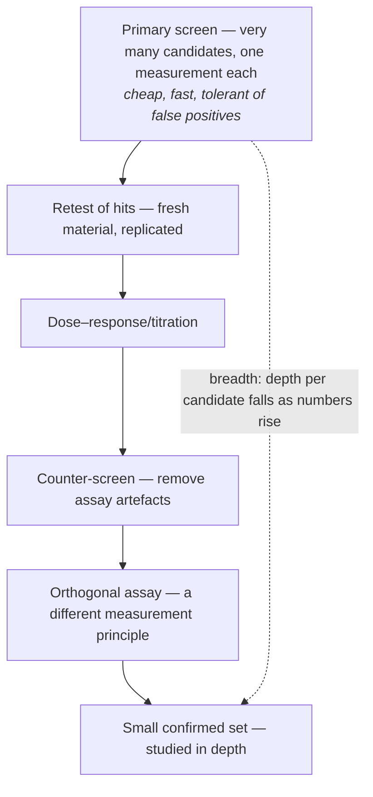
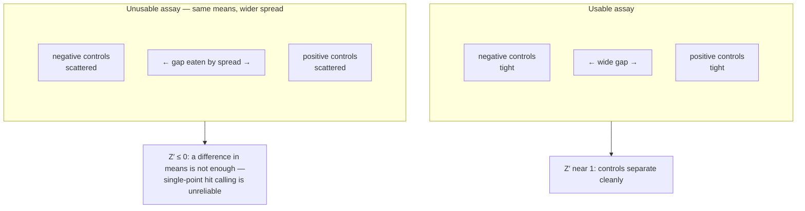
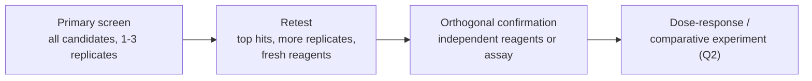
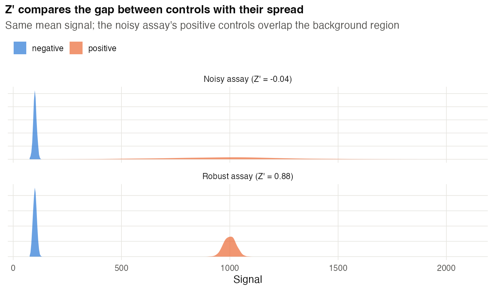
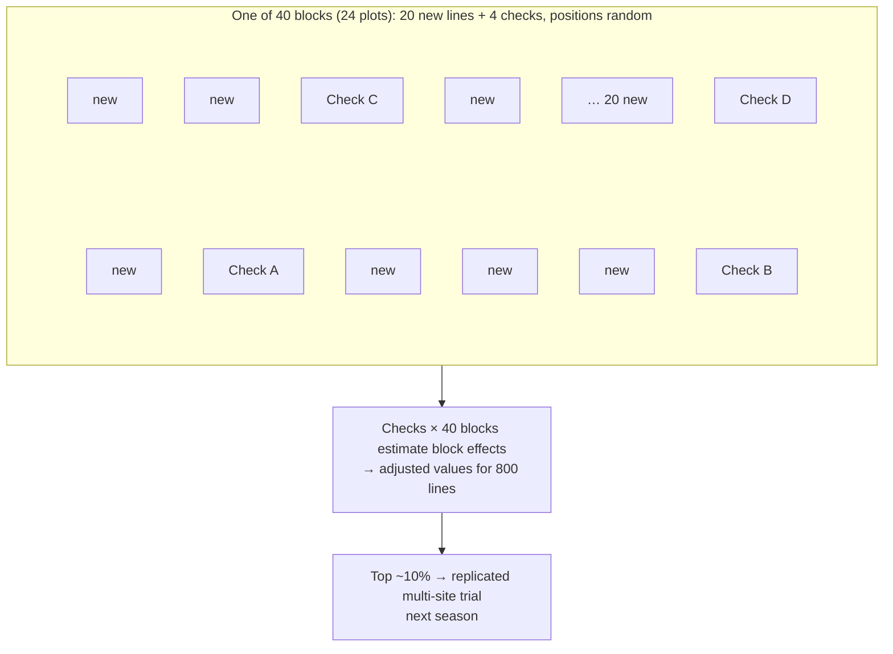
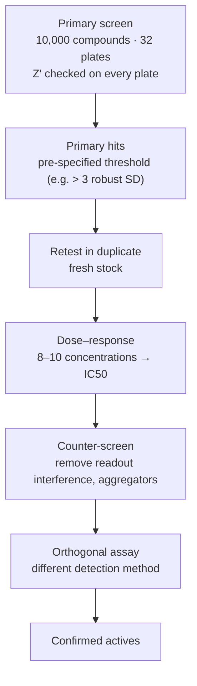
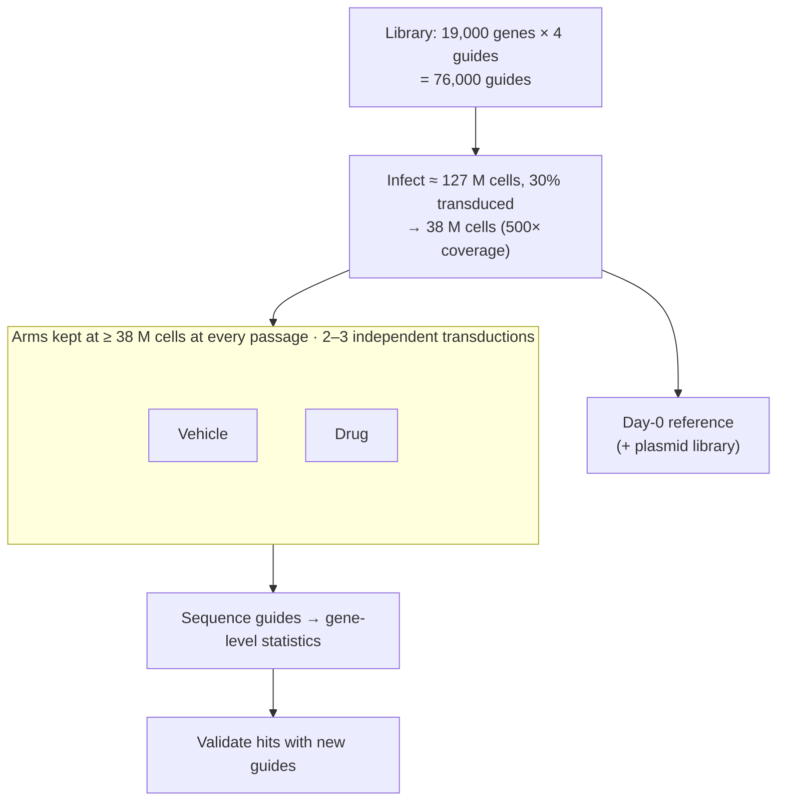

# Chapter 14 — Screening Designs (Q7)

> **Part III — Designs by Question Type**
> [← Chapter 13](13-optimization-doe.md) · [Table of Contents](../README.md) · [Next: Chapter 15 — Measurement and Benchmarking →](15-measurement-and-benchmarking.md)

---

## 🧭 Learning Objectives

After this chapter you will be able to:

1. Explain the screening trade-off: **breadth versus replication per candidate**.
2. Compute and interpret the **Z′ factor** for assay quality.
3. Design plate layouts and controls that defend against positional artefacts.
4. Plan the coverage and replication of a pooled CRISPR screen.
5. Design a **staged confirmation** pipeline with error control.

---

## 🎯 The Big Picture

Screening questions — *which of many candidates matter?* — appear as compound screens,
siRNA and CRISPR screens, mutant libraries, variety trials of hundreds of breeding lines,
and factor-screening experiments in process development. They share one structure:

> **Test many candidates cheaply, accept that most results are noise, and design a
> pipeline that filters true hits from false ones.**

A screen's output is a ranked list of **hypotheses**, not findings. Its design must
control two things: the **quality of each measurement** (assay robustness, plate
effects) and the **error rate across thousands of tests** [@malo2006; @birmingham2009].

---

## 🧠 Core Intuition

### The breadth–depth trade-off

With fixed resources, testing more candidates means fewer replicates each. Primary
screens usually favour breadth (1–3 replicates), then concentrate replication on the
much smaller set of hits.



### Assay quality: the Z′ factor

$$Z' = 1 - \frac{3(\sigma_{+} + \sigma_{-})}{|\mu_{+} - \mu_{-}|}$$

It measures how well positive and negative controls separate relative to their
spread [@zhang1999].

| Z′ | Interpretation |
|---|---|
| ≥ 0.5 | excellent assay for screening |
| 0 – 0.5 | marginal; many false hits/misses |
| < 0 | controls overlap; not usable for screening |



### Plates are blocks with geography

Edge wells evaporate; dispensers drift across rows; incubators have warm spots. Defences:
controls **distributed across every plate**, randomized or balanced compound positions,
replicate plates with different layouts, and plate-wise normalization [@malo2006].

### Multiplicity is built in

Test 20,000 genes at *p* < 0.05 with no true effects and you expect **1,000 false
hits**. Control the false discovery rate (FDR) and plan confirmation
[@bh1995; @storey2003] (see [📘 Biostat Ch. 26–28](https://github.com/MdRasheduz-zaman/biostatistics/blob/main/chapters/28-fdr.md)).

### Pooled CRISPR screens: extra design parameters

Library size, guides per gene, **coverage** (cells per guide) at transduction and at every
passage, multiplicity of infection, sequencing depth, biological replicates, and
positive/negative control guides [@shalem2014; @hart2015; @doench2018]. Analysis tools
assume these features [@li2014mageck]. High-content screens (e.g. Perturb-seq) add
single-cell design issues [@dixit2016; @bock2022].

### Staged confirmation



---

## 👁️ Visual Intuition — a robust plate layout

```
     1   2   3   4   5   6   7   8   9  10  11  12
A  [buffer ring — not used for samples]
B  b  N  x  x  x  x  x  x  x  x  P  b
C  b  P  x  x  x  x  x  x  x  x  N  b
…  (x = test compounds in randomized positions; N/P alternate sides and rows)
G  b  N  x  x  x  x  x  x  x  x  P  b
H  [buffer ring]
```

Controls in both edge-adjacent columns and on several rows let you detect and correct
gradients.

---

## 🔬 Worked Example 1 — Z′ for two assay versions

Six positive- and six negative-control wells (signal units):

| | Mean | SD |
|---|---|---|
| Positive (version 1) | 1000 | 28.3 |
| Negative | 100 | 8.0 |

Z′ = 1 − 3 × (28.3 + 8.0)/(1000 − 100) = **0.88** → excellent.

A noisier version 2 has positive controls with mean 966.7 and SD 292.7:
Z′ = 1 − 3 × (292.7 + 8.0)/866.7 = **−0.04** → unusable, *even though the mean signal is
almost unchanged*. Optimize the assay (Chapter 13) before screening.




## 🔬 Worked Example 2 — CRISPR library coverage

A genome-wide library of **80,000 guides**, target coverage **500 cells per guide**:

- Cells needed *carrying* guides: 80,000 × 500 = **40 million**.
- Transduce at a low multiplicity of infection, targeting ~30% transduced cells, so that
  most transduced cells carry a single guide → transduce about 40 M/0.3 ≈ **133 million cells**.
- Maintain ≥ 40 million cells at **every passage** and harvest; otherwise guides drop out
  randomly (bottlenecks) and masquerade as depletion hits.
- Run **≥ 2 independent biological replicates** (separate transductions).

(Code: `scripts/course/worked_examples.R`.)

---

## ⚠️ Common Misconceptions

| ❌ The misconception | ✅ What is actually true — and what to do |
|---|---|
| **"The top-ranked hit is the most important gene."** | Rankings from noisy data are unstable. Confirm before ranking claims. |
| **"Single-replicate screens are fine because we have so many genes."** | Many genes do not replicate the *same* gene. Hits need replication. |
| **"Z′ is only for drug companies."** | Any plate-based assay benefits from it. |
| **"Losing cells between passages doesn't matter."** | It creates random dropouts that look like biology. |
| **"A hit confirmed with the same reagent is confirmed."** | Confirmation needs fresh and, ideally, independent reagents. |

---

## 🧪 Spot the Flaw

> "We screened 1,280 compounds in singlicate on four 384-well plates. Negative controls
> occupied column 1 and positive controls column 24 of each plate. Compounds with
> > 50% inhibition (n = 61) were reported as hits."

<details>
<summary>▶ Diagnosis</summary>

- **Controls confined to edge columns** cannot reveal or correct within-plate
  gradients, and edge effects may differ from the interior.
- **No Z′ reported** and **no replicate measurement**, so it is unknown how many hits
  are noise.
- An arbitrary 50% cutoff without error control.
- **Fix:** distribute controls across rows and columns; report Z′ per plate; normalize
  plate-wise; retest hits in replicate with fresh compound; confirm with dose–response
  and an orthogonal assay.
</details>

---

## 🔎 The Reviewer's Perspective

- **"What is Z′ (per plate), and where were controls placed?"**
- **"How were hits defined, and what error rate does that imply?"**
- **"Coverage and replicates in pooled screens?"**
- **"Were hits confirmed with independent reagents and an orthogonal assay?"**

---

## 🛠️ Design Challenges

Three screens from different fields. For each, decide what the **primary screen** must
do (cheaply rank many candidates) and how **confirmation** will remove false positives —
then open the model answer and its diagram.

### Challenge 1 · Plant breeding · ⭐⭐ — 800 lines, one plot each

A breeding programme must screen **800 new rice lines** for drought tolerance, but has
seed for only **one plot per line**, plus plenty of seed of **4 check varieties**. Field
heterogeneity is substantial. Design the screen.

<details>
<summary>▶ A model design</summary>

- **Augmented design:** divide the field into, e.g., 40 blocks of 24 plots; each block
  holds 20 new lines (unreplicated) + the 4 checks (randomized positions). Checks are
  replicated 40 times, so they estimate error and the block effects that adjust the
  new lines' values.
- **Better still:** a **partially replicated (p-rep) design**, replicating ~20% of the new
  lines as well, with spatial analysis [@cullis2006; @gilmour1997].
- **Selection:** select the top ~10% on adjusted values, then test them in a
  **replicated, multi-site trial** next season (staged confirmation).
- Phenotype blind to line identity where possible.


</details>

### Challenge 2 · Drug discovery · ⭐⭐ — 10,000 compounds

You will screen a library of **10,000 compounds** at one concentration for inhibition of an
enzyme in 384-well plates. Each plate holds 320 compounds plus 64 control wells. Your assay
pilot gave Z′ = 0.6. Plan the screen from primary hits to confirmed actives.

<details>
<summary>▶ A model design</summary>

- **Plates:** 10,000/320 = 31.25 → **32 plates**. Spread the 64 controls (32 positive,
  32 negative) across the plate — not only in edge columns — to detect gradients and edge
  effects; run a DMSO-only plate to check for plate patterns.
- **Per-plate QC:** compute Z′ for every plate (Chapter 14); repeat plates with Z′ < 0.5.
- **Hit calling:** normalize per plate (percent inhibition relative to that plate's
  controls, or robust z-scores with plate medians), apply a pre-specified threshold
  (e.g. > 3 robust SD).
- **Confirmation funnel:** re-test hits **in duplicate** from fresh stock → **dose–response**
  (8–10 concentrations) → **counter-screen** (e.g. assay without enzyme, or an unrelated
  enzyme, to remove compounds that interfere with the readout or aggregate) →
  orthogonal assay with a different detection method.
- **Record** every stage's numbers so the funnel can be reported.


</details>

### Challenge 3 · Functional genomics · ⭐⭐⭐ — a genome-wide CRISPR knockout screen

You will run a pooled CRISPR knockout screen for genes whose loss makes cells resistant to a
drug. The library targets about 19,000 genes with 4 guides each. You want ≥ 500 cells per
guide at every step, and you transduce at a low multiplicity of infection, aiming for about **30% of cells
transduced** so that most transduced cells receive only one guide. How many cells do you need, and what controls and replicates?

<details>
<summary>▶ A model design</summary>

- **Library size:** 19,000 × 4 = **76,000 guides**.
- **Coverage:** 76,000 × 500 = **38 million transduced cells** — at transduction, after
  selection and at **every passage** (never split below this number).
- **Transduction:** with 30% of cells transduced, infect ≈ 38 M/0.3 ≈ **127 million
  cells**. (Measure the transduction efficiency in a pilot — by the Poisson distribution,
  an MOI of 0.3 transduces about 26% of cells, and 1 − e^(−MOI) is the general formula.)
- **Arms:** drug vs vehicle, started from the same transduced population; harvest a
  **day-0 reference** (and sequence the plasmid library) to check guide representation.
- **Replicates:** **2–3 independent transductions** (biological replicates of the whole
  screen), not just technical PCR replicates.
- **Controls:** non-targeting and safe-harbour guides (null distribution); guides against
  known essential genes (show depletion works); if known, a gene whose loss confers
  resistance (positive control).
- **Analysis:** gene-level statistics combining guides (e.g. MAGeCK-style), then **validate
  hits** individually with new guides (staged confirmation).


</details>

---

## ✅ Check Your Understanding

**⭐ Q1.** Write the formula for Z′ and state the threshold for an excellent assay.

**⭐ Q2.** Why is a screen's hit list a set of hypotheses?

**⭐⭐ Q3.** Controls give: positive mean 500 (SD 40), negative mean 100 (SD 20).
Compute Z′.

**⭐⭐ Q4.** Why must CRISPR screen coverage be maintained at every passage?

**⭐⭐⭐ Q5.** Design a three-stage pipeline from a 10,000-compound screen to 3 validated
leads, stating replication and controls at each stage.

---

## 📝 Sample Answers & Assessment

<details>
<summary>▶ Show sample answers</summary>

> **Q1 — Sample answer:** *"Z′ = 1 − 3(SD+ + SD−)/|mean+ − mean−|; ≥ 0.5."* — **✔ 10/10.**

> **Q2 — Sample answer:** *"Because there are false positives."* — **◑ 6/10.** Expand:
thousands of tests with minimal replication guarantee false positives (and negatives),
plus reagent-specific and positional artefacts. Only confirmation turns a hit into a
finding.

> **Q3 — Sample answer:** *"1 − 3(60)/400 = 1 − 0.45 = 0.55."* — **✔ 10/10.** Excellent
(just).

> **Q4 — Sample answer:** *"So the guides don't get lost."* — **✔ 8/10.** Add the
consequence: random loss of guides during a bottleneck mimics negative selection,
producing false "essential gene" hits.

> **Q5 — Sample answer:** *"Primary screen singlicate with plate controls; retest top 1%
in triplicate; dose–response and orthogonal assay for confirmed hits."* — **✔ 9/10.**
Add: fresh compound stocks at retest, counter-screen for assay interference, and an
FDR-aware hit threshold.

**Rubric:** full credit requires an *error-control* element at each stage.
</details>

---

## 🧾 Chapter Summary

| Concept | One-line takeaway |
|---|---|
| **Trade-off** | Breadth first, replication on hits. |
| **Z′** | Quantifies assay separation; ≥ 0.5 before screening. |
| **Plates** | Distributed controls, randomized layouts, plate normalization. |
| **Multiplicity** | Expect false hits; control FDR. |
| **CRISPR** | Coverage at every step; independent replicates. |
| **Confirmation** | Retest → orthogonal → comparative experiment. |

**Traps to remember:** edge-column controls · singlicate hit lists · bottlenecks ·
confirmation with the same reagent.

### 📇 Design Card — add these rows (Q7)

| Field | Your answer |
|---|---|
| Number of candidates; replicates per candidate | |
| Assay quality (Z′) and control layout | |
| Hit definition and error control | |
| Confirmation stages | |

---

## 🔗 Go Deeper

- 📘 Biostat course: [Ch. 26 — Multiple Testing](https://github.com/MdRasheduz-zaman/biostatistics/blob/main/chapters/26-multiple-testing.md) · [Ch. 28 — False Discovery Rate](https://github.com/MdRasheduz-zaman/biostatistics/blob/main/chapters/28-fdr.md)
- Reporting screens: [@inglese2007; @hatzis2014]

<!-- REFS -->

---

[← Chapter 13](13-optimization-doe.md) · [Table of Contents](../README.md) · [Next: Chapter 15 — Measurement and Benchmarking →](15-measurement-and-benchmarking.md)
