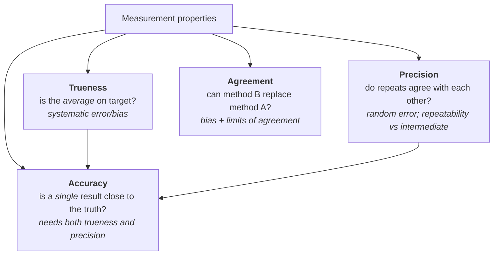
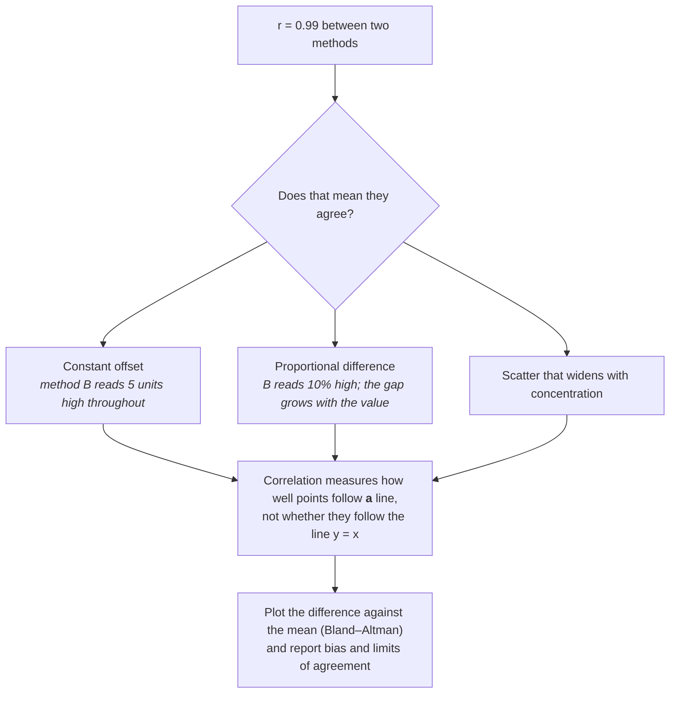
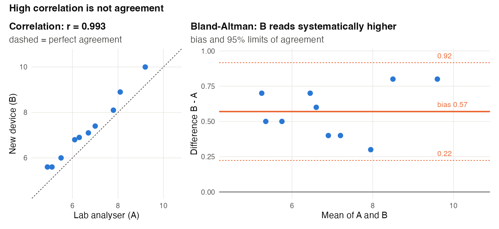
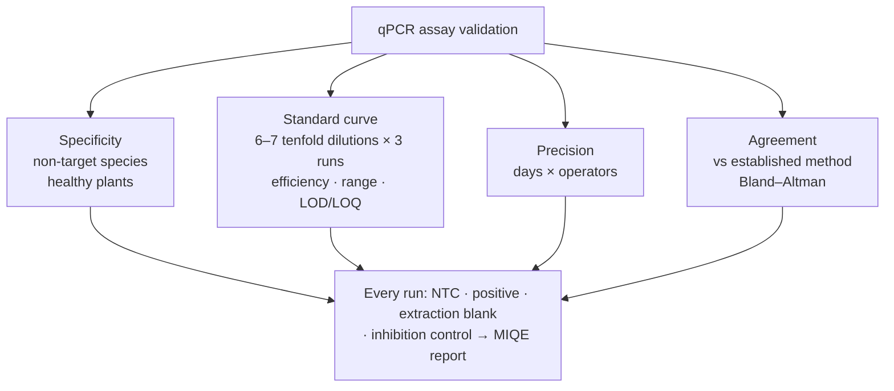
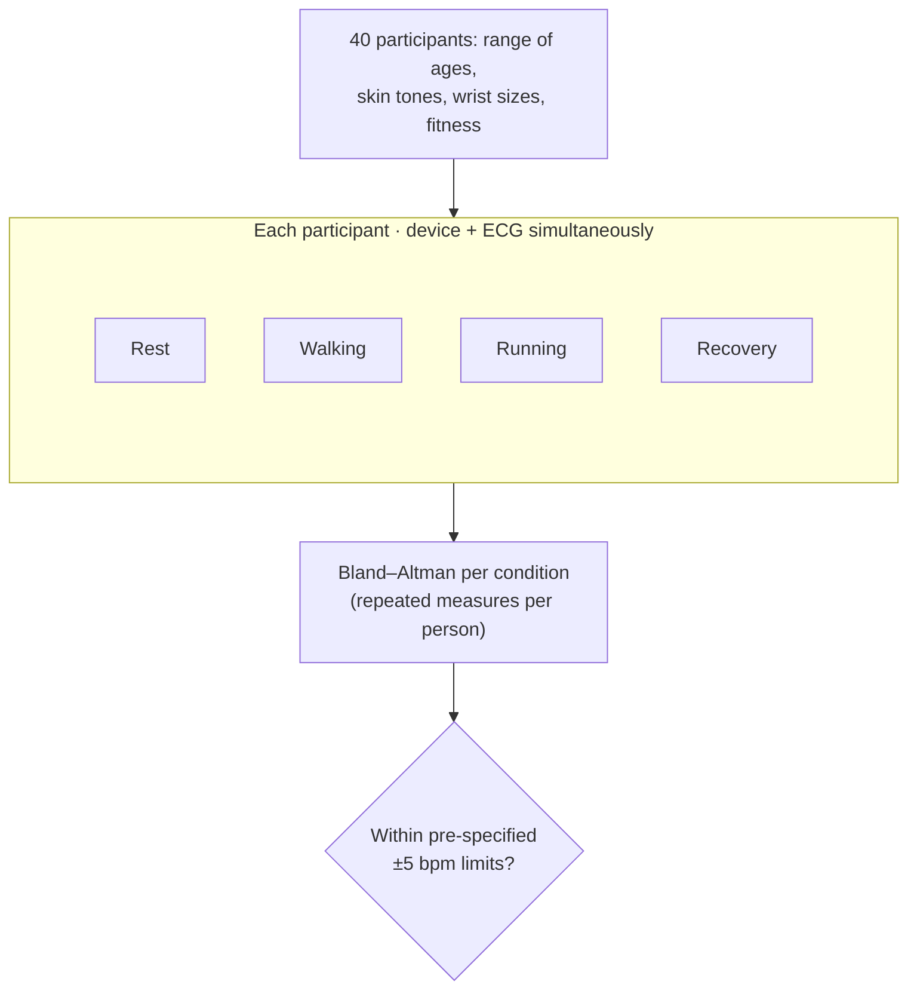
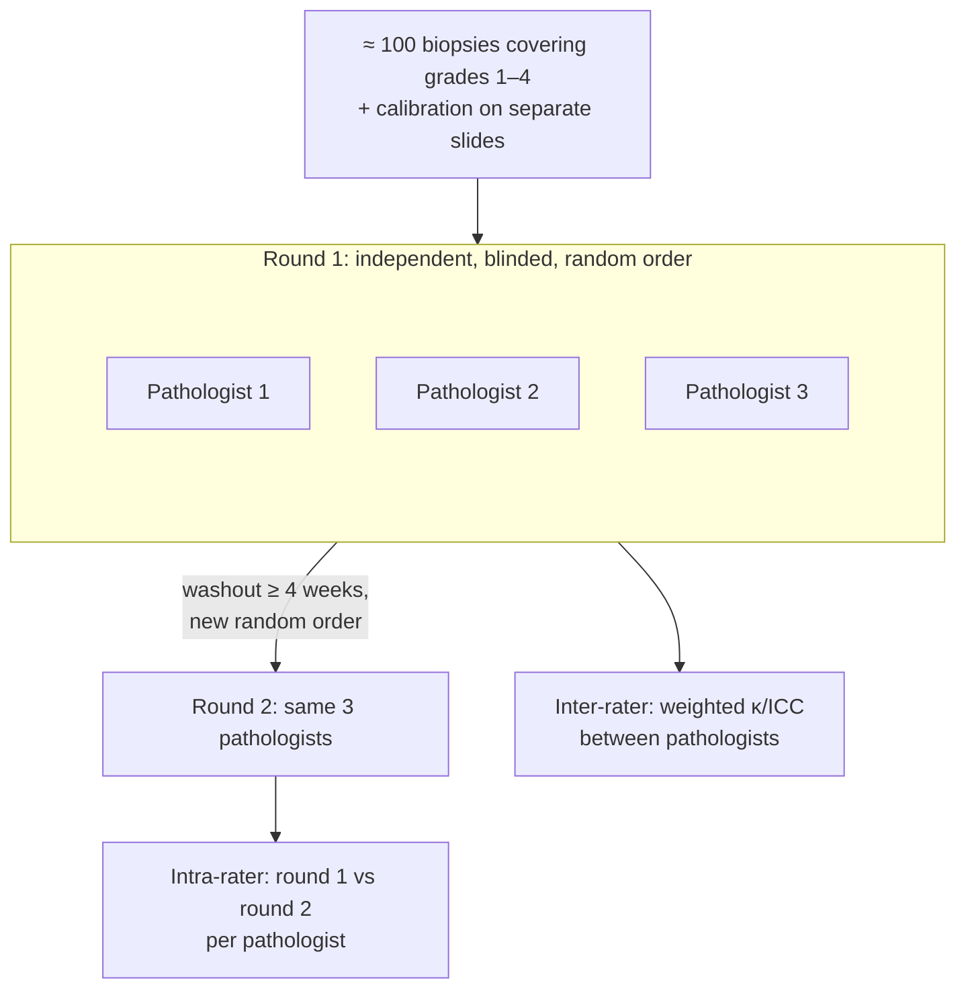

# Chapter 15 — Measurement, Validation and Benchmarking (Q8)

> **Part III — Designs by Question Type**
> [← Chapter 14](14-screening-designs.md) · [Table of Contents](../README.md) · [Next: Chapter 16 — Molecular and Cell Biology, Biochemistry →](16-molecular-cell-biochemistry.md)

---

## 🧭 Learning Objectives

After this chapter you will be able to:

1. Distinguish **accuracy, precision, repeatability, reproducibility** and **agreement**.
2. Design a method-comparison study and analyse it with **Bland–Altman** limits of agreement.
3. Plan a multi-laboratory (ring) study.
4. Design a **neutral computational benchmark** and a simulation study (ADEMP).

---

## 🎯 The Big Picture

Every other question type assumes the measurements mean what we think they mean.
Measurement questions — *is this assay, instrument or algorithm valid?* — check that
assumption. They include assay validation, inter-laboratory ring trials,
diagnostic-accuracy studies, and benchmarks of bioinformatics tools.

These studies are experiments in which the "treatments" are **methods** and the "units"
are **samples, laboratories or datasets**. They need ground truth, realistic variety and
replication — and protection against the developer's natural optimism.

---

## 🧠 Core Intuition

### Vocabulary

| Term | Question | Design element |
|---|---|---|
| **Trueness** | Is the average close to the reference value? | reference materials; assess bias |
| **Accuracy** | Are results close to the reference, considering bias and scatter? | assess both trueness and precision |
| **Precision** | How much does it scatter? | replicate measurements |
| **Repeatability** | Same lab, same operator, short time | within-run replicates |
| **Reproducibility** | Different labs, operators, instruments | ring trials |
| **Agreement** | Can method B replace method A? | paired measurements, Bland–Altman |
| **Diagnostic accuracy** | Does the test classify correctly? | sensitivity/specificity vs reference standard (STARD) |

### Correlation is not agreement

Two methods can correlate almost perfectly while one consistently reads 20% higher.
Correlation measures *association*. Agreement asks whether the *differences* are small
enough to matter. Use **Bland–Altman** analysis: plot differences against means, and
report the **bias** (mean difference) and **95% limits of agreement**
(bias ± 1.96 × SD of differences) [@bland1986].

### Inter-laboratory studies

Multi-site studies show what reproducibility is achievable under standardized protocols.
Microarray and RNA-seq consortia (MAQC/SEQC) [@maqc2006; @seqc2014] and multi-lab
targeted and DIA proteomics studies [@addona2009; @collins2017] are examples. Design: the
**same** samples (including reference materials) sent to several labs, each following the
protocol, with replicates within labs, so that within- and between-lab variance can be
separated.

### Benchmarks of computational methods

A benchmark is an experiment [@weber2019; @mangul2019]:

- **Purpose and scope** defined in advance.
- **Method selection** that is comprehensive or justified, not just favourable.
- **Datasets** with ground truth — simulations, spike-ins, mixtures, reference samples
  (e.g. Genome in a Bottle for variant calling [@krusche2019]) — spanning realistic
  conditions.
- **Several metrics** and **many datasets**, not one showcase.
- **Neutrality:** comparisons by people not invested in one method are less biased
  [@boulesteix2013].

### Simulation studies: ADEMP

Plan **A**ims, **D**ata-generating mechanisms, **E**stimands, **M**ethods and
**P**erformance measures in advance, and choose the number of simulation repetitions
from the Monte-Carlo error you can accept [@morris2019].

---

## 👁️ Visual Intuition — a Bland–Altman plot (sketch)

*The worked example's data, plotted. Code: scripts/course/figures.R.*

---

## 🔬 Worked Example — does a point-of-care device agree with the lab?

Ten blood samples measured on the lab analyser (A) and a new device (B), mmol/L:

| A | 5.1 | 6.3 | 7.8 | 4.9 | 9.2 | 6.7 | 8.1 | 5.5 | 7.0 | 6.1 |
|---|---|---|---|---|---|---|---|---|---|---|
| B | 5.6 | 6.9 | 8.1 | 5.6 | 10.0 | 7.1 | 8.9 | 6.0 | 7.4 | 6.8 |

1. **Correlation:** r = **0.993** — tempting to declare "excellent agreement".
2. **Differences B − A:** mean (bias) = **+0.57 mmol/L**; 95% limits of agreement
   **+0.22 to +0.92 mmol/L**.
3. **Interpretation:** the device reads systematically higher, by up to about 0.9 mmol/L.
   Whether that matters depends on pre-specified acceptable differences, not on *r*.
   These limits estimate the spread of individual differences, **not a CI for the
   mean bias**. The bias and limits themselves have uncertainty. Check for differences
   that grow with concentration (consider ratios/log scale) and account for repeated
   measurements from the same participant.
4. **Design lessons:** cover the **whole clinical range**, measure **in random order**
   with both methods on the same sample at the same time, include **replicates** to
   estimate each method's repeatability, and use a sample size large enough to estimate
   the limits of agreement precisely (10 is only for illustration).

(Code: `scripts/course/worked_examples.R`.)

---

## ⚠️ Common Misconceptions

| ❌ The misconception | ✅ What is actually true — and what to do |
|---|---|
| **"High correlation = methods agree."** | Correlation ignores bias and depends on the range of values. |
| **"Validated once, valid forever."** | Reagent lots, instruments and sample types change. Re-verify after changes and run QC samples. |
| **"Our new tool wins the benchmark."** | Developers' benchmarks are optimistic. Look for independent, neutral comparisons on many datasets. |
| **"Simulation proves the method works."** | Only under the simulated data-generating mechanism. Test on real data with known truth too. |
| **"Sensitivity and specificity are fixed properties of a test."** | They depend on the patient spectrum and the reference standard (STARD) [@bossuyt2015]. |

---

## 🧪 Spot the Flaw

> "We present FastAlign, a new aligner. On a simulated dataset generated with our own
> simulator, FastAlign achieved the highest accuracy among three tools (FastAlign and
> two older versions of popular aligners run with default parameters)."

▶ Diagnosis

Several benchmark biases: data generated by the **authors' own simulator** (may favour
their model assumptions); **one dataset**; **cherry-picked and outdated competitors**
with untuned defaults; no real data with ground truth. **Fix:** several independent
simulators and real reference datasets, current competitor versions with recommended
settings, several metrics, and code and data released for re-analysis [@weber2019].

---

## 🔎 The Reviewer's Perspective

- **"What is the ground truth, and how was it established?"**
- **"Is agreement analysed with differences, not correlation?"**
- **"Do the samples/datasets cover the realistic range of conditions?"**
- **"Who ran the benchmark — and are competitor methods fairly configured?"**

---

## 🛠️ Design Challenges

Three measurement (Q8) problems: validating an assay, testing agreement between two
methods, and testing agreement between people. For each, name the property you are
measuring (accuracy, precision, agreement, reliability) — then open the model answer.

### Challenge 1 · Plant diagnostics · ⭐⭐ — validating a qPCR assay

Your lab developed a qPCR assay to quantify a plant pathogen. Plan its validation before
it is used in field surveys.

▶ A model design

- **Specificity:** test DNA from related non-target species and healthy plants.
- **Standard curve:** 6–7 tenfold dilutions of a quantified standard, in triplicate,
  on ≥ 3 runs → efficiency, linear range, limit of detection/quantification.
- **Repeatability and intermediate precision:** the same samples across days and
  operators.
- **Agreement:** compare with an established method (e.g. culture or a published assay)
  on field samples covering the range; Bland–Altman.
- **Controls every run:** no-template, positive control, extraction blank, inhibition
  control. Report with MIQE [@bustin2009].

### Challenge 2 · Digital health · ⭐⭐ — a wrist-worn heart-rate monitor

A company claims its wrist-worn device measures heart rate as well as an ECG chest strap.
You will test this in 40 adults. The device will be used during daily life, including
exercise. Design the agreement study.

▶ A model design

- **Reference:** a simultaneous ECG (the accepted reference), time-synchronized with the
  device.
- **Conditions that matter for use:** rest, walking, running, and recovery — wrist devices
  often fail during movement. Each participant goes through all conditions, so each has
  **repeated paired measurements**.
- **Participants:** a spectrum of ages, skin tones (optical sensors can perform differently),
  wrist sizes and fitness — agreement must hold across the people who will use it.
- **Pre-specify** the acceptable limits of agreement (e.g. ±5 beats per minute, chosen
  from clinical or training needs) **before** collecting data.
- **Analysis:** **Bland–Altman** (bias and 95% limits of agreement), using a method that
  accounts for repeated measurements per person; report separately by condition.
  Correlation is *not* agreement (Chapter 15).

### Challenge 3 · Pathology · ⭐⭐ — do pathologists agree?

A new 4-grade scoring system for liver fibrosis on biopsies will be used in a clinical trial.
Before that, you must show that pathologists apply it consistently. You have 3 pathologists
and an archive of biopsies.

▶ A model design

- **Two properties:** **inter-rater reliability** (do different pathologists agree?) and
  **intra-rater reliability** (does each agree with themselves?).
- **Cases:** about 100 biopsies chosen to cover **all grades** (a spectrum) — reliability
  measured only on easy or only on mild cases is misleading.
- **Procedure:** each pathologist scores all slides **independently**, blinded to clinical
  information and to the others' scores, in a **random order**; then re-scores all slides
  after a washout (e.g. ≥ 4 weeks) in a new random order.
- **Training first:** a short calibration session on separate slides, not on the test set.
- **Analysis:** weighted κ (ordinal grades) for pairs, or an ICC/Krippendorff's α for all
  three; report agreement per grade and where disagreements happen.

---

## ✅ Check Your Understanding

**⭐ Q1.** Distinguish repeatability from reproducibility.

**⭐ Q2.** Why is correlation inappropriate for assessing agreement?

**⭐⭐ Q3.** Differences between methods have mean −0.3 and SD 0.5. Compute the 95% limits
of agreement.

**⭐⭐ Q4.** List five properties of a good computational benchmark.

**⭐⭐⭐ Q5.** Design a three-lab ring trial for a metabolomics platform. What samples,
replication and analysis would you use?

---

## 📝 Sample Answers & Assessment

▶ Show sample answers

> **Q1 — Sample answer:** *"Repeatability: same conditions; reproducibility: different
labs/operators."* — **✔ 10/10.**

> **Q2 — Sample answer:** *"Because correlation doesn't detect bias."* — **✔ 9/10.** Also:
correlation increases with the range of values, regardless of how well the methods agree.

> **Q3 — Sample answer:** *"−0.3 ± 1.96 × 0.5 → −1.28 to +0.68."* — **✔ 10/10.**

> **Q4 — Sample answer:** *"Ground truth, many datasets, fair competitor settings,
multiple metrics, neutrality."* — **✔ 10/10.**

> **Q5 — Sample answer:** *"Send the same samples to three labs and compare."* —
**◑ 5/10.** Add design detail: identical aliquots of study-like samples plus reference
materials and a pooled QC; replicate injections within each lab and on several days;
randomized run order; a shared SOP; analysis with a variance-components (mixed) model
separating within-run, between-day and between-lab variance.

**Rubric:** measurement studies need ground truth, replication at each level of
variation, and an analysis that separates those levels.

---

## 🧾 Chapter Summary

| Concept | One-line takeaway |
|---|---|
| **Vocabulary** | Accuracy, precision, repeatability, reproducibility, agreement. |
| **Agreement** | Bland–Altman bias and limits, not correlation. |
| **Ring trials** | Same samples, many labs, replicates at each level. |
| **Benchmarks** | Ground truth, many datasets, fair competitors, neutrality. |
| **Simulations** | Plan with ADEMP; test on real data too. |

**Traps to remember:** r = 0.99 "agreement" · one showcase dataset · untuned competitors ·
validated-once assays.

### 📇 Design Card — add these rows (Q8)

| Field | Your answer |
|---|---|
| Ground truth/reference standard | |
| Levels of variation to estimate (run, day, operator, lab) | |
| Range of samples or datasets | |
| Metrics and acceptance criteria | |

---

## 🔗 Go Deeper

- 📘 Biostat course: [Ch. 24 — Evaluating Classifiers](https://github.com/MdRasheduz-zaman/biostatistics/blob/main/chapters/24-classifier-evaluation.md) · [Ch. 15 — Correlation, Causation, and Confounding](https://github.com/MdRasheduz-zaman/biostatistics/blob/main/chapters/15-correlation-causation.md)
- Reproducible computational work: [@sandve2013; @noble2009]

<!-- REFS -->

---

[← Chapter 14](14-screening-designs.md) · [Table of Contents](../README.md) · [Next: Chapter 16 — Molecular and Cell Biology, Biochemistry →](16-molecular-cell-biochemistry.md)
