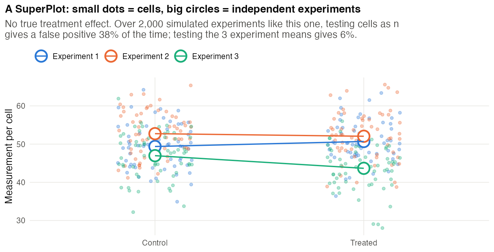
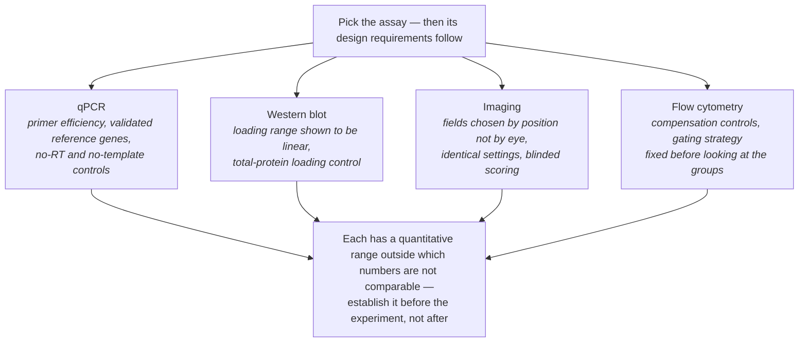
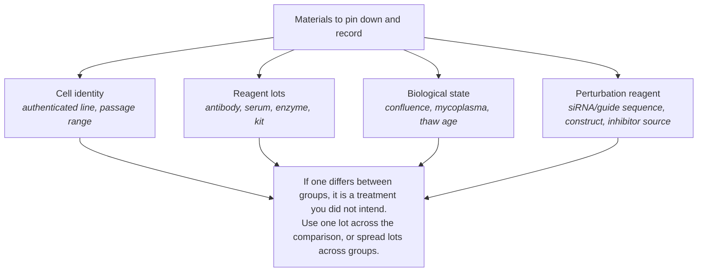
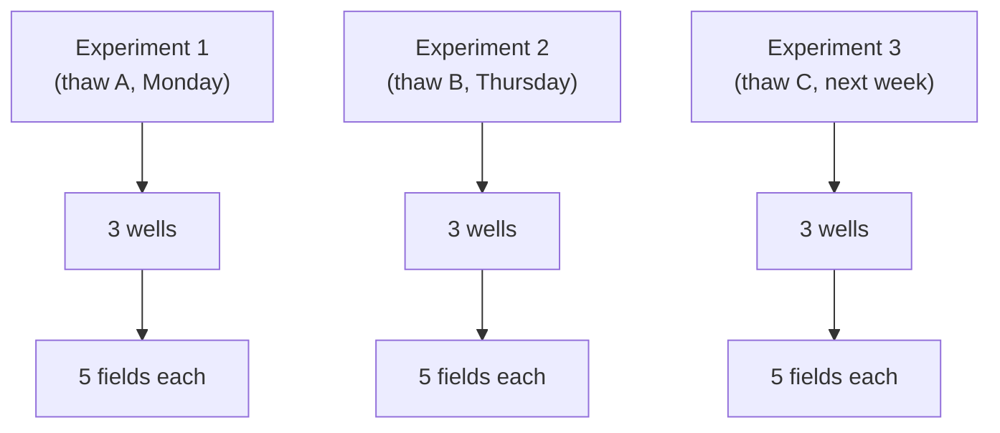
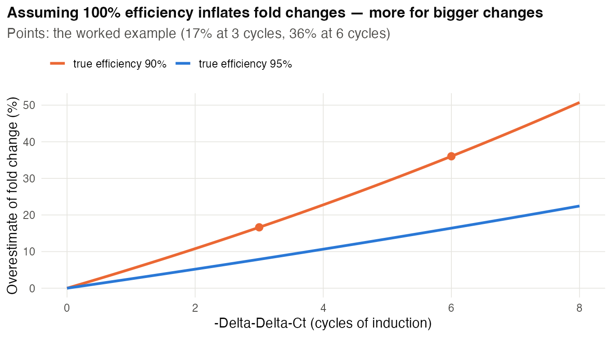
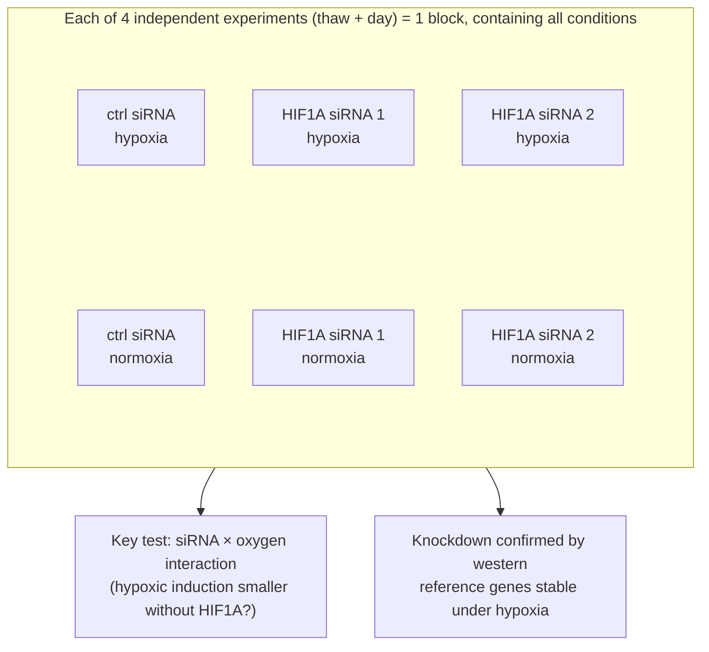
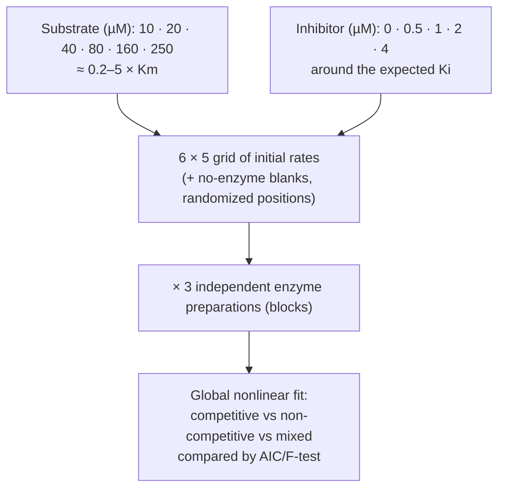
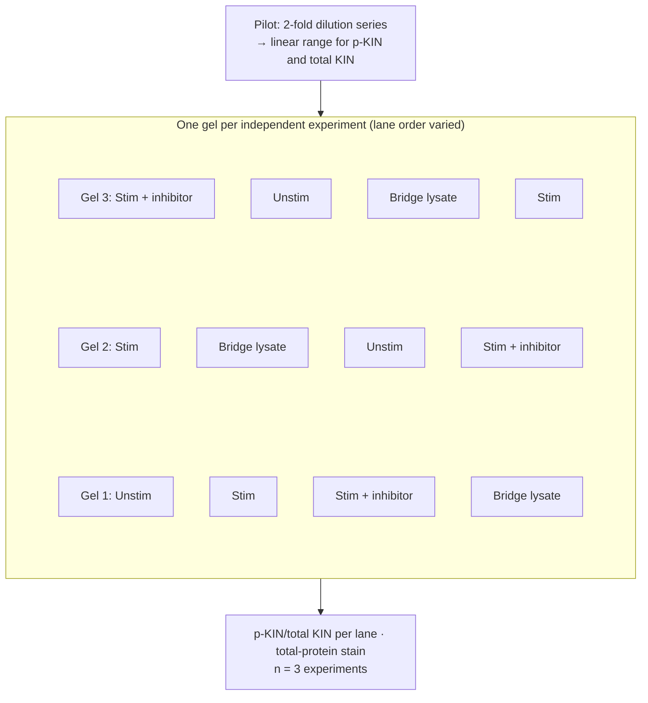

# Chapter 16 — Molecular and Cell Biology, Biochemistry

> **Part IV — Field Playbooks**
> [← Chapter 15](15-measurement-and-benchmarking.md) · [Table of Contents](../README.md) · [Next: Chapter 17 — Microbiology and the Microbiome →](17-microbiology-microbiome.md)

---

## 🧭 Learning Objectives

After this chapter you will be able to:

1. Define independent replication for cell-culture experiments and present it with SuperPlots.
2. Design qPCR, western blot, imaging and viability experiments around their measurement properties.
3. Plan enzyme-kinetics and binding experiments by choosing informative concentrations.
4. Include material-quality checks (cell line authentication, mycoplasma, antibody validation) in the design.

**Dominant question types:** comparative (Q2), mechanistic (Q3), measurement (Q8).

---

## 🎯 The Big Picture

Bench experiments are small, fast and endlessly repeatable, which makes them seem
design-free. In fact, the most common bench errors are design errors: wells counted as
replicates, one reagent used as proof, a single time point, a housekeeping gene that is
not stable, an over-exposed blot. A few habits fix most of them.

---

## 🧠 Core Intuition — the bench playbook

### 1. Replication = independent experiments

Separately randomized and treated wells can be **assignment units** within a run.
Wells from one flask do not replicate culture histories, days or donors (Chapter 3).
Repeat the full comparison with independently prepared cultures across runs [@vaux2012].
For run-level reproducibility, analyse paired run-level contrasts or model wells nested
within runs; plot the hierarchy with a **SuperPlot** [@lord2020]. Make sure error bars state what they show (SD, SEM, CI) and
what *n* counts [@cumming2007].

### 2. Assay-specific design

| Assay | Design essentials |
|---|---|
| **RT-qPCR** | RNA quality checks; primer efficiency from a standard curve; **several validated reference genes**, geometrically averaged [@vandesompele2002]; no-RT and no-template controls; MIQE reporting [@bustin2009]. ΔΔCt assumes ~100% efficiency [@livak2001]. |
| **Digital PCR** | dMIQE checklist [@huggett2013] |
| **Western blot** | load within the **linear range**; total-protein normalization is generally preferable to a single loading-control protein; validated antibodies [@pillaikastoori2020] |
| **Imaging** | acquisition settings fixed in advance; **blinded** field selection and analysis; controls for bleed-through/autofluorescence [@lee2018] |
| **Viability (MTT etc.)** | measures metabolic activity, not cell number; treatments altering metabolism confound it [@ghasemi2021] |

### 3. Materials are part of the design

Tens of thousands of papers have used misidentified or cross-contaminated cell lines
[@horbach2017]. Build **STR authentication** and **mycoplasma testing** into the schedule,
record passage numbers, and validate antibodies in your system.

### 4. Biochemistry: choose the concentrations

Kinetic parameters are estimable only from informative design points. For
Michaelis–Menten kinetics, substrate concentrations should span well below to well above
$K_m$ (e.g. ~0.2–5 × the expected $K_m$, log-spaced), with initial rates measured in the
linear phase and fitted by **nonlinear regression** rather than linearized plots
[@johnson2011]. Optimal-design theory formalizes the choice [@smucker2018optimal]. Report
with **STRENDA** [@tipton2014]. Binding assays need ligand concentrations spanning the
$K_d$ and attention to ligand depletion. Drug combinations need **dose matrices** to
separate synergy from additivity.

### 5. Mechanism needs orthogonal evidence

Two independent siRNAs/guides + rescue; genetic + pharmacological perturbation;
dose–response and time-course (Chapter 10).

---

## 👁️ Visual Intuition — what is *n* in a cell experiment?

There are 3 independent experimental runs. Fields → wells → a mean **per condition
per run** are averaged (or modelled) in that order. Compare conditions within runs;
do not average different conditions into a single run mean.

---

## 🔬 Worked Example — why primer efficiency matters

Define ΔCt = Ct(target) − Ct(reference), and ΔΔCt = ΔCt(treated) − ΔCt(control).
Relative expression is **2^(−ΔΔCt)** [@livak2001]: a negative ΔΔCt means induction.
You measure **ΔΔCt = −3** and report **2³ = 8-fold** induction. But the
standard curve shows that target and reference amplify at **90%** efficiency
(amplification factor 1.9 per cycle, not 2).

- True fold change = 1.9³ ≈ **6.9** → you overestimated by about **17%**.
- For ΔΔCt = −6: reported 2⁶ = 64, true 1.9⁶ ≈ **47** → overestimated by **36%**.

The error grows with the size of the change. **Design response:** run a standard curve
for every primer pair (≥ 5 dilutions, in triplicate), use efficiency-corrected
quantification when efficiencies differ from 100% or from each other, and validate
reference-gene stability in *your* conditions. (Code: `scripts/course/worked_examples.R`.)

---

## ⚠️ Common Misconceptions

| ❌ The misconception | ✅ What is actually true — and what to do |
|---|---|
| **"Technical triplicate = *n* = 3."** | It is *n* = 1 measured three times. |
| **"GAPDH/actin is always stable."** | Housekeeping genes can change with treatment; validate several references. |
| **"A representative blot."** | Show all replicates and quantify within the linear range. |
| **"Kinetics from three substrate concentrations."** | Too few to estimate *K_m* and *V_max* reliably. Use ≥ 6–8 well-spaced concentrations. |
| **"Cell line identity is the supplier's problem."** | Authentication is your design responsibility. |

---

## 🧪 Spot the Flaw

> "Gene X knockdown reduced migration (wound-healing assay, *n* = 9 wells, *p* < 0.001).
> Images were analysed by the first author. Knockdown was confirmed by qPCR normalized
> to GAPDH."

▶ Diagnosis

- **n = 9 wells**: from how many independent experiments? Likely pseudoreplication.
- **Unblinded image analysis** of a subjective endpoint (wound edges).
- **Single reference gene**, not validated under knockdown conditions.
- **One knockdown reagent?** No second siRNA or rescue.
- **Proliferation confound:** reduced closure may reflect reduced proliferation rather
  than migration. Use a proliferation inhibitor (e.g. mitomycin C) or measure
  proliferation in parallel.

---

## 🔎 The Reviewer's Perspective

- **"How many independent experiments, and what are the error bars?"**
- **"MIQE items: efficiency, reference-gene validation, controls?"**
- **"Is quantification within the linear range, with all blots shown?"**
- **"Were cell lines authenticated and mycoplasma-tested?"**
- **"Are kinetic and binding experiments designed around *K_m*/*K_d*?"**

---

## 🛠️ Design Challenges

Three bench experiments: a mechanistic qPCR study, an enzyme-kinetics study and a
quantitative western blot. For each, decide what an **independent experiment** is before
anything else — then open the model answer and its diagram.

### Challenge 1 · Molecular biology · ⭐⭐ — hypoxia, HIF1A and VEGFA

Design an experiment to test whether hypoxia induces gene *VEGFA* via the transcription
factor HIF1A in a human cell line, using qPCR as the main readout.

▶ A model design

- **Structure:** 2 × 2 factorial: (control siRNA, HIF1A siRNA) × (normoxia, hypoxia),
  plus a second, independent HIF1A siRNA; time-course of 0, 4, 8, 24 h hypoxia in one
  arm to choose the main time point.
- **Replication:** 4 independent experiments (separate thaws/days) as blocks; 3 wells
  per condition per experiment averaged.
- **qPCR:** efficiency from standard curves; 2–3 reference genes validated as stable
  under hypoxia; no-RT and no-template controls; MIQE.
- **Confirm knockdown** at protein level (western within the linear range).
- **Analysis:** `log expression ~ experiment + siRNA * oxygen`. The key test is the
  interaction (hypoxic induction reduced by HIF1A knockdown).

### Challenge 2 · Biochemistry · ⭐⭐ — how does the inhibitor work?

You want to determine *K*ₘ and *V*ₘₐₓ of an enzyme and whether a new inhibitor is
competitive, non-competitive or mixed. A pilot suggests *K*ₘ ≈ 50 µM and an inhibitor
*K*ᵢ somewhere around 1 µM. You have 3 independent enzyme preparations and a plate reader
that measures initial rates.

▶ A model design

- **Substrate range:** about 0.2 × *K*ₘ to 5 × *K*ₘ — e.g. **10, 20, 40, 80, 160 and
  250 µM** — so the curve's rising part *and* its approach to saturation are both sampled
  (Chapter 16: choose the concentrations).
- **Inhibitor:** **0, 0.5, 1, 2 and 4 µM** (around the expected *K*ᵢ) — each crossed with every
  substrate concentration: a 6 × 5 grid.
- **Initial rates:** check linearity over time for the highest and lowest rates; use only the
  linear part; include no-enzyme blanks.
- **Replication:** the grid is run with each of the **3 enzyme preparations** (blocks);
  duplicate wells within a run are averaged; positions randomized on the plate.
- **Analysis:** fit the competitive, non-competitive and mixed models **globally** to all
  data by nonlinear regression and compare them (e.g. by AIC or an *F*-test) — not by
  eyeballing Lineweaver–Burk lines.

### Challenge 3 · Cell signalling · ⭐⭐ — a quantitative western blot

You want to show that a growth factor increases phosphorylation of a kinase (p-KIN relative
to total KIN) after 15 min, and that an inhibitor blocks it. Conditions: unstimulated,
stimulated, stimulated + inhibitor. Your blot has 10 lanes. Plan the experiment so the
bands can be **compared quantitatively**.

▶ A model design

- **Linear range first:** run a 2-fold dilution series of one lysate to find the loading
  range where band intensity is proportional to the amount loaded — for both antibodies.
- **Independent experiments:** 3 separate stimulations on different days (the unit); each
  gel carries **all three conditions** of one experiment, never one condition per gel.
- **Bridge sample:** the same pooled lysate in one lane of every gel, so signals can be
  compared across gels.
- **Normalization:** p-KIN to total KIN on the same membrane (strip/reprobe or two-colour
  detection), and total protein staining as a loading control rather than a single
  "housekeeping" protein that may change.
- **Lane order:** randomize or alternate positions between gels (transfer can be uneven
  across a gel); quantify blind to lane identity.

---

## ✅ Check Your Understanding

**⭐ Q1.** What makes two cell-culture experiments "independent"?

**⭐ Q2.** Name three MIQE essentials.

**⭐⭐ Q3.** With equal target/reference efficiencies of 95% and ΔΔCt = −4, what is the
efficiency-corrected fold change, compared with the 2^(−ΔΔCt) estimate?

**⭐⭐ Q4.** Why should substrate concentrations in a kinetics experiment span values
above and below *K_m*?

**⭐⭐⭐ Q5.** A reviewer asks for "biological replicates" of your western blot result.
You have three blots, run the same day from one lysate. What do you do?

---

## 📝 Sample Answers & Assessment

▶ Show sample answers

> **Q1 — Sample answer:** *"Different days."* — **◑ 6/10.** Different day helps, but
repeat the full treatment comparison in independently prepared cultures. Record shared
stock, passage and reagent lots; model shared run effects. A different day or thaw alone
does not replicate donors or cell lines.

> **Q2 — Sample answer:** *"Efficiency, reference gene validation, no-template control."* —
**✔ 10/10.**

> **Q3 — Sample answer:** *"1.95⁴ ≈ 14.5 vs 16."* — **✔ 10/10.** (1.95⁴ = 14.46.)

> **Q4 — Sample answer:** *"To see the curve flatten."* — **✔ 8/10.** More fully: points
below *K_m* determine the initial slope (*V_max/K_m*), points well above determine
*V_max*. Both are needed to estimate both parameters.

> **Q5 — Sample answer:** *"Say it's three replicates."* — **✘ 1/10.** They are technical
replicates of one lysate. Repeat the experiment from independent cultures (new treatment,
new lysate) across runs, justify the number for the target effect or precision, quantify each
within the linear range, and present all blots. Three runs is not a universal adequacy threshold.

**Rubric:** bench answers earn full credit when they name what varies between replicates.

---

## 🧾 Chapter Summary

| Concept | One-line takeaway |
|---|---|
| **Replication** | Independent experiments; SuperPlots to show them. |
| **qPCR** | Efficiency, validated reference genes, controls, MIQE. |
| **Blots & imaging** | Linear range, total-protein normalization, blinding. |
| **Kinetics** | Concentrations around *K_m*; nonlinear fits; STRENDA. |
| **Materials** | Authenticate, test for mycoplasma, validate antibodies. |

**Traps to remember:** wells as *n* · GAPDH by default · representative blots ·
three-point kinetics · unauthenticated lines.

### 📇 Design Card — field checklist

| Item | Done? |
|---|---|
| Independent experiments defined | |
| Assay-specific controls (MIQE/STRENDA) | |
| Blinding of quantification | |
| Orthogonal perturbations/rescue | |
| Cell line authentication & mycoplasma | |

---

## 🔗 Go Deeper

- 📘 Biostat course: [Ch. 31 — Replicates](https://github.com/MdRasheduz-zaman/biostatistics/blob/main/chapters/31-replicates.md) · [Ch. 4 — Data Visualization](https://github.com/MdRasheduz-zaman/biostatistics/blob/main/chapters/04-data-visualization.md)
- More: [@bustin2017; @blainey2014]

<!-- REFS -->

---

[← Chapter 15](15-measurement-and-benchmarking.md) · [Table of Contents](../README.md) · [Next: Chapter 17 — Microbiology and the Microbiome →](17-microbiology-microbiome.md)
