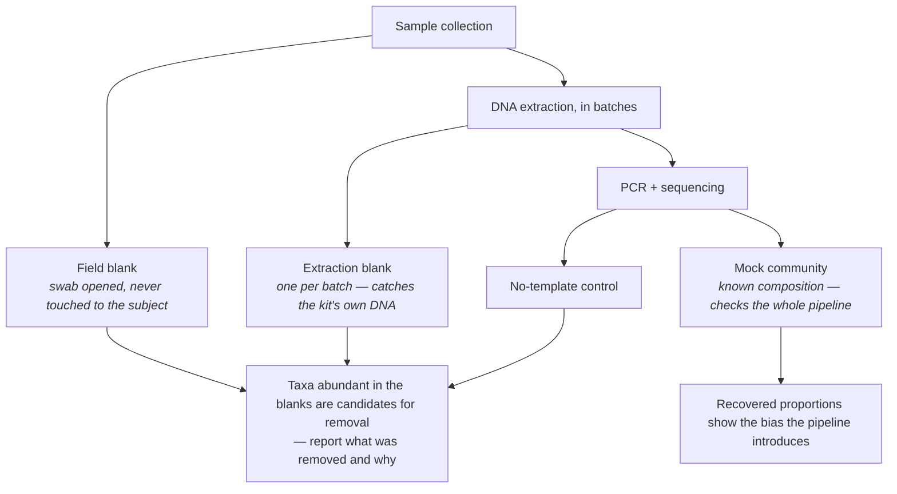
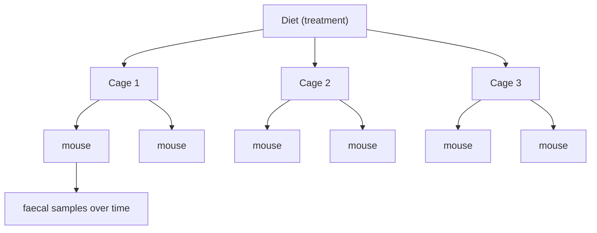
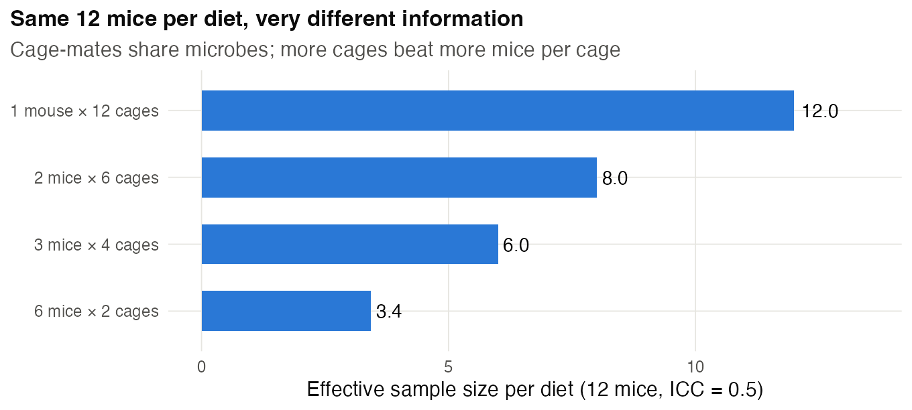
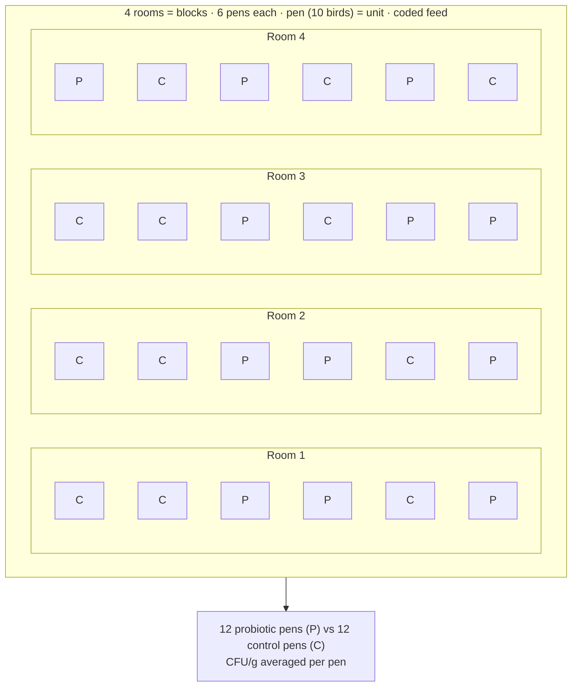
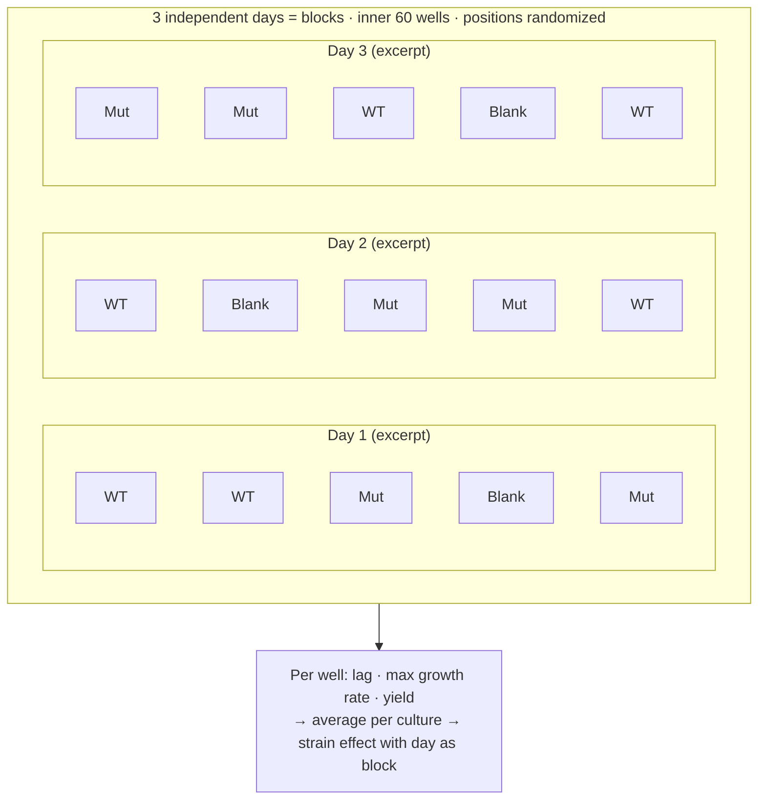
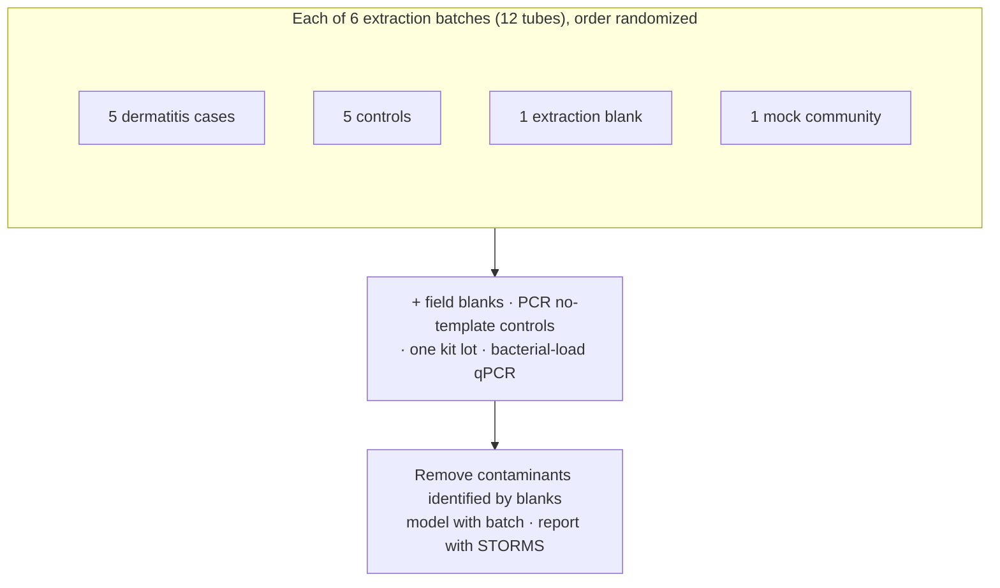

# Chapter 17 — Microbiology and the Microbiome

> **Part IV — Field Playbooks**
> [← Chapter 16](16-molecular-cell-biochemistry.md) · [Table of Contents](../README.md) · [Next: Chapter 18 — Biotechnology, Bioprocess and Pharmacy →](18-biotech-bioprocess-pharmacy.md)

---

🧬 <b>Biology primer</b> — microbiome terms (expand if new)

- **16S rRNA amplicon sequencing:** sequences one marker gene to profile which bacteria are present.
- **Shotgun metagenomics:** sequences all DNA in a sample; gives species and gene content.
- **Low-biomass sample:** contains very little microbial DNA (tissues, blood, placenta, air); contamination can dominate.
- **Mock community:** a defined mixture of known microbes used as a positive control.
- **Compositional data:** sequencing gives *proportions* (reads per sample are fixed by the sequencer), not absolute amounts.

---

## 🧭 Learning Objectives

After this chapter you will be able to:

1. Define independent biological replicates for culture-based microbiology.
2. Identify the **cage** (or isolator, pond, reactor) as the experimental unit in host–microbiome studies.
3. Plan **positive and negative controls** for every sequencing batch, especially for low-biomass samples.
4. Explain why compositional data shape both design and analysis.
5. Use a reporting checklist (STORMS) as a design checklist.

**Dominant question types:** descriptive (Q1), comparative (Q2), associational (Q4).

---

## 🎯 The Big Picture

Microbiology spans precise culture experiments and messy ecosystems. Classical
microbiology has some of the best-designed experiments in biology: the *E. coli*
long-term evolution experiment propagated **12 replicate populations** from one ancestor
and froze samples periodically, so evolution could be compared across independent
replicates and ancestors revived for direct comparison [@lenski1991]. Microbiome
science, by contrast, faces three distinctive design threats:
**shared microbes among co-housed hosts, contamination, and compositionality**.

---

## 🧠 Core Intuition — the microbiology playbook

### 1. Culture experiments

- **Biological replicate:** an independent colony → independent overnight culture. Not
  three wells inoculated from one culture.
- **Plate and position:** randomize strain/condition positions on plates; use blanks;
  watch for edge evaporation in long growth curves.
- **Inoculum standardization:** fixed OD and growth phase; record passage history.

### 2. Host–microbiome studies: the cage is the unit

Co-housed mice exchange microbes (coprophagy), so their microbiomes converge. If a diet
or treatment is given **per cage**, the **cage** is the unit; even with per-mouse
treatment, cage is a cluster to model. Vendor, shipment, litter and cage should be
balanced across groups, and baseline samples collected [@laukens2016].

### 3. Contamination controls

Reagents and kits contain bacterial DNA, and in low-biomass samples it can dominate
[@salter2014; @eisenhofer2019]. Every batch needs **extraction blanks, no-template
controls, sampling controls** and a **mock community**. Decide in advance how blank
taxa will be handled. The "fetal microbiome" debate illustrates the stakes [@kennedy2023].

### 4. Technical variation is large

DNA extraction, library preparation and bioinformatics choices vary substantially
between labs [@sinha2017]. Keep one protocol for a study, randomize samples across
extraction and sequencing batches, and include the same controls in each.

### 5. Compositionality

Sequencing yields relative abundances: if one taxon expands, others appear to shrink.
Analysis must respect the constant-sum constraint [@gloor2017; @weiss2017]. Discarding
reads by rarefying wastes information [@mcmurdie2014]. If absolute abundance matters,
**design it in**: add spike-in standards or measure total load (e.g. qPCR, flow cytometry).

### 6. Report with STORMS

The STORMS checklist [@mirzayi2021] covers confounders (diet, antibiotics, medication),
controls, batch and contamination handling. Read it *before* sampling. Best-practice
reviews: [@knight2018; @kim2017; @mallick2017].

---

## 👁️ Visual Intuition — one study, three layers of units

Diet is assigned to cages; mice are sub-units; samples over time are repeated measures.

---

## 🔬 Worked Example — allocating 24 mice to two diets

Suppose cage-mates' microbiome outcomes have an intra-class correlation of **0.5**.
With **12 mice per diet**:

| Mice per cage | Cages per diet | Design effect 1 + (m − 1)ρ | Effective *n* per diet |
|---|---|---|---|
| 6 | 2 | 3.5 | 3.4 |
| 3 | 4 | 2.0 | 6.0 |
| 2 | 6 | 1.5 | 8.0 |
| 1 (single-housed) | 12 | 1.0 | 12.0 |

Same mice, same cost — more than **three times** the information when moving from 2 to
12 cages per diet. With only 2 cages per diet, the diet comparison also has just 2 units
per group, so one odd cage can produce the "effect". Pair-housing in more cages is often
a good compromise between information and welfare (single housing stresses social
animals). Record cage and analyse with cage as unit or random effect. (The design-effect
formula is an approximation; with very few clusters the loss is even worse.)
(Code: `scripts/course/worked_examples.R`.)

---

## ⚠️ Common Misconceptions

| ❌ The misconception | ✅ What is actually true — and what to do |
|---|---|
| **"Each mouse is an independent replicate."** | Cage-assigned treatment makes cage the assignment unit. Individually assigned mice remain assignment units, but shared housing creates dependence and possible microbial spillover. |
| **"Blanks are only needed for low-biomass samples."** | They are cheap insurance in every batch, and essential for low biomass. |
| **"Relative abundance went up, so the bacterium grew."** | It may be that others declined. Measure absolute load if it matters. |
| **"Different labs' microbiome data can be pooled directly."** | Protocol differences can rival biological differences. |
| **"Antibiotic or diet history doesn't matter for my question."** | Both strongly shape the microbiome. Record and balance them. |

---

## 🧪 Spot the Flaw

> "Stool samples from 30 IBD patients (collected at a clinic, frozen at −80 °C) and 30
> healthy controls (collected at home, mailed at room temperature) were sequenced. IBD
> patients showed lower diversity. Most patients were on medication."

▶ Diagnosis

Disease status is confounded with **collection and storage method** (clinic freezer vs
room-temperature mail) and with **medication**. Room-temperature transport changes
community profiles. **Fix:** identical collection kits and stabilization for all
participants; record and adjust for (or stratify by) medication, diet and antibiotics;
randomize samples across extraction and sequencing batches; include blanks and a mock
community; report with STORMS.

---

## 🔎 The Reviewer's Perspective

- **"What is the unit — host, cage, reactor, site?"**
- **"Were blanks, no-template controls and mock communities in every batch, and how were
  contaminants handled?"**
- **"Were collection, storage and processing identical across groups?"**
- **"Are compositional data analysed appropriately, and is absolute abundance claimed?"**

---

## 🛠️ Design Challenges

Three microbiology scenarios: an animal infection study, a culture experiment and a
low-biomass microbiome survey. For each, find the unit and the contamination risks
first — then open the model answer and its diagram.

### Challenge 1 · Veterinary microbiology · ⭐⭐ — a probiotic against *Salmonella*

Test whether a probiotic reduces *Salmonella* colonization in chickens. You have
4 rooms with 6 pens each, 10 birds per pen.

▶ A model design

- **Unit:** the **pen** (birds share feed, water and litter, so microbes spread).
- **Allocation:** within each room (block), randomly assign 3 pens to probiotic and
  3 to control → 12 pens per group, balanced across rooms.
- **Challenge:** standardized *Salmonella* dose to all birds (or seeder birds per pen).
- **Outcome:** colonization (CFU/g caecal content) from several birds per pen, averaged
  per pen or modelled with pen as random effect.
- **Controls:** unchallenged sentinel pens to check for cross-contamination between pens;
  feed verified for probiotic content.
- **Blinding:** coded feed bags; lab staff blinded. Report with REFLECT [@sargeant2010].

The pen allocations were drawn at random (seeded) within each room.

### Challenge 2 · Bacterial physiology · ⭐ — growth curves in a plate reader

You want to compare the growth rate of a deletion mutant with its wild type in a 96-well
plate reader overnight. Your draft: wild type in columns 1–6, mutant in columns 7–12, all
from one overnight culture each, one run.

▶ A model design

- **Plate position matters:** edge wells evaporate and warm differently, and plate readers
  can have gradients — columns 1–6 vs 7–12 confounds strain with position. Use the inner
  60 wells (fill the edge with medium), and **randomize positions** (or use a balanced
  checkerboard).
- **Blanks:** medium-only wells spread across the plate (contamination check and background).
- **Biological replication:** **3 independent days**, each started from a fresh colony and a
  fresh overnight culture of both strains; within a day, 3 independent cultures per strain
  if possible. Wells from the same culture are technical replicates.
- **Analysis:** fit a growth model (or the maximum slope of log OD) per well → average per
  culture → compare strains with day as block. Report lag, maximum growth rate and yield
  separately.

### Challenge 3 · Skin microbiome · ⭐⭐⭐ — a low-biomass survey

You will compare the skin microbiome of 30 people with atopic dermatitis and 30 controls by
16S rRNA amplicon sequencing of skin swabs, which contain very little bacterial DNA. DNA
extraction is done in batches of 12. Design the sample processing.

▶ A model design

- **Low biomass = contamination matters:** reagents and kits contain bacterial DNA (the
  "kitome"), which can dominate low-biomass samples (Chapter 6, worked example).
- **Every extraction batch:** **5 cases + 5 controls** (balanced, random order) **+ 1 extraction
  blank** (swab without skin contact, processed identically) **+ 1 mock community** of
  known composition → 6 batches of 12 for 60 samples.
- **Also:** field blanks (a swab opened in the clinic air), PCR no-template controls, one kit
  lot for all extractions (or lot balanced across groups), and quantification of bacterial
  load (qPCR) to identify samples near the blanks.
- **Analysis:** remove contaminants using the blanks (prevalence/frequency-based methods),
  report what was removed, and treat compositional data appropriately (Chapter 17); include
  extraction batch in the model.
- **Report** with STORMS.

---

## ✅ Check Your Understanding

**⭐ Q1.** Why is the cage often the experimental unit in mouse microbiome studies?

**⭐ Q2.** List four controls every microbiome sequencing batch should include.

**⭐⭐ Q3.** What does "compositional" mean, and how can design address it?

**⭐⭐ Q4.** Why does the long-term evolution experiment use 12 replicate populations
rather than one big population?

**⭐⭐⭐ Q5.** Design a study of whether placental tissue has a resident microbiome, with
all necessary controls.

---

## 📝 Sample Answers & Assessment

▶ Show sample answers

> **Q1 — Sample answer:** *"Mice share microbes by coprophagy."* — **✔ 10/10.**

> **Q2 — Sample answer:** *"Extraction blank, no-template control, mock community,
sampling control."* — **✔ 10/10.**

> **Q3 — Sample answer:** *"Data are proportions; use spike-ins or total load
measurements."* — **✔ 10/10.**

> **Q4 — Sample answer:** *"To see whether evolution repeats."* — **✔ 9/10.** Yes: replicate
populations are independent units, so outcomes can be compared across them. One
population is *n* = 1 for questions about evolutionary repeatability.

> **Q5 — Sample answer:** *"Sequence placenta samples and compare with blanks."* —
**◑ 6/10.** Add: sampling controls (delivery room air, gloves, swabs), caesarean vs
vaginal deliveries, a mock community, low-biomass dilution series, independent
confirmation by culture/microscopy/qPCR, and a pre-registered rule for contaminants.

**Rubric:** microbiome answers need the unit, the controls, and the handling of
contamination and compositionality.

---

## 🧾 Chapter Summary

| Concept | One-line takeaway |
|---|---|
| **Culture replicates** | Independent colonies and cultures. |
| **Host studies** | Identify where treatment is assigned; model housing clusters and consider spillover. Balance vendor and litter. |
| **Contamination** | Blanks, no-template, sampling controls, mock communities every batch. |
| **Technical variation** | One protocol; randomize across batches. |
| **Compositionality** | Proportions, not amounts; design in absolute measures if needed. |

**Traps to remember:** mice as *n* · no blanks · different collection kits per group ·
relative = absolute.

### 📇 Design Card — field checklist

| Item | Done? |
|---|---|
| Unit (cage/pen/host) and housing plan | |
| Blanks, NTC, sampling controls, mock community per batch | |
| Identical collection/storage for all groups | |
| Diet, antibiotics, medication recorded | |
| STORMS checklist reviewed | |

---

## 🔗 Go Deeper

- 📘 Biostat course: [Ch. 32 — Pseudoreplication](https://github.com/MdRasheduz-zaman/biostatistics/blob/main/chapters/32-pseudoreplication.md) · [Ch. 29 — Batch Effects](https://github.com/MdRasheduz-zaman/biostatistics/blob/main/chapters/29-batch-effects.md) · [Ch. 20 — Count Data Models](https://github.com/MdRasheduz-zaman/biostatistics/blob/main/chapters/20-count-data.md)
- Engineering microbiomes: [@lawson2019]

<!-- REFS -->

---

[← Chapter 16](16-molecular-cell-biochemistry.md) · [Table of Contents](../README.md) · [Next: Chapter 18 — Biotechnology, Bioprocess and Pharmacy →](18-biotech-bioprocess-pharmacy.md)
