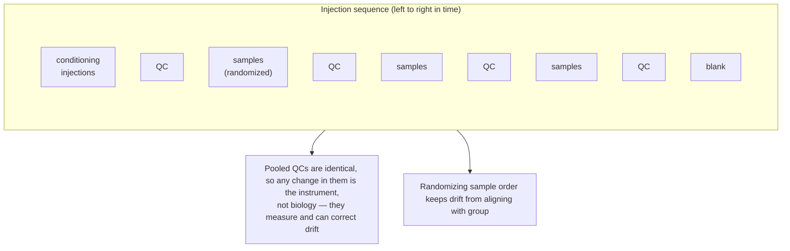
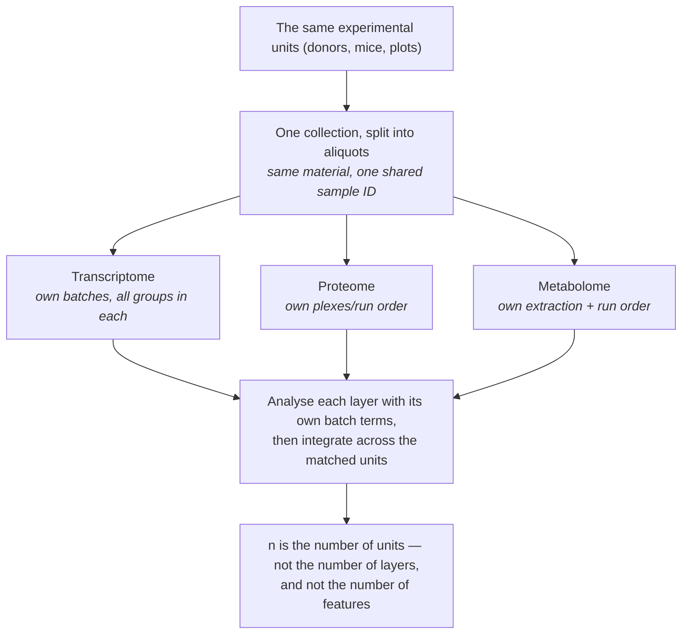
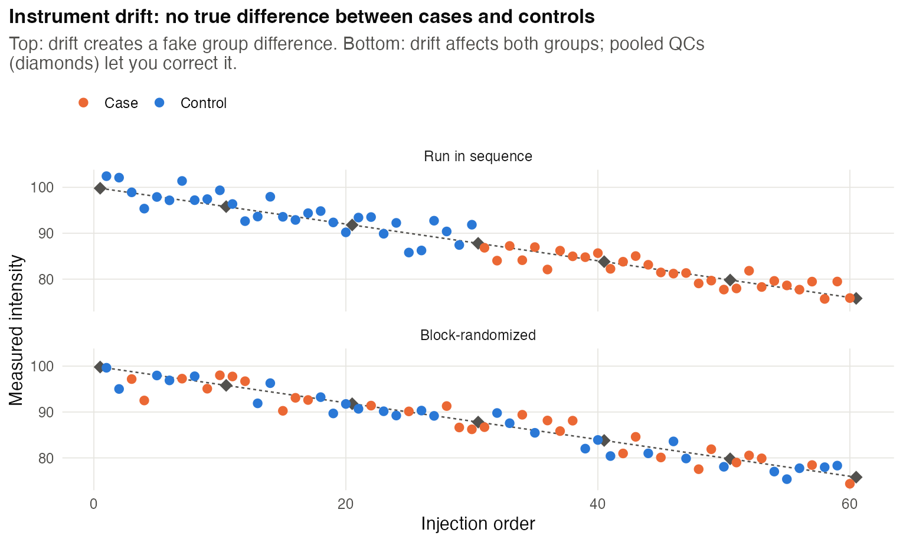
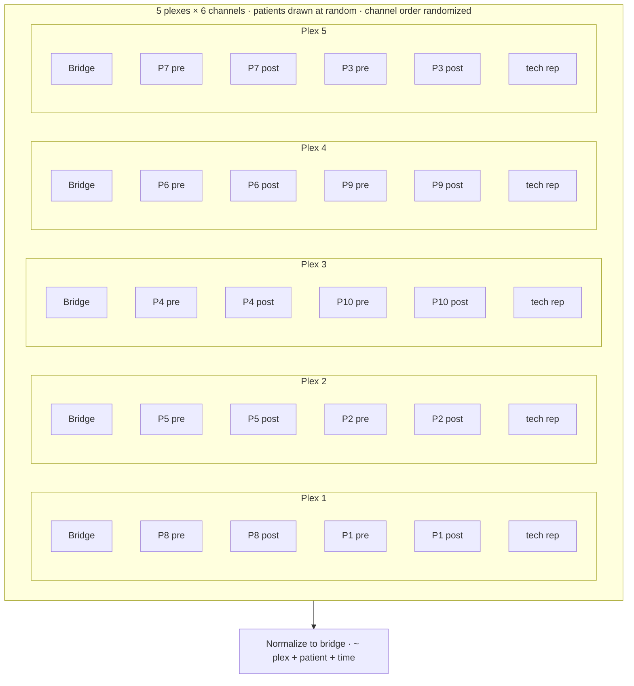
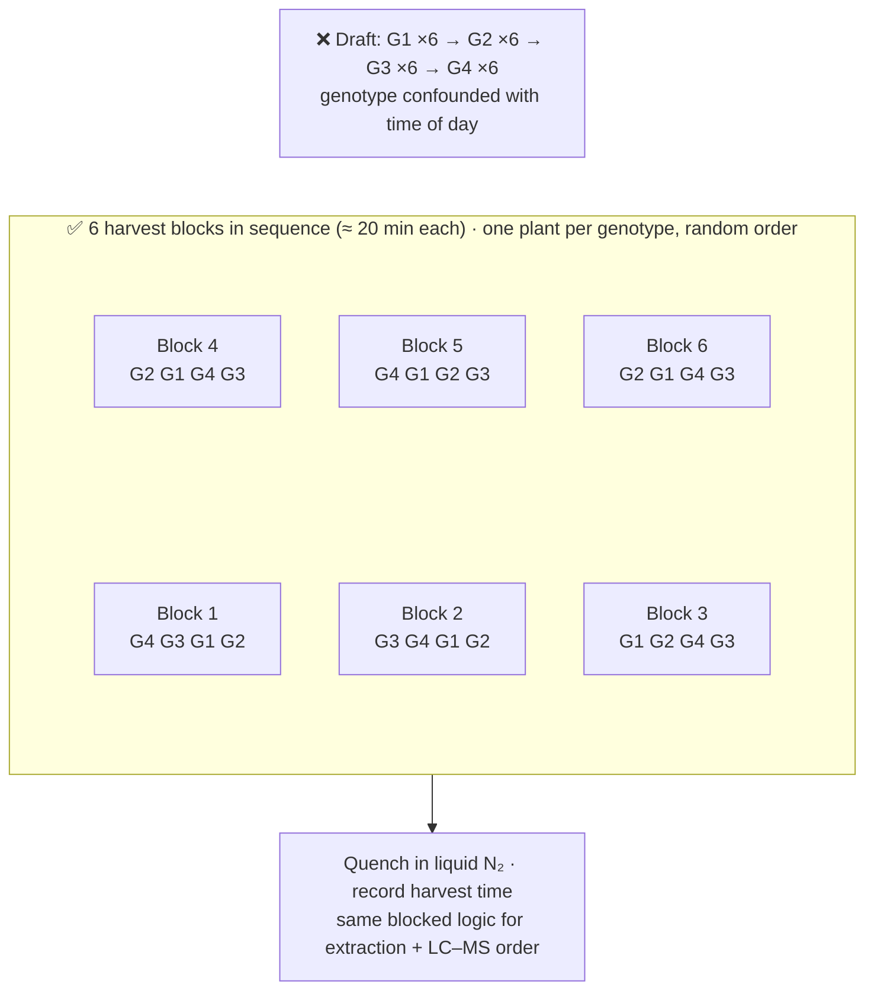
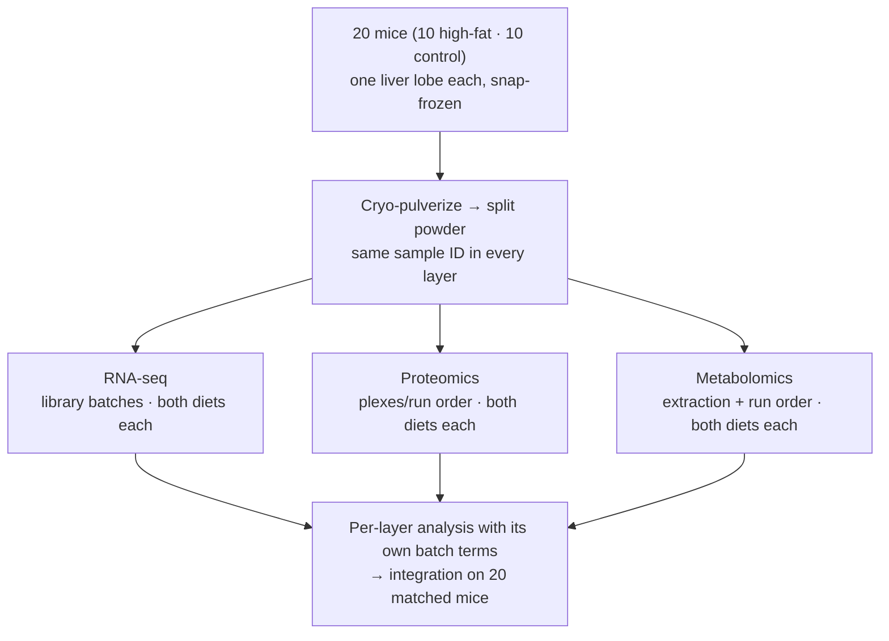

# Chapter 21 — Proteomics, Metabolomics and Multi-Omics

> **Part IV — Field Playbooks**
> [← Chapter 20](20-genetics-genomics-transcriptomics.md) · [Table of Contents](../README.md) · [Next: Chapter 22 — Bioinformatics, Computational Biology and Data Science →](22-computational-and-data-science.md)

---

🧬 <b>Biology primer</b> — mass-spectrometry terms (expand if new)

- **LC-MS run/injection:** one sample analysed by liquid chromatography–mass spectrometry; runs are sequential, often over days.
- **Drift:** gradual change in instrument sensitivity or retention time across a run sequence.
- **Pooled QC sample:** a mixture of small aliquots of all study samples, injected repeatedly to monitor and correct drift.
- **Isobaric labelling (TMT):** several samples labelled and measured together in one "plex"; each plex is a batch.

---

## 🧭 Learning Objectives

After this chapter you will be able to:

1. Treat **run order** as a design variable and block-randomize samples across the acquisition sequence.
2. Plan pooled QC, blanks, system-suitability and reference samples.
3. Design multiplexed (TMT) experiments with bridge channels.
4. Control **pre-analytical** variation in biomarker studies.
5. Design multi-omics studies with matched samples and reference materials, and recognize
   optimal design for dynamic models.

**Dominant question types:** descriptive (Q1), comparative (Q2), predictive biomarker discovery (Q5), mechanistic (Q3).

---

## 🎯 The Big Picture

Mass-spectrometry platforms are exquisitely sensitive — to analytes and to everything
else: column ageing, source contamination, temperature, sample handling. A sample's
**position in the run sequence** can change its measured profile more than the biology
does. Proteomics and metabolomics design is therefore largely about **time and handling**:
when samples were collected, how they were stored, and in what order they were run
[@oberg2009; @broadhurst2018].

---

## 🧠 Core Intuition — the MS-omics playbook

### 1. Run order is a factor

Never run all cases, then all controls. **Block-randomize**: divide the sequence into
blocks, each holding a balanced set of groups in random order [@oberg2009].

### 2. QC samples throughout

| Sample | Purpose |
|---|---|
| **Pooled QC** (every ~5–10 injections) | monitor and correct drift; filter unreliable features |
| **Blanks** | carry-over and background |
| **System-suitability samples** | check the instrument is fit before the run |
| **Long-term reference** | link batches and studies |

[@broadhurst2018; @dunn2011; @dunn2012; @kirwan2022]

### 3. Multiplexes are blocks

In TMT/isobaric designs each plex is a batch. Spread groups evenly across plexes, and use a
common **bridge/reference channel** in every plex to link them. Batch diagnostics and
correction are part of the workflow [@uklina2021].

### 4. Pre-analytical variation

Quenching, extraction, freezing delays, haemolysis and storage time alter metabolites and
proteins [@lu2017]. Biomarker studies have failed repeatedly because **disease status was
confounded with collection site, time or handling**. Match cases and controls on
pre-analytical variables and **reserve an independent validation cohort** [@nakayasu2021; @aebersold2016].

### 5. Identification and reporting

Report identification confidence and follow community standards [@sumner2007; @alseekh2021].
Multi-lab studies show what reproducibility is achievable with standardized workflows
[@addona2009; @collins2017]. Single-cell proteomics has its own recommendations [@gatto2023].

### 6. Multi-omics

- **Same samples, same handling** for all layers; batch structures must not line up with
  omics layer or condition [@hasin2017; @graw2021; @chicco2023].
- **Reference materials** measured alongside study samples enable ratio-based scaling across
  batches and platforms [@yu2023].
- Factor models (e.g. MOFA) separate shared and layer-specific variation — only if design
  variation is not aliased with biology [@argelaguet2018]. Microbial community multi-omics:
  [@mallick2017].

### 7. Systems biology: design for identifiability

For mechanistic dynamic models, ask: which perturbations, observables and time points make
the parameters **identifiable**? Optimal experimental design selects experiments that
maximize information or discriminate between models [@kreutz2009; @raue2010; @steiert2012; @silk2014; @tiwari2021].

---

## 👁️ Visual Intuition — a block-randomized LC-MS sequence

---

## 🔬 Worked Example — planning a 60-sample plasma metabolomics study

30 cases and 30 controls, plasma, LC-MS over 3 days.

1. **Collection:** same site, same tube type, same time-to-freezer (e.g. < 30 min), recorded
   for every sample. Cases and controls collected in the same period.
2. **Blocking:** 3 days × 2 blocks of 10 samples (5 cases + 5 controls), order randomized
   within each block.
3. **QCs:** a pooled QC at the start and after every block (plus every 5 injections if drift
   is strong); blanks at start and end; system-suitability check each morning.
4. **Sample prep:** extraction batches mirror the run blocks (each balanced).
5. **Analysis plan:** drift correction from QCs; remove features with high QC variability;
   model `~ day + group (+ covariates)`.
6. **Validation:** an independent cohort, collected separately, for any biomarker claims.

---

## ⚠️ Common Misconceptions

| ❌ The misconception | ✅ What is actually true — and what to do |
|---|---|
| **"Run order doesn't matter on a good instrument."** | All instruments drift. |
| **"Pooled QCs are just for quality reports."** | They are the basis for drift correction and feature filtering. |
| **"Plasma is plasma."** | Handling time, tube type and haemolysis change profiles. |
| **"Multi-omics integration will reveal the biology."** | Only if layers are matched and batches balanced. |
| **"Discovery performance = biomarker performance."** | It must be confirmed in an independent cohort. |

---

## 🧪 Spot the Flaw

> "Serum from 40 Alzheimer's patients (memory clinic, 2015–2018) and 40 controls (blood
> donors, 2022) was analysed by proteomics. Patients were run in week 1, controls in week 2.
> A 12-protein panel distinguished the groups with AUC = 0.97."

▶ Diagnosis

Disease is confounded with **collection source, era/storage time and run week**. The panel
may detect storage degradation or instrument drift. AUC 0.97 in the discovery set is also
optimistic (Chapter 12). **Fix:** cases and controls from the same cohort and period,
matched storage time, block-randomized run order with QCs, and validation in an
independent cohort.

---

## 🔎 The Reviewer's Perspective

- **"Run order: randomized and balanced? QC frequency?"**
- **"Group × collection site × storage time × batch table?"**
- **"How were features filtered (QC variability) and drift corrected?"**
- **"Is there an independent validation cohort?"**
- **"For multi-omics: matched samples, reference materials, batch alignment?"**

---

## 🛠️ Design Challenges

Three mass-spectrometry and multi-omics designs. For each, list every step where samples
are processed in groups (harvest, extraction, plex, run order) — each one is a potential
batch — then open the model answer and its diagram.

### Challenge 1 · Clinical proteomics · ⭐⭐ — a TMT layout for paired samples

A 6-plex TMT proteomics study (each plex holds 6 channels) will compare tumour tissue from
10 patients before and after treatment (20 samples). Design the plex layout.

▶ A model design

- Reserve **1 channel per plex for a bridge** (a pooled reference of all samples), leaving
  5 sample channels.
- **Keep each patient's pre and post samples in the same plex**, so the key within-patient
  comparison is not affected by plex effects. Two pairs fit per plex (4 channels), so the
  10 patients need **5 plexes**; the fifth sample channel in each plex can hold a
  technical replicate of one sample (to estimate within-plex precision) or stay empty.
- Assign patients to plexes at random (or balanced by any important covariate, e.g. tumour
  type).
- **Randomize** channel assignment within plexes (labels can have small biases).
- **Analysis:** normalize to the bridge; model `~ plex + patient + time`.

The channel *order* inside each plex is shown tidy for readability; in the real layout it is
randomized.

### Challenge 2 · Plant metabolomics · ⭐⭐ — harvest time is a factor

You will compare leaf metabolites of 4 *Arabidopsis* genotypes, 6 plants each (24 plants).
Harvesting and freezing all 24 plants takes about 2 hours, and many metabolites (e.g. sugars,
amino acids) change over the day. Your draft: harvest genotype 1, then 2, then 3, then 4.

▶ A model design

- **The draft confounds genotype with time of day** — diurnal changes over 2 hours could
  look like genotype differences (pre-analytical variation, Chapter 21).
- **Blocked harvest order:** 6 harvest blocks of 4 plants, each block containing **one plant
  of every genotype in random order**; blocks in sequence from start to end. Time is then
  balanced across genotypes and can enter the model as a block.
- **Standardize:** start at a fixed time after lights-on; quench immediately in liquid
  nitrogen; record the exact harvest time of every plant.
- **Downstream:** the same blocked randomization for extraction and LC–MS run order, with
  pooled QC samples throughout (Chapter 21).

### Challenge 3 · Multi-omics · ⭐⭐⭐ — three platforms, one set of mice

You will measure the liver transcriptome, proteome and metabolome of 20 mice (10 on a
high-fat diet, 10 controls) and integrate the three layers. Each platform processes samples
in its own batches. Plan the sampling and the layouts.

▶ A model design

- **Same tissue, same sample ID:** collect a defined liver lobe, snap-freeze, **pulverize the
  frozen piece and split the powder into aliquots** for the three platforms — so all
  layers describe the same material, and integration is done on **matched samples**.
- **Each platform has its own batches:** RNA-seq library batches, proteomics plexes or run
  order, metabolomics extraction batches and run order — **every batch on every platform
  holds both diets**, randomized within (Chapters 5 and 21). Do not let the processing order of
  one platform copy the diet order of another.
- **QC per layer:** pooled QC/reference samples per platform; record all batch variables
  in one shared sample sheet.
- **Integration:** first analyse each layer with its own batch terms, then integrate on the
  20 matched mice (e.g. multi-omics factor analysis); 20 mice is the *n* for every layer.

---

## ✅ Check Your Understanding

**⭐ Q1.** What is a pooled QC sample, and how is it used?

**⭐ Q2.** Why is run order a design variable in LC-MS?

**⭐⭐ Q3.** Why should paired samples (pre/post) be placed in the same TMT plex?

**⭐⭐ Q4.** Name three pre-analytical factors to standardize in plasma metabolomics.

**⭐⭐⭐ Q5.** Plan a multi-omics (RNA-seq + proteomics + metabolomics) study of a drug
response in a cell line, emphasizing sample matching and batch design.

---

## 📝 Sample Answers & Assessment

▶ Show sample answers

> **Q1 — Sample answer:** *"A mixture of all samples run repeatedly to correct drift."* —
**✔ 10/10.** Also used to filter features with poor repeatability.

> **Q2 — Sample answer:** *"The instrument drifts over time."* — **✔ 10/10.**

> **Q3 — Sample answer:** *"So plex effects cancel in the comparison."* — **✔ 10/10.** The
plex acts as a block for the within-patient difference.

> **Q4 — Sample answer:** *"Time to freezer, tube type, haemolysis."* — **✔ 10/10.** Also
fasting status, freeze–thaw cycles and storage time.

> **Q5 — Sample answer:** *"Treat cells and measure all three omics."* — **◑ 5/10.** Needs:
the **same culture** split for all three layers at harvest (matched samples); independent
experiments (≥ 4) as blocks; processing batches for each platform balanced over
treatment; reference/QC samples for each platform; a time-course if mechanism is the goal;
pre-specified integration analysis.

**Rubric:** MS-omics answers need run order, QCs and pre-analytical control.

---

## 🧾 Chapter Summary

| Concept | One-line takeaway |
|---|---|
| **Run order** | Block-randomize; never run groups in sequence. |
| **QCs** | Pooled QC, blanks, SST, long-term reference. |
| **Plexes** | Each plex is a block; bridge channels; keep pairs together. |
| **Pre-analytics** | Standardize and record; match cases and controls. |
| **Multi-omics** | Matched samples, reference materials, non-aligned batches. |
| **Dynamic models** | Design experiments for identifiability. |

**Traps to remember:** cases week 1, controls week 2 · biobank vs fresh controls ·
discovery AUC as the result.

### 📇 Design Card — field checklist

| Item | Done? |
|---|---|
| Block-randomized run order | |
| QC/blank/SST schedule | |
| Plex/batch layout with bridges | |
| Pre-analytical SOP and records | |
| Independent validation cohort | |

---

## 🔗 Go Deeper

- 📘 Biostat course: [Ch. 29 — Batch Effects](https://github.com/MdRasheduz-zaman/biostatistics/blob/main/chapters/29-batch-effects.md) · [Ch. 28 — FDR](https://github.com/MdRasheduz-zaman/biostatistics/blob/main/chapters/28-fdr.md)

<!-- REFS -->

---

[← Chapter 20](20-genetics-genomics-transcriptomics.md) · [Table of Contents](../README.md) · [Next: Chapter 22 — Bioinformatics, Computational Biology and Data Science →](22-computational-and-data-science.md)
