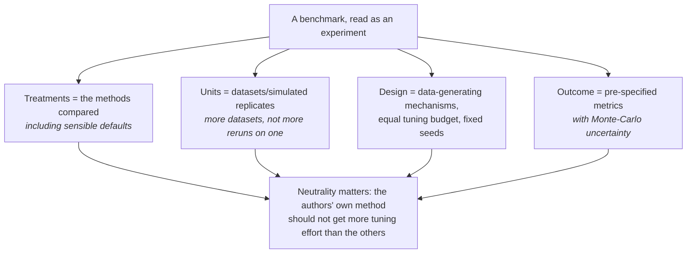
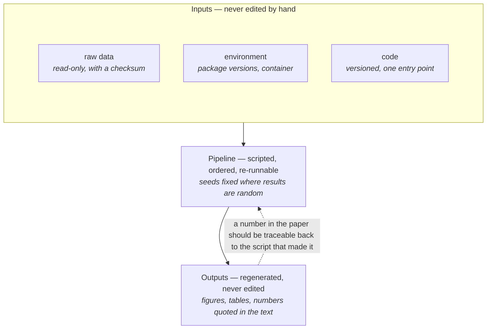
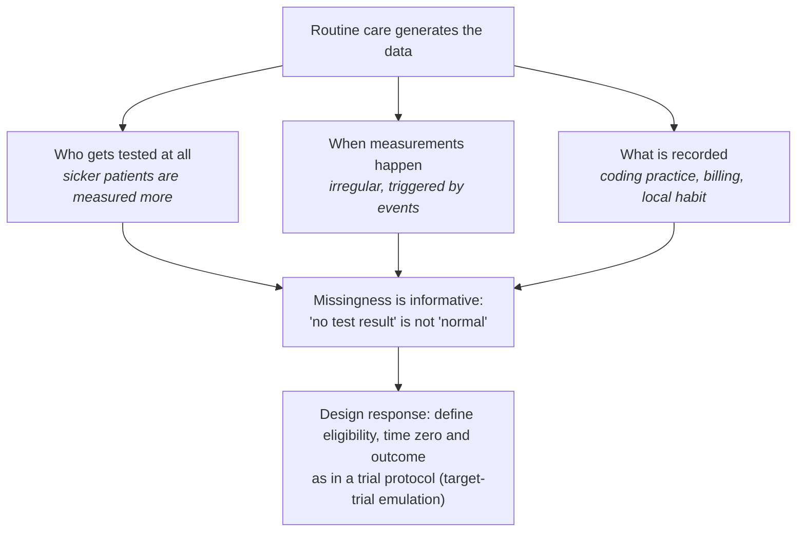
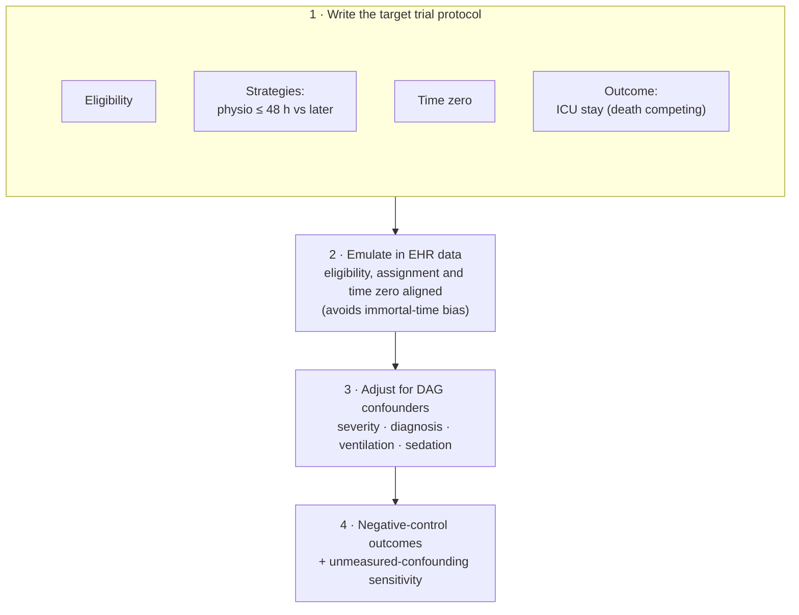
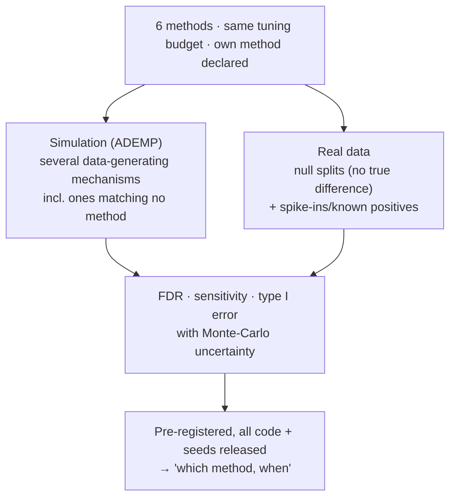
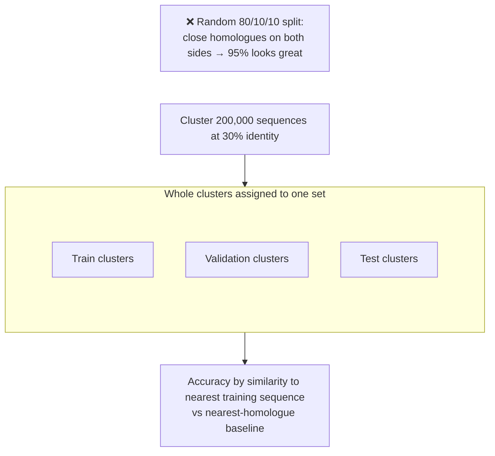

# Chapter 22 — Bioinformatics, Computational Biology and Data Science

> **Part IV — Field Playbooks**
> [← Chapter 21](21-proteomics-metabolomics-multiomics.md) · [Table of Contents](../README.md) · [Next: Chapter 23 — Clinical and Preclinical Research →](23-clinical-and-preclinical.md)

---

## 🧭 Learning Objectives

After this chapter you will be able to:

1. Treat computational studies — benchmarks, simulations, analyses of public data — as **designed experiments**.
2. Plan a neutral benchmark from purpose to metrics.
3. Build reproducibility into a computational project from day one.
4. Recognize leakage, confounding and selection problems in data-science projects on biological and health data.
5. Know when an online/digital experiment (A/B test) is the right design.

**Dominant question types:** measurement (Q8), predictive (Q5), associational (Q4).

---

## 🎯 The Big Picture

"The data already exist, so design doesn't apply" is the most common misconception in
computational biology. Design shows up in three forms:

1. **Computational experiments** — benchmarks and simulation studies (Chapter 15).
2. **Data splits** for predictive modelling (Chapter 12).
3. **Analyses of observational data** standing in for experiments (Chapter 11).

And one new form: **the analysis pipeline itself**, whose many tunable choices can be
exploited, deliberately or not, unless they are fixed and recorded.

---

## 🧠 Core Intuition — the computational playbook

### 1. Benchmarks are experiments

| Experimental concept | Benchmark equivalent |
|---|---|
| treatments | methods (and their parameter settings) |
| units | datasets |
| outcome | performance metrics |
| ground truth | simulations, spike-ins, mixtures, reference samples |
| bias control | neutrality, pre-specified protocol, fair tuning |
| replication | many datasets spanning realistic conditions |

[@weber2019; @mangul2019; @boulesteix2013]. Community resources with truth sets exist for
variant calling [@krusche2019], metagenomic classification [@ye2019] and single-cell
integration [@luecken2022; @tran2020].



### 2. Simulation studies: ADEMP

Aims, Data-generating mechanisms, Estimands, Methods, Performance measures — specified in
advance, with the number of repetitions chosen from the acceptable Monte-Carlo error
[@morris2019].

### 3. Reproducibility is a design requirement

- Version control; recorded software environments (containers/conda); workflow managers.
- A clear project structure separating raw data, code, results and documents [@noble2009].
- Random seeds recorded; parameters in config files, not hard-coded.
- FAIR data deposition [@wilkinson2016]; ten simple rules for reproducible research
  [@sandve2013]; community software infrastructures such as Bioconductor [@huber2015].
- Avoid silent data corruption. Spreadsheet software converted gene symbols (e.g. *SEPT2*,
  *MARCH1*) to dates in roughly one-fifth of papers with supplementary gene lists that were
  examined [@ziemann2016].



### 4. Data science on biological and health data

- **Leakage** (Chapter 12) [@kapoor2023; @whalen2022].
- **Confounding by acquisition:** site, scanner, batch or date correlated with the label;
  harmonization helps only when the design allows it [@hu2023].
- **Selection:** who is in an EHR dataset or biobank is not random. Define the target
  population (Chapter 9).
- **Reporting standards:** DOME [@walsh2021], ML reproducibility tiers [@heil2021], TRIPOD+AI
  [@collins2024]. Reproducibility of health ML is still limited [@beam2020; @mcdermott2021].



### 5. When you can intervene: online controlled experiments

Digital health apps, reminder systems and decision-support tools can be evaluated by
**A/B tests**: randomize users (or clinics) to versions, pre-specify metrics, check that the
sample-ratio matches the design, and avoid "peeking" at results repeatedly [@kohavi2020].
All of Part II applies.

---

## 👁️ Visual Intuition — a reproducible project skeleton

```
project/
├── data/raw/          ← read-only, never edited
├── data/processed/    ← produced by code only
├── code/              ← scripts / workflow (Snakemake, Nextflow, targets)
├── config/            ← parameters, seeds, sample sheets
├── results/           ← figures, tables (regenerable)
├── env/               ← environment.yml / Dockerfile
└── README.md          ← how to rerun everything
```

---

## 🔬 Worked Example — designing a neutral benchmark

**Question (Q8):** which differential-abundance method controls false discoveries best in
microbiome data?

1. **Purpose and scope:** methods for 16S count tables, two-group comparisons. State the
   conclusions you want to be able to draw.
2. **Methods:** all widely used methods meeting predefined criteria, run with the authors'
   recommended settings (or equal tuning effort for all).
3. **Datasets:**
   - **Null datasets:** real data assigned to two fake groups at the independent-unit level,
     preserving any blocks/clusters → a randomization null benchmark. Splitting
     correlated samples as if independent would build an invalid null into the benchmark.
   - **Spiked datasets:** known taxa artificially altered by known amounts → sensitivity.
   - **Simulations** from more than one simulator, to avoid favouring one model.
   - Several sequencing depths and sample sizes.
4. **Metrics:** false-discovery proportion, sensitivity, calibration of *p*-values, runtime.
5. **Replication:** many datasets × many random splits; report variability, not just means.
6. **Neutrality and transparency:** protocol written before running; code, containers and
   results public.

This mirrors the guidance in [@weber2019] and the simulation framework in [@morris2019].

---

## ⚠️ Common Misconceptions

| ❌ The misconception | ✅ What is actually true — and what to do |
|---|---|
| **"Computational work doesn't need a protocol."** | Pipelines have dozens of choices. Pre-specify them or report all of them. |
| **"My simulator shows my method works."** | Simulations encode assumptions; use several and real data with truth. |
| **"Re-running gives the same results."** | Not without fixed versions, environments and seeds. |
| **"Public data are unbiased."** | They carry the design flaws of the original studies (batches, selection). |
| **"A/B tests are only for tech companies."** | Any digital intervention in health or education can be randomized. |

---

## 🧪 Spot the Flaw

> "We downloaded 12 public RNA-seq datasets of disease X vs controls, merged them, removed
> batch effects with ComBat, and trained a classifier with 10-fold cross-validation
> (AUC 0.95)."

<details>
<summary>▶ Diagnosis</summary>

- In many public datasets, **disease status is confounded with study** (some studies
  contain mostly cases). ComBat with unbalanced study × group removes biology or leaves batch
  [@nygaard2016].
- Random 10-fold CV mixes samples from the same study in training and test sets → the
  model can learn study signatures (leakage via batch).
- **Fix:** leave-one-study-out validation; check group balance per study; correct batches
  only within the training folds; report per-study performance.
</details>

---

## 🔎 The Reviewer's Perspective

- **"Is the code, environment and data available to rerun everything?"**
- **"For benchmarks: neutral? many datasets? fair tuning? ground truth?"**
- **"For ML: split at the right unit? external validation? confounders in acquisition?"**
- **"Were analysis choices pre-specified or reported exhaustively?"**

---

## 🛠️ Design Challenges

Three computational designs: a causal analysis of health records, a methods benchmark and
a machine-learning split. Computational studies are experiments too — for each, state
what is compared, on what, and what would make the comparison unfair. Then open the model
answer and its diagram.

### Challenge 1 · Health data science · ⭐⭐⭐ — early physiotherapy in the ICU

You will use 10 years of hospital EHR data to ask whether early physiotherapy shortens ICU
stay. Outline the design.

<details>
<summary>▶ A model design</summary>

- **Question type:** causal from observational data (Q4) → **target-trial emulation**
  [@hernan2016].
- **Protocol:** eligibility (adult ICU admissions meeting criteria), strategies (start
  physiotherapy within 48 h vs later/never), time zero (ICU admission + eligibility),
  outcome (ICU length of stay, competing risk of death), follow-up, causal contrast.
- **Confounders** (DAG): severity scores, diagnosis, age, sedation, ventilation, staffing
  period.
- **Bias checks:** negative-control outcomes; sensitivity analyses for unmeasured
  confounding.
- **Reproducibility:** versioned extraction queries, code and environment; pre-registered
  analysis plan.


</details>

### Challenge 2 · Bioinformatics · ⭐⭐ — which differential-abundance method?

Your group wants to recommend a method for differential abundance analysis of microbiome
data. Six published methods are candidates, one of which your group developed. Design a
neutral benchmark.

<details>
<summary>▶ A model design</summary>

- **ADEMP** (Chapter 15) for the simulation part: **Aims** (false-positive control and power
  under compositionality); **Data-generating mechanisms** (several, including ones that do
  *not* match any method's assumptions — e.g. resampling real datasets and spiking in known
  effects); **Estimands** (which taxa truly differ); **Methods** (all six, at defaults *and*
  with equal tuning effort); **Performance measures** (false discovery rate, sensitivity,
  type I error under the null), with Monte-Carlo uncertainty.
- **Real data too:** several public datasets with **no true differences** (e.g. random
  splits of one group) to check false positives, and datasets with known positives.
- **Neutrality:** pre-register the design; give the same tuning budget to every method;
  ideally include the other methods' authors or report your own method's conflict of interest
  explicitly.
- **Report** everything: code, versions, seeds, all results (not only the favourable settings).


</details>

### Challenge 3 · Machine learning for proteins · ⭐⭐ — homology leakage

You will train a deep-learning model that predicts enzyme function from protein sequence.
You have 200,000 annotated sequences. A random 80/10/10 split gives 95% accuracy on the test
set. The model will be used on **newly sequenced organisms**, whose proteins are often only
distantly related to anything in the training data.

<details>
<summary>▶ A model design</summary>

- **The leak:** proteins in the test set have close homologues (near-identical sequences)
  in the training set, so the model can succeed by **recognizing relatives**, not by learning
  function. This is the protein version of related lines or repeated patients (Chapter 12).
- **Split by sequence clusters:** cluster all sequences at a low identity threshold (e.g.
  30% identity, using a tool such as MMseqs2 or CD-HIT) and assign **whole clusters** to
  train, validation or test.
- **Report accuracy as a function of similarity** to the nearest training sequence — users
  need to know how fast performance drops for distant proteins.
- **Baseline:** compare with a simple nearest-homologue (BLAST-like) annotation; a deep model
  that does not beat it on distant proteins adds little.
- **Optional external test:** proteins from a newly sequenced clade added to the databases
  after the training data were frozen.


</details>

---

## ✅ Check Your Understanding

**⭐ Q1.** Map treatments, units and outcomes onto a benchmark.

**⭐ Q2.** What does ADEMP stand for?

**⭐⭐ Q3.** Why are "null datasets" made by randomly splitting real data useful in
benchmarks?

**⭐⭐ Q4.** Name four elements of a reproducible computational project.

**⭐⭐⭐ Q5.** A model trained on public data from 12 studies performs well in random CV but
poorly on a new hospital's data. Give a design diagnosis and a better validation scheme.

---

## 📝 Sample Answers & Assessment

<details>
<summary>▶ Show sample answers</summary>

> **Q1 — Sample answer:** *"Treatments = methods, units = datasets, outcomes = metrics."* —
**✔ 10/10.**

> **Q2 — Sample answer:** *"Aims, Data, Estimands, Methods, Performance."* — **✔ 10/10.**

> **Q3 — Sample answer:** *"Because we know there is no true difference, so every
discovery is false."* — **✔ 10/10.** And the data keep real-world structure that
simulations may miss.

> **Q4 — Sample answer:** *"Git, conda, seeds, README."* — **✔ 9/10.** Add a workflow
manager and read-only raw data.

> **Q5 — Sample answer:** *"Overfitting."* — **◑ 4/10.** More specific: random CV mixed
samples from the same studies (and their batch signatures) across folds, so it measured
within-study performance. **Leave-one-study-out** (or train on some studies, test on
others) estimates performance on new sites.

**Rubric:** computational answers need the computational *unit* (dataset, study, site) and
the *truth* against which performance is judged.
</details>

---

## 🧾 Chapter Summary

| Concept | One-line takeaway |
|---|---|
| **Benchmarks** | Experiments with methods as treatments and datasets as units. |
| **Simulations** | ADEMP; several simulators; real truth sets too. |
| **Reproducibility** | Versions, environments, seeds, workflows, FAIR data. |
| **Data science** | Leakage, acquisition confounding and selection are design issues. |
| **A/B tests** | When you can randomize digital interventions, do. |

**Traps to remember:** own-simulator benchmarks · Excel gene names · random CV across
studies · unrecorded seeds.

### 📇 Design Card — field checklist

| Item | Done? |
|---|---|
| Protocol/analysis plan written before running | |
| Ground truth and datasets (benchmarks) | |
| Split strategy at the right unit (ML) | |
| Environment, versions, seeds recorded | |
| Code and data release plan | |

---

## 🔗 Go Deeper

- 📘 Biostat course: [Ch. 23 — Data Leakage](https://github.com/MdRasheduz-zaman/biostatistics/blob/main/chapters/23-data-leakage.md) · [Ch. 40 — Thinking Like an AI Evaluator](https://github.com/MdRasheduz-zaman/biostatistics/blob/main/chapters/40-ai-evaluator.md)
- More: [@kass2016; @chicco2017; @luo2016]

<!-- REFS -->

---

[← Chapter 21](21-proteomics-metabolomics-multiomics.md) · [Table of Contents](../README.md) · [Next: Chapter 23 — Clinical and Preclinical Research →](23-clinical-and-preclinical.md)
