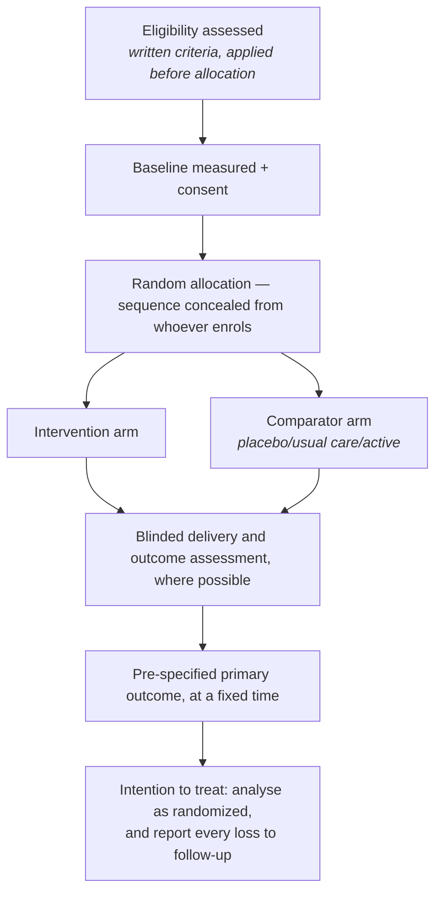
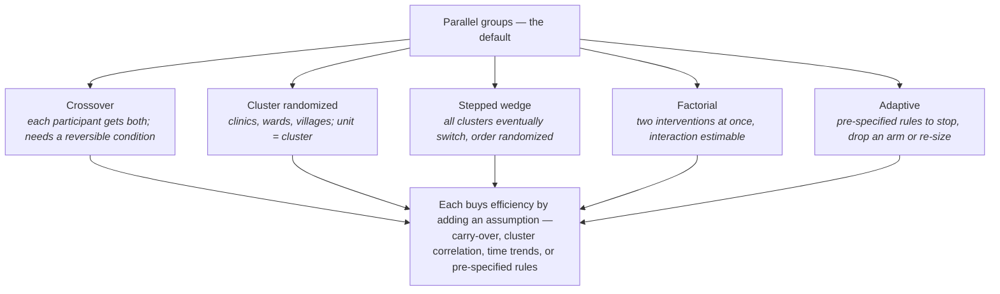
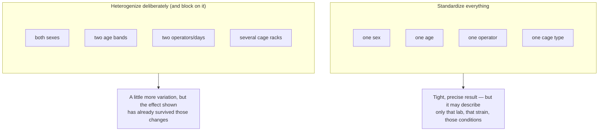
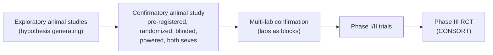
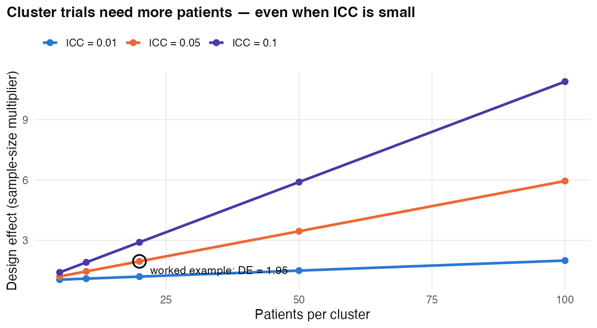
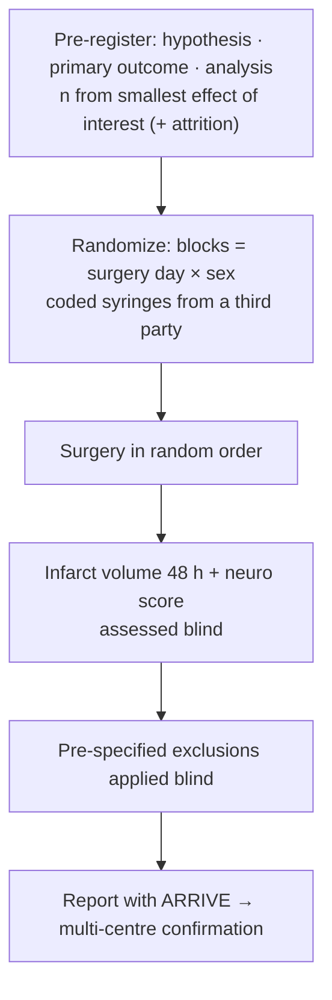
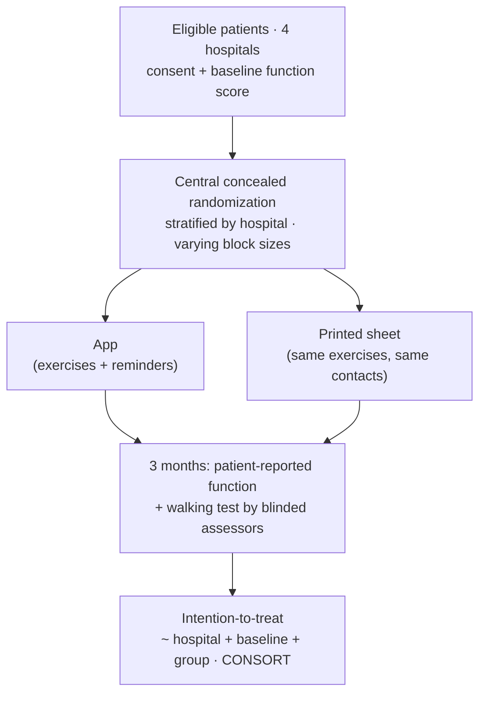
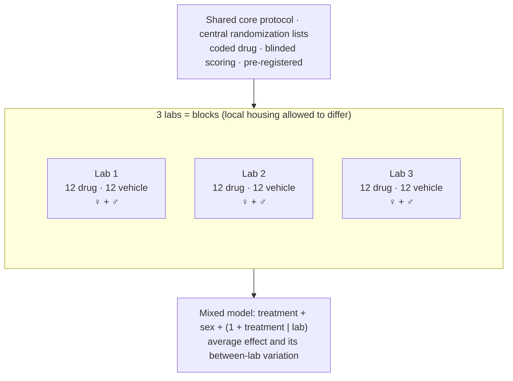

# Chapter 23 — Clinical and Preclinical (Animal) Research

> **Part IV — Field Playbooks**
> [← Chapter 22](22-computational-and-data-science.md) · [Table of Contents](../README.md) · [Next: Chapter 24 — Neuroscience →](24-neuroscience.md)

---

## 🧭 Learning Objectives

After this chapter you will be able to:

1. List the core elements of a randomized controlled trial and the documents that fix them (protocol, SAP).
2. Size a **cluster-randomized** trial using the design effect.
3. Describe adaptive designs and master protocols (umbrella, basket, platform).
4. Apply the ARRIVE "Essential 10" to an animal study, including cage, litter and sex.
5. Explain why **designed heterogeneity** can improve the reproducibility of preclinical results.
6. Distinguish an assignment comparison from missing-data assumptions and turn a protocol into an auditable analysis plan.

**Dominant question types:** comparative (Q2), associational (Q4), predictive (Q5), measurement (Q8).

---

## 🎯 The Big Picture

Clinical trials are the most codified experiments in biology, because their errors cost
lives. Preclinical animal studies sit between the bench and the clinic, and their design
quality strongly affects whether findings translate. Many failures of translation trace
back to small, unrandomized, unblinded animal studies and to publication bias
[@crossley2008; @sena2010; @begley2015].

---

## 🧠 Core Intuition — the clinical playbook

### 1. Core RCT elements

- **Unpredictable allocation sequence** and **allocation concealment** [@schulz2002].
- **Blinding** of participants, care providers, outcome assessors and analysts where feasible.
- **Pre-specified primary outcome and analysis**, intention-to-treat principle.
- **Protocol (SPIRIT)** [@chan2013] and a **statistical analysis plan** fixed before
  unblinding [@gamble2017]; report with **CONSORT 2025** [@hopewell2025; @schulz2010].
- Covariate adjustment and subgroup analyses pre-specified; subgroup claims require
  interaction tests [@pocock2002].
- Before trial registration became routine, outcome switching was common [@chan2004].

### Before fitting: question, population, follow-up and contrast

An intention-to-treat assignment comparison preserves analysis by randomized group; it does not
recover missing outcomes or automatically specify every intercurrent-event strategy. A participant
who stops treatment can still contribute a later outcome. For a treatment-policy question, plan to
collect relevant measurements after discontinuation and rescue.

Read the protocol and SAP together. Check the endpoint/time/units, analysis population, missingness
assumptions, model and intended contrast, multiplicity/interim rules, and versioned deviations.
A model can run successfully while estimating the wrong quantity. In a treatment-by-visit model,
the main treatment coefficient alone need not estimate the final-visit contrast.

The [clinical-study biostatistics sub-course](../subcourses/clinical-trials/README.md) takes this
chapter further over eight modules: visual walkthroughs of the trial lifecycle, a SAP worksheet,
worked power calculations, missing-data exercises, repeated-measures models and an integrated
clinical audit. It also develops preclinical studies, Phases I–IV, trial layouts and the
superiority / non-inferiority / equivalence claims.

### 2. Design variants

| Design | Use | Key issue |
|---|---|---|
| **Parallel group** | standard | — |
| **Cluster-randomized** | intervention acts on wards, practices, villages | inflate *n* by design effect |
| **Crossover** | stable, reversible conditions | washout, carry-over [@senn2004] |
| **Adaptive** | pre-planned interim changes (sample size, arms, allocation) | error control, pre-specification [@pallmann2018; @thorlund2018] |
| **Master protocols** | umbrella (one disease, many drugs), basket (one drug, many diseases), platform (arms added/dropped) | shared controls and infrastructure [@woodcock2017] |
| **Pilot/feasibility** | before a main trial | sized for feasibility and variance, not effect [@julious2005; @whitehead2016] |

Other designs: observational studies (STROBE) [@vonelm2007], diagnostic accuracy (STARD)
[@bossuyt2015], AI interventions (CONSORT-AI) [@liu2020].

## 🧠 Core Intuition — the preclinical playbook

### 3. ARRIVE Essential 10

Study design, sample size, inclusion/exclusion criteria, randomization, blinding,
outcome measures, statistical methods, experimental animals, experimental procedures,
results [@percie2020; @kilkenny2010]. Use them as a **design checklist**, not just a
reporting form. Core-set recommendations [@landis2012] and design guidance
[@festing2002; @lazic2016] cover the same ground.

### 4. Units and nuisance factors specific to animals

- **Cage** is the assignment unit when treatment is delivered to the whole cage
  through food/water. For individual assignment, cage is a clustering factor;
  interaction or microbial spillover can also change the treatment effect being estimated.
- **Litter** is the unit for maternal/prenatal exposures [@holson1992; @lazic2018].
- **Sex as a biological variable** — include both sexes unless justified [@clayton2014; @beery2011].
- Behavioural tests: order, time of day, experimenter, strain [@crawley1999].

### 5. Standardization versus heterogenization

Highly standardized conditions make results specific to one narrow situation — the
"standardization fallacy" [@richter2009]. **Multi-laboratory or multi-batch designs**, where
labs/batches act as blocks, improve the reproducibility of results [@voelkl2018]. Field
guidelines exist, e.g. for cardioprotection [@botker2018] and neuroscience [@steward2014].

---

## 👁️ Visual Intuition — from animal to patient

---

## 🔬 Worked Example — sizing a cluster-randomized trial

A clinic-level intervention aims to raise the proportion of patients reaching a blood
pressure target from **15% to 30%**.

1. **Individually randomized trial:** `power.prop.test(p1 = 0.30, p2 = 0.15, power = 0.8)`
   → **121 patients per arm**.
2. **Clusters:** about 20 patients per clinic, ICC = 0.05 → design effect = 1 + (20 − 1) × 0.05
   = **1.95**.
3. **Cluster trial:** 121 × 1.95 ≈ **236 patients per arm** → **12 clinics per arm**
   (24 clinics).
4. **Approximation:** the design-effect calculation is a starting point. Verify power
   for the planned analysis, clinic-size variation and plausible ICCs; round for attrition
   at both clinic and patient levels. More patients within a few clinics cannot replace
   more randomized clinics.
5. **Design choices:** stratify clinic randomization by size or region; analyse with
   clinic as a random effect (or cluster-level summaries); report with the CONSORT
   extension for cluster trials.

The cluster design needs nearly **twice** the patients — the clinical counterpart of
pseudoreplication (Chapter 3). (Code: `scripts/course/worked_examples.R`.)

---

## ⚠️ Common Misconceptions

| ❌ The misconception | ✅ What is actually true — and what to do |
|---|---|
| **"ITT solves missing outcomes."** | It preserves the assignment comparison; estimation still needs an appropriate observation/missingness strategy. |
| **"A mixed model makes missingness harmless."** | Likelihood inference depends on the model and observation assumptions; assess plausible departures. |
| **"Noncompliance has one universal sample-size inflation factor."** | A dilution formula requires assumptions about switching, effect, variance and the targeted comparison. |
| **"Randomization makes allocation concealment unnecessary."** | A predictable sequence can be subverted. Concealment protects randomization. |
| **"Subgroup with *p* < 0.05 = differential effect."** | Requires an interaction test and pre-specification. |
| **"Animal studies are exploratory, so rigour can wait."** | Confirmatory claims need confirmatory designs. |
| **"Using only males keeps things simple."** | It leaves half the population unstudied and limits generalizability; sex should be designed in as a variable [@clayton2014; @beery2011]. |
| **"Maximal standardization = maximal reproducibility."** | It can do the opposite [@richter2009; @voelkl2018]. |

---

## 🧪 Spot the Flaw

> "Pregnant dams (n = 4 per group) received drug or vehicle. Offspring behaviour was tested
> at 8 weeks (n = 32 pups per group, males only). Testing was performed by the
> investigator who treated the dams. Drug-exposed pups showed reduced anxiety (*p* = 0.002)."

▶ Diagnosis

- The **dam (litter)** received the treatment → *n* = 4 per group, not 32 [@holson1992].
- **Males only** → limited generalization.
- **Unblinded tester** for a behavioural outcome.
- **Fix:** more litters (e.g. 10+ per group), litter as unit or random effect, both sexes,
  blinded testing in randomized order, pre-registered primary outcome.

---

## 🔎 The Reviewer's Perspective

- **Trials:** "Sequence generation? Concealment? Blinding? Registered primary outcome? SAP?"
- **Cluster trials:** "Design effect and ICC assumptions?"
- **Animals:** "ARRIVE Essential 10? Cage/litter? Both sexes? Blinded outcome assessment?"
- **Translation:** "Is the animal study confirmatory or exploratory — and labelled as such?"

---

## 🛠️ Design Challenges

Three translational designs: a confirmatory animal study, a pragmatic clinical trial and a
multi-centre preclinical study. For each, write down the primary outcome, the unit, the
randomization and who is blinded — then open the model answer and its diagram.

### Challenge 1 · Preclinical neurology · ⭐⭐ — a confirmatory stroke study

Plan a confirmatory mouse study of a neuroprotective drug after experimental stroke.

▶ A model design

- **Primary outcome:** infarct volume at 48 h (blinded image analysis); secondary:
  neurological score (blinded).
- **Sample size:** smallest effect of interest (e.g. 20% reduction), SD from prior data,
  α = 0.05, 80–90% power; inflate for expected mortality/exclusions with pre-specified
  exclusion criteria.
- **Randomization:** computer-generated, concealed (third party prepares coded syringes),
  stratified by sex; surgery order randomized.
- **Blocks:** surgery day/surgeon as blocks; both sexes; mice single-randomized but
  cage-balanced.
- **Pre-registration** of hypothesis, outcome and analysis; report with ARRIVE.
- **Next step:** a multi-centre confirmation (labs as blocks) before clinical translation.

### Challenge 2 · Rehabilitation medicine · ⭐⭐ — an app after knee surgery

A hospital network wants to know whether a home-exercise **app** improves function 3 months
after knee replacement, compared with the usual printed exercise sheet. Patients cannot be
blinded to which they use. There are 4 hospitals. Design the trial.

▶ A model design

- **Pragmatic RCT**, patient-level randomization (patients at the same hospital can use
  different tools without much contamination), **stratified by hospital** with permuted blocks
  of varying size, concealed via a central web system.
- **Primary outcome:** a validated patient-reported function score at 3 months, plus an
  **objective** secondary outcome (e.g. timed walking test) measured by **assessors blinded**
  to the allocation — important because patients and therapists cannot be blinded.
- **Comparator:** the printed sheet with the same exercises and the same number of contacts,
  so the comparison isolates the app's delivery and reminders.
- **Analysis:** intention-to-treat, `score_3m ~ hospital + baseline_score + group`; report
  adherence and app use separately.
- **Report** with CONSORT; pre-register.

### Challenge 3 · Preclinical pharmacology · ⭐⭐⭐ — does the effect survive other labs?

A drug reduced anxiety-like behaviour in one lab's mice. Before a costly next step, three labs
will repeat the experiment. Each lab can test 24 mice. Labs differ in housing, handling and
strain sources. Design the multi-centre study so it tells you whether the effect is
**robust**.

▶ A model design

- **Labs are blocks** (Chapter 23: heterogenization): each lab tests **12 drug + 12 vehicle**,
  randomized within lab, with the **same core protocol** (dose, timing, primary outcome,
  exclusion rules) — but deliberately **not** forced to identical housing, which is the
  variation the result must survive.
- **Both sexes** in every lab (6 + 6 per group), and, if useful, two strains across labs.
- **Central randomization lists**, coded drug supplied centrally; outcome scoring blinded;
  data analysed centrally.
- **Analysis:** a mixed model `outcome ~ treatment + sex + (1 + treatment | lab)` — the
  **treatment × lab** variance shows how much the effect varies between labs, and the
  confidence interval for the treatment effect includes that variation.
- **Pre-register** the hypothesis and analysis; report with ARRIVE.

---

## ✅ Check Your Understanding

**⭐ Q1.** List five core elements of an RCT.

**⭐ Q2.** What are umbrella, basket and platform trials?

**⭐⭐ Q3.** Clinics of 30 patients, ICC = 0.02. An individually randomized design needs
200 per arm. How many per arm in the cluster design?

**⭐⭐ Q4.** Why is the litter the unit for prenatal exposures?

**⭐⭐⭐ Q5.** Argue for or against running a confirmatory preclinical study in three
laboratories rather than one, with the same total number of animals.

---

## 📝 Sample Answers & Assessment

▶ Show sample answers

> **Q1 — Sample answer:** *"Randomization, concealment, blinding, pre-specified outcome,
ITT."* — **✔ 10/10.**

> **Q2 — Sample answer:** *"Umbrella: one disease, several drugs; basket: one drug,
several diseases; platform: arms added and dropped over time."* — **✔ 10/10.**

> **Q3 — Sample answer:** *"DE = 1 + 29 × 0.02 = 1.58 → 316 per arm."* — **✔ 10/10.**
(≈ 11 clinics per arm.)

> **Q4 — Sample answer:** *"Because the mother was treated."* — **✔ 9/10.** And pups share
genetics and maternal environment, so they are correlated sub-units.

> **Q5 — Sample answer:** *"For: results generalize better. Against: more variability."* —
**◑ 7/10.** Refine: with labs as **blocks**, between-lab variation is removed from the
treatment comparison, so precision need not suffer much, while the estimate now applies
across labs — evidence suggests this improves reproducibility [@voelkl2018]. Costs:
coordination and protocol harmonization.

**Rubric:** clinical/preclinical answers need the unit, concealment/blinding and
pre-specification.

---

## 🧾 Chapter Summary

| Concept | One-line takeaway |
|---|---|
| **RCT core** | Sequence, concealment, blinding, pre-specified outcome and SAP. |
| **Clusters** | Inflate by 1 + (m − 1)ρ. |
| **Modern designs** | Adaptive, umbrella, basket, platform — all pre-specified. |
| **ARRIVE 10** | Design checklist for animal studies. |
| **Animal units** | Cage, litter; both sexes. |
| **Heterogenization** | Multi-lab designs improve generalizability. |

**Traps to remember:** pups as *n* · unconcealed allocation · unregistered outcomes ·
males only · single-lab "confirmation".

### 📇 Design Card — field checklist

| Item | Done? |
|---|---|
| Protocol/SAP (SPIRIT) or ARRIVE plan | |
| Sequence generation and concealment | |
| Blinding at each stage | |
| Unit (patient/cluster/cage/litter) and design effect | |
| Registration/pre-registration | |

---

## 🔗 Go Deeper

- 📘 Biostat course: [Ch. 37 — Evidence Hierarchies](https://github.com/MdRasheduz-zaman/biostatistics/blob/main/chapters/37-evidence-hierarchies.md) · [Ch. 39 — Survival Analysis](https://github.com/MdRasheduz-zaman/biostatistics/blob/main/chapters/39-survival-analysis.md)
- More: [@macleod2015; @kilkenny2009; @page2021]

<!-- REFS -->

---

[← Chapter 22](22-computational-and-data-science.md) · [Table of Contents](../README.md) · [Next: Chapter 24 — Neuroscience →](24-neuroscience.md)
