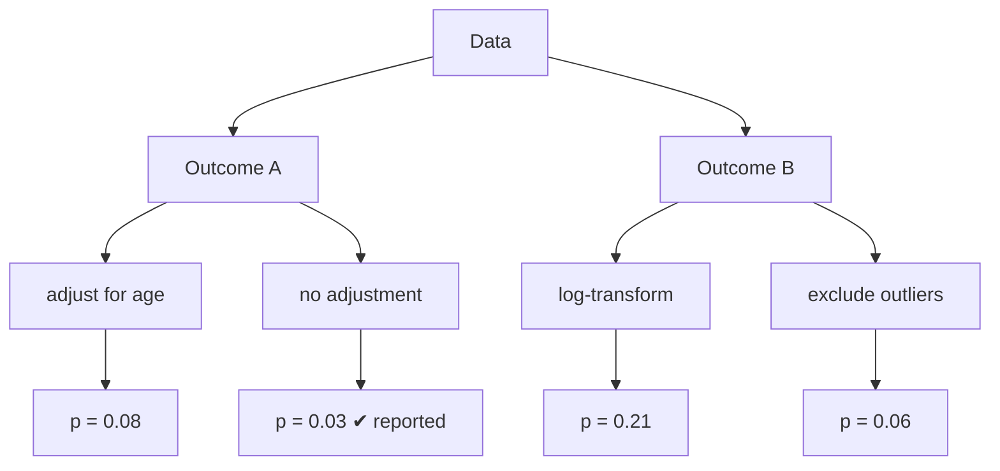
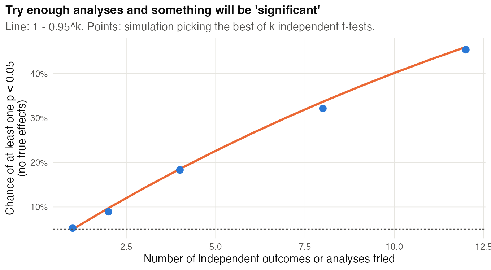
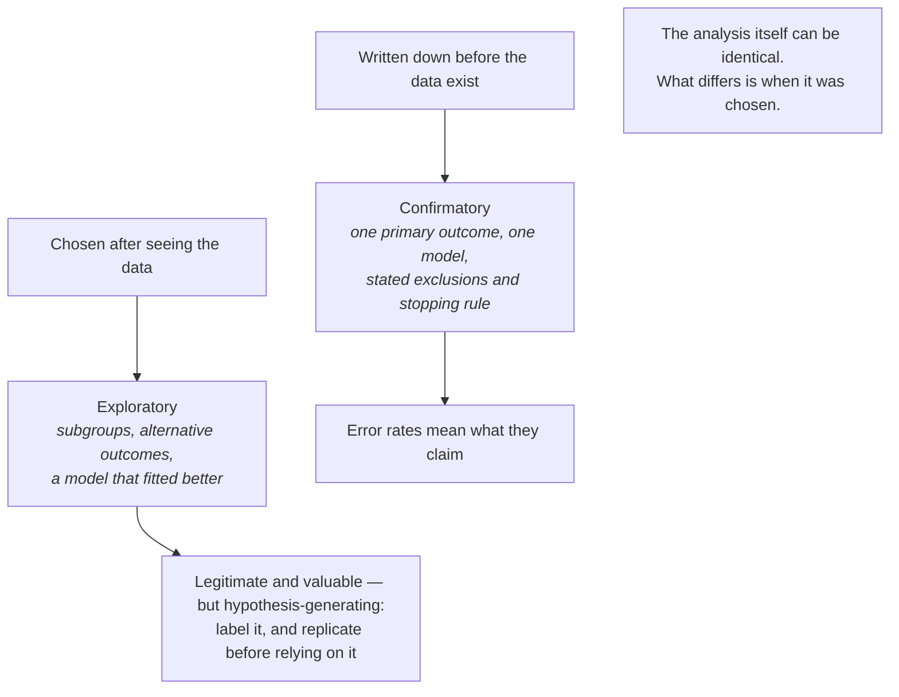
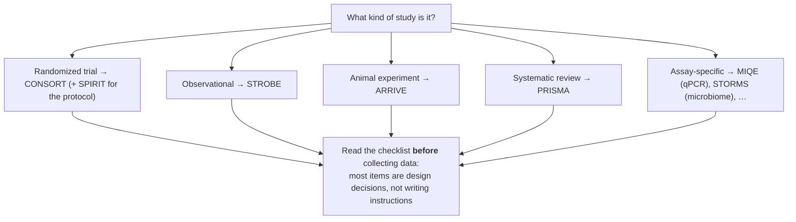
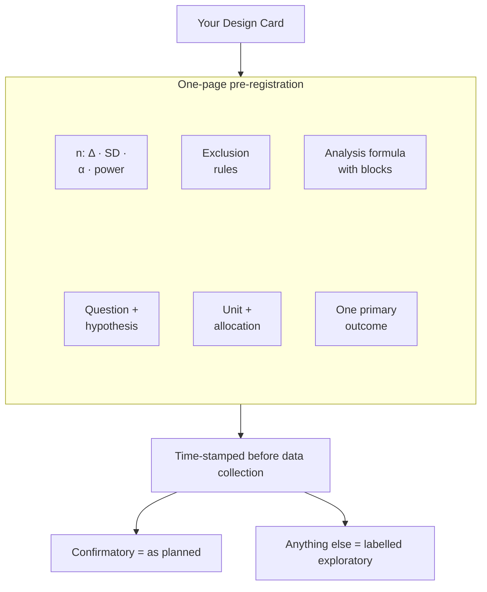
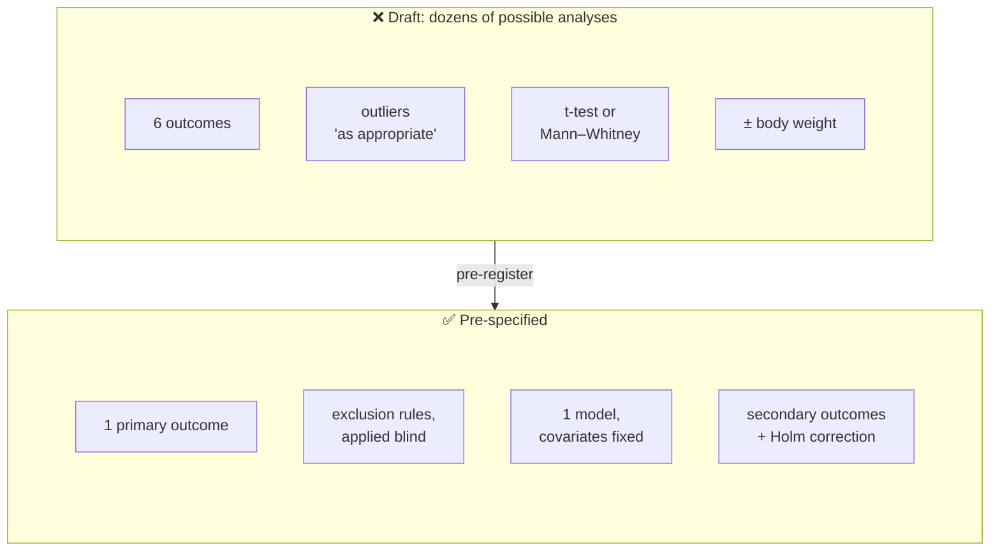
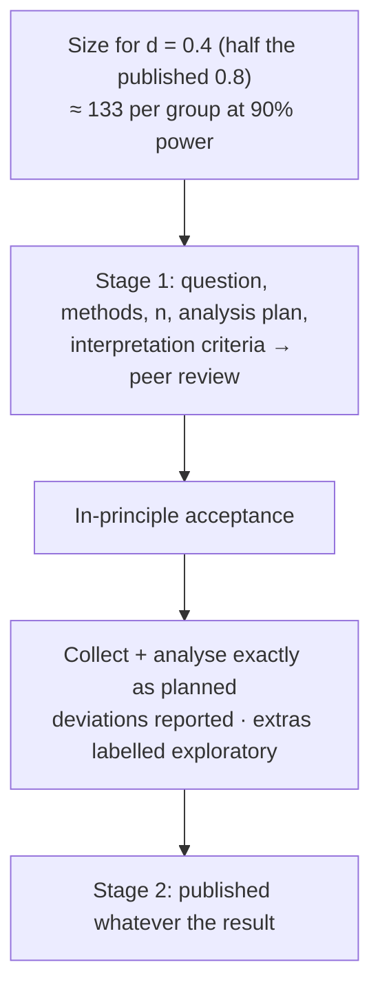

# Chapter 25 — Pre-registration, Analysis Plans and Reporting Guidelines

> **Part V — From Plan to Paper**
> [← Chapter 24](24-neuroscience.md) · [Table of Contents](../README.md) · [Next: Chapter 26 — Capstone: The Design Clinic →](26-capstone-design-clinic.md)

---

## 🧭 Learning Objectives

After this chapter you will be able to:

1. Explain how undisclosed analytic flexibility inflates false positives.
2. Write a minimal **pre-registration** or **statistical analysis plan** (SAP).
3. Distinguish confirmatory from exploratory analyses — and report both honestly.
4. Choose the right **reporting guideline** for a study and use it as a design checklist.
5. Report estimates with uncertainty rather than significance alone.

---

## 🎯 The Big Picture

A design is not finished until the **analysis** is fixed. Every dataset allows many
defensible analyses: which outcome, which covariates, which exclusions, which transformation,
when to stop collecting. If these choices are made *after* seeing the data, almost any result
can be made significant [@simmons2011]. Before trial registration became routine, primary
outcomes in published trials frequently differed from those in the protocols [@chan2004].

Pre-specification closes this gap. It does not forbid exploration; it makes the
**difference between confirmation and exploration visible** [@nosek2018; @munafo2017].

---

## 🧠 Core Intuition

### The garden of forking paths

Each path is defensible. Choosing the path *because* it gives *p* < 0.05 turns a 5% error
rate into something much larger.

### Tools for pre-specification

| Tool | Where | What it fixes |
|---|---|---|
| **Trial registration** | clinical trials (required) | primary outcome, design |
| **Protocol (SPIRIT)** | trials | full methods [@chan2013] |
| **Statistical analysis plan** | trials and large studies | models, covariates, missing data, multiplicity [@gamble2017] |
| **Pre-registration** | any study (e.g. OSF, AsPredicted) | hypotheses, design, analysis |
| **Registered report** | journals | peer review *before* data collection; acceptance in principle |

### Confirmatory versus exploratory

Both are valuable. Problems arise only when exploratory results are **presented as**
confirmatory ("HARKing" — hypothesizing after the results are known). Label them clearly
and test exploratory findings in new data.

### Estimation over dichotomies

Report effect sizes with confidence intervals; treat *p*-values as continuous evidence and
avoid "significant/non-significant" as the conclusion [@wasserstein2016; @halsey2015; @cumming2007].
Absence of evidence is not evidence of absence [@altman1995].

### Reporting guidelines are design checklists

Each item in ARRIVE, CONSORT, STROBE, MIQE, STORMS or TRIPOD+AI corresponds to a design
decision. Read the relevant one **before** the experiment — see
[Appendix C](A3-reporting-guidelines.md).

---

## 👁️ Visual Intuition — a minimal pre-registration

| Section | One or two sentences |
|---|---|
| Question & hypothesis | |
| Question type (Q1–Q8) | |
| Design (units, groups, blocks, randomization, blinding) | |
| Primary outcome (exact measure, time point) | |
| Sample size and justification | |
| Exclusion rules | |
| Analysis model (formula), multiplicity handling | |
| Secondary/exploratory analyses (labelled) | |

---

## 🔬 Worked Example — pre-registering the diet study from Chapter 8

| Section | Entry |
|---|---|
| **Hypothesis** | A high-fibre diet reduces liver fat in C57BL/6 mice fed a Western diet. |
| **Type** | Q2 comparative. |
| **Design** | Cage-fed diets: cage is the assignment unit, 2 same-sex littermates per cage. Each litter/sex block supplies cages for both diets; randomize cages within blocks. Diet bags coded; MRI analyst blinded. Report mice, cages and litters separately. |
| **Primary outcome** | Liver fat fraction (%) by MRI at week 12. |
| **Sample size** | Illustrative assumptions: Δ = 3 points, SD = 4, ICC = 0.05, 2 mice/cage, α = 0.05, power 80%. Independent size 29/arm × DE 1.05 → 16 analyzable cages/arm. For 10% whole-cage loss, allocate ceiling(16/0.90) = 18 cages/arm (36 mice). Verify with the planned blocked analysis and plausible ICCs before collection. |
| **Missing outcomes and welfare** | Humane endpoints follow the approved animal protocol; record removals and reasons by arm. Outcomes unavailable at week 12 are missing, not silently discarded. State the missing-data assumptions and sensitivity analyses; assess whether treatment-related removals change the target question. |
| **Analysis** | For this layout: `fat ~ diet + sex + factor(litter) + (1 \| cage)` with globally unique cage IDs; report diet contrast and 95% CI using a small-sample method. Inspect cage means as a sensitivity analysis. State missing-data handling before unblinding. |
| **Exploratory** | Diet × sex interaction; liver transcriptomics (labelled exploratory). |

The crucial step is to record **how diet is delivered**. Splitting littermates between
diets does not make mice independent when each diet is shared by a cage. If mice were
individually fed without interference, an individual-level blocked calculation could
apply. The numbers above illustrate allocation and attrition rounding, not validated power
for every blocked mixed model. Replace the assumed ICC/SD with justified values and
save the simulation or calculation before finalizing the protocol.

---

## ⚠️ Common Misconceptions

| ❌ The misconception | ✅ What is actually true — and what to do |
|---|---|
| **"Pre-registration stops me from exploring."** | It labels exploration; it doesn't forbid it. |
| **"I can't pre-register basic research."** | A one-page plan of hypothesis, outcome, *n* and analysis is possible for most confirmatory experiments. |
| **"Deviations ruin a pre-registration."** | Report them transparently with reasons; that is still far better than undisclosed flexibility. |
| **"Reporting guidelines are for the end."** | They are most useful at the start. |
| **"*p* = 0.06 means no effect."** | Report the estimate and CI. |

---

## 🧪 Spot the Flaw

> "We measured 12 behavioural outcomes. Anxiety in the elevated plus maze differed
> significantly (*p* = 0.02), confirming our hypothesis that the knockout increases anxiety.
> Two outlier mice were excluded because their values were implausible."

▶ Diagnosis

- **12 outcomes, 1 significant:** about what chance alone would produce at α = 0.05 (12 ×
  0.05 = 0.6 expected false positives). No primary outcome specified.
- **"Confirming our hypothesis"** — likely hypothesized after the result (HARKing).
- **Post hoc exclusion** of outliers, not by a pre-specified rule.
- **Fix:** pre-register a primary outcome and exclusion rules; correct for multiplicity or
  treat secondary outcomes as exploratory; report all 12 outcomes.

---

## 🔎 The Reviewer's Perspective

- **"Was there a registration or pre-specified plan, and do the paper and the plan match?"**
- **"Are exploratory analyses labelled as such?"**
- **"Are all outcomes reported?"**
- **"Is the relevant reporting guideline followed?"**

---

## 🛠️ Design Challenges

Three pre-specification problems: your own plan, a plan full of forking paths, and a
replication. For each, decide what must be fixed **before** the data exist — then open the
model answer and its diagram.

### Challenge 1 · Your project · ⭐ — a one-page pre-registration

Write a minimal pre-registration (the table above) for your own Design Card project.

▶ What a good one looks like

It fits on one page; another researcher could run the analysis from it without asking
you anything; the primary outcome is a single, precisely defined measure; the sample size
has all four ingredients (Chapter 8); exclusions are rules, not judgements; and the
analysis formula includes the blocks and the unit structure of the design.

### Challenge 2 · Behavioural neuroscience · ⭐⭐ — pruning the forking paths

A lab plans to test whether a probiotic reduces anxiety-like behaviour in mice. Their
draft: "We will record time in open arms, open-arm entries, total distance, time in centre
(open field), latency to feed and marble burying, and remove outliers as appropriate. We will
use a *t*-test or a Mann–Whitney test depending on the data, and may adjust for body weight."
List the forking paths and write the pre-specified version.

▶ A model answer

- **Forking paths:** 6 outcomes × outlier rules × test choice × with/without covariate —
  dozens of possible analyses, and any one "significant" result could be reported
  (Chapter 25).
- **Pre-specified version:**
  - **One primary outcome:** % time in open arms of the elevated plus maze (or a
    pre-defined composite of all tests, with its formula written down).
  - **Secondary outcomes** listed, with a multiplicity correction (e.g. Holm), and reported
    whatever their results.
  - **Exclusions as rules:** e.g. mouse falls off the maze, tracking fails for > 10% of the
    session — decided blind to group; no "outliers as appropriate".
  - **One analysis:** `open_time ~ cage_block + sex + group` as a linear model (or a mixed
    model with cage), with body weight **either** always or never included — decided now.
  - **Effect size with 95% CI** as the main result, not only a *p*-value.

### Challenge 3 · Replication · ⭐⭐⭐ — a registered report

A published study (*n* = 15 per group) reported a large effect, *d* = 0.8, of a training
intervention on a memory score. You want to replicate it as a **registered report**. How
large should the replication be, and how does the registered-report process protect it?

▶ A model answer

- **Do not power for d = 0.8.** Small published studies that cleared *p* < 0.05 tend to
  overestimate effects (the winner's curse, Chapter 24). Power for a smaller, still relevant
  effect, e.g. **half the original, d = 0.4**: `power.t.test(delta = 0.4, sd = 1, power = 0.9)`
  gives **≈ 133 per group**. Powering for d = 0.8 would give only ≈ 34 per group — likely to
  miss a real but smaller effect.
- **Registered report, Stage 1:** introduction, methods, sample size, analysis plan and
  criteria for interpreting the result are peer-reviewed **before data collection**; if
  accepted ("in-principle acceptance"), the journal commits to publish regardless of the
  outcome.
- **Stage 2:** data are collected and analysed as planned; deviations are reported; extra
  analyses are labelled exploratory.
- **Interpretation planned in advance:** e.g. an equivalence test to decide whether the
  effect is smaller than the smallest effect of interest, so a null result is informative.

---

## ✅ Check Your Understanding

**⭐ Q1.** What is HARKing?

**⭐ Q2.** What is the difference between a pre-registration and a registered report?

**⭐⭐ Q3.** Why does undisclosed flexibility inflate false positives even when each choice is
reasonable?

**⭐⭐ Q4.** Which reporting guideline applies to (a) a mouse study, (b) a cohort study,
(c) a diagnostic test study, (d) an ML prediction model?

**⭐⭐⭐ Q5.** Your pre-registered primary analysis gives *p* = 0.09, but an exploratory
covariate adjustment gives *p* = 0.01. How do you report it?

---

## 📝 Sample Answers & Assessment

▶ Show sample answers

> **Q1 — Sample answer:** *"Hypothesizing after results are known."* — **✔ 10/10.**

> **Q2 — Sample answer:** *"Registered reports are reviewed before data collection."* —
**✔ 10/10.** And journals commit to publish regardless of results if the protocol is
followed.

> **Q3 — Sample answer:** *"Because you get many chances."* — **✔ 9/10.** Each path is a
separate test; picking the best of several tests inflates the overall error rate.

> **Q4 — Sample answer:** *"ARRIVE, STROBE, STARD, TRIPOD+AI."* — **✔ 10/10.**

> **Q5 — Sample answer:** *"Report the adjusted one because it's better."* — **✘ 2/10.**
Report the **pre-registered primary result** as primary (estimate, CI, *p* = 0.09), and the
adjusted analysis as exploratory/sensitivity, explaining why it was run. Readers can then
weigh both.

**Rubric:** full credit requires transparency about what was planned versus what was
not.

---

## 🧾 Chapter Summary

| Concept | One-line takeaway |
|---|---|
| **Forking paths** | Post hoc choices inflate false positives. |
| **Pre-specification** | Registration, protocol, SAP, pre-registration, registered reports. |
| **Exploration** | Valuable when labelled; test it in new data. |
| **Estimation** | Effects with CIs, not significance stars. |
| **Guidelines** | Use them as design checklists. |

**Traps to remember:** HARKing · outcome switching · post hoc exclusions · *p* = 0.06 as
"no effect".

### 📇 Design Card — final rows

| Field | Your answer |
|---|---|
| Primary outcome (exact) | |
| Analysis formula | |
| Exclusion rules | |
| Registration venue and reporting guideline | |

---

## 🔗 Go Deeper

- 📘 Biostat course: [Ch. 8 — Hypothesis Testing](https://github.com/MdRasheduz-zaman/biostatistics/blob/main/chapters/08-hypothesis-testing.md) · [Ch. 38 — Failure Modes](https://github.com/MdRasheduz-zaman/biostatistics/blob/main/chapters/38-failure-modes.md)
- Meta-science: [@ioannidis2005; @osc2015]

<!-- REFS -->

---

[← Chapter 24](24-neuroscience.md) · [Table of Contents](../README.md) · [Next: Chapter 26 — Capstone: The Design Clinic →](26-capstone-design-clinic.md)
