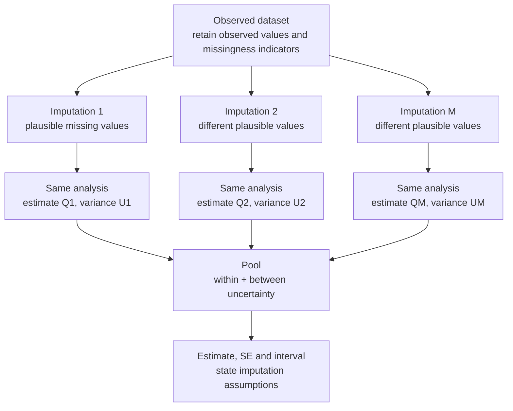

# Module 3 — Sample Size, Noncompliance and Missing Data

> **Sub-course: Clinical-Study Biostatistics**
> [← Module 2](02-estimands-analysis-plan-and-data-quality.md) · [Sub-course home](README.md) · [Next: Module 4 — Repeated Outcomes, Interim Analysis and Governance →](04-repeated-outcomes-interim-and-governance.md)

---

## 🧭 Learning Objectives

After this module you will be able to:

1. Separate three questions that are often merged: how large the study must be, what noncompliance does, and what missing data do.
2. Reproduce a sample-size calculation and state the assumptions that make its answer conditional.
3. Explain why inflating the sample size for dropout does not remove missingness bias.
4. Replace a menu of imputation methods with a reasoning sequence from estimand to sensitivity analysis.

---

## Sample size, noncompliance and missingness are separate questions

### A weight-loss example, worked

The notes specify mean weight losses of 30 versus 20 lb, SD = 20 lb, two-sided α = 0.05 and 80% power,
with equal allocation. The target difference is 10 lb. A normal approximation gives:

`n per arm ≈ 2 × (z[0.975] + z[0.80])² × SD² / difference²`

This gives about **62.79**, rounded to **63 per arm**, or 126 total. It is a teaching approximation.

| Assigned group | Initial illustrative n | Mean without switching | Switch to other treatment |
|---|---|---|---|
| A | 63 | 30 lb | 15% |
| B | 63 | 20 lb | 25% |

Read this table by assigned group. The initial sample size addresses a 10-lb difference, whereas
switching changes the anticipated contrast between assignment strategies under the simplified model.

Suppose 15% assigned to A receive B, and 25% assigned to B receive A. Under a simple full-switching
mixture model with unchanged treatment-specific means:

- Assignment-to-A mean: `0.85 × 30 + 0.15 × 20 = 28.5 lb`.
- Assignment-to-B mean: `0.25 × 30 + 0.75 × 20 = 22.5 lb`.
- Diluted assignment contrast: `28.5 − 22.5 = 6 lb`.
- Dilution factor: `1 − 0.15 − 0.25 = 0.60`.
- If SD stays 20, normal-approximation inflation: `1 / 0.60² = 2.7778`.
- Inflating 126 gives 350 total: 175 per arm.

This refers to **switching between parallel-trial treatments**, not a planned crossover-trial design.

### Why 350 is conditional

The calculation assumes the selected assignment effect is 6 lb and variance remains appropriate to
SD = 20. Switching may depend on prognosis or response; partial adherence, timing, carryover and
mixture variability can change the means and variance. Adding people does not remove bias in a
selected per-protocol comparison or restore the full treatment-received effect as the assignment
estimand.

For the same simplified SD and difference, R's two-sample t-test calculation gives about **175.39
per arm**, rounded to **176 per arm: 352 total**. The normal approximation and t-based calculation
are different procedures. Inflating an already rounded baseline t-test size is another approximation,
not the exact recalculation for a 6-lb difference.

```r
alpha <- 0.05
power <- 0.80
sd_outcome <- 20
delta <- 30 - 20
p_A_to_B <- 0.15
p_B_to_A <- 0.25
dilution <- 1 - p_A_to_B - p_B_to_A
stopifnot(dilution > 0)
delta_assignment <- delta * dilution
inflation <- 1 / dilution^2
n_normal <- 2 * (qnorm(1 - alpha / 2) + qnorm(power))^2 *
  sd_outcome^2 / delta^2
n_diluted_normal <- n_normal * inflation
n_diluted_t <- power.t.test(delta = delta_assignment, sd = sd_outcome,
  sig.level = alpha, power = power, type = "two.sample",
  alternative = "two.sided")$n
print(c(delta_assignment = delta_assignment, inflation = inflation,
  baseline_normal_per_arm = n_normal,
  total_normal_plan = 2 * ceiling(n_diluted_normal),
  total_t_plan = 2 * ceiling(n_diluted_t)))
```

### Dropout inflation does not solve missingness bias

If a simple plan needs 175 observed outcomes per arm and expects 20% unavailable outcomes,
`ceiling(175 / 0.80) = 219` enrolled per arm is an information-based planning illustration.
It does not establish that the observed outcomes identify the desired effect. Reasons for missingness,
collection plans, estimand and analysis assumptions still matter. Repeated-measures, survival and
cluster designs require their own power calculations.

**Exercise:** Name three assumptions you would challenge before using the 350-participant plan in
an actual trial. Explain why enrollment inflation and a missing-data analysis are different decisions.

## Missing data: replace a menu of methods with a reasoning sequence

1. Identify the measurements needed for the estimand.
2. Describe missingness by treatment, visit and reason.
3. Review observed predictors of outcome and observation.
4. Choose a primary estimator and state its missingness assumptions.
5. Assess plausible departures while targeting the same effect.
6. Report how the estimate and conclusion depend on those assumptions.

MAR means the remaining probability of missingness does not depend on missing values after
conditioning on relevant observed information. MNAR means such dependence remains. Neither is
established by a convenient model fit or by a missingness test alone.

### Imputation shortcuts and what they actually assume

| Note or shortcut | Better interpretation |
|---|---|
| LOCF | Last observation carried forward; an assumption about unobserved later outcomes, not inherently conservative |
| Mean imputation | Can distort associations and underestimate uncertainty when treated as observed data |
| Deterministic regression imputation | Predicted values alone omit uncertainty in missing observations and estimated parameters |
| Best/worst-case replacement | A specified scenario or bound; not automatically a reasonable primary estimator |
| “MI usually means 5–10 datasets” | Choose the number for missing-information and Monte Carlo precision; 5–10 is not a universal modern rule |
| “The percentage missing chooses the method” | Mechanism, available information, target and design matter as well as percentage |

### Multiple imputation and pooling

Generate repeated completed datasets using an appropriate stochastic imputation model; fit the
analysis in each; combine estimates and uncertainty. Align variable types, treatment, important
predictors, interactions and repeated structure with the scientific analysis. MI can use MAR or
explicit MNAR assumptions; it does not automatically remove bias.
The [White–Royston–Wood methods guidance](https://onlinelibrary.wiley.com/doi/full/10.1002/sim.4067)
discusses implementation choices and precision.



**Read this as uncertainty about unobserved measurements.** Suppose a participant's Week-24 pressure
is missing but their baseline and earlier pressures are observed. A model uses that information to
generate plausible Week-24 values. If one draw is 128 and another 134, these are alternative plausible
completions, not two new patients or two observations to append to the same analysis. Observed values
remain the same across the completed datasets. Stochastic draws should reflect both residual
variation and relevant parameter uncertainty under the selected imputation method.

Each completed dataset gives an estimate and an estimated variance from the same analysis. The
within-imputation component describes uncertainty even if that completion were known. Variation
between estimates describes additional uncertainty due to missing information. The pooling step
combines them. A correctly executed pipeline still depends on the imputation model and assumptions;
for example, systematically worse unobserved outcomes after adverse-effect dropout may require an
explicit MNAR sensitivity scenario.

For estimates `Q[m]` and their variances `U[m]`, Rubin's pooling includes both:

`Qbar = mean(Q)`

`Ubar = mean(U)`

`B = sample variance of Q`

`T = Ubar + (1 + 1/M) × B`

The pooled SE is `sqrt(T)`. Appropriate degrees of freedom are also needed for intervals and tests.
Averaging p-values or treating imputed values as known is not the pooling rule.

```r
# Three supplied estimates illustrate pooling arithmetic, not a recommendation
# to use three imputations in a clinical analysis. No missing data are generated here.
Q <- c(-3.8, -4.2, -4.0)
U <- c(1.0, 1.1, 0.9)  # variances, not standard errors
M <- length(Q)
stopifnot(M > 1, length(U) == M, all(U >= 0))
within <- mean(U)
between <- var(Q)
total_variance <- within + (1 + 1 / M) * between
print(c(pooled_estimate = mean(Q), within = within, between = between,
        total_variance = total_variance, pooled_SE = sqrt(total_variance)))
```

**Sensitivity versus supplementary:** changing a missingness assumption for the same target can be
a sensitivity analysis. Changing from an assignment/treatment-policy question to a hypothetical
no-rescue question is an additional target and should be labelled accordingly.

<!-- REFS -->

---

[← Module 2](02-estimands-analysis-plan-and-data-quality.md) · [Sub-course home](README.md) · [Next: Module 4 — Repeated Outcomes, Interim Analysis and Governance →](04-repeated-outcomes-interim-and-governance.md)
