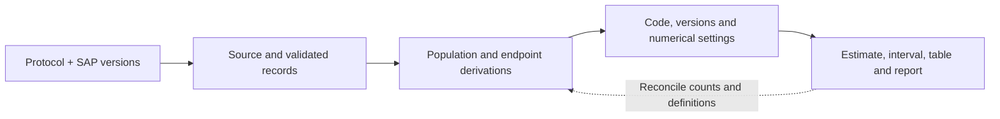

# Module 4 — Repeated Outcomes, Interim Analysis and Governance

> **Sub-course: Clinical-Study Biostatistics**
> [← Module 3](03-sample-size-and-missing-data.md) · [Sub-course home](README.md) · [Next: Module 5 — From Preclinical Evidence to Phase II →](05-preclinical-to-phase-ii.md)

---

## 🧭 Learning Objectives

After this module you will be able to:

1. Match a repeated-measures model to the target effect and to the dependence structure of the data.
2. Explain what an interim decision commits a study to, and what error control it requires.
3. Distinguish the different jobs of GCP, reporting guidelines and reproducibility practice.
4. Trace one reported result back through its code, derivations and source records.

---

## Repeated outcomes: the model must match the target and structure

| Situation | Candidate approach | What to explain |
|---|---|---|
| Single continuous follow-up and baseline | ANCOVA | Baseline adjustment and the specified treatment contrast |
| Repeated continuous outcomes at planned visits | MMRM | Mean model, visit effects, within-person covariance and visit-specific contrast |
| A person-specific trajectory or cluster structure | Appropriate mixed-effects model | Random-effects structure, target and residual assumptions |
| Correlated binary outcomes | GEE or GLMM | Marginal versus conditional effect and missingness assumptions |
| Irregular measurement times | A model using the actual time information where appropriate | Time functional form, covariance and observation process |

Mixed models are not universally “implicit imputation.” Likelihood-based models use observed data
under their modelling and missingness assumptions; they need not fill every missing cell or recover
information under MNAR. Some mixed models accommodate irregular times, but that requires an
appropriate time and covariance specification.

A conventional MMRM can specify within-patient covariance without a random intercept. A random-intercept
model is not automatically the same method. If the formula contains treatment × visit, the main
treatment coefficient alone need not be the Week-24 contrast.

### A patient trajectory is not a collection of independent people

For measurements at baseline and Weeks 4, 12 and 24, a participant with consistently high pressure
contributes correlated observations. A simple random-intercept model writes the outcome as a mean
trajectory plus a participant-specific offset plus residual error. The fixed effects describe the
population mean pattern; the random intercept represents variation in offsets across participants.
That covariance structure may be too simple if association changes with the time gap or individuals
have different slopes. Select a structure appropriate to the design and data, with a justified plan.

An MMRM with categorical visits instead estimates visit-specific means and a within-person residual
covariance, often without imposing a straight time trend. Baseline may enter as a covariate for the
post-baseline outcomes; do not add it as a repeated response arbitrarily. A Week-24 mean contrast is
then a specific comparison of fitted means at that visit. A trajectory question and a final-visit
question need not use the same summary.

**Worked coefficient interpretation.** Suppose usual care and Week 4 are reference levels, the
Drug-A coefficient is −2 mmHg, and the Drug-A × Week-24 interaction is −3 mmHg. The Week-4 contrast is
−2; the Week-24 contrast is −2 + (−3) = −5 mmHg. Its variance is
`Var(b_treatment) + Var(b_interaction) + 2 × Cov(b_treatment, b_interaction)`.
Adding the two coefficient SEs is incorrect. Request the contrast and its CI from the fitted model.

A participant with Weeks 4 and 12 observed but Week 24 missing may still inform the fitted likelihood.
This use of partial histories does not make dropout ignorable by itself. Ask whether missingness can
be explained by observed information included appropriately in the model and what departures are
plausible. Covariance modelling and missingness modelling solve different aspects of the problem.

**R practice:** [Module 7](07-three-questions-worked-through.md) runs executable paired, count-model
and baseline-adjusted analyses end to end. Explain the target, response coding, analysis n and
contrast before executing any model.

**Exercise:** A repeated-outcome report labels its treatment main coefficient “the Week-24 effect”
without specifying reference visit. What do you ask for?

Compare your reasoning

The factor/reference coding, treatment-by-visit specification and the planned Week-24 contrast.
That contrast may combine a treatment coefficient and an interaction coefficient. Also request
its variance calculation and within-person covariance specification.

## Interim analysis and adaptation

Repeated opportunities to declare benefit need an error-control strategy consistent with the
confirmatory claims. Plan the information used, timing, decision boundaries, who sees unblinded
results and how decisions are communicated. Adaptation is a design feature with operating
characteristics to verify, not permission to change a trial until it looks favourable.
The [FDA adaptive-design guidance](https://www.fda.gov/regulatory-information/search-fda-guidance-documents/adaptive-design-clinical-trials-drugs-and-biologics-guidance-industry)
discusses planned adaptations and supporting evaluation.

Distinguish blinded data-quality review, protected safety monitoring and formal comparative efficacy
looks. Merely opening a dataset is not identical to an unadjusted efficacy test; the information and
actions matter. Continuing after an interim review does not prove investigators know there is benefit:
stopping may depend on different rules, and access should be protected.

### What an interim decision actually means

**Benefit stopping** asks whether the accumulated evidence crosses the planned efficacy boundary.
**Futility stopping** asks whether continuing is unlikely to achieve the objective under the chosen
rule; it does not prove treatment has no effect. **Safety stopping** responds to unacceptable risk
and may use criteria different from the efficacy test. A **sample-size re-estimation** uses specified
information to revise enrollment; blinded nuisance-parameter updating and unblinded effect-based
adaptation have different statistical and governance consequences.

Imagine a trial with one planned interim efficacy look and a final analysis. Participants have
unequal follow-up at the interim, so half the enrollment may not represent half the final statistical
information. Define the information measure and boundaries in advance and evaluate operating
characteristics such as false-positive rate, power and expected sample size. After a stopping
decision, report estimates with attention to the sequential design: early favourable estimates can
be exaggerated, and a naive fixed-sample interval may not reflect the procedure used.

**Exercise:** At each of five visits, investigators test the outcome and stop at the first p < 0.05.
What is missing from the design?

Compare your reasoning

A prespecified sequential decision/error-control procedure, its operating characteristics, reporting
rules and governance of interim information. The fixed-sample threshold is not justified for an
opportunistic sequence of efficacy tests.

## GCP, reporting guidelines and reproducibility have different jobs

### Read the ICH map without mixing its families

Your third talk mentions Q, S, M and E. These organize ICH topics: **Q** for quality, **S** for safety,
**E** for efficacy, and **M** for multidisciplinary topics. They are families, not four stages of a
trial. The clinical/statistical documents here sit largely in E; nonclinical safety and manufacturing
quality also contribute to the development programme. Check the particular document, revision and
local implementation rather than assuming an identifier alone states every applicable obligation.
[ICH guidelines overview](https://www.ich.org/page/ich-guidelines)

### Connect guidance to decisions

| Framework | Main purpose in this course |
|---|---|
| ICH E6: GCP | Participant protection and reliable, well-governed clinical-trial conduct |
| ICH E9 | Statistical principles in clinical trials |
| ICH E9(R1) | Alignment of objectives, estimands, estimators and sensitivity |
| ICH E10 | Choice of control group |
| ICH E17 | Multiregional-trial planning considerations |
| SPIRIT | Reporting a trial protocol |
| CONSORT | Reporting randomized-trial results |
| SAP content guidance | Sufficient detail for planned analysis and transparent departures |

The draft's “E6 E10 Control Groups” combines two different guideline identifiers; E10 addresses
control groups. Guidance documents, reporting checklists and enforceable requirements should not
be treated as interchangeable.

**Current references checked 6 October 2026:** the FDA lists final E6(R3) GCP guidance, and the
SPIRIT–CONSORT collaboration publishes the 2025 protocol and trial-reporting statements. Use the
applicable version and extensions, with the relevant jurisdiction's implementation requirements.
[FDA E6(R3)](https://www.fda.gov/regulatory-information/search-fda-guidance-documents/e6r3-good-clinical-practice-gcp),
[SPIRIT–CONSORT published statements](https://www.consort-spirit.org/published-statements)

A clear CONSORT report does not prove that every design choice is sound. Likewise, automated reporting
can eliminate copying errors while faithfully reproducing an incorrect population flag.

**A practical seven-step route through your third talk.** This is a teaching synthesis, not a claim
that these were the presenter's exact seven steps:

1. Define the scientific objective and the decision the study must support.
2. Align the estimand, comparator, measurements and follow-up.
3. Choose a design and sample size whose assumptions are defensible.
4. Prespecify the estimator, error control, missingness and sensitivity strategy.
5. Implement reliable allocation, collection, monitoring and data-quality processes.
6. Produce traceable analysis outputs with recorded decisions and deviations.
7. Report the evidence, uncertainty and limitations against the intended question.

**Example of governance in practice.** A programmer discovers a post-unblinding endpoint bug. Freeze
the affected outputs, identify the erroneous rule and reconcile it against the protocol/SAP. Record
what information was available, which participants/results are affected, who reviewed the correction
and why it restores the planned rule. Rerun dependent outputs and reconcile the report. Hiding the
error or silently choosing a more favourable rule undermines the evidential record.

### A reproducibility checklist for one result

For a result table, verify population and outcome definitions, units, contrast direction, analysis n,
missingness rules, code/version, uncertainty and consistency with text. Keep a record of discrepancies
and the evidence used to resolve them. A new analyst should understand both how and why the output
was produced.

<!-- REFS -->

---

[← Module 3](03-sample-size-and-missing-data.md) · [Sub-course home](README.md) · [Next: Module 5 — From Preclinical Evidence to Phase II →](05-preclinical-to-phase-ii.md)
