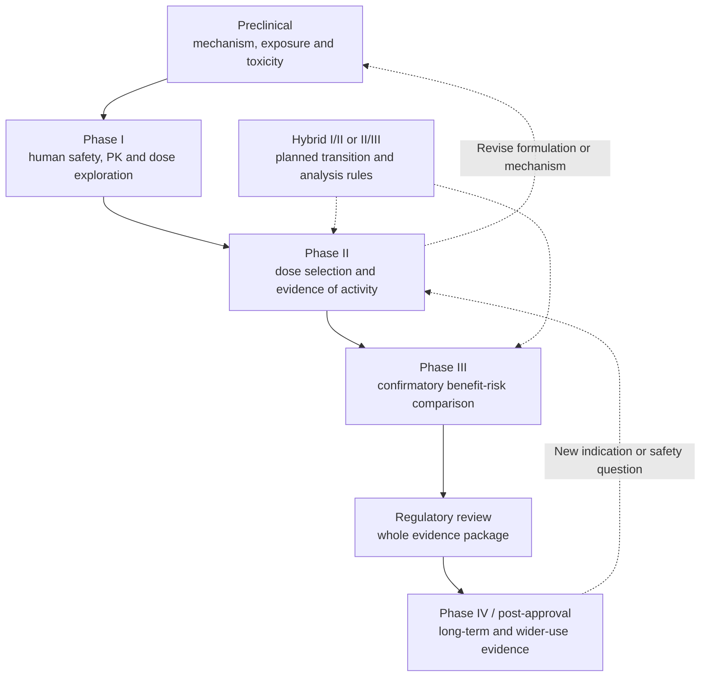
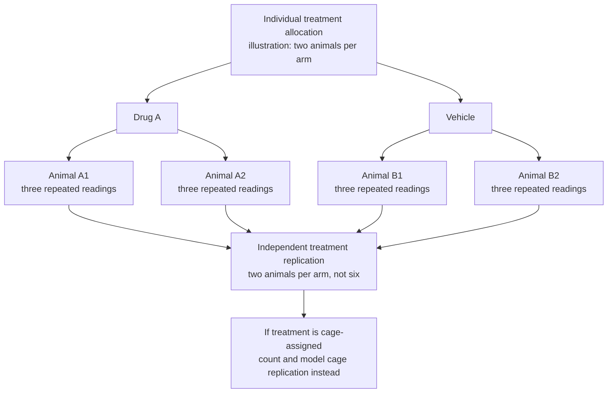
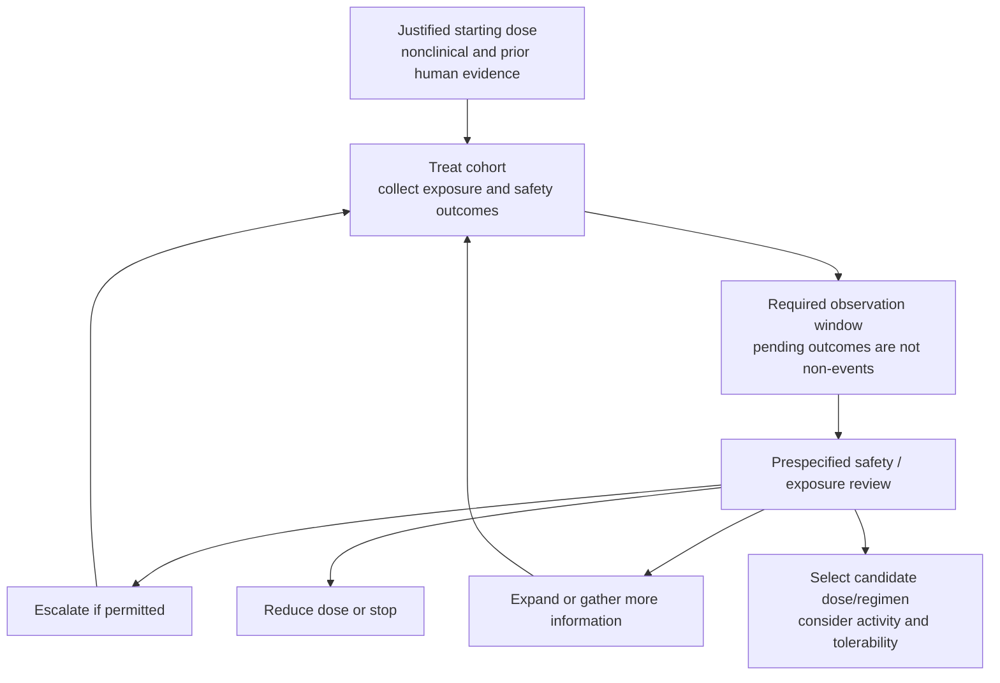

# Module 5 — From Preclinical Evidence to Phase II

> **Sub-course: Clinical-Study Biostatistics**
> [← Module 4](04-repeated-outcomes-interim-and-governance.md) · [Sub-course home](README.md) · [Next: Module 6 — Phase III and IV, Trial Layouts and Claims →](06-phase-iii-layouts-and-claims.md)

---

## 🧭 Learning Objectives

After this module you will be able to:

1. Separate three labels that are routinely confused: phase, design and claim.
2. Identify the treatment unit in a preclinical experiment from how the intervention is actually delivered.
3. Say what a Phase I dose-escalation decision requires, and why pending follow-up is not a non-event.
4. State the go/no-go decision a Phase II study is meant to support, and calibrate its error probabilities.

---

## Three different ways to classify a study

A **phase** describes a purpose within development, such as early human pharmacology or confirmation
of benefit. A **design** describes how comparisons are organized, such as parallel groups or crossover.
A **claim** describes the hypothesis, such as superiority or non-inferiority. Thus a study can be a
Phase III, randomized, parallel-group, active-controlled, non-inferiority trial. These labels answer
different questions; none supplies the endpoint, estimand or statistical assumptions by itself.

The familiar phases are especially useful for drug development. Surgery, behavioural interventions,
diagnostics and devices may use other development pathways. Phase labels also do not impose a
universal participant count. Think first about purpose and the information needed for the decision.
The [FDA clinical-development overview](https://www.fda.gov/patients/drug-development-process/step-3-clinical-research)
introduces Phases I–IV; the examples and design reasoning below expand that overview.

**Read the arrows as evidence requirements.** A cellular mechanism does not establish a tolerable
human exposure. A tolerable dose does not establish useful benefit. An encouraging small study does
not guarantee a reliable confirmatory effect. Approval does not end uncertainty about long-term use
or uncommon harms. The programme may return to earlier questions; the diagram is a learning map,
not a promise that every product follows one uninterrupted sequence.

## Before people: preclinical and nonclinical studies

Preclinical studies investigate a candidate before initial human exposure; nonclinical work can
also continue during clinical development. Calling all of it “preclinical trials” can hide the
variety of experiments involved. In vitro systems, animal models and computational analyses answer
different questions and provide different kinds of evidence. The FDA distinguishes in vitro and
in vivo preclinical research and emphasizes toxicity information before human testing.
[FDA preclinical overview](https://www.fda.gov/patients/drug-development-process/step-2-preclinical-research)

| Study purpose | Example observation | Design and interpretation question |
|---|---|---|
| Mechanism / target engagement | Receptor binding or pathway response | Does the assay measure the proposed mechanism, with suitable controls? |
| Disease-model activity | Change in pressure in a hypertensive animal model | Does the model address the intended disease context, and is the outcome measured without bias? |
| Pharmacokinetics (PK) | Concentration over time | What exposure follows the dose, and are repeated samples handled as correlated data? |
| Pharmacodynamics (PD) | Biomarker or physiological response over exposure | Is the biological response related to exposure and relevant to the intended benefit? |
| Toxicology / safety pharmacology | Organ effects, clinical signs or physiological disturbance | What risks emerge across exposures and observation periods? |
| Computational prediction | Predicted binding, exposure or toxicity | How was the prediction validated, and where is experimental confirmation still needed? |

**A preclinical design walkthrough.** Suppose Drug A is tested against vehicle in hypertensive rats,
with a prespecified pressure endpoint after four weeks. Decide whether treatment is assigned to
individual animals or to an entire cage. If each animal receives its own assigned injection, the
animal may be the treatment unit; cage still may introduce shared variation. If treatment is supplied
through shared drinking water, cage assignment can make the cage the unit for that intervention.
Repeated readings, tissue slices or microscope fields do not create new independently assigned
animals. This distinction determines replication and the analysis.
[NC3Rs experimental-unit guidance](https://eda.nc3rs.org.uk/experimental-design-unit)

Randomize allocation and measurement order, consider blocks such as sex or experimental day, and
mask outcome assessment where feasible. A design that measures all controls on Monday and all treated
animals on Friday confounds treatment with day. Prespecify exclusions, humane endpoints and handling
of measurements unavailable after early removal. Balance informative replication with the 3Rs:
replacement, reduction and refinement. A small underpowered experiment can waste animals as readily
as an unnecessarily large one.
[NC3Rs design resources](https://nc3rs.org.uk/3rs-resources/key-elements-well-designed-experiment)

**Read the figure:** extra readings can improve measurement of an animal's outcome; they do not
supply independent evidence from more treated animals. Two animals per arm here illustrate the
hierarchy, not a recommended sample size. The unit must be identified from actual allocation and
intervention delivery, not from whichever row count is largest.

Exploratory biology and regulated nonclinical safety studies have different roles. Determine which
studies fall under applicable GLP requirements; do not assume every laboratory experiment is a
GLP regulatory study. GLP, GCP and animal-reporting guidance address different aspects of the evidence.
[ARRIVE 2.0](https://arriveguidelines.org/arrive-guidelines) supports transparent animal-study reporting.
A convincing animal result still needs a translation argument involving model relevance, exposure,
measurement and uncertainty; it is not an estimate of the human treatment effect.

**Try it:** Six cages each receive one treatment through drinking water; each cage contains four
animals and each animal provides five readings. What is the treatment replication?

Compare your reasoning

Six assigned cages in total, split across the treatment groups according to the allocation. The
24 animals and 120 readings form a nested structure. They can inform within-cage outcomes, but
analysing 120 rows as independent treatment assignments exaggerates the information. Specify the
cage contrast and account for the hierarchy; the adequacy of six cages needs separate justification.

## Phase I: early human safety, exposure and dose exploration

The principal learning task is how the intervention behaves in people and which regimens merit
further study. **PK** asks what the body does to the drug, using concentration/time summaries;
**PD** asks what the drug does to the body, using relevant biological responses. Tolerability,
adverse events and exposure are considered together. Early activity can be collected without making
that small uncontrolled study a definitive efficacy comparison.

Healthy volunteers may participate when justified; some settings, including many oncology studies,
use patients because the risk and potential benefit differ. Eligibility, monitoring, starting dose,
escalation and stopping rules require intervention-specific evidence and oversight. A phase label
alone cannot establish their safety.

**A dose-escalation diagram.** Here the arrow is a controlled decision after sufficient observations,
not permission to increase the dose whenever no event has yet been entered in a database.

**Statistical decisions.** Define a dose-limiting toxicity (DLT), its observation window and how
incomplete follow-up enters the decision. In a traditional oncology 3+3 design, cohort counts govern
escalation through fixed rules; the approach does not use all information in the way a model-based
method can. Model-based or model-assisted designs relate dose to toxicity and apply specified decision
rules, often targeting a chosen toxicity probability. Delayed toxicity and cohort timing matter.
Compare operating characteristics by simulation, including exposure of participants to unsuitable
doses and the probability of selecting an appropriate dose. These are design descriptions, not
bedside dosing instructions.

**Example.** One of six participants has a DLT and two are still within the DLT window. “One of six”
is not a mature toxicity estimate. Show complete versus pending follow-up and apply the planned rule.
Sparse counts also carry substantial uncertainty: observing no serious events in a small cohort does
not establish that serious events never occur.

A maximum tolerated dose is not automatically the optimal therapeutic dose, particularly when
activity plateaus or chronic tolerability matters. Compare activity, exposure and adverse effects;
additional dose optimization may be necessary. This distinction is addressed in the
[FDA oncology dosage-optimization guidance](https://www.fda.gov/regulatory-information/search-fda-guidance-documents/optimizing-dosage-human-prescription-drugs-and-biological-products-treatment-oncologic-diseases).

**Typical output:** dose/cohort tables, exposure summaries, participant-level safety listings and a
reasoned recommendation for further dose/regimen evaluation, with uncertainty and unresolved risks.

## Phase II: activity, dose selection and a development decision

Phase II asks whether the intervention has enough activity and an acceptable risk profile to justify
further development, and often which dose to take forward. It may explore endpoints, schedules and
patient groups. Early exploratory work is sometimes called IIa and dose-focused work IIb, but these
labels are not a universal substitute for stating the study objective.

**Randomized dose-ranging example.** Compare usual care with two Drug-A doses. Define the primary
endpoint and visit, the contrast or dose-response model, and the rule for choosing a dose. More arms
create more potential comparisons. Plan how multiplicity and selection affect the conclusion. A dose
with the largest observed benefit in a small study may have been favoured by noise; the next trial's
sample size should not simply reuse that optimistic estimate without examining uncertainty.

**Single-arm example.** In a setting where a randomized comparison is difficult and an objective
response endpoint is useful, a study might compare a response probability against a historical
benchmark. Interpretability depends on comparable populations, assessment and background care.
Selection or changing prognosis can mimic activity. A response signal alone need not establish a
benefit over an available treatment.

A two-stage single-arm design may stop early for insufficient activity. For example, a hypothetical
rule might require at least three responses among the first ten evaluable participants before further
recruitment. That illustration is not a calibrated design: choose both stages and thresholds jointly
to achieve stated error rates and power under defined response probabilities, and specify how missing
or unevaluable responses are handled. The final test and estimate must respect the design.

**Statistical contribution:** articulate the go/no-go decision, calibrate its probabilities of wrong
continuation or wrong abandonment, distinguish exploratory signals from confirmatory claims, and
supply a defensible effect/variance range for later planning. A feasibility pilot whose purpose is
recruitment or measurement testing is not automatically a Phase II efficacy study.

**Try it:** The low dose has a favourable estimate with a wide interval; the high dose has a slightly
larger estimate but substantially worse tolerability. Why is “pick the smallest p-value” inadequate?

Compare your reasoning

Dose selection is a benefit-risk and development decision. Compare the magnitude and uncertainty,
exposure/response pattern, adverse effects and prespecified selection criteria. Multiple comparisons
and selecting a winner can exaggerate the chosen benefit. Further dose evaluation may be warranted.

<!-- REFS -->

---

[← Module 4](04-repeated-outcomes-interim-and-governance.md) · [Sub-course home](README.md) · [Next: Module 6 — Phase III and IV, Trial Layouts and Claims →](06-phase-iii-layouts-and-claims.md)
