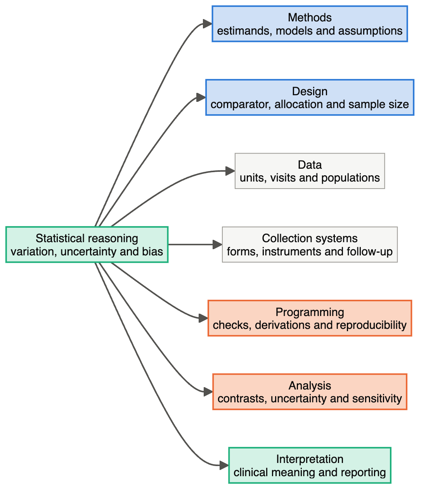
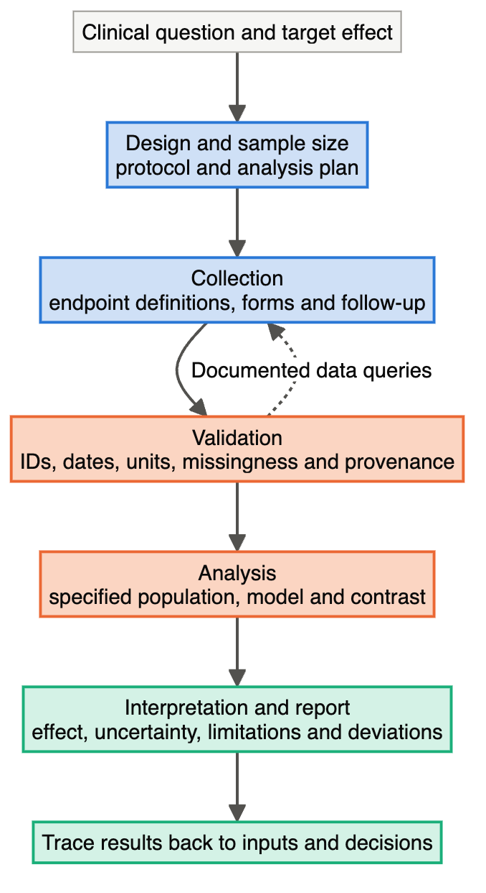
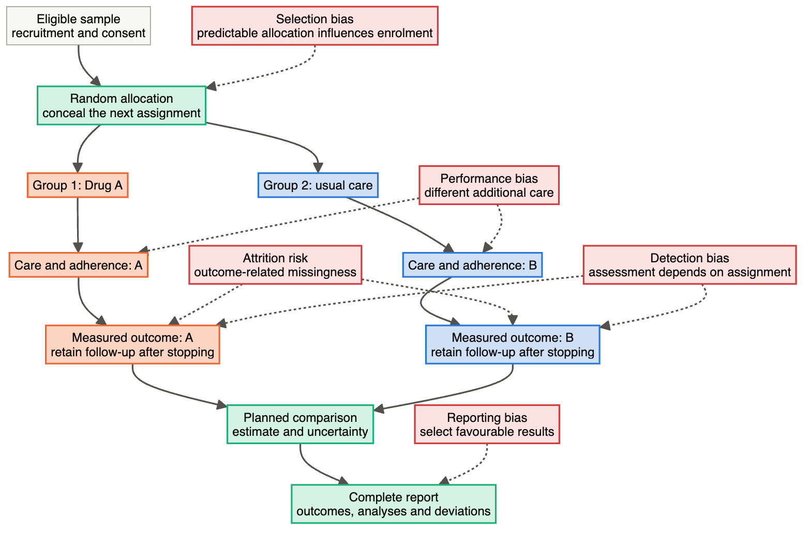

# Module 1 — Statistics and Bias Across the Whole Trial

> **Sub-course: Clinical-Study Biostatistics**
> [Sub-course home](README.md) · [Next: Module 2 — Estimands, the Analysis Plan and Data Quality →](02-estimands-analysis-plan-and-data-quality.md)

---

## 🧭 Learning Objectives

After this module you will be able to:

1. Explain how statistical reasoning enters a study before, during and after data collection.
2. Name what the statistician decides at each stage of the trial lifecycle.
3. Distinguish randomization, allocation concealment and masking, and say who each one protects.
4. Attach selection, performance, attrition, detection and reporting bias to the stage where each arises, together with its safeguard.

---

## Statistics is part of the whole trial

### The statistics map

The centre of this map is statistical reasoning: how to learn from observations while accounting for
variation, uncertainty and bias. The surrounding topics are connected responsibilities. For example,
choosing a binary endpoint changes both the data fields to collect and the model and sample-size
calculation. Changing the endpoint after collection may leave the required information unavailable.

**Read the map using the blood-pressure example.** Methods specify the Week-24 mean contrast. Design
chooses a comparator and allocation strategy. Data require participant identifiers, treatment,
baseline pressure, visit dates and follow-up measurements. Collection systems specify a calibrated
instrument, measurement procedure and follow-up after stopping treatment. Programming derives the
endpoint and checks units and visits. Analysis estimates the planned contrast and its uncertainty.
Interpretation asks whether the size, precision and robustness support a clinically meaningful claim.
These decisions must agree; a correct regression cannot reconcile conflicting endpoint definitions.

### The same responsibilities along the trial lifecycle

A statistician does more than analyse the final spreadsheet. The question determines what must be
collected; the collection process determines what can be analysed; analysis reveals issues that may
require a documented clarification. Critical decisions should be made before comparative results
can influence them.

| Stage | Statistical contribution | Example deliverable |
|---|---|---|
| Question/design | Estimand, endpoint, comparator, allocation, precision and power | Protocol statistical section |
| Trial preparation | Coding, visit windows, data checks, randomization implementation and SAP | Dictionary, test cases and versioned SAP |
| Conduct | Data-quality checks, follow-up, blinded reviews and protected monitoring | Query log and monitoring reports |
| Analysis | Population/endpoint derivation, planned analysis, diagnostics and sensitivity | Validated dataset, programs and outputs |
| Reporting | Effect sizes, denominators, uncertainty and transparent deviations | Tables, listings, figures and statistical text |

### What the statistician actually does at each stage

**Design.** Start with the question and target population. Define the outcome, time point, comparator
and treatment effect, then examine allocation, masking and feasibility. For Drug A, a large expected
blood-pressure difference is useless for power planning if it comes from a selected adherent subgroup
while the trial targets assignment regardless of discontinuation. Check the provenance of planning
assumptions and calculate how conclusions change under plausible alternatives.

**Preparation and collection.** Translate the endpoint into a measurement procedure and data fields.
A Week-24 visit needs a defined window and a rule for multiple measurements, not merely a column named
`week24`. Test the database with fictitious cases: an early visit, a repeated reading, a stopped drug,
and a participant who continues follow-up after rescue. Plan randomization generation separately from
secure implementation so recruitment staff cannot predict assignments.

**Conduct.** Review data completeness, visit timing and protocol departures using the information
permitted by the trial's governance. A blinded review can reveal a unit problem across sites without
examining treatment differences. A protected monitoring committee may need unblinded safety evidence.
The statistician documents what was reviewed, who could see it and what actions followed.

**Analysis.** Reconcile randomization records and participant flow; derive populations and endpoints;
run the specified estimator; check its implementation and assumptions. If repeated visits are used,
extract the planned final-visit contrast. Evaluate sensitivity to important uncertainties rather than
searching for the analysis with the smallest p-value. Unexpected results trigger a data/code review
and a documented decision, not silent alteration of the endpoint.

**Reporting.** Align the abstract, tables and results text on the same contrast, units, analysis
population and denominators. An estimate of −4 mmHg means something different from a four-percentage-
point difference in control rates. Include the CI, missingness, relevant deviations and clinical
context. Ensure someone else can trace the result to the data and program that produced it.

A cleaned dataset is not automatically fit for the intended analysis. Validate the derived endpoint,
analysis population and data structure against the protocol and SAP.

**Your turn:** A trial collects an outcome only while patients take the assigned drug, but aims to
estimate the Week-24 effect regardless of discontinuation. Where did the failure originate?

Compare your reasoning

The estimand and collection plan are misaligned. Follow-up after discontinuation is needed for the
stated target. A clever final model cannot fully replace information the collection process never
sought. Plan collection and missing-data assumptions together.

## Bias: name the mechanism and the safeguard

Randomization is a process for allocating participants. Concealment protects that process during
enrolment. Masking reduces effects of knowing allocation afterwards. These are different safeguards.

| Risk | Mechanism | Response and limitation |
|---|---|---|
| Allocation-related selection bias | Enroller can predict and influence the next assignment | Conceal allocation; an apparently random sequence alone is insufficient |
| Performance bias | Allocation knowledge changes additional care or behaviour | Mask where possible; record relevant co-interventions |
| Detection bias | Outcome assessment depends on allocation knowledge | Mask assessors; use defined measurement rules |
| Bias from missing outcomes | Availability depends on outcome-related factors | Retain follow-up, document reasons, model missingness and test plausible departures |
| Reporting/analysis selection | Choose outcomes or methods because of observed results | Prespecify, version plans and disclose departures |
| Limited generalizability | Eligibility/recruitment omits parts of the target population | State the enrolled and target populations; randomization within the sample does not ensure representativeness |

### Walk through the bias pathway

**At allocation:** imagine an enroller sees that the next assignment is Drug A and delays a frail
patient's enrolment. A computer-generated sequence has not protected the comparison because access
to that sequence changed who entered each group. Concealment prevents that opportunity. Recruitment
representativeness is a separate issue: even impeccable randomization cannot make a narrowly eligible
sample represent every patient with hypertension.

**During care:** participants who know they received the new treatment may receive extra counselling
or modify their diet. That can change blood pressure independently of the drug. Whether these
changes belong to the intended treatment strategy or undermine the intended comparison depends on
the question and protocol. Record and standardize co-interventions where appropriate.

**During follow-up:** if patients with dizziness or poor control are less likely to return, the
measured patients may be a selected subset. The diagram keeps follow-up inside each arm so you can
ask whether availability and reasons differ. Count everyone through the trial flow, distinguish
stopping treatment from withdrawing outcome follow-up, and examine missingness assumptions.

**At measurement:** an assessor who expects Drug A to work might repeat a high reading and retain a
lower one only in that arm. Masking and a common measurement/averaging rule reduce this opportunity.
Even an automated instrument needs calibration and a specified procedure.

**At reporting:** a study may collect several endpoints and visits but show only favourable results.
Prespecification and reporting all planned outcomes make that selection visible. The final comparison
inherits problems from earlier stages; accurate arithmetic at the end does not cancel them.

A participant's missing outcome does not by itself prove attrition bias, and lack of masking does
not quantify the size of bias. Explain the pathway through which the result could change. Likewise,
constant instrument settings are standardization, not evidence that an assessor was masked.

**Short answer:** “I would check recruitment and allocation separately, then look at care,
measurement, follow-up and reporting. Each safeguard addresses a particular bias mechanism;
randomization does not make all later decisions harmless.”

---

[Sub-course home](README.md) · [Next: Module 2 — Estimands, the Analysis Plan and Data Quality →](02-estimands-analysis-plan-and-data-quality.md)
