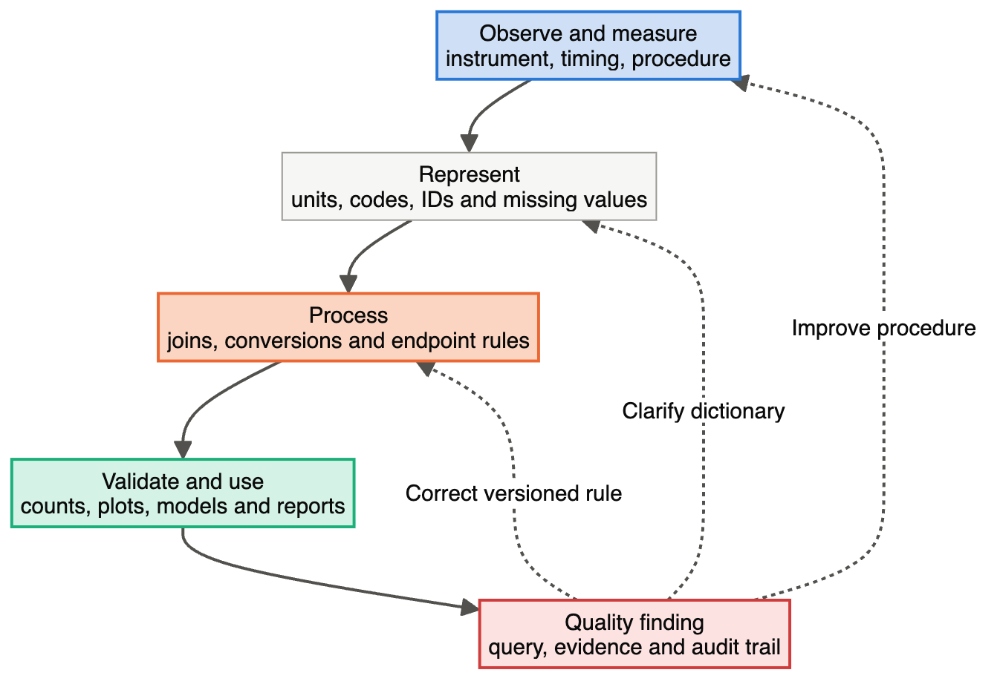

# Module 2 — Estimands, the Analysis Plan and Data Quality

> **Sub-course: Clinical-Study Biostatistics**
> [← Module 1](01-statistics-and-bias-across-the-trial.md) · [Sub-course home](README.md) · [Next: Module 3 — Sample Size, Noncompliance and Missing Data →](03-sample-size-and-missing-data.md)

---

## 🧭 Learning Objectives

After this module you will be able to:

1. Define a treatment effect — population, contrast, outcome, time and intercurrent-event strategy — before choosing a method.
2. Explain why intention-to-treat is an assignment principle rather than a guarantee of unbiased inference.
3. Turn a protocol into a statistical analysis plan another analyst could execute.
4. Run the checks that make an analysis dataset defensible, and keep provenance from source record to reported result.

---

## Define the treatment effect before the method

### A concrete estimand

Consider a trial of Drug A versus usual care in adults with hypertension. The outcome is systolic
blood pressure at Week 24. Lower values are better. Participants may discontinue, use rescue
medication or miss visits.

| Attribute | Example specification |
|---|---|
| Population | Eligible randomized adults with hypertension |
| Treatment conditions | Assignment to Drug A versus usual care, as defined by the protocol |
| Variable | Week-24 systolic blood pressure in mmHg |
| Intercurrent events | Include outcomes after discontinuation and rescue for a treatment-policy question |
| Population summary | Mean Drug-A-minus-usual-care contrast |

An **estimand** is the target effect; an **estimator** is the procedure; an **estimate** is its numerical
result. The ICH framework formalizes this distinction and the handling of intercurrent events.
[ICH E9(R1)](https://database.ich.org/sites/default/files/E9-R1_Step4_Guideline_2019_1203.pdf)

A hypothetical no-rescue effect asks a different question. A participant who discontinues but provides
a Week-24 measurement has an intercurrent event without a missing outcome. Death can make a later
blood-pressure outcome undefined; it needs an appropriate estimand strategy, not routine imputation
as though the measurement merely went unrecorded.

### ITT is not a guarantee of unbiased inference

Analyse participants according to randomized assignment for the intended assignment comparison.
This preserves that aspect of randomization. It does not recover missing outcomes, remove measurement
bias or automatically define all intercurrent-event strategies. ITT is not universally “the least
biased analysis” regardless of the question and data.

A per-protocol subset can answer an additional question, but adherence-based exclusion may introduce
post-randomization selection. It is not an automatically unbiased estimate of receiving treatment.
The [estimands primer](https://www.bmj.com/content/384/bmj-2023-076316) explains how a precise question
helps determine design, collection and analysis.

**Your turn:** Is “compare patients who actually took the drug with patients who did not” equivalent
to the randomized comparison?

Compare your reasoning

No. Treatment received can depend on prognosis, adverse effects and patient decisions after
randomization. The groups may differ for reasons other than treatment. First define the desired
effect, then choose a justified estimator and its assumptions.

## From protocol to statistical analysis plan

The protocol sets the scientific and operational framework; the SAP gives enough detail to carry out
and audit the statistical analysis. Read them together. Develop the plan early, and finalize the
relevant decisions before access to results that could influence them. If an unblinded interim review
occurs earlier, governance must protect decisions and trial integrity; “before final unblinding”
alone is not a complete safeguard.

An SAP remains versioned: legitimate amendments can occur. Record their timing, reasons, approvals
where required, access to comparative information and consequences. Prespecification reduces
opportunistic analysis choices; it does not prove that the specified method is appropriate.
([Gamble et al., 2017](https://doi.org/10.1001/jama.2017.18556))

### One-page SAP worksheet

| Heading | What you must specify |
|---|---|
| Objective and estimand | Population, treatment comparison, variable, events and summary |
| Endpoints | Primary/secondary/exploratory status; time, units and derivation |
| Populations | Inclusion flags, randomized versus received treatment rules and exclusions |
| Model and contrast | Formula, factors/reference levels, covariates, covariance and requested comparison |
| Missingness | Primary assumptions, observed information and chosen estimator |
| Robustness | Same-estimand sensitivity assumptions; supplementary targets labelled separately |
| Error control | Significance level, multiplicity family, hierarchy and interim procedures |
| Data derivation | Visit windows, duplicates, unit conversion, event coding and derived variables |
| Outputs | Tables/figures, denominators, uncertainty and interpretation |
| Governance | Version, dates, responsibility, deviations and reproducibility requirements |

Covariates should be justified by prognosis, design and the question. A chance baseline p-value is not
a rule for including or excluding a covariate. Post-treatment mediators are not ordinary baseline
confounders.

**Deliverable:** Fill this worksheet for the hypertension example. Write the contrast in words before
writing a model formula. If death is plausible before Week 24, specify how the question handles it.

## Data quality is scientific work

Distinguish source records, corrected/query-resolved records, analysis datasets and final outputs.
Keep provenance across the transformations. Automatic output generation reduces transcription errors
but can reproduce an upstream mistake perfectly.

### The data-quality feedback loop

Data quality depends on how measurements are observed, represented and processed. Their use reveals
weaknesses: an analysis check might identify mixed units, an impossible sequence of dates, or a visit
field that cannot distinguish a missed visit from a visit outside its window. Feed that information
back through a documented query and process correction. Keep raw records and the audit trail.

**Example: two units in one column.** Most pressures are near 130, but one site's readings are near
17. Do not discard the latter as outliers. Check the site's instrument and source units: 17 kPa is
approximately 127.5 mmHg. If the discrepancy is confirmed, use a documented conversion and preserve
original values and units. Then fix the entry system or dictionary so future readings arrive with
explicit units. Recheck derived endpoints and outputs affected by the correction. Investigating the
measurement process is more informative than removing inconvenient data points.

**Example: the wrong visit.** A program selects the latest reading as Week 24 even when it was taken
at Week 12. The source measurement may be accurate; its representation as the primary endpoint is
wrong. Resolve the derivation against the prespecified window and multiple-reading rule. Record an
out-of-window observation separately rather than quietly changing the window after seeing results.

### Checks before analysis

| Check | Failure it catches |
|---|---|
| Unique participant and participant–visit keys | Duplicate records or accidental weighting |
| Joins and row counts before/after | Event-level joins that multiply participant outcomes |
| Units and ranges | Mixing kPa and mmHg, or impossible values |
| Dates, windows and time origin | Visit misclassification or incorrect follow-up |
| Assignment/received treatment flags | Inconsistent population or treatment coding |
| Missingness by arm, visit and reason | Unexamined differences in measurement availability |
| Source-to-endpoint reconciliation | Incorrect derived outcomes or silently changed definitions |
| Denominators per output | Confusing measured, randomized and safety populations |

**Practical question:** A participant has three adverse-event records. Joining events directly to
one efficacy record creates three rows. How do you avoid treating them as three participants?

Compare your reasoning

Validate the join relationship. Derive participant-level event summaries when the output needs
participant incidence, or keep event-level records separate for event counts. Do not simply drop
rows after the join without understanding the intended structure.

### Programming, handover and reproducibility

The programming work in your first talk spans randomization, exploration, complex checks, monitoring,
interim/final analysis and reporting. Each has a different purpose. An exploratory plot can identify
an implausible value; it does not authorize excluding it. A randomization program needs checks of
allocation ratios and strata as well as a protected deployment process. A reporting program should
show where its population flags and denominator came from.

Plan for a new analyst to take over. Store the data dictionary, derivation specification, SAP version,
code, package versions, seeds where relevant, and instructions for rebuilding outputs. Record which
results were independently reproduced and how discrepancies were resolved. Make time and computing
resources explicit: reproducibility becomes fragile when only one person knows an undocumented
manual step or a long computation cannot be rerun before a deadline.

Generate results text from validated result objects where feasible. For example, create the estimate,
CI and analysis n once and use that object in both a table and a paragraph. Check rounding, units and
contrast direction in the rendered report. Automation prevents inconsistent copying; scientific
review establishes whether the shared underlying result is correct.

## 📚 References cited in this chapter

- Gamble C, Krishan A, Stocken D, Lewis S, Juszczak E, Doré C, et al. (2017). Guidelines for the Content of Statistical Analysis Plans in Clinical Trials. *JAMA* 318:2337. [doi:10.1001/jama.2017.18556](https://doi.org/10.1001/jama.2017.18556)

---

[← Module 1](01-statistics-and-bias-across-the-trial.md) · [Sub-course home](README.md) · [Next: Module 3 — Sample Size, Noncompliance and Missing Data →](03-sample-size-and-missing-data.md)
