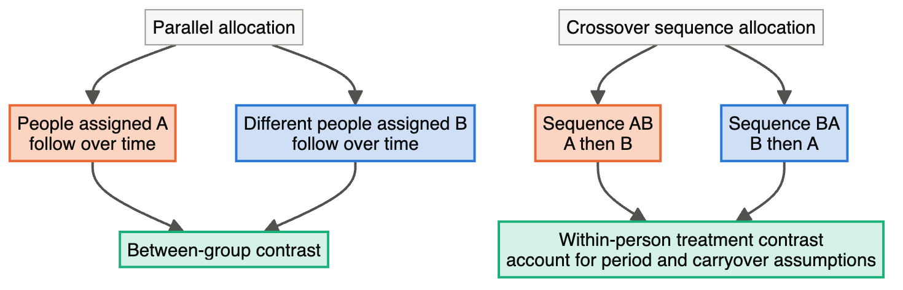
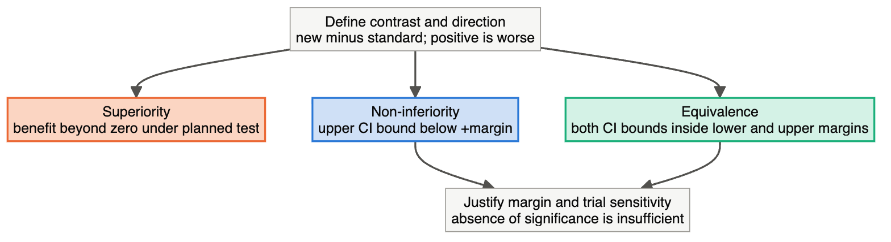

# Module 6 — Phase III and IV, Trial Layouts and Claims

> **Sub-course: Clinical-Study Biostatistics**
> [← Module 5](05-preclinical-to-phase-ii.md) · [Sub-course home](README.md) · [Next: Module 7 — Three Questions Worked From Beginning to Discussion →](07-three-questions-worked-through.md)

---

## 🧭 Learning Objectives

After this module you will be able to:

1. List what a confirmatory design must specify before it can confirm anything.
2. Say what remains uncertain after approval, and which post-approval questions address it.
3. Choose between parallel, crossover, cluster, factorial and other layouts for a given question.
4. Interpret a non-inferiority or equivalence interval against a prespecified margin, and explain why a non-significant difference is not a claim.

---

## Phase III: confirmation requires a complete design

Phase III generally seeks reliable evidence about a specified treatment benefit and risk in an
intended population. It links the earlier sections: endpoint, eligibility, allocation, masking,
sample size, data monitoring and analysis must all serve the same question. Confirmatory evidence
can also arise in other phases or combined programmes; “Phase III” is not itself a validity stamp.

#### Endpoints: define the measurement and the clinical meaning

A primary endpoint is the outcome intended to support the main claim. Define its variable, time,
units, derivation and analysis. Secondary endpoints answer additional questions; exploratory ones
help generate hypotheses. Endpoint priority and multiplicity must agree with the claims. A surrogate
such as a biomarker needs evidence of its relevance to clinical benefit in the intended setting;
showing a biomarker improvement is not automatically showing longer survival or better functioning.

| Endpoint form | Hypertension or other teaching example | Statistical decision |
|---|---|---|
| Continuous | Week-24 systolic pressure | Mean contrast, baseline adjustment and missing outcomes |
| Binary | Pressure controlled at Week 24 | Define threshold; choose risk difference, ratio or odds ratio deliberately |
| Time-to-event | Time to a cardiovascular event | Time origin, event definition, censoring and competing events |
| Count/rate | Number of episodes per follow-up time | Exposure time, overdispersion and repeated episodes |
| Patient-reported | Symptom/function scale | Validated instrument, scoring and meaningful difference |
| Composite | First of several event types | Components, clinical importance and what drives the result |

A composite gains events but can obscure meaning when its components differ in importance or treatment
response. Report components appropriately. A hazard ratio does not supply an absolute risk reduction,
and an odds ratio need not equal a risk ratio. State the measure that matches the question.

#### Eligibility: protect participants and define applicability

Eligibility specifies the population in which the study can answer its question. Restricting severe
comorbidity may improve safety or measurement consistency but limits applicability to such patients.
Record the reason for important restrictions. Recruitment and eligibility also affect event rates,
variance and feasibility, so planning assumptions must reflect the patients actually expected.
Report who was screened, excluded, enrolled and analysed with relevant reasons.

For the running trial, “adults with hypertension” needs operational thresholds, treatment history
and relevant exclusions. Eligibility measured before allocation is distinct from exclusion because
of an outcome or adherence decision afterwards. The latter can alter a randomized comparison.

#### Randomization: generation, concealment and implementation

Specify the allocation ratio and any stratification or blocking. Stratification may help balance
important prognostic factors such as site or baseline severity; too many sparse strata complicate
implementation. Fixed small blocks can become predictable if staff see prior assignments. Secure
concealment and an appropriate implementation strategy matter as much as sequence generation.

Keep the randomization list under controlled access, test the implementation, reconcile assignments,
and include design factors in the analysis as justified. Chance imbalance in a correctly randomized
sample can still occur. Randomization supports comparability in expectation, not identical baseline
characteristics in every realised trial.

#### Masking: state who is masked and how

Identify participants, care teams, outcome assessors, analysts and decision-makers separately instead
of relying only on “double blind.” A surgery or behavioural trial may not mask patients or operators;
independent masked assessment and objective measurement can still reduce some risks. Define emergency
unmasking and document who received what information. An open-label trial with a subjective endpoint
needs particular care about differential care and assessment.

#### Power and sample size: design around the actual claim

Connect the effect size to clinical relevance and the estimand, then specify variance or event rate,
allocation, alpha, power, missingness, adherence and design effects. A superiority calculation does
not automatically power a non-inferiority claim. A cluster design needs allowance for correlation;
a time-to-event design often depends on required events as well as participants and follow-up.
Examine uncertainty in assumptions and recruitment feasibility. [Modules 3](03-sample-size-and-missing-data.md)
and [4](04-repeated-outcomes-interim-and-governance.md) explain why adding participants cannot repair
a bias mechanism or an incoherent analysis question.

#### Data monitoring: separate information and responsibility

Plan routine data-quality checks, adverse-event surveillance and formal comparative monitoring.
Specify whether an independent data monitoring committee is needed, its remit, information access
and decision process. Keep unblinded comparative information protected where appropriate. Define
interim stopping/adaptation rules and operating characteristics before acting on the data.
A committee recommendation, sponsor decision and investigator communication are separate steps
whose documentation should preserve trial integrity.

**A Phase III design brief to practise.** For Drug A, specify the Week-24 mean contrast under the
chosen handling of discontinuation/rescue, the target population, active comparator, allocation and
masking roles. Add measurement windows, follow-up after treatment stops, primary estimator,
missingness sensitivity, power assumptions, monitoring and multiplicity. If one item contradicts
another, fix the design before polishing the results table. These connected design considerations
are organized in [ICH E8(R1)](https://www.fda.gov/regulatory-information/search-fda-guidance-documents/e8r1-general-considerations-clinical-studies).

## Phase IV: what remains uncertain after approval?

Post-approval interventional trials may examine comparative effectiveness, longer use, combinations,
special populations or additional benefit-risk questions. Post-marketing research also includes
observational cohorts, registries and surveillance. Those are not all randomized Phase IV trials.
Distinguish the study's actual design from the fact that it occurs after approval.

**Example: routine-use effectiveness.** A randomized trial conducted in ordinary clinics might
compare Drug A with an established alternative, accepting a wider range of patients and usual
co-interventions. More pragmatic delivery can improve relevance to practice but also changes what
the assignment strategy includes. Maintain endpoint reliability, follow-up and a clear estimand.

**Example: uncommon harm.** A registry can identify a possible safety signal over longer follow-up.
Patients prescribed Drug A may have more severe disease than comparator patients, producing
confounding by indication. Define a target comparison, time zero, comparator, covariates and outcome
ascertainment. Avoid using future information to classify baseline exposure, and consider selection,
confounding and censoring. Spontaneous reports without a reliable population denominator cannot by
themselves estimate an incidence rate.

Precision depends on enough relevant events, not merely a very large database. Longer follow-up
creates opportunities to learn and opportunities for changes in treatment, eligibility and observation
to complicate inference. Report absolute risks or rates when supported, alongside suitable relative
measures and uncertainty.

## Overlapping and hybrid phases

An I/II study can link dose exploration to activity evaluation. A II/III programme can link selection
to confirmation. Combining purposes does not permit unrestricted reuse of an encouraging result.
Define the transition, decision criteria, outcome availability, governance and analysis before the
study starts. Be explicit about which participants contribute to each inference.

A seamless II/III design might use an initial stage to select a dose and a later stage to confirm
benefit. If earlier data also contribute to the final claim, the analysis must account for the
selection/adaptation and control error for that claim. Simulate operating characteristics under
multiple plausible scenarios. Merely renaming an extended Phase II study “Phase III” does not solve
the problem. Adaptive designs can occur in several phases; adaptation is a separate design attribute.

## Trial layouts: how are comparisons organized?

#### Parallel-group trials

Participants are assigned to one strategy and compared with participants assigned to another over
follow-up. This suits interventions with lasting effects or settings where changing treatment periods
would be inappropriate. Efficiency depends on independent replication, prognostic adjustment and
reliable outcome follow-up. The running hypertension example is parallel-group; treatment switching
within it does not convert its randomized design into a crossover trial.

#### Crossover trials

Participants receive treatments in a randomized sequence, such as AB or BA, over different periods.
Within-person comparisons can reduce variation from stable participant characteristics. They require
a sufficiently stable condition, reversible effects and justified period/washout assumptions.
Carryover, period effects and dropout complicate interpretation; an intervention that permanently
changes the outcome usually cannot be evaluated by a simple crossover. Account for within-person
correlation and the assigned sequence in design and analysis.

**Read the contrast boxes first.** In a parallel design, the independent randomized comparison is
between people or other allocated units. In crossover, the same people provide outcomes under both
treatments, but order and period can affect those outcomes. Reversing the sequence is not the same
as eliminating carryover. A short-acting intervention in a stable condition may be suitable; a cure
or irreversible operation is not a simple reversible-period comparison.

#### Factorial trials

A 2×2 factorial allocates combinations of two factors: neither, A only, B only, or both. It can
investigate two interventions within one study and estimate interaction. Efficiency for separate
main effects depends on the question and interaction assumptions. If A works only with B, an averaged
main effect can hide the scientifically important pattern. Specify whether the target is an effect
averaged over the other factor or a particular combination, and plan enough information for the
interaction claim if that is central.

| Factor A | Factor B absent | Factor B present |
|---|---|---|
| Absent | Usual care | B |
| Present | A | A + B |

Read across a row to compare B within an A level and down a column to compare A within a B level.
A factorial structure does not imply that interaction must be zero.

#### Cluster-randomized and stepped-wedge trials

Cluster trials allocate clinics, wards, schools or other groups when the intervention is delivered
collectively or contamination would make individual allocation difficult. Patients within a cluster
share context, so their observations are correlated. Under a simple equal-size cluster approximation,
`design effect = 1 + (m − 1) × ICC`. For `m = 20` and ICC = 0.05, it is 1.95. This is an illustration,
not a full calculation for unequal cluster sizes or few clusters. The number of independently
randomized clusters remains critical; large numbers of patients in two clinics do not create a
well-replicated clinic-level experiment.

A stepped-wedge cluster trial introduces the intervention in randomized rollout sequences. Clusters
usually move from control to intervention, so exposure is closely tied to calendar time. Separate the
intervention effect from secular trends, account for correlation and consider implementation/learning
effects. Universal eventual access does not by itself make this design unbiased or ethically preferable.
Its logistical and scientific justification should be stated.

#### Adaptive trials and master protocols

Adaptive trials use prespecified rules to change aspects such as allocation, dose/arm selection or
sample size based on accumulating information. [Module 4](04-repeated-outcomes-interim-and-governance.md)
and the hybrid-phase discussion above explain why error control, information access and operating
characteristics matter. Adaptation can be an overlay on a parallel,
cluster or other trial layout.

A **basket** study investigates an intervention across several disease groups, often connected by a
biomarker. An **umbrella** study investigates several targeted strategies within a disease divided
into relevant subgroups. A **platform** permits interventions to enter or leave under an ongoing
master protocol. These categories can overlap; being a basket or umbrella does not automatically mean
arms enter and leave over time. The [FDA oncology master-protocol guidance](https://www.fda.gov/regulatory-information/search-fda-guidance-documents/master-protocols-efficient-clinical-trial-design-strategies-expedite-development-oncology-drugs-and)
addresses design and conduct in that setting.

**A platform interpretation example.** If an experimental arm enters later than some controls,
changes in background care or patient prognosis can confound a comparison with earlier controls.
Specify eligible/concurrent controls, estimands, multiplicity and whether/how information is pooled.
A shared infrastructure makes collection efficient; it does not make every comparison interchangeable.

#### Explanatory and pragmatic trials

These describe an emphasis along a continuum. An explanatory trial seeks evidence under controlled
conditions; a pragmatic trial seeks effectiveness under conditions closer to ordinary care. Choices
about eligibility, delivery, follow-up and outcomes determine that emphasis. Either can randomize.
Pragmatic does not mean that measurement and missingness no longer matter, and explanatory does not
mean the findings apply to every routine-care setting.

## Trial claims: superiority, non-inferiority and equivalence

**Superiority** asks whether the new strategy improves the specified outcome relative to the
comparator. The null, contrast direction and endpoint determine the test. A statistically detectable
difference may still be too small to justify treatment burden or harm.

**Non-inferiority** asks whether the new treatment is not worse than an effective comparator by more
than a prespecified acceptable margin. A modest loss might be justified by another advantage, such
as administration, but the margin requires clinical and historical evidence. Demonstrating that the
comparator would be effective in this setting and that the trial could detect a difference if one
existed is central to interpretability. Poor adherence or insensitive measurement can make treatments
look similar without establishing non-inferiority. ITT and per-protocol analyses each need assumptions;
their agreement alone is not proof. See the
[FDA non-inferiority guidance](https://www.fda.gov/regulatory-information/search-fda-guidance-documents/non-inferiority-clinical-trials).

**Equivalence** asks whether the difference is within prespecified lower and upper margins. Failure
to reject a superiority null is not equivalence: a wide interval may include both useful benefit and
important harm. The appropriate two one-sided tests correspond to an interval whose level depends on
the prespecified alpha; for example, alpha 0.05 in each one-sided test corresponds to a 90% two-sided
CI. State the procedure rather than universally demanding one confidence level for all claims.

**Worked interpretation — lower pressure is better.** Let the contrast be new minus standard in mmHg
and, for illustration only, let the maximum acceptable worsening be +3 mmHg. Use a prespecified 95%
CI for this non-inferiority example. The margin here teaches the comparison and is not a justified
clinical margin for an actual hypertension trial.

| Estimate and CI | What the interval supports under the stated rule |
|---|---|
| −2; CI −4 to +1 | Upper bound below +3: meets NI criterion; interval crosses 0, so no superiority claim |
| −1; CI −4 to +4 | Crosses NI boundary: does not establish NI; does not prove inferiority |
| −3; CI −5 to −1 | Supports superiority on this endpoint if testing/governance permit that claim |

**Read this figure with the table:** zero is the no-difference reference; +3 is the illustrative
unacceptable-worsening boundary. Crossing zero and crossing +3 answer different questions. For an
outcome where higher is better, the direction of the relevant non-inferiority boundary changes.
Always draw or state the contrast before interpreting the confidence interval.

## Bring development purpose, layout and claim together

| Scenario | Purpose and possible design | Decision to justify |
|---|---|---|
| First human exposure | Phase I safety/PK, controlled escalation | Observation window, escalation safeguards and candidate regimen |
| Select between doses | Phase II randomized dose-ranging | Benefit-risk selection and adjustment for selection/multiplicity |
| Confirm a better pressure outcome | Phase III parallel superiority | Clinically relevant contrast and coherent follow-up/power/SAP |
| Simpler treatment with acceptable loss | Active-controlled NI in a suitable programme | Margin, sensitivity, estimand and interpretation |
| Short-lasting reversible symptom effect | Crossover where assumptions hold | Stability, washout, periods and within-person analysis |
| Clinic-wide implementation | Cluster trial, possibly randomized rollout | Cluster replication, contamination and time/correlation modelling |
| Long-term routine-use safety | Post-approval randomized or observational study | Actual assignment mechanism, events and confounding |

**Design exercise.** Choose a design for each of these: (a) an irreversible operation, (b) a clinic-wide
training programme, (c) two potentially interacting medicines, and (d) a rapidly reversible symptom
intervention in a stable condition. Name a plausible alternative and explain what assumption would
make it unsuitable. Then describe a hypothetical Drug-A development programme from preclinical work
to post-approval follow-up. At each transition, state what remains unknown.

Compare your reasoning

A parallel design can compare operations; an ordinary crossover is unsuitable for an irreversible
change. Cluster allocation can compare clinic training if contamination makes individual allocation
unhelpful; clinic counts and baseline/time differences matter. A factorial can investigate two
medicines if combination safety and the target effects justify it, with interaction addressed. A
crossover might fit the reversible intervention if stability and carryover assumptions are credible;
a parallel design remains an alternative when they are not.

For Drug A, mechanism/exposure/toxicity work precedes appropriate early human safety/PK evaluation;
dose/activity work then supports a confirmatory benefit-risk comparison. Each stage can expose a
reason to revise or abandon development. Post-approval evidence addresses remaining use and safety
questions with its own design and assumptions, rather than treating approval as the end of learning.

---

[← Module 5](05-preclinical-to-phase-ii.md) · [Sub-course home](README.md) · [Next: Module 7 — Three Questions Worked From Beginning to Discussion →](07-three-questions-worked-through.md)
