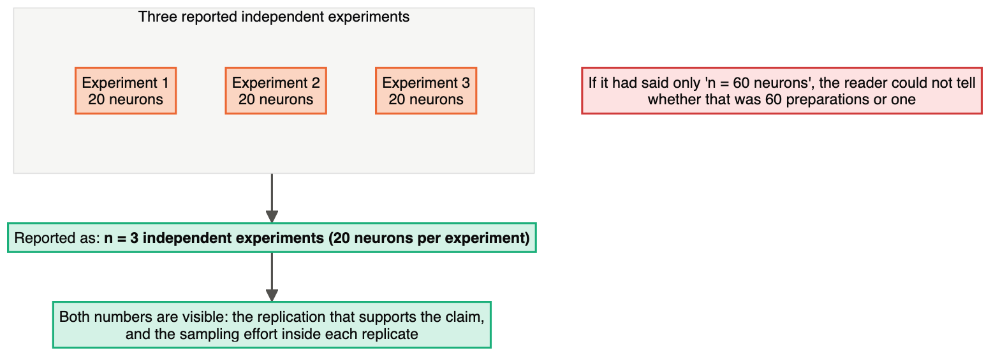
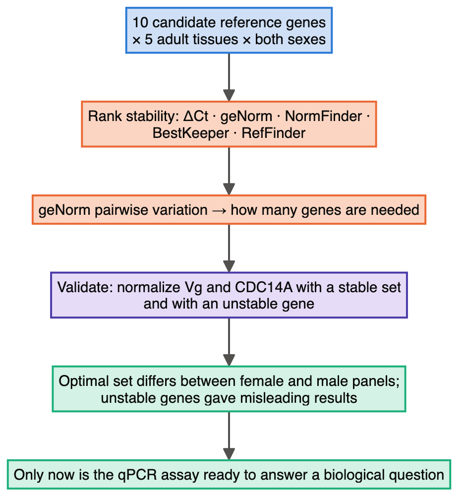
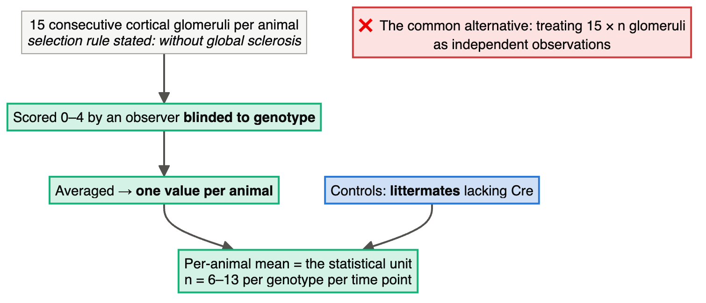
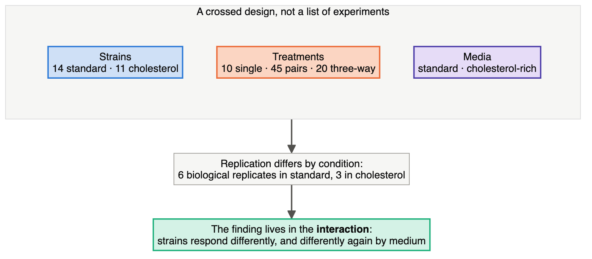

# Module 2 — Molecular and Cell Biology: Ten Designs, Read From the Methods

> **Sub-course: Design in the Literature**
> [← Module 1](01-breeding-and-agronomy.md) · [Sub-course home](README.md) · [Next: Module 3 — Clinical and Preclinical →](03-clinical-and-preclinical.md)

---

## 🧭 Learning Objectives

After this module you will be able to:

1. Decide what counts as **one independent experiment** at the bench, and check how a paper counted it.
2. Judge **specificity controls** for a knockdown or knockout claim.
3. Recognize when a **normalizer** (reference gene, loading control) has been validated — and when it has been assumed.
4. Spot the difference between **blinding that was done** and blinding that was described.
5. Read a dose–response panel across many strains or lines as a **factorial**, not a list.
6. Audit a **reagent** — an antibody, a library, a cell line — as something that needs validating before any result built on it can be believed.
7. Recognize **selection and attrition** in a model system, and ask what the surviving models are a sample of.
8. Judge a **pooled screen**: what the bottleneck does to it, and what the follow-up experiment has to restore.

---

## 🎯 The Big Picture

Bench biology hides its design decisions inside phrases that are easy to skim past: "three
independent experiments", "normalized to GAPDH", "representative image", "two independent
siRNAs". Each of those is a design statement. This module takes ten open-access papers and reads
those phrases carefully.

**Papers 1–5 ask how an experiment was counted and controlled.** **Papers 6–10 ask a question that
comes earlier and is skipped more often: can the materials be trusted at all?** An antibody that
binds the wrong protein, a biobank made of the 28% of tumours that happened to grow, a pooled library
that passes through a bottleneck, a cell panel chosen for convenience — none of these failures is
visible in the statistics. They sit upstream of the data, which is exactly why they need their own
designs.

Every quoted fact below comes from the paper's own methods or figure legends.

---

## 📄 Paper 1 · How to report *n* at the bench — Arp2/3 in axonal actin rings

**Galloni et al. (2026)** ([Costa et al., 2026](https://doi.org/10.1126/sciadv.aec9522)), in *Science Advances*. Start here, because its reporting
is a model of clarity.

**Source audit:** [Open full text](https://pmc.ncbi.nlm.nih.gov/articles/PMC13614374/). Record the section or figure supporting each design claim before reading the interpretation.

### What the methods say

> Rat hippocampal primary neurons were analysed at **DIV5** ("the earliest time point at which the
> MPS can be clearly detected by stimulated emission depletion (STED) microscopy") and at **DIV14**
> ("where the MPS is fully established"). Figure legends state the replication explicitly and
> repeatedly, in this form:
>
> > "**n = 3 independent experiments (20 neurons per experiment).**"
>
> and elsewhere "n = 3 independent experiments (15 neurons per experiment)", "(eight axons per
> experiment)", "(10 axons per experiment)".

### The design, drawn

### Reading it

Compare with the course interpretation after completing your audit

- **The sentence exposes two levels.** “n = 3 independent experiments (20 neurons per experiment)”
  distinguishes repeated experiments from neuron-level sampling. To identify the assignment unit,
  also ask what received treatment independently: a culture, dish, well or individual neuron. A run
  containing several treated wells may be a block rather than the assignment unit. Check how separate
  preparations and within-run comparisons enter the analysis
  ([Ch. 3](../../chapters/03-experimental-unit-and-replication.md)).
- **Why three?** The excerpt reports a count, not a sample-size justification. Three independent
  repeats leave substantial uncertainty; adequate precision depends on the effect, variability and
  comparison. Inspect the full methods before concluding that no calculation was performed.
- **Two time points chosen for a stated reason.** DIV5 and DIV14 are justified by when the structure
  can be detected and when it is mature — a design decision with a biological argument, not a default.

▶ Adopt this habit

Write your own figure legends in the same shape: **n = X independent experiments (Y units per
experiment)**. If you cannot fill in both numbers, you have found something to fix in the
experiment, not in the sentence.

---

## 📄 Paper 2 · Specificity controls for a knockdown — Musashi-1 and radioresistance

**Musashi-1 study (2026)** ([Kang et al., 2026](https://doi.org/10.1111/cas.70521)), in *Cancer Science*.

**Source audit:** [Open full text](https://pmc.ncbi.nlm.nih.gov/articles/PMC13537902/). Record the section or figure supporting each design claim before reading the interpretation.

### What the methods say

> A radioresistant cell line (F-IRR) was **established by repeated fractionated irradiation** of
> FaDu cells. Knockdown used "**two independent siRNA sequences**" against MSI1; conversely,
> "stable MSI1 **overexpression** in parental FaDu and CAL27 cells conferred enhanced stemness and
> radiation [resistance]". Cell lines came from ATCC and the Korean Cell Line Bank, and
> "established F-IRR cells were used for experiments **within 20 passages**". For the xenografts,
> "mice were **randomly allocated** to experimental groups (**n = 6 per group**)". qPCR expression
> was "**normalized to GAPDH**", and statistics come "from **at least three** independent experiments".

### The design, drawn

### Reading it

Compare with the course interpretation after completing your audit

- **Two siRNAs is the right instinct.** An off-target effect of one sequence is plausible; of two
  unrelated sequences producing the same phenotype, much less so
  ([Ch. 6](../../chapters/06-controls-and-comparators.md)).
- **Loss plus gain is stronger than either.** Knockdown lowers the phenotype, overexpression raises
  it, and the gain-of-function arm is done in **two** parental lines. That is converging evidence
  of the kind Chapter 10 asks for.
- **"At least three independent experiments" is the weak sentence.** Compare it with Paper 1's
  precision. The general statement does not identify the count for each comparison; check figure legends and supplements for those counts before judging the reporting incomplete.
- **One reference gene.** Normalizing to GAPDH alone is standard practice and a known risk: GAPDH
  expression can itself shift with treatment, irradiation and stemness state — which is exactly what
  Paper 3 is about.
- **A passage limit, stated.** "Within 20 passages" is a materials-as-design decision
  ([Ch. 16](../../chapters/16-molecular-cell-biochemistry.md)): a radioresistant line selected by
  repeated irradiation will keep drifting if cultured indefinitely.

▶ What would strengthen it further

A **rescue**: re-expressing an siRNA-resistant MSI1 in the knockdown cells and showing the
phenotype returns. Knockdown with two sequences plus overexpression is strong; rescue is the
control that closes off the remaining off-target explanation
([Ch. 10](../../chapters/10-comparative-and-mechanistic.md)).

---

## 📄 Paper 3 · The normalizer is an assumption until you test it — reference genes

**Chen et al. (2026)** ([Chen et al., 2026](https://doi.org/10.3390/insects17090927)), in *Insects*.

**Source audit:** [Open full text](https://pmc.ncbi.nlm.nih.gov/articles/PMC13607656/). Record the section or figure supporting each design claim before reading the interpretation.

### What the methods say

> "We evaluated the expression stability of **ten candidate reference genes** (*Actin*, *α-tubulin*,
> *β-tubulin*, *RPL37a*, *EF1-α*, *EF1-δ*, *RPL4*, *RPS18*, *RPL13* and *GAPDH*) across **five adult
> tissues** from females and males." Stability was assessed "using the ΔCt method, geNorm,
> NormFinder, BestKeeper, and RefFinder, and the optimal number of reference genes was determined by
> geNorm pairwise variation analysis", then "further validated by normalizing the expression of the
> target genes vitellogenin (*Vg*) and ... *CDC14A*". The finding: "the optimal reference genes
> **varied between the female and male tissue panels**, and ... **using unstable genes produced
> misleading results**".

### The design, drawn

### Reading it

Compare with the course interpretation after completing your audit

- **This is a Q8 measurement study** ([Ch. 2](../../chapters/02-start-with-the-question.md)): its
  product is not a biological finding but a validated instrument. Chapter 15 argues such studies are
  underrated; this one shows why they are needed.
- **The key result for every reader.** The best normalizer differed *between sexes* in the same
  species. A reference gene is not a property of an organism — it is a property of an organism **in
  a particular tissue, sex and condition**.
- **Validation closes the loop.** Ranking genes by an algorithm is not enough; they re-normalized
  real target genes with stable and unstable sets and showed the conclusions change. That is the
  measurement-study equivalent of a positive control.
- **What it implies for Paper 2.** Normalizing to GAPDH alone, in cells selected by irradiation, is
  an assumption not established by the methods excerpts reproduced here; inspect the full text and supplements for system-specific validation.

---

## 📄 Paper 4 · Sub-sampling done right, and blinding stated precisely — podocyte Vps34

**Vps34 study (2026)** ([Qu et al., 2026](https://doi.org/10.3389/fimmu.2026.1936691)), in *Frontiers in Immunology*.

**Source audit:** [Open full text](https://pmc.ncbi.nlm.nih.gov/articles/PMC13597270/). Record the section or figure supporting each design claim before reading the interpretation.

### What the methods say

> "**Littermates lacking Cre recombinase** (*Pik3c3* flox/flox) served as controls." Cohorts
> (**n = 54**) were followed from weaning. Histological grading and semi-quantitative
> immunofluorescence scoring "were performed by an **observer blinded to genotype**", on a defined
> "**0–4 scale** (0 = absent, 1 = trace/segmental faint, 2 = mild diffuse, 3 = moderate diffuse,
> 4 = strong diffuse)". Crucially:
>
> > "For each animal, **15 consecutive cortical glomeruli** without global sclerosis were scored,
> > and the **per-animal mean score was used as the statistical unit**."
>
> "Sample sizes (typically **n = 6–13 per genotype per time point**) were determined based on
> previous ... studies and **cohort availability**."

### The design, drawn

### Reading it

Compare with the course interpretation after completing your audit

- **Three things are right at once.** The sub-sampling is averaged to the animal; the scorer is
  blinded to genotype; and the selection rule for which glomeruli to score is written down, so it
  cannot drift towards the expected result ([Ch. 3](../../chapters/03-experimental-unit-and-replication.md),
  [Ch. 4](../../chapters/04-randomization-and-blinding.md)).
- **Littermate controls.** Littermates help match genetic background and maternal environment. They do not necessarily share a cage after weaning; check housing, allocation and the possible effects of Cre itself. A separate colony can add background and housing differences.
- **An unusually honest sentence about size.** "Based on previous studies and **cohort
  availability**" admits that the number came partly from what was available — which is true of most
  animal work and rarely stated ([Ch. 8](../../chapters/08-sample-size-and-power.md)).
- **Semi-quantitative, and labelled as such.** A 0–4 score read by a human is ordinal; the paper
  calls it semi-quantitative rather than presenting it as a continuous measurement.

▶ Your turn

The paper reports n = 6–13 per genotype per time point. Why is reporting the *range* across groups
less informative than a table of n per group per time point — and what could differ between groups
that the range would hide?

---

## 📄 Paper 5 · A panel is a factorial — drug response across *M. tuberculosis* strains

**Strain-diversity study (2026)** ([Yoon et al., 2026](https://doi.org/10.1128/aac.01849-25)), in *Antimicrobial Agents and Chemotherapy*.

**Source audit:** [Open full text](https://pmc.ncbi.nlm.nih.gov/articles/PMC13182990/). Record the section or figure supporting each design claim before reading the interpretation.

### What the methods say

> "We treated each strain with **10 single drugs, 45 drug pairs, and 20 three-way combinations in
> standard and cholesterol-rich media**." Potency was summarized as GRmax and IC50
> "across **14 strains** in standard (left) and **11 strains** in cholesterol (right)", where each
> point is "the median ... across **six biological replicates in standard and three biological
> replicates in cholesterol**". Cholesterol was chosen because it "is a key carbon source in
> lipid-rich environments within granulomas".

### The design, drawn

### Reading it

Compare with the course interpretation after completing your audit

- **Read the panel as a factorial.** Strain × treatment × medium is a crossed structure, so the
  headline is an **interaction**: response depends on strain, and the strain effect depends on the
  carbon source ([Ch. 7](../../chapters/07-treatment-structures.md)). A single reference strain in a
  single medium would have produced a cleaner — and less true — answer.
- **The medium is a treatment, chosen for a reason.** Cholesterol-rich medium is justified by what
  the bacterium meets inside granulomas. That is the design argument for external validity, made
  explicit.
- **Unequal replication, stated.** Six biological replicates in standard medium, three in
  cholesterol, and fewer strains in the cholesterol arm. Estimates from the cholesterol arm are
  correspondingly less precise, and comparisons across media inherit that asymmetry.
- **Medians across biological replicates.** Reporting the median of six is a robustness choice; it
  also means the spread between replicates is not visible in that summary.

▶ Design-your-own

You must extend the panel to a 15th strain, with a budget of 30 wells. At one prespecified drug dose plus vehicle, compare (a) two media × two exposure conditions × three independently grown cultures, measured in duplicate wells (24 wells), with (b) one medium × two exposure conditions × six independently grown cultures, measured in duplicate wells (24 wells). Reserve six wells for assay controls in either plan. State which comparison each plan protects and why duplicate wells do not double biological replication.

---

## 📄 Paper 6 · Validating the reagent before trusting the result — a p16 antibody

**p16INK4A antibody validation study (2026)** ([Pipella & Thompson, 2026](https://doi.org/10.1080/19382014.2026.2706228)), in *Islets*. A whole paper about whether
one antibody detects what its label says — and the best worked example of control design in this
sub-course.

**Source audit:** [Open full text](https://pmc.ncbi.nlm.nih.gov/articles/PMC13390536/). Record the section or figure supporting each design claim before reading the interpretation.

### What the methods say

> The problem is a literature that disagrees with itself: "While most studies have shown **exclusively
> nuclear staining** in mouse ... and humans, **other studies have shown nuclear and cytoplasmic
> staining patterns** in both mice and humans."
>
> So four candidates are compared head to head: "**Four commercial monoclonal antibodies** reported to
> react against mouse p16INK4A were tested by fluorescent immunohistochemistry on **positive and
> negative control** formalin-fixed paraffin-embedded pancreas sections **from two different mouse
> strains**. **Lot-to-lot consistency was also evaluated.**"
>
> The controls come in three layers:
>
> > "To confirm the specificity of the Santa Cruz p16INK4A antibody, we used **three additional
> > validations**, including: (1) **biological negative control samples – pancreas sections from young
> > mice**; (2) **secondary antibody-only (2° only) controls** — on serial sections of positive control
> > samples from older mice; and (3) staining of pancreas sections from **nonobese diabetic (NOD)
> > mice**, which show heterogeneous and precocious accumulation of p16+ beta cells during disease
> > progression ... **as an independent model for senescent beta cells**."
>
> The biological prediction is then checked: "As expected, **p16INK4A expression was undetectable in
> pancreas sections from postnatal day 5 (P5)** C57BL6 mice, but **clearly increased** in Ins+ and some
> Ins- cells in pancreas sections from **2-month-old, 9-month-old, and 20-month-old** C57BL6 mice."
>
> Human scoring was blinded: "images were captured **in a manner blinded to donor age**".
>
> And the limitation is stated with its precedent: "we **did not have access to Cdkn2a knockout mouse
> pancreas tissue** to unequivocally demonstrate that the nuclear antigen detected in our staining was,
> in fact, p16INK4A. **This concern is not trivial, as it was recently shown that GLP-1R antibodies
> previously presumed to be specific showed positive signals in immunoassays on bona fide Glp1r
> knockout mouse tissues.**"

### The design, drawn

### Reading it

Compare with the course interpretation after completing your audit

- **Three kinds of negative control, doing three different jobs.** Secondary-only tests whether the
  signal comes from the detection chemistry. Young-mouse tissue tests whether the signal appears where
  the biology says it should not. Knockout tissue — the one they could not obtain — would test whether
  the antigen is the protein at all. Only the third is decisive, and the paper says so rather than
  implying the first two cover it ([Ch. 6](../../chapters/06-controls-and-comparators.md)).
- **Lot-to-lot testing addresses a failure mode nobody plans for.** A reagent that works is re-ordered
  a year later and silently changes. Comparing a 2021 lot with a 2026 lot turns "this antibody works"
  into "this antibody works reproducibly", which is what a methods section is implicitly promising
  ([Ch. 15](../../chapters/15-measurement-and-benchmarking.md)).
- **Blinding to donor age matters because the readout is subjective.** Staining intensity is scored by
  a human who knows what the expected answer is. Capturing images blind to age removes the most
  obvious route for expectation to shape the result
  ([Ch. 4](../../chapters/04-randomization-and-blinding.md)).
- **The GLP-1R precedent is the whole argument in one sentence.** Antibodies widely believed specific
  gave positive signals on knockout tissue. Every experiment using an unvalidated antibody inherits
  that risk, and no amount of downstream statistics can detect it — the problem is upstream of the
  data ([Ch. 15](../../chapters/15-measurement-and-benchmarking.md)).
- **Note the design this paper is not.** It compares antibodies, not biological conditions. Reagent
  validation is a measurement study, and treating it as a publishable design in its own right is how
  a field stops accumulating irreproducible staining patterns.

---

## 📄 Paper 7 · The models you end up with are not the tumours you started with — an organoid biobank

**Tumour organoid biobank (2026)** ([Herranz-Ors et al., 2026](https://doi.org/10.1038/s41586-026-10830-y)), in *Nature*.

**Source audit:** [Open full text](https://pmc.ncbi.nlm.nih.gov/articles/PMC13581617/). Record the section or figure supporting each design claim before reading the interpretation.

### What the methods say

> The motivation is a selection problem in the existing resource: "the widely available set of around
> **1,000 human cancer cell lines** has limitations, including bia[s]", and cell lines "incompletely
> capture tumour diversity, lack linked patient context, and **have undergone adaptation to culture**."
>
> Derivation was deliberately centralized: "Fresh tumour samples were sent to the Wellcome Sanger
> Institute (**May 2016 to November 2023**) for organoid derivation in a **single centralized facility
> using standardized operating procedures to minimize variability**."
>
> The yield is reported honestly, and it is the number to dwell on:
>
> > "Overall, organoid cultures were **successfully established for 256 out of 907 samples from 878
> > unique donors** ..., yielding an **overall efficiency rate of 28%**"
>
> Failures are categorized rather than discarded: "The most common reasons for model failure were the
> development of **non-renewable short-term cultures** and **insufficient tumour cellularity**", with
> "Reasons for organoids not being successfully derived (**total n = 651**)". The attrition is then
> decomposed: "**When we account for these factors, by including short-term cultures and excluding
> samples with low cellularity, our success rate was 65%**, comparable to previous studies. **Success
> rates were similar between fresh and frozen tissue.**"
>
> And the single-site design is what makes that analysis possible: "**Derivation at a single facility
> enabled assessment of parameters associated with success**."
>
> The resource is "**A clinically annotated multi-omic organoid resource with matched tumour samples
> from 256 patients across 5 cancers**" that "maps gene dependencies".

### The design, drawn

### Reading it

Compare with the course interpretation after completing your audit

- **A 28% derivation rate is a selection filter, and the paper treats it as data.** The 256 lines are
  the tumours that grew. If growth correlates with proliferation rate, subtype or treatment history —
  and it plausibly does — then a dependency map built on the biobank describes a biased slice of the
  disease. Recording 651 failures with reasons is what lets a reader reason about the direction of that
  bias instead of guessing ([Ch. 11](../../chapters/11-observational-and-causal.md)).
- **Centralizing derivation is standardization.** A single facility with common procedures standardizes derivation and removes between-facility variation from this dataset. This is not blocking, which compares treatments within defined groups. Operator, date and reagent-batch variation can still occur within a facility, and success rates may not transfer to another protocol.
- **Matched patient tumours are the control for culture adaptation.** The stated weakness of cell lines
  is that they have adapted to plastic. Keeping a parallel sample from the same patient means the
  question "does the model still resemble the tumour" can be answered with data rather than asserted
  ([Ch. 6](../../chapters/06-controls-and-comparators.md)).
- **878 donors, 907 samples, 256 lines — three different *n*s.** Which one is the sample size depends
  entirely on the question: donor for a claim about patients, sample for a claim about derivation
  success, line for a dependency screen. A paper that reports all three lets the reader pick
  ([Ch. 3](../../chapters/03-experimental-unit-and-replication.md)).

---

## 📄 Paper 8 · A library that has to survive a bottleneck — in vivo CRISPR screening

**In vivo metastasis screen (2026)** ([Galal et al., 2026](https://doi.org/10.1038/s41467-026-76293-x)), in *Nature Communications*.

**Source audit:** [Open full text](https://pmc.ncbi.nlm.nih.gov/articles/PMC13534483/). Record the section or figure supporting each design claim before reading the interpretation.

### What the methods say

> "To identify clinically relevant MSGs in TNBC, we performed a **whole-genome loss-of-function CRISPR
> screen** using the **SUM159PT xenograft** TNBC model."
>
> The design is stated compactly in the figure legend:
>
> > "Schematic of the genome-wide loss-of-function CRISPR/Cas9 screen using SUM159PT cells transduced
> > with the **human GeCKOv2 library** and **injected via the lateral tail vein** in **two independent
> > biological replicates** using female immunodeficient NOD scid gamma (NSG) mice (**n = 10 mice; 5
> > mice per biological replicate**)."
>
> Hits are required to hold across replicates: "Bioinformatics analysis identified multiple sgRNA hits
> with significant enrichment or depletion (p < 0.05) **across replicates**, corresponding to **1,030
> positively selected and 1189 negatively selected genes**."
>
> Four candidates then go through individual validation: "we engineered **individual CRISPR knockouts
> (KOs)** in SUM159PT cell line ... **KO efficiency was confirmed by immunoblotting** ..., and insertion
> of proper indel mutations was assessed", with "**Scr, scrambled control**" and "**n = 3 independent
> biological replicates**".
>
> And validation uses a different model from the screen: "we utilized a **preclinical spontaneous
> metastasis model** in which cancer cells were **orthotopically implanted into the mammary fat pads**".

### The design, drawn

### Reading it

Compare with the course interpretation after completing your audit

- **An in vivo screen can face a severe transplant bottleneck.** Only a minority of
  injected cells establish in the lung, so each mouse samples the library at random. A guide can vanish
  because its gene is essential for metastasis, or because the handful of cells carrying it never
  seeded. Nothing in the sequencing distinguishes those
  ([Ch. 3](../../chapters/03-experimental-unit-and-replication.md)).
- **Independent biological replicates are the main defence, and five mice each is modest.** Chance
  dropout is independent between replicates; a real effect is not. Requiring consistency across the two
  replicates is therefore the filter that converts noise into signal — and with 2 replicates of 5 mice
  against a genome-wide library, that filter is doing a great deal of work
  ([Ch. 8](../../chapters/08-sample-size-and-power.md)).
- **Validating in a different model is the strongest move here.** Tail-vein injection skips invasion and
  intravasation entirely — it measures the ability to survive circulation and colonize lung. The
  orthotopic model requires the full cascade. A gene that scores in both is supported by two designs
  with different weaknesses ([Ch. 6](../../chapters/06-controls-and-comparators.md)).
- **The individual-knockout stage restores the controls a pooled screen cannot have.** Scrambled guide,
  immunoblot confirmation of protein loss, sequencing of indels, three biological replicates. A pooled
  screen is a hypothesis generator; this is where each hypothesis gets a proper experiment
  ([Ch. 14](../../chapters/14-screening-designs.md)).

---

## 📄 Paper 9 · A panel chosen to vary in one thing — KIF18A sensitivity in small cell lung cancer

**KIF18A inhibitor study (2026)** ([Tabe et al., 2026](https://doi.org/10.1158/2767-9764.crc-26-0560)), in *Cancer Research Communications*.

**Source audit:** [Open full text](https://pmc.ncbi.nlm.nih.gov/articles/PMC13555252/). Record the section or figure supporting each design claim before reading the interpretation.

### What the methods say

> The question is framed as a test of transfer rather than a discovery: "**Rather than proposing KIF18A
> as a newly discovered mitotic vulnerability in CIN-high cancers, we test**" whether an established
> dependency extends to small cell lung cancer.
>
> The panel is chosen to span a known axis of heterogeneity: "SCLC exhibits marked transcriptional and
> phenotypic heterogeneity. **Distinct molecular subtypes driven by ASCL1, NEUROD1, POU2F3, and YAP1**
> differ in NE differentiation, proliferative behavior, metabolic programs, and **therapeutic
> response**." The study set out to "assess the sensitivity of **molecularly distinct SCLC models** to a
> selective KIF18A inhibitor, and evaluate the molecular and functional features associated with
> **differential drug responses**."
>
> Provenance is stated line by line: "DMS 273, COLO 668, and COR-L88 cells were obtained from
> MilliporeSigma. All remaining commercially available cell lines were obtained from the **American
> Type Culture Collection (ATCC)**. The **patient-derived RA22#12 cell line was established from tumor
> tissue obtained at autopsy** from a patient with metastatic SCLC."
>
> Two independent viability assays are used: "Cell viability was assessed using the **ATPlite
> luminescence assay** ... Cells were treated with **serial dilutions** of AM-9022 for **72 hours** ...
> **IC50 values were calculated by nonlinear regression**", and "Cell viability was **also determined
> using the ... MTS colorimetric assay** ... Following 72 hours of treatment with serial dilutions ...
> IC50 values were calculated".
>
> The conclusion is hedged to match the design: "This study **suggests that** functional mitotic
> checkpoint activity **may contribute to** KIF18A inhibitor sensitivity in small cell lung cancer
> models ... providing a rationale for **further evaluating** mitotic checkpoint function as a
> **candidate biomarker**."

### The design, drawn

### Reading it

Compare with the course interpretation after completing your audit

- **A cell-line panel is an observational study with chosen units.** There is no randomization — a line
  cannot be assigned a subtype. What the design controls is *which* lines enter, and choosing them to
  span the four recognized subtypes means the sensitivity question is asked across the heterogeneity
  that matters rather than within one corner of it
  ([Ch. 11](../../chapters/11-observational-and-causal.md)).
- **Two assay chemistries for the same endpoint is a measurement control.** Agreement between ATP and tetrazolium assays reduces concern about some assay-specific artefacts. Both depend on metabolism, however, and both can change without proportional cell death. Direct cell counts or an orthogonal death marker would strengthen interpretation of an IC50 as killing rather than metabolic suppression.
- **"Candidate biomarker" is the right strength of claim.** The design relates a measured feature to a
  measured response across a panel. That is a correlation across lines, with *n* = the number of lines,
  and it cannot establish that checkpoint competency *causes* sensitivity. Calling it a candidate, to
  be evaluated further, matches what the design supports
  ([Ch. 2](../../chapters/02-start-with-the-question.md)).
- **Naming the source of every line is reproducibility hygiene.** Provenance determines whether another
  lab can repeat the work, and misidentified lines remain one of the commonest sources of
  irreproducibility in cell biology. One line established at autopsy is also a reminder that
  patient-derived models carry a clinical context commercial lines have lost.

---

## 📄 Paper 10 · Letting a mechanism choose the endpoints — an AOP-guided assay battery

**AOP-guided nephrotoxicity platform (2026)** ([Barnes et al., 2026](https://doi.org/10.1016/j.namjnl.2026.100110)), in the *NAM Journal*.

**Source audit:** [Open full text](https://pmc.ncbi.nlm.nih.gov/articles/PMC13380057/). Record the section or figure supporting each design claim before reading the interpretation.

### What the methods say

> The framework comes first and the assays follow from it: "The **adverse outcome pathway (AOP)**
> framework offers a structured means to connect **molecular initiating events (MIEs)** with **adverse
> outcomes (AOs)** through defined **key events (KEs)** and quantitative key event relationships
> (KERs)."
>
> > "In the present study, the AOP framework was used to **guide endpoint selection by aligning
> > functional in vitro readouts with KEs implicated in proximal tubule injury**. **Mitochondrial
> > depolarisation** was used as a functional indicator of mitochondrial dysfunction, **ROS generation**
> > as a marker of oxidative stress".
>
> The system and exposure are specified: "**Conditionally immortalised human proximal tubule epithelial
> cells (ciPTECs)** were **expanded (33 °C), differentiated (37 °C)**, and exposed to **cisplatin,
> oxaliplatin, or carboplatin** for **up to 72 h**".
>
> And the result is an ordering of endpoints along the concentration axis:
>
> > "**Mitochondrial depolarisation (JC-10) is the earliest and most sensitive key event.**"
> > "**Injury/viability endpoints (NAG, LDH, PrestoBlue) occur at higher concentrations.**"
>
> Three compounds of the same class are compared because they differ clinically: "Cisplatin,
> carboplatin, and oxaliplatin are widely used anticancer agents whose clinical utility is frequently
> limited by **dose-dependent kidney toxicity** ... Among these, **cisplatin is strongly associated with
> acute**" injury.

### The design, drawn

### Reading it

Compare with the course interpretation after completing your audit

- **Endpoint selection driven by a causal model, not by what the lab can measure.** Most in vitro
  toxicity work measures viability because viability assays are cheap. Mapping each readout onto a named
  key event in a published pathway means the panel of endpoints has a rationale that can be criticized
  — and a missing key event becomes a visible gap rather than an unasked question
  ([Ch. 2](../../chapters/02-start-with-the-question.md)).
- **The concentration ordering is the design's payoff.** A response at a lower concentration establishes greater measured sensitivity under these conditions, not earlier occurrence in time. This hierarchy is compatible with the proposed pathway, but differing assay sensitivity can also explain it. A time course and interventions on the proposed mechanism would strengthen the causal sequence.
- **Three compounds from one class is a graded comparison, not a binary one.** Cisplatin, carboplatin
  and oxaliplatin share chemistry but differ in clinical nephrotoxicity, so they act as a built-in
  gradient of known potency against which the in vitro battery can be calibrated — closer to a positive
  control series than to three independent test articles
  ([Ch. 6](../../chapters/06-controls-and-comparators.md)).
- **Expansion and differentiation at different temperatures is a standardization decision.**
  Conditionally immortalized cells proliferate at 33 °C and mature at 37 °C; fixing that schedule means
  every exposure starts from the same differentiation state. Without it, "sensitivity" would partly be
  "how mature the cells happened to be"
  ([Ch. 5](../../chapters/05-blocking-and-batches.md)).

---

## Independent transfer task · Unit and measurement audit

A treatment is applied to six independently prepared cultures. Each culture provides three wells and 20 images per well. Mark the assignment and measurement levels, propose an analysis, and add one control that distinguishes metabolic suppression from cell death.

Use the [evidence worksheet and assessment criteria](README.md#evidence-worksheet).
Submit your diagram, source-backed reasoning and one remaining uncertainty before looking at the
sample answers. More than one redesign may be defensible; justify yours against the stated constraint.

---

## ⚠️ Common Misconceptions

| ❌ The misconception | ✅ What is actually true — and what to do |
|---|---|
| **"'Three independent experiments' always means three biological replicates."** | Only if the repeats were genuinely separate preparations. Paper 1 shows the reporting that makes this checkable: n = 3 experiments (20 neurons each). |
| **"Two siRNAs is overkill."** | One sequence cannot distinguish the gene from an off-target effect; two sequences with the same phenotype reduce that concern but do not eliminate shared off-target mechanisms (Paper 2). |
| **"GAPDH is a reference gene."** | It is a *candidate*. Paper 3 found the best normalizer differed between sexes in one species, and that unstable genes gave misleading results. |
| **"Blinded means the whole study was blinded."** | Blinding applies to a step. Paper 4 names the step precisely: the observer scoring histology was blinded to genotype. |
| **"More glomeruli (or cells) per animal means a larger n."** | They make each animal's value more precise. Paper 4 averages 15 glomeruli to one per-animal value and uses that as the unit. |
| **"A panel of strains is a series of separate experiments."** | It is a factorial, and the interaction is usually the point (Paper 5). |
| **"A commercial antibody detects its named target."** | Paper 6 tested four and only one passed. A specific antibody should lose its target-dependent signal in knockout tissue — the GLP-1R case it cites. |
| **"A secondary-only control shows the antibody is specific."** | It shows the *detection system* is not the source of the signal. Specificity needs tissue that lacks the antigen — ideally a knockout. |
| **"A biobank is a sample of the disease."** | Paper 7's biobank is the 28% of tumours that grew. Recording the 651 failures with reasons is what lets a reader judge the bias. |
| **"A genome-wide screen is well powered because the library is large."** | Library size is not sample size. Paper 8 has 2 biological replicates of 5 mice, and a transplant bottleneck that drops guides by chance. |
| **"A screen hit is a finding."** | It is a hypothesis. Paper 8 restores scrambled controls, immunoblot confirmation and a second, orthotopic model before claiming anything. |
| **"Any convenient cell lines will do for a panel."** | Paper 9 chose lines spanning four known subtypes, so the question is asked across the heterogeneity it is about. |
| **"Measure viability; it is the endpoint that matters."** | Paper 10 shows viability endpoints move only at high concentrations, well after the mechanistic events — too late to distinguish mechanism from consequence. |

---

## ✅ Check Your Understanding

**⭐ Q1.** Rewrite "n = 60 neurons" in the style of Paper 1, and say what extra information the
reader gains.

**⭐⭐ Q2.** Paper 2 uses two independent siRNAs *and* overexpression. Which alternative explanation
does each arm remove, and which one remains?

**⭐⭐ Q3.** Why is the result in Paper 3 — that the optimal reference genes differed between female
and male panels — a problem for a study that normalizes to a single reference gene chosen from the
literature?

**⭐⭐⭐ Q4.** Paper 4 scores 15 glomeruli per animal but analyses one number per animal. A reviewer
asks the authors to "use all 15 values to increase power". Write the reply.

**⭐⭐⭐ Q5.** In Paper 5, the cholesterol arm has 11 strains and three biological replicates against
14 strains and six in standard medium. Name two conclusions this asymmetry makes harder to draw.

---

**⭐⭐ Q6.** Paper 6 used three kinds of negative control: secondary-only, young-mouse tissue, and
(unavailable) *Cdkn2a* knockout tissue. Say what each one rules out, and why only the third is
decisive.

**⭐⭐ Q7.** Paper 7 established 256 organoid lines from 907 samples. A colleague describes the biobank
as "a representative panel of five cancer types". Rewrite that description accurately in one sentence.

**⭐⭐⭐ Q8.** In Paper 8, a guide can disappear from the lung sample for two quite different reasons.
Name both, explain why sequencing cannot tell them apart, and say what feature of the design is doing
the work instead.

**⭐⭐⭐ Q9.** Paper 10 reports that mitochondrial depolarisation responds at lower concentrations than
LDH release. Explain what that ordering establishes that a single-concentration assay battery could
not, and name one alternative explanation the ordering alone does not exclude.

---

## 📝 Sample Answers & Assessment

▶ Show sample answers

> **Q1:** Reporting both experiment and neuron counts makes the hierarchy visible. It does not establish the treatment-assignment unit by itself: inspect the culture or well allocation, preparation independence and within-run comparisons. Sixty neurons need not represent sixty independent treatment replicates. — **Example answer.**

> **Q2:** *"Each siRNA alone could act off-target; using two unrelated sequences makes a shared
> off-target effect unlikely. Overexpression tests the opposite direction, so the phenotype is not
> an artefact of the knockdown procedure, and repeating it in two cell lines guards against a
> line-specific quirk. What remains is that none of these restores the gene in the knocked-down
> cells — a rescue with an siRNA-resistant construct would close that gap."* — **Example answer.**

> **Q3:** *"Because stability is not a property of the gene alone; it depends on the tissue, sex and
> condition being compared. A normalizer taken from another study may itself change with the
> treatment, and then every normalized value shifts with it — which is why that paper's unstable
> genes produced misleading results."* — **Example answer.**

> **Q4:** *"The 15 glomeruli come from one animal and share its genotype, age, housing and section
> handling, so they are sub-samples, not independent replicates. Using them as 15 values would
> narrow the confidence interval without adding independent information and would inflate the false
> positive rate; averaging them to one per-animal value, as we did, makes each animal's estimate more
> precise while keeping n at the level where the genotype varies. If more power is needed, it has to
> come from more animals."* — **Example answer.**

> **Q5:** *"Any claim that a strain's ranking is preserved across media rests on fewer strains and
> on noisier per-strain estimates in cholesterol. And a direct comparison of effect sizes between
> media is asymmetric: the cholesterol estimates, from three replicates, carry wider uncertainty, so
> an apparent difference between media could reflect precision rather than biology."* — **Example answer.**

> **Q6:** *"Secondary-only controls rule out the detection chemistry — if signal appears without the
> primary antibody, the fluorophore or the amplification step is generating it. Young-mouse tissue
> rules out signal appearing where the biology predicts the protein is absent, which tests the
> antibody against an expected pattern. Knockout tissue is decisive because it removes the protein
> while leaving everything else in the section intact: any remaining signal must be something other
> than the target. The first two are consistent with an antibody that binds a different nuclear
> protein which happens to increase with age, and only the knockout excludes that."* — **Example answer.**

> **Q7:** *"It is a panel of the 256 tumour samples, out of 907 attempted from 878 donors, that could
> be grown as renewable organoids in one facility's hands — so it is representative of tumours that
> establish in culture, not of the five cancer types."* — **Example answer.** Credit for noting that the paper
> itself decomposes this: excluding low-cellularity samples and counting short-term cultures raises the
> rate to 65%.

> **Q8:** *"A guide can be depleted because knocking out its gene impairs metastasis — the biological
> signal — or because the few cells carrying it never seeded the lung, since only a small fraction of
> injected cells establish. Sequencing returns read counts either way, and a count of zero looks
> identical whatever caused it. What separates them is replication: random dropout may differ
> between replicates, whereas a real effect should recur; systematic bottleneck biases can recur too, so requiring consistency
> across replicates is the filter carrying the design — and with two replicates of five mice it is
> carrying a great deal."* — **Example answer.**

> **Q9:** Lower-concentration mitochondrial depolarisation supports a response hierarchy compatible with the proposed pathway. Concentration is not time, so it does not establish temporal precedence or mediation. Different assay sensitivities remain an alternative explanation; a time course and a targeted mechanistic perturbation would test the sequence more directly. — **Example answer.**

---

## 🧾 Module Summary

| Paper | What to copy | What to watch |
|---|---|---|
| Arp2/3 rings ([Costa et al., 2026](https://doi.org/10.1126/sciadv.aec9522)) | "n = 3 independent experiments (20 neurons per experiment)" | n = 3 shows large effects, not small ones |
| Musashi-1 ([Kang et al., 2026](https://doi.org/10.1111/cas.70521)) | Two siRNAs plus overexpression, in two lines; a stated passage limit | "At least three" is unverifiable; one reference gene |
| Reference genes ([Chen et al., 2026](https://doi.org/10.3390/insects17090927)) | Validate normalizers in *your* tissue, sex and condition | Stability rankings differ between algorithms and panels |
| Podocyte Vps34 ([Qu et al., 2026](https://doi.org/10.3389/fimmu.2026.1936691)) | Sub-samples averaged to the animal; blinding named per step; littermate controls | Size driven partly by cohort availability |
| Mtb strains ([Yoon et al., 2026](https://doi.org/10.1128/aac.01849-25)) | Treat a strain panel as a factorial; justify the medium | Unequal replication across arms |
| p16 antibody ([Pipella & Thompson, 2026](https://doi.org/10.1080/19382014.2026.2706228)) | Biological positive *and* negative controls, secondary-only, two lots, blinded scoring | No knockout tissue — the one decisive control |
| Organoid biobank ([Herranz-Ors et al., 2026](https://doi.org/10.1038/s41586-026-10830-y)) | Record and categorize every failure; centralize derivation | 256 lines from 907 samples: the biobank is a selected sample |
| In vivo CRISPR screen ([Galal et al., 2026](https://doi.org/10.1038/s41467-026-76293-x)) | Require hits across replicates; validate in a second model | 2 replicates of 5 mice against a genome-wide library |
| KIF18A panel ([Tabe et al., 2026](https://doi.org/10.1158/2767-9764.crc-26-0560)) | Choose lines to span the axis your hypothesis is about; two assay chemistries | A correlation across lines, hence "candidate biomarker" |
| AOP assay battery ([Barnes et al., 2026](https://doi.org/10.1016/j.namjnl.2026.100110)) | Let a causal pathway choose the endpoints | Ordering along concentration is the result |

---

## 🔗 Go Deeper

- Main course: [Ch. 3 — The Experimental Unit](../../chapters/03-experimental-unit-and-replication.md) ·
  [Ch. 6 — Controls](../../chapters/06-controls-and-comparators.md) ·
  [Ch. 15 — Measurement](../../chapters/15-measurement-and-benchmarking.md) ·
  [Ch. 16 — Molecular and Cell Biology](../../chapters/16-molecular-cell-biochemistry.md)
- Reporting standards referenced by these fields: ([Bustin et al., 2009](https://doi.org/10.1373/clinchem.2008.112797)) (qPCR), ([Percie du Sert et al., 2020](https://doi.org/10.1371/journal.pbio.3000410)) (animal work)
- Then design your own: [Ch. 26 — The Design Clinic](../../chapters/26-capstone-design-clinic.md)

## 📚 References cited in this chapter

- Barnes DA, Redegeld FA, Masereeuw R (2026). An AOP-guided in vitro platform for mechanistic screening of platinum-based nephrotoxicity. *NAM Journal* 2:100110. [doi:10.1016/j.namjnl.2026.100110](https://doi.org/10.1016/j.namjnl.2026.100110)
- Bustin SA, Benes V, Garson JA, Hellemans J, Huggett J, Kubista M, et al. (2009). The MIQE Guidelines: Minimum Information for Publication of Quantitative Real-Time PCR Experiments. *Clinical Chemistry* 55:611-622. [doi:10.1373/clinchem.2008.112797](https://doi.org/10.1373/clinchem.2008.112797)
- Chen M, Li X, Ren K, Cirenjiba , Ye X, Chen Y (2026). Selection and Validation of Candidate Reference Genes for qRT-PCR Analysis in Fopius arisanus. *Insects* 17:927. [doi:10.3390/insects17090927](https://doi.org/10.3390/insects17090927)
- Costa AR, Lopes T, Rodrigues LP, Rocha JM, Mateus JC, Moura ML, et al. (2026). Distinct Arp2/3 isocomplexes drive axonal actin ring assembly and integrity. *Science Advances* 12:eaec9522. [doi:10.1126/sciadv.aec9522](https://doi.org/10.1126/sciadv.aec9522)
- Galal S, Chaltel Lima L, Wang N, Moury C, Yan G, Dai M, et al. (2026). In vivo CRISPR screening identifies metastasis suppressors in triple-negative breast cancer. *Nature Communications* 17:9371. [doi:10.1038/s41467-026-76293-x](https://doi.org/10.1038/s41467-026-76293-x)
- Herranz-Ors C, Bhosle SG, Beck AE, Gilbert JGR, Picco G, Espejo Valle-Inclan J, et al. (2026). A tumour-derived organoid biobank maps cancer gene dependencies. *Nature* 657:765-774. [doi:10.1038/s41586-026-10830-y](https://doi.org/10.1038/s41586-026-10830-y)
- Kang N, Jung C, Kim Y, Chi S, Kim J, Park M (2026). Musashi‐1 Drives Radioresistance and Stemness in Head and Neck Squamous Cell Carcinoma via a Radioresistant FaDu Model. *Cancer Science*:cas.70521. [doi:10.1111/cas.70521](https://doi.org/10.1111/cas.70521)
- Percie du Sert N, Hurst V, Ahluwalia A, Alam S, Avey MT, Baker M, et al. (2020). The ARRIVE guidelines 2.0: Updated guidelines for reporting animal research. *PLOS Biology* 18:e3000410. [doi:10.1371/journal.pbio.3000410](https://doi.org/10.1371/journal.pbio.3000410)
- Pipella J, Thompson PJ (2026). Importance of antibody validation in detecting cell cycle regulatory protein p16 INK4A by immunohistochemistry on pancreas tissue. *Islets* 18:2706228. [doi:10.1080/19382014.2026.2706228](https://doi.org/10.1080/19382014.2026.2706228)
- Qu S, Gan T, Qu Th, Zeng S, Li Y, Lv Jc, et al. (2026). Podocyte Vps34 deficiency drives early-onset glomerulopathy and mesangial IgA-dominant immune-complex deposition: a novel mouse model linking vesicular trafficking to glomerular immune dysregulation. *Frontiers in Immunology* 17:1936691. [doi:10.3389/fimmu.2026.1936691](https://doi.org/10.3389/fimmu.2026.1936691)
- Tabe C, Kumar R, Huang Y, Kruhlak MJ, Sharma AK, Shrestha RL, et al. (2026). Spindle Assembly Checkpoint Competency Determines Sensitivity to KIF18A Inhibition in Small Cell Lung Cancer. *Cancer Research Communications* 6:2110-2125. [doi:10.1158/2767-9764.crc-26-0560](https://doi.org/10.1158/2767-9764.crc-26-0560)
- Yoon MH, Culviner PH, Pereira Moraes M, Nitta H, Thuong NTT, Fortune SM, et al. (2026). Strain diversity drives heterogeneous responses to tuberculosis combination therapy. *Antimicrobial Agents and Chemotherapy* 70:e01849-25. [doi:10.1128/aac.01849-25](https://doi.org/10.1128/aac.01849-25)

---

[← Module 1](01-breeding-and-agronomy.md) · [Sub-course home](README.md) · [Next: Module 3 — Clinical and Preclinical →](03-clinical-and-preclinical.md)
