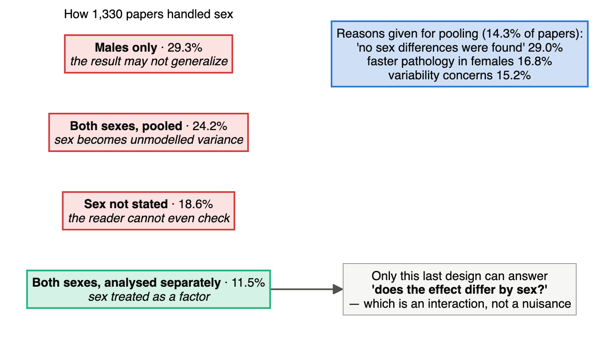
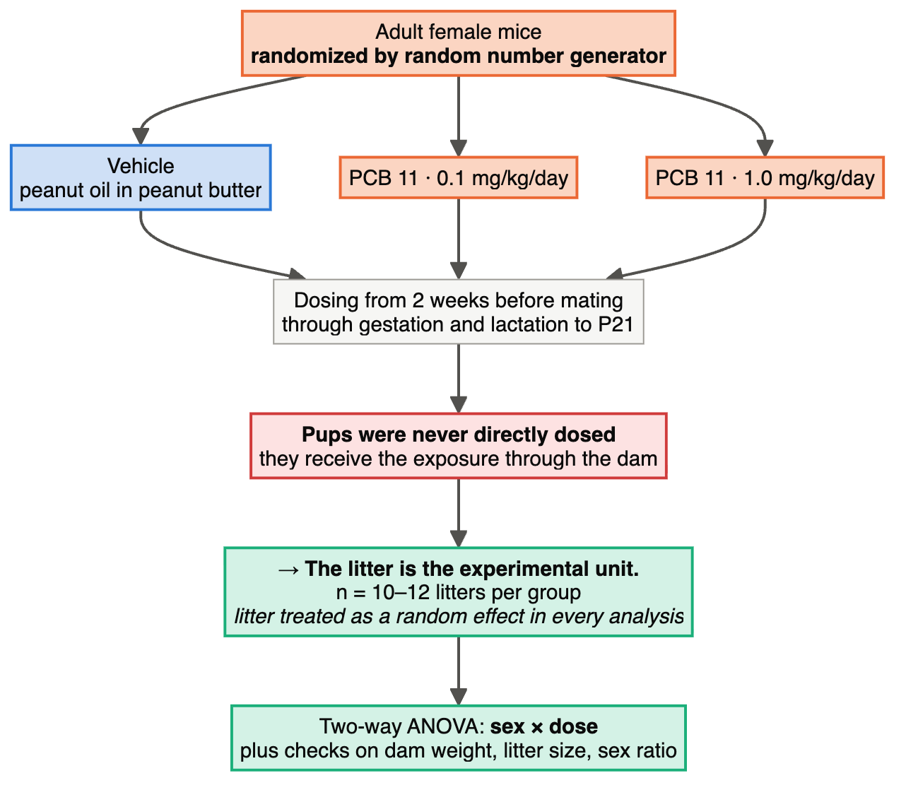
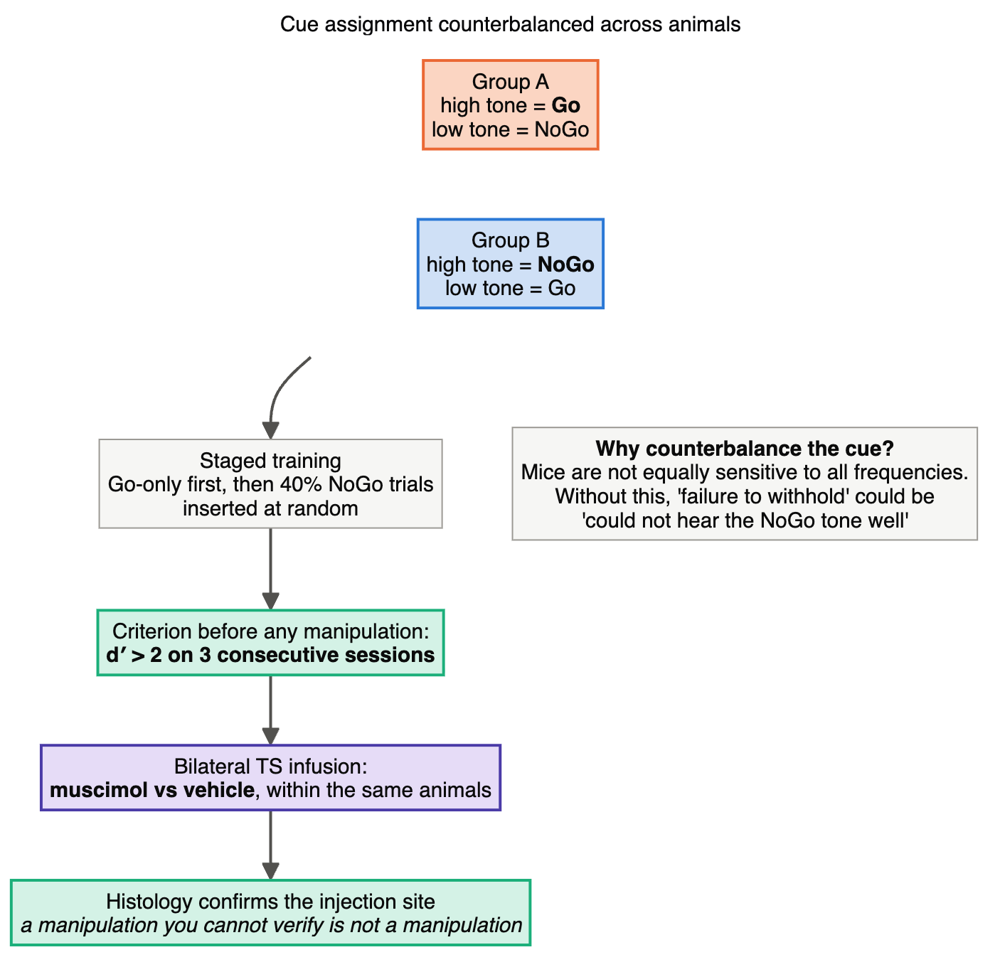
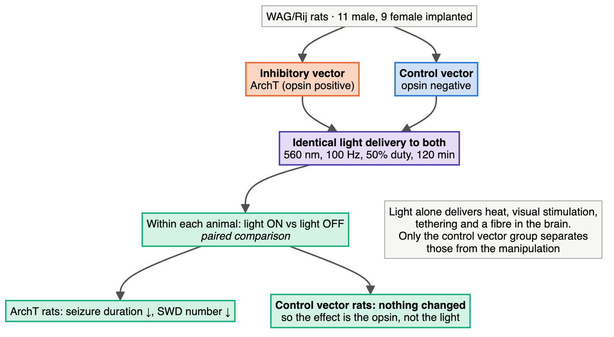

# Module 6 — Neuroscience: Ten Designs, Read From the Methods

> **Sub-course: Design in the Literature**
> [← Module 5](05-ecology-and-microbiome.md) · [Sub-course home](README.md) · [Next: Module 7 — Biotechnology and Bioprocess →](07-biotech-and-bioprocess.md)

---

## 🧭 Learning Objectives

After this module you will be able to:

1. Find the **experimental unit** when the measurements are cells, trials, sessions or pups, and the treatment was applied to an animal or a dam.
2. Audit a **within-subject** design for order effects, counterbalancing and carry-over.
3. Recognize the controls a **circuit manipulation** needs: control vector, sham, light-only, vehicle.
4. Read a **power and preregistration** statement, and judge what a field-wide median sample size implies about its published literature.
5. Treat **sex** as a design factor rather than a reporting checkbox.
6. Separate **group-level effects** from **individual-level reliability**, and say why a significant mean can sit on top of a near-zero ICC.

---

## 🎯 The Big Picture

Neuroscience is where almost every design trap in this course appears at once. The measurements are
cheap and numerous — trials, cells, voxels, electrodes — while the units are expensive and few:
animals, litters, participants, sessions. Every analysis therefore has to decide which of those
numbers is *n*, and the honest answer is almost always the small one.

Two papers in this module are not experiments at all. They are surveys of what a whole field does —
515 brain-behaviour studies published in one year, and 1,330 papers using one mouse model. They are
here because they turn "you should power your study" and "you should consider sex" from advice into
measured facts about the literature you are about to join.

---

## 📄 Paper 1 · What a whole field's sample sizes look like — 515 brain-behaviour studies

**Systematic review of brain association studies (2026)** ([Wacker et al., 2026](https://doi.org/10.1111/psyp.70365)), in *Psychophysiology*. Start
here, because it tells you what the other nine papers are swimming in.

**Source audit:** [Open full text](https://pmc.ncbi.nlm.nih.gov/articles/PMC13401052/). Record the section or figure supporting each design claim before reading the interpretation.

### What the methods say

> "We conducted a systematic review of original studies published in 2024 that investigated links
> between individual differences in a psychological variable ... and any measure of brain structure
> or activity. **This review was preregistered**". From 515 articles the authors extracted the final
> sample size, whether a preregistration was referred to, whether statistical power was computed, and
> whether at least one significant association was reported.
>
> The findings:
>
> > "Of the 515 studies identified, **26 (i.e., 5.0%) referred to a preregistration**, **none of the
> > studies reported to have employed blind analysis** of their data, and **three (0.6%** ... **) were
> > replications** of prior published studies. The vast majority of studies (**96.3%** ...) reported
> > at least one significant association between brain measures and" psychological variables.
>
> On size: "the vast majority of the studies that (presumably) collected new data did not exceed
> sample sizes of N = 200 with **half of the work being conducted on 80 participants or less**.
> Statistical power with this median sample size is only adequate (i.e., ≥ 0.80 with alpha = 0.05) for
> population effect sizes of **at least rho = 0.30**. ... around **83% of these studies did not achieve
> sufficient power to detect an effect of rho = 0.20**."
>
> The authors are candid about their own deviations: "**Deviating from the preregistration**, when
> coding for a significant effect, main effects and interactions were not differentiated, because the
> boundaries between the two turned out to be too diffuse to be informative."

### The design, drawn

### Reading it

Compare with the course interpretation after completing your audit

- **The two headline numbers are in direct tension.** If the typical study is powered only for
  *rho* ≥ 0.30 and the real effects are nearer *rho* = 0.20, then most studies should be reporting
  null results. Instead 96.3% report something significant. The gap between expected and observed
  positivity is the signature of flexible analysis, selective reporting, or both — and it is the
  reason the remaining papers in this module are worth reading closely for their guard rails
  ([Ch. 8](../../chapters/08-sample-size-and-power.md)).
- **"None ... employed blind analysis."** Blinding in human neuroimaging does not mean blinding the
  participant; it means analysing data with the group labels or the outcome scrambled until the
  pipeline is fixed. Zero out of 515 is a field-level fact about how much freedom sits between raw
  data and a *p*-value ([Ch. 4](../../chapters/04-randomization-and-blinding.md)).
- **The review preregistered itself, then reported a deviation.** That is how a deviation is supposed
  to work: stated, with the reason, so the reader can judge it. A preregistration is not a promise
  never to change anything; it is a record of what changed and when
  ([Ch. 25](../../chapters/25-preregistration-and-reporting.md)).
- **Do not read "80 participants" as always too few.** It is too few *for this question* — small
  individual-difference correlations. The same 80 participants would be ample for a large
  within-subject effect, which is exactly the design Papers 3, 4 and 8 use to escape the problem.

---

## 📄 Paper 2 · Sex as a design factor, measured across 1,330 papers

**Review of sex as a biological variable in the 5xFAD model (2026)** ([Neuharth et al., 2025](https://doi.org/10.1186/s13293-025-00788-3)), in *Biology of Sex
Differences*.

**Source audit:** [Open full text](https://pmc.ncbi.nlm.nih.gov/articles/PMC12709748/). Record the section or figure supporting each design claim before reading the interpretation.

### What the methods say

> "We analyzed **1,330 primary research articles** indexed on PubMed and recorded information provided
> regarding subject sex ... Trends were then plotted as a function of time ending in December 2024."
> The coding scheme is a design taxonomy: "Articles coded 'males only' or 'females only' utilized
> exclusively a single sex. For a paper to be assigned to the '**both sexes – separated**' category,
> at least one dataset provided must have data independently tabulated for males and females with an
> analysi[s]".
>
> > "the largest proportion of articles used **only male subjects (29.3%)**, followed by studies using
> > **both sexes but failing to account for potential sex differences** within the datasets
> > (**24.2%**). Indeed, manuscripts considering the modulatory influence of sex were in the minority
> > (**11.5%**), behind articles where **subject sex is not mentioned (18.6%**)."
>
> And on the reasons given: "Among the articles that provided justifications for lack of consideration
> of SABV (**n = 190/1,330 or 14.3%**), the largest proportion combined data because **no sex
> differences were found (29.0%)**, followed by the accelerated pathology in female 5xFAD mice
> (16.8%) and concerns over inter-/intra-sex variability (15.2%)".

### The design, drawn

### Reading it

Compare with the course interpretation after completing your audit

- **"Both sexes" and "sex as a variable" are different designs.** Running males and females and
  pooling without modelling sex can obscure heterogeneity. A pooled comparison can still target an average effect over the sampled sex composition, provided that target is stated. Running them and analysing sex as a factor
  turns the same animals into a factorial experiment whose interaction term asks whether the
  treatment works differently in each sex ([Ch. 7](../../chapters/07-treatment-structures.md)).
- **"No sex differences were found" is the most common justification and the weakest one.** A study
  powered to detect a main effect of genotype is typically *not* powered to detect a genotype × sex
  interaction — the rule of thumb is that an interaction of the same size needs roughly four times the
  sample. So "we checked and found nothing" is usually a statement about power, not about biology
  ([Ch. 8](../../chapters/08-sample-size-and-power.md)).
- **Where pooling is defensible, say so as a design decision.** If sex is a block rather than a
  factor of interest, include it as a blocking variable and report that you did. What this review
  documents is not pooling itself but pooling *silently* — 18.6% of papers do not state the sex of
  their animals at all ([Ch. 5](../../chapters/05-blocking-and-batches.md)).
- **Note the honest wrinkle the review itself raises.** Female 5xFAD mice develop pathology faster,
  so a single-sex study is not merely narrower — in this model the two sexes are on different
  timelines, which means the *same* age is not the same disease stage. That is a confound between
  sex and severity, not just reduced generality.

---

## 📄 Paper 3 · A power analysis done twice, and preregistered — symmetry ERPs

**Preregistered symmetry ERP study (2026)** ([Buckley & Makin, 2026](https://doi.org/10.1111/ejn.70608)), in the *European Journal of
Neuroscience*. The antidote to Paper 1, in one methods section.

**Source audit:** [Open full text](https://pmc.ncbi.nlm.nih.gov/articles/PMC13314561/). Record the section or figure supporting each design claim before reading the interpretation.

### What the methods say

> "Three specific predictions were **preregistered**", stated as directional claims — including one
> genuinely falsifiable null: "**There will be no glass SPN in the Cross task.**"
>
> The sample size is justified twice, by different routes:
>
> > "The current project had **156 participants with 52 participants completing each of the three
> > tasks. This sample size was preregistered and justified in two ways.** First, the current study
> > needed to confirm apparent pairwise differences ... with two-tailed paired samples *t*-tests.
> > Brysbaert (2019) suggests a typical Cohen's *dz* is 0.4 in psychology, and **52 participants are
> > required for power to reach 0.8**. The second justification came from an **ANOVA power
> > simulation** ... With 52 participants in each task, the ANOVA power simulation found **90% power
> > for the Task × Stimulus type interaction**, and > 99% power for each main effect."
>
> The layout is mixed: "The current study employs a **mixed design**. All participants viewed the
> same six types of stimuli: 3 Regularity (reflection, glass and random) × 2 Luminance (black and
> white). They were **assigned to one of the three tasks** (Regularity, Luminance or Cross).
> **Stimuli were presented in a randomized order in each task.**"

### The design, drawn

### Reading it

Compare with the course interpretation after completing your audit

- **The power calculation targets the effect the paper is about.** Most power statements size the
  study for a main effect and then interpret an interaction. Here the simulation is explicitly loaded
  with predicted means and SDs for the 3 × 2 design and asked for power on the **Task × Stimulus**
  interaction. That is the right target, because the hypotheses are all comparisons *between* tasks
  ([Ch. 8](../../chapters/08-sample-size-and-power.md)).
- **Why a mixed design buys so much.** Stimulus type is manipulated *within* participants, where
  between-person variability cancels; task has to be *between* participants, because you cannot make
  someone unsee a regularity judgement they have already been doing. The expensive factor is the
  between-subjects one, and that is where the 52-per-group number is spent
  ([Ch. 7](../../chapters/07-treatment-structures.md)).
- **A preregistered null prediction is the strongest kind.** "There will be no glass SPN in the Cross
  task" cannot be rescued by a flexible analysis: if an SPN appears, the prediction is wrong. Compare
  Paper 1's finding that 96.3% of studies report something significant — a field in which predictions
  can only succeed is a field whose predictions carry little information
  ([Ch. 25](../../chapters/25-preregistration-and-reporting.md)).
- **Randomized stimulus order is doing quiet work.** Fixed order would confound stimulus type with
  fatigue, habituation and electrode drift across the session.

---

## 📄 Paper 4 · Every participant is their own control — cortisol suppression and memory

**Metyrapone crossover fMRI study (2026)** ([Antypa et al., 2026](https://doi.org/10.1038/s41386-026-02505-z)), in *Neuropsychopharmacology*.

**Source audit:** [Open full text](https://pmc.ncbi.nlm.nih.gov/articles/PMC13598141/). Record the section or figure supporting each design claim before reading the interpretation.

### What the methods say

> "Participants underwent testing in a **randomized, placebo-controlled, double-blind, within-subject
> crossover design**. After an adaptation night in the lab, each participant was tested under two
> conditions (metyrapone and placebo), with three sessions for each condition. **The order of
> conditions was counterbalanced across subjects.**"
>
> The materials are counterbalanced too, not just the drug: "**Two different sets of photo-word pairs
> were presented and counterbalanced between the two conditions across both sessions.**" Encoding used
> "50 neutral photos and 50 emotional photos of negative valence, each paired with descriptive words".
>
> The sample: "The study sample included **23 healthy participants** (mean age 26.26 ± 4.61 years ...
> **four females and 19 males**)."

### The design, drawn

### Reading it

Compare with the course interpretation after completing your audit

- **Two things are counterbalanced, and both matter.** Condition order protects against practice,
  fatigue and familiarity with the scanner. Stimulus-set assignment protects against one photo set
  simply being more memorable. Counterbalance only the first and a set effect is free to look like a
  drug effect ([Ch. 4](../../chapters/04-randomization-and-blinding.md)).
- **23 participants is not comparable to Paper 1's 80.** In a within-subject design each participant
  contributes a *difference*, so between-person variability — the dominant noise term in human
  neuroscience — is removed before the test. This is the main reason a within-subject design can be
  adequately powered at a sample size that would be hopeless for an individual-differences
  correlation ([Ch. 8](../../chapters/08-sample-size-and-power.md)).
- **Where the design is genuinely limited.** Four women and 19 men. Given that cortisol dynamics and
  emotional memory both vary with sex and menstrual phase, the design can estimate the drug effect in
  this sample but cannot address sex differences. Read alongside Paper 2: this is what "both sexes,
  pooled" looks like in a human study ([Ch. 11](../../chapters/11-observational-and-causal.md)).
- **The adaptation night is a control, not hospitality.** A first night in an unfamiliar lab disturbs
  sleep, and sleep affects both cortisol and memory consolidation. Discarding it makes the two arms
  comparable in a respect that would otherwise differ systematically between a participant's first
  and second visit.

---

## 📄 Paper 5 · The dam is the unit — developmental PCB exposure

**PCB 11 neurodevelopmental study (2026)** ([Wilson et al., 2026](https://doi.org/10.3389/ftox.2026.1816944)), in *Frontiers in Toxicology*. The clearest
litter-effect statement in this module.

**Source audit:** [Open full text](https://pmc.ncbi.nlm.nih.gov/articles/PMC13506163/). Record the section or figure supporting each design claim before reading the interpretation.

### What the methods say

> "Adult female C57BL/6J mice (8–10 weeks old) were **randomly divided into one of three experimental
> groups using a random number generator** ...: (1) **vehicle** (peanut oil in peanut butter); (2) PCB
> 11 at **0.1 mg/kg/day**; or (3) PCB 11 at **1.0 mg/kg/day**."
>
> The exposure route defines the unit: "Two weeks prior to mating ... PCB dosing of dams was
> initiated. PCB dosing of the dams continued until pups reached postnatal day (P) 21. **Pups were
> never directly dosed.**"
>
> > "**Litter was treated as a random effect for all analyses.**"
>
> Group sizes are reported in litters: "**n = 10–12 litters per group**", and outcomes were analysed
> with "a **two-way ANOVA with sex and dose as factors**". Developmental toxicity was checked first —
> "PCB 11 had no significant effect on dam or pup weight", number of pups per litter, or sex ratio.

### The design, drawn

### Reading it

Compare with the course interpretation after completing your audit

- **Dose the mother, and the mother is the unit.** Every pup in a litter shares one dosed dam, maternal exposure, milk supply and nest. They have individual placentas. Eight pups from one treated litter are eight measurements
  of one exposure, and counting them as *n* = 8 ignores within-litter dependence; the precision error depends on that dependence.
  The paper avoids this in the strongest available way: *n* is reported in litters, and litter enters
  every model as a random effect ([Ch. 3](../../chapters/03-experimental-unit-and-replication.md)).
- **Sex is a factor here, not a footnote.** The two-way ANOVA with sex and dose asks whether the
  dose effect differs between male and female pups — exactly the design Paper 2 found in only 11.5%
  of the 5xFAD literature ([Ch. 7](../../chapters/07-treatment-structures.md)).
- **The vehicle is matched to the delivery route.** PCB was given in peanut butter; controls got
  peanut oil in peanut butter. Compare the grassland experiment's water-only plots in
  [Module 5](05-ecology-and-microbiome.md) — the same principle, different field
  ([Ch. 6](../../chapters/06-controls-and-comparators.md)).
- **Checking for overt toxicity first is a design step.** If the high dose had reduced pup weight or
  litter size, every downstream neurodevelopmental difference could be a consequence of general
  sickness rather than a specific effect. Showing no effect on dam weight, litter size or sex ratio
  clears that alternative explanation before the main analysis begins.
- **Two doses plus vehicle is a direction, not a curve.** As in Module 3's preclinical paper, three
  points can show monotonicity but cannot locate a threshold or an EC50
  ([Ch. 7](../../chapters/07-treatment-structures.md)).

---

## 📄 Paper 6 · Counterbalancing the stimulus, not just the subject — striatal inhibitory control

**Tail-of-striatum Go/NoGo study (2026)** ([Ferrigno et al., 2026](https://doi.org/10.1126/sciadv.aeb5352)), in *Science Advances*.

**Source audit:** [Open full text](https://pmc.ncbi.nlm.nih.gov/articles/PMC13426436/). Record the section or figure supporting each design claim before reading the interpretation.

### What the methods say

> "To investigate mechanisms of inhibitory control, we used an **auditory Go/NoGo task** in which mice
> were trained to appropriately respond or withhold responding to sounds associated with distinct
> outcomes." And then the sentence worth copying into your own methods:
>
> > "**High- and low-frequency band-limited sounds were counterbalanced across animals as Go and NoGo
> > cues.**"
>
> Training was staged — "Mice were initially trained in trials containing only the rewarded Go sound,
> with the final stage of training introducing a **random subset (40% of total trials)** of nonrewarded
> NoGo sound trials" — and the causal test waited for a performance criterion: "When animals reached
> 'expert' performance on the Go/NoGo task (**d′ > 2 on at least three consecutive Go/NoGo sessions**),
> we **bilaterally injected** the GABAA receptor agonist **muscimol** into the TS", with
> **vehicle** sessions for comparison and histology confirming the injection site.

### The design, drawn

### Reading it

Compare with the course interpretation after completing your audit

- **The counterbalance removes a confound nobody would see in the results.** If the high tone were
  always the NoGo cue, then any difference in audibility, salience or aversiveness between the two
  frequencies would be perfectly confounded with the Go/NoGo distinction. Swapping the mapping in half
  the animals makes that difference cancel in the group average. This is the rodent version of Module
  5's unique playback stimulus — replicate or counterbalance the *stimulus*, not only the subject
  ([Ch. 3](../../chapters/03-experimental-unit-and-replication.md)).
- **An eligibility criterion standardizes readiness.** Requiring d′ > 2 for three consecutive sessions standardizes eligibility before the manipulation. It reduces variation in training readiness, but does not make performance identical and is not blocking unless treatment is allocated within groups defined by readiness.
- **Vehicle sessions in the same animals.** The comparison is within-animal, so surgical placement,
  training history and individual skill are differenced out — and the vehicle controls for the
  infusion itself, which involves handling, pressure and volume regardless of what is in the syringe
  ([Ch. 6](../../chapters/06-controls-and-comparators.md)).
- **Histology is part of the design.** A missed injection produces a null result that looks like
  "this region is not involved". Verifying the site converts an untestable assumption into a reported
  fact ([Ch. 15](../../chapters/15-measurement-and-benchmarking.md)).

---

## 📄 Paper 7 · The control the light needs — optogenetic inhibition in absence epilepsy

**SNr optogenetics study (2026)** ([Palmer & Forcelli, 2026](https://doi.org/10.1111/epi.18701)), in *Epilepsia*.

**Source audit:** [Open full text](https://pmc.ncbi.nlm.nih.gov/articles/PMC12927675/). Record the section or figure supporting each design claim before reading the interpretation.

### What the methods say

> "Animals were used in three experiments: (1) in vivo single-unit electrophysiology recordings,
> (2) fiber photometry to measure GABA levels, and (3) **optogenetic modulation** of SNr activity. For
> electrophysiology experiments, **11 male and 9 female rats** were implanted".
>
> The control is the point:
>
> > "For open-loop modulation, light pulses (green light, λ = 560 nm) were delivered for the duration
> > of the observation period (120 min) to **both inhibitory vector (opsin positive) and control vector
> > (opsin negative) animals**."
>
> The comparison is within animal — "On a **within-subject basis**, we compared open-loop (continuous)
> 100 Hz optogenetic inhibition of the SNr" — and the result is reported for both groups: seizure
> duration and spike-wave discharge number "were reduced significantly by 100 Hz light delivery in
> ArchT-expressing WAG/Rij rats", whereas "**in control vector rats, no measure of SWDs was altered by
> the light delivery**".
>
> Exclusions are stated with their reason: "several animals were excluded from the analysis of average
> SWD duration, as they **displayed no SWDs during the 30 min session** ... and this would have
> artificially reduced the SWD duration."

### The design, drawn

### Reading it

Compare with the course interpretation after completing your audit

- **The control vector is the only thing that makes the claim causal.** Shining light into a brain
  heats the tissue, scatters visibly, and requires a tether. An opsin-negative animal receiving the
  identical light isolates the one difference that matters. "Light on vs light off in opsin-positive
  animals" alone would confound the opsin with everything else light does
  ([Ch. 6](../../chapters/06-controls-and-comparators.md)).
- **Two layers of comparison, stacked.** Within animal (light on vs off) removes individual seizure
  burden, which varies enormously between rats; between groups (opsin vs control vector) removes the
  effect of light itself. Each layer closes an alternative explanation the other cannot.
- **Both sexes, stated.** Eleven male and nine female rats — the count is reported, which is the
  minimum Paper 2 found missing in 18.6% of its literature.
- **The exclusion rule is mechanical and pre-stated in its logic.** Animals with no seizures in a
  session have no "mean seizure duration" to average; including them as zeros would deflate the mean
  for reasons unrelated to the treatment. The important feature is that the rule depends on the
  *animal having no events*, not on which direction its data pointed
  ([Ch. 25](../../chapters/25-preregistration-and-reporting.md)).

---

## 📄 Paper 8 · A significant mean on top of an unreliable individual — comparing rTMS protocols

**rTMS reproducibility study (2026)** ([Passera et al., 2026](https://doi.org/10.1162/imag.a.1231)), in *Imaging Neuroscience*. A within-subject
comparison of five protocols that mostly reports nulls, and is more useful for it.

**Source audit:** [Open full text](https://pmc.ncbi.nlm.nih.gov/articles/PMC13377501/). Record the section or figure supporting each design claim before reading the interpretation.

### What the methods say

> "The next **10 sessions were divided into 2 blocks of 5 sessions for the 5 different protocols: 1
> Hz, 10 Hz, iTBS, cTBS, and SHAM. **The order of the different rTMS protocols was randomized across
> participants in the first block, with each participant repeating their assigned protocol sequence in
> the second block.** There was a minimum 1-week gap between each session, with at least a month-long
> interval between blocks."
>
> The sham is engineered, not nominal: "Realistic sham rTMS was delivered using the A/P Cool B65 coil
> ... positioned in placebo mode **with peripheral stimulation**. The sham protocol **randomly mimicked
> the rTMS parameters of one of the four active protocols** for each participant."
>
> The results:
>
> > "**Crucially, no main effect of protocol was found for any stimulation type** ..., indicating that
> > **active stimulation did not differ from SHAM**."
>
> > "Test–retest reliability of individual rTMS effects from Visit 1 to Visit 2 was **poor across all
> > protocol groups** (... 1 Hz ICC = -0.13, 10 Hz ICC = -0.12, SHAM ICC = -0.29, iTBS ICC = -0.27,
> > cTBS ICC = 0.22) ... individual participants often responded **inconsistently across sessions** for
> > all protocols."
>
> And the sham catches a real effect: "We found a main effect of time on completion time (CT);
> participants took longer to complete a sequence after rTMS. **However, this difference was also found
> in the SHAM condition across all protocols, indicating it was not rTMS related.**"

### The design, drawn

### Reading it

Compare with the course interpretation after completing your audit

- **Repeating the same sequence is what creates the second question.** Block 2 is not extra data; it
  is a second measurement of each person under each protocol, which is the only way to estimate
  test–retest reliability. A design that ran each protocol once could report the group means and
  would be silent about whether any individual's response is a stable property
  ([Ch. 15](../../chapters/15-measurement-and-benchmarking.md)).
- **An ICC near zero undercuts individualized claims.** If the same person shows facilitation on one
  visit and suppression on the next, then "responders" and "non-responders" identified from a single
  session are largely noise. Group-mean effects and individual-level reliability are different
  quantities, and a field can have the first without the second.
- **The sham arm converts a finding into an artefact — correctly.** Participants were slower after
  stimulation, and equally slower after sham. Without the sham condition that result would have been
  reportable as an rTMS effect. Compare Module 5's cardinals, where the control group revealed the
  background change among handled controls
  ([Ch. 6](../../chapters/06-controls-and-comparators.md)).
- **A null result from a well-powered within-subject design is informative.** This is the opposite of
  Paper 1's picture: a design built to detect differences, reporting that it did not find them, with
  the reliability statistics that explain why individual results in this literature have been hard to
  replicate ([Ch. 8](../../chapters/08-sample-size-and-power.md)).

---

## 📄 Paper 9 · More data per person, or more people? — dense-sampling EEG

**Precision EEG connectomics study (2026)** ([Graff et al., 2026](https://doi.org/10.1162/imag.a.1245)), in *Imaging Neuroscience*.

**Source audit:** [Open full text](https://pmc.ncbi.nlm.nih.gov/articles/PMC13237998/). Record the section or figure supporting each design claim before reading the interpretation.

### What the methods say

> "We leverage a unique dataset in which we collected data from adults and children across **four
> sessions and three passive viewing tasks, for a total of ~80 minutes of EEG data per person**."
>
> The recruitment creates a deliberate dependency: "Participants were recruited into a study using
> **precision functional mapping** to compare brain networks between adults and pre-adolescent
> children. Given the relatively high burden of this study with repeated visits, **we recruited a
> parent as an adult 'control' for each child. The non-independence in the data introduced by
> family**" is then handled in the models.
>
> Sessions are spaced and the stimulus order is randomized within session: "each session completed at
> least **3 days after the previous one** (median = **15 days** between visits)"; "**Within each
> session, the video category order was randomized across participants.**" One stimulus set is held
> constant on purpose: "All participants watched the same videos in the same order across sessions."
>
> Attrition and quality control are reported: "In total, **598 EEG recordings** were collected ... Four
> sessions of data (three recordings each) were excluded due to concerns with correct cap placement
> and five recordings were excluded due to too many noisy epochs ... This left **581 recordings** in
> the final sample **across 50 participants**."
>
> There is even a control against a self-inflicted analytic error: "Using the same forward solution to
> both project simulated time courses from source space to sensor space and to project them back to
> source space could bias results through the '**inverse crime**' ... We repeated this simulation
> process for eight participants ... where we used an" independent forward model.

### The design, drawn

### Reading it

Compare with the course interpretation after completing your audit

- **This is the opposite bet from Paper 1.** Brain-behaviour correlation studies need many people;
  this design takes 50 people and measures each of them eight times as thoroughly. Which is right
  depends entirely on the question: estimating a population correlation needs people, while
  estimating *this person's* network needs minutes. Neither is a bigger or better study
  ([Ch. 8](../../chapters/08-sample-size-and-power.md)).
- **The parent–child pairing is a confession turned into a model term.** Recruiting each child's own
  parent as the adult comparison makes recruitment feasible, and makes the adult and child samples
  correlated by family. The design names that and accounts for it rather than treating 50
  participants as 50 independent draws
  ([Ch. 3](../../chapters/03-experimental-unit-and-replication.md)).
- **Notice what is randomized and what is deliberately not.** Video *category order* is randomized
  across participants, so order effects do not align with category. The videos themselves are held
  constant across sessions, because the question is test–retest reliability — varying the stimulus
  between sessions would mix stimulus differences into the reliability estimate. Randomize what could
  confound; fix what you are trying to measure the stability of
  ([Ch. 4](../../chapters/04-randomization-and-blinding.md)).
- **The "inverse crime" check is a methodological negative control.** If you simulate data with the
  same model you then use to analyse it, the analysis will recover what you put in. Repeating the
  simulation with an independent forward model tests whether the result survives when that circularity
  is broken — the same instinct as Module 4's unedited-site negative controls
  ([Ch. 15](../../chapters/15-measurement-and-benchmarking.md)).

---

## 📄 Paper 10 · A within-animal control, and an analysis that does not use it

**PVT→cholinergic synaptic plasticity study (2026)** ([Macdonald et al., 2026](https://doi.org/10.1038/s41467-026-73906-3)), in *Nature Communications*. The
design here is better than one of the tests applied to it, which makes it a useful final case.

**Source audit:** [Open full text](https://pmc.ncbi.nlm.nih.gov/articles/PMC13237380/). Record the section or figure supporting each design claim before reading the interpretation.

### What the methods say

> The circuit manipulation uses each animal as its own control, by hemisphere:
>
> > "ChAT-Cre mice were injected with channelrhodopsin in pPVT, and **FLEX-Cas9-sgGria1 and empty
> > control contralaterally in NAc**"
>
> Recordings are reported at two levels at once: "(**sgGria1 n = 12 neurons, empty n = 12 neurons from
> 4 mice**)", and the tests applied are "**Unpaired *t* tests**: oEPSC amplitude p = 0.0003; Rise time
> p = 0.0206; Decay time p = 0.0321; Paired-pulse ratio p = 0.0009".
>
> Elsewhere in the same paper, hierarchical data *is* modelled hierarchically: photometry is analysed
> by "**mixed effects model** ...: Shuttle initiation: **n = 204 trials from 6 mice**; Safety: n = 305
> trials from 6 mice" — and a weak effect is described without overclaiming: "Although the across-day
> effect in the dLight cohort **did not reach conventional statistical significance** in an omnibus
> mixed-effects test, the effect size and direction were consistent with" the hypothesis.

### The design, drawn

### Reading it

Compare with the course interpretation after completing your audit

- **The contralateral design is excellent.** Knockout in one hemisphere, empty vector in the other,
  in the same animal: surgery day, age, behavioural history, slice quality and recording rig are all
  identical across the comparison. Very few manipulations permit this, and when one does it is the
  strongest control available ([Ch. 6](../../chapters/06-controls-and-comparators.md)).
- **An unpaired *t* test discards the design's two best features.** It treats 12 neurons as 12
  independent observations — they come from 4 mice — and it ignores that each knockout hemisphere has
  a matched control hemisphere in the same animal. A paired comparison of mouse-level hemisphere summaries, or a multilevel model with neurons nested within hemisphere and mouse, would use both. Pairing individual neurons arbitrarily would not. The effects reported are large and consistent across several
  measures, so the conclusion may well be right; the point is that the stated *p*-values rest on a
  sample size the design did not collect
  ([Ch. 3](../../chapters/03-experimental-unit-and-replication.md)).
- **Reporting "from 4 mice" is what makes the audit possible.** Most papers with this issue write
  "n = 12". Here both levels are given, so a reader can see the structure and judge it. That is the
  reporting standard to copy even when the analysis is imperfect
  ([Ch. 25](../../chapters/25-preregistration-and-reporting.md)).
- **The same paper gets it right elsewhere.** Trial-level photometry is analysed with a mixed-effects
  model that nests trials in mice. This is the usual pattern across neuroscience: hierarchical tools
  are used for the data that obviously look hierarchical (hundreds of trials) and skipped for the data
  that look like a tidy two-group comparison (12 vs 12 cells).
- **And it describes a near-miss honestly.** An effect that "did not reach conventional statistical
  significance" is reported as such, with direction and effect size, rather than as a trend toward
  significance ([Ch. 8](../../chapters/08-sample-size-and-power.md)).

---

## 🔎 Sidebar · Blocking, written for this field

A 2026 tutorial in *eNeuro* ([Reynolds, 2026](https://doi.org/10.1523/eneuro.0006-26.2026)) sets out blocked designs specifically for preclinical
neuroscience. Three of its statements are worth memorizing:

> "The block factor can be a physical grouping variable such as **cage, litter, pen, tank, or donor**.
> For example, animals housed together in the same cage share a common physical and social environment
> and therefore are more similar to each other than to animals in other cages."

> "In blocked designs **replicates refer to the number of blocks** of each complete set of treatments.
> Therefore, sample size calculations for a blocked design require an estimate of the **number of
> blocks (not 'group size')**".

> "**Random treatment allocation:** Treatments are randomly allocated to the experimental units.
> **Random sequence allocation:** During data collection, **order of processing is randomized**."

That last distinction is the one most often missed. Randomizing *which animal gets which treatment*
does nothing about the fact that all the controls were perfused on Monday and all the treated animals
on Thursday. Both randomizations are needed, and they are separate acts
([Ch. 5](../../chapters/05-blocking-and-batches.md)).

---

## Independent transfer task · Assignment versus observation

Six dams per group receive an exposure, with four pups measured per dam. Draw the hierarchy, explain how sex enters the analysis, and propose a stronger allocation or measurement plan without adding dams.

Use the [evidence worksheet and assessment criteria](README.md#evidence-worksheet).
Submit your diagram, source-backed reasoning and one remaining uncertainty before looking at the
sample answers. More than one redesign may be defensible; justify yours against the stated constraint.

---

## ⚠️ Common Misconceptions

| ❌ The misconception | ✅ What is actually true — and what to do |
|---|---|
| **"n = 12 neurons is a sample of 12."** | In Paper 10 they come from 4 mice, and the two conditions sit in the two hemispheres of each. The design supports a paired, nested analysis; an unpaired *t* test uses neither. |
| **"Pups are independent animals."** | In Paper 5 only dams were dosed. The litter is the unit, *n* is reported in litters, and litter is a random effect in every model. |
| **"80 participants is a decent neuroimaging sample."** | For a within-subject effect, often yes. For an individual-differences correlation it gives adequate power only at *rho* ≥ 0.30 — and ~83% of Paper 1's studies were underpowered for *rho* = 0.20. |
| **"If 96% of studies find something, the effects must be real."** | Paper 1 shows that proportion is impossible to reconcile with the field's power. A positivity rate far above median power is a symptom, not a reassurance. |
| **"Using both sexes means sex was considered."** | Paper 2 separates "both sexes, pooled" (24.2%) from "both sexes, analysed separately" (11.5%). Only the second can detect a sex difference. |
| **"'We found no sex differences' settles the question."** | Detecting an interaction needs roughly four times the sample of the equivalent main effect. Usually that sentence is a power statement. |
| **"Light on vs light off is the optogenetic control."** | Light heats tissue, is visible, and arrives through a tether. Paper 7 delivers identical light to opsin-negative animals, which is what isolates the opsin. |
| **"A sham arm is a formality."** | Paper 8's participants slowed after stimulation — and equally after sham. The sham turned a finding into an artefact. |
| **"A significant group effect means the measure is usable per person."** | Paper 8 found ICCs near zero or negative. Group means and individual reliability are different quantities. |
| **"More data is more data."** | Paper 9 trades people for minutes per person. That is right for reliability questions and wrong for population correlations. Choose which axis your question needs. |
| **"Randomizing treatment allocation is randomization."** | The sidebar separates it from random *sequence* allocation. Processing all controls on Monday reintroduces everything randomization removed. |

---

## ✅ Check Your Understanding

**⭐ Q1.** In Paper 5, dams were randomized but pups were measured. State the experimental unit and the
sample size, and say what would be wrong with reporting *n* = 60 pups.

**⭐⭐ Q2.** Paper 6 counterbalanced which tone served as the Go cue. Describe the specific alternative
explanation this removes, and why it would be invisible in the results if the mapping had been fixed.

**⭐⭐ Q3.** Paper 1 reports that the median study is powered for *rho* ≥ 0.30 while 96.3% report a
significant association. Explain in two sentences why these two facts are hard to reconcile.

**⭐⭐⭐ Q4.** Paper 8 found no difference between active protocols and sham, *and* near-zero test–retest
reliability. Explain how a literature of single-session studies could nevertheless contain many
significant published rTMS effects.

**⭐⭐⭐ Q5.** Paper 10 recorded 12 neurons per condition from 4 mice, with the two conditions in opposite
hemispheres of each animal. Write the analysis you would run instead of an unpaired *t* test, and say
what each part of it uses that the *t* test discards.

---

## 📝 Sample Answers & Assessment

▶ Show sample answers

> **Q1:** *"The litter is the experimental unit, because dosing was applied to the dam and pups were
> never directly dosed; n is 10–12 litters per group. Reporting n = 60 pups would treat littermates as
> independent replicates of the exposure when they share one dam, maternal exposure, milk supply and one
> nest — ignoring dependence among pups and potentially understating the standard
> errors; the extent depends on within-litter correlation accordingly."* — **Example answer.**

> **Q2:** *"If the high tone were always the NoGo cue, then any difference between the two frequencies
> — audibility, salience, aversiveness — would be perfectly confounded with the Go/NoGo contrast, so
> 'failure to withhold responding' could really be 'could not hear that tone as well'. It would be
> invisible because the data would look exactly the same either way: there is no column in the results
> that separates 'NoGo' from 'high frequency' when the two always coincide."* — **Example answer.**

> **Q3:** *"If the typical study can only reliably detect correlations of 0.30 or larger, and real
> brain–behaviour effects are generally smaller than that, then most studies should return null
> results. A 96.3% positivity rate therefore cannot be explained by the studies' own power, and points
> instead to analytic flexibility and selective reporting of whichever of many defensible analyses
> produced a significant result."* — **Example answer.**

> **Q4:** *"With a near-zero ICC, each session's measured 'response' is largely noise that varies
> randomly around a small or absent true effect. Any single session will therefore show apparent
> facilitation in some participants and suppression in others, and a small single-session study that
> happens to catch an imbalance can reach significance. Published literature then accumulates the
> subset of those sessions that reached p < 0.05, while the repeat measurement that would have exposed
> the instability is exactly what single-session designs never collect."* — **Example answer.**

> **Q5:** *"A linear mixed-effects model with condition (knockout vs empty) as a fixed effect and a
> random intercept for mouse — equivalently, for a simple contrast, a paired test on the per-animal
> difference between hemispheres. The random effect for mouse uses the nesting, so 12 neurons from 4
> mice contribute closer to 4 independent units than 12; the pairing uses the contralateral design, so
> surgery day, age, behavioural history and slice quality are differenced out within each animal. An
> unpaired t test discards both and computes its p-value as if 24 independent cells had been sampled
> from 24 independent animals."* — **Example answer.**

---

## 🧾 Module Summary

| Paper | Design | The lesson it teaches best |
|---|---|---|
| 515-study review ([Wacker et al., 2026](https://doi.org/10.1111/psyp.70365)) | Systematic review of a field's designs | What a median sample size does to a literature |
| 5xFAD sex review ([Neuharth et al., 2025](https://doi.org/10.1186/s13293-025-00788-3)) | Review of 1,330 papers' use of sex | "Both sexes" and "sex as a factor" are different designs |
| Symmetry ERPs ([Buckley & Makin, 2026](https://doi.org/10.1111/ejn.70608)) | Preregistered mixed design | Power the study for the interaction you will interpret |
| Cortisol and memory ([Antypa et al., 2026](https://doi.org/10.1038/s41386-026-02505-z)) | Double-blind within-subject crossover | Counterbalance the order *and* the materials |
| PCB 11 development ([Wilson et al., 2026](https://doi.org/10.3389/ftox.2026.1816944)) | Dose–response through the dam | Dose the mother and the litter is the unit |
| Striatal Go/NoGo ([Ferrigno et al., 2026](https://doi.org/10.1126/sciadv.aeb5352)) | Counterbalanced cues, within-animal infusion | Counterbalance the stimulus, not only the subject |
| SNr optogenetics ([Palmer & Forcelli, 2026](https://doi.org/10.1111/epi.18701)) | Opsin-negative control vector | Identical light to both groups is what isolates the opsin |
| rTMS protocols ([Passera et al., 2026](https://doi.org/10.1162/imag.a.1231)) | Five protocols twice, within subject | Group effects and individual reliability are different things |
| Dense-sampling EEG ([Graff et al., 2026](https://doi.org/10.1162/imag.a.1245)) | 4 sessions × 3 tasks, parent–child pairs | More minutes per person, or more people — pick by question |
| PVT→CIN plasticity ([Macdonald et al., 2026](https://doi.org/10.1038/s41467-026-73906-3)) | Contralateral within-animal control | A strong design can be let down by the test applied to it |

---

## 🔗 Go Deeper

- Main course: [Ch. 3 — The Experimental Unit and Replication](../../chapters/03-experimental-unit-and-replication.md) ·
  [Ch. 4 — Randomization and Blinding](../../chapters/04-randomization-and-blinding.md) ·
  [Ch. 8 — Sample Size, Power and Precision](../../chapters/08-sample-size-and-power.md) ·
  [Ch. 24 — Neuroscience](../../chapters/24-neuroscience.md) ·
  [Ch. 25 — Pre-registration and Reporting](../../chapters/25-preregistration-and-reporting.md)
- Foundational: ([Lazic, 2010](https://doi.org/10.1186/1471-2202-11-5)) on pseudoreplication in neuroscience; ([Hurlbert, 1984](https://doi.org/10.2307/1942661)); ([Percie du Sert et al., 2020](https://doi.org/10.1371/journal.pbio.3000410)) (ARRIVE)
- Then design your own: [Ch. 26 — The Design Clinic](../../chapters/26-capstone-design-clinic.md)

## 📚 References cited in this chapter

- Antypa D, Vuilleumier P, Rimmele U (2026). Cortisol suppression impairs retrieval of emotional memory and changes its neural correlates immediately and four days post-treatment. *Neuropsychopharmacology* 51:1991-1998. [doi:10.1038/s41386-026-02505-z](https://doi.org/10.1038/s41386-026-02505-z)
- Buckley N, Makin ADJ (2026). The Brain Response to Reflectional Symmetry Is Not Uniquely Preattentive. *European Journal of Neuroscience* 64:e70608. [doi:10.1111/ejn.70608](https://doi.org/10.1111/ejn.70608)
- Ferrigno SM, Iliakis E, Zhang N, Pandey S, Galanaugh J, Muhsinov J, et al. (2026). Indirect pathway neurons in the tail of the striatum regulate inhibitory control over sensory driven behavior. *Science Advances* 12:eaeb5352. [doi:10.1126/sciadv.aeb5352](https://doi.org/10.1126/sciadv.aeb5352)
- Graff K, Rai S, Yin S, Godfrey KJ, Merrikh D, Tansey R, et al. (2026). Towards precision EEG connectomics: Evaluating the benefits of dense sampling. *Imaging Neuroscience* 4:IMAG.a.1245. [doi:10.1162/imag.a.1245](https://doi.org/10.1162/imag.a.1245)
- Hurlbert SH (1984). Pseudoreplication and the Design of Ecological Field Experiments. *Ecological Monographs* 54:187-211. [doi:10.2307/1942661](https://doi.org/10.2307/1942661)
- Lazic SE (2010). The problem of pseudoreplication in neuroscientific studies: is it affecting your analysis?. *BMC Neuroscience* 11:5. [doi:10.1186/1471-2202-11-5](https://doi.org/10.1186/1471-2202-11-5)
- Macdonald EE, Ma J, Liu D, Yu K, Walker RA, Authement ME, et al. (2026). A synaptic mechanism for encoding the learned value of action-derived safety. *Nature Communications* 17:4916. [doi:10.1038/s41467-026-73906-3](https://doi.org/10.1038/s41467-026-73906-3)
- Neuharth JI, Hernandez KS, Bernholtz J, Edwards H, Stewart A (2025). Consideration of sex as a biological variable over the history of the 5xFAD Alzheimer’s Disease mouse model. *Biology of Sex Differences* 16:105. [doi:10.1186/s13293-025-00788-3](https://doi.org/10.1186/s13293-025-00788-3)
- Palmer D, Forcelli PA (2026). Restoring failed inhibition in the substantia nigra pars reticulata suppresses absence seizures in rats. *Epilepsia* 67:966-978. [doi:10.1111/epi.18701](https://doi.org/10.1111/epi.18701)
- Passera B, Fried PJ, Magnuson J, Buss SS, Pascual-Leone A, Ozdemir RA, et al. (2026). Assessing the efficacy and reproducibility of four common repetitive transcranial magnetic stimulation protocols: A sham-controled study. *Imaging Neuroscience* 4:IMAG.a.1231. [doi:10.1162/imag.a.1231](https://doi.org/10.1162/imag.a.1231)
- Percie du Sert N, Hurst V, Ahluwalia A, Alam S, Avey MT, Baker M, et al. (2020). The ARRIVE guidelines 2.0: Updated guidelines for reporting animal research. *PLOS Biology* 18:e3000410. [doi:10.1371/journal.pbio.3000410](https://doi.org/10.1371/journal.pbio.3000410)
- Reynolds PS (2026). Experimental Designs for Preclinical Neuroscience Experiments: Part 2—Blocking and Blocked Designs. *eneuro* 13:ENEURO.0006-26.2026. [doi:10.1523/eneuro.0006-26.2026](https://doi.org/10.1523/eneuro.0006-26.2026)
- Wacker J, Paul K, Scharfenecker A (2026). Brain Association Studies in 2024: A Systematic Review of Sample Sizes and Preregistrations. *Psychophysiology* 63:e70365. [doi:10.1111/psyp.70365](https://doi.org/10.1111/psyp.70365)
- Wilson RJ, Panesar HK, Dursun I, Mendieta R, Andrew PM, Li X, et al. (2026). Neurodevelopmental outcomes relevant to autism in juvenile mice exposed to PCB 11 in the maternal diet throughout gestation and lactation. *Frontiers in Toxicology* 8:1816944. [doi:10.3389/ftox.2026.1816944](https://doi.org/10.3389/ftox.2026.1816944)

---

[← Module 5](05-ecology-and-microbiome.md) · [Sub-course home](README.md) · [Next: Module 7 — Biotechnology and Bioprocess →](07-biotech-and-bioprocess.md)
