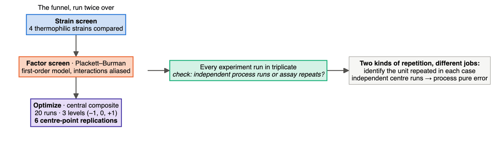

# Module 7 — Biotechnology and Bioprocess: Ten Designs, Read From the Methods

> **Sub-course: Design in the Literature**
> [← Module 6](06-neuroscience.md) · [Sub-course home](README.md) · [Next: Module 8 — Pharmacy →](08-pharmacy.md)

---

## 🧭 Learning Objectives

After this module you will be able to:

1. Read a **screening → optimization** sequence and say what each stage can and cannot answer.
2. Identify what a **screening design aliases away**, and why that assumption is acceptable at that stage.
3. Explain what **centre-point replicates** buy in a response-surface design.
4. Judge a **confirmation run**: predicted versus observed, with intervals.
5. Audit a **scale-up**, and say why design of experiments gets harder as the vessel gets bigger.
6. Assess a **measurement system** on linearity, repeatability and agreement between instruments.
7. Recognize when **OFAT is a legitimate first step** and when it is a substitute for thinking.

---

## 🎯 The Big Picture

Bioprocess development is the one corner of biology where formal experimental design is the norm
rather than the exception. The reason is economic: a fermentation run costs money and takes days, the
factor space is large, and the factors interact. Nobody can afford to vary one thing at a time across
eleven variables.

So the field converged on a funnel. **Screen** many factors in few runs, accepting that interactions
are confounded. **Optimize** the few survivors with a design that can fit curvature. **Confirm** the
predicted optimum with independent replicate runs. **Scale up**, where the design has to change again
because each run now costs a hundred times more.

Every paper below sits somewhere on that funnel, and the most instructive ones are explicit about
which stage they are at.

---

## 📄 Paper 1 · Screen eleven, optimize three — eumelanin from a desert fungus

**Eumelanin production study (2026)** ([El-Sapagh et al., 2026](https://doi.org/10.1186/s12934-026-03114-7)), in *Microbial Cell Factories*. The cleanest
statement of the two-stage logic, including the assumption it rests on.

**Source audit:** [Open full text](https://pmc.ncbi.nlm.nih.gov/articles/PMC13615586/). Record the section or figure supporting each design claim before reading the interpretation.

### What the methods say

> The paper opens by naming the alternative it rejects: "Conventional approaches such as the
> **one-factor-at-a-time** method are often inefficient, time-consuming, and **fail to account for
> interaction effects** between variables."
>
> Stage 1 screens broadly: "A **Plackett–Burman design** (PBD) was applied ... to screen the effects
> of **11 independent nutritional and physical variables** (pH, temperature, i[ncubation time ...])".
> And then the sentence every reader of a screening design needs:
>
> > "Since the **Plackett–Burman design is a first-order screening design, interaction effects among
> > variables were assumed to be negligible** and were therefore **not included** in the" model.
>
> Stage 2 narrows and adds curvature: "Based on the PBD results, the **three most influential factors**
> were selected for further optimization using response surface methodology (RSM) with a **Box–Behnken
> design** (BBD). The design matrix consisted of **17 experimental runs, including five replicates at
> the center point to estimate experimental error** and ensure model re[liability]."
>
> Selection of the organism was itself a screen: "A total of **21 morphologically distinct fungal
> isolates** were recovered ... Preliminary screening for melanin production revealed that **only one
> isolate (F11)** exhibited a pronounced ability to synthesize a diffusible dark brown pigment".

### The design, drawn

### Reading it

Compare with the course interpretation after completing your audit

- **The aliasing assumption is stated, which is rare and correct.** A Plackett–Burman design with 11
  factors in 12 runs cannot estimate interactions — each main effect is confounded with a bundle of
  two-factor interactions. That is not a flaw; it is the price of screening 11 factors in 12 runs. The
  only error would be to report a PB coefficient as if it were a clean main effect
  ([Ch. 14](../../chapters/14-screening-designs.md)).
- **Centre-point replicates do something no other run can.** The five centre points are five runs at
  *identical* settings, so the spread among them is pure experimental error with zero contribution
  from the factors. That number is what lets you ask whether the fitted surface misses the data by
  more than the process itself varies — the lack-of-fit test. Without replicated centre points, a
  response surface can only be assessed against itself
  ([Ch. 13](../../chapters/13-optimization-doe.md)).
- **Three nested screens, each cheap relative to the next.** 21 isolates → 1 strain; 11 variables → 3;
  3 variables → an optimum. Each stage discards most of the space using the cheapest experiment that
  can discriminate at that level. This is the funnel in miniature
  ([Ch. 14](../../chapters/14-screening-designs.md)).
- **What this design cannot tell you.** Whether a factor dropped at the PB stage would have mattered
  *in combination* with a retained one. Screening designs lose exactly that information, so a factor
  with a near-zero main effect but a strong interaction can be discarded and never seen again.

---

## 📄 Paper 2 · The same template, a different problem — chitinase from shrimp shell waste

**Chitinase production study (2026)** ([Abd-Elhalim & Ashour, 2026](https://doi.org/10.1186/s13068-026-02808-9)), in *Biotechnology for Biofuels and
Bioproducts*. Worth reading immediately after Paper 1, because the structure is identical and the
details differ.

**Source audit:** [Open full text](https://pmc.ncbi.nlm.nih.gov/articles/PMC13595610/). Record the section or figure supporting each design claim before reading the interpretation.

### What the methods say

> Four candidate organisms were compared before any optimization: "four thermophilic bacterial strains
> (*Bacillus amyloliquefaciens* BT 2022, *Bacillus licheniformis* Basma87, *Priestia megaterium* AMD
> 2024, and" one other) were evaluated.
>
> Stage 1: "**Plackett–Burman design worked to screen for the most important elements influencing
> chitinase production**. ... **Plackett–Burman's experimental design is predicated on the first-order
> model**".
>
> Stage 2: "Following the identification of the critical factors for chitinase synthesis by the pioneer
> strain using a PBD, the key variables derived from the previous step were optimized using a **CCD**.
> **Twenty sets of tests** (batch experiments), **six replications at the central point**, and **three
> distinct levels** (− 1, 0, and +1) were used".
>
> Replication at the bench level is stated too: "**There were three duplicates of each experiment.**"

### The design, drawn

### Reading it

Compare with the course interpretation after completing your audit

- **Two kinds of replication appear in one methods section, and they are not interchangeable.** The phrases “three duplicates of each experiment” and “six replications at the central point” need a unit audit. Were these separately prepared process runs or repeated assays of the same run? Independent centre-point runs estimate process pure error; assay repeats estimate measurement error. The wording alone does not establish that all triplicates are technical replicates.
- **A CCD can do something Box–Behnken does not, and vice versa.** A central composite design includes
  axial points whose position depends on the chosen design. A face-centred CCD places them on the cube faces; other choices extend beyond the cube. These points estimate curvature; a Box–Behnken design avoids the cube corners, which is useful when extreme
  combinations are physically impossible or unsafe. Both fit a quadratic; the choice is about where
  you can actually run ([Ch. 13](../../chapters/13-optimization-doe.md)).
- **Comparing strains first is the right order.** Optimizing the medium for a mediocre producer, then
  discovering a better strain, wastes the whole optimization — the optimum for one organism is not the
  optimum for another.
- **Note the honest limitation of the funnel.** The strain was chosen under *one* set of conditions,
  before optimization. A strain that performs poorly on the default medium but would excel on the
  optimized one is invisible to this ordering. The alternative — optimizing every strain — is usually
  unaffordable, which is worth saying rather than hiding.

---

## 📄 Paper 3 · From design points to a bioreactor — acid phosphatase from eggshell waste

**Eggshell waste bioprocessing study (2024)** ([Abdelgalil et al., 2024](https://doi.org/10.1186/s13036-024-00421-8)), in the *Journal of Biological
Engineering*.

**Source audit:** [Open full text](https://pmc.ncbi.nlm.nih.gov/articles/PMC11003023/). Record the section or figure supporting each design claim before reading the interpretation.

### What the methods say

> "The use of **consecutive statistical experimental approaches of Plackett–Burman Design (PBD) and**"
> response surface methodology structures the work.
>
> The screening design is spelled out with its run count: "The significant nutrient parameters
> influencing ACP production ... were determined using **fractional factorial two-level models based on
> a 2k-PBD (variables, k = 11) with six central points in 18 combination trial batches (twelve main
> batches plus six central point batches)**."
>
> Factor selection is by a stated rule, not by eye: "variables with the **uppermost t-values and
> confidence ranks of more than 95 percent (p < 0.05)** were" carried forward.
>
> The optimization design is larger: "A total of **36 trials with 16 cube points plus 12 middle
> points**" and axial runs.

### The design, drawn

### Reading it

Compare with the course interpretation after completing your audit

- **Centre points in a screening design are a curvature alarm.** A Plackett–Burman model is a plane.
  If the centre-point responses sit systematically above or below what that plane predicts, the surface
  is curved and the screening model is already inadequate — a signal to move to stage 2 rather than
  trust the screen's extrapolation ([Ch. 14](../../chapters/14-screening-designs.md)).
- **A pre-stated selection rule protects the funnel.** "Highest *t*-values with p < 0.05" is a rule
  that could have selected different factors than the authors hoped. Choosing survivors by inspection
  is where a screening stage quietly becomes an exercise in confirming expectations
  ([Ch. 25](../../chapters/25-preregistration-and-reporting.md)).
- **Flask optimum ≠ bioreactor optimum.** Shake flasks and stirred vessels differ in oxygen transfer,
  shear, mixing time and pH control. Carrying the optimum into a bioreactor is a *test*, and when the
  numbers change, the design has told you something about which factors were really proxies for oxygen
  ([Ch. 15](../../chapters/15-measurement-and-benchmarking.md)).

---

## 📄 Paper 4 · Standardizing what you are not studying — schizophyllan from 20 strains

**Schizophyllan production study (2026)** ([Chaimongkol et al., 2026](https://doi.org/10.3390/jof12050321)), in the *Journal of Fungi*.

**Source audit:** [Open full text](https://pmc.ncbi.nlm.nih.gov/articles/PMC13208628/). Record the section or figure supporting each design claim before reading the interpretation.

### What the methods say

> "**Twenty strains** of *Schizophyllum commune* from the BIOTEC culture collection were selected for
> this study", collected "from different habitats in Thailand ... between November 2012 and February
> 2021".
>
> The inoculum is deliberately fixed before anything is compared:
>
> > "For secondary screening, a **10% (v/v) large pellet seed culture** was used as the inoculum for
> > secondary screening **because it provides a standardized morphological form that allows consistent
> > comparison of EPS production among multiple isolates**."
>
> Three seed-culture forms had been prepared and characterized first — "mycelia (A), large pellets (B)
> and small pellets (C)" — so the standard was chosen, not assumed.
>
> Optimization then follows the funnel with explicit controls: "A **Plackett–Burman design** was used,
> and **11 factors (factors A–K)** ... were selected to generate **26 treatments** ... for assessing
> the impact of growth medium factors on exopolysaccharide production by the **3 selected strains**.
> **PDB and PYGM were used as controls.**"

### The design, drawn

### Reading it

Compare with the course interpretation after completing your audit

- **Fungal morphology is a confounder you can design away.** Mycelial, small-pellet and large-pellet
  cultures differ in surface area, oxygen access and shear sensitivity. If strains were inoculated in
  whatever form they happened to grow, "strain differences" would partly be "morphology differences".
  Fixing the inoculum form across all strains holds that variable constant
  ([Ch. 6](../../chapters/06-controls-and-comparators.md)).
- **"Standardized" is a design decision, not a courtesy.** Note the reasoning given: the standard was
  chosen *because* it allows consistent comparison. Holding a nuisance variable constant is the
  simplest alternative to blocking or randomizing it — it eliminates the variance but also eliminates
  any claim about other levels ([Ch. 5](../../chapters/05-blocking-and-batches.md)).
- **Two reference media as controls.** PDB and PYGM are standard formulations whose performance is
  known. Running them alongside the 26 designed treatments means a designed medium that "improves
  yield" is improving on a real benchmark rather than on an arbitrary baseline
  ([Ch. 6](../../chapters/06-controls-and-comparators.md)).
- **Running the PB design on three strains is a factorial in disguise.** Strain × medium factors means
  the design can reveal whether the best medium is the same for every strain — an interaction worth
  knowing before a process is committed to one organism
  ([Ch. 7](../../chapters/07-treatment-structures.md)).

---

## 📄 Paper 5 · The confirmation run — carotenoids under blue LED light

**Blue-LED carotenoid study (2026)** ([Delgado Cuadros et al., 2026](https://doi.org/10.1007/s00253-026-13760-x)), in *Applied Microbiology and Biotechnology*.
This paper closes the loop that most optimization papers leave open.

**Source audit:** [Open full text](https://pmc.ncbi.nlm.nih.gov/articles/PMC12932285/). Record the section or figure supporting each design claim before reading the interpretation.

### What the methods say

> The optimization is small and focused: "Experiments were conducted using a **Central Composite
> Design** to evaluate the effects of **glucose concentration (5.86–34.14 g/L)** and **yeast extract
> (YE) concentration (0.17–5.83 g/L)** on relative carotenoid accumulation".
>
> Then the step that matters:
>
> > "Experiments were carried out **in triplicate under the optimized conditions to validate the
> > predictive model**, maintaining identical temperature, agitation, and light parameters."
>
> And the comparison is reported as two intervals, not two points:
>
> > "A validation experiment was conducted under the optimized conditions, which corresponded to **10
> > g/L of glucose and 1 g/L of yeast extract**. Under these conditions, the quadratic model **predicted
> > a total carotenoid accumulation of 10.59 ± 0.48 Abs/g (mean ± 95% confidence interval)**, which was
> > **experimentally confirmed with a measured value of 10.13 ± 0.16 Abs/g (mean ± standard
> > deviation)**."
>
> Scale-up followed into "a **5 L stirred-tank bioreactor** ... The fermentation was conducted **in
> triplicate**" with pH, agitation, airflow and dissolved oxygen controlled and "an average light
> intensity of 398 lx".

### The design, drawn

### Reading it

Compare with the course interpretation after completing your audit

- **A fitted optimum is a prediction, and predictions get tested.** The response surface is an
  interpolating model built from the same data it is being judged on. Independent runs at the
  predicted optimum are new data, and they are the only evidence that the surface describes the
  process rather than the noise in it. An optimization paper that stops at "the model predicts a
  maximum of X" has not finished ([Ch. 12](../../chapters/12-predictive-studies.md)).
- **Reporting both intervals is what makes the comparison interpretable.** 10.59 with a 95% CI of
  ±0.48, against 10.13 with an SD of ±0.16. These are different quantities — one is uncertainty in a
  model prediction, the other is spread among three runs — and showing both lets a reader see that
  the discrepancy is within the noise rather than asking them to trust the word "confirmed"
  ([Ch. 8](../../chapters/08-sample-size-and-power.md)).
- **The optimum is interior, which matters.** 10 g/L sits well inside the 5.86–34.14 g/L range
  explored, so the model is interpolating. An "optimum" at the edge of the design space usually means
  the real optimum is outside it and the range was chosen badly
  ([Ch. 13](../../chapters/13-optimization-doe.md)).
- **Scale-up changes what is controlled.** In flasks, dissolved oxygen and pH drift. In the 5 L
  vessel they are held at setpoints. That makes the bioreactor result better controlled *and* not
  strictly the same experiment — a difference in yield between flask and vessel is not necessarily a
  scale effect ([Ch. 15](../../chapters/15-measurement-and-benchmarking.md)).

---

## 📄 Paper 6 · OFAT first, then DoE — lactic acid from corn steep water

**Lactic acid biorefinery study (2026)** ([Selim et al., 2026](https://doi.org/10.1038/s41598-026-35828-4)), in *Scientific Reports*. Useful precisely
because it does the thing the other papers criticize, and does it in a defensible order.

**Source audit:** [Open full text](https://pmc.ncbi.nlm.nih.gov/articles/PMC12864893/). Record the section or figure supporting each design claim before reading the interpretation.

### What the methods say

> The introduction states the standard objection: "The traditional '**one-factor-at-a-time**'
> optimization method **overlooks the interactions** between all parameters, changing one variable
> while holding the others constant, resulting in time-consuming" work.
>
> And then the methods use OFAT anyway — first: "Experiments were conducted to optimize fermentation
> conditions using the '**one-factor-at-a-time**' (OFAT) method to study the effects of various factors
> on LA production ... First, the impact of **sugar concentrations (20.0, 40.0, 60.0, 80.0, 100 g/L)**
> from CSW on LA production was tested".
>
> Only afterwards does the formal design appear: "With the **central composite design (CCD)** being the
> most widely used and successful optimization approach, statistical optimization was carried out
> utilizing RSM. A **2-level, 5-factor (2⁵) complete factorial-CCD** was used to assess the effects of
> **temp., pH, inoculum size, YE (with and without addition), and sugar content**."
>
> The process mode is also compared rather than assumed: batch fermentation has "disadvantages,
> including **substrate and product inhibition**, as well as long fermentation times", so "**the
> fed-batch fermentation** te[chnique]" was evaluated against it.

### The design, drawn

### Reading it

Compare with the course interpretation after completing your audit

- **OFAT as range-finding is legitimate; OFAT as optimization is not.** Before you can design a
  factorial you need plausible low and high levels for every factor, and a one-factor sweep is a cheap
  way to find them — exactly as the salinity study in [Module 4](04-omics-and-bioinformatics.md) used
  lethal doses to bracket a range. What OFAT cannot do is find a joint optimum, because it only ever
  walks along the axes of the factor space ([Ch. 13](../../chapters/13-optimization-doe.md)).
- **The sequence is the defence.** Had the paper reported only the OFAT results, the criticism in its
  own introduction would apply to it. Running the CCD afterwards means the single-factor sweeps are
  scaffolding, and the conclusions rest on the design that can see interactions
  ([Ch. 7](../../chapters/07-treatment-structures.md)).
- **One factor is categorical, and that is fine.** "YE (with and without addition)" is a two-level
  qualitative factor sitting in the same design as continuous ones. Response-surface designs handle
  this, but the surface can only be fitted *within* each level of the categorical factor — it is a
  switch between two surfaces, not a dimension you can optimize along.
- **Comparing batch with fed-batch is a different kind of question.** It is not a factor level; it is
  a different process architecture with its own control structure. Treating it as a separate,
  explicitly motivated comparison — inhibition relief — is clearer than burying it as a sixth factor.

---

## 📄 Paper 7 · Forty-eight small vessels, then six larger ones — Fab production screening

**Automated Fab screening study (2026)** ([Schröder-Kleeberg et al., 2026](https://doi.org/10.1007/s00449-026-03379-7)), in *Bioprocess and Biosystems Engineering*.

**Source audit:** [Open full text](https://pmc.ncbi.nlm.nih.gov/articles/PMC13582191/). Record the section or figure supporting each design claim before reading the interpretation.

### What the methods say

> "To investigate the balance between product formation, product release, and cellular robustness,
> **32 fed-batch cultivation conditions spanning six process parameters** were systematically
> evaluated".
>
> The screening platform: "The screening experiments were performed in the automated KIWI-biolab ...
> equipped with a **bioREACTOR48**® ... [which] accommodates up to **48 single-use 15 mL
> mini-bioreactors (MBRs) operated in parallel**", each with optical sensor spots for online
> monitoring.
>
> The second scale exists for a stated purpose: "Fed-batch cultivations with continuous feeding, as
> well as pulse-based feeding **for reference and validation purposes**, were performed in the
> BioXplorer100 ... which enables **parallel operation of six 150 mL stirred-tank reactors**."
>
> The design is organized by process phase rather than as one block: "The bioprocess was divided into
> **three phases**: (1) a batch phase, (2) a non-induced exponentially fed growth phase, and (3) an
> induced and constantly fed production phase. **In each phase, at least one specific process parameter
> was varied** to investigate its effect on Fab titer, cell lysis rate" and other criteria. Specific
> conditions are labelled by role, including "**C1 (Reference)**" and "**C21 (Validation)**".
>
> The response is explicitly multi-criteria: "**product titer and cellular robustness** were selected as
> primary process perfo[rmance criteria]", capturing "the central trade-off" of the process.

### The design, drawn

### Reading it

Compare with the course interpretation after completing your audit

- **Parallelism is what makes a screening design affordable.** Forty-eight vessels running at once
  turns a 32-condition design from a year of sequential fermentations into one campaign — and, just as
  importantly, runs all conditions **concurrently**, so day-to-day variation in media, inoculum and
  operator does not align with condition ([Ch. 5](../../chapters/05-blocking-and-batches.md)).
- **Two scales with different jobs.** The 15 mL vessels answer "which conditions are worth pursuing";
  the 150 mL stirred tanks answer "does this survive in a vessel with real agitation and feeding
  control". Calling the second set "reference and validation" rather than "more data" is the
  distinction ([Ch. 15](../../chapters/15-measurement-and-benchmarking.md)).
- **Varying a parameter per phase is a structured alternative to a full factorial.** Six parameters at
  two levels would be 64 runs for a full factorial; organizing by phase and varying within each keeps
  the campaign to 32 while making each comparison interpretable against the reference condition. The
  cost is the same one Paper 1 pays: some interactions, especially across phases, are not estimable.
- **Two response variables that pull in opposite directions.** Engineering strains to release product
  extracellularly also lyses them. Optimizing titer alone would select conditions that destroy the
  cells. Naming both criteria up front prevents an optimum that is only an optimum on the axis you
  happened to measure ([Ch. 13](../../chapters/13-optimization-doe.md)).

---

## 📄 Paper 8 · When you cannot afford a design — QbD scale-up of lipid nanocarriers

**QbD scale-up study (2026)** ([Jandang et al., 2026](https://doi.org/10.3390/pharmaceutics18040492)), in *Pharmaceutics*. The paper that explains why the
funnel has to change shape at the end.

**Source audit:** [Open full text](https://pmc.ncbi.nlm.nih.gov/articles/PMC13120302/). Record the section or figure supporting each design claim before reading the interpretation.

### What the methods say

> The constraint is stated plainly:
>
> > "A key limitation in industrial-scale development is the **limited practicality of trial-and-error
> > approaches or design of experiments (DOE), as these strategies often require a large number of
> > production batches. Each large-scale production requires substantial quantities of active
> > pharmaceutical ingredients and excipi**[ents]"
>
> So the design shifts from exploring to transferring: "**QbD emphasizes the identification of critical
> process parameters (CPPs) and their relationship with CQAs**, enabling the development o[f a control
> strategy]".
>
> Prior knowledge is the input, not an afterthought: "**Pre-liminary lab-scale formulations and
> production from our previous study were employed for the scale-up**", and "Critical process knowledge
> derived from our prior studies ... was utilized to define the de[sign space]". The transition itself
> is staged: "To facilitate the transition to medium-scale production, **design space development and
> control strategy were implemented through four sequential steps**."

### The design, drawn

### Reading it

Compare with the course interpretation after completing your audit

- **The number of affordable runs is a design constraint like any other.** Everything in this module up
  to now assumed runs are cheap enough to replicate. When one batch consumes kilograms of API, the
  design question changes from "how do I explore this space" to "how do I use what I already know, and
  what is the minimum I must verify" ([Ch. 13](../../chapters/13-optimization-doe.md)).
- **CPP and CQA are a causal vocabulary.** A critical quality attribute is an outcome that must stay
  within limits; a critical process parameter is an input that moves it. The relationship between them
  is exactly the factor-to-response mapping a DoE estimates — QbD is a regulatory name for the
  structure this whole module teaches ([Ch. 2](../../chapters/02-start-with-the-question.md)).
- **A design space is a region, not a point.** The output of the earlier papers is a single optimum.
  The output here is a bounded region inside which quality is assured, which is far more useful in
  manufacturing: processes drift, and a point optimum has no tolerance
  ([Ch. 13](../../chapters/13-optimization-doe.md)).
- **What the reader should check in any scale-up claim.** Which parameters were held constant across
  scales, which were necessarily different (impeller geometry, mixing time, heat transfer), and
  whether the quality attributes were measured the *same way* at both scales. A scale-up that changes
  the assay at the same time as the vessel cannot attribute a difference to either.

---

## 📄 Paper 9 · Designing the instrument, not the experiment — a gas quantification system

**Automated gas measurement system (2026)** ([Souza et al., 2026](https://doi.org/10.1007/s00449-026-03334-6)), in *Bioprocess and Biosystems
Engineering*.

**Source audit:** [Open full text](https://pmc.ncbi.nlm.nih.gov/articles/PMC13328146/). Record the section or figure supporting each design claim before reading the interpretation.

### What the methods say

> "This study presents the **design, calibration and validation** of a" low-cost automated pressure-based
> gas measurement system built around "four MPX5700DP pressure sensors", each with "an accuracy of
> **± 1.5% of full scale**, according to the manufacturer's specifications".
>
> Calibration is against a known input: "Relationship between **injected volume** and measured pressure
> obtained during sensor calibration ... Data are presented as mean values with standard deviation
> error bars (**n = 3**). The solid line represents the linear regression, indicating **high linearity
> (R² > 0.99)**."
>
> Agreement *between* instruments is tested, not assumed: "To evaluate sensors consistency,
> **repeated-measures ANOVA** was performed on the mean values of the triplicates, allowing a
> statistical comparison of the three sensors"; and where the data were not normal, "the **Friedman
> test** was employed to compare the three sensors. **No statistically significant differences were
> observed (p > 0.05)**, confirming consistent performance and effective calibration."
>
> Then a realistic test: "each reactor was filled with **200 mL of water, 1 g of glucose** ..., **and 1
> g of biological yeast**. This setup used gas **biologically generated** during the anaerobic
> fermentation of glucose, simulating conditions typically observed in anaerobic digestion processes".
>
> And finally a model of interpretive restraint:
>
> > "gas production was higher in the acidic pH solution compared to the alkaline solution. **However,
> > this does not confirm that acidic pH results in greater overall gas production**, as the gas volume
> > generated **corresponded to less than 40% of the theoretical total** for the fermentation of 1 g of
> > glucose. This indicates that gas generation **likely would have continued** if the fermentation had
> > reached completion."

### The design, drawn

### Reading it

Compare with the course interpretation after completing your audit

- **Three different questions about one instrument.** *Linearity*: does the reading track the true
  value across the range? *Repeatability and agreement*: do three nominally identical sensors give the
  same answer? *Realism*: does it still work when the gas is produced biologically rather than
  injected from a syringe? A device validated only on injected volumes has been tested on the easy
  case ([Ch. 15](../../chapters/15-measurement-and-benchmarking.md)).
- **Comparing the sensors to each other is the step most often skipped.** Comparing three sensors is useful, but p > 0.05 in ANOVA or a Friedman test does not demonstrate agreement. Quantify sensor-to-sensor bias and variability across the operating range, with uncertainty and a practical acceptance tolerance. A low-powered comparison can fail to detect an important disagreement.
- **The truncation caveat is the best sentence in the paper.** Less than 40% of the theoretical gas had
  been produced when observation stopped, so the curves were still rising. Comparing cumulative totals
  at an arbitrary stopping point measures *rate so far*, not *final yield*, and the authors say so
  rather than reporting a pH effect ([Ch. 7](../../chapters/07-treatment-structures.md)).
- **Everything downstream depends on this.** Every optimization in this module compares response
  values between conditions. If the instrument drifts between runs, or differs between vessels, those
  differences enter the response surface as if they were process effects. Measurement validation is
  not a preliminary — it is the foundation the DoE stands on.

---

## 📄 Paper 10 · What the field actually does — a review of response-surface practice

**Bibliometric review of RSM in biochar optimization (2026)** ([Liu et al., 2026](https://doi.org/10.3390/molecules31173055)), in *Molecules*.

**Source audit:** [Open full text](https://pmc.ncbi.nlm.nih.gov/articles/PMC13567260/). Record the section or figure supporting each design claim before reading the interpretation.

### What the methods say

> The review states the design problem it is surveying: "Traditional **single-factor experiments and
> orthogonal designs cannot systematically reveal the interaction effects** among multiple factors".
>
> It defines what RSM is for: "**Response surface methodology (RSM), first proposed by Box and Wilson
> in 1951**, is an optimization method that combines statistics and mathematics. It collects data
> through a **well-designed experimental setup**, uses multiple quadratic regression equations to fit
> the functional relationship between factors and respons[es]"; and "The fundamental concept of RSM is
> to obtain experimental data on the relationship between factors and response values **through a
> series of well-designed experiments**. Multivariate regression analysis is then used to fit a
> mathematical model ... Finally, by analyzing and solving this model, the **optimal process parameters
> are determined**."
>
> Its own method is a systematic search: "This study used the **Web of Science Core Collection**
> (WoSCC) as the source database. The search was performed on **15 January 2026**", and "the retrieved
> records were screened following the **PRISMA** ... framework. The initial search retrieved **3128
> records**, of which **486 duplicates were removed**, leaving **2642 unique records**. After screening
> titles and abstracts against the inclusion criteria, **1009 records were excluded** because they did
> not involve both RSM and biochar performance optimization."

### The design, drawn

### Reading it

Compare with the course interpretation after completing your audit

- **A literature search is an experiment with a protocol.** Database named, date named, single run,
  PRISMA flow with counts at every stage. That is enough for someone else to repeat it and get the
  same starting set — the same reproducibility standard the bench papers in this module are held to
  ([Ch. 25](../../chapters/25-preregistration-and-reporting.md)).
- **Counting at each stage is the point of a PRISMA diagram.** 3128 → 2642 → the included set. A review
  that reports only its final number hides how much judgement was applied and where
  ([Ch. 9](../../chapters/09-descriptive-studies.md)).
- **A bibliometric review describes practice, not validity.** It can tell you that RSM use is growing
  and which groups dominate; it cannot tell you whether those response surfaces were confirmed, or
  whether their centre points were replicated. Compare [Module 6](06-neuroscience.md)'s review of
  brain-behaviour studies, which *did* extract design quality variables — sample size, preregistration,
  power — and could therefore say something about whether the literature is trustworthy
  ([Ch. 11](../../chapters/11-observational-and-causal.md)).
- **Read it as a map of where you are standing.** If your own optimization is a three-factor
  Box–Behnken with triplicate centre points and a confirmation run, this review tells you that you are
  doing what the field's better papers do — and the preceding nine papers tell you what each of those
  components is for.

---

## 🔎 Sidebar · Designs that build on each other

A 2024 paper in *Bioengineering* ([Kunzelmann et al., 2024](https://doi.org/10.3390/bioengineering11111089)) makes an argument worth keeping in mind as you
move through the funnel. In practice each development work package runs its own design:

> "Despite the widespread use of DoEs across these WPs for efficiency, they are **designed
> independently from existing and analyzed DoEs**."

The proposal is to treat the whole development programme as one evolving design — augmenting earlier
designs rather than starting fresh — so that "existing methods are used and combined in a smart way,
always with the focus on establishing a **holistic development model that incorporates the combined
knowledge of all development data**."

The underlying statistical idea is **design augmentation**: adding runs to an existing design so the
combined set estimates something the original could not — resolving an alias, adding curvature,
extending a range. It is the practical answer to Paper 1's limitation, where a factor dropped at the
screening stage can never be reconsidered
([Ch. 13](../../chapters/13-optimization-doe.md), [Ch. 14](../../chapters/14-screening-designs.md)).

---

## Independent transfer task · Confirmation and acceptance

A fitted process model predicts a mean with a 95% confidence interval; three new runs are reported as mean ± SD. Specify what must be independently repeated, choose a practical acceptance tolerance before seeing results, and explain why interval overlap is insufficient.

Use the [evidence worksheet and assessment criteria](README.md#evidence-worksheet).
Submit your diagram, source-backed reasoning and one remaining uncertainty before looking at the
sample answers. More than one redesign may be defensible; justify yours against the stated constraint.

---

## ⚠️ Common Misconceptions

| ❌ The misconception | ✅ What is actually true — and what to do |
|---|---|
| **"Plackett–Burman gives you the main effects."** | It gives estimates in which each main effect is aliased with two-factor interactions. Paper 1 says so outright: interactions "were assumed to be negligible". |
| **"Centre points are just extra replicates."** | They are replicates *at identical settings*, so they estimate pure error and make lack-of-fit testable. Papers 1, 2 and 3 all include them deliberately. |
| **"A high R² means the optimum is real."** | R² measures fit to the data that built the model. Paper 5's triplicate confirmation run at the predicted optimum is the test that matters. |
| **"OFAT is always wrong."** | Paper 6 uses it to find plausible ranges, then runs a 5-factor CCD. OFAT as scaffolding is fine; OFAT as the final optimization is not. |
| **"More runs is always better."** | Paper 8 cannot afford more runs: each industrial batch consumes kilograms of material. There, the design question is what minimum must be verified. |
| **"The flask optimum is the process optimum."** | Oxygen transfer, shear and pH control all change in a vessel. Papers 3 and 5 both treat the scale transition as a test, not a formality. |
| **"Technical triplicates are replication."** | Paper 2 has both: triplicate assays of a condition, and six centre-point *runs*. Only the second estimates process variability. |
| **"Optimize the response variable."** | Paper 7 names two opposed criteria — titer and cellular robustness. An optimum on one alone selects conditions that destroy the cells. |
| **"The instrument is fine; it has a spec sheet."** | Paper 9 tests three nominally identical sensors against each other and against known injected volumes. A specification is not a measurement. |
| **"A bibliometric review tells you the field is sound."** | Paper 10 describes practice. Judging validity needs design variables extracted, as in Module 6's review. |

---

## ✅ Check Your Understanding

**⭐ Q1.** Paper 1 screened 11 variables and optimized 3. Name one thing the Plackett–Burman stage
cannot tell you about the 8 variables it discarded.

**⭐⭐ Q2.** Paper 2 reports "three duplicates of each experiment" and "six replications at the central
point". Explain what each measures and which one a lack-of-fit test needs.

**⭐⭐ Q3.** In Paper 5, the model predicted 10.59 ± 0.48 Abs/g and triplicate runs measured
10.13 ± 0.16. Explain why this counts as confirmation, and what result would have falsified the model.

**⭐⭐⭐ Q4.** Paper 8 says a full DoE is impractical at industrial scale. Design, in outline, how you
would establish a design space for a process when you can afford only four large-scale batches — and
say what each batch is for.

**⭐⭐⭐ Q5.** Paper 9 declines to conclude that acidic pH increases gas production, even though its own
data show more gas at acidic pH. Explain the reasoning, and name one change to the experiment that
would license the conclusion.

---

## 📝 Sample Answers & Assessment

▶ Show sample answers

> **Q1:** *"It cannot tell you whether any discarded variable matters in combination with a retained
> one. A Plackett–Burman design is first-order and its main effects are aliased with two-factor
> interactions, so a factor with a near-zero main effect but a strong interaction looks inactive and is
> dropped permanently."* — **Example answer.**

> **Q2:** Ask what was independently repeated. Separate process runs at identical settings estimate pure error for process lack of fit; repeat assays of one run estimate measurement error. Either “triplicate” or “centre-point replication” is insufficient without that distinction. Using assay variability as process pure error can exaggerate evidence of lack of fit. — **Example answer.**

> **Q3:** The prediction is 10.59 ± 0.48 as a 95% confidence interval, while the confirmation mean is 10.13 ± 0.16 as a standard deviation. These intervals have different meanings. Check independent process replication and compare the prediction error with a prespecified practical tolerance, using uncertainty appropriate to a new-run mean or a future run. Overlap alone neither validates the response surface nor proves equivalence. A large discrepancy would prompt checks of the model and the confirmation conditions. — **Example answer.**

> **Q4:** *"Batch 1: reproduce the lab-scale optimum at full scale, to test whether the transfer works
> at all and to anchor the comparison. Batches 2 and 3: move the two parameters identified at lab scale
> as most critical to the edges of their proposed ranges — one batch each — so the claimed design-space
> boundaries are actually challenged rather than assumed. Batch 4: a worst-case corner combining both
> parameters at their least favourable permitted settings, since a design space is only credible if
> quality holds at its boundary. All four batches use the identical assays validated at lab scale, and
> everything between the tested points rests on the lab-scale model, which should be stated as the
> assumption it is."* — **Example answer.**

> **Q5:** *"The fermentations were stopped when less than 40% of the theoretically available gas had
> been produced, so both curves were still rising. More gas at a given moment therefore shows a faster
> rate up to that point, not a larger total — the slower condition could overtake or catch up if
> allowed to finish. Running the fermentations to completion, judged by gas production plateauing near
> the theoretical yield, would make the cumulative totals comparable and license a claim about overall
> yield."* — **Example answer.**

---

## 🧾 Module Summary

| Paper | Design | The lesson it teaches best |
|---|---|---|
| Eumelanin ([El-Sapagh et al., 2026](https://doi.org/10.1186/s12934-026-03114-7)) | PB screen → Box–Behnken | State the aliasing assumption; centre points buy pure error |
| Chitinase ([Abd-Elhalim & Ashour, 2026](https://doi.org/10.1186/s13068-026-02808-9)) | PB screen → central composite | Technical triplicates and centre-point runs are different things |
| Eggshell phosphatase ([Abdelgalil et al., 2024](https://doi.org/10.1186/s13036-024-00421-8)) | PB with centre points → CCD → bioreactor | A pre-stated selection rule protects the funnel |
| Schizophyllan ([Chaimongkol et al., 2026](https://doi.org/10.3390/jof12050321)) | Strain screen with standardized inoculum | Hold the nuisance variable constant, and say why |
| Blue-LED carotenoids ([Delgado Cuadros et al., 2026](https://doi.org/10.1007/s00253-026-13760-x)) | CCD + triplicate confirmation | A fitted optimum is a prediction; test it with new runs |
| Lactic acid ([Selim et al., 2026](https://doi.org/10.1038/s41598-026-35828-4)) | OFAT for range, then 5-factor CCD | OFAT is scaffolding, not an optimization |
| Fab screening ([Schröder-Kleeberg et al., 2026](https://doi.org/10.1007/s00449-026-03379-7)) | 48 mini-bioreactors → 6 stirred tanks | Parallel vessels run conditions concurrently; two scales, two jobs |
| QbD scale-up ([Jandang et al., 2026](https://doi.org/10.3390/pharmaceutics18040492)) | Design space from prior knowledge | When runs are unaffordable, the design transfers knowledge |
| Gas measurement system ([Souza et al., 2026](https://doi.org/10.1007/s00449-026-03334-6)) | Calibration, agreement, realism | Validate the instrument the response surface is built on |
| RSM review ([Liu et al., 2026](https://doi.org/10.3390/molecules31173055)) | PRISMA bibliometric survey | A review maps practice; judging validity needs design variables |

---

## 🔗 Go Deeper

- Main course: [Ch. 7 — Treatment Structures](../../chapters/07-treatment-structures.md) ·
  [Ch. 13 — Optimization: DoE and Response Surfaces](../../chapters/13-optimization-doe.md) ·
  [Ch. 14 — Screening Designs](../../chapters/14-screening-designs.md) ·
  [Ch. 15 — Measurement, Validation and Benchmarking](../../chapters/15-measurement-and-benchmarking.md) ·
  [Ch. 18 — Biotechnology, Bioprocess and Pharmacy](../../chapters/18-biotech-bioprocess-pharmacy.md)
- Then design your own: [Ch. 26 — The Design Clinic](../../chapters/26-capstone-design-clinic.md)

## 📚 References cited in this chapter

- Abd-Elhalim BT, Ashour MA (2026). Harnessing shrimp shell waste: enhanced chitinase production through optimization techniques for ecofriendly solutions using bacteria. *Biotechnology for Biofuels and Bioproducts* 19:73. [doi:10.1186/s13068-026-02808-9](https://doi.org/10.1186/s13068-026-02808-9)
- Abdelgalil SA, Kaddah MMY, Abo-Zaid GA (2024). Eggshell waste bioprocessing for sustainable acid phosphatase production and minimizing environmental hazards. *Journal of Biological Engineering* 18:26. [doi:10.1186/s13036-024-00421-8](https://doi.org/10.1186/s13036-024-00421-8)
- Chaimongkol S, Yingkulchao W, Rungjindamai N, Toan NT, Werapan B, Malairuang K, et al. (2026). Schizophyllan Optimization and Production in Submerged Cultures of Different Schizophyllum commune Isolates Collected in Thailand. *Journal of Fungi* 12:321. [doi:10.3390/jof12050321](https://doi.org/10.3390/jof12050321)
- Delgado Cuadros AL, Ortiz Silos N, Garcia Bustos K, Tejada Meza K, Colina Andrade G, Terán Hilares R (2026). Blue LED–assisted bioreactor cultivation enhances carotenoid accumulation in Rhodotorula mucilaginosa LB-01. *Applied Microbiology and Biotechnology* 110:75. [doi:10.1007/s00253-026-13760-x](https://doi.org/10.1007/s00253-026-13760-x)
- El-Sapagh S, Kenawy ER, Ahmed S, Shalamesh EM, El-Zawawy NA (2026). Microbial production of eumelanin from a desert-derived Aspergillus terreus: statistical optimization, comprehensive characterization, and in silico insights into breast cancer-associated targets. *Microbial Cell Factories* 25:190. [doi:10.1186/s12934-026-03114-7](https://doi.org/10.1186/s12934-026-03114-7)
- Jandang W, Saokham P, Prathumwon C, Okonogi S, Ampasavate C (2026). Quality by Design-Based Scale-Up and Industrial Development of Turmeric Extract-Loaded Nanostructured Lipid Carriers. *Pharmaceutics* 18:492. [doi:10.3390/pharmaceutics18040492](https://doi.org/10.3390/pharmaceutics18040492)
- Kunzelmann M, Wittmann A, Presser B, Brosig P, Marhoffer PK, Haider MA, et al. (2024). Lifecycle DoE—The Companion for a Holistic Development Process. *Bioengineering* 11:1089. [doi:10.3390/bioengineering11111089](https://doi.org/10.3390/bioengineering11111089)
- Liu C, Wang J, Zhou Z, Liu M, Lei W, Wang F, et al. (2026). Response Surface Methodology for Biochar Performance Optimization: A Comprehensive Bibliometric Review. *Molecules* 31:3055. [doi:10.3390/molecules31173055](https://doi.org/10.3390/molecules31173055)
- Schröder-Kleeberg F, Kaspersetz L, Neff SA, Zoellkau M, Glaser M, Brunner M, et al. (2026). Automated high-throughput screening combined with model-assisted analysis enables quantitative identification of process drivers and trade-offs during extracellular Fab production in Escherichia coli. *Bioprocess and Biosystems Engineering* 49:2409-2428. [doi:10.1007/s00449-026-03379-7](https://doi.org/10.1007/s00449-026-03379-7)
- Selim MT, Salem SS, El-Belely EF, Fouda A, Abdel-Rahman MA (2026). Nutrient-free biorefinery of corn steep water into lactic acid by Bacillus licheniformis OP16-2 under thermo-alkaline conditions with a pilot-scale assessment. *Scientific Reports* 16:4357. [doi:10.1038/s41598-026-35828-4](https://doi.org/10.1038/s41598-026-35828-4)
- Souza RS, Giordani A, de Moura RB, Hirano LA, de Oliveira Tiezzi R (2026). Design and validation of an automated low-cost system for real-time gas quantification in bioreactors using pressure sensors. *Bioprocess and Biosystems Engineering* 49:1525-1537. [doi:10.1007/s00449-026-03334-6](https://doi.org/10.1007/s00449-026-03334-6)

---

[← Module 6](06-neuroscience.md) · [Sub-course home](README.md) · [Next: Module 8 — Pharmacy →](08-pharmacy.md)
