# Module 1 — Breeding and Agronomy: Ten Designs, Read From the Methods

> **Sub-course: Design in the Literature**
> [Sub-course home](README.md) · [Next: Module 2 — Molecular and Cell Biology →](02-molecular-and-cell-biology.md)

---

## 🧭 Learning Objectives

After this module you will be able to:

1. Reconstruct an experimental design from a published **methods section** alone.
2. Identify the **experimental unit** a paper actually used, and compare it with the *n* it reports.
3. Judge whether the **analysis mirrors the layout** — blocks, nesting, repeated measures.
4. Separate what a design **supports** from what the discussion **claims**.
5. Propose one concrete improvement under a realistic constraint.
6. Read a **pedigree** as a design: what full-sib, half-sib and repeated-record structures can and cannot separate.
7. Recognize a **simulation** as a designed experiment, with randomization, a control arm and factor levels.
8. Treat the **training set** of a prediction study as something you design rather than inherit.

---

## 🎯 The Big Picture

Ten real papers, all open access. They were chosen because their methods are reported clearly enough
to be read — and because between them they cover most of the design families in Chapters 5, 7, 12 and
19.

**Papers 1–4 are plant studies; Paper 5 is an animal feeding trial**: a factorial inside blocks, an α-lattice, a multi-environment
trial, a prediction study, and an animal feeding trial. **Papers 6–10 are animal breeding**, where the
design lives somewhere unfamiliar — in the mating scheme, the pedigree, the contemporary group, the
composition of a reference population, and sometimes in a simulation rather than a field. Breeding programmes can run for decades, and maintaining an unselected control population can be
expensive. Their mating and evaluation designs therefore need careful planning.

Work through each one in order: read what the authors did, commit to your own verdict, then
open the discussion. Every quoted number below comes from the paper itself.

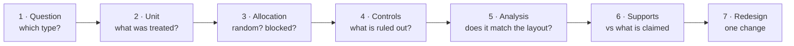

---

## 📄 Paper 1 · A factorial inside blocks — fenugreek spacing and seed rate

**Gebeyehu et al. (2026)** [@gebeyehu2026], in *PLOS ONE*.

**Source audit:** [Open full text](https://pmc.ncbi.nlm.nih.gov/articles/PMC13475882/). Record the section or figure supporting each design claim before reading the interpretation.

### What the methods say

> The experiment tested a **factorial combination of three inter-row spacings** (20, 30 and
> 40 cm) **and five seed rates** (15, 20, 25, 30 and 35 kg ha⁻¹) — 15 treatment combinations —
> "arranged in a randomized complete block design (RCBD) with three replications", at **two
> locations** (Kete and Korke, Ethiopia) in the 2022/2023 season. Each plot was
> **3.6 m × 1.5 m (5.4 m²)**, with "one row on each side of the plot excluded" to reduce border
> effects and "an additional row designated for destructive sampling". Plots were 0.5 m apart,
> blocks 1 m apart.

### The design, drawn

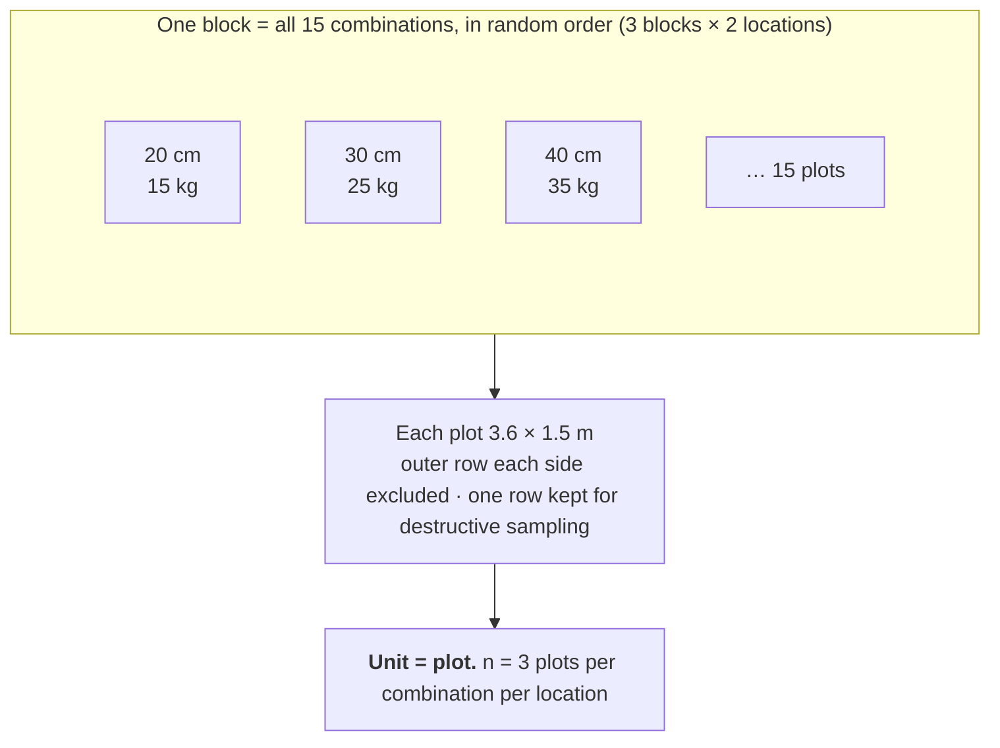

### Reading it

Compare with the course interpretation after completing your audit

- **Question type.** Q6 optimization dressed as Q2: which combination of spacing and seed rate
  gives the best yield? A factorial is the right structure, because the best seed rate may
  depend on spacing — exactly the interaction that one-factor-at-a-time cannot see
  ([Ch. 7](../../chapters/07-treatment-structures.md)).
- **Unit.** The plot. Three replications per location means **n = 3 plots per combination per
  location** — not the number of plants measured inside a plot. Plants within a plot are
  sub-units ([Ch. 3](../../chapters/03-experimental-unit-and-replication.md)).
- **Blocking.** RCBD: each block holds all 15 combinations, so a fertility or moisture gradient
  across the field is removed from the comparison ([Ch. 5](../../chapters/05-blocking-and-batches.md)).
- **A detail worth noticing.** Excluding the outer row of every plot is a design decision, not a
  formality: with 20 cm spacing, plants at the edge of a plot have neighbours from a plot with a
  different treatment, so including them would blur the treatments together.
- **Two locations.** This is what lets the authors ask whether the best combination is the same
  in both places. Two is enough to notice a difference, but not enough to characterize how the
  optimum varies across the region ([Ch. 19](../../chapters/19-breeding-and-field-trials.md)).

▶ What the design supports — and what it does not

**Supports:** a comparison of the 15 combinations at these two sites in this season, with the
spacing × seed-rate interaction estimable, and a within-block comparison that is protected from
field gradients.

**Does not support:** a recommendation for a region or for other seasons. One season at two
sites gives no estimate of year-to-year variation, which in rain-fed agronomy is often larger
than the treatment effect. A claim like "the optimum seed rate is X" needs the year dimension.

---

## 📄 Paper 2 · When a block cannot hold everything — maize in an α-lattice

**Kumar et al. (2026)** [@kumar2026maize], in *Frontiers in Plant Science*.

**Source audit:** [Open full text](https://pmc.ncbi.nlm.nih.gov/articles/PMC13433520/). Record the section or figure supporting each design claim before reading the interpretation.

### What the methods say

> **Sixty maize genotypes** were evaluated across **four environments** — summer 2023, winter
> 2023, summer 2024 and winter 2024 — "in an alpha lattice design with two replications,
> comprising six incomplete blocks with 10 entries per replication, to improve precision by
> controlling local field heterogeneity". Each genotype was planted in four rows of 4 m,
> 60 cm between rows and 30 cm between plants: **gross plot 9.6 m², net plot 7.2 m²**. The
> analysis nested "the replication effect within season and year" and "the incomplete block
> effect within replication, season, and year".

### The design, drawn

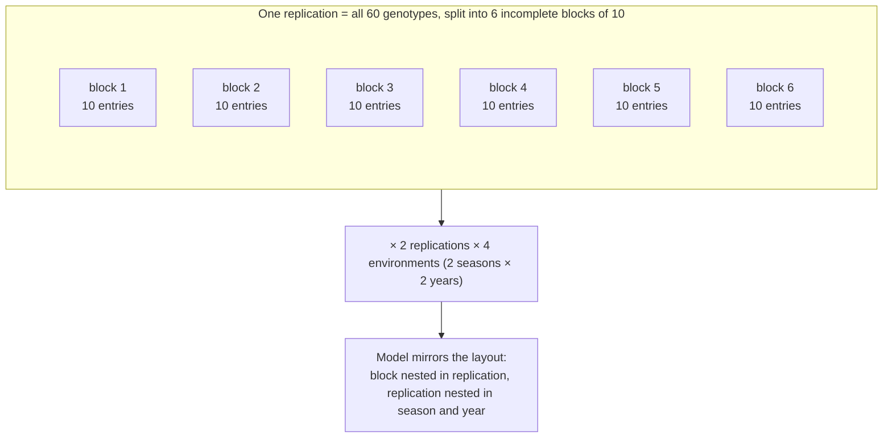

### Reading it

Compare with the course interpretation after completing your audit

- **Why not a complete block?** A block holding all 60 entries would stretch across so much
  ground that "block" would no longer mean "uniform". Six compact blocks of 10 are each far more
  homogeneous, and the design keeps genotype comparisons connected across them
  ([Ch. 5](../../chapters/05-blocking-and-batches.md); the field-trials sub-course, Module 5).
- **Gross vs net plot.** 9.6 m² is sown, 7.2 m² is harvested. The difference is the border
  discarded — the same logic as Paper 1, stated in a different vocabulary.
- **The model matches the layout.** Nesting blocks inside replications inside environments is
  what makes the α-lattice worth using: analysed as if unblocked, the design's advantage is
  thrown away ([Ch. 5](../../chapters/05-blocking-and-batches.md)).
- **Two replications.** Modest per environment — but the design buys precision through blocking
  and through having four environments, which is where the information about stability lives.

▶ The trap this design avoids

With 60 entries and only two replications, an unblocked layout would leave genotype differences
less precise because spatial variation remains in the error term. The α-lattice is the standard answer to "too many
entries for a uniform block", and the paper's nested model is the second half of that answer.

**Your turn:** the four environments are two seasons in each of two years. Is "environment" here
a random sample of the environments a farmer will meet? What does that imply for a recommendation?

---

## 📄 Paper 3 · Environments as the replicates — tall fescue across eight location-years

**Makaju et al. (2026)** [@makaju2026], in *Frontiers in Plant Science*.

**Source audit:** [Open full text](https://pmc.ncbi.nlm.nih.gov/articles/PMC13442827/). Record the section or figure supporting each design claim before reading the interpretation.

### What the methods say

> Fourteen tall fescue genotypes were evaluated across **eight location-year combinations**.
> "The experimental design for each environment used a randomized complete block design (RCBD),
> with genotypes randomized within each replication (block)", and each environment "evaluated the
> same 14 tall fescue genotypes in similarly sized, replicated plots". But: "the number of
> replications per environment varied: Cornell environments (C20, C21, and C22) had four
> replications per genotype, Iron Horse Farm environments (I21 and I23) had five", so "the trial
> was **partially unbalanced** due to the differing numbers of replications among environments".
> Analysis used AMMI, GGE biplots and REML-based mixed models giving BLUPs.

### The design, drawn

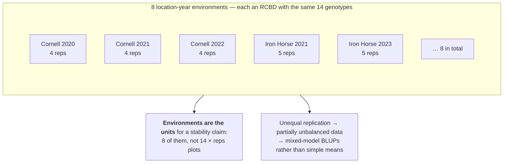

### Reading it

Compare with the course interpretation after completing your audit

- **Two levels of replication, two different purposes.** Plots within an environment make the
  estimate *at that site-year* precise. The eight environments are what make a **stability**
  claim possible at all ([Ch. 19](../../chapters/19-breeding-and-field-trials.md)).
- **Unbalance is normal, and survivable.** Four replications here, five there, is what real
  programmes look like. A mixed model handles it; taking simple means across environments would
  silently weight the better-replicated sites differently.
- **G × E is the finding, not a nuisance.** The paper reports "environment-specific genotype
  performance" and uses the GGE biplot to delineate mega-environments — that is, the ranking of
  genotypes changes between environments. Averaging over environments would have hidden exactly
  what a breeder needs.

▶ What this design can and cannot settle

**Supports:** which genotypes yield well, and which yield *consistently*, across the eight
environments actually sampled; which environments group together.

**Does not support:** performance in environments unlike these. Eight location-years in the
United States is a sample from a particular target region; stability outside it is an
extrapolation. The paper's own framing — mega-environment delineation — is the honest way to put
this: it describes which environments behave alike, rather than claiming a universally stable genotype.

---

## 📄 Paper 4 · The validation that tells the truth — genomic prediction in timothy

**Kovi et al. (2026)** [@kovi2026], in *Theoretical and Applied Genetics*. This is the most
important paper in the module, because it reports **both** the optimistic number and the honest one.

**Source audit:** [Open full text](https://pmc.ncbi.nlm.nih.gov/articles/PMC13550071/). Record the section or figure supporting each design claim before reading the interpretation.

### What the methods say

> **889 full-sib (FS2) families**, from biparental crosses among 49 cultivars/populations, were
> genotyped with **30,698 SNP markers** and "field tested for three harvest years at a highland
> and a lowland continental location in Southern Norway". Nine prediction models were compared
> across six yield and six quality traits. Then: "we implemented a strict **forward validation**
> design", and the result was stark — "within-training cross-validation accuracies were moderate
> to high (mean r = 0.62)", but "forward validation using **213 independent FS2-families**
> revealed dramatically lower accuracies (**mean r = 0.16**), with only 16 of 30 trait–dataset
> combinations reaching statistical significance". Accuracy "plateaued at approximately 15,000 SNPs".

### The design, drawn

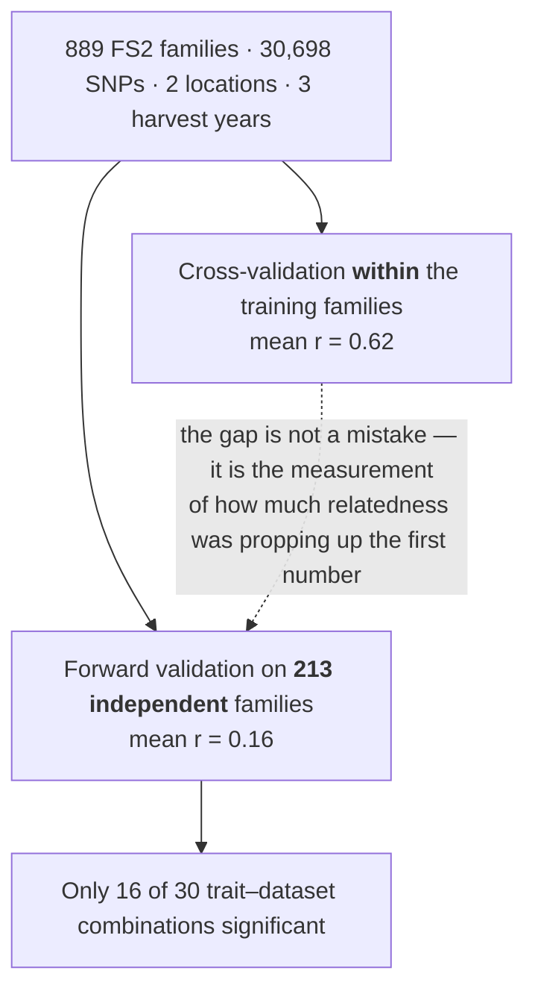

### Reading it

Compare with the course interpretation after completing your audit

- **This is Chapter 12 in the field.** Validation within a related population estimates prediction for candidates with relatives in the training set. Forward validation on more distant families addresses a different deployment target. Kinship can be useful information; the question is whether it will be available when the model is used ([Ch. 12](../../chapters/12-predictive-studies.md)).
- **0.62 → 0.16.** The reported mean accuracies differ markedly between validation schemes. A claim about distant new families should use evidence from that target; a claim about close relatives need not discard within-population validation. Relatedness and other differences between the evaluations can both contribute to the gap.
- **A design question, not an analysis question.** No amount of modelling fixes an optimistic
  validation scheme; the split has to match the intended use before any model is fitted.
- **Marker density plateaus.** Accuracy levelling off near 15,000 SNPs is a resource-allocation
  finding: beyond it, money is better spent on phenotyping more families than on denser genotyping.

▶ Your turn

A colleague reports a genomic-prediction accuracy of r = 0.65 from five-fold cross-validation
over a breeding population, and proposes to use the model to choose parents from a **new** set of
families. Using this paper, write two sentences explaining what you expect to happen and what you
would ask them to run first.

---

## 📄 Paper 5 · An animal trial, and a detail in the housing

**Tao et al. (2026)** [@tao2026], in *Frontiers in Veterinary Science*.

**Source audit:** [Open full text](https://pmc.ncbi.nlm.nih.gov/articles/PMC13627018/). Record the section or figure supporting each design claim before reading the interpretation.

### What the methods say

> "A total of **20 Holstein dairy cows** in the early lactation stage with comparable body
> conditions (DIM = 73 ± 26 d; average parity = 2.6 ± 1.1) were selected and **randomly assigned
> to two groups**": a control group on the basal diet, and a group supplemented with 10 g/day
> of lysophosphatidylcholine — "a completely randomized design, with **10 cows per group**".
> "Cows were housed in individual stalls distributed across the barn, **with each treatment group
> assigned to a designated area within the facility**." Repeatedly measured variables such as milk
> yield were analysed "using a mixed model with treatment, time, and treatment × time interaction
> as fixed effects and **cow as a random effect**".

### The design, drawn

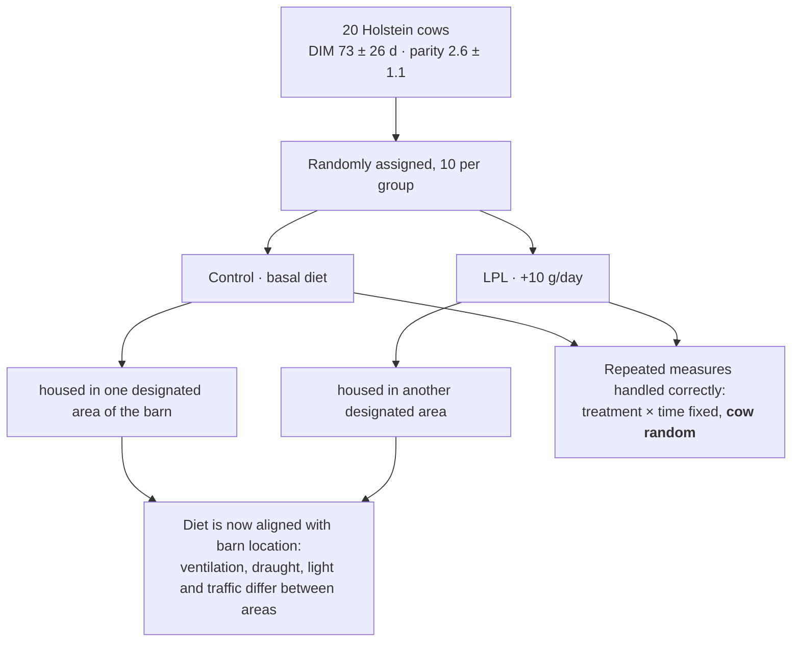

### Reading it

Compare with the course interpretation after completing your audit

- **What is done well.** Cows are randomized individually, so the **assignment unit is the cow**
  and n = 10 per group is counted correctly. Individual stalls mean each cow eats her own ration —
  the feed really is applied per cow, not per pen. The repeated-measures model, with cow as a
  random effect, matches that structure ([Ch. 3](../../chapters/03-experimental-unit-and-replication.md)).
- **The detail to notice.** Housing each treatment group in its own area of the barn re-introduces
  by location what randomization removed by allocation. Any systematic difference between those
  areas — temperature, draught, proximity to the parlour — now sits on top of the diet effect, and
  no analysis of this dataset can separate the two ([Ch. 5](../../chapters/05-blocking-and-batches.md)).
- **How big a problem is it?** Unknown from the paper, and that is the point: it is not that the
  result is wrong, but that the design cannot rule the alternative out. A future design could randomize within barn areas, subject to feeding logistics and contamination control. Alternating stalls without random allocation is not the same safeguard.
- **Scope.** Twenty cows of one breed at one farm, in early lactation. That is a reasonable size
  for the measurements taken, and it is also the limit of the claim.

▶ Rewrite the housing sentence

Write the one sentence you would add to the methods to remove the confound, keeping the same
number of cows and the same barn. A model answer: *"Stalls were allocated so that control and
supplemented cows alternated along each row, with treatment assigned at random within each barn
area, and barn area was included as a block in the analysis."*

---

## 📄 Paper 6 · The family is the unit — genetic parameters in the black soldier fly

**Black soldier fly breeding study (2026)** [@bsf2026], in *Genetics Selection Evolution*. A new
species entering selective breeding, and a design whose main limitation the authors name themselves.

**Source audit:** [Open full text](https://pmc.ncbi.nlm.nih.gov/articles/PMC13584447/). Record the section or figure supporting each design claim before reading the interpretation.

### What the methods say

> "A total of **15 179 individuals from 266 full-sib isofamilies** were phenotyped." The family is
> defined by how the animals were produced and reared:
>
> > "each egg collection obtained from a single female was referred to as an **isofamily** and was
> > defined as a **group of siblings originating from a single clutch** (from eggs to adults, including
> > larvae). We assumed that this production resulted from a **single male–female mating**."
>
> And families are reared apart: "The buffer substrate containing the newly hatched juveniles was
> transferred into larger containers, **each designated for the development of a specific isofamily**."
>
> Heritabilities are reported with their standard errors, which is the detail that makes them readable:
> "larval weight at stage 1 (LW1, **h² = 0.12 ± 0.08**), stage 2 (LW2, **h² = 0.13 ± 0.04**),
> restricted-feed LW2 (**LW2R, h² = 0.58 ± 0.03**), female body weight at emergence (**FEMBW,
> h² = 0.006 ± 0.005**), pupal perimeter (**PERIM, h² = 0.06 ± 0.09**), oocyte number (**OOCY,
> h² = 0.43 ± 0.09**)".
>
> The authors place their work against earlier estimates: "A study using a **full-sib design** to
> estimate the heritability of larval and prepupal body sizes reported **notably inflated estimates,
> reaching 0.67 and 0.78**".

### The design, drawn

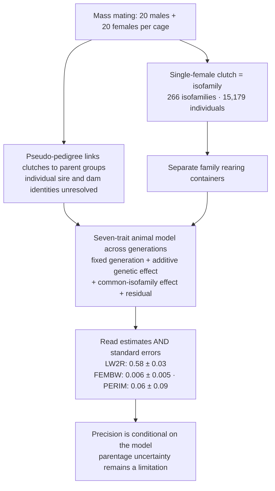

### Reading it

Compare with the course interpretation after completing your audit

- **An isofamily is not a verified one-sire, one-dam pedigree.** The paper describes mass mating
  with 20 males and 20 females per cage. Each single-female clutch defines an isofamily; ancestry
  is linked to parental groups through a pseudo-pedigree. Do not infer individual parentage from
  the phrase “full-sib family” alone.
- **Read the variance model before judging the heritability.** This study fits a multi-generation,
  seven-trait animal model with additive genetic and common-isofamily effects, rather than simply
  calling all within-family resemblance additive inheritance. The common-family term attempts to
  account for shared rearing conditions. Unresolved parentage and model assumptions still limit
  separation of these effects; the estimates are not automatically inflated upper bounds.
- **Precision and practical usefulness are different questions.** FEMBW and PERIM have small
  estimates with substantial uncertainty relative to their size; this is weak evidence for useful
  additive variation in these data, not proof that selection can never work. LW2R is estimated much
  more precisely under the fitted model. A breeding decision also needs genetic correlations,
  costs, welfare considerations and validation in the target production environment.
- **Heritability belongs to a population and an environment.** LW2R is larval weight under restricted
  feed. Its high estimate does not by itself tell us whether restricted feeding reduced environmental
  variance, increased genetic variance, or changed both. Splitting clutches across replicate containers
  and improving individual parentage would strengthen a future design if feasible.

---

## 📄 Paper 7 · Repeated records and contemporary groups — litter size in meat rabbits

**Meat rabbit litter size study (2026)** [@rabbit2026], in *Animals*.

**Source audit:** [Open full text](https://pmc.ncbi.nlm.nih.gov/articles/PMC13406007/). Record the section or figure supporting each design claim before reading the interpretation.

### What the methods say

> "Records from **440 does** of the New Zealand White, Californian, Chinchilla, and Brown breeds were
> used." The mating scheme is itself randomized, with a constraint:
>
> > "Animals were **mated simultaneously and randomly within breed, avoiding matings between close
> > relatives** (full siblings, half-siblings, or parent–offspring)."
>
> The data structure is stated with its weakness in the same sentence: "A total of **956 kindling
> records** were analyzed, with approximately **40–48% of does contributing only a single record**".
>
> Several traits are recorded per kindling: "the number of kits **born alive (BA), born dead (BD), and
> total born (TB)** ... as well as litter size at **7, 35, and 70 days** of age".
>
> The model names its nuisance factors: "The fixed or systematic effects considered were **breed,
> contemporary group (does served within a**" defined period.
>
> And the paper compares two estimation methods rather than assuming one: "to estimate variance
> components and genetic parameters associated with litter size in meat rabbits using **REML and
> MCMC-GS** and to evaluate the impact of **estimation method and model specification on prediction and
> rankings of breeding values under limited-information conditions**."

### The design, drawn

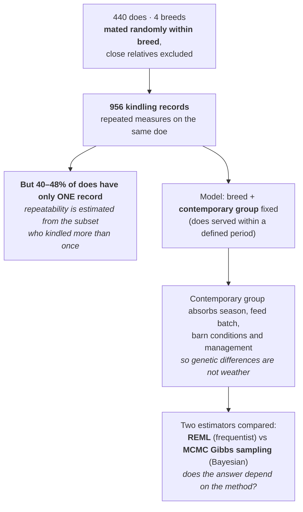

### Reading it

Compare with the course interpretation after completing your audit

- **Repeated records are the design feature that makes repeatability estimable.** Measuring the same
  doe over several kindlings separates permanent differences between does from occasion-to-occasion
  variation. But that separation needs does with *several* records, and here nearly half contribute
  one — so the permanent-environment and genetic components lean on a subset of the data
  ([Ch. 3](../../chapters/03-experimental-unit-and-replication.md)).
- **"Contemporary group" is a block, under a different name.** Animals served in the same period share
  feed batch, season, barn conditions and staff. Including that grouping as a fixed effect removes the
  variation it causes, so two does are compared against their own contemporaries rather than against
  the herd average across years ([Ch. 5](../../chapters/05-blocking-and-batches.md)).
- **Random mating within breed, excluding close relatives, is allocation design.** Non-random mating
  would confound relatedness with management decisions — the best does mated to the best bucks — and
  the pedigree would then encode merit as well as kinship. Excluding close relatives also limits
  inbreeding, which otherwise depresses the very trait being measured
  ([Ch. 4](../../chapters/04-randomization-and-blinding.md)).
- **Comparing two estimators is a sensitivity analysis.** Under limited information, REML and Bayesian
  estimates can diverge, and what matters practically is whether the *ranking* of breeding values
  changes. Asking that question directly is better than choosing a method and hoping
  ([Ch. 15](../../chapters/15-measurement-and-benchmarking.md)).

---

## 📄 Paper 8 · An experiment you could never run — simulating a population split

**Dairy sheep disconnection study (2026)** [@disconnect2026], in the *Journal of Animal Breeding and
Genetics*. A designed experiment in software, with a control arm.

**Source audit:** [Open full text](https://pmc.ncbi.nlm.nih.gov/articles/PMC12686762/). Record the section or figure supporting each design claim before reading the interpretation.

### What the methods say

> The question comes from a real event: "One example of a sub-divided population that is known in
> detail is the **Lacaune dairy sheep**. This breed **split into two subpopulations**, each linked to a
> breeding company, in the 1970s. Since then, the two subpopulations have **no longer been connected**
> but are still subject to a joint evaluation".
>
> Running that experiment for real would take decades, so: "Using a **stochastic simulation model**, we
> simulate the disconnection of two subpopulations from an origina[l population]".
>
> The virtual population has a layout: "The founder population was **randomly distributed into 20
> flocks**. The trait was expressed **only in females** ... Individual phenotypes of females were
> simulated by adding **random effects (year, flock, year*flock and residual effects)** to True
> Breeding Value (TBV)."
>
> The selection history is burned in before the manipulation: "The population was selected for **8
> non-overlapping selection generations: 4 generations of pedigree-based selection, from G-8 to G-5, to
> set up the reference population for genomic selection and then 4 generations of genomic selection,
> from G-4 to G-1.**"
>
> Then comes the design, with a control:
>
> > "In the **control scenario (NoSep)**, we pursued the selection cycles using ssGBLUP for the whole
> > population ... from G0 until the last generation (G11). For the three other scenarios, **the
> > population split in G0**. To do so, **flocks (and therefore females) were randomly selected to be
> > assigned to subpopulation 1 or 2**. Similarly, the male candidates of G0 were **randomly assigned**
> > to subpopulation 1 or 2 regardless of their birth flock. From that point on, the subpopulations
> > **evolved in parallel with no exchange**."

### The design, drawn

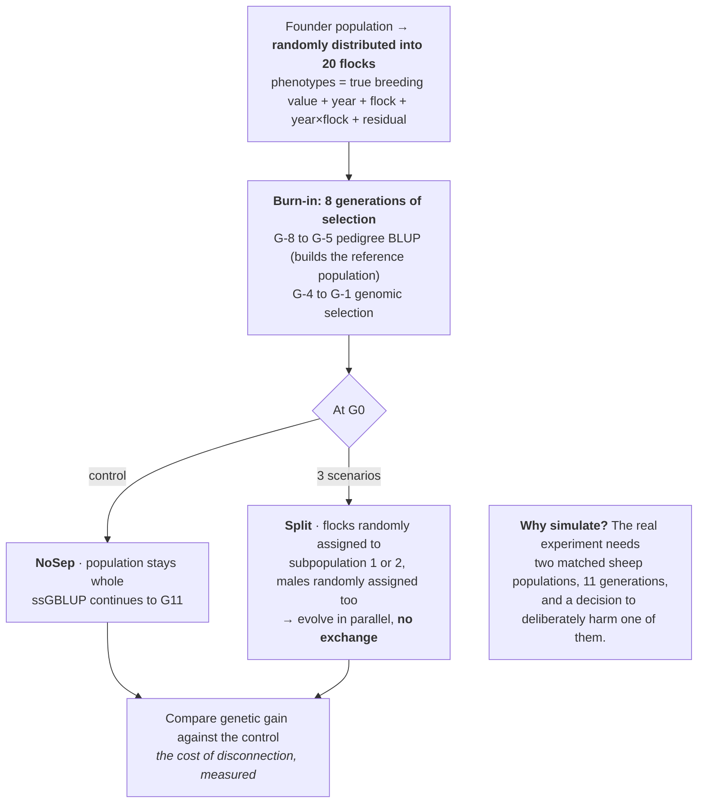

### Reading it

Compare with the course interpretation after completing your audit

- **A simulation is an experiment, and this one has every part of one.** Randomization (flocks and
  males randomly assigned to subpopulations), a control arm (NoSep), a factor with levels (the
  separation ratio), a burn-in that makes the starting state realistic, and replication across
  stochastic runs. The fact that the sheep are virtual changes what the result *is evidence about*, not
  whether it was designed ([Ch. 13](../../chapters/13-optimization-doe.md)).
- **The control arm is what makes the comparison interpretable.** Genetic gain declines over
  generations for many reasons — drift, inbreeding, reduced variance. Running an unsplit population
  through the identical machinery means the difference between arms is attributable to the split rather
  than to everything else happening at the same time
  ([Ch. 6](../../chapters/06-controls-and-comparators.md)).
- **Randomly assigning flocks, then males *regardless of birth flock*, is two separate randomizations.**
  Assigning whole flocks keeps the flock structure intact; assigning males independently prevents the
  two subpopulations from differing systematically in sire families from the start. Each closes a
  different route to imbalance ([Ch. 4](../../chapters/04-randomization-and-blinding.md)).
- **What a simulation can and cannot support.** It can quantify the consequences of a structure under a
  stated genetic model. It cannot discover that the model is wrong — if the true architecture is not
  infinitesimal, or if the breeding companies also differ in management, the simulated loss is a
  lower or upper bound rather than an estimate
  ([Ch. 12](../../chapters/12-predictive-studies.md)).

---

## 📄 Paper 9 · Designing the training set — choosing who goes into a reference population

**Cross-population reference set study (2026)** [@refset2026], in *Animals*.

**Source audit:** [Open full text](https://pmc.ncbi.nlm.nih.gov/articles/PMC12896712/). Record the section or figure supporting each design claim before reading the interpretation.

### What the methods say

> The problem is stated as a design problem: "the prediction precision of GS is **largely contingent on
> the genetic relatedness between the reference population and the target population**."
>
> The proposal is to *construct* the reference set rather than accept it: "This study proposes an
> **Fst-based strategy to enhance prediction performance by constructing a cross-population reference
> set with high genetic similarity to the target population**", selecting "individuals from other
> populations that are **genetically similar to the target population**. By including the **top 10–20%
> most similar individuals**, prediction accuracy and robustness were significantly improved".
>
> Populations with known, deliberately different histories were simulated so that the factor under
> study is controlled: "We employed **QMSim** ... to simulate livestock genomic datasets, with the
> objective of exploring **how distinct linkage disequilibrium (LD) patterns influence the prediction
> accuracy** of GEBVs in beef cattle populations. The simulation resulted in **three beef cattle
> populations (PopA, PopB, and PopC) with dist**[inct LD patterns]."
>
> Each history is specified: "Population A (PopA) was modeled to represent a linkage disequilibrium
> (LD) pattern that **starts from a stable state and continues to expand**"; "Population B (PopB) was
> simulated to reflect LD pattern that **initially contracts and then expands**"; "Population C (PopC)
> was modeled to simulate LD pattern that **first expands and then contracts**."

### The design, drawn

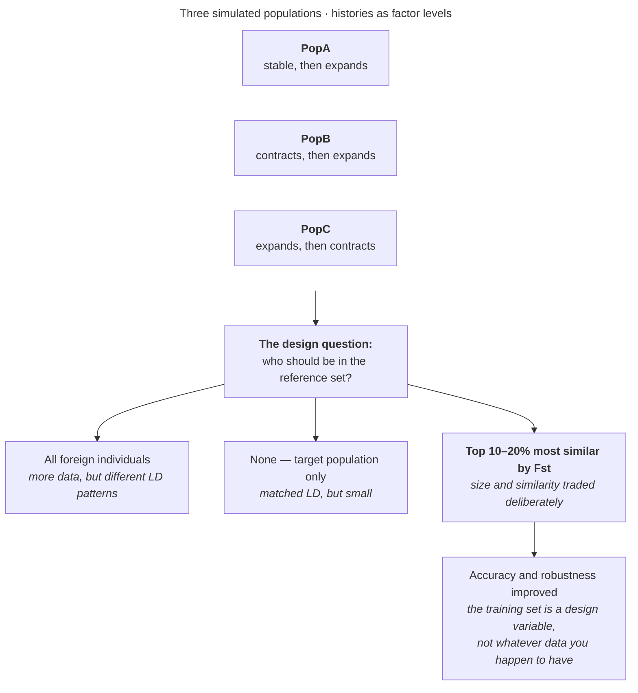

### Reading it

Compare with the course interpretation after completing your audit

- **The training set is a design variable.** Prediction studies usually treat available data as given
  and tune the model. Here the model is held fixed and the *composition of the reference population* is
  what varies — which is the breeding equivalent of choosing your experimental units rather than your
  statistics ([Ch. 12](../../chapters/12-predictive-studies.md)).
- **There is a real trade-off, and the design makes it visible.** Adding foreign individuals increases
  the training set, which helps; but if their linkage disequilibrium pattern differs, the marker
  effects they teach the model do not transfer, which hurts. The top-10–20% rule is an explicit
  position on that trade-off rather than an implicit one
  ([Ch. 8](../../chapters/08-sample-size-and-power.md)).
- **Simulating the population histories is what isolates the cause.** With real breeds, demographic
  history is confounded with everything else — husbandry, geography, trait definitions, genotyping
  platform. Three simulated populations differing only in LD history make the factor of interest the
  only factor ([Ch. 11](../../chapters/11-observational-and-causal.md)).
- **Read this next to Paper 4.** Timothy's forward validation showed that accuracy depends on how the
  split is made; this paper shows accuracy also depends on how the training set is *composed*. Both say
  the same thing: in prediction, the design of the data is as consequential as the model
  ([Ch. 12](../../chapters/12-predictive-studies.md)).

---

## 📄 Paper 10 · Benchmarking a breeding strategy before committing to it

**Lactation efficiency simulation study (2025)** [@lacteff2026], in *Genetics Selection Evolution*.

**Source audit:** [Open full text](https://pmc.ncbi.nlm.nih.gov/articles/PMC12616986/). Record the section or figure supporting each design claim before reading the interpretation.

### What the methods say

> The design problem is that the trait is a composite of interacting processes: "Predicting selection
> response for lactation efficiency in dairy cows is challenging, as the expression of this complex
> trait depends on **dynamic interactions between the ability of cows to acquire nutrients and allocate
> them to different life functions**."
>
> The standard approach is named and its assumption exposed: "The standard methodology to predict
> selection response in animal breeding complies with the assumptions of the **genetic infinitesimal
> model**. This approach is **largely statistical by nature and does not consider any biological
> information** (e.g. energetic trade-offs) to model genetic and phenotypic variances of traits."
>
> So two prediction methods are compared head to head: "The aim of this study was to **interface the
> AQAL model and a breeding scheme simulation tool** to predict selection response on lactation
> efficiency in dairy cattle. **Selection responses predicted with this mechanistic-based modelling (MM)
> approach were compared with the ones obtained with the conventional modelling approach.**"
>
> The environment is a factor, not a fixed background: "The effect of the **nutritional environment** on
> the means and (co)variances of traits was modelled through **stochastic simulations**."
>
> And the comparison does not come out clean, which is reported: "In the non-limiting environment,
> **selection responses predicted by the two methods differed** for both milk production and fertility.
> The sign and magnitude of differences depended on BGs. **Selection response predictions were
> consistent only for BGs that did not change much the body reserve mobilization patterns of cows**".

### The design, drawn

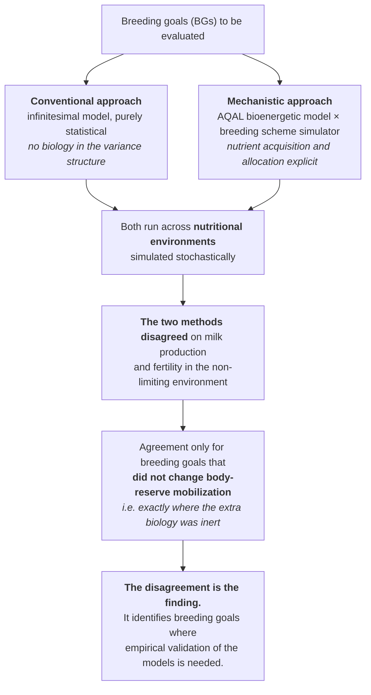

### Reading it

Compare with the course interpretation after completing your audit

- **Comparing two prediction methods is a benchmarking design.** Neither model is the ground truth;
  what the comparison establishes is *where* they diverge, and therefore where the cheaper, standard
  method is risky. This is the same structure as [Module 4](04-omics-and-bioinformatics.md)'s platform
  comparison, applied to models instead of sequencers
  ([Ch. 15](../../chapters/15-measurement-and-benchmarking.md)).
- **The pattern of disagreement is more informative than its size.** The two approaches agreed exactly
  where the mechanistic model's extra content — body-reserve mobilization — did not change, and
  disagreed where it did. That is a coherent, interpretable result rather than unexplained noise, and
  it tells a breeding programme which goals need the more expensive model
  ([Ch. 12](../../chapters/12-predictive-studies.md)).
- **Simulating environments makes genotype × environment explicit.** A single predicted response
  assumes one nutritional context. Running across environments turns "what gain will we achieve" into
  "what gain, where" — the same lesson Paper 3's multi-environment trial teaches with real plots
  ([Ch. 7](../../chapters/07-treatment-structures.md)).
- **Why do this before selecting.** A breeding programme is a 10–20 year commitment with no control
  arm. Benchmarking candidate strategies in silico is the only opportunity to compare them before one
  is chosen — and it is cheap relative to discovering in generation 8 that the goal was wrong.

---

## Independent transfer task · Prediction deployment

Your lab will select candidates whose families are absent from training. Draw a validation split that represents that use, explain what must be kept together, and give a cheaper validation scheme whose estimate would answer a different question.

Use the [evidence worksheet and assessment criteria](README.md#evidence-worksheet).
Submit your diagram, source-backed reasoning and one remaining uncertainty before looking at the
sample answers. More than one redesign may be defensible; justify yours against the stated constraint.

---

## ⚠️ Common Misconceptions

| ❌ The misconception | ✅ What is actually true — and what to do |
|---|---|
| **"A published design is a correct design."** | Peer review rarely re-derives the unit or the allocation. Read the methods and judge for yourself. |
| **"A limitation means the paper is bad."** | Every design trades something away. What matters is whether the claim stays inside what the design supports. |
| **"More replications always beats more environments."** | For a stability or recommendation claim, environments are the replicates that matter ([Ch. 19](../../chapters/19-breeding-and-field-trials.md)). |
| **"Unbalanced data are a flaw."** | Unequal replication is normal in field programmes; a mixed model handles it. Hiding it by averaging is the actual error. |
| **"Cross-validation accuracy is the accuracy."** | It is the accuracy *for the kind of split you used*. Paper 4 reports 0.62 within training and 0.16 forward. |
| **"Individual randomization guarantees independence."** | Only if nothing afterwards re-groups the treatments — housing, processing order or position can put the confound back (Paper 5). |
| **"Heritability is a property of a trait."** | It is a ratio with environmental variance in the denominator, so it belongs to a trait *in an environment*. Paper 6's highest estimate is for weight under a restricted ration. |
| **"A full-sib design estimates heritability."** | Sibling resemblance includes additive genes, dominance and shared environment. Read how the fitted model separates them. Paper 6 uses a pseudo-pedigree with a common-isofamily effect; it is not a simple full-sib variance calculation. |
| **"Repeated records always give you repeatability."** | Only from animals with more than one record. In Paper 7, 40–48% of does contributed just one. |
| **"A simulation is not an experiment."** | Paper 8 randomizes flocks and males, runs a no-separation control arm, and varies one factor. The virtual animals change what it is evidence *about*, not whether it is designed. |
| **"Use all the data you can get for training."** | Paper 9 shows that adding genetically dissimilar individuals can hurt. Reference-set composition is a design choice with a real trade-off. |

---

## ✅ Check Your Understanding

**⭐ Q1.** In Paper 1, what is the experimental unit, and what is *n* per treatment combination
per location?

**⭐⭐ Q2.** Why did Paper 2 use six incomplete blocks of 10 rather than one block of 60?

**⭐⭐ Q3.** Paper 3 has four replications at some environments and five at others. Why is this
not fatal, and what would be wrong with simply averaging each genotype over all plots?

**⭐⭐⭐ Q4.** Paper 4 reports r = 0.62 and r = 0.16 from the same data. Explain the difference to
a colleague in two sentences, and say which number belongs in a breeding programme's business case.

**⭐⭐⭐ Q5.** Paper 5 randomized cows individually, yet a confound remains. Name it, say why the
analysis cannot remove it, and propose a feasible fix without adding cows, and state its practical constraints.

**⭐⭐ Q6.** Paper 6 reports h² = 0.006 ± 0.005 for female body weight at emergence and h² = 0.58 ± 0.03
for larval weight under restricted feed. Say what each tells a breeder, and why the standard errors
matter more than the point estimates.

**⭐⭐ Q7.** In Paper 7, "contemporary group" is a fixed effect. Explain what it absorbs and what would
go wrong if it were left out of the model.

**⭐⭐⭐ Q8.** Paper 8's simulation includes a NoSep control scenario. Explain precisely what would be
unmeasurable without it.

**⭐⭐⭐ Q9.** Paper 9 found that including only the top 10–20% most genetically similar foreign
individuals beat including all of them. Explain the trade-off in terms of what a training set
contributes, and name the analogous error in a human prediction study.

---

## 📝 Sample Answers & Assessment

▶ Show sample answers

> **Q1:** *"The plot. Three replications per location, so n = 3 plots per combination per location —
> the plants measured within a plot are sub-units, not replicates."* — **Example answer.**

> **Q2:** *"With 60 entries, a complete block would cover so much ground that it would no longer be
> uniform, which is the whole point of a block. Six compact blocks of 10 are each more homogeneous,
> and the α-lattice keeps the genotype comparisons connected across blocks — provided the model
> includes the incomplete blocks, which this paper's nested model does."* — **Example answer.**

> **Q3:** *"Unequal replication just means the environments carry different amounts of information;
> a mixed model weights them accordingly and still estimates genotype means. Averaging raw plot
> values per genotype would let the five-replication environments pull the mean more than the
> four-replication ones, mixing genotype differences with where the data happened to be denser."* — **Example answer.**

> **Q4:** Use the validation scheme that matches the intended candidates. An accuracy of 0.62 within a related population does not establish performance in distant new families; the reported forward mean of 0.16 is relevant to that target. Neither number is a universal property of the model. — **Example answer.**

> **Q5:** *"Treatment group is aligned with barn area. Because every control cow is in one area and
> every supplemented cow in another, the diet effect and the area effect are perfectly confounded —
> there is no comparison within an area for the model to use, so no analysis can separate them. The
> fix is to randomize treatment within barn areas where feeding logistics and contamination control permit, then account for area in the analysis."* — **Example answer.**

> **Q6:** A small estimate with uncertainty near zero gives little evidence for a useful selection response in this population; it does not prove that response is impossible. LW2R has a larger, more precise estimate under the fitted animal model, but target-environment validation and genetic correlations remain necessary. The pseudo-pedigree and common-family effect belong in the interpretation. — **Example answer.**

> **Q7:** *"Contemporary group absorbs everything shared by does served in the same period — season,
> feed batch, barn temperature, staff and management practice. Without it, those effects stay in the
> residual and, worse, can align with family structure if relatives tend to be served together, so a
> doe that kindled in a good season would be credited with high genetic merit. The estimate of genetic
> variance would be inflated and the ranking of breeding values would partly reflect when each animal
> happened to be bred."* — **Example answer.**

> **Q8:** *"The share of the decline that is caused by the split rather than by everything else
> happening over eleven generations. Genetic gain slows anyway through drift, inbreeding and the
> depletion of genetic variance under selection, so an unsplit population run through the identical
> machinery is what converts 'gain fell' into 'gain fell by this much because of the separation'.
> Without it the simulation measures the trajectory of a selected population, not the cost of
> disconnection."* — **Example answer.**

> **Q9:** *"A training set contributes two things that pull against each other: size, which reduces the
> noise in estimated marker effects, and relevance, meaning that the linkage disequilibrium between
> markers and causal variants is the same as in the target. Genetically distant individuals add size
> but teach marker effects that do not transfer, so beyond some point each extra animal makes the
> prediction worse. The human analogue is training a polygenic score on one ancestry group and applying
> it to another — the sample size looks impressive and the accuracy drops, for exactly the same
> reason."* — **Example answer.**

---

## 🧾 Module Summary

| Paper | Design family | The lesson it teaches best |
|---|---|---|
| Fenugreek [@gebeyehu2026] | Factorial in an RCBD | The plot is the unit; borders are a design decision |
| Maize [@kumar2026maize] | α-lattice, 4 environments | Incomplete blocks when a complete block cannot stay uniform — and a model that mirrors them |
| Tall fescue [@makaju2026] | Multi-environment RCBD | Environments are the replicates for a stability claim; unbalance is normal |
| Timothy [@kovi2026] | Genomic prediction | The validation scheme decides whether the accuracy means anything |
| Dairy cows [@tao2026] | Randomized feeding trial | Randomization can be undone afterwards by where units are placed |
| Black soldier fly [@bsf2026] | Mass mating, 266 isofamilies, pseudo-pedigree | Read the fitted variance model and parentage uncertainty |
| Meat rabbits [@rabbit2026] | Repeated records, animal model | Contemporary group is a block; repeatability needs repeat records |
| Lacaune sheep [@disconnect2026] | Stochastic simulation with a control arm | A simulation is an experiment, and needs a control |
| Beef cattle reference sets [@refset2026] | Simulated LD histories, training-set composition | The training set is a design variable |
| Dairy lactation efficiency [@lacteff2026] | Mechanistic vs conventional prediction | Benchmark the strategy before committing a decade to it |

---

## 🔗 Go Deeper

- Main course: [Ch. 5 — Blocking and Batches](../../chapters/05-blocking-and-batches.md) ·
  [Ch. 7 — Treatment Structures](../../chapters/07-treatment-structures.md) ·
  [Ch. 12 — Predictive Studies](../../chapters/12-predictive-studies.md) ·
  [Ch. 19 — Breeding and Field Trials](../../chapters/19-breeding-and-field-trials.md)
- Hands-on layouts for these designs: the [field-trials sub-course](../field-trials/README.md)
- Then design your own: [Ch. 26 — The Design Clinic](../../chapters/26-capstone-design-clinic.md)

<!-- REFS -->

---

[Sub-course home](README.md) · [Next: Module 2 — Molecular and Cell Biology →](02-molecular-and-cell-biology.md)
