# Module 3 — Clinical and Preclinical: Ten Designs, Read From the Methods

> **Sub-course: Design in the Literature**
> [← Module 2](02-molecular-and-cell-biology.md) · [Sub-course home](README.md) · [Next: Module 4 — Omics and Bioinformatics →](04-omics-and-bioinformatics.md)

---

## 🧭 Learning Objectives

After this module you will be able to:

1. Separate **randomization** from **allocation concealment** from **blinding**, and name who was protected at each step.
2. Read a **non-inferiority** design: what the margin is for, and why "no significant difference" is not the same claim.
3. Recognize a **cluster-randomized** trial and the unit mismatch it creates between allocation and measurement.
4. Audit a **crossover** trial for washout, counterbalancing and carry-over.
5. Apply ARRIVE-style questions to a **preclinical** study, including what the model and the sex of the animals limit.
6. Read a **stepped wedge** trial, and name the threat that its randomization of *timing* creates.
7. Say where the parameters in a cluster-trial **sample size calculation** come from, and what happens when they are guessed.
8. Distinguish a pre-specified **adaptive** design from stopping when the result looks good.
9. Judge a **target trial emulation**, and state how closely observational designs reproduce the trials they imitate.

---

## 🎯 The Big Picture

Clinical and preclinical papers are the most heavily standardized in biology: CONSORT for trials,
ARRIVE for animal work. That makes them an unusually good training ground, because the reporting
items map almost one-to-one onto design decisions you have already met in Chapters 4, 8 and 23.

Ten open-access studies follow, each quoted from its own methods. **Papers 1–5 cover the designs a
clinical reader meets most often**: the parallel randomized trial, the cluster trial, the crossover,
the CONSORT flow and an ARRIVE-reported animal study. **Papers 6–10 cover what happens when those are
not available** — when an intervention is organizational and cannot be withheld, when the design
parameters have to be estimated before a trial can be planned, when three arms must be compared
affordably, when no trial exists at all and an observational study must stand in, and when a whole
preclinical literature is put under a bias tool.

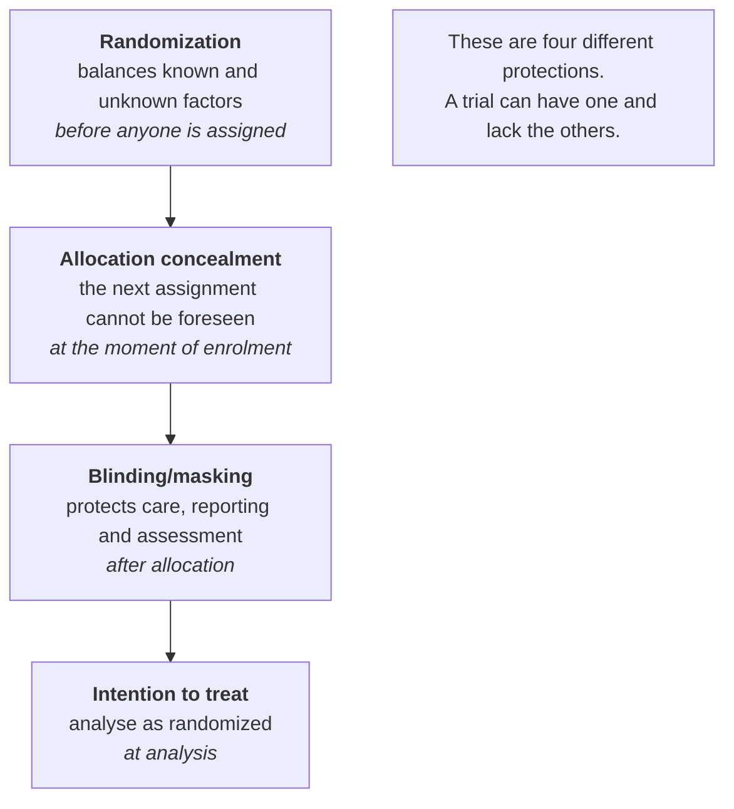

---

## 📄 Paper 1 · Concealment described properly — intranasal vs intravenous dexmedetomidine

**Dexmedetomidine trial (2026)** [@dex2026], in *Drug Design, Development and Therapy*.

**Source audit:** [Open full text](https://pmc.ncbi.nlm.nih.gov/articles/PMC13585183/). Record the section or figure supporting each design claim before reading the interpretation.

### What the methods say

> A "prospective, single-center **non-inferiority** randomized clinical trial" asked whether
> intranasal dexmedetomidine **the night before** surgery is non-inferior to an intravenous infusion
> before induction, for preventing postoperative delirium in elderly patients having joint
> arthroplasty. "We randomly assigned enrolled patients in a **1:1 ratio**"; "randomization was
> **stratified by type of surgery**, using **block randomization (block sizes of 4)**".
>
> > "**Allocation concealment** was achieved through the use of **opaque sealed envelopes** managed
> > by an **independent investigator who was not involved in outcome evaluation or data analysis**."
>
> The primary outcome was "incidence of postoperative delirium within 3 days after surgery assessed
> by the Confusion Assessment Method". In the intention-to-treat analysis it was **9.5% vs 7.6%**,
> "rate difference ... 0.02 (95% CI: −0.04 to 0.08), meeting the pre-specified non-inferiority
> criterion". The control-group rate was assumed to be **10%** when sizing the study.

### The design, drawn

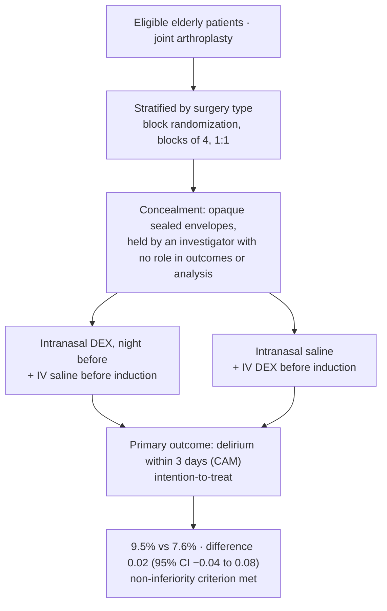

### Reading it

Compare with the course interpretation after completing your audit

- **Concealment is described, not just claimed.** Three features make it credible: the envelopes are
  opaque and sealed, they are *managed by someone else*, and that person has no role in outcome
  assessment or analysis. Compare this with "patients were randomized using a random number table",
  which says nothing about whether the next allocation could be foreseen
  ([Ch. 4](../../chapters/04-randomization-and-blinding.md)).
- **Blocks plus strata, for a reason.** Blocks of 4 keep the two arms balanced as recruitment
  proceeds; stratifying by surgery type keeps that balance *within* knee and hip operations, which
  differ in delirium risk ([Ch. 5](../../chapters/05-blocking-and-batches.md)).
- **A double-dummy design.** Each arm receives both an intranasal and an intravenous preparation,
  one of them placebo. Without that, the route itself would reveal the allocation.
- **The direction of the result matters.** Delirium was *numerically higher* in the intranasal arm
  (9.5% vs 7.6%). Non-inferiority asks something narrower than "is it better": it asks whether the
  difference is small enough to be acceptable, judged against a margin fixed in advance.

▶ What a non-inferiority margin is for

A superiority trial asks whether the new treatment is **better**. A non-inferiority trial concedes
it may be slightly worse and asks whether it is **not worse by more than a pre-specified amount** —
the margin — in exchange for some other advantage (here, convenience and avoiding an infusion
before induction). The margin must be set before data collection and justified clinically;
otherwise any result can be declared acceptable after the fact.

**Watch for:** a trial that fails to show superiority and is then described as showing
"no difference". That is a different claim, and it needs a margin to be meaningful
([Ch. 8](../../chapters/08-sample-size-and-power.md)).

---

## 📄 Paper 2 · Allocation and measurement at different levels — a cluster-randomized trial

**BALTIC trial (2026)** [@baltic2026], in *JAMA Network Open*. The most structurally interesting
design in this module.

**Source audit:** [Open full text](https://pmc.ncbi.nlm.nih.gov/articles/PMC13179548/). Record the section or figure supporting each design claim before reading the interpretation.

### What the methods say

> "This **cluster-randomized** clinical trial was conducted from 2020 to 2023 in **12 German
> tertiary care neonatal intensive units** ... for 24 months, with **crossover at 12 months**." The
> primary outcome was "the rate of health care–associated GNB bloodstream infections (BSI) **at
> infant level** in all neonates requiring intensive care in the cluster, assuming **5% as
> noninferiority margin** delta". The analysis rested on "an overall sample size of 12 sites with
> crossover at 12 months, making **24 clusters with 9731 neonates**".
>
> Results: "22 of 4699 infants (0.5%) developed GNB BSIs" under standard hand hygiene, "compared
> with 25 of 5032 infants (0.5%)" under extended barrier precautions. Note also:
> "**Consent was not required because this was a cluster-randomized trial with no randomization per
> patient.**"

### The design, drawn

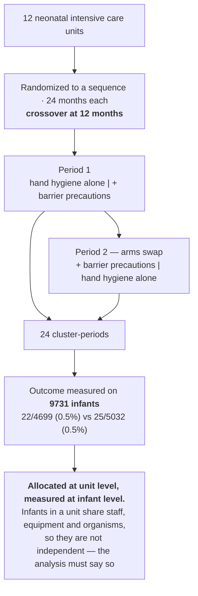

### Reading it

Compare with the course interpretation after completing your audit

- **Why randomize units at all?** The intervention — gowns and gloves for colonized infants — is a
  *ward practice*. You cannot apply it to one cot and not the next; staff and organisms move around
  the unit. The cluster is the only level at which the treatment can be assigned
  ([Ch. 3](../../chapters/03-experimental-unit-and-replication.md)).
- **The price.** With 12 units there are few units to randomize, however many infants are inside
  them. Infants within a unit are correlated, so 9731 infants carry far less information than 9731
  independent patients would ([Ch. 8](../../chapters/08-sample-size-and-power.md), design effect).
- **The crossover is what rescues it.** Each unit serves in both roles, 12 months each, so stable
  differences between units — case mix, staffing, layout — cancel within a unit. The design buys
  back precision that 12 clusters alone could not provide.
- **Consent works differently.** The authors report that individual consent was not required in this trial. Cluster allocation alone does not establish that consent can be waived: who receives an intervention, what data are collected and the ethics-approved arrangements matter. The [Ottawa Statement](https://pmc.ncbi.nlm.nih.gov/articles/PMC3502500/) explains consent and waiver requirements for cluster trials.
- **A null result with a margin behind it.** 0.5% vs 0.5% is uninformative on its own; the claim
  "noninferior" has content only because the 5% margin was fixed in advance.

---

## 📄 Paper 3 · A crossover that measures its own washout — bright light therapy in Parkinson disease

**Bright light therapy pilot (2026)** [@blt2026], in *Nature and Science of Sleep*.

**Source audit:** [Open full text](https://pmc.ncbi.nlm.nih.gov/articles/PMC13431437/). Record the section or figure supporting each design claim before reading the interpretation.

### What the methods say

> "In this **randomized, crossover, self-controlled pilot study**, BLT was delivered using bright
> light at 10,000 lux, and **dim light at 200 lux served as the control condition**." "**Twenty-seven
> patients** with PD were assigned to receive 30 days of BLT and 30 days of dim light therapy (DLT)
> in **counterbalanced order**, separated by a **30-day washout period**", with "the BLT-DLT group
> (n = 14)". Assessments — sleep measures, polysomnography and resting-state fMRI — were "performed
> at **four time points: baseline, following the first intervention phase, following the washout
> period**, [and after the second]".
>
> Sizing: "calculated in R ... using the pwr.t.test toolbox ... assuming an **intraparticipant
> correlation of repeated measurements of ρ = 0.6**, a statistical power of 80%, and a two-tailed
> significance level of 0.05, a total of **24 participants** were required". The fMRI outcomes were
> null: "no clusters showed significant alterations".

### The design, drawn

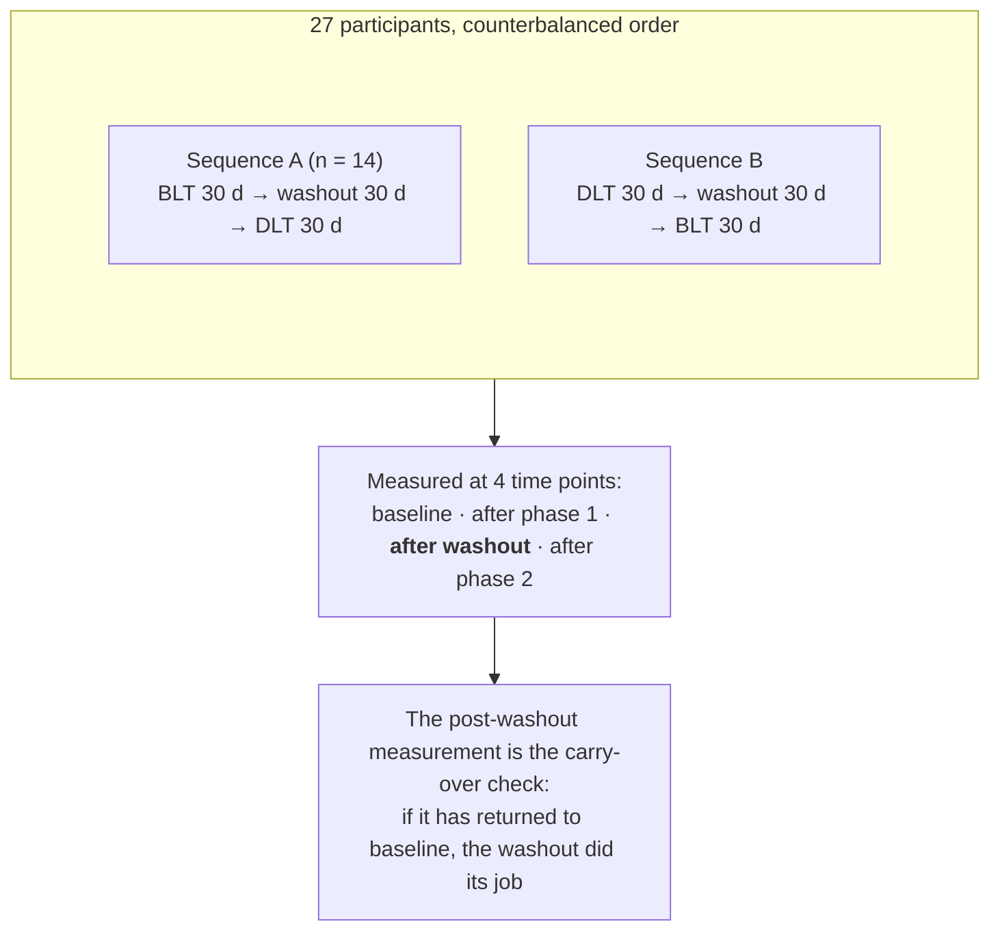

### Reading it

Compare with the course interpretation after completing your audit

- **The control is a dose, not an absence.** 200 lux dim light keeps the ritual, the device and the
  sitting time identical, and changes only the intensity. A no-treatment arm would have confounded
  light with attention and routine ([Ch. 6](../../chapters/06-controls-and-comparators.md)).
- **Measuring after the washout is the good design decision.** Most crossover papers assert a
  washout; this one measures during it, so the assumption that the effect has worn off is
  checkable rather than asserted ([Ch. 7](../../chapters/07-treatment-structures.md)).
- **Counterbalancing separates treatment from period.** With both orders present, a general
  improvement over time — placebo, seasonal change, disease course — does not masquerade as a
  treatment effect.
- **The sample size calculation names its assumption.** ρ = 0.6 is the within-person correlation
  that makes a crossover efficient. State it, and the reader can judge the calculation; omit it, and
  the number is unauditable.
- **A null fMRI result in a pilot.** With 27 participants and whole-brain imaging, "no significant
  clusters" is weak evidence of absence. The paper calls itself a pilot, which is the honest frame.

---

## 📄 Paper 4 · The CONSORT flow, and what "assessor-blinded" leaves open

**Ciprofol vs propofol trial (2026)** [@ciprofol2026], in *Drug Design, Development and Therapy*.

**Source audit:** [Open full text](https://pmc.ncbi.nlm.nih.gov/articles/PMC13401385/). Record the section or figure supporting each design claim before reading the interpretation.

### What the methods say

> "In this single-center, **assessor-blinded**, randomized controlled trial, **234 patients** ...
> were assessed for eligibility, and **226 were randomly assigned**"; "226 patients were randomized
> in a **1:1 ratio** ... (Group C, n = 113) or propofol (Group P, n = 113) ... and were included in
> the **intention-to-treat** analysis", after "8 patients declined to participate". The primary
> outcome was "the incidence of respiratory depression (SpO₂ < 90% requiring airway intervention)".
>
> On size: "using a two-sided α level of 0.05 and a statistical power of 90% ... the required sample
> size was estimated to be **43 participants per group**", and then —
>
> > "Although the calculated minimum sample size was 96 participants, **recruitment continued
> > throughout the predefined study period using consecutive enrollment of all eligible patients**."

### The design, drawn

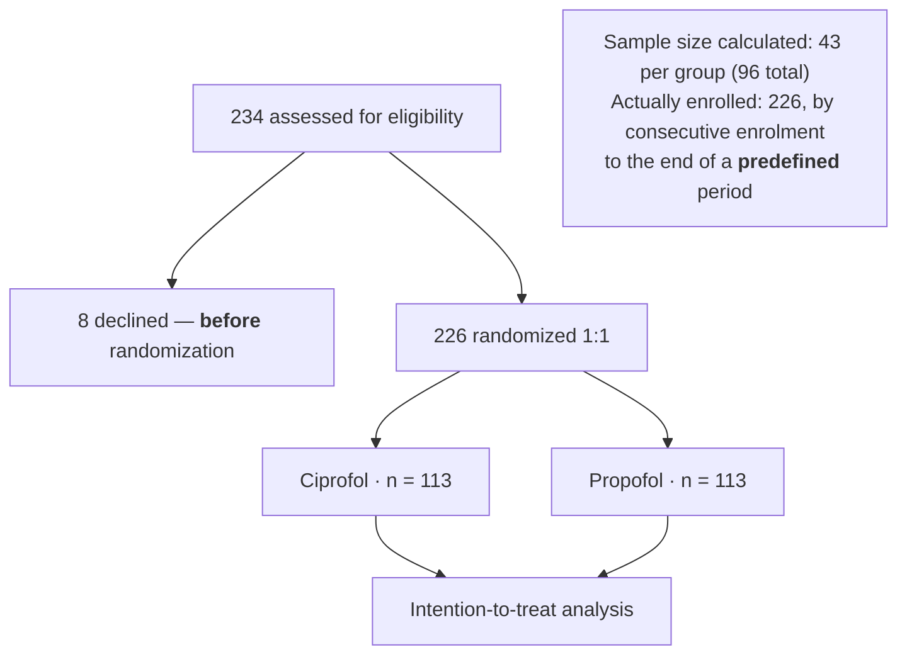

### Reading it

Compare with the course interpretation after completing your audit

- **Exclusions before randomization are not dropouts.** The 8 who declined never entered the
  comparison, so they cannot bias it — they limit generalizability, not internal validity. Losses
  *after* randomization are the dangerous ones ([Ch. 23](../../chapters/23-clinical-and-preclinical.md)).
- **"Assessor-blinded" is precise, and limited.** The person recording respiratory depression did not
  know the drug; the anaesthetist delivering it necessarily did. For an outcome requiring a judgement
  — when to intervene on the airway — the treating clinician's knowledge can still influence what
  happens ([Ch. 4](../../chapters/04-randomization-and-blinding.md)).
- **Over-enrolment, handled acceptably.** Recruiting 226 when 96 were needed is fine *because the
  stopping rule was a predefined time period, not the data*. Recruiting until a *p*-value crosses a
  threshold is a different thing entirely, and inflates the false-positive rate
  ([Ch. 25](../../chapters/25-preregistration-and-reporting.md)).
- **A safety outcome drove the size.** Sizing on the primary *safety* endpoint rather than on
  efficacy is a deliberate choice, and it is stated.

---

## 📄 Paper 5 · A preclinical study with a dose arm — tanshinone and periodontal bone loss

**Sodium tanshinone IIA sulfonate study (2026)** [@sts2026], in *Journal of Clinical Periodontology*.

**Source audit:** [Open full text](https://pmc.ncbi.nlm.nih.gov/articles/PMC13477849/). Record the section or figure supporting each design claim before reading the interpretation.

### What the methods say

> "**Sixty 8-week-old male C57BL/6J mice**" were used "in a **ligature-induced model** of
> periodontitis", "**randomly allocated to four groups**: control (C), periodontitis + vehicle (P),
> periodontitis treated with **1 mg/kg** sodium tanshinone IIA sulfonate (STS1) and periodontitis
> treated with **5 mg/kg**" (STS5). "Experimental periodontitis was induced by **bilateral placement
> of ligatures** around the first maxillary molars in the P, STS1 and STS5 groups."
> "Experiments were conducted in compliance with the **ARRIVE**" guidelines [@percie2020];
> "**Sample size calculation** was performed using G*Power"; and "**analyses were performed in a
> blinded manner**".

### The design, drawn

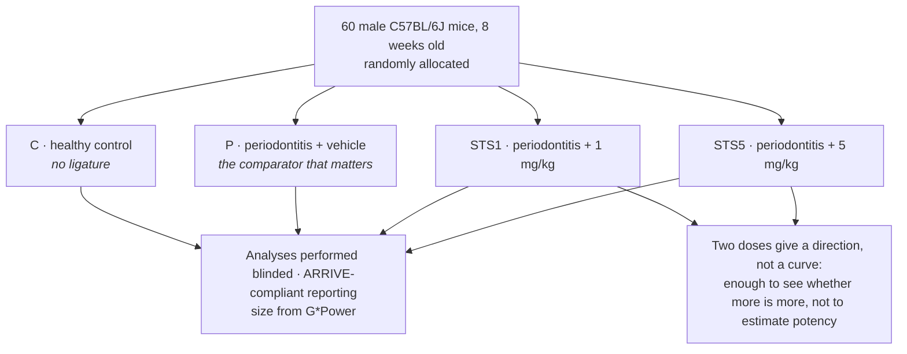

### Reading it

Compare with the course interpretation after completing your audit

- **The vehicle-plus-disease group is the comparator that matters.** Comparing treated animals with
  *healthy* controls would only show that ligatures cause disease. The treatment claim rests on
  STS1/STS5 versus P ([Ch. 6](../../chapters/06-controls-and-comparators.md)).
- **Two doses are a design choice with limits.** They can show whether the effect increases with
  dose; they cannot estimate an ED50 or the shape of the curve
  ([Ch. 7](../../chapters/07-treatment-structures.md)).
- **"Blinded analysis" — of which step?** The paper states analyses were blinded. For bone
  measurements from micro-CT and histology, the critical step is whoever *measures*, not only whoever
  computes. Paper 4 of Module 2 shows the more precise formulation: an observer blinded to genotype
  performing the scoring.
- **Male mice only.** Common, and a real limit on scope: periodontal and inflammatory responses can
  differ by sex, so the result describes male mice of this strain
  ([Ch. 23](../../chapters/23-clinical-and-preclinical.md)).
- **The model defines the question.** Ligature-induced periodontitis is rapid and mechanical; human
  periodontitis is slow and microbial. The design supports a claim about this model.

---

## 📄 Paper 6 · Everyone gets it eventually — a stepped wedge in 36 maternity units

**OBS UK trial protocol (2026)** [@obsuk2026], in *BMJ Open*. The cluster design for an intervention
nobody is willing to withhold permanently.

**Source audit:** [Open full text](https://pmc.ncbi.nlm.nih.gov/articles/PMC13504888/). Record the section or figure supporting each design claim before reading the interpretation.

### What the methods say

> "**OBS UK is a stepped wedge cluster randomised trial** designed to test the effectiveness of the OBS
> intervention compared with usual care on clinical and psychological PPH outcomes after childbirth",
> "involving **over 270 000 women at 36 maternity units** with nested psychological and
> cost-effectiveness studies and a process evaluation."
>
> The reason for the design is organizational, and stated: "The design was selected to allow the
> intervention to be **delivered and evaluated at an organisational level**".
>
> The mechanics are the part to read closely:
>
> > "Maternity units were **randomised to one of six sequences** and have collected data during a
> > **period of usual PPH care for between 3 and 18 months**. They then undertake the **9-month
> > implementation period** followed by **3–18 months data collection of OBS UK care**."
>
> Cluster selection aimed at representativeness: "**Sites included 36 NHS maternity units of different
> sizes and locations serving areas of varied social deprivation and ethnic composition so that the
> study population approximately reflects the UK population.**"
>
> And the intervention requires committed local resource: "at least **4 hours/week protected midwifery
> time**" plus consultant time, for each site's champion team.

### The design, drawn

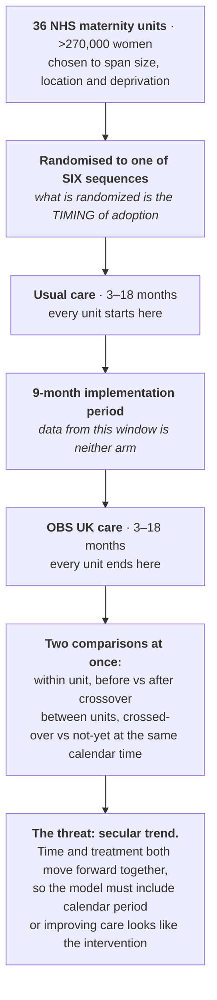

### Reading it

Compare with the course interpretation after completing your audit

- **A stepped wedge randomizes *when*, not *whether*.** Every unit eventually receives the
  intervention, which is what makes the design acceptable when an intervention is believed beneficial
  and withholding it indefinitely is hard to justify. The randomized quantity is the crossover time
  ([Ch. 4](../../chapters/04-randomization-and-blinding.md)).
- **The design's defining hazard is the secular trend.** Because later periods contain more
  intervention units *and* are later in calendar time, anything improving over the study — staff
  experience, national guidelines, equipment — is confounded with the intervention unless calendar
  period is in the model. Staggered sequences provide contemporaneous treated and untreated clusters during mixed periods, allowing treatment to be distinguished from calendar period under the model; six sequences are not a universal minimum
  ([Ch. 5](../../chapters/05-blocking-and-batches.md)).
- **The implementation period is a designed gap, not missing data.** Nine months during which a unit is
  neither reliably "usual care" nor reliably "intervention". Excluding it prevents a partially adopted
  intervention from being scored as either arm — the same logic as a crossover's washout
  ([Ch. 7](../../chapters/07-treatment-structures.md)).
- **270,000 women, 36 clusters.** As in Paper 2's BALTIC trial above and
  [Module 8](08-pharmacy.md)'s ADRe trial, the information lives in the clusters. What a stepped wedge
  buys over a parallel cluster trial is that each unit contributes a *within-unit* before-and-after
  comparison as well, which recovers precision that 36 clusters alone would not provide
  ([Ch. 3](../../chapters/03-experimental-unit-and-replication.md)).
- **Choosing clusters to reflect the population is an external-validity decision.** It does nothing for
  internal validity — randomization handles that — but it determines who the answer is about.

---

## 📄 Paper 7 · Where the numbers in a sample size calculation come from

**Stepped wedge design parameters study (2026)** [@sweicc2026], in *Critical Care and Resuscitation*.
The companion piece to Paper 6: a paper whose entire output is the inputs to someone else's design.

**Source audit:** [Open full text](https://pmc.ncbi.nlm.nih.gov/articles/PMC12936732/). Record the section or figure supporting each design claim before reading the interpretation.

### What the methods say

> The aim is explicitly methodological: "To **estimate key statistical parameters and provide practical
> guidance for planning stepped wedge cluster randomised trials** in Australian and New Zealand
> intensive care units (ICUs)."
>
> The quantities estimated are the ones a stepped wedge calculation needs:
>
> > "**Intra-cluster correlation coefficients (ICCs) and cluster auto-correlations (CACs)** were
> > estimated using **exchangeable, block-exchangeable, and discrete time decay models** using a
> > cross-sectional design."
>
> The scale of the source data: "Among **1,291,849 eligible ICU admissions**, observed mortality ranged
> from **10.3%** (all ICU admissions) to **23.0%** (non-elective invasively ventilated patients in
> Mega-ROX ICUs). **ICCs ranged from 0.008 to 0.022 and CACs from 0.83 to 1.00**, with
> **block-exchangeable or discrete time decay models most often providing the best fit**."
>
> And the motivation is a real barrier: "Despite the potential usefulness of stepped wedge cluster
> randomised trials such trials have **rarely been conducted** in Australian and New Zealand (ANZ)
> ICUs ... In part, this may be because the **sample size calculations are** [difficult]".

### The design, drawn

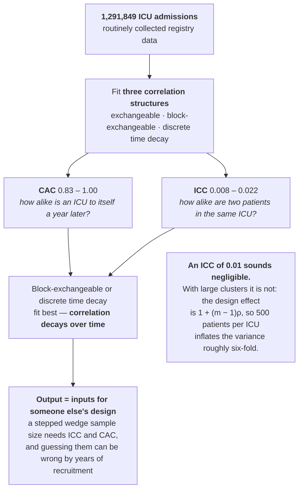

### Reading it

Compare with the course interpretation after completing your audit

- **A sample size calculation is only as good as its assumed correlation.** For cluster designs the ICC
  enters through the design effect, and a small-looking value has large consequences when clusters are
  big. Estimating it from 1.29 million real admissions replaces a guess with a measurement
  ([Ch. 8](../../chapters/08-sample-size-and-power.md)).
- **The cluster autocorrelation is the parameter specific to stepped wedges.** A stepped wedge compares cluster-periods over time and needs a correlation structure appropriate to those comparisons. CAC = 1 means a perfectly persistent cluster component under the fitted model, not identical patient outcomes or ICU conditions a year later. Parallel cluster trials with multiple periods can also require more than a single ICC ([Ch. 7](../../chapters/07-treatment-structures.md)).
- **Fitting three correlation structures is a sensitivity analysis on an assumption.** Exchangeable
  assumes correlation never decays; discrete time decay allows it to. Finding that the decaying models
  fit best means the simplest assumption would have been optimistic
  ([Ch. 11](../../chapters/11-observational-and-causal.md)).
- **Routine data repurposed as design input.** The registry was never collected to plan trials. Using
  it this way is cheap, requires no new patients, and produces a public resource — and its limitation
  is right there in the title: these are Australian and New Zealand ICUs, and ICCs are not universal
  constants.

---

## 📄 Paper 8 · Deciding in advance how you will change your mind — an adaptive trial

**Adaptive surgical prophylaxis trial protocol (2026)** [@adaptive2026], in *BMJ Open*.

**Source audit:** [Open full text](https://pmc.ncbi.nlm.nih.gov/articles/PMC13007059/). Record the section or figure supporting each design claim before reading the interpretation.

### What the methods say

> "This **adaptive, multi-arm multistage non-inferiority trial** will compare **intraoperative only (Arm
> A)**, to **intraoperative and 24 hours (Arm B)** and, to **intraoperative and 48 hours (Arm C)** of
> intravenous cefazolin and placebo as surgical antimicrobial prophylaxis in **9180 patients** undergoing
> cardiac surgery."
>
> The adaptation is specified rather than reserved: "This large, international, multicentre,
> **double-blind, placebo-controlled, phase IV non-inferiority trial** uses a robust adaptive framework
> with **interim analyses and arm-dropping criteria**, enhancing efficiency while maintaining
> statistical integrity and ethical oversight."
>
> The question is a de-escalation question — can we give *less*: the trial asks whether stopping
> prophylaxis at the end of surgery is non-inferior to continuing it, since extended dosing "**may lead
> to emergence of ant**[imicrobial resistance]".
>
> The margin is derived, not asserted: "The US Food and Drug Administration and European Medicines
> Agency (EMA) have published guidance outlining approaches to determine the non-inferiority margin ...
> There are **two approaches** for determining the non-inferiority margin: the **Fixed Margin Approach**
> (denoted as M1) and the **Synthesis Method**".
>
> And the protocol names its own operational risk: "**Operational complexity across diverse settings:**
> The global scale and adaptive design **may introduce logistical challenges in maintaining protocol
> adherence, data quality and consistent blinding** across multiple sites."

### The design, drawn

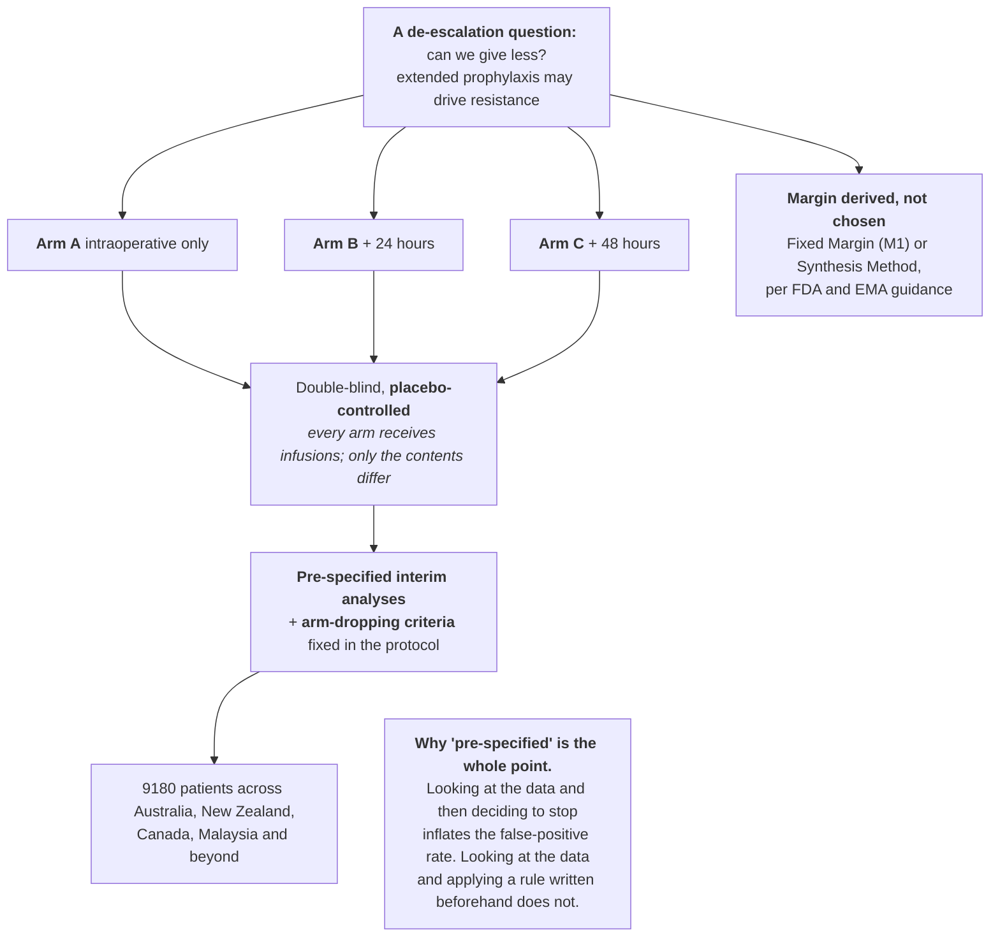

### Reading it

Compare with the course interpretation after completing your audit

- **Adaptive does not mean flexible.** The adaptations — when to look, what would cause an arm to be
  dropped — are written into the protocol before enrolment. That is what separates an adaptive design
  from the thing it superficially resembles, which is stopping when the result looks good
  ([Ch. 25](../../chapters/25-preregistration-and-reporting.md)).
- **Arm-dropping is how a multi-arm trial stays affordable.** Three durations tested separately would be
  three trials with three control groups. One trial with a shared control and the ability to drop a
  futile arm uses fewer patients for the same questions — and can limit exposure to arms meeting the prespecified futility rule. Futility is an uncertain assessment, not proof that an arm is inferior
  ([Ch. 8](../../chapters/08-sample-size-and-power.md)).
- **Placebo infusions in every arm are what make blinding possible here.** The intervention is a
  *duration*. Without placebo continuing in the short arms, the nursing staff would know which patients
  stopped early, and post-operative wound assessment is exactly the kind of judgement that unblinding
  influences ([Ch. 4](../../chapters/04-randomization-and-blinding.md)).
- **Non-inferiority in a de-escalation trial inverts the usual incentive.** Distinguish imprecision from bias towards similarity. Extra random noise widens intervals and can make non-inferiority harder to establish. Non-adherence, contamination or insensitive measurement can reduce the observed treatment contrast and favour a misleading non-inferiority conclusion. A justified margin and appropriate analysis populations are therefore essential.

---

## 📄 Paper 9 · How close can an observational study get? — target trial emulation versus RCTs

**Target trial emulation concordance review (2026)** [@tte2026], in *The BMJ*. The paper that puts a
number on the question underlying every observational design in this sub-course.

**Source audit:** [Open full text](https://pmc.ncbi.nlm.nih.gov/articles/PMC13184834/). Record the section or figure supporting each design claim before reading the interpretation.

### What the methods say

> The aim: "To assess the **concordance of results between paired target trial emulations and their
> benchmarking randomised controlled trials** and to explore **determinants of emulation success**."
>
> Eligibility is a design criterion: "Observational studies that **explicitly aimed to emulate target
> randomised controlled trials** of a health intervention were included", with data extracted "on study
> domain, target population, intervention, comparator, and main outcomes **for each emulation and
> corresponding randomised controlled trial**."
>
> Concordance is measured several ways at once: "For **21 predefined emulation design features**,
> concordance was assessed using **Pearson correlation coefficients, standardised difference agreement,
> and ratio of ratios**, with subgroup and regression analyses".
>
> The headline result:
>
> > "Among **106 target trial emulation-randomised controlled trial pairs**, the **Pearson correlation
> > coefficient was 0.58 (95% confidence interval (CI) 0.43 to 0.69)**, **standardised difference
> > agreement was 79% (84/106)**, and **summary ratio of ratios was 0.97 (95% CI 0.92 to 1.03;
> > I2=42%)**. In **62 pairs with closer emulation of trial design, a higher** [concordance was seen]."
>
> The conclusion is appropriately hedged: "Current target trial emulations achieve **moderate
> concordance** when replicating their corresponding randomised controlled trials. Concordance **could
> be improved by better emulation design**, including **better baseline and outcome emulation and
> leveraging multisource linked databases**."
>
> The rationale for the approach: "Target trial emulation helps investigators to **clearly specify the
> causal estimand and avoid design related biases** (for example, **immortal time bias** and other
> selection biases)."

### The design, drawn

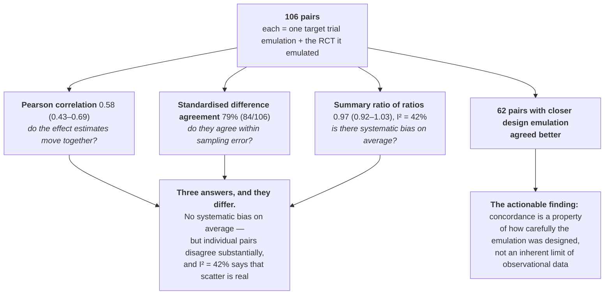

### Reading it

Compare with the course interpretation after completing your audit

- **Three concordance measures that answer three different questions.** A ratio of ratios near 1 means
  emulations are not biased *in a consistent direction*. A Pearson correlation of 0.58 means that for
  any individual pair, the emulation's estimate is a noisy version of the trial's. Both can be true,
  and reporting only the first would be misleading ([Ch. 9](../../chapters/09-descriptive-studies.md)).
- **"Target trial emulation" is a design discipline, not a statistical method.** It asks you to write
  the protocol of the randomized trial you *would* run — eligibility, treatment assignment, start of
  follow-up, outcome, analysis — and then build the observational study to match it. Most of the biases
  it prevents, immortal time bias chief among them, come from misaligning the start of follow-up with
  the moment of treatment assignment ([Ch. 11](../../chapters/11-observational-and-causal.md)).
- **The subgroup finding is the one to act on.** Pairs whose emulation copied the trial design more
  closely agreed better. That turns "can observational data substitute for trials?" into a tractable
  engineering question: which design features matter, and can they be met with the data you have
  ([Ch. 12](../../chapters/12-predictive-studies.md)).
- **Note what this review cannot settle.** Every pair here exists because someone ran a trial *and*
  someone emulated it. Emulations in areas where no trial exists — the cases where emulation matters
  most — are by construction absent, and there is no guarantee that concordance generalizes to them.

---

## 📄 Paper 10 · What a preclinical literature looks like under a bias tool

**Prenatal valproate rodent model review (2026)** [@vpareview2026], in *Frontiers in Physiology*.

**Source audit:** [Open full text](https://pmc.ncbi.nlm.nih.gov/articles/PMC13590398/). Record the section or figure supporting each design claim before reading the interpretation.

### What the methods say

> "**Sixty-six eligible prenatal VPA studies were included.** Most administered a **single
> intraperitoneal dose of 500 or 600 mg/kg around embryonic day 12–12.5.**"
>
> Two instruments are applied, measuring different things: "The methodological quality and risk of bias
> of included studies were assessed using the **SYRCLE risk-of-bias tool for animal intervention
> studies**", covering "domains related to **selection bias, performance bias, detection bias, attrition
> bias, and reporting bias**"; and separately "the **methodological reporting quality** of the included
> animal studies was evaluated in accordance" with ARRIVE 2.0.
>
> The verdict is specific about which items failed:
>
> > "The SYRCLE assessment indicated that **most included studies had an overall high risk of bias**,
> > primarily because **sequence generation, allocation concealment, random housing, blinding,
> > animal-flow accounting, and litter-level experimental-unit procedures were incompletely reported.**
> > **ARRIVE 2.0 reporting was generally stronger for study objectives, ethical approval, experimental
> > procedures, and interpretation of findings**, whereas **inclusion and exclusion criteria, blinding,
> > animal-care monitoring**" were weaker.
>
> Pooling was declined with a reason: "Due to **substantial heterogeneity** among included studies
> regarding **VPA dose, administration route, gestational timing, animal strain, sex, and evaluated
> outcomes**, **quantitative meta-analysis was not performed.**"

### The design, drawn

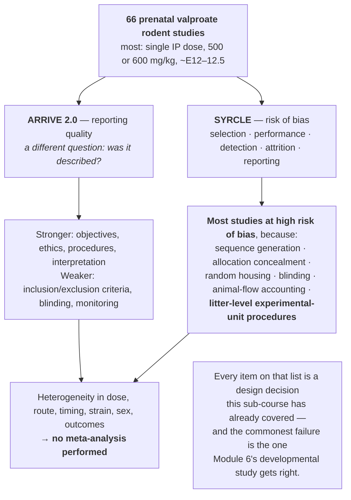

### Reading it

Compare with the course interpretation after completing your audit

- **Risk of bias and reporting quality are different measurements.** SYRCLE asks whether a design
  feature protects the result; ARRIVE asks whether it was described. A study can be well conducted and
  badly reported, and from the outside those are indistinguishable — which is why incomplete reporting
  is scored as risk ([Ch. 25](../../chapters/25-preregistration-and-reporting.md)).
- **"Litter-level experimental-unit procedures" tops the list of failures.** This is the exact error
  [Module 6's developmental study](06-neuroscience.md) avoids by treating litter as a random effect.
  A field-level review finding it incompletely reported across 66 papers says the problem is structural,
  not occasional ([Ch. 3](../../chapters/03-experimental-unit-and-replication.md)).
- **"Random housing" appears as a bias domain, and it is not pedantry.** Cages differ in position,
  light, temperature and neighbours. Housing all treated animals on one rack reintroduces exactly the
  confound that randomizing treatment removed — the same distinction
  [Module 6's blocking sidebar](06-neuroscience.md) draws between random *treatment* allocation and
  random *sequence* allocation ([Ch. 5](../../chapters/05-blocking-and-batches.md)).
- **Declining to meta-analyse is the right call and should be read as a finding.** Dose, route,
  gestational timing, strain, sex and outcome all vary. Pooling would produce a number describing no
  actual experiment. As in [Module 8](08-pharmacy.md)'s systematic review, the decision not to pool is
  itself informative about how comparable a literature is
  ([Ch. 9](../../chapters/09-descriptive-studies.md)).
- **Read this before designing in a model system with an established literature.** "Most studies use
  500–600 mg/kg at E12.5" is useful; "most studies are at high risk of bias" means the convergence of
  that literature is weaker evidence than its size suggests.

---

## 🔎 Sidebar · An audit, published

Design auditing of the kind this sub-course teaches happens in the literature itself. A 2026
commentary on a non-inferiority anaesthesia trial lists precisely the items a reader should check:
the authors "do not report the **non-inferiority margin**, the test statistics for non-inferiority,
or the corresponding *P*-values"; they "do not report any **assessment of blinding success**",
although the two drugs "have different adverse-event profiles"; and although a random number table
is mentioned, they "do not specify the method of **allocation concealment** (eg, sealed envelopes,
central randomisation)".

Three checks, each matching one row of the diagram at the top of this module. That is the whole
skill, applied by a reader with no access to the data.

---

## Independent transfer task · Cluster trial audit

A protocol randomizes eight clinics and plans to enrol 100 patients per clinic. Describe how allocation, outcome counts, correlation and consent arrangements enter the audit. Name one claim that 800 patients alone cannot establish.

Use the [evidence worksheet and assessment criteria](README.md#evidence-worksheet).
Submit your diagram, source-backed reasoning and one remaining uncertainty before looking at the
sample answers. More than one redesign may be defensible; justify yours against the stated constraint.

---

## ⚠️ Common Misconceptions

| ❌ The misconception | ✅ What is actually true — and what to do |
|---|---|
| **"Randomized means concealed."** | Randomization fixes the sequence; concealment stops the next allocation being foreseen at enrolment. Paper 1 describes both separately. |
| **"Double-blind is always possible."** | Often it is not. Paper 4 says *assessor-blinded* — precise and honest — rather than implying more. |
| **"A null result means the treatments are equivalent."** | Only against a margin fixed in advance. Papers 1 and 2 both pre-specify one; without it, 0.5% vs 0.5% means little. |
| **"A cluster trial with 9731 patients is a huge trial."** | It has 12 units and 24 cluster-periods. Patients within a unit are correlated; the units carry the information. |
| **"Recruiting more than the calculation is data dredging."** | Not if the stopping rule is a predefined period, as in Paper 4. Stopping when *p* < 0.05 is the problem. |
| **"A washout removes carry-over."** | It is an assumption until measured. Paper 3 measures after the washout so the assumption can be checked. |
| **"ARRIVE compliance means the design is strong."** | ARRIVE governs *reporting*. It makes the design visible — which is what lets you judge it. |
| **"In a stepped wedge, the control arm disappears."** | It does not: during mixed periods some clusters have crossed over and some have not; the earliest and latest periods may contain only one condition. What makes it work is having several sequences, so period is estimable (Paper 6). |
| **"An ICC of 0.01 is negligible."** | With 500 patients per cluster the design effect is about six. Paper 7 estimates ICCs of 0.008–0.022 from 1.29 million admissions precisely because guessing is costly. |
| **"Adaptive designs let you stop when you like."** | The looks and the stopping rules are fixed in the protocol before enrolment. That is the entire difference between adapting and peeking (Paper 8). |
| **"Observational studies cannot replace trials."** | Paper 9 found a summary ratio of ratios of 0.97 across 106 pairs — no systematic bias on average — but a correlation of only 0.58, so individual emulations vary. Closer design emulation agreed better. |
| **"A large preclinical literature is strong evidence."** | Paper 10 found most of 66 studies at high risk of bias, chiefly for unreported randomization, blinding and litter-level procedures. Size and reliability are different things. |

---

## ✅ Check Your Understanding

**⭐ Q1.** In Paper 1, name the three features that make the allocation concealment credible.

**⭐⭐ Q2.** Paper 2 randomized 12 units but measured 9731 infants. Which number is closer to the
effective sample size, and why?

**⭐⭐ Q3.** Paper 3 measures participants after the washout as well as after each phase. What does
that extra measurement let the authors check?

**⭐⭐⭐ Q4.** Paper 4 enrolled 226 patients when the calculation required 96. Explain when this is
acceptable and when the same behaviour would invalidate the *p*-value.

**⭐⭐⭐ Q5.** Paper 5 reports "analyses were performed in a blinded manner". Rewrite that sentence so
a reader knows exactly who was blinded to what, and say which step matters most for micro-CT bone
measurements.

---

**⭐⭐ Q6.** In Paper 6, every maternity unit eventually adopts the intervention. Explain what is
randomized, and name the specific threat this creates that a parallel cluster trial does not face.

**⭐⭐ Q7.** Paper 7 reports ICCs between 0.008 and 0.022. A colleague says these are "so small they can
be ignored". Show why that is wrong for a trial with 500 patients per ICU.

**⭐⭐⭐ Q8.** Paper 8 pre-specifies interim analyses and arm-dropping criteria. A reviewer asks why this
is different from analysing the data periodically and stopping when a difference emerges. Answer in
two or three sentences.

**⭐⭐⭐ Q9.** Paper 9 reports a summary ratio of ratios of 0.97 (0.92–1.03) and a Pearson correlation of
0.58 (0.43–0.69) across the same 106 pairs. Explain how both can be true, and say which number matters
more to someone deciding whether to trust a single emulation.

---

## 📝 Sample Answers & Assessment

▶ Show sample answers

> **Q1:** *"The envelopes were opaque and sealed; they were managed by an independent investigator
> rather than the recruiting team; and that investigator had no role in outcome evaluation or
> analysis."* — **Example answer.**

> **Q2:** *"Twelve — or rather the 24 cluster-periods created by the crossover. Infants in one unit
> share staff, equipment and resident organisms, so their outcomes are correlated; the information
> about the intervention comes from differences between units and periods, not from counting
> infants. The design effect is what converts 9731 infants into a far smaller effective n."* — **Example answer.**

> **Q3:** *"Whether the effect of the first intervention has actually worn off before the second
> begins. If the post-washout values have returned to baseline, carry-over is unlikely; if they have
> not, the second period is contaminated and the crossover's main assumption fails."* — **Example answer.**

> **Q4:** *"It is acceptable here because the stopping rule was a predefined calendar period with
> consecutive enrolment — a rule that cannot react to the results. The same final number would be
> illegitimate if recruitment had continued until the p-value crossed 0.05, because repeatedly
> testing and stopping on a favourable look inflates the false-positive rate well above 5%."* — **Example answer.**

> **Q5:** *"'Micro-CT linear bone measurements and histological scoring were performed by an observer
> blinded to group allocation, using coded files; group identity was revealed only after all
> measurements were entered.' The measurement step matters most — once a number is recorded, the
> statistical analysis has little room to be biased by knowing the groups."* — **Example answer.**

> **Q6:** *"What is randomized is the time at which each unit crosses from usual care to the
> intervention — units are assigned to one of six sequences, not to a treatment. The threat this
> creates is confounding with the secular trend: later calendar periods contain more intervention
> units, so anything that improves over the course of the trial — staff experience, national guidance,
> equipment — would be attributed to the intervention unless calendar period is included in the model.
> A parallel cluster trial compares arms at the same time throughout and does not face this."* — **Example answer.**

> **Q7:** *"The design effect is approximately 1 + (m − 1)ρ, where m is the cluster size. With m = 500
> and ρ = 0.01 that is 1 + 499 × 0.01 ≈ 6, so the variance is inflated roughly six-fold and the trial
> needs about six times as many patients as an individually randomized one. An ICC is small in
> absolute terms precisely because it is a correlation between individuals; its consequences scale with
> how many individuals share each cluster."* — **Example answer.**

> **Q8:** *"Because the rules are fixed before any data are seen, the inflation of the false-positive
> rate caused by multiple looks can be calculated and compensated for in advance — the significance
> thresholds at each interim are set so that the overall type I error stays at the intended level.
> Analysing periodically and stopping when something emerges applies no such correction, and repeatedly
> testing until a favourable result appears raises the false-positive rate well above 5%. The data
> look identical in both cases; what differs is whether the stopping rule could have responded to the
> result."* — **Example answer.**

> **Q9:** *"The ratio of ratios near 1 says that across all 106 pairs the emulations are not biased in
> any consistent direction — they do not systematically over- or under-estimate trial effects. The
> correlation of 0.58 says that for any individual pair the emulation's estimate is only moderately
> related to the trial's, so errors are large but cancel on average, which the I² of 42% confirms as
> real scatter rather than sampling noise. For someone deciding whether to trust one emulation, the
> correlation is the relevant number: it describes the single study in front of them, whereas the ratio
> of ratios describes a field."* — **Example answer.**

---

## 🧾 Module Summary

| Paper | Design | The lesson it teaches best |
|---|---|---|
| Dexmedetomidine route [@dex2026] | Non-inferiority RCT, stratified blocks | How to describe concealment so a reader can believe it |
| BALTIC [@baltic2026] | Cluster-randomized with crossover | Allocation and measurement at different levels; the crossover buys back precision |
| Bright light therapy [@blt2026] | Crossover pilot, counterbalanced | Measure during the washout; state the correlation your size assumed |
| Ciprofol vs propofol [@ciprofol2026] | Assessor-blinded parallel RCT | Pre-randomization exclusions, and why over-enrolment can be fine |
| Tanshinone [@sts2026] | Preclinical, four groups, two doses | The disease-plus-vehicle control is the comparator that matters |
| OBS UK [@obsuk2026] | Stepped wedge, 36 units, 6 sequences | Randomize the timing; then model the secular trend |
| Stepped wedge parameters [@sweicc2026] | ICC and CAC from 1.29 million admissions | A sample size is only as good as its assumed correlation |
| Adaptive prophylaxis trial [@adaptive2026] | Multi-arm multistage, pre-specified adaptation | Decide in advance how you will change your mind |
| Emulation concordance [@tte2026] | 106 emulation–RCT pairs | No average bias, but moderate agreement pair by pair |
| Valproate model review [@vpareview2026] | SYRCLE + ARRIVE across 66 studies | A large literature at high risk of bias is weak evidence |

---

## 🔗 Go Deeper

- Main course: [Ch. 4 — Randomization and Blinding](../../chapters/04-randomization-and-blinding.md) ·
  [Ch. 8 — Sample Size and Power](../../chapters/08-sample-size-and-power.md) ·
  [Ch. 23 — Clinical and Preclinical](../../chapters/23-clinical-and-preclinical.md) ·
  [Ch. 25 — Pre-registration and Reporting](../../chapters/25-preregistration-and-reporting.md)
- Reporting guidance: [@schulz2010] (CONSORT), [@percie2020] (ARRIVE)
- Then design your own: [Ch. 26 — The Design Clinic](../../chapters/26-capstone-design-clinic.md)

<!-- REFS -->

---

[← Module 2](02-molecular-and-cell-biology.md) · [Sub-course home](README.md) · [Next: Module 4 — Omics and Bioinformatics →](04-omics-and-bioinformatics.md)
