# Module 4 — Omics and Bioinformatics: Ten Designs, Read From the Methods

> **Sub-course: Design in the Literature**
> [← Module 3](03-clinical-and-preclinical.md) · [Sub-course home](README.md) · [Next: Module 5 — Ecology and the Microbiome →](05-ecology-and-microbiome.md)

---

## 🧭 Learning Objectives

After this module you will be able to:

1. Find the **experimental unit** in a dataset of hundreds of thousands of cells, and say why aggregating to it is not throwing data away.
2. Separate **biological replicate**, **technical replicate** and **sub-sample** in a sequencing experiment, and count *n* correctly.
3. Read a **dose–response omics** design: how the levels were chosen, and what the levels that produced no data still contribute.
4. Recognize an **incomplete factorial** and say which cells were dropped and why.
5. Audit a **measurement-validation** study: paired comparison, orthogonal gold standard, in-silico control, negative control.
6. Judge a **prediction-model** design: where the validation split sits, and what has to happen inside the loop rather than outside it.
7. Build or recognize a **ground truth**: reference materials, orthogonal methods, and truth created by construction.
8. See how an **upstream analytic choice** propagates, and why the evaluation endpoint should be the one you will act on.
9. Design a **batch layout** for a multiplexed assay, with randomization *and* a bridge.

---

## 🎯 The Big Picture

Omics papers report enormous numbers — 245,878 cells, 60,000 patients, 39 million reads per library —
and almost none of those numbers is the sample size. A sequencing experiment has at least three
layers, and the treatment is applied to exactly one of them. Everything below that layer is
sub-sampling: it improves the *precision of the measurement* on each unit, and it does nothing at all
for the *number of units*.

That single distinction, which you met as pseudoreplication in
[Chapter 3](../../chapters/03-experimental-unit-and-replication.md), is most of what separates a
defensible omics analysis from an indefensible one. **Papers 1–5 put it under five different kinds of
pressure.**

**Papers 6–10 ask the question underneath it: how do you know the measurement is right at all?**
Omics has no thermometer. There is no absolute standard for "the true expression of this isoform", so
the field has had to *construct* ground truth — from certified reference materials, from orthogonal
assays, from samples mixed in known ratios, from simulations seeded with real data. Those
constructions are designs in their own right, and one of them involved 42 laboratories discovering
that the laboratory was often a larger source of variance than the biology.

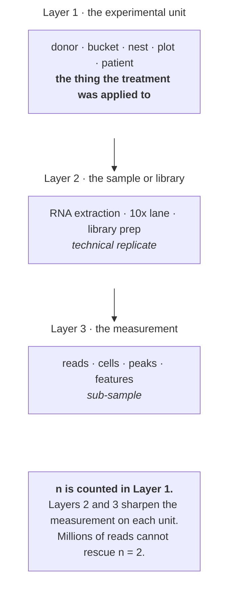

---

## 📄 Paper 1 · 245,878 cells, 48 replicates — single-cell islet transcriptomes

**Human islet single-cell atlas (2026)** [@islet2026], in *The EMBO Journal*. The clearest statement
of the unit problem in a single-cell paper that you are likely to read.

**Source audit:** [Open full text](https://pmc.ncbi.nlm.nih.gov/articles/PMC13226668/). Record the section or figure supporting each design claim before reading the interpretation.

### What the methods say

> The study profiled "245,878 human islet cells from **48 donors** spanning non-diabetic,
> pre-diabetic, and T2D states" — "**17** with diagnosed type 2 diabetes (T2D ...), **14** with
> HbA1c-based prediabetes (PD; HbA1c 5.7%-6.4% ...), and **17** without diabetes" — and identified
> "14 distinct cell types detected in **every donor**". Material was screened before entry: "Only
> donor islet samples with reported purity ≥80% (median = 90%; range = 80–98%) and viability >90%
> were accepted for inclusion in this study." Then "12,000 cells from each suspension were loaded
> onto one lane of a 10x Genomics Chip G".
>
> The analysis section is the part to read twice:
>
> > "We considered that the single cells within an islet **are not independent of each other** and
> > estimated the transcriptomic differences across cell types and glycemic states at the
> > **pseudo-bulk** level, where **the islets served as the biological replicates**."
>
> "Each model was adjusted for **sequencing chemistry, sex, ethnicity, scaled age, and scaled BMI**",
> and "only the genes expressed in more than 20 islets were processed". The validation imaging was
> handled the same way: "ND and T2D islet sections were processed in parallel and imaged the same day
> to minimize batch effects", with "all imaging parameters — including laser power, detector gain, and
> exposure settings — kept constant between ND and T2D islet samples".
>
> Result: "746 T2D β-cell DEGs at FDR < 5%, with **511** showing >1.5-fold expression changes" — but
> in the other endocrine cell types, "only **three** α-, **two** δ-, and **six** γ-cell-specific DEGs".

### The design, drawn

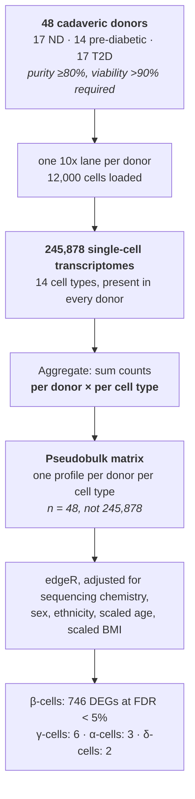

### Reading it

Compare with the course interpretation after completing your audit

- **The sentence that does the work.** "Single cells within an islet are not independent of each
  other." Treating 245,878 cells as 245,878 observations would give *p*-values computed on a sample
  size that ignores within-donor dependence. The resulting precision error depends on that dependence, not simply on the cells-to-donors ratio. Nothing about droplet chemistry makes cells from one
  donor into independent replicates of the *disease state* — they share a genome, an HbA1c, a cause
  of death and a shipping box ([Ch. 3](../../chapters/03-experimental-unit-and-replication.md)).
- **Aggregating is not discarding.** The 245,878 cells are still doing something essential: they let
  each donor's β-cell profile be estimated precisely, and they let β-cells be *separated from* α-,
  δ- and γ-cells in the first place. Sub-samples buy resolution and precision per unit. They do not
  buy units.
- **This is an observational study, and the covariate list admits it.** Nobody randomized donors to
  type 2 diabetes. So the design cannot balance age, BMI, sex and ancestry — it can only measure
  them and adjust. Note that **sequencing chemistry** is in the same list: a batch variable handled
  by adjustment because it could not be handled by randomization
  ([Ch. 4](../../chapters/04-randomization-and-blinding.md),
  [Ch. 5](../../chapters/05-blocking-and-batches.md)).
- **The asymmetry in the results is a power statement.** 746 DEGs in β-cells and two in δ-cells does
  not mean δ-cells are unaffected. β-cells are abundant in every donor, so their pseudobulk profiles
  are precise; δ-cells are rare, so each donor's δ-cell profile is noisy. Same 48 donors, very
  different effective precision ([Ch. 8](../../chapters/08-sample-size-and-power.md)).
- **Standardization and blinding are separate safeguards.** Fixed imaging settings and parallel processing reduce avoidable measurement variation. They do not establish blinding: that requires masking disease status from the operator or scorer. These methods describe standardization; they do not rule out every microscope or observer effect.

▶ Why pseudobulk, rather than a mixed model over cells

Both answers can be defensible. A mixed model with a random effect for donor also acknowledges that
cells are nested inside donors, and it keeps cell-level information that aggregation discards. What
it must not do is fit a model with **no** donor term — that is the version that treats cells as
replicates and produces spectacular, meaningless *p*-values.

Pseudobulk makes the replication level explicit: each cell type contributes one count profile per
donor, usually stored as a column in a gene-by-sample matrix. It still needs appropriate normalization,
covariates, contrasts and checks for sparse cell types. Neither pseudobulk nor a cell-level mixed model
is universally more efficient; performance depends on the data and the model. Aggregation does not
make a poorly specified analysis safe
([Ch. 3](../../chapters/03-experimental-unit-and-replication.md)).

---

## 📄 Paper 2 · A dose range, three buckets, and correct pooling — salinity stress in fish embryos

**Pond smelt salinity study (2026)** [@smelt2026], in *Animals*. A small design that gets the
hardest part right.

**Source audit:** [Open full text](https://pmc.ncbi.nlm.nih.gov/articles/PMC13603883/). Record the section or figure supporting each design claim before reading the interpretation.

### What the methods say

> "Four salinity treatment levels were prepared by dissolving artificial sea salt in river water:
> freshwater control (0‰, designated S1), 7‰ (S2), 14‰ (S3), and 21‰ (S4)." Two more were set up but
> not sequenced: "Two additional salinity treatments, 28‰ (S5) and 35‰ (S6), were also established;
> these groups were used **solely to observe hatching rates to determine the upper salinity tolerance
> limit** and were not subjected to transcriptome sequencing analysis."
>
> The replication is stated unambiguously:
>
> > "**Each salinity group comprised three replicate buckets** (i.e., three biological replicates,
> > n = 3). ... On day 7 of stress treatment, for transcriptome sequencing, **30 surviving embryos** at
> > a consistent developmental stage were **randomly selected from each bucket** (i.e., each
> > biological replicate) and **pooled as one RNA-seq sample**. Thus, each salinity group had three
> > RNA-seq biological replicates (n = 3), totaling **12 sequencing samples**."
>
> Each bucket held "approximately 300–500 eggs". Hatching rates fell from "(80.1 ± 1.7)%" in
> freshwater to "(74.5 ± 4.1)%" at 7‰, "(48.3 ± 4.5)%" at 14‰ and "(40.3±6.1)% at 21‰", and
> "hatching failed completely at 28‰ and above", placing "the upper salinity tolerance limit for pond
> smelt embryos ... between 21‰ and 28‰".

### The design, drawn

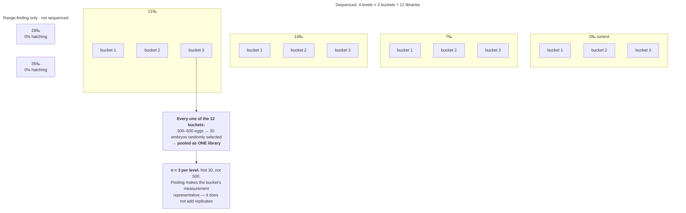

### Reading it

Compare with the course interpretation after completing your audit

- **The pooling is the right move, and it is easy to misread.** Thirty embryos go into one library.
  A careless reader sees "30" and thinks the sample size grew; a cynical reader sees "pooled" and
  thinks information was thrown away. Both are wrong. The salinity was applied to the **bucket**, so
  the bucket is the unit. Pooling 30 embryos makes that one measurement a good estimate of the
  bucket's average response instead of one embryo's idiosyncrasy. Three buckets per level means
  *n* = 3 — modest, honestly stated, and correct
  ([Ch. 3](../../chapters/03-experimental-unit-and-replication.md)).
- **What the failed doses contribute.** 28‰ and 35‰ produced no hatching and no sequencing data. They
  are not wasted: they convert "21‰ is stressful" into "the limit lies between 21‰ and 28‰". A
  dose–response design needs levels that bracket the response, including at least one that
  overwhelms the system ([Ch. 7](../../chapters/07-treatment-structures.md)).
- **The level spacing is deliberate.** 0, 7, 14, 21 is an even arithmetic ladder across the range the
  embryos survive — and the hatching rates (80%, 75%, 48%, 40%) show it caught the steep part of the
  curve rather than two flat ends.
- **Where the design is thin.** With *n* = 3 the transcriptomic comparison has little power for
  individual genes, which is why its conclusions are framed as broad programmes (global suppression
  at moderate salinity, an active stress programme at 21‰) rather than single-gene claims. Also, each
  bucket is a bucket: temperature, light and position in the room are not reported as randomized or
  blocked, so bucket-to-bucket variation and position are entangled.

▶ Pooling, sub-sampling and when each is right

| Situation | Right move |
|---|---|
| Many individuals per unit, one measurement affordable | **Pool** within unit; one library per unit |
| Many individuals per unit, variation *within* unit is the question | Measure individuals separately, model them as nested |
| One individual per unit, measurement is noisy | **Technical replicates**, averaged before analysis |
| Treatment applied to each individual | The individual *is* the unit; do not pool |

The error to avoid is pooling across units — combining embryos from all three buckets into one
library would reduce *n* from 3 to 1 while looking like a bigger experiment.

---

## 📄 Paper 3 · An incomplete factorial, replicated across nests — fire ant thermal acclimation

**Fire ant acclimation study (2026)** [@fireant2026], in *Insects*. A 63-library RNA-seq experiment
whose design can be written on one line.

**Source audit:** [Open full text](https://pmc.ncbi.nlm.nih.gov/articles/PMC13607662/). Record the section or figure supporting each design claim before reading the interpretation.

### What the methods say

> "**Five medium-sized nests** (designated nests 1–5) ... were chosen for collection", and
> "workers from different nests were kept in **separate containers** for subsequent treatments".
> Workers were sorted into large, medium and small size classes and acclimated at "9 °C for 2.5 h per
> day (cold acclimation) or 30 °C for 2.5 h per day (heat acclimation) over 15 successive days".
>
> For the survival assay: "**Each treatment for each body size included three biological replicates
> (n = 3), with each replicate originating from an independent nest** (randomly selected from the five
> nests). Thirty ants were used per replicate." And "each collected ant was **randomly assigned** to
> one of four temperature treatments (−1 °C, 1 °C, 35 °C, and 37 °C) for 2 h".
>
> For the sequencing:
>
> > "Thirty ants constituted one replicate for each body size category, and **three replicates derived
> > from three independent nests** were prepared per size group. Therefore, a total of **63 samples**
> > were obtained, i.e., **7 treatments** (cold-acclimated ants without cold stress, cold-acclimated
> > ants plus cold stress, heat-acclimated ants without heat stress, heat-acclimated ants plus heat
> > stress, control ants without stress, control ants plus cold stress, and control ants plus heat
> > stress) **× 3 body sizes × 3 replicates**."
>
> Analysis: "Two-way ANOVAs using the general linear model (GLM) were conducted to analyze the
> effects of acclimation (two levels) and body size (three levels) on ant mortality under stress.
> When significant differences were observed for both the overall model and the **acclimation × size
> interaction**, simple effects analyses ... were performed". For the libraries, "PCA showed that
> biological replicates clustered together ... and Pearson's correlation coefficient showed higher
> correlations between biological replicates but lower correlations between treatments". Eighteen
> genes were chosen for qPCR confirmation — "**12 DEGs and 6 non-DEGs**".

### The design, drawn

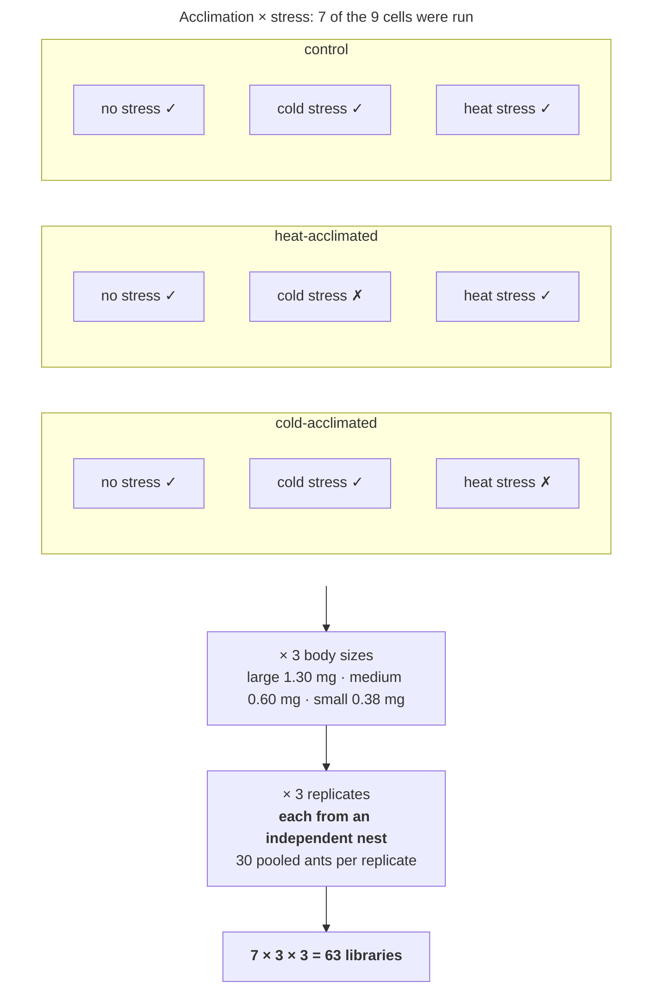

### Reading it

Compare with the course interpretation after completing your audit

- **The replicate is a nest, not an ant.** Thirty ants are pooled per library, and the three
  libraries per group come from three *different* nests. This is the single most important choice in
  the paper. Ants from one nest are siblings sharing a queen, a microclimate and a rearing container;
  three libraries from one nest would be three measurements of one colony. By spreading replicates
  across nests, "the effect of acclimation" becomes a claim about fire ants rather than about nest 3
  ([Ch. 3](../../chapters/03-experimental-unit-and-replication.md)).
- **The factorial is deliberately incomplete.** Three acclimations × three stress exposures would be
  nine cells; seven were run. The two dropped cells are cold-acclimated-then-heat-stressed and
  heat-acclimated-then-cold-stressed — the cross-combinations that answer no question anyone asked.
  Dropping them saves 18 libraries. The cost is that you cannot test whether cold acclimation
  protects against *heat*, so that interaction is simply unavailable
  ([Ch. 7](../../chapters/07-treatment-structures.md)).
- **The interaction is the point, and the analysis tests it.** Whether acclimation helps *more in
  small ants than large ones* is an acclimation × size interaction, and the paper tests the
  interaction before interpreting simple effects. That is the right order: a main effect averaged
  over body sizes would hide exactly the result the study is about.
- **Non-DEGs in the qPCR panel.** Including six genes not called differentially expressed broadens validation beyond the 12 hits. A non-significant RNA-seq result does not establish unchanged expression, so these are non-hits rather than known null controls. Compare effect estimates and uncertainty across assays; agreement about significance alone is weak validation.
- **The PCA is a design check, not a result.** "Higher correlations between biological replicates
  but lower correlations between treatments" is the pattern you need before any differential
  expression is believable: within-group variation smaller than between-group variation. If
  replicates had scattered more than treatments, the design — not the statistics — would be the
  problem.

---

## 📄 Paper 4 · Validating a measurement, not a hypothesis — short-read vs long-read RNA editing

**RNA editing quantification study (2026)** [@editing2026], in *Advanced Biotechnology*. This paper's
question is not about biology; it is about whether an instrument is telling the truth. The design is a
ladder of controls.

**Source audit:** [Open full text](https://pmc.ncbi.nlm.nih.gov/articles/PMC13391985/). Record the section or figure supporting each design claim before reading the interpretation.

### What the methods say

> "To address it, we performed **paired NGS and LRS cDNA RNA-seq of both HEK293T and U2OS cells**,
> revealing that the A-to-I editing levels were estimated to be lower by NGS compared with LRS, a
> conclusion that was **confirmed through full-length amplicon sequencing**."
>
> The study then adds control after control:
>
> - **Replication in a second cell line:** "To further validate the findings, we conducted additional
>   NGS and LRS RNA-seq using U2OS cells and re-evaluated the results ... LRS RNA-seq identified 2,228
>   A-to-I sites with significantly higher quantification, nearly **6.6 times more** than the NGS
>   polyA-selected RNA-seq."
> - **Negative control sites:** "the least A bases in the genome were defined **unedited A
>   candidates**. While numerous unedited A candidates exist, we **randomly extracted 3 million sites**
>   for the further A-to-I RNA editing level quantification using the same pipeline."
> - **An in-silico one-factor-at-a-time control:** "we **randomly extracted** the paired-end RNA-seq
>   data of 50, 75 and 100 nt **from the 150-nt** NGS polyA-selected RNA-seq of HEK293T cells", so that
>   read length changes and the RNA, the library and the lane do not.
> - **A stress test of the threshold:** "when raising the coverage from 30 ... to 40, 50 and 60 ...,
>   more significantly highly quantified A-to-I RNA editing sites by LRS were still observed ... with
>   fold changes ranging from **9.3 to 10.3**."
> - **Analytic sensitivity:** "There are three different alignment strategies: a) utilizing only
>   uniquely mapped hits; b) combining uniquely mapped hits with one of the multiply mapped hits that
>   has the highest mapping scores; c) employing both the uniquely mapped hits and all the multiply
>   mapped hits with the best mapping scores."
> - **A benchmark for "how big is big":** "the median fold differences in quantification between LRS
>   and NGS RNA-seq ... rang[e] from **1.8 to 2.5** ... In contrast, the differences observed between
>   NGS polyA-selected and rRNA-depleted RNA-seq are relatively lower, falling between **0.9 and 1.3**."

### The design, drawn

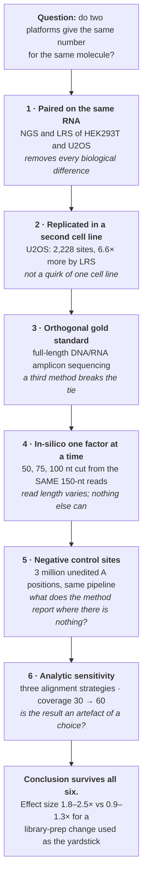

### Reading it

Compare with the course interpretation after completing your audit

- **A paired design is the whole trick.** The same extracted RNA goes to both platforms. Any
  difference in the output therefore cannot be donor, passage number, culture day or treatment,
  because those are identical by construction. This is a crossover applied to instruments instead of
  patients, and it is why the comparison needs no randomization
  ([Ch. 15](../../chapters/15-measurement-and-benchmarking.md)).
- **The in-silico control is the most elegant step.** Comparing a 150-nt run with a separate 50-nt run
  would confound read length with library, flow cell and run date. Cutting 50-nt reads *out of* the
  150-nt data leaves exactly one thing different. If you can simulate a treatment by subsetting your
  own data, you get a perfectly matched control for free
  ([Ch. 6](../../chapters/06-controls-and-comparators.md)).
- **Negative controls in a bioinformatics pipeline.** Three million genomic A positions that should
  show no editing are pushed through the identical pipeline. Whatever "editing" comes back out is the
  method's false-positive floor. Every pipeline that calls variants, peaks, sites or interactions
  should have such a set, and most published ones do not.
- **"How big is big" needs a yardstick.** A 1.8–2.5-fold difference means little in isolation. Set
  against the 0.9–1.3-fold difference produced by swapping polyA selection for rRNA depletion — a
  change nobody considers a biological effect — it becomes interpretable. Choosing a known-small
  contrast as a reference scale is a reporting habit worth copying
  ([Ch. 15](../../chapters/15-measurement-and-benchmarking.md)).
- **The result is a warning about every other paper in this module.** If editing levels depend on read
  length, then a meta-analysis pooling studies with 50-nt and 150-nt reads has platform as a
  confounder of anything correlated with study year. Measurement validation is not a side quest; it
  decides whether the primary literature can be compared at all.

---

## 📄 Paper 5 · Where the split goes — a prediction-model protocol

**Angina prediction-model protocol (2026)** [@anoca2026], in *BMJ Open*. The odd one out: a
**protocol**, written before the analysis, which is exactly why its design is legible.

**Source audit:** [Open full text](https://pmc.ncbi.nlm.nih.gov/articles/PMC13064170/). Record the section or figure supporting each design claim before reading the interpretation.

### What the methods say

> "We will develop and **cross-site validate** ML classification models using a multicentre
> retrospective cohort", expected to include "approximately N≈60 000 eligible adults" across five
> hospital sites.
>
> > "Model development will use **nested cross-validation** with stratified k-fold inner-loop tuning
> > and **leave-one-site-out cross-validation** for repeated external validation."
>
> Concretely: "**LOSO-CV involves training models using data from four of the five included hospital
> sites and externally validating the best-performing model on data from the remaining site. This is
> repeated five times** so that each hospital site serves as the extern[al validation set]". The inner
> loop "is used to perform **feature selection, hyperparameter tuning, threshold tuning and model
> selection**" — and crucially, "**for each training set in the outer CV loop**, the dimension of the
> feature set will be further reduced using random-forest-based Boruta and Least Absolute Shrinkage
> and Selection Operator (LASSO) penalised logistic regression".
>
> The protocol states its own limits: the approach "yields unbiased performance estimates and repeated
> site-level external validation", but "reliance on routinely collected records necessitates extensive
> imputations and **may introduce site-specific measurement bias** despite harmonised variable
> definitions", and since "all participating centres share similar referral pathways and care
> protocols ... **model transportability** to health systems with markedly different diagnostic
> practices remains to be confirmed".

### The design, drawn

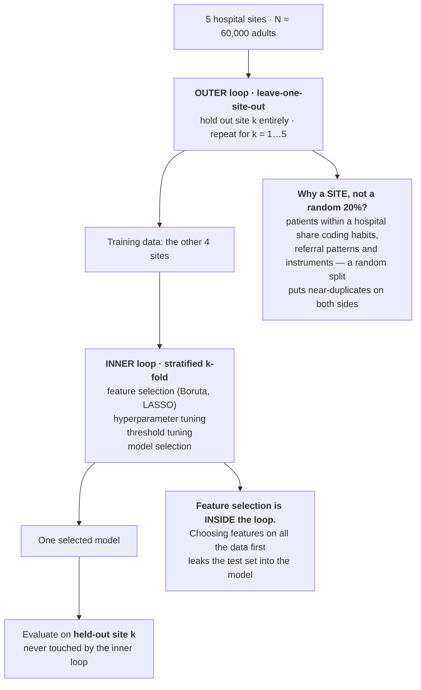

### Reading it

Compare with the course interpretation after completing your audit

- **The held-out unit is a hospital, and that is the design decision.** A random 80:20 split of 60,000
  patients would put patients from the same site, coded by the same clerks, measured on the same
  analysers, on both sides of the split. The model would then be rewarded for learning site
  idiosyncrasies, and the reported accuracy would be a within-site accuracy dressed up as
  generalization. Leaving out a whole site asks the question a clinician actually has: *will this work
  in my hospital?* This is the data-split problem from
  [Ch. 12](../../chapters/12-predictive-studies.md), where the split has to respect the clustering.
- **"Inside the loop" is the entire anti-leakage rule.** Feature selection, threshold choice and
  hyperparameter tuning all look at outcomes. Done once on the full dataset and then "validated" on a
  held-out slice, they have already consumed the held-out slice's information, and the validation
  estimate is optimistic. The protocol's phrase — "for each training set in the outer CV loop" —
  commits to redoing selection five times from scratch. The parallel with
  [Ch. 25](../../chapters/25-preregistration-and-reporting.md) is exact: an analysis choice made after
  seeing the outcome is not a free choice.
- **Five validation sites give five estimates, not one.** The spread across sites is itself the
  result. A model scoring 0.84, 0.83, 0.82, 0.81 and 0.60 is a different object from one scoring 0.78
  five times, even though both average about 0.78 — and only the per-site breakdown reveals it.
- **Being a protocol is the point.** Published before the data were analysed, it can be checked
  against the eventual paper. A retrospective cohort offers effectively unlimited analytic freedom:
  which outcome, which window, which imputation, which threshold. Writing those down in advance is
  the only mechanism that distinguishes a prediction from a description
  ([Ch. 25](../../chapters/25-preregistration-and-reporting.md)).
- **What it cannot fix, and says so.** Imputation of routinely collected records can carry
  site-specific measurement bias into the model, and five hospitals that share referral pathways are
  a narrow slice of the world. The protocol names both. Neither is a flaw in the design; both are
  limits of what *any* design on this data source could support.

▶ A checklist for reading any prediction-model paper

| Ask | Good answer |
|---|---|
| What is the unit of the split? | Patient, site, time period — matched to the intended use |
| When was feature selection done? | Separately inside every training fold |
| When was the threshold chosen? | Inside the loop, on training data only |
| Is there a single external set? | Preferably several, reported separately |
| Are all predictors available at prediction time? | No post-outcome variables among the predictors |
| How much was imputed? | Stated, with the mechanism assumed |

The failure mode these guard against has one name — **leakage** — and many disguises. It is almost
always a unit-of-analysis error: information crossed a boundary the design was supposed to seal.

---

## 📄 Paper 6 · Three kinds of ground truth, 42 laboratories, 207 pipelines

**Quartet and MAQC benchmarking study (2026)** [@quartet2026], in *Nature Communications*. The largest
and most carefully grounded benchmark in this sub-course.

**Source audit:** [Open full text](https://pmc.ncbi.nlm.nih.gov/articles/PMC13547381/). Record the section or figure supporting each design claim before reading the interpretation.

### What the methods say

> The problem with earlier benchmarks is a design problem: "**Owing to the lack of ground truths**, most
> focused on **evaluating consistency across sequencing platforms or analysis tools**", and such
> "consistency-based analyses have been **unable to clearly reflect the overall accuracy**". Benchmarking
> on artificial material has its own limit: "benchmarking using **spike-ins or simulated data, which are
> far less complex than**" real transcriptomes.
>
> The materials are a family and a mixture series:
>
> > "**Certified Quartet RNA reference materials** derived from immortalized cell lines of a Chinese
> > Quartet, including the **father (F7), mother (M8), and monozygotic twin daughters (D5 and D6)**, as
> > well as the **MAQC reference materials** ... **Samples M8 and D6 were mixed at 3:1 and 1:3 ratios to
> > create samples T1 and T2**, respectively. **Each sample was prepared with three replicates.** The
> > reference samples were tested in **42 laboratories with distinct protocols** and analyzed with **207
> > combined bioinformatics pipelines**."
>
> Three independent truths are built in:
>
> > "This sample design incorporated **three types of ground truth** ..., including the **Quartet
> > reference datasets**, **RT-qPCR-validated reference datasets**, and the **built-in truth based on the
> > known mixing ratios**."
>
> Each is justified: the Quartet references "were generated by integrating **seven lrRNA-seq batches and
> four analysis pipelines, minimizing biases from individual libraries, platforms, and tools**";
> "**Orthogonal validation of 121 isoforms and 59 events using RT-qPCR** demonstrated high concordance
> ..., with Pearson correlation coefficients (PCC) of **0.95 and 0.76**"; and "the **known mixing ratios
> between samples T1 and T2 were used as built-in truth**."
>
> The first result is about laboratories, not biology: "For isoform quantification, **substantial
> inter-laboratory variation was observed**, with PCA analysis indicating that **inter-laboratory
> differences often obscured biological signals**."

### The design, drawn

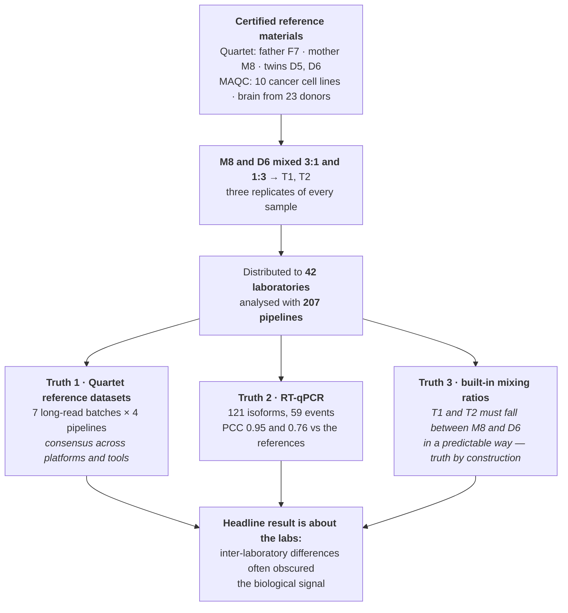

### Reading it

Compare with the course interpretation after completing your audit

- **Three independent truths, each weak in a different way.** The long-read consensus could inherit a
  shared long-read bias; RT-qPCR is accurate but covers only 180 features; the mixing ratios are exact
  but only constrain relative abundance. Agreement across all three is far stronger than any one, and
  the design deliberately avoids resting on a single standard
  ([Ch. 15](../../chapters/15-measurement-and-benchmarking.md)).
- **The mixing design creates truth without a reference method at all.** If T1 is three parts M8 to one
  part D6, then every transcript's abundance in T1 is determined by its abundance in M8 and D6. Any
  pipeline that gets M8 and D6 right but T1 wrong has an internal inconsistency — and this holds for
  the *whole* transcriptome, not just the features someone validated. Building a known relationship
  into your samples is the cheapest ground truth available
  ([Ch. 6](../../chapters/06-controls-and-comparators.md)).
- **Monozygotic twins are a genetic control.** D5 and D6 are closely matched genetically, but their RNA profiles can contain real biological differences. Monozygotic twins are not an expression-null control. Technical replicates of the same RNA material address technical variation; distinct donors address biological variation. The [original Quartet RNA study](https://www.nature.com/articles/s41587-023-01867-9) demonstrates reproducible differences between the twin-derived materials.
- **"Inter-laboratory differences often obscured biological signals" is the sentence to remember.**
  Every single-laboratory study in this module implicitly assumes its own measurements are the stable
  part. Here, across 42 labs, the laboratory was often a bigger source of variance than the biology —
  which is the quantitative case for randomizing samples across batches, as
  [Module 5's puffin study](05-ecology-and-microbiome.md) does
  ([Ch. 5](../../chapters/05-blocking-and-batches.md)).
- **Three replicates per sample is what makes the variance decomposable.** Without replicates there
  would be no way to separate within-laboratory noise from between-laboratory differences.

---

## 📄 Paper 7 · An upstream choice that propagates — assembly before quantification

**Transcriptome assembly impact study (2026)** [@assembly2026], in *Briefings in Bioinformatics*.

**Source audit:** [Open full text](https://pmc.ncbi.nlm.nih.gov/articles/PMC13215593/). Record the section or figure supporting each design claim before reading the interpretation.

### What the methods say

> The structural observation is the whole paper: "**As transcriptome assembly precedes quantification,
> its results inevitably influence the outcomes of quantification.**"
>
> The gap being addressed is how assembly is normally judged: "Current assembly evaluation relies
> primarily on metrics like **precision, recall, and F1-score, assessing reconstruction accuracy in
> isolation**. Crucially, the **propagation of assembly errors into downstream quantification fidelity
> remains poorly characterized.**"
>
> So the evaluation criterion is changed:
>
> > "We address this gap by introducing a **downstream-centric evaluation framework** ... We posit that
> > the performance of assembly algorithms **should be judged by its impact on the accuracy and
> > robustness of subsequent expression quantification**."
>
> The comparison is factorial across the pipeline: "Transcriptome assembly was performed using
> **StringTie2, Scallop, and Cufflinks**, followed by transcri[pt quantification]", with both kinds of
> input: "**Simulated RNA-seq data were generated using RSEM, while real RNA-seq datasets were aligned
> to the reference genome using HISAT2.**"
>
> And the metrics are chosen for the data's shape: "those results are **high-dimensional sparse
> vectors**, so we chose **Spearman correlation, Pearson's correlation, the root mean square error, and
> mean absolute error** as an evaluating indicator."

### The design, drawn

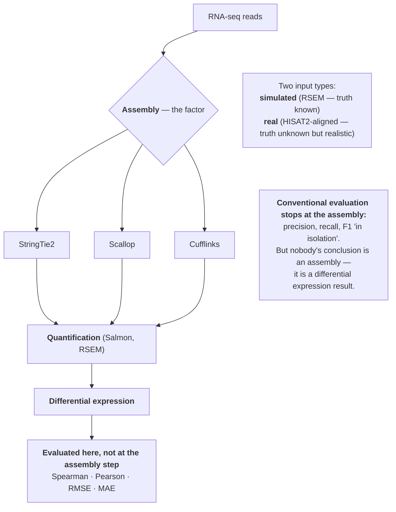

### Reading it

Compare with the course interpretation after completing your audit

- **The choice of evaluation endpoint is itself a design decision.** Scoring an assembler on
  reconstruction F1 answers "did it rebuild the transcripts?". Scoring it on downstream quantification
  answers "did it change my answer?". These can diverge: an assembler that misses rare isoforms may
  score poorly on recall yet barely perturb expression estimates. Choose the endpoint that matches the
  decision you will make ([Ch. 2](../../chapters/02-start-with-the-question.md)).
- **This is the analytic-flexibility problem, measured.** [Module 6](06-neuroscience.md)'s review found
  96.3% of brain-behaviour studies reporting something significant from a literature with low power,
  and attributed the gap partly to analytic freedom. Here one such freedom — which assembler — is
  isolated and its downstream effect quantified. That turns "researcher degrees of freedom" from a
  worry into a measurement ([Ch. 25](../../chapters/25-preregistration-and-reporting.md)).
- **Simulated and real data play different roles.** Simulation supplies known truth but is simpler than
  reality; real data is realistic but has no truth. Running both and asking whether conclusions agree
  is the standard move — and the honest caveat is the one
  Paper 6 makes: simulated data is "far less complex" than real material
  ([Ch. 15](../../chapters/15-measurement-and-benchmarking.md)).
- **Metrics chosen for the shape of the data.** Expression vectors are high-dimensional and sparse, so
  a single correlation would be dominated by the many zeros. Reporting rank correlation, linear
  correlation and two error magnitudes together guards against any one summary flattering a method
  ([Ch. 9](../../chapters/09-descriptive-studies.md)).

---

## 📄 Paper 8 · Who should evaluate a method? — an independent benchmark

**Long-read single-cell tool benchmark (2026)** [@lrbench2026], in *NAR Genomics and Bioinformatics*.

**Source audit:** [Open full text](https://pmc.ncbi.nlm.nih.gov/articles/PMC13335474/). Record the section or figure supporting each design claim before reading the interpretation.

### What the methods say

> The motivation is stated with unusual directness:
>
> > "Notably, **bioinformatics software publications often present overly optimistic self-assessments**.
> > Thus, independ[ent benchmarking is needed]"
>
> The scope is defined before the comparison: "we focused on Nanopore sequencing platforms to
> **systematically benchmark state-of-the-art computational tools for single-cell and spatial long-read
> transcriptomics across four essential analytical dimensions**. First, we assessed the **number of
> detected UMIs and genes by comparing long-read approaches agai**[nst matched short-read data]".
>
> Simulation is anchored to real data rather than invented: "**Simulated scRNA-seq long-read data were
> obtained with AsaruSim** ..., which simulates Nanopore datasets, **closely mimicking real experimental
> data**. It **takes as input an isoform-by-cell count matrix to simulate reads. Using the real matrix as
> input therefore ensures that the transcriptomic profile of each cell is**" preserved.

### The design, drawn

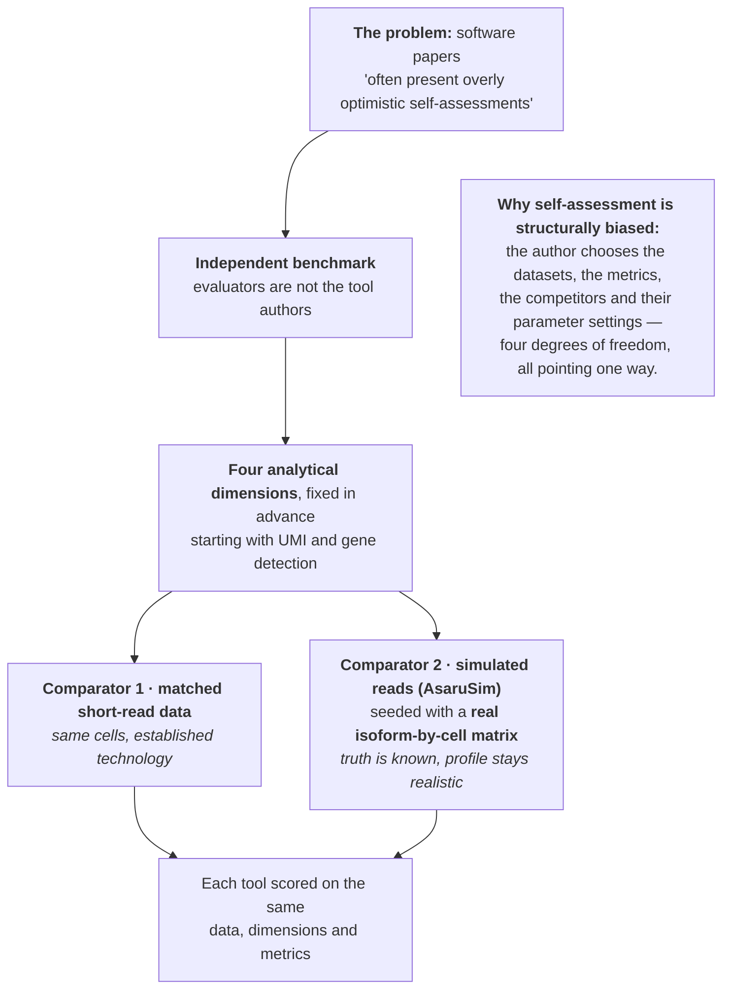

### Reading it

Compare with the course interpretation after completing your audit

- **Who runs the comparison is part of the design.** A method's authors choose the benchmark datasets,
  the metrics, which competitors to include and how hard to tune them. None of that requires bad faith
  to produce a favourable result. An independent benchmark with pre-fixed dimensions removes four
  degrees of freedom at once ([Ch. 15](../../chapters/15-measurement-and-benchmarking.md)).
- **Seeding the simulation with a real count matrix is the elegant part.** Pure simulation produces data
  whose structure the simulator's author chose, which can accidentally favour methods built on the same
  assumptions. Starting from an observed isoform-by-cell matrix keeps the biological structure real
  while making the truth known — the same instinct as Paper 4's in-silico
  read truncation earlier in this module
  ([Ch. 6](../../chapters/06-controls-and-comparators.md)).
- **Matched short-read data is an orthogonal comparator, not a gold standard.** Short reads detect genes
  reliably and isoforms poorly, so agreement on gene counts is reassuring while disagreement on isoforms
  is uninformative about which is right. Knowing what each comparator can and cannot adjudicate is
  essential to reading any benchmark.
- **Declaring the dimensions in advance is a preregistration in miniature.** Four analytical dimensions,
  fixed before the results are seen, prevents the benchmark from being summarized by whichever metric
  produced the cleanest ranking ([Ch. 25](../../chapters/25-preregistration-and-reporting.md)).

---

## 📄 Paper 9 · Randomizing samples across plexes, with a bridge — a cross-species atlas

**Multi-species transcriptome and proteome maps (2026)** [@plexmaps2026], in *Scientific Data*.

**Source audit:** [Open full text](https://pmc.ncbi.nlm.nih.gov/articles/PMC13482810/). Record the section or figure supporting each design claim before reading the interpretation.

### What the methods say

> Tissues came from six strains and species: "Tissue samples from pre-clinical animals (**minipigs,
> cynomolgus monkeys, beagle dogs, Wistar Han rats, CD1 and C57BL6 mouse**) were collected at Charles
> River Labs".
>
> The proteomic batch design is the part to copy:
>
> > "In this study, we used **TMT11plex** which can label up to 11 samples in one experiment. **We
> > randomized tissue samples so that each TMT11plex consists of an assortment of tissues.** To
> > facilitate cross-tissue comparison and reduce the technical variation among mass-spectrometry runs,
> > a **bridge channel containing pooled reference samples created from all tissues within a species was
> > added into each TMT11plex experiment** ... **TMT131C was used for the same reference sample in each
> > run.**"
>
> The bridge is physically constructed from the samples themselves: "The species-wide shared bridge was
> created by **removing ~5-10% of all tissues' peptides into a separate single mix** that was TMT labeled
> with 131C and **shared across all 4 TMT plexes (per species)**."
>
> Scale and use: "For each species, we designed **four batches of TMT11plex runs** ... In total, from
> **32 TMT batches**, we acquired data from **277 samples**", and in analysis "**Protein normalization
> using bridge channel was applied**".

### The design, drawn

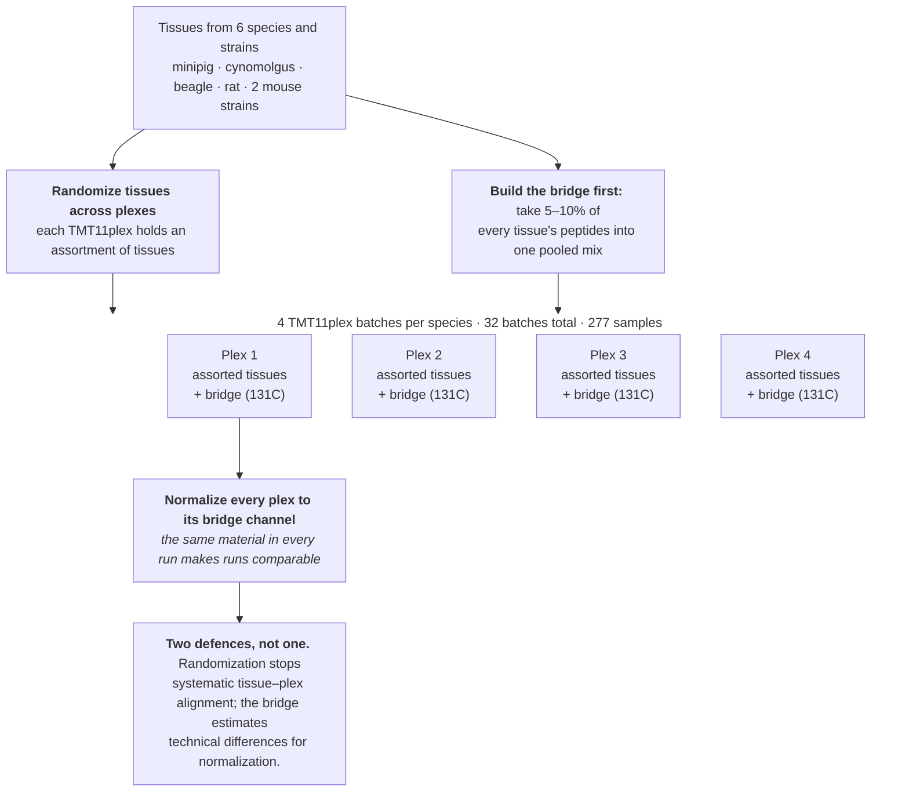

### Reading it

Compare with the course interpretation after completing your audit

- **A TMT plex is a batch, and batches need designing.** Eleven channels per run means samples must be
  grouped. Grouping by tissue — all livers in one plex — would make tissue and run the same variable,
  and no normalization could separate them afterwards. Randomizing an assortment into each plex is the
  same move [Module 5's puffin study](05-ecology-and-microbiome.md) makes with DNA extraction batches
  ([Ch. 5](../../chapters/05-blocking-and-batches.md)).
- **The bridge channel is a designed internal standard.** The same pooled material in channel 131C of each plex provides a common reference for normalization. Its measured differences reflect technical variation, including run effects and measurement error. Correction depends on the normalization model and does not guarantee removal of every batch effect.
- **Making the bridge from the samples themselves is deliberate.** Pooling aliquots from every tissue increases reference coverage of the study proteome. Rare or tissue-specific peptides can still fall below detection after dilution, so shared material does not guarantee a usable reference for every peptide.
- **Randomization *and* normalization, in that order.** As in Module 5, adjusting for batch only works
  when batch is not confounded with the factor of interest. Randomizing first is what makes the bridge
  correction a refinement rather than a rescue
  ([Ch. 4](../../chapters/04-randomization-and-blinding.md)).

---

## 📄 Paper 10 · Discover in one tissue, recover in another — spatial ecotypes

**Spatial ecotype profiling study (2026)** [@spatial2026], in *Nature*.

**Source audit:** [Open full text](https://pmc.ncbi.nlm.nih.gov/articles/PMC13293879/). Record the section or figure supporting each design claim before reading the interpretation.

### What the methods say

> The design is two-stage, and the stages use different material: "**Top: discovery and clinical
> characterization of spatially colocalized cell states in human tumours (SEs). Bottom: recovery of SEs
> in plasma cell-free DNA** and the use of **non-invasive SE profiling for immunotherapy response
> assessment.**"
>
> The barriers being designed around are stated: "**Two main factors currently hinder** the
> identification and clinical application of spatially resolved ecotypes in cancer. First, SEs are
> challenging to profile using existing methods, which are either **limited in breadth to a modest
> number of predefined markers** (for example, multiplexed protein imaging), **ignore sp**[atial
> information]".
>
> The framework must therefore work across two very different data types: "Our approach combines data
> fusion, statistical learning and deep learning to overcome critical barriers in **both the detection
> and the recovery of SEs across genomic platforms and bodily compartments**."
>
> The claim is explicitly about transfer: "tumour microenvironments can be decomposed into **spatially
> organized multicellular ecosystems, termed spatial ecotypes, that can be accessed non-invasively via
> liquid biopsy** and used to profile individual cancers and target treatments."

### The design, drawn

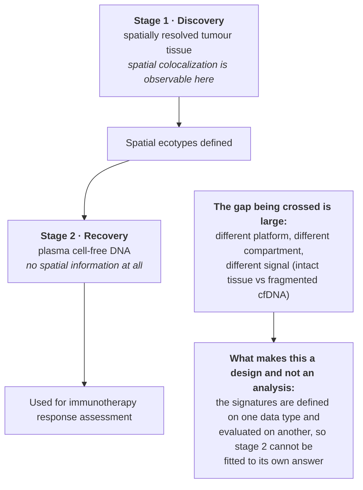

### Reading it

Compare with the course interpretation after completing your audit

- **Defining features on one data type and testing them on another is the strongest form of
  validation available here.** The spatial ecotypes are derived where spatial information exists, then
  asked to appear in plasma where it does not. Because stage 2's data played no part in defining the
  signatures, this is a genuine held-out test — the same principle as
  Paper 5's leave-one-site-out validation, applied across compartments rather than sites
  ([Ch. 12](../../chapters/12-predictive-studies.md)).
- **The transfer is the hypothesis, not a convenience.** A paper that discovered signatures in tissue
  and then reported their tissue performance would be reporting a fit. Requiring them to survive a
  change of platform and compartment is a much harder test, and failing it would have been informative
  ([Ch. 15](../../chapters/15-measurement-and-benchmarking.md)).
- **What a reader should check in any two-stage design like this.** Were the discovery and recovery
  cohorts independent — no patient in both? Were the signatures frozen before stage 2, or tuned on it?
  Is the clinical endpoint in stage 2 measured the same way as in stage 1? These are the questions that
  decide whether "recovery" is validation or re-fitting
  ([Ch. 25](../../chapters/25-preregistration-and-reporting.md)).
- **Why the spatial information matters at all.** The paper's stated objection to existing methods is
  that they either use few predefined markers or ignore spatial arrangement. Colocalization is the
  variable being measured, so a design that collapses tissue to an average would destroy exactly the
  signal under study — the same reason
  Paper 1's pseudobulk aggregation is appropriate there and would be wrong here
  ([Ch. 3](../../chapters/03-experimental-unit-and-replication.md)).

---

## Independent transfer task · Batch layout under a budget

You have samples from eight donors, two conditions per donor and two assay batches. Draw a layout preserving paired comparisons while distributing conditions across batches. Explain the role and limits of a shared reference, and identify the independent units for the condition contrast.

Use the [evidence worksheet and assessment criteria](README.md#evidence-worksheet).
Submit your diagram, source-backed reasoning and one remaining uncertainty before looking at the
sample answers. More than one redesign may be defensible; justify yours against the stated constraint.

---

## ⚠️ Common Misconceptions

| ❌ The misconception | ✅ What is actually true — and what to do |
|---|---|
| **"245,878 cells is a huge sample."** | It is 48 donors. Paper 1 aggregates to pseudobulk so the matrix has 48 rows, and says plainly that cells within an islet are not independent. |
| **"Aggregating single cells wastes the data."** | The cells still define cell types and make each donor's profile precise. They buy resolution per unit, not extra units. |
| **"Pooling samples reduces the sample size."** | Pooling *within* a unit is correct, as in Paper 2's 30 embryos per bucket. Pooling *across* units is what destroys replication. |
| **"More sequencing depth can rescue a small n."** | Depth reduces measurement error on each unit. Paper 1's two δ-cell DEGs versus 746 in β-cells is a precision-per-unit problem, not a depth problem. |
| **"A factorial has to be complete."** | Paper 3 ran 7 of 9 cells and saved 18 libraries. State which cells you dropped and which interaction you therefore cannot test. |
| **"A dose that kills everything is a failed treatment."** | Paper 2's 28‰ and 35‰ produced no sequencing data and still fixed the tolerance limit between 21‰ and 28‰. |
| **"Validation means confirming your hits."** | Paper 3 included 6 non-DEGs alongside 12 DEGs. Confirming only the positives cannot detect a method that calls everything significant. |
| **"If two platforms disagree, use the newer one."** | Paper 4 brings in a third, orthogonal method, a negative-control site set, and an in-silico control before choosing. |
| **"80:20 train-test is standard practice, so it is safe."** | It is safe only if the split matches the unit. Paper 5 holds out whole hospitals, because patients inside one hospital are correlated. |
| **"Feature selection is preprocessing, so it can happen first."** | Feature selection looks at outcomes. Doing it before the split leaks the test set; Paper 5 redoes it inside every outer fold. |
| **"Agreement between pipelines means they are accurate."** | Consistency is not accuracy — two tools can agree and both be wrong. Paper 6 uses three independent ground truths instead. |
| **"Simulated data is good enough for benchmarking."** | Paper 6 notes simulations are "far less complex" than real transcriptomes. Paper 8's answer is to seed the simulation with a real count matrix. |
| **"My measurements are the stable part of my study."** | Across 42 laboratories, Paper 6 found inter-laboratory differences often obscured the biological signal. |
| **"Assemblers should be judged on assembly accuracy."** | Paper 7 judges them by their effect on the quantification that follows, because nobody's conclusion is an assembly. |
| **"A method's own paper shows how well it performs."** | Paper 8 states the problem plainly: software papers "often present overly optimistic self-assessments". Authors choose the data, metrics, competitors and tuning. |
| **"Multiplexing saves money and costs nothing."** | A TMT plex is a batch. Paper 9 randomizes tissues across plexes *and* carries a shared bridge channel in every run. |
| **"A signature validated on held-out samples is validated."** | Paper 10 holds out a different compartment and platform entirely — tissue to plasma — which is a far harder test than a held-out slice of the same data. |

---

## ✅ Check Your Understanding

**⭐ Q1.** Paper 1 reports 245,878 cells and 48 donors. Which number enters the differential
expression model, and what do the other 245,830 observations buy?

**⭐⭐ Q2.** In Paper 2, 30 embryos were pooled per bucket. Explain why this does *not* make *n* = 30,
and describe the one change to the pooling that *would* reduce *n* to 1 per salinity level.

**⭐⭐ Q3.** Paper 3 ran 7 of the 9 acclimation × stress combinations. Name the two cells that were
dropped and the specific question that is consequently unanswerable.

**⭐⭐⭐ Q4.** Paper 4 generated 50-nt, 75-nt and 100-nt data by truncating its own 150-nt reads
instead of sequencing new short-read libraries. Name two confounders this removes, and one thing the
in-silico version cannot reproduce about a genuine 50-nt run.

**⭐⭐⭐ Q5.** A colleague reports a model with AUC 0.93 from a random 80:20 split of a five-hospital
dataset, with features selected by LASSO on the full dataset before splitting. Using Paper 5's
design, name the two separate errors and say which direction each pushes the reported AUC.

---

**⭐⭐ Q6.** Paper 6 mixed samples M8 and D6 at 3:1 and 1:3. Explain how this creates ground truth
without any reference method, and state one thing it can check that RT-qPCR validation of 121 isoforms
cannot.

**⭐⭐ Q7.** Paper 7 argues assemblers should be judged by their downstream effect rather than by
reconstruction F1. Give one concrete situation where the two criteria would rank two assemblers
differently.

**⭐⭐⭐ Q8.** Paper 9 both randomized tissues across TMT plexes and included a bridge channel. Explain
what each one fixes, and why doing only the bridge would be dangerous.

**⭐⭐⭐ Q9.** Paper 10 defines spatial ecotypes in tissue and recovers them in plasma cell-free DNA. List
three things you would need to confirm before accepting the plasma result as validation rather than
re-fitting.

---

## 📝 Sample Answers & Assessment

▶ Show sample answers

> **Q1:** *"Forty-eight — one pseudobulk profile per donor per cell type. The cells buy two things:
> they identify which cells are β-, α-, δ- or γ-cells so the comparison is made within a cell type at
> all, and they make each donor's per-cell-type profile precise. They do not add independent
> observations of the glycemic state, because cells from one donor share a genome, an HbA1c and a
> handling history."* — **Example answer.**

> **Q2:** *"The salinity was applied to the bucket, so the bucket is the experimental unit; the 30
> embryos are sub-samples of one unit, and pooling them makes the single library a good estimate of
> that bucket's average response. There were three buckets per level, so n = 3. Pooling embryos from
> all three buckets of a level into one library would drop n to 1 — the measurement would get even
> more stable while the design lost all ability to estimate between-unit variation, so no standard
> error could be computed."* — **Example answer.**

> **Q3:** *"Cold-acclimated ants given heat stress, and heat-acclimated ants given cold stress. The
> unanswerable question is whether acclimation to one temperature extreme confers cross-protection
> against the opposite extreme — a general hardening response — or whether protection is specific to
> the direction of acclimation. Dropping those two cells saved 18 libraries and cost exactly that
> interaction."* — **Example answer.**

> **Q4:** *"Truncating removes library-preparation differences and flow-cell/run differences — and
> also RNA input, since it is literally the same molecules — so read length is the only thing that
> varies. What it cannot reproduce is the error profile of a real short run: base-quality decay,
> adapter and duplication patterns, and the mapping behaviour of reads that were never generated as
> 50-nt reads in the first place. So it isolates read length cleanly but is not a full substitute for
> a real short-read experiment."* — **Example answer.**

> **Q5:** *"Error 1 — the split is at the wrong unit: a random 80:20 split puts patients from the same
> hospital on both sides, so the model is scored partly on its ability to recognise site
> idiosyncrasies rather than disease. Error 2 — LASSO feature selection was run on the full dataset
> before splitting, so outcome information from the test rows influenced which features exist; that
> is leakage. Both inflate the reported AUC. The fix is Paper 5's structure: hold out a whole site,
> and redo feature selection, hyperparameter tuning and threshold choice inside every training
> fold."* — **Example answer.**

> **Q6:** *"If T1 is three parts M8 to one part D6, then every transcript's abundance in T1 is fixed by
> its abundances in M8 and D6 — the expected relationship follows from the mixing, not from any
> instrument. A pipeline that measures M8 and D6 but puts T1 somewhere inconsistent with the ratio has
> demonstrably erred. What this checks that RT-qPCR cannot is coverage: the mixing constraint applies
> to the entire detectable transcriptome, whereas RT-qPCR validated 121 isoforms and 59 events, so it
> can only certify accuracy on the features someone chose to test."* — **Example answer.**

> **Q7:** *"Suppose assembler A reconstructs many rare, lowly expressed isoforms slightly inaccurately
> while assembler B omits them entirely. A scores better on recall and F1 because it found them; but if
> those isoforms carry almost no reads, B's omission barely changes any expression estimate while A's
> inaccurate structures can misallocate reads among the isoforms of a gene and distort the
> quantification that does matter. Judged on reconstruction A wins; judged on downstream differential
> expression B may win."* — **Example answer.**

> **Q8:** *"Randomization stops tissue type from aligning with plex, so no run contains only one kind of
> sample. The bridge channel — identical pooled material in channel 131C of every run — measures the
> run-to-run offset directly, so it can be divided out. Doing only the bridge would be dangerous because
> if tissues had been grouped by plex, the run effect and the tissue effect would be the same variable:
> normalizing to the bridge would then remove the biological differences along with the technical ones,
> and the correction would silently delete the result."* — **Example answer.**

> **Q9:** *"First, that the discovery and recovery cohorts are independent — no patient contributing
> both tissue and plasma to the two stages, or the signature has seen its own test set. Second, that
> the signatures were frozen before the plasma data were analysed, with no re-tuning of thresholds or
> component weights on plasma; otherwise stage 2 is a fit. Third, that the clinical endpoint in the
> plasma analysis is defined and measured the same way as in the tissue analysis, since a different
> response definition would make agreement or disagreement uninterpretable. A fourth worth adding is
> whether plasma samples were processed in batches aligned with outcome."* — **Example answer.**

---

## 🧾 Module Summary

| Paper | Design | The lesson it teaches best |
|---|---|---|
| Islet single-cell atlas [@islet2026] | Observational, 48 donors, pseudobulk | Cells are sub-samples; the donor is the replicate |
| Pond smelt salinity [@smelt2026] | Dose–response, 3 buckets per level | Pool within the unit; let failed doses bracket the limit |
| Fire ant acclimation [@fireant2026] | Incomplete factorial × 3 nests | Replicate across colonies; drop the cells you do not need and say so |
| RNA editing platforms [@editing2026] | Paired platform comparison | Validate a measurement with a ladder of controls, including negative sites |
| Angina prediction protocol [@anoca2026] | Nested CV, leave-one-site-out | The split belongs at the clustering unit, and selection belongs inside the loop |
| Quartet/MAQC benchmark [@quartet2026] | 42 labs × 207 pipelines, three ground truths | Construct truth three ways; the lab can outweigh the biology |
| Assembly propagation [@assembly2026] | Three assemblers, downstream endpoint | Judge a method by the decision it changes |
| Long-read tool benchmark [@lrbench2026] | Independent, four fixed dimensions | Who runs the comparison is part of the design |
| Cross-species atlas [@plexmaps2026] | Randomized TMT plexes + bridge channel | Randomize into batches, then normalize with a shared standard |
| Spatial ecotypes [@spatial2026] | Discovery in tissue, recovery in plasma | Validating across a platform and a compartment is a hard test |

---

## 🔗 Go Deeper

- Main course: [Ch. 3 — The Experimental Unit and Replication](../../chapters/03-experimental-unit-and-replication.md) ·
  [Ch. 5 — Blocking and Batches](../../chapters/05-blocking-and-batches.md) ·
  [Ch. 7 — Treatment Structures](../../chapters/07-treatment-structures.md) ·
  [Ch. 12 — Predictive Studies and Data Splits](../../chapters/12-predictive-studies.md) ·
  [Ch. 15 — Measurement, Validation and Benchmarking](../../chapters/15-measurement-and-benchmarking.md) ·
  [Ch. 20 — Genetics, Genomics and Transcriptomics](../../chapters/20-genetics-genomics-transcriptomics.md) ·
  [Ch. 22 — Bioinformatics and Data Science](../../chapters/22-computational-and-data-science.md)
- Foundational: [@hurlbert1984] on pseudoreplication; [@lazic2018] on counting replicates
- Then design your own: [Ch. 26 — The Design Clinic](../../chapters/26-capstone-design-clinic.md)

<!-- REFS -->

---

[← Module 3](03-clinical-and-preclinical.md) · [Sub-course home](README.md) · [Next: Module 5 — Ecology and the Microbiome →](05-ecology-and-microbiome.md)
