# Module 8 — Pharmacy: Ten Designs, Read From the Methods

> **Sub-course: Design in the Literature**
> [← Module 7](07-biotech-and-bioprocess.md) · [Sub-course home](README.md) · [Main course](../../README.md)

---

## 🧭 Learning Objectives

After this module you will be able to:

1. Read a **bioequivalence crossover**: sequences, periods, washout, and the model that must follow from the layout.
2. Explain when a **replicate crossover** is required, and what it estimates that a 2×2 cannot.
3. Interpret an **equivalence margin** — why 80.00–125.00% and why a 90% confidence interval.
4. Design a **stability study** as a crossed factorial, and recognize a split-plot in time.
5. Audit an **analytical method** developed by AQbD: ATP, critical method attributes, design space.
6. Judge an **inter-laboratory ring study** and separate repeatability from reproducibility.
7. Read a **cluster-randomized service trial** and a **systematic review** as designs in their own right.

---

## 🎯 The Big Picture

Pharmacy spans the widest range of designs of any field in this sub-course. The same discipline runs
four-period crossovers in healthy volunteers, factorial stability studies on infusion bags,
response-surface optimization of chromatographic methods, ring studies across seven laboratories, and
cluster-randomized trials in general practices.

What unites them is that the answer usually has to be an **equivalence** claim rather than a
difference. A generic must be shown to be *the same as* the reference; a compounded preparation must
be shown *not to degrade*; a method must be shown to perform *within limits*. And as
[Module 3](03-clinical-and-preclinical.md) established, you cannot demonstrate sameness by failing to
find a difference. You need a margin, set in advance, and a design powerful enough to exclude it.

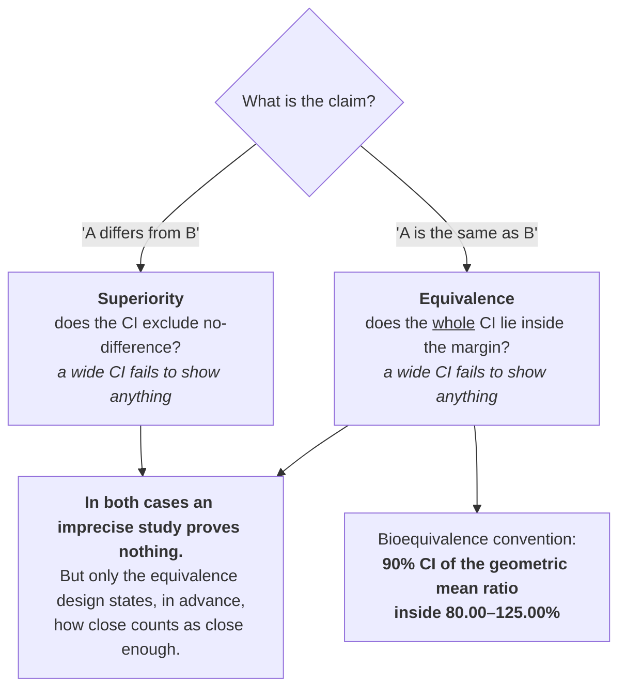

---

## 📄 Paper 1 · The canonical crossover — vonoprazan bioequivalence

**Vonoprazan bioequivalence study (2026)** [@vonoprazan2026], in *Frontiers in Pharmacology*. The
standard design, stated cleanly enough to use as a template.

**Source audit:** [Open full text](https://pmc.ncbi.nlm.nih.gov/articles/PMC13396015/). Record the section or figure supporting each design claim before reading the interpretation.

### What the methods say

> "This was a **single-center, randomized, open-label, single-dose, two-sequence, two-period, crossover
> study**. **Seventy-two healthy subjects** were enrolled and assigned to either a **fasting (n = 32)**
> or a **fed (n = 40)** cohort. In each period, subjects received a single dose of either the test (T)
> or reference (R) formulation, **separated by a 5-day washout period**".
>
> Allocation is to a *sequence*, not a treatment: "Subjects were **randomized to either the TR or RT
> sequence**".
>
> The analysis model mirrors the layout exactly:
>
> > "The primary pharmacokinetic parameters (Cmax, AUC0-t, and AUC0‐∞) were **log-transformed** and
> > evaluated using analysis of variance (ANOVA). The ANOVA model included **sequence, treatment, and
> > period as fixed effects, with subject (nested within sequence) as a random effect**."
>
> Results are reported as ratios with intervals: "Under fasting conditions, the GMRs (90% CIs) for
> Cmax, AUC0-t, and AUC0‐∞ were **95.45% (88.96%–102.41%)**, 98.15% (93.93%–102.56%), and 98.53%
> (94.41%–102.83%) ... Under fed conditions, the corresponding values were **105.00%
> (94.35%–116.85%)** for Cmax".
>
> Seventy of the 72 enrolled subjects completed the study.

### The design, drawn

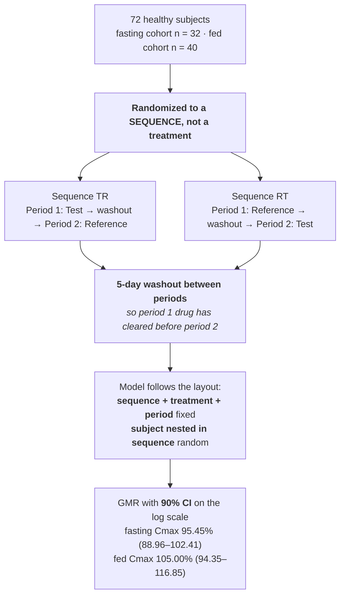

### Reading it

Compare with the course interpretation after completing your audit

- **Randomizing to a sequence is what balances period effects.** If everyone took the test product
  first, any drift between visits — season, assay batch, subject familiarity — would be perfectly
  confounded with formulation. Half the subjects in each order makes period a factor you can estimate
  and remove ([Ch. 7](../../chapters/07-treatment-structures.md)).
- **The model is the layout written as an equation.** Sequence, treatment and period as fixed effects;
  subject nested within sequence as random. Every term corresponds to something the design actually
  did. This is step 5 of the audit in this sub-course — does the analysis mirror the layout? — and
  this paper explicitly describes a model aligned with its crossover design
  ([Ch. 11](../../chapters/11-observational-and-causal.md)).
- **Log transformation is not cosmetic.** Bioequivalence is a claim about *ratios*, and the 80–125%
  limits are symmetric on the log scale (log 0.80 and log 1.25 are equal and opposite). Analysing
  untransformed concentrations would make the acceptance region asymmetric and the test wrong
  ([Ch. 8](../../chapters/08-sample-size-and-power.md)).
- **Fed and fasting are separate studies, not a factor.** Each cohort has its own crossover. Food
  changes absorption so much that pooling would estimate an average over a condition nobody
  experiences — and note the fed Cmax interval (94.35–116.85) is far wider than the fasting one
  (88.96–102.41), which is the variability food introduces, visible directly in the intervals.
- **Why a 90% CI and not 95%.** The two one-sided tests procedure tests both boundaries at α = 0.05
  each, which corresponds to a 90% interval. It is not a relaxed standard; it is the interval that
  matches the two one-sided hypotheses actually being tested.

---

## 📄 Paper 2 · When two periods are not enough — a fully replicate crossover

**Omeprazole bioequivalence study (2026)** [@omeprazole2026], in *BMC Pharmacology & Toxicology*. The
same drug class, a different design, for a stated reason.

**Source audit:** [Open full text](https://pmc.ncbi.nlm.nih.gov/articles/PMC13525694/). Record the section or figure supporting each design claim before reading the interpretation.

### What the methods say

> The two arms use different designs on purpose: "The fasting study was conducted using a **randomized,
> single-centre, single-dose, two-period, two-sequence crossover design**. The fed study was a
> **randomized, single-centre, single-dose, four-period, two-sequence fully replicate crossover
> design**."
>
> The reason is given:
>
> > "Eligible healthy subjects were assigned to either **Sequence I (T-R-T-R) or Sequence II
> > (R-T-R-T)**. This **replicate design was selected to estimate the intra-subject variability of the
> > reference formulation**, which was ne[cessary]"
>
> And the data justify it: "Under fed conditions, **high intra-subject variability** was observed for
> Cmax (**CV = 46.79%**) and AUC0−t (CV = 31.61%)."
>
> The sample size calculation states every input: "Sample size was calculated using PASS 11.0 software.
> For the fasting arm, the following assumptions were used: an **intra-subject CV of 26.61% for Cmax**,
> a **true geometric mean ratio (GMR) of 0.95**, a **bioequivalence margin of 80.00-125.00%**, a
> significance level **α = 0.05**, and a **power of 90%**. This required **at least 42 evaluable
> subjects**. Accounting for a 20% drop[out]" the enrolled number was larger.
>
> In the fasting arm "the geometric mean ratios (GMRs) of Cmax, AUC0−t, and AUC0−∞ were 101.33%,
> 101.81%, and 101.76%, respectively, with **all 90% confidence intervals (CIs) falling within the
> bioequivalence range of 80.00-125.00%**".

### The design, drawn

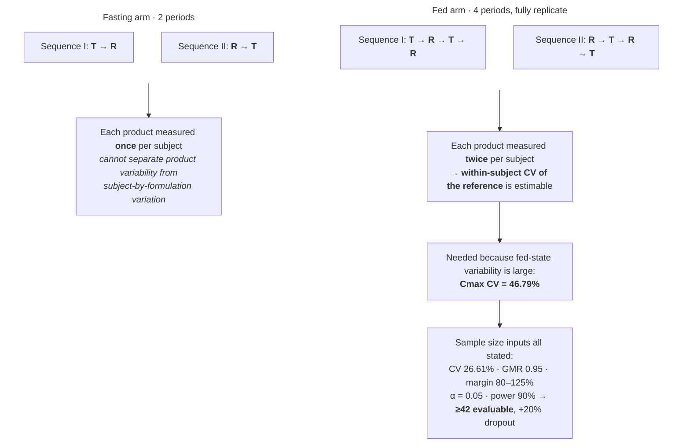

### Reading it

Compare with the course interpretation after completing your audit

- **A replicate design measures the variability of the yardstick itself.** In a 2×2 crossover each
  subject gives one measurement per product, so you can estimate how much subjects differ, but not how
  much the *reference product* varies within a single subject from occasion to occasion. Giving the
  reference twice separates those. For a highly variable drug that distinction decides whether
  equivalence is even demonstrable at a sensible sample size
  ([Ch. 15](../../chapters/15-measurement-and-benchmarking.md)).
- **A CV of 46.79% is the design problem in one number.** Under fixed 80–125% limits, demonstrating
  equivalence for a drug whose own Cmax varies by nearly half within the same person requires a very
  large study — not because the products differ, but because the measurement is noisy. Knowing the
  reference's variability is what licenses a scaled approach
  ([Ch. 8](../../chapters/08-sample-size-and-power.md)).
- **The sample size calculation is fully auditable.** Assumed CV, assumed true ratio, margin, alpha,
  power, result, dropout allowance. A reader can recompute it. Compare with "a sample size of 48 was
  considered sufficient", which is a sentence, not a calculation
  ([Ch. 25](../../chapters/25-preregistration-and-reporting.md)).
- **Note the assumed GMR of 0.95, not 1.00.** Powering at an assumed true ratio of exactly 1 is
  optimistic: it assumes the formulations are identical. Allowing a 5% true difference requires more
  subjects and is the honest assumption, since a generic is rarely a perfect copy.

---

## 📄 Paper 3 · Food as a treatment — extended-release tamsulosin

**Tamsulosin ER bioequivalence study (2026)** [@tamsulosin2026], in *Pharmaceutics*.

**Source audit:** [Open full text](https://pmc.ncbi.nlm.nih.gov/articles/PMC13517056/). Record the section or figure supporting each design claim before reading the interpretation.

### What the methods say

> "This study assessed the pharmacokinetics and bioequivalence of a generic tamsulosin 0.4 mg ER
> formulation against the innovator **under fasting and fed conditions**", via "**Two randomized,
> ope**[n-label crossover studies]".
>
> The rationale makes food a mechanism rather than a nuisance:
>
> > "the reliable performance of extended-release formulations **depends heavily on gastrointestinal
> > physiology, particularly the presence of food**. Food intake **significantly alters gastric
> > emptying time, gastrointestinal transit, and splanchnic blood flow**."
>
> In vitro work runs alongside: "Dissolution testing was performed under quality-control conditions
> using **USP Apparatus II in phosphate buffer (pH 6.8)**", with profiles reported as "mean ± standard
> deviation" at "**n = 12**".
>
> The study is framed around a specific failure mode — the keywords include "**dose dumping**" and
> "**in vitro–in vivo correlation**" — and population context is stated: data "**in Latin American
> populations, particularly among healthy Mexican subjects, remain limited** ... given the reported
> **interethnic variability in CYP3A4 and CYP2D6** activity".

### The design, drawn

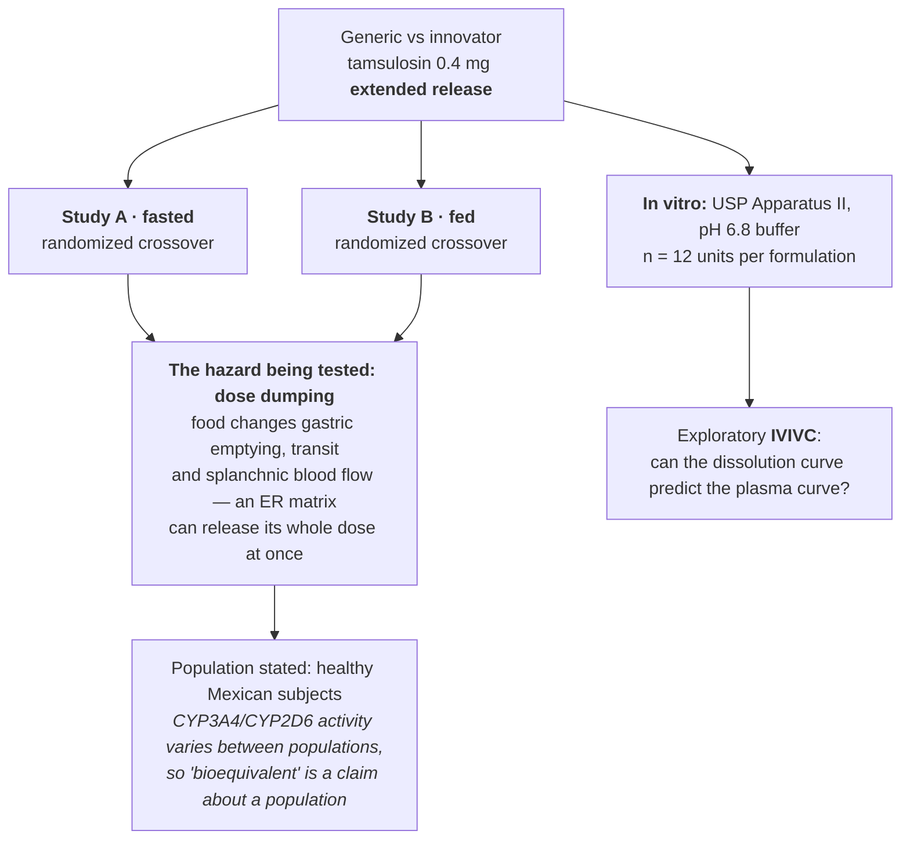

### Reading it

Compare with the course interpretation after completing your audit

- **For an extended-release product, the fed study is not a formality.** An immediate-release tablet
  mostly dissolves regardless; a polymer matrix designed to release over hours can be disrupted by
  food, releasing the entire dose at once. The fed arm exists to test a specific, named failure mode —
  which is a much stronger reason than "regulators require it"
  ([Ch. 6](../../chapters/06-controls-and-comparators.md)).
- **n = 12 in dissolution is not n = 12 subjects.** Twelve dosage units in a dissolution apparatus
  measure manufacturing uniformity, not biological variability. The two sample sizes answer different
  questions and should never be conflated
  ([Ch. 3](../../chapters/03-experimental-unit-and-replication.md)).
- **IVIVC is a prediction claim, and should be labelled "exploratory" when it is.** A correlation
  established on the same two formulations that generated it is a fit, not a validated predictive
  model — the distinction [Module 4](04-omics-and-bioinformatics.md) drew about analysis inside versus
  outside the loop ([Ch. 12](../../chapters/12-predictive-studies.md)).
- **"Bioequivalent" is always bioequivalent *in a population*.** The paper names the enzymes whose
  activity varies between populations and the population it studied. That is the external-validity
  statement most bioequivalence papers leave implicit
  ([Ch. 11](../../chapters/11-observational-and-causal.md)).

---

## 📄 Paper 4 · Seven laboratories, one protocol — a ring study of in vitro GI models

**TIM ring study (2026)** [@timring2026], in *Pharmaceutics*. The design that answers "does this
method work, or does it work *here*?"

**Source audit:** [Open full text](https://pmc.ncbi.nlm.nih.gov/articles/PMC13118535/). Record the section or figure supporting each design claim before reading the interpretation.

### What the methods say

> The gap is stated as a design problem: "the limited use of non-compendial systems is driven by the
> **lack of widely accepted, standardized validation frameworks**", and "systematic evaluation of their
> **repeatability and reproducibility across laboratories remains limited** and is needed to support
> broader regulatory confidence."
>
> > "this **international ring study** assesses the **intra-lab repeatability and inter-lab
> > reproducibility** of the tiny-TIM and TIM-1 systems under **standardized fasted- and fed-state
> > conditions**."
>
> The controls on variation between sites are the whole method: "The experiments ... were performed by
> **seven different laboratories in six different countries** ... **Operators in all laboratories
> received identical formal training. To minimize inter-operator variability, all participating
> laboratories followed harmonized standard operating procedures (SOPs)** and worki[ng instructions]."
>
> Even the test article is centrally controlled: "**Paracetamol** ... was procured from Sigma Aldrich
> ... **and distributed to all participating laboratories**. A **500 mg dose** of paracetamol was
> administered to the gastric compartment of the TIM systems as an oral solution."
>
> And the assay carries its own controls: "The collected samples and **control samples (blank TIM media
> spiked with paracetamol reference standard at three known concentrations)** were analysed".

### The design, drawn

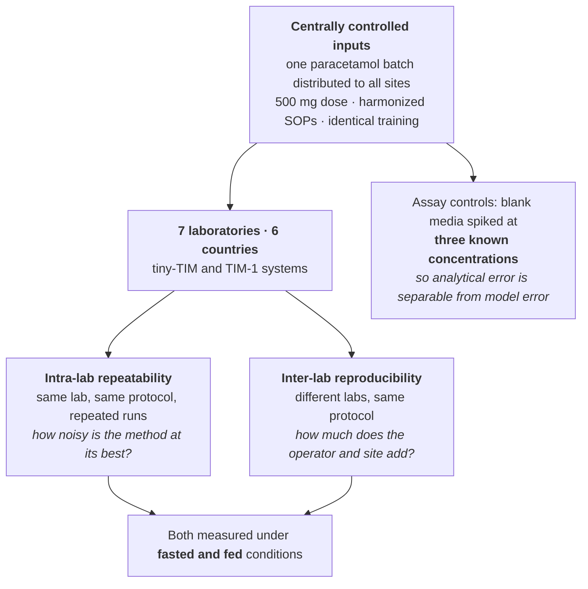

### Reading it

Compare with the course interpretation after completing your audit

- **Repeatability and reproducibility are different quantities, and the design separates them.**
  Repeatability is variation within one laboratory; reproducibility adds variation between
  laboratories, operators and instruments. A method can be beautifully repeatable in the lab that
  invented it and useless elsewhere, and only a multi-site design can tell you which you have
  ([Ch. 15](../../chapters/15-measurement-and-benchmarking.md)).
- **Distributing one batch of test article removes a confounder most ring studies miss.** If each
  laboratory bought its own paracetamol, between-site differences would partly be between-batch
  differences. A single distributed batch means the sites differ only in the way the study is about
  ([Ch. 5](../../chapters/05-blocking-and-batches.md)).
- **Spiked controls at three known concentrations separate two error sources.** If a site's values
  look odd, the spiked controls say whether its *assay* is off or its *GI model* is. Without them, an
  analytical problem and a biological-model problem are indistinguishable
  ([Ch. 6](../../chapters/06-controls-and-comparators.md)).
- **This is the design that supports regulatory confidence.** A single-laboratory validation supports a
  claim about that laboratory. Everything in this module that relies on an analytical method —
  bioequivalence assays, stability assays, impurity profiling — implicitly assumes someone has done
  this work.

---

## 📄 Paper 5 · Designing the method — AQbD resolution of regioisomeric impurities

**Pantoprazole AQbD method study (2026)** [@pantoprazole2026], in *BMC Chemistry*.

**Source audit:** [Open full text](https://pmc.ncbi.nlm.nih.gov/articles/PMC13440174/). Record the section or figure supporting each design claim before reading the interpretation.

### What the methods say

> The problem is a measurement failure with a clinical consequence: "both pharmacopeias **quantify
> Impurities D and F collectively because the monograph methods cannot resolve these two critical
> isomers**."
>
> The rejected alternative, again: "Traditional chromatographic optimization, based on
> **one-factor-at-a-time (OFAT)** experimentation, **fails to adequately explore multi-factor
> interactions**, which are crucial in resolving closely eluting isomers. **Analytical Quality-by-Design
> (AQbD)** offers a systematic, science-driven approach that employs **risk assessment, design of
> experiments (DoE), and respons**[e surface methodology]."
>
> The outcome variables are defined before the design: "Based on the ATP, **Critical Method Attributes
> (CMAs)** were identified as key performance indicators governing method quality. These included
> **resolution between critical impurity pairs** ..., **peak symmetry, retention behavior, and
> sensitivity**."
>
> The design itself: "**A CCD with 27 experimental runs** was executed to **quantify the individual and
> interactive effects of CMPs on CQAs**. ... ANOVA results ... clearly demonstrated the statistical
> significance of the model and key factors". The method was then "**validated in accordance with ICH
> Q2(R2)**, evaluated under **forced-degradation conditions**, and subjected to a comprehensive
> **greenness/whiteness assessment**".

### The design, drawn

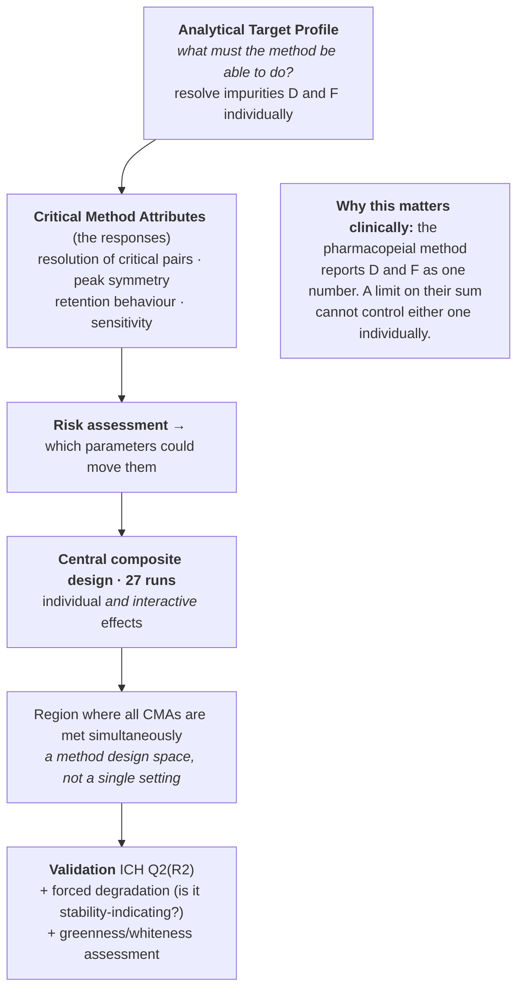

### Reading it

Compare with the course interpretation after completing your audit

- **The ATP is the question, written first.** Analytical Target Profile is the chromatographer's
  version of Chapter 2's "state the question before the method". Defining "resolution of D from F" as
  the thing that must be achieved is what makes the subsequent optimization a design rather than a
  search ([Ch. 2](../../chapters/02-start-with-the-question.md)).
- **Multiple responses, optimized jointly.** Resolution, symmetry, retention and sensitivity are four
  responses that trade off against one another — a gradient that improves resolution may lengthen
  retention. A response-surface design handles this by finding a region where *all* constraints hold,
  which is why the output is a design space rather than one set of conditions
  ([Ch. 13](../../chapters/13-optimization-doe.md)).
- **Forced degradation is a deliberately hostile positive control.** A method that never sees a
  degradant cannot be shown to detect one. Stressing the drug with acid, base, heat, light and
  oxidation generates the peaks the method must resolve, which is the only way to earn the term
  "stability-indicating" ([Ch. 6](../../chapters/06-controls-and-comparators.md)).
- **The clinical stake is in the first quotation.** If two impurities are quantified together, a
  specification on their sum cannot control either one individually — one could rise while the other
  falls and the total would look unchanged. This is a measurement design problem with a patient-safety
  consequence ([Ch. 15](../../chapters/15-measurement-and-benchmarking.md)).

---

## 📄 Paper 6 · A second response nobody used to measure — green method development

**Nirogacestat green AQbD study (2026)** [@nirogacestat2026], in *BMC Chemistry*.

**Source audit:** [Open full text](https://pmc.ncbi.nlm.nih.gov/articles/PMC12990555/). Record the section or figure supporting each design claim before reading the interpretation.

### What the methods say

> The study sets two goals at once: "This study aimed to develop a **green, stability-indicating HPLC
> method using an Analytical Quality by Design (AQbD) approach**. **Critical method parameters,
> including ethanol percent**[age]" were optimized.
>
> The framing is explicit about combining two criteria: "the paradigm for analytical method development
> has shifted from traditional trial-and-error approaches toward more systematic, science- and
> risk-based frameworks. This evolution is driven by **two parallel philosophies: Analytical Quality by
> Design (AQbD)** ... **and Green Analytical Chemistry (GAC)**."
>
> The specific problem with the existing method is named: "The technique lacks contemporary regulatory
> compliance because the AQbD framework was not employed. **The use of acetonitrile (ACN) as a solvent
> poses significant environmental and safety concerns due to its toxicity** a[nd disposal burden]."
>
> Degradants are not just detected but identified: "For mass spectrometric analysis and **structural
> elucidation of degradation products**", an LC-MS system was used, while routine quantification used
> "**PDA for HPLC runs; MS used for characterization only**". Working concentrations are fixed and
> stated: "The final injected concentration for both the assay and forced-degradation experiments was
> **10.0 ppm NGT and ≤ 1.0 ppm of each impurity**".

### The design, drawn

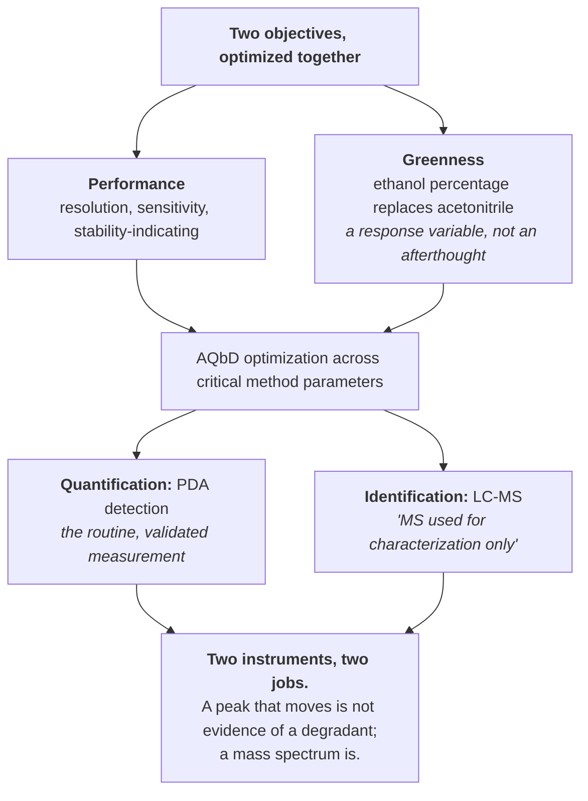

### Reading it

Compare with the course interpretation after completing your audit

- **Adding a response changes the optimum.** Had greenness not been an objective, acetonitrile would
  have stayed, because it performs well chromatographically. Including solvent toxicity as something
  the design must satisfy moves the answer — the same structure as
  [Module 7](07-biotech-and-bioprocess.md)'s titer-versus-cell-robustness trade-off
  ([Ch. 13](../../chapters/13-optimization-doe.md)).
- **Separating quantification from identification is good measurement hygiene.** The PDA detector
  gives reproducible, validated numbers; the mass spectrometer answers "what is this peak". Using MS
  "for characterization only" is an honest statement that the identification step was not held to the
  same quantitative validation as the assay
  ([Ch. 15](../../chapters/15-measurement-and-benchmarking.md)).
- **Structurally identifying degradants closes a loop most stability work leaves open.** A new peak
  under stress tells you something changed. Knowing *what* it is tells you whether it is toxicologically
  relevant, and whether the degradation pathway would occur under real storage rather than only under
  forced conditions.
- **Fixed working concentrations make the comparison fair.** Assay and forced-degradation runs at the
  same 10.0 ppm means sensitivity is not quietly different between the experiment that must detect
  impurities and the experiment that generates them.

---

## 📄 Paper 7 · A stability study as a crossed factorial — idarubicin in infusion bags

**Idarubicin stability study (2026)** [@idarubicin2026], in *PLOS ONE*.

**Source audit:** [Open full text](https://pmc.ncbi.nlm.nih.gov/articles/PMC13524237/). Record the section or figure supporting each design claim before reading the interpretation.

### What the methods say

> The design is a full factorial, named as such:
>
> > "**Three variation factors were studied and crossed**: the **diluent** (0.9% NaCl or 5% Dex), the
> > **final concentration** (0.04 mg/mL or 0.2 mg/mL) and the **storage temperature** (room temperature
> > 22 ± 3 °C or refrigerated)"
>
> The levels were not chosen by convention. They were chosen from how the drug is actually used: "To
> guide the choices of concentrations for the stability study, a **preliminary analysis of injectable
> anticancer drug production data** from University Hospital of Bordeaux was conducted. ... Over the
> study period, **2,172 idarubicin bags were made** as part of acute lymphoid leukemia, acute myeloid
> leukemia and lymphoma treatment regimens ... **Preparations intended for adults represented over 95%
> of production.**"
>
> The purpose is practical: "the number of idarubicin preparations needed can be high, requiring
> **advance preparation for organizational and logistical reasons**."
>
> The assay is validated before it is trusted: "The **linearity** of the method was assessed by
> producing a serie of **five-point concentrations** ... from **independent test samples**. This serie
> was **repeated on 3 different days**." And "the ability of the assay method to be
> **stability-indicating** was assessed according to **ICH Q1A(R2)**" using forced degradation.

### The design, drawn

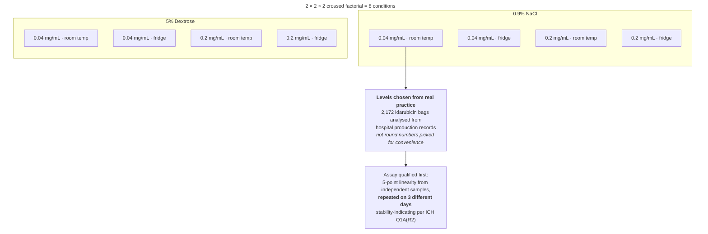

### Reading it

Compare with the course interpretation after completing your audit

- **Crossing the factors answers a question that separate studies cannot.** Diluent, concentration and
  temperature may interact: a dilute solution might be stable in saline but not in dextrose, and only
  when warm. Running all eight combinations makes those interactions visible; running three
  one-factor studies would miss them entirely
  ([Ch. 7](../../chapters/07-treatment-structures.md)).
- **Choosing levels from production data is the best design decision in the paper.** The concentrations
  bracket what the pharmacy actually prepares, established from 2,172 real bags. A stability study at
  concentrations nobody uses is a chemistry result with no clinical consequence
  ([Ch. 2](../../chapters/02-start-with-the-question.md)).
- **Linearity repeated on three different days is intermediate precision, not just linearity.** One
  calibration curve shows the method is linear today. Three independent curves on three days show the
  calibration is stable across the kind of variation the stability study will actually span
  ([Ch. 15](../../chapters/15-measurement-and-benchmarking.md)).
- **"Stability-indicating" is a prerequisite, not a conclusion.** If the assay cannot separate
  degradation products from the parent drug, a flat concentration-versus-time curve could mean the drug
  is stable *or* that the method cannot see what it has turned into. Forced degradation under ICH
  Q1A(R2) is what rules out the second reading.

---

## 📄 Paper 8 · A split-plot in time — meropenem eye drops, frozen and thawed

**Meropenem eye drop stability study (2026)** [@meropenem2026], in *Pharmaceutics*. A stability design
whose structure mirrors how the product is used.

**Source audit:** [Open full text](https://pmc.ncbi.nlm.nih.gov/articles/PMC13516646/). Record the section or figure supporting each design claim before reading the interpretation.

### What the methods say

> The two phases are nested, not parallel:
>
> > "The eye drops were divided into two groups: **frozen stability (FSG)** and **refrigerated stability
> > after thawing (RSG)**, in which the eye drop bottles belonging to the FSG were **thawed on the day
> > of analysis and moved to the RSG**, to be analyzed on the days established according to the analysis
> > protocol. The freezing conditions were **−20 ± 2 °C** and the refrigerati[on conditions follow]."
>
> The sampling schedule names every time point:
>
> > "The chemical stability ... in the FSG was studied over **42 days** of storage: days **0 (D0), 7
> > (W1), 14 (W2), 21 (W3), 28 (W4), 35 (W5) and 42 (W6)**; and over **7 days** of storage in the RSG
> > after thawing, days **1 (WnD1), 2 (WnD2), 3 (WnD3) and 7 (WnD7)**, where '**n**' is the number of
> > weeks during which the eye drops remained frozen".
>
> The container is justified as a potential factor: "a **PP dropper bottle** was chosen. PP is widely
> regarded as one of the most inert plastics, exhibiting a **low tendency to adsorb drug substances**.
> In practice, adsorption to PP is generally negligible; however, it **may become significant for drugs
> at low concentrati**[ons]."
>
> Both chemical and **microbiological** stability were assessed.

### The design, drawn

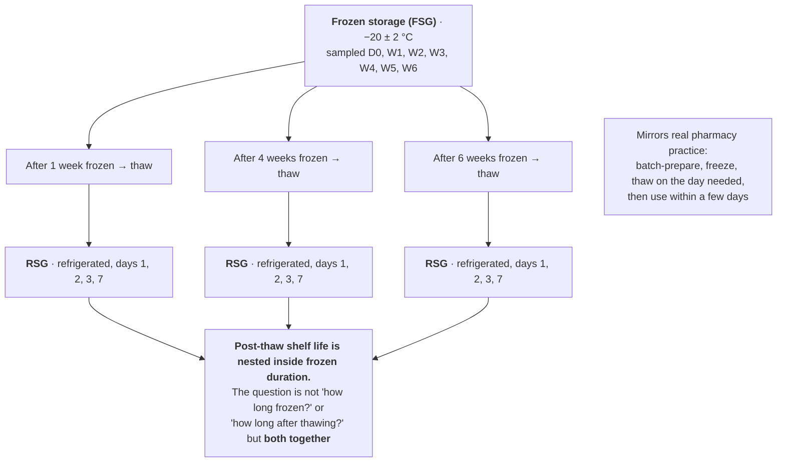

### Reading it

Compare with the course interpretation after completing your audit

- **This is a split-plot in time.** Frozen duration is the whole-plot factor — a bottle cannot be
  frozen for both one week and six. Post-thaw day is the sub-plot factor, measured repeatedly within a
  bottle's thawed life. The nested structure is not a complication; it is the only structure that
  matches how the product is used ([Ch. 7](../../chapters/07-treatment-structures.md)).
- **The notation encodes the design.** "WnD1" — week *n* frozen, day 1 after thawing — makes every
  observation's position in the two-factor grid explicit. Clear labelling of design cells is an
  underrated reporting virtue, because it lets a reader reconstruct the layout without the protocol
  ([Ch. 25](../../chapters/25-preregistration-and-reporting.md)).
- **The container is treated as a possible cause, with a stated condition.** Polypropylene adsorption
  is "generally negligible; however, it may become significant for drugs at low concentrations". That
  is a hypothesis about when the container would matter, which tells you what to check rather than
  asserting that it does not matter ([Ch. 6](../../chapters/06-controls-and-comparators.md)).
- **Chemical and microbiological stability are separate endpoints.** A preparation can retain full
  potency and still be unusable because it is no longer sterile. Measuring only the chemistry would
  answer half the question the pharmacist actually has.

---

## 📄 Paper 9 · Six practices, sixty patients — a cluster-randomized service trial

**ADRe cluster-randomized trial (2026)** [@adre2026], in *PLOS ONE*. A small cluster trial, honest
about being small.

**Source audit:** [Open full text](https://pmc.ncbi.nlm.nih.gov/articles/PMC13588343/). Record the section or figure supporting each design claim before reading the interpretation.

### What the methods say

> "A **pragmatic cluster-randomized controlled trial** was undertaken in **6 primary care practices in
> South-West Wales, alongside a process evaluation**." The design is further specified as "This
> **parallel-arm pragmatic equivalence cluster RCT** and process evaluation explored the impacts of
> patient-centred monitoring ... with usual care. The **allocation ratio of clusters was 1:1**", and it
> "was conducted to accord with the Consolidated Standards of Repo[rting Trials]".
>
> Cluster selection is described, and it was not random: "We approached **24 General Practitioner (GP)
> groups** to explore their willingness to participate in the study, and **selected a group that
> comprised six individual GP practices in one valley**."
>
> Scale: "We recruited **one general practice group, comprising six practices, and 60 patients. Three
> patients were lost to the study.**"
>
> The result: "Intervention arm patients were more likely to have more than one problem addressed than
> control arm patients (**22/27 [82%] vs. 11/30 [35%], adjusted odds ratio [aOR] 7.48, 95% confidence
> interval [CI] 1.99-28.10**)."
>
> Sample size "was calculated as described ... based on standard formulae ... and **accounting for
> clustering**." The primary outcome was defined operationally: "'**Problems addressed**' were defined
> as those where **action was taken following problem identification**, for example by changes in
> prescribing or referral".

**Numerical audit:** The quoted fractions imply 81.5% (22/27) and 36.7% (11/30), whereas
the source reports 82% and 35%. Preserve the reported quotation, but flag the inconsistency and
check outcome definitions and denominators before reusing these percentages. With only six
randomized practices, also examine how the analysis handles inference with few clusters.

### The design, drawn

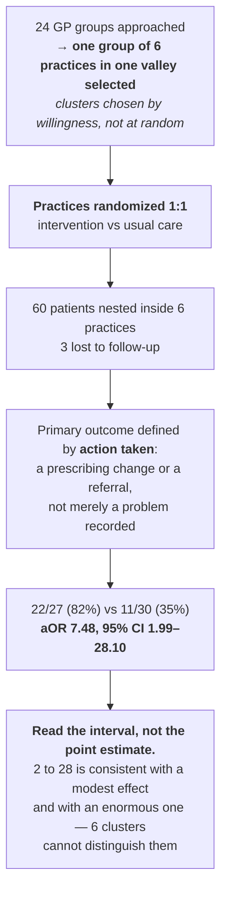

### Reading it

Compare with the course interpretation after completing your audit

- **Six clusters is the sample size, and the interval shows it.** An odds ratio of 7.48 with a 95% CI
  from 1.99 to 28.10 is a wide interval: the data exclude "no effect" but say little about magnitude.
  The 60 patients are nested in 6 practices, and as in [Module 3](03-clinical-and-preclinical.md)'s
  BALTIC trial, it is the clusters that carry the information
  ([Ch. 3](../../chapters/03-experimental-unit-and-replication.md)).
- **Non-random cluster selection limits generalization, not internal validity.** Practices were chosen
  from 24 approached groups by willingness and proximity. Randomization *within* the selected six still
  makes the comparison fair; what it cannot do is make one Welsh valley representative of primary care
  ([Ch. 11](../../chapters/11-observational-and-causal.md)).
- **The outcome definition is doing real work.** "Problems addressed" counts only cases where action
  followed — a prescribing change or referral. A softer definition ("problem identified") would have
  measured whether the intervention makes people write things down, which is a much easier bar and a
  much less useful finding ([Ch. 2](../../chapters/02-start-with-the-question.md)).
- **"Pragmatic" and "equivalence" are both design words.** The authors call this a pragmatic equivalence trial, but a label does not establish an equivalence analysis. The reported sample-size assumptions contrast expected improvement rates; the outcome comparison reports an odds ratio against usual care. To support equivalence, identify a justified prespecified margin and show the relevant confidence interval lies within it. Do not choose a wide margin after seeing an imprecise result ([Ch. 8](../../chapters/08-sample-size-and-power.md)).

---

## 📄 Paper 10 · Synthesis as a design — pharmacist prescribing

**Systematic review of pharmacist prescribing (2026)** [@pharmrx2026], in *BMJ Open*.

**Source audit:** [Open full text](https://pmc.ncbi.nlm.nih.gov/articles/PMC13311757/). Record the section or figure supporting each design claim before reading the interpretation.

### What the methods say

> The search is specified so it can be repeated: "A systematic search was conducted using **six
> electronic databases**: Embase (Ovid), MEDLINE (EBSCO), SCiELO, Dimensions AI, Cochrane Library and
> Epistemonikos. Database searches were conducted **from database inception to 29 January 2025**.
> Additional **grey literature searches** were conducted using Google and DuckDuckGo. Both backward and
> forwar[d citation chasing were conducted]."
>
> Eligible designs are enumerated rather than left to judgement: "**Randomised controlled trials ·
> Non-randomised trials · Prospective cohort studies · Retrospective cohort studies in the same time
> period · Interrupted time series studies**".
>
> Bias is assessed with design-matched tools: "**Risk of bias was assessed using validated tools
> appropriate to study design (eg, Risk of Bias 2 (RoB 2) for parallel RCTs, RoB 2 for cluster RCTs and
> Risk of Bias in Non-Randomised Studies of Interventions)**."
>
> And the synthesis method is chosen for the evidence, not the convention: "A **narrative synthesis
> approach was applied following the Synthesis Without Meta-analysis** gu[idance]."
>
> The yield: "Of the **39 included studies**, **32 studies reported on effectiveness and 20 studies
> reported on safety** across **15 health conditions**. Healthcare settings included outpatient
> (n = 14), primary care (n = 10), community pharmacy (n = 6), inpatient (n = 5), emergency department
> (n = 1) and long-term care (n = 3)."

### The design, drawn

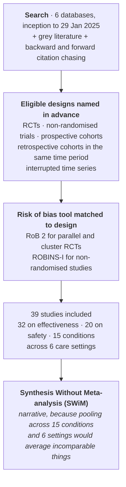

### Reading it

Compare with the course interpretation after completing your audit

- **Deciding not to pool is a design decision, and the right one here.** Thirty-nine studies spanning
  15 conditions and six care settings do not estimate a common effect; a meta-analytic average would
  be a number with no referent. Following SWiM makes the restraint explicit and reportable rather than
  leaving it as an omission ([Ch. 9](../../chapters/09-descriptive-studies.md)).
- **"Retrospective cohort studies in the same time period" is a precise inclusion rule.** It excludes
  historical-control comparisons, where the comparison group comes from an earlier era and therefore
  differs in guidelines, staffing and case mix as well as in the intervention
  ([Ch. 11](../../chapters/11-observational-and-causal.md)).
- **Matching the bias tool to the design is the step that makes mixed evidence usable.** RoB 2 asks
  about randomization and allocation concealment — questions that are meaningless for a cohort study.
  ROBINS-I asks about confounding and selection into the intervention, which is where non-randomised
  evidence actually fails ([Ch. 4](../../chapters/04-randomization-and-blinding.md)).
- **Grey literature and citation chasing target publication bias.** Searching only indexed databases
  finds the studies that were published, which skews positive. Whether it is enough is a fair question;
  that it was attempted and described is the reportable part
  ([Ch. 25](../../chapters/25-preregistration-and-reporting.md)).

---

## Independent transfer task · Audit an equivalence label

A paper calls itself an equivalence trial but reports a non-significant superiority test. Identify the missing design and analysis information. Write a conclusion warranted by the reported evidence and a conclusion that would require a prespecified margin.

Use the [evidence worksheet and assessment criteria](README.md#evidence-worksheet).
Submit your diagram, source-backed reasoning and one remaining uncertainty before looking at the
sample answers. More than one redesign may be defensible; justify yours against the stated constraint.

---

## ⚠️ Common Misconceptions

| ❌ The misconception | ✅ What is actually true — and what to do |
|---|---|
| **"A crossover randomizes subjects to treatments."** | It randomizes them to *sequences*. Paper 1 assigns TR or RT, which is what makes period estimable and removable. |
| **"Two periods are always enough."** | Paper 2 used four, to estimate the reference product's own within-subject variability — impossible when each product is given once. |
| **"A 90% CI is a weaker standard than 95%."** | It is the interval matching two one-sided tests at α = 0.05 each. It is the correct interval for the hypotheses being tested. |
| **"Bioequivalence means the products are identical."** | It means the 90% CI of the ratio lies within 80.00–125.00% in a specified population under specified conditions — fasted or fed, and in Paper 3, a specified ethnic group. |
| **"The fed study is a regulatory formality."** | For an extended-release product it tests dose dumping. Paper 3's fed Cmax interval is far wider than its fasted one. |
| **"n = 12 dissolution units is a sample of 12."** | It measures manufacturing uniformity, not biological variability. Never pool it with subject numbers. |
| **"A method validated in our lab is validated."** | Paper 4 separates intra-lab repeatability from inter-lab reproducibility across seven laboratories. A method can have the first and lack the second. |
| **"Stability studies vary one factor at a time."** | Paper 7 crosses diluent × concentration × temperature, because they can interact. |
| **"Any concentration will do for a stability study."** | Paper 7 chose levels from 2,172 bags actually prepared. Conditions nobody uses answer nobody's question. |
| **"A flat assay curve means the drug is stable."** | Only if the assay is stability-indicating. Otherwise it may mean the method cannot see the degradant. |
| **"60 patients is the sample size of a cluster trial."** | Paper 9 has 6 practices. The CI of 1.99–28.10 is what 6 clusters buys. |
| **"A systematic review should always meta-analyse."** | Paper 10 declines, following SWiM, because 15 conditions across 6 settings have no common effect to pool. |

---

## ✅ Check Your Understanding

**⭐ Q1.** In Paper 1, subjects were randomized to TR or RT rather than to T or R. Name the specific
nuisance effect this balances and say what would be confounded without it.

**⭐⭐ Q2.** Paper 2 used a four-period fully replicate design for the fed arm but a two-period design
for the fasted arm. Explain what the extra two periods estimate and why the fed arm needed it.

**⭐⭐ Q3.** Paper 7 crossed three two-level factors. Write out the eight conditions, and give one
concrete example of an interaction this design could detect that three separate one-factor studies
could not.

**⭐⭐⭐ Q4.** Paper 9 reports an adjusted odds ratio of 7.48 with a 95% CI of 1.99–28.10 from 6 practices
and 60 patients. A colleague summarises this as "the intervention makes problems seven times more
likely to be addressed". Write a better one-sentence summary and justify it.

**⭐⭐⭐ Q5.** Paper 8 sampled frozen bottles weekly for 6 weeks and then followed each thawed bottle for
7 days. Name the design structure, say which factor sits at which level, and explain what you would
lose by instead running two separate studies — one on freezing, one on refrigeration.

---

## 📝 Sample Answers & Assessment

▶ Show sample answers

> **Q1:** *"It balances the period effect — anything that differs systematically between visit 1 and
> visit 2, such as assay batch, season, or the subjects' familiarity with the procedure. If everyone
> received the test product first, formulation and period would be perfectly confounded, and a drift
> between visits would be indistinguishable from a difference between products."* — **Example answer.**

> **Q2:** *"The extra periods give each subject the reference product twice, which is the only way to
> estimate the within-subject variability of the reference formulation itself rather than just the
> variability between subjects. The fed arm needed it because fed-state variability was high — a Cmax
> CV of 46.79% — meaning the reference product varies enormously within the same person from occasion
> to occasion, so a fixed 80–125% criterion could fail even for two identical products unless that
> variability is characterised."* — **Example answer.**

> **Q3:** *"The eight conditions are NaCl/0.04/room, NaCl/0.04/fridge, NaCl/0.2/room, NaCl/0.2/fridge,
> Dex/0.04/room, Dex/0.04/fridge, Dex/0.2/room, Dex/0.2/fridge. An interaction it could detect: the
> dilute 0.04 mg/mL solution might be stable in saline at both temperatures but degrade in 5% dextrose
> only at room temperature — a three-way interaction between diluent, concentration and temperature.
> Three one-factor studies, each holding the others at one fixed level, would report 'dextrose is
> fine', 'dilute is fine' and 'room temperature is fine', and would miss the one combination that
> fails."* — **Example answer.**

> **Q4:** *"'In six practices, the intervention increased the chance that an identified problem was
> acted on, with an effect size the study could not pin down — the data are compatible with roughly a
> doubling and with a twenty-fold increase.' The point estimate of 7.48 is the single least stable
> number in the result: with six clusters the interval spans more than an order of magnitude, so
> quoting the midpoint as the finding reports precision the design never had."* — **Example answer.**

> **Q5:** *"It is a split-plot in time: frozen storage duration is the whole-plot factor, because a
> given bottle can only be frozen for one length of time, and post-thaw day is the sub-plot factor,
> measured repeatedly within each thawed bottle. Two separate studies would estimate each factor only
> at one level of the other — a 'how long frozen' study ending at thaw, and a 'how long refrigerated'
> study on never-frozen material — and would therefore be unable to answer the question the pharmacist
> actually has, which is whether a bottle frozen for six weeks still has the same post-thaw shelf life
> as one frozen for one week. That is an interaction between the two durations, and only the nested
> design can see it."* — **Example answer.**

---

## 🧾 Module Summary

| Paper | Design | The lesson it teaches best |
|---|---|---|
| Vonoprazan BE [@vonoprazan2026] | 2×2 crossover, fasted and fed cohorts | Randomize to sequences; the model mirrors the layout |
| Omeprazole BE [@omeprazole2026] | 4-period fully replicate crossover | Replicating the reference estimates its own variability |
| Tamsulosin ER [@tamsulosin2026] | Fasted and fed crossovers + IVIVC | For extended release, the fed arm tests dose dumping |
| TIM ring study [@timring2026] | 7 laboratories, harmonized SOPs | Repeatability and reproducibility are different quantities |
| Pantoprazole AQbD [@pantoprazole2026] | ATP → CMAs → 27-run CCD | Define the responses before optimizing; forced degradation is a positive control |
| Nirogacestat AQbD [@nirogacestat2026] | Performance and greenness jointly | Adding a response variable moves the optimum |
| Idarubicin stability [@idarubicin2026] | 2×2×2 crossed factorial | Cross the factors; choose levels from real practice |
| Meropenem eye drops [@meropenem2026] | Frozen then thawed, nested in time | A split-plot in time, matching how the product is used |
| ADRe trial [@adre2026] | Pragmatic cluster RCT, 6 practices | Six clusters is the sample size; read the interval |
| Pharmacist prescribing [@pharmrx2026] | Systematic review, SWiM synthesis | Not pooling is a design decision, and sometimes the right one |

---

## 🔗 Go Deeper

- Main course: [Ch. 7 — Treatment Structures](../../chapters/07-treatment-structures.md) ·
  [Ch. 8 — Sample Size, Power and Precision](../../chapters/08-sample-size-and-power.md) ·
  [Ch. 15 — Measurement, Validation and Benchmarking](../../chapters/15-measurement-and-benchmarking.md) ·
  [Ch. 18 — Biotechnology, Bioprocess and Pharmacy](../../chapters/18-biotech-bioprocess-pharmacy.md) ·
  [Ch. 23 — Clinical and Preclinical](../../chapters/23-clinical-and-preclinical.md)
- Reporting guidance: [@schulz2010] (CONSORT); [@lakens2017equivalence] on equivalence testing
- Then design your own: [Ch. 26 — The Design Clinic](../../chapters/26-capstone-design-clinic.md)

<!-- REFS -->

---

[← Module 7](07-biotech-and-bioprocess.md) · [Sub-course home](README.md) · [Main course](../../README.md)
