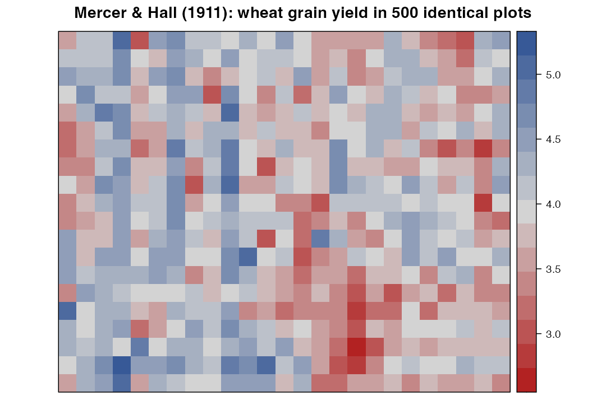
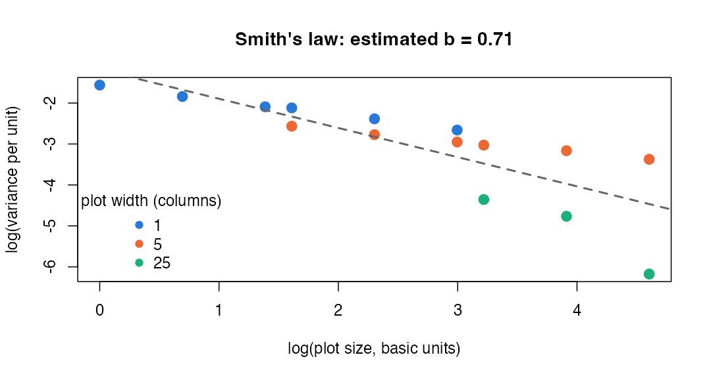
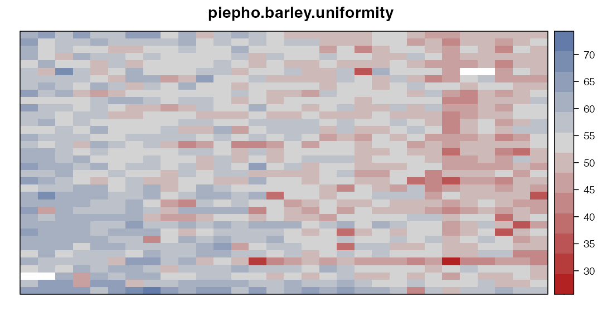

# Module 1 — Reading the Field: Heterogeneity and Uniformity Trials

> **Sub-course: Field Experiments in Agriculture & Plant Breeding**
> [Sub-course home](README.md) · [Next: Module 2 — CRD and RCBD →](02-crd-and-rcbd.md)

---

## 🧭 Learning Objectives

After this module you will be able to:

1. Visualize a field's spatial variation with `desplot`.
2. Explain what a **uniformity trial** is and why agronomists ran thousands of them.
3. Estimate **Smith's heterogeneity coefficient** *b* and use it to reason about plot size.
4. Show, with real data, that blocking only helps when blocks follow the field's gradient.

---

## 🎯 The Big Picture

Before you can design a field trial, you need to know your enemy: **the field itself**.
Soil depth, fertility, drainage, previous crops and machinery tracks make neighbouring
plots more alike than distant ones. If you ignore this, the field's variation lands in
your error term, or worse, lines up with your treatments.

A **uniformity trial** is the agronomist's way of looking at the enemy: the whole field is
sown with **one variety, treated identically**, and harvested in small units. All the
variation you see is pure field and measurement noise — there are no treatments.
Mercer and Hall's 1911 wheat trial is the most famous one ([Mercer & Hall, 1911](https://doi.org/10.1017/s002185960000160x)), and it is
in the `agridat` package ([Wright, 2011](https://doi.org/10.32614/cran.package.agridat)).

---

## 🧠 Core Intuition

- **Neighbours resemble each other.** Plots close together share soil and history.
- **Variation has direction.** Fields often have gradients (slope, drainage, an old
  hedge) that run mainly along one axis.
- **Larger plots average out small-scale noise** — but less than you would expect if
  units were independent, because neighbouring units are correlated. Smith's empirical law
  captures this ([Smith, 1938](https://doi.org/10.1017/s0021859600050516)):

$$V_x = \frac{V_1}{x^{b}}$$

where $V_x$ is the variance of yield per unit area for plots made of $x$ basic units.
If units were independent, $b = 1$. Real fields give $0 < b < 1$: the closer $b$ is to 0,
the more strongly neighbours are correlated and the less you gain from bigger plots.

---

## 👁️ Visual Intuition — the Mercer & Hall field


```r
library(agridat)
library(desplot)
d <- mercer.wheat.uniformity
str(d)
```

```
#> 'data.frame':	500 obs. of  4 variables:
#>  $ row  : int  20 19 18 17 16 15 14 13 12 11 ...
#>  $ col  : int  1 1 1 1 1 1 1 1 1 1 ...
#>  $ grain: num  3.63 4.07 4.51 3.9 3.63 3.16 3.18 3.42 3.97 3.4 ...
#>  $ straw: num  6.37 6.24 7.05 6.91 5.93 5.59 5.32 5.52 6.03 5.66 ...
```


```r
desplot(d, grain ~ col * row,
        main = "Mercer & Hall (1911): wheat grain yield in 500 identical plots",
        aspect = 20 / 25)   # field is 20 rows x 25 columns
```

<div class="figure" style="text-align: center">

<p class="caption">plot of chunk mercer-map</p>
</div>

Every plot received the same variety and treatment, yet yields range from
2.73 to 5.16 (coefficient of variation
11.6%). Look for **stripes** — they reveal
gradients.


```r
anova(lm(grain ~ factor(row) + factor(col), data = d))
```

```
#> Analysis of Variance Table
#> 
#> Response: grain
#>              Df Sum Sq Mean Sq F value    Pr(>F)    
#> factor(row)  19  6.094 0.32073  2.2462  0.002038 ** 
#> factor(col)  24 33.596 1.39982  9.8036 < 2.2e-16 ***
#> Residuals   456 65.111 0.14279                      
#> ---
#> Signif. codes:  0 '***' 0.001 '**' 0.01 '*' 0.05 '.' 0.1 ' ' 1
```

The column effect (F = 9.8)
is much stronger than the row effect (F = 2.2):
**this field varies mainly from column to column.**

---

## 🔬 Worked Example 1 — Smith's law from real data

We combine adjacent basic units into larger plots of different sizes and shapes, and
compute the variance of the per-unit yield for each plot size.


```r
res <- NULL
for (w in c(1, 5, 25)) for (h in c(1, 2, 4, 5, 10, 20)) {
  g <- aggregate(grain ~ I((col - 1) %/% w) + I((row - 1) %/% h), data = d, FUN = mean)
  if (nrow(g) >= 5) res <- rbind(res, data.frame(width = w, height = h, x = w * h,
                                                 variance = var(g$grain), n_plots = nrow(g)))
}
smith_fit <- lm(log(variance) ~ log(x), data = res)
b <- -coef(smith_fit)[["log(x)"]]
res
```

```
#>    width height   x    variance n_plots
#> 1      1      1   1 0.210020191     500
#> 2      1      2   2 0.158663203     250
#> 3      1      4   4 0.123595817     125
#> 4      1      5   5 0.120292758     100
#> 5      1     10  10 0.092070398      50
#> 6      1     20  20 0.069990782      25
#> 7      5      1   5 0.076899303     100
#> 8      5      2  10 0.062549582      50
#> 9      5      4  20 0.052263761      25
#> 10     5      5  25 0.048455821      20
#> 11     5     10  50 0.042251189      10
#> 12     5     20 100 0.034280308       5
#> 13    25      1  25 0.012829211      20
#> 14    25      2  50 0.008524398      10
#> 15    25      4 100 0.002079373       5
```


```r
pal <- c("1" = "#2a78d6", "5" = "#eb6834", "25" = "#1baf7a")
plot(log(variance) ~ log(x), data = res, pch = 19, cex = 1.4, col = pal[as.character(res$width)],
     xlab = "log(plot size, basic units)", ylab = "log(variance per unit)",
     main = sprintf("Smith's law: estimated b = %.2f", b))
abline(smith_fit, lwd = 2, col = "grey40", lty = 2)
legend("bottomleft", title = "plot width (columns)", legend = names(pal), col = pal, pch = 19, bty = "n")
```

<div class="figure" style="text-align: center">

<p class="caption">plot of chunk smith-plot</p>
</div>

The estimated heterogeneity coefficient is **b = 0.71** — clearly below 1. Doubling
plot size reduces variance per unit by a factor of only $2^{0.71}$ ≈
1.64, not 2. Notice also that **plot shape matters**: long plots spanning
several columns (width 5 or 25) have much lower variance than square plots of the same
area, because they average across the strong column gradient.

**Design lesson:** beyond a modest size, larger plots buy little precision; **more
replicates in well-placed blocks** usually buy more.

---

## 🔬 Worked Example 2 — dummy experiments: does blocking help?

A uniformity trial is a perfect testbed: we can superimpose fake designs on real
field variation, where we *know* there is no treatment effect. We use the 20 × 20 corner of
the field, combine units into 2 × 2 plots (a 10 × 10 grid of 100 plots), and "test"
10 treatments with 10 replicates:

- **CRD:** treatments randomized over all 100 plots.
- **RCBD by plot-rows:** each row of 10 plots is a block.
- **RCBD by plot-columns:** each column of 10 plots is a block.


```r
s <- subset(d, col <= 20 & row <= 20)
s$pc <- (s$col - 1) %/% 2 + 1
s$pr <- (s$row - 1) %/% 2 + 1
p <- aggregate(grain ~ pc + pr, data = s, FUN = sum)          # 100 plots

dummy <- function(effect = 0, nsim = 2000) {
  out <- replicate(nsim, {
    crd <- sample(rep(1:10, 10))
    rb_row <- ave(seq_len(100), p$pr, FUN = function(z) sample(1:10))
    rb_col <- ave(seq_len(100), p$pc, FUN = function(z) sample(1:10))
    add <- function(trt) p$grain + effect * mean(p$grain) * (trt == 1)
    a1 <- anova(lm(add(crd) ~ factor(crd)))
    a2 <- anova(lm(add(rb_row) ~ factor(p$pr) + factor(rb_row)))
    a3 <- anova(lm(add(rb_col) ~ factor(p$pc) + factor(rb_col)))
    c(a1["Residuals", "Mean Sq"], a1[1, "Pr(>F)"] < 0.05,
      a2["Residuals", "Mean Sq"], a2[2, "Pr(>F)"] < 0.05,
      a3["Residuals", "Mean Sq"], a3[2, "Pr(>F)"] < 0.05)
  })
  m <- rowMeans(out)
  data.frame(design = c("CRD", "RCBD, blocks = plot rows", "RCBD, blocks = plot columns"),
             residual_MS = round(m[c(1, 3, 5)], 2), rejection_rate = round(m[c(2, 4, 6)], 3))
}
null_res  <- dummy(effect = 0)
power_res <- dummy(effect = 0.10)    # treatment 1 raises yield by 10%
null_res
```

```
#>                        design residual_MS rejection_rate
#> 1                         CRD        1.89          0.054
#> 2    RCBD, blocks = plot rows        1.95          0.051
#> 3 RCBD, blocks = plot columns        1.16          0.060
```

```r
power_res
```

```
#>                        design residual_MS rejection_rate
#> 1                         CRD        1.89          0.585
#> 2    RCBD, blocks = plot rows        1.95          0.588
#> 3 RCBD, blocks = plot columns        1.17          0.874
```

What the real field tells us:

| Design | Residual mean square | False-positive rate (no effect) | Power (one treatment +10%) |
|---|---|---|---|
| CRD | 1.89 | 0.054 | 0.585 |
| RCBD, blocks = plot rows | 1.95 | 0.051 | 0.588 |
| RCBD, blocks = plot columns | 1.16 | 0.06 | 0.874 |

1. **All designs keep the false-positive rate near 5%** — randomization does its job.
2. **Blocks along the plot columns** — the direction in which this field varies most —
   cut the error variance by about 39%
   and raise power from 58% to
   87%.
3. **Blocks in the wrong direction gain nothing** (and cost degrees of freedom).

> **Rule:** block so that plots *within* a block are as alike as possible — compact blocks
> whose long side runs perpendicular to the main gradient, so that each block sits in one
> "stripe" of the field.

---

## ⚠️ Common Misconceptions

| ❌ The misconception | ✅ What is actually true — and what to do |
|---|---|
| **"A field that looks uniform is uniform."** | Mercer and Hall's field looked uniform too. |
| **"Bigger plots are always better."** | Gains shrink quickly (b < 1); replication usually wins. |
| **"Any blocking helps."** | Only blocks that capture real variation help. |
| **"Square plots are best."** | Shape interacts with the gradient; long thin plots across a gradient average more of it. |
| **"Uniformity trials are history."** | Modern spatial models and yield-monitor or drone data are their descendants (Module 7). |

---

## 🧪 Spot the Flaw

> "Our field slopes from north to south. We laid out 4 blocks as long strips running from
> north to south, each containing all 12 varieties."

<details>
<summary>▶ Diagnosis</summary>

Each block spans the whole gradient, so plots *within* a block differ as much as possible.
Blocks should run **east–west** (perpendicular to the slope), so that each block is a
roughly homogeneous band at one position on the slope.
</details>

---

## 🔎 The Reviewer's Perspective

- **"How were blocks oriented relative to known field gradients?"**
- **"Were plot coordinates (row, column) recorded for spatial analysis?"**
- **"Is plot size/shape justified?"**

---

## 🛠️ Design Challenge

Load `agridat::piepho.barley.uniformity` (a modern uniformity trial). Map it with
`desplot`, find the main direction of variation, and propose a block layout for an
RCBD with 8 varieties and 4 replicates.

<details>
<summary>▶ Model approach</summary>


```r
pb <- piepho.barley.uniformity
desplot(pb, yield ~ col * row, main = "piepho.barley.uniformity")
```

<div class="figure" style="text-align: center">

<p class="caption">plot of chunk challenge</p>
</div>

```r
anova(lm(yield ~ factor(row) + factor(col), data = pb))
```

```
#> Analysis of Variance Table
#> 
#> Response: yield
#>               Df  Sum Sq Mean Sq F value    Pr(>F)    
#> factor(row)   35  3915.6  111.87   7.600 < 2.2e-16 ***
#> factor(col)   29 11326.5  390.57  26.533 < 2.2e-16 ***
#> Residuals   1011 14882.2   14.72                      
#> ---
#> Signif. codes:  0 '***' 0.001 '**' 0.01 '*' 0.05 '.' 0.1 ' ' 1
```

Compare the row and column F values to find the dominant direction, then form compact
blocks of 8 plots that lie within one band of that gradient. Re-use the dummy-experiment
code to check that your blocking reduces the residual mean square.
</details>

---

## 🧑‍💻 Code-along Exercises

1. Repeat Worked Example 2 using `straw` instead of `grain`. Is the best block direction the same?
2. Change the plot size to 1 × 4 units (long, thin) and rerun. What happens to the CRD residual MS?
3. Add a fourth design: an RCBD with **2 × 5-plot compact blocks**. How does it compare?

---

## ✅ Check Your Understanding

**⭐ Q1.** What is a uniformity trial?

**⭐ Q2.** In Smith's law, what does b = 1 mean? What does b = 0.3 mean?

**⭐⭐ Q3.** With b = 0.71, by what factor does variance per unit fall if plot size quadruples?

**⭐⭐ Q4.** Why did RCBD with blocks along plot rows not help in this field?

**⭐⭐⭐ Q5.** You have no uniformity data for a new field. How can you still design sensible blocks?

---

## 📝 Sample Answers & Assessment

<details>
<summary>▶ Show sample answers</summary>

> **Q1 — Sample answer:** *"A trial with one variety everywhere to measure field variation."* — **✔ 10/10.**

> **Q2 — Sample answer:** *"b = 1: plots independent; b = 0.3: neighbours strongly correlated."* — **✔ 10/10.** Add the consequence: with b = 0.3, enlarging plots barely improves precision.

> **Q3 — Sample answer:** *"4^b."* — **✔ 10/10.** Here 4^0.71 ≈ 2.69, compared with 4 for independent units.

> **Q4 — Sample answer:** *"Because the field varies by column."* — **✔ 9/10.** Precisely: blocks along plot rows each contain plots from every column, so the column-to-column variation stays *within* blocks.

> **Q5 — Sample answer:** *"Guess."* — **✘ 2/10.** Use what you know: slope, drainage, previous crops, soil maps, yield-monitor data from earlier seasons; make blocks compact; record coordinates and plan a spatial analysis (Module 7) as insurance.

**Rubric:** full credit links the design choice to the *direction and scale* of field variation.
</details>

---

## 🧾 Module Summary

| Concept | One-line takeaway |
|---|---|
| **Uniformity trial** | One treatment everywhere → a map of field noise. |
| **Smith's law** | $V_x = V_1/x^b$; real fields have b < 1, so big plots help little. |
| **Gradients** | Variation has direction; find it before you block. |
| **Blocking** | Helps only when blocks are homogeneous along the gradient. |

### 📇 Field Design Card — rows for this module

| Field | Your answer |
|---|---|
| Known gradients (direction, cause) | |
| Plot size and shape (and why) | |
| Block orientation | |

---

## 🔗 Go Deeper

- Main course: [Ch. 5 — Blocking, Batches and Nuisance Variables](../../chapters/05-blocking-and-batches.md)
- Spatial models: Module 7 of this sub-course; ([Gilmour et al., 1997](https://doi.org/10.2307/1400446))

## 📚 References cited in this chapter

- Gilmour AR, Cullis BR, Verbyla AP, Verbyla AP (1997). Accounting for Natural and Extraneous Variation in the Analysis of Field Experiments. *Journal of Agricultural, Biological, and Environmental Statistics* 2:269. [doi:10.2307/1400446](https://doi.org/10.2307/1400446)
- Mercer WB, Hall AD (1911). The Experimental Error of Field Trials. *The Journal of Agricultural Science* 4:107-132. [doi:10.1017/s002185960000160x](https://doi.org/10.1017/s002185960000160x)
- Smith HF (1938). An empirical law describing heterogeneity in the yields of agricultural crops. *The Journal of Agricultural Science* 28:1-23. [doi:10.1017/s0021859600050516](https://doi.org/10.1017/s0021859600050516)
- Wright K (2011). agridat: Agricultural Datasets. *CRAN: Contributed Packages*. [doi:10.32614/cran.package.agridat](https://doi.org/10.32614/cran.package.agridat)


---

[Sub-course home](README.md) · [Next: Module 2 — CRD and RCBD →](02-crd-and-rcbd.md)
