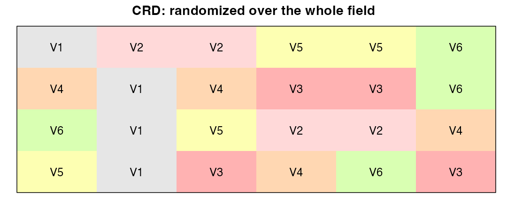
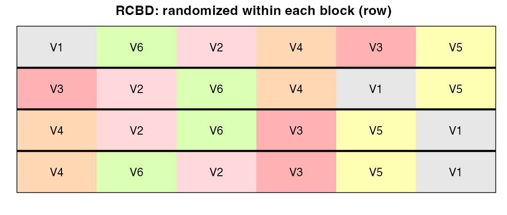
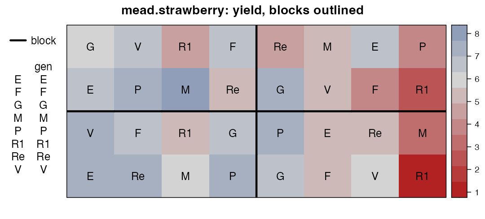
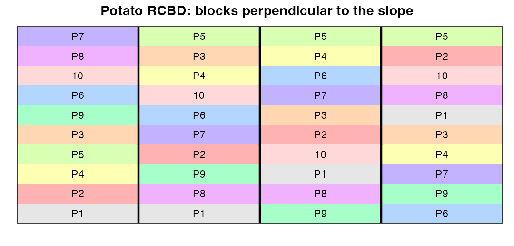

# Module 2 — From Randomization to Analysis: CRD and RCBD

> **Sub-course: Field Experiments in Agriculture & Plant Breeding**
> [← Module 1](01-field-heterogeneity.md) · [Sub-course home](README.md) · [Next: Module 3 — Latin Squares and Row–Column Designs →](03-latin-square-and-row-column.md)

---

## 🧭 Learning Objectives

After this module you will be able to:

1. Generate a reproducible **CRD** and **RCBD** layout and field book in R (`agricolae`, `FielDHub`).
2. Draw the layout with `desplot` and check it before going to the field.
3. Analyse an RCBD with the model that matches the design, with blocks as fixed or random effects.
4. Report variety means with `emmeans`, standard errors of differences and compact letter displays — and know their limits.

---

## 🎯 The Big Picture

The completely randomized design (CRD) and the randomized complete block design (RCBD) are
the workhorses of agricultural research. They are simple, which is exactly why mistakes in
them are so common: blocks laid out in the wrong direction, randomization done by hand, or
a correct RCBD analysed as if it were a CRD. This module goes through the whole workflow
**plan → randomize → map → field book → analyse → report**, using real data.

---

## 🧠 Core Intuition

| | CRD | RCBD |
|---|---|---|
| Randomization | treatments over all plots | treatments within each block |
| Use when | units homogeneous (growth chamber, small uniform area) | known gradient or grouping (field, days, benches) |
| Model | `y ~ treatment` | `y ~ block + treatment` |
| Error d.f. (t treatments, r reps) | t(r − 1) | (t − 1)(r − 1) |

The RCBD gives up r − 1 error degrees of freedom in exchange for removing block-to-block
variation from the error. In a heterogeneous field, that is almost always a good trade
(Module 1).

---

## 👁️ Visual Intuition — generating and mapping designs

### A CRD and an RCBD with `agricolae`


```r
library(agricolae)
library(desplot)
trts <- paste0("V", 1:6)

crd  <- design.crd(trt = trts, r = 4, seed = 11, serie = 0)$book
rcbd <- design.rcbd(trt = trts, r = 4, seed = 11, serie = 0)$book
names(crd)[3] <- names(rcbd)[3] <- "variety"
head(rcbd, 8)
```

```
#>   plots block variety
#> 1    11     1      V4
#> 2    12     1      V6
#> 3    13     1      V2
#> 4    14     1      V3
#> 5    15     1      V5
#> 6    16     1      V1
#> 7    21     2      V4
#> 8    22     2      V2
```

`agricolae` returns a **field book** (plot number, block, treatment). To map it we add
coordinates: here each block is one row of six plots in the field.


```r
crd$row  <- rep(1:4, each = 6);  crd$col  <- rep(1:6, times = 4)
rcbd$row <- as.integer(rcbd$block); rcbd$col <- ave(rcbd$plots, rcbd$block, FUN = seq_along)
```


```r
desplot(crd, variety ~ col * row, text = variety, cex = 1, show.key = FALSE,
        main = "CRD: randomized over the whole field")
desplot(rcbd, variety ~ col * row, out1 = block, text = variety, cex = 1, show.key = FALSE,
        main = "RCBD: randomized within each block (row)")
```

<div class="figure" style="text-align: center">

<p class="caption">plot of chunk maps</p>
</div>

**Check the map before sowing:** in the RCBD every block (thick outline) contains each
variety exactly once; in the CRD some varieties can cluster by chance.

### The same with `FielDHub`

`FielDHub` ([Murillo et al., 2021](https://doi.org/10.21105/joss.03122)) generates designs and field books for many layouts and has an
interactive Shiny app (`FielDHub::run_app()`).


```r
library(FielDHub)
fh <- RCBD(t = 6, reps = 4, l = 1, plotNumber = 101, seed = 11)
head(fh$fieldBook)
```

```
#>   ID LOCATION PLOT REP TREATMENT
#> 1  1     loc1  101   1        T4
#> 2  2     loc1  102   1        T6
#> 3  3     loc1  103   1        T2
#> 4  4     loc1  104   1        T3
#> 5  5     loc1  105   1        T5
#> 6  6     loc1  106   1        T1
```

> **Seeds matter.** Record the seed with the protocol. Anyone can then regenerate exactly
> your layout, and you can prove the randomization was done before the trial.

---

## 🔬 Worked Example — a strawberry variety trial (real RCBD)

`agridat::mead.strawberry`: 8 strawberry varieties in 4 blocks ([Wright, 2011](https://doi.org/10.32614/cran.package.agridat)).


```r
library(agridat)
m <- mead.strawberry
desplot(m, yield ~ col * row, out1 = block, text = gen, cex = 1,
        main = "mead.strawberry: yield, blocks outlined")
```

<div class="figure" style="text-align: center">

<p class="caption">plot of chunk strawberry-map</p>
</div>

### Step 1 — the wrong analysis (ignoring blocks)


```r
fit_crd <- lm(yield ~ gen, data = m)
anova(fit_crd)
```

```
#> Analysis of Variance Table
#> 
#> Response: yield
#>           Df Sum Sq Mean Sq F value  Pr(>F)  
#> gen        7 29.164  4.1662  2.2267 0.06797 .
#> Residuals 24 44.905  1.8710                  
#> ---
#> Signif. codes:  0 '***' 0.001 '**' 0.01 '*' 0.05 '.' 0.1 ' ' 1
```

### Step 2 — the analysis that matches the design


```r
fit_rcbd <- lm(yield ~ block + gen, data = m)
anova(fit_rcbd)
```

```
#> Analysis of Variance Table
#> 
#> Response: yield
#>           Df Sum Sq Mean Sq F value   Pr(>F)   
#> block      3 21.166  7.0554  6.2414 0.003372 **
#> gen        7 29.164  4.1662  3.6856 0.009412 **
#> Residuals 21 23.739  1.1304                    
#> ---
#> Signif. codes:  0 '***' 0.001 '**' 0.01 '*' 0.05 '.' 0.1 ' ' 1
```


Same 32 plots. Ignoring blocks, the residual mean square is
1.87 and varieties are not significant
(*p* = 0.068). With blocks it falls to
1.13, and the variety effect becomes clear
(*p* = 0.0094). **Blocking only helps if the analysis includes the
blocks.**

### Step 3 — blocks as random effects

When blocks are a sample of possible field positions, they can be modelled as random
([Piepho et al., 2003](https://doi.org/10.1046/j.1439-037x.2003.00049.x)). For a complete-block design the variety test is identical; the difference
matters for incomplete blocks (Module 5) and for predictions.


```r
library(lme4); library(lmerTest)
fit_mixed <- lmer(yield ~ gen + (1 | block), data = m)
anova(fit_mixed, ddf = "Kenward-Roger")
```

```
#> Type III Analysis of Variance Table with Kenward-Roger's method
#>     Sum Sq Mean Sq NumDF DenDF F value   Pr(>F)   
#> gen 29.164  4.1663     7    21  3.6856 0.009412 **
#> ---
#> Signif. codes:  0 '***' 0.001 '**' 0.01 '*' 0.05 '.' 0.1 ' ' 1
```

```r
VarCorr(fit_mixed)
```

```
#>  Groups   Name        Std.Dev.
#>  block    (Intercept) 0.8606  
#>  Residual             1.0632
```

Kenward–Roger degrees of freedom give accurate small-sample tests in mixed models
([Kenward & Roger, 1997](https://doi.org/10.2307/2533558); [Kuznetsova et al., 2017](https://doi.org/10.18637/jss.v082.i13)).

### Step 4 — means, differences and letters


```r
library(emmeans)
em <- emmeans(fit_rcbd, ~ gen)
em
```

```
#>  gen emmean    SE df lower.CL upper.CL
#>  E     6.55 0.532 21     5.44     7.66
#>  F     5.62 0.532 21     4.52     6.73
#>  G     6.55 0.532 21     5.44     7.66
#>  M     5.55 0.532 21     4.44     6.66
#>  P     6.50 0.532 21     5.39     7.61
#>  R1    3.50 0.532 21     2.39     4.61
#>  Re    5.58 0.532 21     4.47     6.68
#>  V     6.30 0.532 21     5.19     7.41
#> 
#> Results are averaged over the levels of: block 
#> Confidence level used: 0.95
```

```r
multcomp::cld(em, Letters = letters, adjust = "tukey")
```

```
#>  gen emmean    SE df lower.CL upper.CL .group
#>  R1    3.50 0.532 21     1.89     5.11  a    
#>  M     5.55 0.532 21     3.94     7.16  ab   
#>  Re    5.58 0.532 21     3.97     7.18  ab   
#>  F     5.62 0.532 21     4.02     7.23  ab   
#>  V     6.30 0.532 21     4.69     7.91   b   
#>  P     6.50 0.532 21     4.89     8.11   b   
#>  E     6.55 0.532 21     4.94     8.16   b   
#>  G     6.55 0.532 21     4.94     8.16   b   
#> 
#> Results are averaged over the levels of: block 
#> Confidence level used: 0.95 
#> Conf-level adjustment: sidak method for 8 estimates 
#> P value adjustment: tukey method for comparing a family of 8 estimates 
#> significance level used: alpha = 0.05 
#> NOTE: If two or more means share the same grouping symbol,
#>       then we cannot show them to be different.
#>       But we also did not show them to be the same.
```

Estimated marginal means ([Lenth, 2016](https://doi.org/10.18637/jss.v069.i01)) are the variety means adjusted for blocks. The letter
display ([Piepho, 2004](https://doi.org/10.1198/1061860043515)) summarizes all pairwise Tukey comparisons: varieties sharing a letter
are not significantly different.

> **Report more than letters.** Give the means with the **standard error of a difference
> (SED)** — here 0.752 — or confidence intervals. Letters hide
> effect sizes and invite reading "not different" as "equal".

---

## ⚠️ Common Misconceptions

| ❌ The misconception | ✅ What is actually true — and what to do |
|---|---|
| **"Blocks are just for show."** | If they are in the design, they must be in the model. |
| **"Random blocks give different variety tests in an RCBD."** | For complete balanced blocks, no. |
| **"Letters tell the whole story."** | They hide the size of differences and the uncertainty. |
| **"I'll randomize in the field by eye."** | Generate the layout with software and a recorded seed. |
| **"One location answers the question."** | It answers it *for that field and season* (Module 8). |

---

## 🧪 Spot the Flaw

> "Six fungicides were tested in an RCBD with 4 blocks. Data were analysed with one-way
> ANOVA, followed by Tukey tests. Fungicide C was not significantly different from the
> control, so it is ineffective."

<details>
<summary>▶ Diagnosis</summary>

1. One-way ANOVA ignores blocks — the analysis doesn't match the design (see the strawberry
   example).
2. "Not significantly different" ≠ "ineffective": report the estimated difference and its
   confidence interval. The trial may simply lack power for realistic effects.
</details>

---

## 🔎 The Reviewer's Perspective

- **"Show the field map and say how randomization was done (software, seed)."**
- **"Does the model include every design factor (blocks)?"**
- **"Are SEDs or CIs reported alongside letters?"**

---

## 🛠️ Design Challenge

Design an RCBD for 10 potato varieties with 4 replicates in a field with a slope running
east to west. Plots are 3 m × 6 m. Produce the layout and field book in R, and draw it.

<details>
<summary>▶ Model solution</summary>


```r
pot <- design.rcbd(trt = paste0("P", 1:10), r = 4, seed = 2026, serie = 2)$book
names(pot)[3] <- "variety"
# blocks run north-south (perpendicular to the east-west slope):
# each block is a column of 10 plots; blocks side by side along the slope
pot$col <- as.integer(pot$block)
pot$row <- ave(pot$plots, pot$block, FUN = seq_along)
desplot(pot, variety ~ col * row, out1 = block, text = variety, cex = 0.9, show.key = FALSE,
        main = "Potato RCBD: blocks perpendicular to the slope")
```

<div class="figure" style="text-align: center">

<p class="caption">plot of chunk challenge</p>
</div>

Each block occupies one band of the slope, so plots within a block are similar. Export the
field book with `write.csv(pot, "potato_fieldbook.csv")` and take it to the field.
</details>

---

## 🧑‍💻 Code-along Exercises

1. Analyse `agridat::rothamsted.oats` (`grain ~ block + trt`). Map it first. How much do blocks matter?
2. Generate a CRD and an RCBD for 8 treatments × 5 reps with `FielDHub::CRD()` and `FielDHub::RCBD()`; compare their field books.
3. Compute the relative efficiency of the RCBD versus a CRD for `mead.strawberry` from the two residual mean squares. What does it mean in "number of extra replicates"?

---

## ✅ Check Your Understanding

**⭐ Q1.** How many error degrees of freedom does an RCBD with 8 varieties and 4 blocks have?

**⭐ Q2.** Why record the random seed?

**⭐⭐ Q3.** In the strawberry example, why did the variety *p*-value change so much?

**⭐⭐ Q4.** When would you treat blocks as random?

**⭐⭐⭐ Q5.** A colleague's RCBD layout puts all four replicates of variety V1 in the first
plot of each block (the field edge). What went wrong, and what is the consequence?

---

## 📝 Sample Answers & Assessment

<details>
<summary>▶ Show sample answers</summary>

> **Q1 — Sample answer:** *"(8 − 1)(4 − 1) = 21."* — **✔ 10/10.**

> **Q2 — Sample answer:** *"So the layout can be reproduced."* — **✔ 9/10.** Also documents that randomization was genuine and done in advance.

> **Q3 — Sample answer:** *"Block variation was removed from the error."* — **✔ 10/10.** The residual MS fell from 1.87 to 1.13.

> **Q4 — Sample answer:** *"When blocks are random samples."* — **◑ 6/10.** More useful: when you want to recover inter-block information (incomplete blocks), predict for new field positions, or combine trials. For complete balanced blocks the variety test is the same either way.

> **Q5 — Sample answer:** *"It wasn't randomized within blocks; V1 is confounded with the edge."* — **✔ 10/10.** Edge effects (borders, light, wheel tracks) are now part of V1's mean.

**Rubric:** full credit links the analysis to the randomization structure.
</details>

---

## 🧾 Module Summary

| Concept | One-line takeaway |
|---|---|
| **Workflow** | Plan → randomize (seeded) → map → field book → analyse → report. |
| **CRD vs RCBD** | Block when the field or the work has known structure. |
| **Analysis** | `y ~ block + treatment` (or block random); never drop blocks. |
| **Reporting** | Means + SED/CIs; letters only as a summary. |

### 📇 Field Design Card — rows for this module

| Field | Your answer |
|---|---|
| Design (CRD/RCBD), seed, software | |
| Field map checked | |
| Model formula | |
| Reported quantities (means, SED, CIs) | |

---

## 🔗 Go Deeper

- Main course: [Ch. 4 — Randomization](../../chapters/04-randomization-and-blinding.md) · [Ch. 5 — Blocking](../../chapters/05-blocking-and-batches.md)
- 📘 Biostat: [Ch. 13 — ANOVA](https://github.com/MdRasheduz-zaman/biostatistics/blob/main/chapters/13-anova.md)
- Software: ([Felipe de Mendiburu, 2006](https://doi.org/10.32614/cran.package.agricolae); [Wright & Schmidt, 2015](https://doi.org/10.32614/cran.package.desplot); [Lenth & Piaskowski, 2017](https://doi.org/10.32614/cran.package.emmeans); [Bates et al., 2015](https://doi.org/10.18637/jss.v067.i01))

## 📚 References cited in this chapter

- Bates D, Mächler M, Bolker B, Walker S (2015). Fitting Linear Mixed-Effects Models Using lme4. *Journal of Statistical Software* 67. [doi:10.18637/jss.v067.i01](https://doi.org/10.18637/jss.v067.i01)
- Felipe de Mendiburu (2006). agricolae: Statistical Procedures for Agricultural Research. *CRAN: Contributed Packages*. [doi:10.32614/cran.package.agricolae](https://doi.org/10.32614/cran.package.agricolae)
- Kenward MG, Roger JH (1997). Small Sample Inference for Fixed Effects from Restricted Maximum Likelihood. *Biometrics* 53:983. [doi:10.2307/2533558](https://doi.org/10.2307/2533558)
- Kuznetsova A, Brockhoff PB, Christensen RHB (2017). lmerTest Package: Tests in Linear Mixed Effects Models. *Journal of Statistical Software* 82. [doi:10.18637/jss.v082.i13](https://doi.org/10.18637/jss.v082.i13)
- Lenth RV, Piaskowski J (2017). emmeans: Estimated Marginal Means, aka Least-Squares Means. *CRAN: Contributed Packages*. [doi:10.32614/cran.package.emmeans](https://doi.org/10.32614/cran.package.emmeans)
- Lenth RV (2016). Least-Squares Means: The R Package lsmeans. *Journal of Statistical Software* 69. [doi:10.18637/jss.v069.i01](https://doi.org/10.18637/jss.v069.i01)
- Murillo D, Gezan S, Heilman A, Walk T, Aparicio J, Horsley R (2021). FielDHub: A Shiny App for Design of Experiments in Life Sciences. *Journal of Open Source Software* 6:3122. [doi:10.21105/joss.03122](https://doi.org/10.21105/joss.03122)
- Piepho HP, Büchse A, Emrich K (2003). A Hitchhiker's Guide to Mixed Models for Randomized Experiments. *Journal of Agronomy and Crop Science* 189:310-322. [doi:10.1046/j.1439-037x.2003.00049.x](https://doi.org/10.1046/j.1439-037x.2003.00049.x)
- Piepho HP (2004). An Algorithm for a Letter-Based Representation of All-Pairwise Comparisons. *Journal of Computational and Graphical Statistics* 13:456-466. [doi:10.1198/1061860043515](https://doi.org/10.1198/1061860043515)
- Wright K, Schmidt P (2015). desplot: Plotting Field Plans for Agricultural Experiments. *CRAN: Contributed Packages*. [doi:10.32614/cran.package.desplot](https://doi.org/10.32614/cran.package.desplot)
- Wright K (2011). agridat: Agricultural Datasets. *CRAN: Contributed Packages*. [doi:10.32614/cran.package.agridat](https://doi.org/10.32614/cran.package.agridat)


---

[← Module 1](01-field-heterogeneity.md) · [Sub-course home](README.md) · [Next: Module 3 — Latin Squares and Row–Column Designs →](03-latin-square-and-row-column.md)
