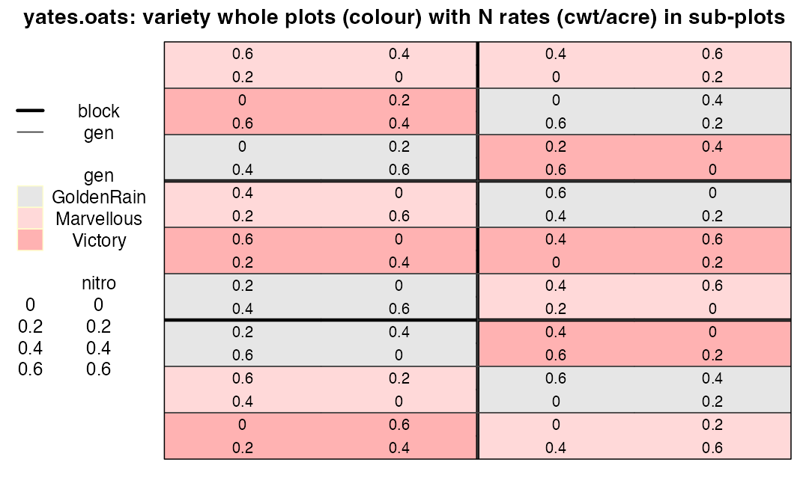
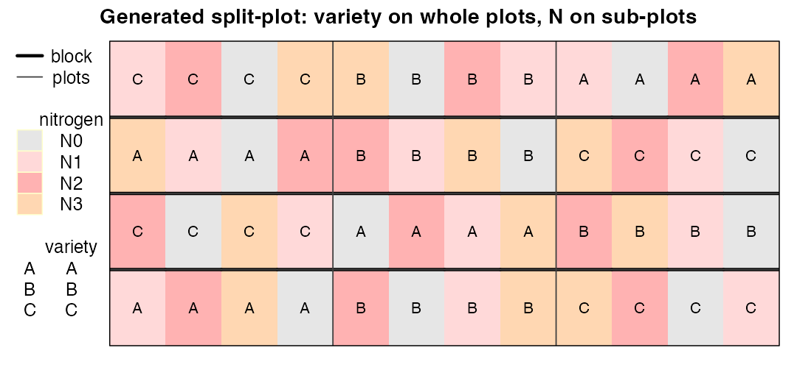
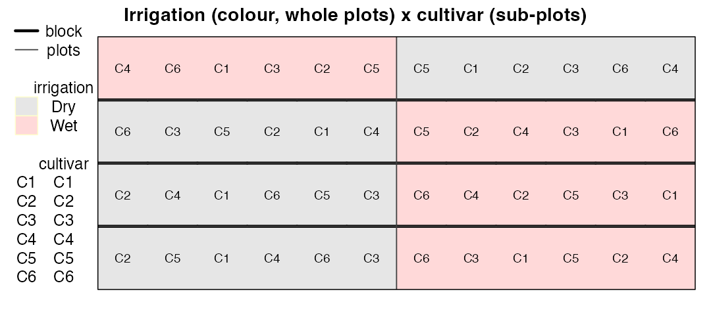

# Module 4 — Factorials, Split-Plots and Strip-Plots

> **Sub-course: Field Experiments in Agriculture & Plant Breeding**
> [← Module 3](03-latin-square-and-row-column.md) · [Sub-course home](README.md) · [Next: Module 5 — Incomplete Blocks: Lattice and α-Designs →](05-incomplete-blocks-alpha.md)

---

## 🧭 Learning Objectives

After this module you will be able to:

1. Recognize when practical constraints turn a factorial into a **split-plot** or **strip-plot**.
2. Generate and map split-plot layouts with `agricolae`/`FielDHub`, outlining whole plots with `desplot`.
3. Fit the correct mixed model with **two error strata**.
4. Show, with Yates's oats data, what goes wrong when a split-plot is analysed as an RCBD.

---

## 🎯 The Big Picture

Agronomic questions usually involve several factors — variety × nitrogen, tillage ×
sowing date, irrigation × cultivar. A full factorial randomizes every combination to
individual plots. In the field that is often impractical: irrigation, tillage or sowing
machinery work on **large strips**, while varieties or fertilizer rates can vary on small
plots. The result is a **split-plot**: one factor on large *whole plots*, another on
*sub-plots* within them ([Yates, 1935](https://doi.org/10.2307/2983638)). Each factor then has its own error term — and using
the wrong one is one of the most common analysis errors in agriculture.

---

## 🧠 Core Intuition

| Design | Factor A applied to | Factor B applied to | Error terms |
|---|---|---|---|
| Factorial RCBD | plots | plots | one |
| **Split-plot** | whole plots (within blocks) | sub-plots (within whole plots) | whole-plot error for A; sub-plot error for B and A×B |
| **Strip-plot (split-block)** | strips in one direction | strips in the other direction | three: for A, for B, for A×B |

**Consequences:** the whole-plot factor is estimated from **few, large units**, so it is
compared with *larger* error and fewer d.f.; the sub-plot factor and the interaction are
estimated **more precisely**. Choose the factor that needs most precision as the sub-plot factor.

---

## 👁️ Visual Intuition — Yates's oats

`agridat::yates.oats`: 3 oat varieties on whole plots, 4 nitrogen rates on sub-plots,
6 blocks ([Yates, 1935](https://doi.org/10.2307/2983638); [Wright, 2011](https://doi.org/10.32614/cran.package.agridat)).


```r
library(agridat); library(desplot)
y <- yates.oats
y$nf <- factor(y$nitro)
desplot(y, gen ~ col * row, out1 = block, out2 = gen, out2.gpar = list(col = "grey25", lwd = 1.2),
        text = nitro, shorten = "none", cex = 0.85,
        main = "yates.oats: variety whole plots (colour) with N rates (cwt/acre) in sub-plots")
```

<div class="figure" style="text-align: center">

<p class="caption">plot of chunk oats-map</p>
</div>

Thick lines are blocks; thin lines outline the variety whole plots (colours); the numbers are
the nitrogen rates randomized *within* each whole plot.

### Generating a split-plot


```r
library(agricolae)
sp <- design.split(trt1 = c("A", "B", "C"), trt2 = c("N0", "N1", "N2", "N3"),
                   r = 4, design = "rcbd", seed = 5, serie = 0)$book
names(sp)[4:5] <- c("variety", "nitrogen")
head(sp, 8)
```

```
#>   plots splots block variety nitrogen
#> 1     1      1     1       A       N1
#> 2     1      2     1       A       N2
#> 3     1      3     1       A       N3
#> 4     1      4     1       A       N0
#> 5     2      1     1       B       N2
#> 6     2      2     1       B       N0
#> 7     2      3     1       B       N1
#> 8     2      4     1       B       N3
```


```r
sp$row <- as.integer(sp$block)
num <- function(x) as.integer(as.character(x))
sp$col <- (num(sp$plots) - 1) %% 3 * 4 + num(sp$splots)   # 3 whole plots x 4 sub-plots per block
desplot(sp, nitrogen ~ col * row, out1 = block, out2 = plots, out2.gpar = list(col = "grey25", lwd = 1.2), text = variety, cex = 0.9,
        main = "Generated split-plot: variety on whole plots, N on sub-plots")
```

<div class="figure" style="text-align: center">

<p class="caption">plot of chunk split-map</p>
</div>

`FielDHub::split_plot()` and `FielDHub::strip_plot()` generate the same designs with field books.

---

## 🔬 Worked Example — the right and the wrong analysis

### The model that matches the design


```r
library(lme4); library(lmerTest); library(emmeans)
right <- lmer(yield ~ gen * nf + (1 | block) + (1 | block:gen), data = y)
anova(right, ddf = "Kenward-Roger")
```

```
#> Type III Analysis of Variance Table with Kenward-Roger's method
#>         Sum Sq Mean Sq NumDF DenDF F value    Pr(>F)    
#> gen      526.1   263.0     2    10  1.4853    0.2724    
#> nf     20020.5  6673.5     3    45 37.6857 2.458e-12 ***
#> gen:nf   321.8    53.6     6    45  0.3028    0.9322    
#> ---
#> Signif. codes:  0 '***' 0.001 '**' 0.01 '*' 0.05 '.' 0.1 ' ' 1
```

```r
VarCorr(right)
```

```
#>  Groups    Name        Std.Dev.
#>  block:gen (Intercept) 10.299  
#>  block     (Intercept) 14.645  
#>  Residual              13.307
```

The random term `block:gen` is the **whole plot**: it gives variety its own error stratum.

### The common mistake: analysing it as an RCBD factorial


```r
wrong <- lm(yield ~ block + gen * nf, data = y)
anova(wrong)
```

```
#> Analysis of Variance Table
#> 
#> Response: yield
#>           Df  Sum Sq Mean Sq F value    Pr(>F)    
#> block      5 15875.3  3175.1 12.4894 4.093e-08 ***
#> gen        2  1786.4   893.2  3.5134   0.03665 *  
#> nf         3 20020.5  6673.5 26.2510 1.135e-10 ***
#> gen:nf     6   321.7    53.6  0.2109   0.97187    
#> Residuals 55 13982.1   254.2                      
#> ---
#> Signif. codes:  0 '***' 0.001 '**' 0.01 '*' 0.05 '.' 0.1 ' ' 1
```


```r
cmp
```

```
#>              quantity correct_split_plot wrong_RCBD
#> 1    p-value, variety               0.27      0.037
#> 2  SED, variety means               7.08      4.600
#> 3 SED, nitrogen means               4.44      5.310
```

- The wrong analysis declares the **variety** effect significant (*p* = 0.037);
  the correct whole-plot test does not (*p* = 0.27).
- It **understates** the SED for varieties (4.6 instead of
  7.08): whole plots are pseudoreplicated by their sub-plots.
- It **overstates** the SED for nitrogen (5.31 instead of
  4.44): it fails to remove whole-plot variation from sub-plot
  comparisons.

So the wrong analysis is too optimistic about the hard-to-change factor and too pessimistic
about the easy one. This is the field version of pseudoreplication
([main course, Ch. 3](../../chapters/03-experimental-unit-and-replication.md)).


```r
emmeans(right, ~ nf)
```

```
#>  nf  emmean   SE   df lower.CL upper.CL
#>  0     79.4 7.17 6.79     62.3     96.5
#>  0.2   98.9 7.17 6.79     81.8    116.0
#>  0.4  114.2 7.17 6.79     97.2    131.3
#>  0.6  123.4 7.17 6.79    106.3    140.5
#> 
#> Results are averaged over the levels of: gen 
#> Degrees-of-freedom method: kenward-roger 
#> Confidence level used: 0.95
```

---

## ⚠️ Common Misconceptions

| ❌ The misconception | ✅ What is actually true — and what to do |
|---|---|
| **"A split-plot is just a factorial with a funny layout."** | It has two experimental units and two error terms. |
| **"Put the most important factor on whole plots."** | Usually the opposite: sub-plot factors are estimated more precisely. |
| **"Strip-plots are split-plots."** | Strip-plots have three strata; the interaction gets its own error. |
| **"Only agriculture has split-plots."** | Incubators × media, tanks × diets, cages × drugs — they are everywhere ([main course, Ch. 7](../../chapters/07-treatment-structures.md)). |

---

## 🧪 Spot the Flaw

> "Two tillage systems (strips, 1 per block) × 5 maize hybrids (randomized within strips),
> 4 blocks. Analysis: two-way ANOVA with block, tillage, hybrid and tillage × hybrid, all
> tested against the residual. Tillage: *p* < 0.001."

<details>
<summary>▶ Diagnosis</summary>

Tillage is a whole-plot factor with only 4 replicates (one strip per block). It must be tested
against the block × tillage (whole-plot) error with 3 d.f., not the sub-plot residual. The
reported *p* < 0.001 is almost certainly too small. Fit `(1 | block) + (1 | block:tillage)`.
</details>

---

## 🔎 The Reviewer's Perspective

- **"Which factor was applied to which unit?"** Ask for the map.
- **"Does the model contain the whole-plot error term?"**
- **"How many whole-plot replicates are there?"** Often surprisingly few.

---

## 🛠️ Design Challenge

You will test 2 irrigation regimes (drip lines serve whole strips) × 6 wheat cultivars, with
4 blocks. Generate a split-plot layout and write the model.

<details>
<summary>▶ Model solution</summary>


```r
irr <- design.split(trt1 = c("Dry", "Wet"), trt2 = paste0("C", 1:6), r = 4,
                    design = "rcbd", seed = 99, serie = 0)$book
names(irr)[4:5] <- c("irrigation", "cultivar")
irr$row <- as.integer(irr$block)
irr$col <- (num(irr$plots) - 1) %% 2 * 6 + num(irr$splots)
desplot(irr, irrigation ~ col * row, out1 = block, out2 = plots, out2.gpar = list(col = "grey25", lwd = 1.2), text = cultivar, cex = 0.8,
        main = "Irrigation (colour, whole plots) x cultivar (sub-plots)")
```

<div class="figure" style="text-align: center">

<p class="caption">plot of chunk challenge</p>
</div>

Model: `yield ~ irrigation * cultivar + (1 | block) + (1 | block:irrigation)`. With only
4 whole-plot replicates, consider more blocks if irrigation is the main interest.
</details>

---

## 🧑‍💻 Code-along Exercises

1. Analyse `agridat::little.splitblock` (strip-plot: harvest date × nitrogen). Write the three-stratum model.
2. Re-analyse `yates.oats` with `nlme::lme(yield ~ gen * nf, random = ~ 1 | block/gen)` and compare with `lmer`.
3. Using `FielDHub::split_plot()`, generate a design for 3 tillage × 4 cultivars × 5 reps and map it with `desplot`.

---

## ✅ Check Your Understanding

**⭐ Q1.** What makes a design a split-plot?

**⭐ Q2.** Which effects are tested against the sub-plot error?

**⭐⭐ Q3.** Explain why the wrong analysis of `yates.oats` made varieties look significant.

**⭐⭐ Q4.** How many experimental units does `yates.oats` have for variety? For nitrogen?

**⭐⭐⭐ Q5.** A greenhouse experiment has 2 temperatures (one chamber each) × 4 genotypes. What can and can't be concluded about temperature, and how would you fix the design?

---

## 📝 Sample Answers & Assessment

<details>
<summary>▶ Show sample answers</summary>

> **Q1 — Sample answer:** *"One factor on big plots, another on small plots inside them."* — **✔ 10/10.**

> **Q2 — Sample answer:** *"The sub-plot factor and the interaction."* — **✔ 10/10.**

> **Q3 — Sample answer:** *"It used the small sub-plot error for a whole-plot factor."* — **✔ 10/10.** The 4 sub-plots of each whole plot were treated as independent replicates of variety.

> **Q4 — Sample answer:** *"18 whole plots for variety, 72 sub-plots for nitrogen."* — **✔ 10/10.** (3 varieties × 6 blocks; 18 × 4.)

> **Q5 — Sample answer:** *"Nothing about temperature — one chamber per level."* — **✔ 9/10.** Temperature is confounded with chamber (n = 1 per level). Fix: repeat runs with temperatures re-randomized to chambers, giving several whole-plot replicates; analyse as a split-plot with run × chamber as whole plots.

**Rubric:** full credit names the experimental unit for each factor.
</details>

---

## 🧾 Module Summary

| Concept | One-line takeaway |
|---|---|
| **Split-plot** | Hard-to-change factor on whole plots, easy one on sub-plots. |
| **Two error strata** | Whole-plot factor tested against whole-plot error. |
| **Wrong analysis** | Overconfident on whole-plot factor, underconfident on sub-plot factor. |
| **Strip-plot** | Three strata; the interaction has its own error. |

### 📇 Field Design Card — rows for this module

| Field | Your answer |
|---|---|
| Factors and the unit each is applied to | |
| Number of whole-plot replicates | |
| Model with random terms for each stratum | |

---

## 🔗 Go Deeper

- Main course: [Ch. 7 — Treatment Structures](../../chapters/07-treatment-structures.md)
- Mixed models for designed experiments: ([Piepho et al., 2003](https://doi.org/10.1046/j.1439-037x.2003.00049.x); [Altman & Krzywinski, 2015](https://doi.org/10.1038/nmeth.3293))

## 📚 References cited in this chapter

- Altman N, Krzywinski M (2015). Split plot design. *Nature Methods* 12:165-166. [doi:10.1038/nmeth.3293](https://doi.org/10.1038/nmeth.3293)
- Piepho HP, Büchse A, Emrich K (2003). A Hitchhiker's Guide to Mixed Models for Randomized Experiments. *Journal of Agronomy and Crop Science* 189:310-322. [doi:10.1046/j.1439-037x.2003.00049.x](https://doi.org/10.1046/j.1439-037x.2003.00049.x)
- Wright K (2011). agridat: Agricultural Datasets. *CRAN: Contributed Packages*. [doi:10.32614/cran.package.agridat](https://doi.org/10.32614/cran.package.agridat)
- Yates F (1935). Complex Experiments. *Journal of the Royal Statistical Society Series B: Statistical Methodology* 2:181-223. [doi:10.2307/2983638](https://doi.org/10.2307/2983638)


---

[← Module 3](03-latin-square-and-row-column.md) · [Sub-course home](README.md) · [Next: Module 5 — Incomplete Blocks: Lattice and α-Designs →](05-incomplete-blocks-alpha.md)
