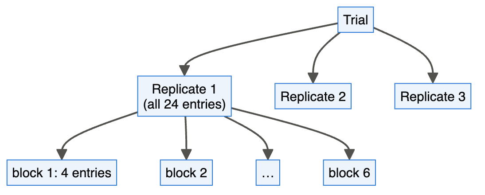
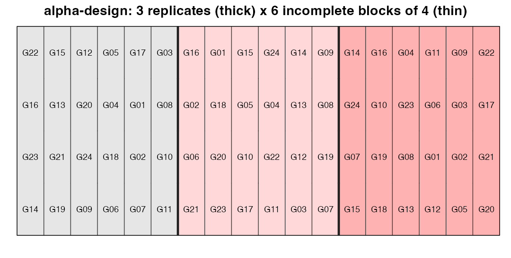
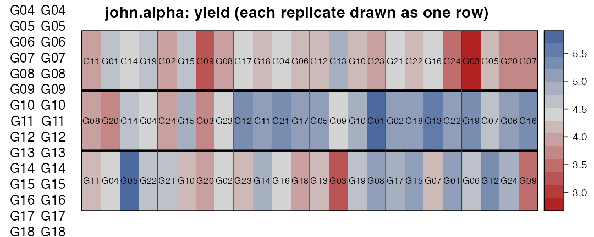

# Module 5 — Incomplete Blocks: Lattice and α-Designs

> **Sub-course: Field Experiments in Agriculture & Plant Breeding**
> [← Module 4](04-factorial-split-strip.md) · [Sub-course home](README.md) · [Next: Module 6 — Augmented and Partially Replicated Designs →](06-augmented-and-prep.md)

---

## 🧭 Learning Objectives

After this module you will be able to:

1. Explain why complete blocks fail when there are many entries.
2. Generate a **resolvable α-design** (`agricolae::design.alpha`, `FielDHub::alpha_lattice`) and read its efficiency factor.
3. Analyse an α-design with incomplete blocks as fixed or random effects (recovery of inter-block information).
4. Quantify, on real data, how much incomplete blocking improves precision.

---

## 🎯 The Big Picture

With 6 varieties, a block of 6 plots can be compact and homogeneous. With 60 breeding lines,
a "complete" block of 60 plots stretches across the field and is no longer homogeneous —
the whole point of blocking is lost. **Incomplete block designs** split each replicate into
small blocks that contain only *some* of the entries. **α-designs** ([PATTERSON & WILLIAMS, 1976](https://doi.org/10.1093/biomet/63.1.83)) are the
standard in plant breeding: they are *resolvable* (each replicate contains every entry once,
so the trial can still be analysed as an RCBD if needed) and exist for almost any number of
entries and block size ([Piepho et al., 2006](https://doi.org/10.1111/j.1439-0523.2006.01267.x)).

---

## 🧠 Core Intuition

- **Replicate** = a complete set of entries (like an RCBD block).
- **Incomplete block** = a small, compact group of plots *within* a replicate.
- Entries meet in blocks in a balanced-as-possible way, so comparisons between any two entries
  are estimated with similar precision.
- The **efficiency factor** E (0–1) measures how close the design is to the ideal; α-designs
  achieve high E for given block size.
- **Analysis:** blocks within replicates as **random** effects let the model "recover"
  information from comparisons between blocks — usually the most precise option
  ([Piepho et al., 2003](https://doi.org/10.1046/j.1439-037x.2003.00049.x)).



---

## 👁️ Visual Intuition — generating an α-design


```r
library(agricolae); library(desplot)
al <- design.alpha(trt = sprintf("G%02d", 1:24), k = 4, r = 3, seed = 5, serie = 0)
```

```
#> 
#> Alpha Design (0,1) - Serie  III 
#> 
#> Parameters Alpha Design
#> =======================
#> Treatmeans : 24
#> Block size : 4
#> Blocks     : 6
#> Replication: 3 
#> 
#> Efficiency factor
#> (E ) 0.7540984 
#> 
#> <<< Book >>>
```

```r
al$statistics
```

```
#>        treatments blocks Efficiency
#> values         24      6  0.7540984
```

```r
bk <- al$book
names(bk)[4] <- "entry"
head(bk)
```

```
#>   plots cols block entry replication
#> 1    11    1     1   G14           1
#> 2    12    2     1   G23           1
#> 3    13    3     1   G16           1
#> 4    14    4     1   G22           1
#> 5    15    1     2   G19           1
#> 6    16    2     2   G21           1
```

24 entries, block size k = 4, 3 replicates → 6 blocks per replicate; efficiency factor
E = 0.754.


```r
bk$col <- as.integer(as.character(bk$block))          # blocks are numbered 1-18 across replicates
bk$row <- as.integer(as.character(bk$cols))
desplot(bk, replication ~ col * row, out1 = replication, out2 = block,
        out2.gpar = list(col = "grey25", lwd = 1), text = entry, cex = 0.75, shorten = "no", show.key = FALSE,
        main = "alpha-design: 3 replicates (thick) x 6 incomplete blocks of 4 (thin)")
```

<div class="figure" style="text-align: center">

<p class="caption">plot of chunk alpha-map</p>
</div>

`FielDHub::alpha_lattice(t = 24, k = 4, r = 3, ...)` generates the same kind of design with a
full field book.

---

## 🔬 Worked Example — `john.alpha`

`agridat::john.alpha`: 24 oat varieties in an α-design, 3 replicates, blocks of 4.


```r
library(agridat)
j <- john.alpha
# the trial is one strip of 72 plots; draw each replicate as a row for readability
j$position <- (j$row - 1) %% 24 + 1
j$replicate <- as.integer(j$rep)
desplot(j, yield ~ position * replicate, out1 = rep, out2 = block, out2.gpar = list(col = "grey25"),
        text = gen, cex = 0.7, shorten = "no", main = "john.alpha: yield (each replicate drawn as one row)")
```

<div class="figure" style="text-align: center">

<p class="caption">plot of chunk john-map</p>
</div>

Three analyses of the same data:


```r
library(lme4); library(lmerTest); library(emmeans)
f_rcbd   <- lm(yield ~ rep + gen, data = j)                       # ignore incomplete blocks
f_fixed  <- lm(yield ~ rep + rep:block + gen, data = j)            # blocks fixed (intra-block)
f_random <- lmer(yield ~ rep + gen + (1 | rep:block), data = j)    # blocks random (recovery)
mean_sed <- function(f) mean(summary(pairs(emmeans(f, ~ gen)))$SE)
sed <- c(rcbd = mean_sed(f_rcbd), fixed_blocks = mean_sed(f_fixed), random_blocks = mean_sed(f_random))
round(sed, 3)
```

```
#>          rcbd  fixed_blocks random_blocks 
#>         0.300         0.277         0.270
```

```r
VarCorr(f_random)
```

```
#>  Groups    Name        Std.Dev.
#>  rep:block (Intercept) 0.24889 
#>  Residual              0.29193
```

- Ignoring the incomplete blocks gives an average SED of 0.3.
- Blocks as random effects: 0.27 — a
  10% reduction, equivalent to about
  23% more replication for free.
- The block variance (0.062) is comparable
  to the residual variance (0.085): the
  small blocks captured real field variation.


```r
head(as.data.frame(emmeans(f_random, ~ gen)), 6)
```

```
#>  gen   emmean        SE    df lower.CL upper.CL
#>  G01 5.107700 0.1990122 44.33 4.706700 5.508699
#>  G02 4.478532 0.1990122 44.33 4.077533 4.879531
#>  G03 3.499200 0.1990122 44.33 3.098200 3.900199
#>  G04 4.490095 0.1990122 44.33 4.089095 4.891094
#>  G05 5.037210 0.1989049 44.28 4.636417 5.438004
#>  G06 4.536662 0.1989049 44.28 4.135868 4.937456
#> 
#> Results are averaged over the levels of: rep 
#> Degrees-of-freedom method: kenward-roger 
#> Confidence level used: 0.95
```

---

## ⚠️ Common Misconceptions

| ❌ The misconception | ✅ What is actually true — and what to do |
|---|---|
| **"Incomplete blocks lose information because entries aren't together."** | The design and mixed model recover it; precision usually *improves*. |
| **"Analyse as an RCBD — it's simpler."** | Valid (resolvable design) but wastes precision. |
| **"Block size doesn't matter."** | Small, compact blocks follow the field's micro-variation; aim for blocks of roughly 4–10 plots. |
| **"Any arrangement of small groups is an α-design."** | Entries must be allocated to blocks by a proper α-array to keep comparisons balanced. |

---

## 🧪 Spot the Flaw

> "120 lines were tested in 2 replicates; each replicate was one long strip of 120 plots
> (a complete block). Analysis: RCBD."

<details>
<summary>▶ Diagnosis</summary>

A 120-plot block is far too large to be homogeneous. Use a resolvable α-design (e.g. blocks of
8–10 plots) or a row–column design, and analyse with incomplete blocks random; add spatial
analysis (Module 7).
</details>

---

## 🔎 The Reviewer's Perspective

- **"What was the block size, and is the design a proper α/lattice design?"**
- **"Were incomplete blocks in the model (preferably random)?"**
- **"What is the design's efficiency factor?"**

---

## 🛠️ Design Challenge

Design a trial for 50 wheat lines, 2 replicates, with plots in a field of 10 rows × 10 columns.

<details>
<summary>▶ Model solution</summary>


```r
ch <- design.alpha(trt = sprintf("L%02d", 1:50), k = 5, r = 2, seed = 77, serie = 0)
```

```
#> 
#> Alpha Design (0,1) - Serie  I 
#> 
#> Parameters Alpha Design
#> =======================
#> Treatmeans : 50
#> Block size : 5
#> Blocks     : 10
#> Replication: 2 
#> 
#> Efficiency factor
#> (E ) 0.7313433 
#> 
#> <<< Book >>>
```

```r
ch$statistics
```

```
#>        treatments blocks Efficiency
#> values         50     10  0.7313433
```

Blocks of 5 plots → 10 blocks per replicate; each replicate fills half the field (5 rows ×
10 columns, i.e. each block a compact 1 × 5 segment). Analyse
`yield ~ rep + gen + (1 | rep:block)`, and record row/column for spatial analysis.
</details>

---

## 🧑‍💻 Code-along Exercises

1. Analyse `agridat::burgueno.alpha` with the three models. Is the gain from blocks similar?
2. Compare efficiency factors of `design.alpha` for 24 entries with k = 3, 4, 6, 8.
3. Fit genotypes as random in `john.alpha` and compute heritability on an entry-mean basis.

---

## ✅ Check Your Understanding

**⭐ Q1.** What does "resolvable" mean for an incomplete block design?

**⭐ Q2.** What does the efficiency factor measure?

**⭐⭐ Q3.** Why does treating incomplete blocks as random usually give the smallest SED?

**⭐⭐ Q4.** For 30 entries and 3 replicates, give a sensible block size and number of blocks.

**⭐⭐⭐ Q5.** A breeder asks why the variety means from your α-design analysis differ from the
raw averages. Explain.

---

## 📝 Sample Answers & Assessment

<details>
<summary>▶ Show sample answers</summary>

> **Q1 — Sample answer:** *"Blocks group into complete replicates."* — **✔ 10/10.**

> **Q2 — Sample answer:** *"How efficient the design is."* — **◑ 5/10.** More precisely: the average variance of treatment differences in an ideal (complete-block) design relative to this design, given the same error variance; 1 = no loss from incompleteness.

> **Q3 — Sample answer:** *"It uses both within-block and between-block information."* — **✔ 10/10.**

> **Q4 — Sample answer:** *"Blocks of 5 or 6 → 6 or 5 blocks per replicate."* — **✔ 10/10.**

> **Q5 — Sample answer:** *"They are adjusted for the blocks they happened to be in."* — **✔ 10/10.** Entries in poor blocks are adjusted upwards, entries in good blocks downwards — fairer comparisons.

**Rubric:** connect block size to field homogeneity and analysis to recovery of information.
</details>

---

## 🧾 Module Summary

| Concept | One-line takeaway |
|---|---|
| **Problem** | Complete blocks become heterogeneous with many entries. |
| **α-designs** | Resolvable incomplete blocks for any number of entries. |
| **Analysis** | `rep + gen + (1 \| rep:block)` — recover inter-block information. |
| **Gain** | Here a 10% smaller SED for no extra plots. |

### 📇 Field Design Card — rows for this module

| Field | Your answer |
|---|---|
| Entries, replicates, block size | |
| Efficiency factor | |
| Model (blocks fixed/random) | |

---

## 🔗 Go Deeper

- Main course: [Ch. 19 — Breeding and Field Trials](../../chapters/19-breeding-and-field-trials.md)
- Software: ([Felipe de Mendiburu, 2006](https://doi.org/10.32614/cran.package.agricolae); [Murillo et al., 2021](https://doi.org/10.21105/joss.03122))

## 📚 References cited in this chapter

- Felipe de Mendiburu (2006). agricolae: Statistical Procedures for Agricultural Research. *CRAN: Contributed Packages*. [doi:10.32614/cran.package.agricolae](https://doi.org/10.32614/cran.package.agricolae)
- Murillo D, Gezan S, Heilman A, Walk T, Aparicio J, Horsley R (2021). FielDHub: A Shiny App for Design of Experiments in Life Sciences. *Journal of Open Source Software* 6:3122. [doi:10.21105/joss.03122](https://doi.org/10.21105/joss.03122)
- PATTERSON HD, WILLIAMS ER (1976). A new class of resolvable incomplete block designs. *Biometrika* 63:83-92. [doi:10.1093/biomet/63.1.83](https://doi.org/10.1093/biomet/63.1.83)
- Piepho HP, Büchse A, Emrich K (2003). A Hitchhiker's Guide to Mixed Models for Randomized Experiments. *Journal of Agronomy and Crop Science* 189:310-322. [doi:10.1046/j.1439-037x.2003.00049.x](https://doi.org/10.1046/j.1439-037x.2003.00049.x)
- Piepho HP, Büchse A, Truberg B (2006). On the use of multiple lattice designs and α‐designs in plant breeding trials. *Plant Breeding* 125:523-528. [doi:10.1111/j.1439-0523.2006.01267.x](https://doi.org/10.1111/j.1439-0523.2006.01267.x)


---

[← Module 4](04-factorial-split-strip.md) · [Sub-course home](README.md) · [Next: Module 6 — Augmented and Partially Replicated Designs →](06-augmented-and-prep.md)
