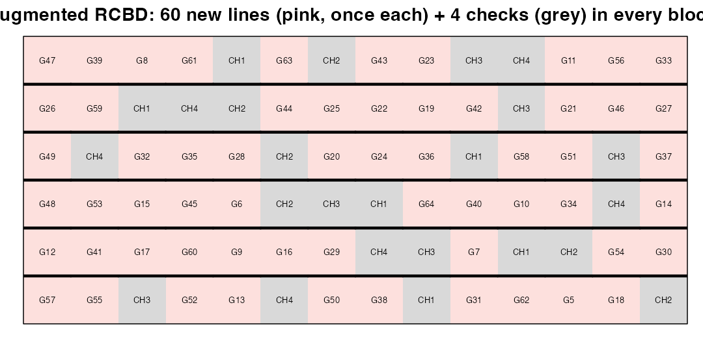
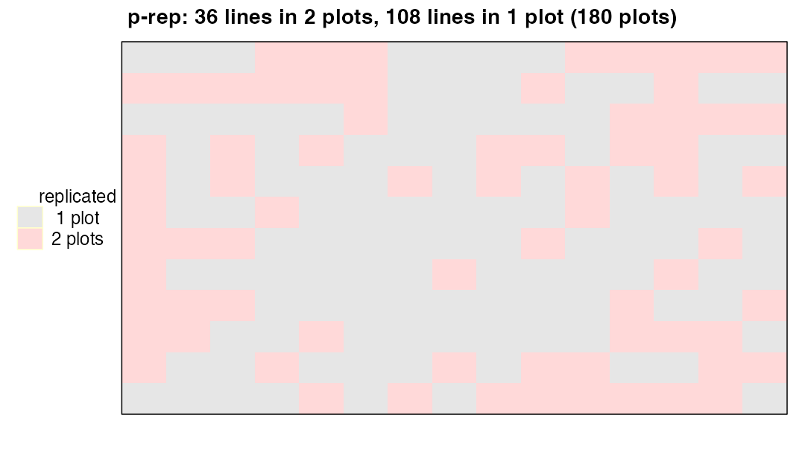
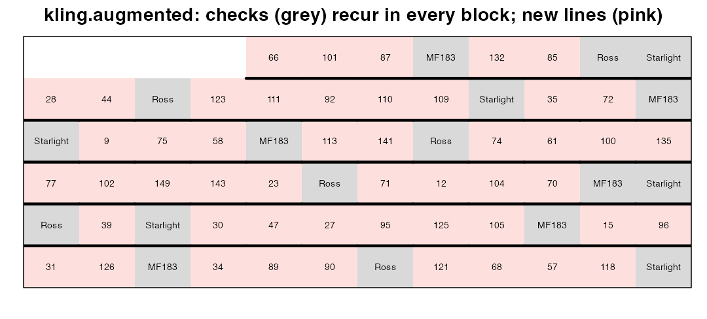
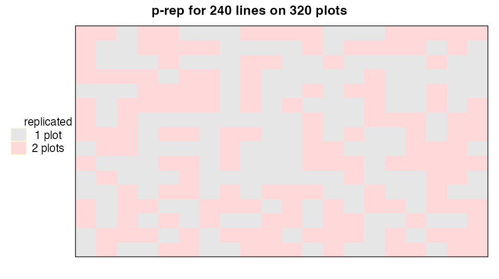

# Module 6 — Early-Generation Trials: Augmented and Partially Replicated Designs

> **Sub-course: Field Experiments in Agriculture & Plant Breeding**
> [← Module 5](05-incomplete-blocks-alpha.md) · [Sub-course home](README.md) · [Next: Module 7 — Spatial Analysis →](07-spatial-analysis.md)

---

## 🧭 Learning Objectives

After this module you will be able to:

1. Explain the seed-limitation problem of early-generation breeding trials.
2. Generate **augmented RCBD**, **diagonal-check** and **p-rep** layouts with `FielDHub`.
3. Analyse an augmented design and adjust unreplicated entries using check plots.
4. Compare augmented and p-rep designs and choose between them.

---

## 🎯 The Big Picture

Early in a breeding programme you may have **hundreds of new lines with seed for only one
plot each**. Without replication there is no error estimate and no way to separate a good line
from a good spot in the field. Two classic solutions:

- **Augmented designs** ([Federer & Raghavarao, 1975](https://doi.org/10.2307/2529707)): unreplicated new lines + **replicated check varieties**
  in every block. Checks estimate block effects and error; new lines are adjusted for the
  block they fell in.
- **Partially replicated (p-rep) designs** ([Cullis et al., 2006](https://doi.org/10.1198/108571106x154443)): replicate a *fraction* of the new
  lines (e.g. 20–30%) instead of spending plots on checks. Combined with spatial analysis
  they are usually more efficient ([Williams et al., 2011](https://doi.org/10.1002/bimj.201000102)).

---

## 🧠 Core Intuition

| | Augmented | p-rep |
|---|---|---|
| Replicated material | a few checks, many times | a fraction of the test lines, twice |
| Information used | block adjustment from checks | genetic + spatial information from replicated lines |
| Analysis | `y ~ block + entry` (or blocks random) | mixed model, entries random, spatial terms |
| Strength | simple, transparent | more information on the lines you care about |

---

## 👁️ Visual Intuition — three layouts from `FielDHub`


```r
library(FielDHub); library(desplot)
aug <- RCBD_augmented(lines = 60, checks = 4, b = 6, l = 1, planter = "serpentine",
                      plotNumber = 101, seed = 3)
fb <- aug$fieldBook
fb$type <- ifelse(fb$CHECKS > 0, "check", "new line")
head(fb)
```

```
#>   ID  EXPT LOCATION YEAR PLOT ROW COLUMN CHECKS BLOCK ENTRY TREATMENT     type
#> 1  1 Expt1        1 2026  101   1      1      0     1    57       G57 new line
#> 2  2 Expt1        1 2026  102   1      2      0     1    55       G55 new line
#> 3  3 Expt1        1 2026  103   1      3      1     1     3       CH3    check
#> 4  4 Expt1        1 2026  104   1      4      0     1    52       G52 new line
#> 5  5 Expt1        1 2026  105   1      5      0     1    13       G13 new line
#> 6  6 Expt1        1 2026  106   1      6      1     1     4       CH4    check
```

```r
desplot(fb, type ~ COLUMN * ROW, out1 = BLOCK, text = TREATMENT, cex = 0.55, shorten = "no",
        show.key = FALSE, col.regions = c("grey85", "#fde0dd"),
        main = "Augmented RCBD: 60 new lines (pink, once each) + 4 checks (grey) in every block")
```

<div class="figure" style="text-align: center">

<p class="caption">plot of chunk aug-gen</p>
</div>


```r
pr <- partially_replicated(nrows = 12, ncols = 15, repGens = c(36, 108), repUnits = c(2, 1),
                           planter = "serpentine", l = 1, plotNumber = 1, seed = 3)
pfb <- pr$fieldBook
pfb$replicated <- ifelse(pfb$TREATMENT %in% pfb$TREATMENT[duplicated(pfb$TREATMENT)], "2 plots", "1 plot")
desplot(pfb, replicated ~ COLUMN * ROW, main = "p-rep: 36 lines in 2 plots, 108 lines in 1 plot (180 plots)")
```

<div class="figure" style="text-align: center">

<p class="caption">plot of chunk prep-gen</p>
</div>

```r
table(table(pfb$TREATMENT))
```

```
#> 
#>   1   2 
#> 108  36
```

`FielDHub::diagonal_arrangement()` places checks systematically along diagonals, and
`FielDHub::optimized_arrangement()`/`sparse_allocation()` extend these ideas to multi-location
programmes; the Shiny app (`run_app()`) lets you explore them interactively ([Murillo et al., 2021](https://doi.org/10.21105/joss.03122)).

---

## 🔬 Worked Example — analysing an augmented trial (`kling.augmented`)

`agridat::kling.augmented`: 50 new lines (one plot each) and 3 checks repeated in each of 6 blocks.


```r
library(agridat)
k <- kling.augmented
reps <- table(k$gen)
k$type <- ifelse(reps[as.character(k$gen)] > 1, "check", "new")
table(k$type)
```

```
#> 
#> check   new 
#>    18    50
```


```r
desplot(k, type ~ col * row, out1 = block, text = name, cex = 0.6, shorten = "no",
        show.key = FALSE, col.regions = c("grey85", "#fde0dd"),
        main = "kling.augmented: checks (grey) recur in every block; new lines (pink)")
```

<div class="figure" style="text-align: center">

<p class="caption">plot of chunk kling-map</p>
</div>


```r
library(emmeans)
fit <- lm(tsw ~ block + gen, data = k)       # checks drive the block estimates
anova(fit)
```

```
#> Analysis of Variance Table
#> 
#> Response: tsw
#>           Df  Sum Sq Mean Sq F value    Pr(>F)    
#> block      5  1.7112 0.34224  4.9028 0.0158408 *  
#> gen       52 27.5185 0.52920  7.5811 0.0007876 ***
#> Residuals 10  0.6981 0.06981                      
#> ---
#> Signif. codes:  0 '***' 0.001 '**' 0.01 '*' 0.05 '.' 0.1 ' ' 1
```

```r
adj <- as.data.frame(emmeans(fit, ~ gen))
raw <- aggregate(tsw ~ gen, data = k, FUN = mean)
cmp <- merge(raw, adj[, c("gen", "emmean", "SE")], by = "gen")
cmp$shift <- round(cmp$emmean - cmp$tsw, 2)
head(cmp[order(-abs(cmp$shift)), ], 6)
```

```
#>    gen   tsw    emmean       SE shift
#> 3  G03  9.95 10.717222 0.298657  0.77
#> 5  G05 10.05 10.817222 0.298657  0.77
#> 7  G07  8.81  9.577222 0.298657  0.77
#> 11 G11 10.98 11.747222 0.298657  0.77
#> 13 G13  9.84 10.607222 0.298657  0.77
#> 30 G30 11.01 11.777222 0.298657  0.77
```

The adjusted means move new lines up or down according to how their block performed
(largest shift: 0.77 g). The SE of a new line
(0.3) is much larger than that of a
check (0.11): one plot carries little
information, which is why selections from augmented trials must be confirmed in replicated
trials.

---

## ⚠️ Common Misconceptions

| ❌ The misconception | ✅ What is actually true — and what to do |
|---|---|
| **"Checks are only for comparison with new lines."** | In augmented designs their main role is to estimate field and error variation. |
| **"Unreplicated lines can be ranked directly."** | Rank adjusted values, and accept that the ranking is uncertain. |
| **"More checks are always better."** | Each check plot is a plot not used for a new line; p-rep designs often use the space better. |
| **"p-rep needs no spatial analysis."** | It relies on it. |

---

## 🧪 Spot the Flaw

> "300 F4 lines were planted in one plot each, in seed-packet order. The best 30 by raw yield
> were advanced."

<details>
<summary>▶ Diagnosis</summary>

No replication, no checks, no randomization: seed-packet order is likely correlated with
pedigree/sowing batch, and raw yields mix line effects with field position. Use an augmented or
p-rep design with randomization, record coordinates, analyse with block/spatial adjustment, and
treat the selection as a first screen.
</details>

---

## 🔎 The Reviewer's Perspective

- **"How many checks/replicated lines, and how were they placed?"**
- **"Were new-line means adjusted, and what are their standard errors?"**
- **"Is there a confirmation stage?"**

---

## 🛠️ Design Challenge

You have 240 new lines with seed for 1–2 plots, 4 checks, and a field of 16 rows × 20 columns
(320 plots). Propose and generate a design.

<details>
<summary>▶ Model solution</summary>

A p-rep design: 80 lines in 2 plots (160 plots) + 160 lines in 1 plot = 320 plots — no space for
checks, so the 4 checks can be included among the replicated entries.


```r
ch <- partially_replicated(nrows = 16, ncols = 20, repGens = c(80, 160), repUnits = c(2, 1),
                           planter = "serpentine", l = 1, plotNumber = 1, seed = 2026)
cfb <- ch$fieldBook
cfb$replicated <- ifelse(cfb$TREATMENT %in% cfb$TREATMENT[duplicated(cfb$TREATMENT)], "2 plots", "1 plot")
desplot(cfb, replicated ~ COLUMN * ROW, main = "p-rep for 240 lines on 320 plots")
```

<div class="figure" style="text-align: center">

<p class="caption">plot of chunk challenge</p>
</div>

Analyse with lines random and a spatial model (Module 7).
</details>

---

## 🧑‍💻 Code-along Exercises

1. Fit `kling.augmented` with blocks random (`lmer(tsw ~ gen + (1 | block))`). Do the rankings change?
2. Generate a diagonal-check design with `FielDHub::diagonal_arrangement()` and map it.
3. Explore `agridat::belamkar.augmented` (multi-location augmented trials) with `desplot(..., | loc)`.

---

## ✅ Check Your Understanding

**⭐ Q1.** What problem do augmented designs solve?

**⭐ Q2.** What do the checks estimate?

**⭐⭐ Q3.** Why is a new line's SE larger than a check's SE?

**⭐⭐ Q4.** How does a p-rep design differ from an augmented design?

**⭐⭐⭐ Q5.** Argue for or against advancing the top 10% of lines from an augmented trial directly to variety release trials.

---

## 📝 Sample Answers & Assessment

<details>
<summary>▶ Show sample answers</summary>

> **Q1 — Sample answer:** *"Testing many lines with seed for one plot."* — **✔ 10/10.**

> **Q2 — Sample answer:** *"Block effects and the error variance."* — **✔ 10/10.**

> **Q3 — Sample answer:** *"One plot vs six plots."* — **✔ 10/10.**

> **Q4 — Sample answer:** *"p-rep replicates some test lines instead of checks."* — **✔ 10/10.**

> **Q5 — Sample answer:** *"Against — the rankings are noisy."* — **✔ 9/10.** With one plot per line, many of the top 10% are there by luck (regression to the mean). Advance them to a replicated, multi-location stage first (staged screening, [main course Ch. 14](../../chapters/14-screening-designs.md)).

**Rubric:** link one-plot uncertainty to the need for confirmation.
</details>

---

## 🧾 Module Summary

| Concept | One-line takeaway |
|---|---|
| **Augmented** | Unreplicated lines + replicated checks per block. |
| **p-rep** | Replicate a fraction of test lines; analyse spatially. |
| **Adjustment** | Means adjusted for blocks/space; SEs reflect one-plot uncertainty. |
| **Selection** | First screen only; confirm in replicated trials. |

### 📇 Field Design Card — rows for this module

| Field | Your answer |
|---|---|
| Seed per line; number of lines | |
| Design (augmented/diagonal/p-rep) | |
| Fraction replicated or number of check plots | |
| Confirmation stage | |

---

## 🔗 Go Deeper

- Main course: [Ch. 14 — Screening Designs](../../chapters/14-screening-designs.md)
- Software: ([Murillo et al., 2021](https://doi.org/10.21105/joss.03122); [Wright & Schmidt, 2015](https://doi.org/10.32614/cran.package.desplot))

## 📚 References cited in this chapter

- Cullis BR, Smith AB, Coombes NE (2006). On the design of early generation variety trials with correlated data. *Journal of Agricultural, Biological, and Environmental Statistics* 11:381-393. [doi:10.1198/108571106x154443](https://doi.org/10.1198/108571106x154443)
- Federer WT, Raghavarao D (1975). On Augmented Designs. *Biometrics* 31:29. [doi:10.2307/2529707](https://doi.org/10.2307/2529707)
- Murillo D, Gezan S, Heilman A, Walk T, Aparicio J, Horsley R (2021). FielDHub: A Shiny App for Design of Experiments in Life Sciences. *Journal of Open Source Software* 6:3122. [doi:10.21105/joss.03122](https://doi.org/10.21105/joss.03122)
- Williams E, Piepho HP, Whitaker D (2011). Augmented p-rep designs. *Biometrical Journal* 53:19-27. [doi:10.1002/bimj.201000102](https://doi.org/10.1002/bimj.201000102)
- Wright K, Schmidt P (2015). desplot: Plotting Field Plans for Agricultural Experiments. *CRAN: Contributed Packages*. [doi:10.32614/cran.package.desplot](https://doi.org/10.32614/cran.package.desplot)


---

[← Module 5](05-incomplete-blocks-alpha.md) · [Sub-course home](README.md) · [Next: Module 7 — Spatial Analysis →](07-spatial-analysis.md)
