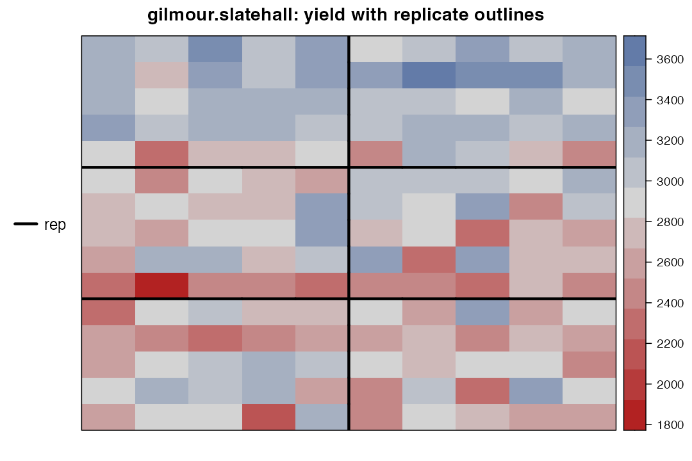
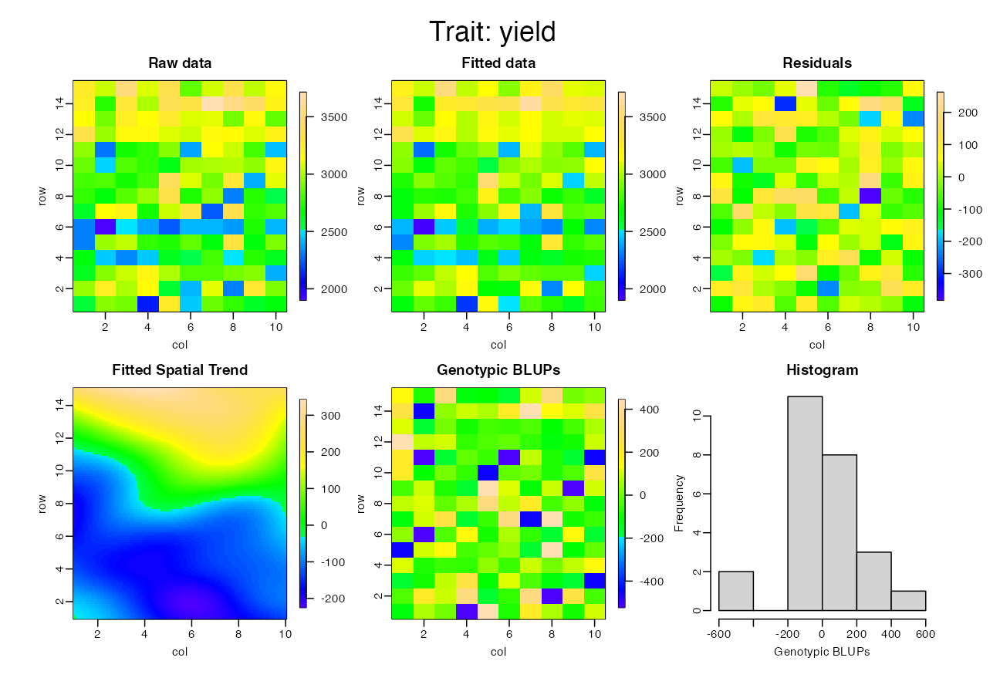

# Module 7 — Spatial Analysis: Modelling What Blocks Miss

> **Sub-course: Field Experiments in Agriculture & Plant Breeding**
> [← Module 6](06-augmented-and-prep.md) · [Sub-course home](README.md) · [Next: Module 8 — Multi-Environment Trials →](08-multi-environment-trials.md)

---

## 🧭 Learning Objectives

After this module you will be able to:

1. Explain why blocks capture only part of field variation, and what spatial models add.
2. Fit a 2-D P-spline spatial model with `SpATS` and read its spatial trend.
3. Compare spatial and block-based analyses by heritability and standard errors.
4. Plan designs (coordinates, compact blocks, p-rep) that make spatial analysis effective.

---

## 🎯 The Big Picture

Blocks remove *large-scale, block-shaped* variation. Real fields also have smooth trends,
patches and row/column effects from machinery (Module 1). **Spatial analysis** models the
field surface directly, using each plot's row and column coordinates: classic approaches use
correlated errors between neighbours (e.g. separable autoregressive models ([Gilmour et al., 1997](https://doi.org/10.2307/1400446))),
modern ones fit a smooth 2-D surface with P-splines (SpATS ([Rodríguez-Álvarez et al., 2018](https://doi.org/10.1016/j.spasta.2017.10.003))). Spatial
analysis does not replace randomization and blocking — it complements them, and it is
essential for p-rep and augmented designs ([Cullis et al., 2006](https://doi.org/10.1198/108571106x154443); [SMITH et al., 2005](https://doi.org/10.1017/s0021859605005587)).

> **Design requirement:** record **row and column for every plot**. Without coordinates, no
> spatial analysis is possible.

---

## 🧠 Core Intuition

$$y_{ij} = \mu + g_i + f(\text{row}, \text{col}) + r_{\text{row}} + c_{\text{col}} + \varepsilon_{ij}$$

- $g_i$: genotype effect (what we want).
- $f(\cdot)$: smooth spatial trend (fertility gradients, patches).
- $r, c$: random row and column effects (machinery, harvest direction).
- $\varepsilon$: independent plot noise.

---

## 👁️ Visual Intuition — the Slate Hall trial

`agridat::gilmour.slatehall`: 25 wheat varieties, 6 replicates, 15 rows × 10 columns.


```r
library(agridat); library(desplot)
s <- gilmour.slatehall
desplot(s, yield ~ col * row, out1 = rep, main = "gilmour.slatehall: yield with replicate outlines")
```

<div class="figure" style="text-align: center">

<p class="caption">plot of chunk slate-map</p>
</div>

Look for trends that cross replicate boundaries — that is variation blocks cannot remove.

---

## 🔬 Worked Example — blocks only vs. spatial model

### Block-based analysis (RCBD on replicates)


```r
library(lme4)
f_g <- lmer(yield ~ (1 | gen) + (1 | rep), data = s)
vc  <- as.data.frame(VarCorr(f_g))
s2g <- vc$vcov[vc$grp == "gen"]; s2e <- vc$vcov[vc$grp == "Residual"]
H2_rcbd <- s2g / (s2g + s2e / nlevels(s$rep))
vc[, c("grp", "vcov")]
```

```
#>        grp     vcov
#> 1      gen 49409.29
#> 2      rep 24585.06
#> 3 Residual 42875.54
```

Heritability on an entry-mean basis (6 replicates): **H² = 0.87**.

### Spatial P-spline model with `SpATS`


```r
library(SpATS)
s$R <- factor(s$row); s$C <- factor(s$col)
sp <- SpATS(response = "yield", genotype = "gen", genotype.as.random = TRUE,
            spatial = ~ PSANOVA(col, row, nseg = c(10, 20)),
            random = ~ R + C, data = s,
            control = list(tolerance = 1e-03, monitoring = 0))
H2_spats <- getHeritability(sp)
H2_spats
```

```
#>  gen 
#> 0.93
```


```r
plot(sp)
```

<div class="figure" style="text-align: center">

<p class="caption">plot of chunk spats-plot</p>
</div>

The panels show raw data, fitted values, residuals, the **estimated spatial trend**, and the
distribution of genotype predictions. Heritability rises from 0.87 to
**0.93**: once the spatial trend is removed, more of the remaining variation
is genetic, so selection decisions become more reliable.

### Genotype predictions


```r
sp_fixed <- SpATS(response = "yield", genotype = "gen", genotype.as.random = FALSE,
                  spatial = ~ PSANOVA(col, row, nseg = c(10, 20)), random = ~ R + C,
                  data = s, control = list(tolerance = 1e-03, monitoring = 0))
pred <- predict(sp_fixed, which = "gen")[, c("gen", "predicted.values", "standard.errors")]
head(pred[order(-pred$predicted.values), ], 5)
```

```
#>    gen predicted.values standard.errors
#> 6  G12         3350.772        69.82648
#> 64 G08         3263.120        69.69957
#> 12 G15         3146.844        69.94591
#> 8  G14         3098.372        70.43458
#> 59 G13         3040.957        70.19388
```

---

## ⚠️ Common Misconceptions

| ❌ The misconception | ✅ What is actually true — and what to do |
|---|---|
| **"Spatial analysis makes randomization unnecessary."** | Randomization protects against what the model doesn't capture; keep both. |
| **"Spatial models only help large trials."** | They help whenever the field has structure — which is almost always. |
| **"Fit the most complex model available."** | Compare models (AIC/heritability) and check residual maps; overfitting is possible. |
| **"Coordinates can be reconstructed later."** | Often they can't. Record them in the field book. |

---

## 🧪 Spot the Flaw

> "The trial data file contains plot number, replicate, genotype and yield. A reviewer asked
> for spatial analysis; we were unable to perform it."

<details>
<summary>▶ Diagnosis</summary>

The field book lacked row and column coordinates (or a documented plot-numbering scheme such
as serpentine planting). Design-stage fix: generate field books with coordinates (`FielDHub`
does this) and keep the planting map.
</details>

---

## 🔎 The Reviewer's Perspective

- **"Were coordinates recorded, and was spatial variation examined (maps, variograms, residual plots)?"**
- **"Which spatial model, and how was it chosen?"**
- **"Are heritabilities/SEs compared with the block-only analysis?"**

---

## 🛠️ Design Challenge

Re-analyse `agridat::burgueno.alpha` (an α-design: 16 genotypes, 3 replicates, blocks of 4, on a
6 × 8 grid) with SpATS, keeping the incomplete blocks as random effects. Does the spatial term add
anything beyond the α-design blocks?

<details>
<summary>▶ Model solution</summary>


```r
ba <- burgueno.alpha
ba$R <- factor(ba$row); ba$C <- factor(ba$col); ba$B <- factor(paste(ba$rep, ba$block))
sb <- SpATS(response = "yield", genotype = "gen", genotype.as.random = TRUE,
            spatial = ~ PSANOVA(col, row, nseg = c(4, 3)), random = ~ B + R + C,
            fixed = ~ rep, data = ba, control = list(tolerance = 1e-03, monitoring = 0))
getHeritability(sb)
```

```
#>  gen 
#> 0.64
```

```r
vb <- as.data.frame(VarCorr(lmer(yield ~ rep + (1 | gen) + (1 | rep:block), data = ba)))
vb$vcov[vb$grp == "gen"] / (vb$vcov[vb$grp == "gen"] + vb$vcov[vb$grp == "Residual"] / 3)
```

```
#> [1] 0.6690309
```

The second number is the entry-mean heritability from the block-only α analysis. When the
blocks already capture most of the variation, spatial terms add little — a sign of a
well-chosen block layout; when they add a lot, the field had structure the blocks missed.
</details>

---

## 🧑‍💻 Code-along Exercises

1. Fit the Slate Hall data with only `random = ~ R + C` (no spline). How much heritability is lost?
2. Map the SpATS residuals with `desplot`. Do any patterns remain?
3. Apply SpATS to the p-rep layout you generated in Module 6 after simulating yields with a spatial trend.

---

## ✅ Check Your Understanding

**⭐ Q1.** What does spatial analysis require from the field book?

**⭐ Q2.** What can a spatial model capture that blocks cannot?

**⭐⭐ Q3.** Why did heritability increase with the spatial model?

**⭐⭐ Q4.** Why are spatial models essential for p-rep designs?

**⭐⭐⭐ Q5.** Your spatial model fits much better than the block model. Should you drop the blocks from the model?

---

## 📝 Sample Answers & Assessment

<details>
<summary>▶ Show sample answers</summary>

> **Q1 — Sample answer:** *"Row and column of every plot."* — **✔ 10/10.**

> **Q2 — Sample answer:** *"Smooth trends and patches within and across blocks."* — **✔ 10/10.**

> **Q3 — Sample answer:** *"Less field noise in the residual, so genetic variance is a larger share."* — **✔ 10/10.**

> **Q4 — Sample answer:** *"Most lines have one plot, so field effects must be estimated from neighbours."* — **✔ 10/10.**

> **Q5 — Sample answer:** *"Yes, they're redundant."* — **◑ 5/10.** Keep design factors that reflect the randomization (replicates/blocks) — the analysis should respect the design; let the spatial terms model the remaining variation. Compare models, but don't remove randomization structure post hoc.

**Rubric:** design (coordinates, randomization) and analysis (spatial terms) work together.
</details>

---

## 🧾 Module Summary

| Concept | One-line takeaway |
|---|---|
| **Why spatial** | Blocks miss smooth trends and patches. |
| **SpATS** | 2-D P-spline surface + row/column random effects. |
| **Gain** | Here H² 0.87 → 0.93. |
| **Design** | Record coordinates; compact blocks; spatial models complement randomization. |

### 📇 Field Design Card — rows for this module

| Field | Your answer |
|---|---|
| Coordinates recorded (row, column, planting pattern) | |
| Planned spatial model | |
| Model comparison criterion | |

---

## 🔗 Go Deeper

- Main course: [Ch. 19 — Breeding and Field Trials](../../chapters/19-breeding-and-field-trials.md)
- Reading: ([Gilmour et al., 1997](https://doi.org/10.2307/1400446); [Rodríguez-Álvarez et al., 2018](https://doi.org/10.1016/j.spasta.2017.10.003); [SMITH et al., 2005](https://doi.org/10.1017/s0021859605005587))

## 📚 References cited in this chapter

- Cullis BR, Smith AB, Coombes NE (2006). On the design of early generation variety trials with correlated data. *Journal of Agricultural, Biological, and Environmental Statistics* 11:381-393. [doi:10.1198/108571106x154443](https://doi.org/10.1198/108571106x154443)
- Gilmour AR, Cullis BR, Verbyla AP, Verbyla AP (1997). Accounting for Natural and Extraneous Variation in the Analysis of Field Experiments. *Journal of Agricultural, Biological, and Environmental Statistics* 2:269. [doi:10.2307/1400446](https://doi.org/10.2307/1400446)
- Rodríguez-Álvarez MX, Boer MP, van Eeuwijk FA, Eilers PHC (2018). Correcting for spatial heterogeneity in plant breeding experiments with P-splines. *Spatial Statistics* 23:52-71. [doi:10.1016/j.spasta.2017.10.003](https://doi.org/10.1016/j.spasta.2017.10.003)
- SMITH AB, CULLIS BR, THOMPSON R (2005). The analysis of crop cultivar breeding and evaluation trials: an overview of current mixed model approaches. *The Journal of Agricultural Science* 143:449-462. [doi:10.1017/s0021859605005587](https://doi.org/10.1017/s0021859605005587)


---

[← Module 6](06-augmented-and-prep.md) · [Sub-course home](README.md) · [Next: Module 8 — Multi-Environment Trials →](08-multi-environment-trials.md)
