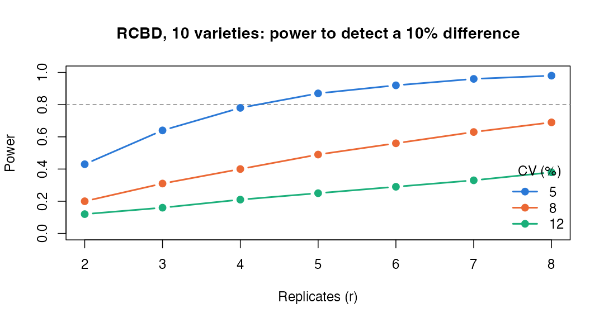
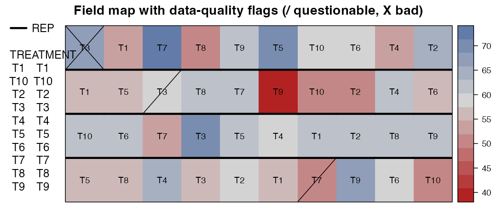

# Module 9 — Planning a Field Trial: Replicates, Power, Field Books and Data Quality

> **Sub-course: Field Experiments in Agriculture & Plant Breeding**
> [← Module 8](08-multi-environment-trials.md) · [Sub-course home](README.md) · [Next: Module 10 — Capstone →](10-capstone.md)

---

## 🧭 Learning Objectives

After this module you will be able to:

1. Compute the number of replicates for an RCBD from the coefficient of variation (CV) and the smallest difference of interest.
2. Check power by simulation for designs where formulas don't apply.
3. Plan the practical layout: plot size, borders/guard rows, alleys, check placement.
4. Produce a field book and record data-quality flags that `desplot` can display.

---

## 🎯 The Big Picture

Most field trials are planned with "4 replicates because we always use 4". Module 1 showed
that field variation can be measured, and agronomists usually know their trait's CV. With
those two numbers you can **plan replication for a difference that matters** — the field
version of [main course Ch. 8](../../chapters/08-sample-size-and-power.md). The rest of planning
is logistics that, done badly, ruin good designs: border effects, unrecorded coordinates,
missing plots, and data typed in from muddy notebooks.

---

## 🧠 Core Intuition

For an RCBD with *t* treatments and *r* replicates, the standard error of a difference is

$$\text{SED} = \sqrt{2\sigma^2/r}, \qquad \sigma = \text{CV} \times \text{mean}$$

The test of a difference Δ uses a *t* distribution with (t − 1)(r − 1) error degrees of freedom,
so power can be computed exactly from the noncentral *t* distribution.

---

## 🔬 Worked Example 1 — replicates from CV and Δ


```r
rcbd_power <- function(r, t, cv, delta_pct, alpha = 0.05) {
  df  <- (t - 1) * (r - 1)
  ncp <- delta_pct / (cv * sqrt(2 / r))              # Δ / SED, both in % of the mean
  qt_ <- qt(1 - alpha / 2, df)
  1 - pt(qt_, df, ncp) + pt(-qt_, df, ncp)
}
grid <- expand.grid(r = 2:8, cv = c(5, 8, 12))
grid$power <- round(mapply(rcbd_power, grid$r, t = 10, grid$cv, delta_pct = 10), 2)
reshape(grid, idvar = "r", timevar = "cv", direction = "wide")
```

```
#>   r power.5 power.8 power.12
#> 1 2    0.43    0.20     0.12
#> 2 3    0.64    0.31     0.16
#> 3 4    0.78    0.40     0.21
#> 4 5    0.87    0.49     0.25
#> 5 6    0.92    0.56     0.29
#> 6 7    0.96    0.63     0.33
#> 7 8    0.98    0.69     0.38
```


```r
cols <- c("5" = "#2a78d6", "8" = "#eb6834", "12" = "#1baf7a")
plot(NA, xlim = c(2, 8), ylim = c(0, 1), xlab = "Replicates (r)", ylab = "Power",
     main = "RCBD, 10 varieties: power to detect a 10% difference")
abline(h = 0.8, lty = 2, col = "grey50")
for (cv in names(cols)) {
  sub <- grid[grid$cv == as.numeric(cv), ]
  lines(sub$r, sub$power, type = "b", pch = 19, lwd = 2, col = cols[cv])
}
legend("bottomright", title = "CV (%)", legend = names(cols), col = cols, lwd = 2, pch = 19, bty = "n")
```

<div class="figure" style="text-align: center">

<p class="caption">plot of chunk power-plot</p>
</div>


For a 10% difference with 80% power you need about **5 replicates at CV = 5%,
11 at CV = 8%, and 23 at CV = 12%**. With a typical yield CV of 10–12%, the
habitual 4 replicates detect only large differences. Options: more replicates, better blocking
or spatial analysis (lower effective CV, Modules 1, 5, 7), or more environments (Module 8).

## 🔬 Worked Example 2 — power by simulation for a split-plot

Formulas get awkward for split-plots, mixed models and spatial analyses; simulation always works
([main course Ch. 8](../../chapters/08-sample-size-and-power.md); ([Morris et al., 2019](https://doi.org/10.1002/sim.8086))).


```r
library(lme4); library(lmerTest)
sim_split <- function(blocks, n_sim = 500, wp_sd = 6, res_sd = 8, effect = 8) {
  d <- expand.grid(block = factor(1:blocks), irr = factor(c("dry", "wet")), cult = factor(1:4))
  p <- replicate(n_sim, {
    wp <- rnorm(blocks * 2, 0, wp_sd)[as.integer(interaction(d$block, d$irr))]
    d$y <- 100 + effect * (d$irr == "wet") + wp + rnorm(nrow(d), 0, res_sd)
    fit <- suppressMessages(lmer(y ~ irr * cult + (1 | block) + (1 | block:irr), data = d))
    anova(fit)["irr", "Pr(>F)"]
  })
  mean(p < 0.05)
}
set.seed(9)
nb <- c(4, 6, 8, 12, 16)
sp_power <- sapply(nb, sim_split)
data.frame(blocks = nb, power_irrigation = sp_power)
```

```
#>   blocks power_irrigation
#> 1      4            0.272
#> 2      6            0.400
#> 3      8            0.596
#> 4     12            0.778
#> 5     16            0.844
```

Scenario: an 8-unit irrigation effect, whole-plot SD 6, residual SD 8. Irrigation (a whole-plot
factor) is tested against the whole-plot error with only *blocks − 1* degrees of freedom, and its
variance includes the whole-plot variance, which more sub-plots cannot reduce. Here power reaches
80% only at about 16
blocks — far more than the usual 4. (500 simulations per setting; values carry Monte-Carlo error of
about ±2 percentage points.)

---

## 👁️ Visual Intuition — from design to field book to data quality


```r
library(FielDHub); library(desplot)
plan <- RCBD(t = 10, reps = 4, l = 1, plotNumber = 101, seed = 31)
fb <- plan$fieldBook
fb$ROW <- fb$REP                       # each replicate is one row of 10 plots (serpentine numbering not needed here)
fb$COLUMN <- ave(fb$PLOT, fb$REP, FUN = seq_along)
head(fb)
```

```
#>   ID LOCATION PLOT REP TREATMENT ROW COLUMN
#> 1  1     loc1  101   1        T5   1      1
#> 2  2     loc1  102   1        T8   1      2
#> 3  3     loc1  103   1        T4   1      3
#> 4  4     loc1  104   1        T3   1      4
#> 5  5     loc1  105   1        T2   1      5
#> 6  6     loc1  106   1        T1   1      6
```

```r
# write.csv(fb, "fieldbook_trial2026.csv", row.names = FALSE)   # take this to the field
```

During the season, record problems — hail damage, animal damage, missing plants — as a
**data-quality** column rather than deleting plots. `desplot` can show them:


```r
set.seed(4)
fb$yield <- round(rnorm(nrow(fb), 60, 6), 1)          # illustrative yields
fb$dq <- 0; fb$dq[c(7, 23)] <- 1; fb$dq[31] <- 2       # 1 = questionable, 2 = bad
desplot(fb, yield ~ COLUMN * ROW, out1 = REP, text = TREATMENT, cex = 0.8, shorten = "no",
        dq = dq, main = "Field map with data-quality flags (/ questionable, X bad)")
```

<div class="figure" style="text-align: center">

<p class="caption">plot of chunk dq-map</p>
</div>

---

## 🧠 Practical checklist

| Item | Why |
|---|---|
| **Guard rows/borders** around each plot or the trial | border plants grow differently (edge effects) |
| **Plot size and shape** from Module 1 and machinery width | precision vs cost; long plots across gradients |
| **Alleys** between replicates if needed for access | not between plots of the same block, which would break homogeneity |
| **Coordinates** (row, column, planting direction) | spatial analysis (Module 7) |
| **Randomization seed and software** in the protocol | reproducibility, proof of a priori randomization |
| **Field book** generated before sowing; barcode labels | prevents mix-ups |
| **Data-quality flags** instead of deletions | transparent handling of damage |
| **Pre-specified analysis** and exclusion rules | avoids post hoc choices ([main course Ch. 25](../../chapters/25-preregistration-and-reporting.md)) |

---

## ⚠️ Common Misconceptions

| ❌ The misconception | ✅ What is actually true — and what to do |
|---|---|
| **"Four replicates are standard, so they're enough."** | Compute power from your CV. |
| **"Damaged plots should be deleted silently."** | Flag them; decide inclusion by a pre-specified rule. |
| **"Borders are a waste of land."** | Without them, neighbouring treatments interfere (especially with tall vs short varieties or fertilizer drift). |
| **"Simulation is only for statisticians."** | Twenty lines of R, as above. |

---

## 🧪 Spot the Flaw

> "Tall and dwarf wheat varieties were grown in adjacent single-row plots without borders.
> Dwarf varieties yielded 15% less than expected."

<details>
<summary>▶ Diagnosis</summary>

**Inter-plot competition**: tall neighbours shade dwarf plots. Use multi-row plots and harvest
only the inner rows, or group varieties by height into separate blocks/trials.
</details>

---

## 🔎 The Reviewer's Perspective

- **"How was the number of replicates justified (CV, Δ, power)?"**
- **"Plot size, borders, harvested area?"**
- **"How were damaged or missing plots handled?"**

---

## 🛠️ Design Challenge

Your trait has CV = 9%. You want to detect a 7% difference among 12 varieties with 80% power.
How many replicates? If the field allows only 4, what is your power, and what else could you do?

<details>
<summary>▶ Model solution</summary>


```r
r_needed <- min(which(sapply(2:30, rcbd_power, t = 12, cv = 9, delta_pct = 7) >= 0.8)) + 1
c(replicates_needed = r_needed, power_with_4 = round(rcbd_power(4, 12, 9, 7), 2))
```

```
#> replicates_needed      power_with_4 
#>             27.00              0.19
```

With 4 replicates power is low. Alternatives: reduce the effective CV (incomplete blocks, spatial
analysis), test at more locations, or accept that only larger differences (e.g. 12%) can be detected
and state this in the protocol.
</details>

---

## 🧑‍💻 Code-along Exercises

1. Estimate the CV of `mead.strawberry` (Module 2) from the RCBD residual and plan a follow-up trial.
2. Modify `sim_split()` to compute power for the cultivar effect (sub-plot factor). Why is it higher?
3. Generate a full field book with `FielDHub::alpha_lattice()` and add barcode-ready plot IDs.

---

## ✅ Check Your Understanding

**⭐ Q1.** Which two numbers do you need to plan replication for an RCBD?

**⭐ Q2.** Why record data-quality flags instead of deleting plots?

**⭐⭐ Q3.** Why does a whole-plot factor need more blocks than a sub-plot factor for the same power?

**⭐⭐ Q4.** What are guard rows for?

**⭐⭐⭐ Q5.** Write the "sample size" paragraph for the protocol of the Design Challenge.

---

## 📝 Sample Answers & Assessment

<details>
<summary>▶ Show sample answers</summary>

> **Q1 — Sample answer:** *"CV and the smallest difference of interest."* — **✔ 10/10.** (Plus α and target power.)

> **Q2 — Sample answer:** *"So decisions are transparent and pre-specified."* — **✔ 10/10.**

> **Q3 — Sample answer:** *"It has fewer units and larger error."* — **✔ 10/10.**

> **Q4 — Sample answer:** *"To avoid edge and neighbour effects."* — **✔ 10/10.**

> **Q5 — Sample answer:** *"We will use 4 reps."* — **✘ 2/10.** A good paragraph: "Based on a CV of 9% from trials at this site in 2023–2025, an RCBD with 27 replicates gives 80% power to detect a 7% difference between two varieties (two-sided α = 0.05, 11 × (r − 1) error d.f.). Because the field allows 4 replicates, we will use an α-design with spatial analysis and test at two locations; with 4 replicates per location the trial has 0.19 power at one site."

**Rubric:** full credit needs all ingredients and an honest statement of what can be detected.
</details>

---

## 🧾 Module Summary

| Concept | One-line takeaway |
|---|---|
| **Replication** | From CV and Δ via the noncentral *t*; 4 reps is a habit, not a plan. |
| **Simulation** | Plans complex designs (split-plot, spatial, MET). |
| **Logistics** | Borders, plot size, coordinates, seeds, field books. |
| **Data quality** | Flag, don't delete; decide by pre-specified rules. |

### 📇 Field Design Card — rows for this module

| Field | Your answer |
|---|---|
| CV source and value; Δ; power → replicates | |
| Plot size, borders, harvested area | |
| Field book and labelling | |
| Data-quality and exclusion rules | |

---

## 🔗 Go Deeper

- Main course: [Ch. 8 — Sample Size](../../chapters/08-sample-size-and-power.md) · [Ch. 25 — Pre-registration](../../chapters/25-preregistration-and-reporting.md)
- Software: ([Murillo et al., 2021](https://doi.org/10.21105/joss.03122); [Wright & Schmidt, 2015](https://doi.org/10.32614/cran.package.desplot))

## 📚 References cited in this chapter

- Morris TP, White IR, Crowther MJ (2019). Using simulation studies to evaluate statistical methods. *Statistics in Medicine* 38:2074-2102. [doi:10.1002/sim.8086](https://doi.org/10.1002/sim.8086)
- Murillo D, Gezan S, Heilman A, Walk T, Aparicio J, Horsley R (2021). FielDHub: A Shiny App for Design of Experiments in Life Sciences. *Journal of Open Source Software* 6:3122. [doi:10.21105/joss.03122](https://doi.org/10.21105/joss.03122)
- Wright K, Schmidt P (2015). desplot: Plotting Field Plans for Agricultural Experiments. *CRAN: Contributed Packages*. [doi:10.32614/cran.package.desplot](https://doi.org/10.32614/cran.package.desplot)


---

[← Module 8](08-multi-environment-trials.md) · [Sub-course home](README.md) · [Next: Module 10 — Capstone →](10-capstone.md)
