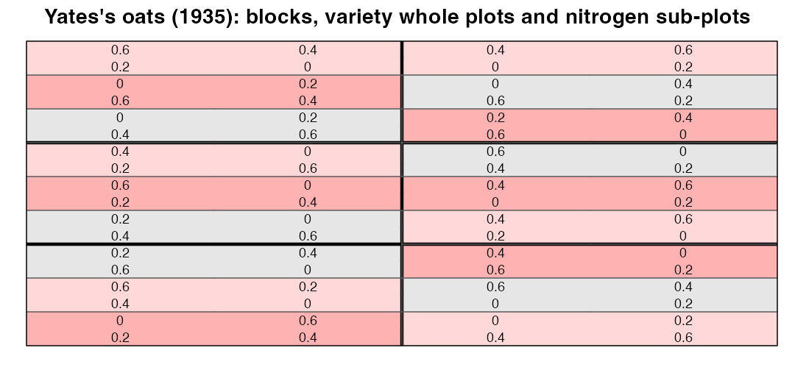

# Field Experiments in Agriculture & Plant Breeding — a hands-on sub-course

> Part of [**Designing Experiments in Biology — From Question to Protocol**](../../README.md).
> The main course teaches design principles for every field; this sub-course goes deep into
> **agricultural field trials**, with real datasets, real field maps, and R code you can run.

<div class="figure" style="text-align: center">

<p class="caption">plot of chunk cover</p>
</div>

---

## Why this sub-course

Agriculture is where randomization, replication and blocking were invented, and field trials
still pose design problems in their hardest form: heterogeneous fields, hundreds of entries,
scarce seed, hard-to-change factors and genotype × environment interaction. This sub-course
teaches the designs and analyses that plant breeders and agronomists actually use, built around
three excellent R tools:

- [**desplot**](https://kwstat.github.io/desplot/) ([Wright & Schmidt, 2015](https://doi.org/10.32614/cran.package.desplot)) — maps of field designs and data;
- [**agridat**](https://kwstat.github.io/agridat/) ([Wright, 2011](https://doi.org/10.32614/cran.package.agridat)) — hundreds of real agricultural datasets;
- [**FielDHub**](https://didiermurillof.github.io/FielDHub/) ([Murillo et al., 2021](https://doi.org/10.21105/joss.03122)) and `agricolae` ([Felipe de Mendiburu, 2006](https://doi.org/10.32614/cran.package.agricolae)) — generation of designs and field books;

plus `lme4`/`lmerTest` ([Bates et al., 2015](https://doi.org/10.18637/jss.v067.i01); [Kuznetsova et al., 2017](https://doi.org/10.18637/jss.v082.i13)), `emmeans` ([Lenth, 2016](https://doi.org/10.18637/jss.v069.i01)) and `SpATS`
([Rodríguez-Álvarez et al., 2018](https://doi.org/10.1016/j.spasta.2017.10.003)) for analysis. The approach is inspired by open teaching material such as Paul
Schmidt's [*Mixed Models for Agriculture in R*](https://github.com/SchmidtPaul/MMFAIR) and
[*Data Science for Agriculture in R*](https://github.com/SchmidtPaul/dsfair_quarto).

## Who it is for

Students and researchers in agronomy, plant breeding, horticulture, forestry, soil science and
animal science who will design or analyse field trials. Prerequisites: main course Parts I–II
(Chapters 1–8) and basic R.

## How each module works

Every module follows the main course rhythm — 🧭 objectives, 🎯 big picture, 🧠 intuition,
👁️ visual (real field maps), 🔬 worked example, ⚠️ misconceptions, 🧪 spot the flaw,
🔎 reviewer's perspective, 🛠️ design challenge, ✅ questions, 📝 sample answers, 🧾 summary —
plus **🧑‍💻 code-along exercises**. Every number in the text is computed by the code shown.

## Modules

| # | Module | Key tools/data |
|---|---|---|
| 1 | [Reading the Field: Heterogeneity and Uniformity Trials](01-field-heterogeneity.md) | `mercer.wheat.uniformity`, Smith's law, dummy experiments |
| 2 | [From Randomization to Analysis: CRD and RCBD](02-crd-and-rcbd.md) | `agricolae`, `FielDHub::RCBD`, `mead.strawberry`, `emmeans` |
| 3 | [Two Gradients at Once: Latin Squares and Row–Column Designs](03-latin-square-and-row-column.md) | `design.lsd`, `goulden.latin` |
| 4 | [Factorials, Split-Plots and Strip-Plots](04-factorial-split-strip.md) | `yates.oats`, two error strata |
| 5 | [Incomplete Blocks: Lattice and α-Designs](05-incomplete-blocks-alpha.md) | `design.alpha`, `john.alpha`, recovery of information |
| 6 | [Augmented and Partially Replicated Designs](06-augmented-and-prep.md) | `FielDHub::RCBD_augmented`, `partially_replicated`, `kling.augmented` |
| 7 | [Spatial Analysis](07-spatial-analysis.md) | `SpATS`, `gilmour.slatehall` |
| 8 | [Multi-Environment Trials and G × E](08-multi-environment-trials.md) | `besag.met`, variance components, locations vs replicates |
| 9 | [Planning a Field Trial](09-planning-field-trials.md) | power from CV, simulation, field books, data-quality flags |
| 10 | [Capstone: Design, Simulate, Analyse and Defend](10-capstone.md) | full simulated breeding trial; selection accuracy |

## Setup

```r
install.packages(c("agridat", "desplot", "agricolae", "FielDHub", "lme4", "lmerTest",
                   "emmeans", "multcomp", "multcompView", "SpATS"))
```

## How this sub-course is built

Sources are R Markdown files in [`rmd/`](rmd/). `scripts/08_knit_subcourses.R` runs the code and
writes the Markdown and figures; `scripts/07_build_course.py` turns `[@key]` citations into
DOI links. Edit the `.Rmd` files, never the generated `.md`.

## 📚 References cited in this chapter

- Bates D, Mächler M, Bolker B, Walker S (2015). Fitting Linear Mixed-Effects Models Using lme4. *Journal of Statistical Software* 67. [doi:10.18637/jss.v067.i01](https://doi.org/10.18637/jss.v067.i01)
- Felipe de Mendiburu (2006). agricolae: Statistical Procedures for Agricultural Research. *CRAN: Contributed Packages*. [doi:10.32614/cran.package.agricolae](https://doi.org/10.32614/cran.package.agricolae)
- Kuznetsova A, Brockhoff PB, Christensen RHB (2017). lmerTest Package: Tests in Linear Mixed Effects Models. *Journal of Statistical Software* 82. [doi:10.18637/jss.v082.i13](https://doi.org/10.18637/jss.v082.i13)
- Lenth RV (2016). Least-Squares Means: The R Package lsmeans. *Journal of Statistical Software* 69. [doi:10.18637/jss.v069.i01](https://doi.org/10.18637/jss.v069.i01)
- Murillo D, Gezan S, Heilman A, Walk T, Aparicio J, Horsley R (2021). FielDHub: A Shiny App for Design of Experiments in Life Sciences. *Journal of Open Source Software* 6:3122. [doi:10.21105/joss.03122](https://doi.org/10.21105/joss.03122)
- Rodríguez-Álvarez MX, Boer MP, van Eeuwijk FA, Eilers PHC (2018). Correcting for spatial heterogeneity in plant breeding experiments with P-splines. *Spatial Statistics* 23:52-71. [doi:10.1016/j.spasta.2017.10.003](https://doi.org/10.1016/j.spasta.2017.10.003)
- Wright K, Schmidt P (2015). desplot: Plotting Field Plans for Agricultural Experiments. *CRAN: Contributed Packages*. [doi:10.32614/cran.package.desplot](https://doi.org/10.32614/cran.package.desplot)
- Wright K (2011). agridat: Agricultural Datasets. *CRAN: Contributed Packages*. [doi:10.32614/cran.package.agridat](https://doi.org/10.32614/cran.package.agridat)

